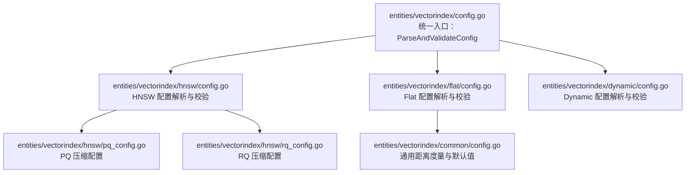
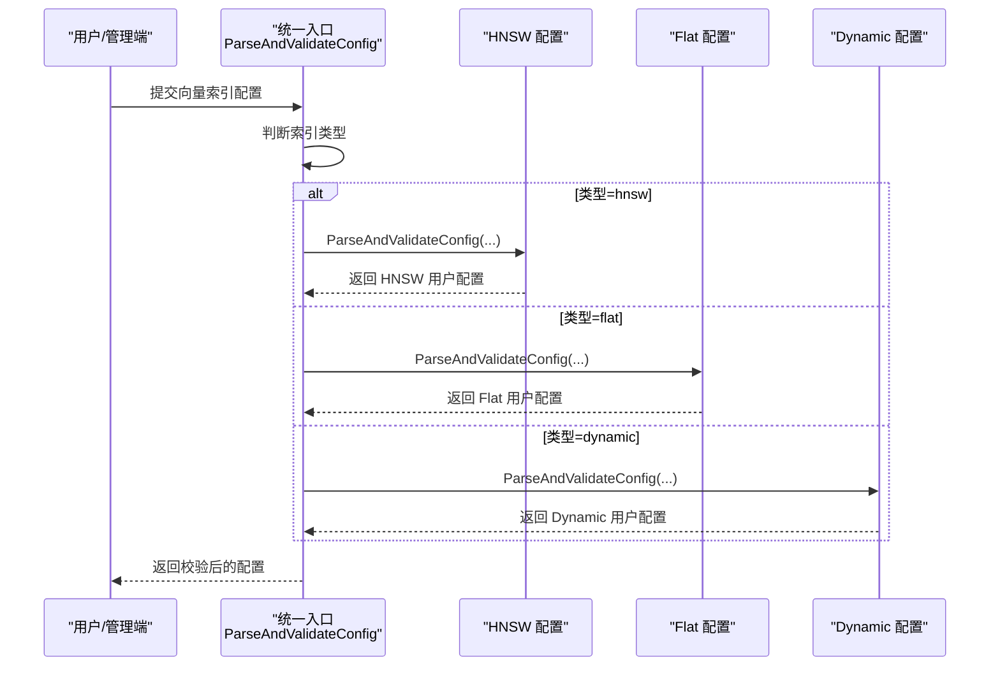
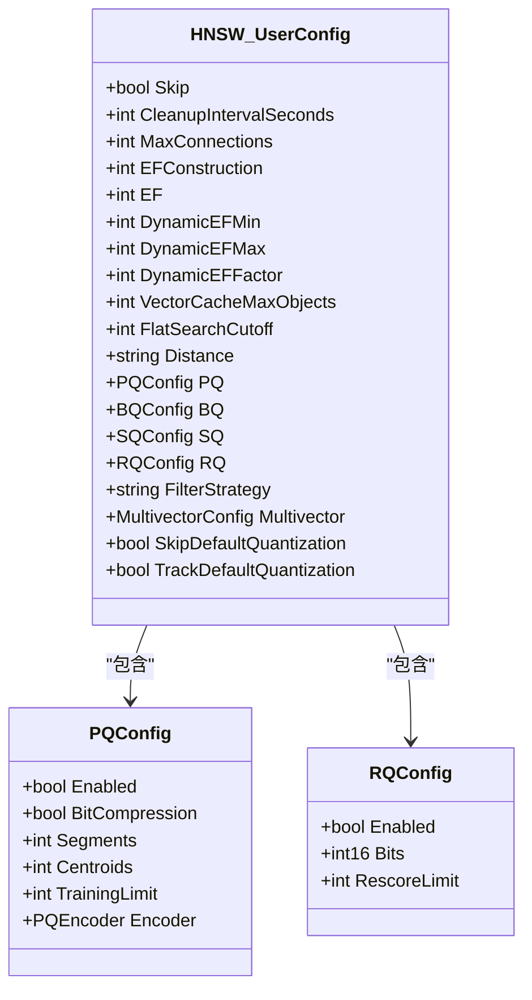
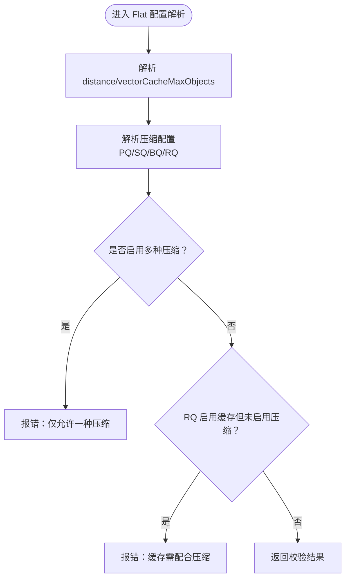
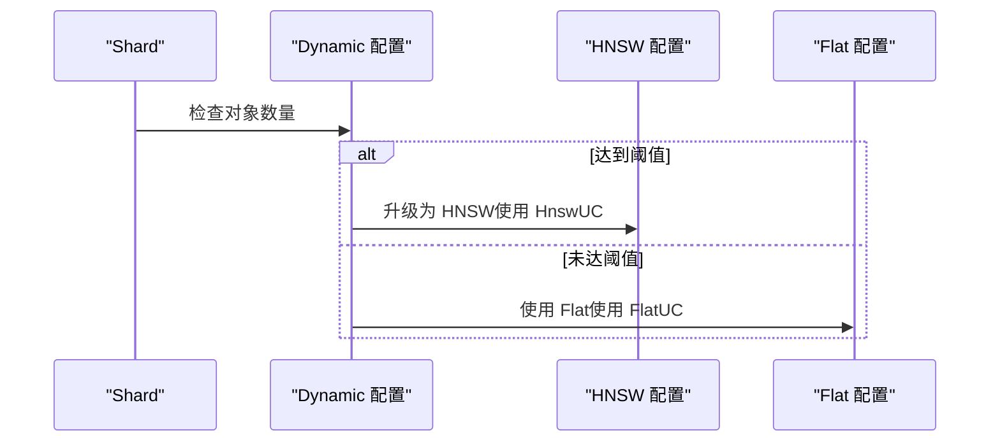
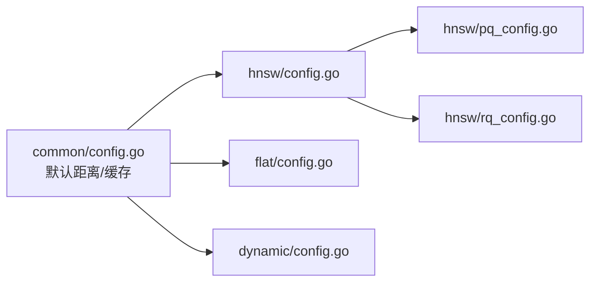

# 索引配置与优化

<cite>
**本文引用的文件**
- [entities/vectorindex/config.go](file://entities/vectorindex/config.go)
- [entities/vectorindex/hnsw/config.go](file://entities/vectorindex/hnsw/config.go)
- [entities/vectorindex/hnsw/pq_config.go](file://entities/vectorindex/hnsw/pq_config.go)
- [entities/vectorindex/hnsw/rq_config.go](file://entities/vectorindex/hnsw/rq_config.go)
- [entities/vectorindex/flat/config.go](file://entities/vectorindex/flat/config.go)
- [entities/vectorindex/dynamic/config.go](file://entities/vectorindex/dynamic/config.go)
- [adapters/repos/db/shard_dimension_tracking.go](file://adapters/repos/db/shard_dimension_tracking.go)
- [adapters/repos/db/vector/hnsw/metrics.go](file://adapters/repos/db/vector/hnsw/metrics.go)
- [adapters/repos/db/vector/hfresh/metrics.go](file://adapters/repos/db/vector/hfresh/metrics.go)
- [adapters/repos/db/vector/hnsw/compress_sift_test.go](file://adapters/repos/db/vector/hnsw/compress_sift_test.go)
- [adapters/repos/db/vector/hnsw/flat_search_test.go](file://adapters/repos/db/vector/hnsw/flat_search_test.go)
- [adapters/repos/db/vector/flat/index_test.go](file://adapters/repos/db/vector/flat/index_test.go)
- [adapters/repos/db/vector/flat/metadata.go](file://adapters/repos/db/vector/flat/metadata.go)
- [adapters/repos/db/vector/hnsw/delete_test.go](file://adapters/repos/db/vector/hnsw/delete_test.go)
- [adapters/repos/db/vector/hnsw/index_test.go](file://adapters/repos/db/vector/hnsw/index_test.go)
- [entities/vectorindex/common/config.go](file://entities/vectorindex/common/config.go)
</cite>

## 目录
1. [简介](#简介)
2. [项目结构](#项目结构)
3. [核心组件](#核心组件)
4. [架构总览](#架构总览)
5. [详细组件分析](#详细组件分析)
6. [依赖关系分析](#依赖关系分析)
7. [性能考量](#性能考量)
8. [故障排查指南](#故障排查指南)
9. [结论](#结论)
10. [附录](#附录)

## 简介
本技术文档聚焦 Weaviate 向量索引的配置与优化，覆盖以下内容：
- HNSW 索引的关键参数：maxConnections（M）、efConstruction、ef、动态 ef（dynamicEfMin/Max/Factor）、过滤策略、压缩配置（PQ/SQ/RQ/BQ）等
- Flat 索引的配置项与限制
- Dynamic 索引在数据规模阈值下的自动切换机制与默认量化策略
- 参数对性能与内存的影响分析
- 不同场景下的配置建议与最佳实践
- 索引重建、参数调优与性能监控方法
- 配置变更的影响评估与回滚策略

## 项目结构
Weaviate 将向量索引类型抽象为统一接口，并按类型拆分配置解析与校验逻辑：
- 统一入口：根据类型选择具体索引配置解析器
- HNSW：支持压缩、过滤策略、多向量聚合等高级特性
- Flat：支持 BQ、RQ 压缩（PQ/SQ 当前不支持）
- Dynamic：基于阈值在 HNSW 与 Flat 间自动切换

图表来源
- [entities/vectorindex/config.go](file://entities/vectorindex/config.go#L32-L51)
- [entities/vectorindex/hnsw/config.go](file://entities/vectorindex/hnsw/config.go#L140-L258)
- [entities/vectorindex/flat/config.go](file://entities/vectorindex/flat/config.go#L88-L130)
- [entities/vectorindex/dynamic/config.go](file://entities/vectorindex/dynamic/config.go#L65-L125)
- [entities/vectorindex/hnsw/pq_config.go](file://entities/vectorindex/hnsw/pq_config.go#L132-L196)
- [entities/vectorindex/hnsw/rq_config.go](file://entities/vectorindex/hnsw/rq_config.go#L45-L79)
- [entities/vectorindex/common/config.go](file://entities/vectorindex/common/config.go#L22-L40)

章节来源
- [entities/vectorindex/config.go](file://entities/vectorindex/config.go#L24-L51)

## 核心组件
- HNSW 用户配置（entities/vectorindex/hnsw/config.go）
  - 关键字段：maxConnections（M）、efConstruction、ef、dynamicEfMin/Max/Factor、flatSearchCutoff、filterStrategy、压缩配置（PQ/SQ/RQ/BQ）、多向量配置、跳过/跟踪默认量化
  - 默认值与最小/最大边界：如 M 的范围、efConstruction 最小值、动态 ef 的默认区间与因子
- Flat 用户配置（entities/vectorindex/flat/config.go）
  - 关键字段：distance、vectorCacheMaxObjects、压缩配置（PQ/SQ/RQ/BQ），其中当前版本不支持 PQ/SQ
  - RQ 支持 1/8 bit，bits 必须为 1 或 8；启用缓存需同时启用压缩
- Dynamic 用户配置（entities/vectorindex/dynamic/config.go）
  - 关键字段：distance、threshold、嵌套 HNSW/Flat 用户配置
  - 默认阈值与类型校验：当启用多向量时拒绝动态索引
- 通用配置与默认值（entities/vectorindex/common/config.go）
  - 距离度量常量、默认向量缓存大小、从 map 解析可选字段的工具函数

章节来源
- [entities/vectorindex/hnsw/config.go](file://entities/vectorindex/hnsw/config.go#L47-L136)
- [entities/vectorindex/flat/config.go](file://entities/vectorindex/flat/config.go#L43-L84)
- [entities/vectorindex/dynamic/config.go](file://entities/vectorindex/dynamic/config.go#L28-L61)
- [entities/vectorindex/common/config.go](file://entities/vectorindex/common/config.go#L22-L40)

## 架构总览
Weaviate 在启动或更新索引配置时，通过统一入口解析并校验用户输入，随后根据索引类型实例化对应索引。HNSW/Flat/Dynamic 分别承载不同的构建、查询与压缩路径。

图表来源
- [entities/vectorindex/config.go](file://entities/vectorindex/config.go#L32-L51)
- [entities/vectorindex/hnsw/config.go](file://entities/vectorindex/hnsw/config.go#L140-L258)
- [entities/vectorindex/flat/config.go](file://entities/vectorindex/flat/config.go#L88-L130)
- [entities/vectorindex/dynamic/config.go](file://entities/vectorindex/dynamic/config.go#L65-L125)

## 详细组件分析

### HNSW 索引配置与参数
- 关键参数与默认值
  - M（maxConnections）：默认 32，范围 [4, 2047]
  - efConstruction：默认 128，最小 4
  - ef：默认 -1（由系统选择）
  - 动态 ef：默认 min=100、max=500、factor=8
  - flatSearchCutoff：默认 40000
  - 过滤策略：默认 acorn，可选 sweeping 或 acorn
  - 跳过/跟踪默认量化：skipDefaultQuantization、trackDefaultQuantization
- 压缩配置
  - PQ：segments、centroids、trainingLimit、encoder（type、distribution）、bitCompression
  - SQ：trainingLimit、rescoreLimit
  - RQ：enabled、bits（1 或 8）、rescoreLimit；当 bits=1 且未显式设置 rescoreLimit 时采用默认高阈值
  - BQ：启用位压缩
  - 校验规则：同一时间仅允许一种压缩方式启用
- 多向量配置
  - 支持多向量聚合与 Muvera 参数；动态索引不支持多向量

图表来源
- [entities/vectorindex/hnsw/config.go](file://entities/vectorindex/hnsw/config.go#L47-L136)
- [entities/vectorindex/hnsw/pq_config.go](file://entities/vectorindex/hnsw/pq_config.go#L43-L51)
- [entities/vectorindex/hnsw/rq_config.go](file://entities/vectorindex/hnsw/rq_config.go#L28-L32)

章节来源
- [entities/vectorindex/hnsw/config.go](file://entities/vectorindex/hnsw/config.go#L24-L45)
- [entities/vectorindex/hnsw/config.go](file://entities/vectorindex/hnsw/config.go#L140-L258)
- [entities/vectorindex/hnsw/pq_config.go](file://entities/vectorindex/hnsw/pq_config.go#L27-L35)
- [entities/vectorindex/hnsw/rq_config.go](file://entities/vectorindex/hnsw/rq_config.go#L21-L26)

### Flat 索引配置与限制
- 关键参数
  - distance、vectorCacheMaxObjects
  - 压缩配置：PQ/SQ（当前版本不支持）、BQ、RQ（bits=1 或 8）
  - RQ 缓存要求：启用缓存必须同时启用压缩
- 默认行为
  - 默认禁用压缩，RQ 默认 8 bit
  - 不支持同时启用多种压缩方式

图表来源
- [entities/vectorindex/flat/config.go](file://entities/vectorindex/flat/config.go#L156-L231)

章节来源
- [entities/vectorindex/flat/config.go](file://entities/vectorindex/flat/config.go#L22-L52)
- [entities/vectorindex/flat/config.go](file://entities/vectorindex/flat/config.go#L156-L231)

### Dynamic 索引：阈值切换与默认量化
- 关键参数
  - threshold：默认 10000；达到阈值后升级为 HNSW 或 Flat
  - 嵌套配置：HnswUC（HNSW 用户配置）、FlatUC（Flat 用户配置）
- 行为约束
  - 动态索引不支持多向量
  - 可对 HNSW/Flat 子配置分别应用默认量化策略

图表来源
- [entities/vectorindex/dynamic/config.go](file://entities/vectorindex/dynamic/config.go#L28-L61)
- [entities/vectorindex/dynamic/config.go](file://entities/vectorindex/dynamic/config.go#L65-L125)

章节来源
- [entities/vectorindex/dynamic/config.go](file://entities/vectorindex/dynamic/config.go#L24-L26)
- [entities/vectorindex/dynamic/config.go](file://entities/vectorindex/dynamic/config.go#L90-L124)

### 压缩信息提取与维度分类
- HNSW：优先级顺序为 PQ > BQ > SQ > RQ（bits），否则标准索引
- Flat：当前仅支持 BQ/RQ（PQ/SQ 不支持）
- Dynamic：根据当前模式（已升级与否）提取对应压缩信息

章节来源
- [adapters/repos/db/shard_dimension_tracking.go](file://adapters/repos/db/shard_dimension_tracking.go#L184-L222)

## 依赖关系分析
- 统一入口依赖各索引类型的具体实现
- HNSW/Flat/Dynamic 共享通用距离度量与默认值
- HNSW 支持多种压缩方式，Flat 当前限制较多

图表来源
- [entities/vectorindex/common/config.go](file://entities/vectorindex/common/config.go#L22-L40)
- [entities/vectorindex/hnsw/config.go](file://entities/vectorindex/hnsw/config.go#L47-L136)
- [entities/vectorindex/flat/config.go](file://entities/vectorindex/flat/config.go#L43-L84)
- [entities/vectorindex/dynamic/config.go](file://entities/vectorindex/dynamic/config.go#L28-L61)
- [entities/vectorindex/hnsw/pq_config.go](file://entities/vectorindex/hnsw/pq_config.go#L43-L51)
- [entities/vectorindex/hnsw/rq_config.go](file://entities/vectorindex/hnsw/rq_config.go#L28-L32)

章节来源
- [entities/vectorindex/config.go](file://entities/vectorindex/config.go#L32-L51)

## 性能考量
- HNSW 参数对性能与内存的影响
  - M（maxConnections）：增大连接数提升召回与质量，但显著增加内存占用与构建成本
  - efConstruction：越大构建越慢、质量越高，通常与 M 成正比
  - ef：影响查询精度与延迟；过大导致延迟上升，过小召回下降
  - 动态 ef：在大规模数据下自动调节 ef，平衡延迟与召回
  - flatSearchCutoff：超过该阈值时切换为线性搜索，避免 HNSW 层级过深带来的额外开销
  - 压缩（PQ/SQ/RQ/BQ）：降低存储与带宽，提高吞吐；RQ 1bit 与 BQ 在大维度场景更省空间
- Flat 索引
  - 查询复杂度 O(n)，适合中小规模或对延迟极敏感场景
  - RQ 1bit 在超大维度下显著节省内存
- Dynamic 索引
  - 以阈值驱动自动切换，兼顾小规模效率与大规模扩展性

章节来源
- [entities/vectorindex/hnsw/config.go](file://entities/vectorindex/hnsw/config.go#L24-L45)
- [entities/vectorindex/hnsw/config.go](file://entities/vectorindex/hnsw/config.go#L260-L319)
- [entities/vectorindex/flat/config.go](file://entities/vectorindex/flat/config.go#L22-L28)
- [adapters/repos/db/shard_dimension_tracking.go](file://adapters/repos/db/shard_dimension_tracking.go#L184-L222)

## 故障排查指南
- 常见错误与定位
  - HNSW 参数越界：maxConnections 超出范围、efConstruction 小于最小值、过滤策略非法
  - 多压缩启用冲突：同一索引仅允许一种压缩启用
  - Flat RQ 缓存未启用压缩：启用缓存需同时启用压缩
- 性能问题诊断
  - 查询延迟高：检查 ef、动态 ef 设置；考虑增大 ef 或调整 factor/min/max
  - 内存占用高：评估压缩策略（PQ/SQ/RQ/BQ）与缓存大小；必要时启用 RQ 1bit 或 BQ
  - 线上重建/升级
    - HNSW 压缩：参考基准测试流程，先构建索引再执行压缩，确保查询一致性
    - Flat RQ 数据捕获：通过指标与元数据确认压缩参数与维度信息
- 监控指标
  - HNSW：插入/删除耗时、尺寸、墓碑清理线程与计数、后台维护时长
  - HFresh：向量索引尺寸、操作次数与时延、后台任务挂起与执行时长
  - Flat：维度计算与元数据持久化

章节来源
- [entities/vectorindex/hnsw/config.go](file://entities/vectorindex/hnsw/config.go#L260-L319)
- [entities/vectorindex/flat/config.go](file://entities/vectorindex/flat/config.go#L194-L231)
- [adapters/repos/db/vector/hnsw/metrics.go](file://adapters/repos/db/vector/hnsw/metrics.go#L53-L157)
- [adapters/repos/db/vector/hfresh/metrics.go](file://adapters/repos/db/vector/hfresh/metrics.go#L48-L265)
- [adapters/repos/db/vector/flat/metadata.go](file://adapters/repos/db/vector/flat/metadata.go#L155-L224)

## 结论
- HNSW 适合大规模、高召回场景，需权衡 M、efConstruction、ef 与压缩策略
- Flat 适合中小规模或对延迟敏感场景，RQ 1bit 在大维度下具备显著内存优势
- Dynamic 通过阈值实现自动切换，简化运维复杂度
- 建议结合业务规模与 SLA，以基准测试与监控指标驱动参数迭代

## 附录

### 不同场景下的配置建议与最佳实践
- 小规模（<10W）高延迟敏感
  - 推荐 Flat + RQ 1bit 或 BQ，关闭压缩缓存以减少额外开销
- 中等规模（10W–100W）
  - 推荐 HNSW，默认 efConstruction 与 ef，动态 ef 区间 [min=100, max=500, factor=8]，启用 RQ 8bit 或 BQ
- 大规模（>100W）
  - 推荐 HNSW + 压缩（PQ/SQ/RQ/BQ），结合动态 ef 自适应；必要时启用 Dynamic 并设置合理阈值
- 多向量场景
  - 仅 HNSW 支持多向量聚合；Dynamic 不支持多向量

章节来源
- [entities/vectorindex/hnsw/config.go](file://entities/vectorindex/hnsw/config.go#L24-L45)
- [entities/vectorindex/dynamic/config.go](file://entities/vectorindex/dynamic/config.go#L24-L26)

### 索引重建、参数调优与性能监控方法
- HNSW 压缩流程（参考基准测试）
  - 构建索引 → 压缩 → 查询一致性验证 → 对比召回与延迟
- Flat RQ 数据捕获
  - 通过指标与元数据确认维度、压缩参数与旋转矩阵信息
- 监控要点
  - 插入/删除时延、索引尺寸、后台任务挂起与执行时长、墓碑清理状态

章节来源
- [adapters/repos/db/vector/hnsw/compress_sift_test.go](file://adapters/repos/db/vector/hnsw/compress_sift_test.go#L385-L536)
- [adapters/repos/db/vector/hnsw/flat_search_test.go](file://adapters/repos/db/vector/hnsw/flat_search_test.go#L98-L124)
- [adapters/repos/db/vector/flat/index_test.go](file://adapters/repos/db/vector/flat/index_test.go#L1199-L1348)
- [adapters/repos/db/vector/flat/metadata.go](file://adapters/repos/db/vector/flat/metadata.go#L336-L380)
- [adapters/repos/db/vector/hnsw/metrics.go](file://adapters/repos/db/vector/hnsw/metrics.go#L53-L157)
- [adapters/repos/db/vector/hfresh/metrics.go](file://adapters/repos/db/vector/hfresh/metrics.go#L48-L265)

### 配置变更的影响分析与回滚策略
- 影响分析
  - 参数变更可能改变内存占用、查询延迟与召回率；压缩策略会改变存储与带宽消耗
  - Dynamic 阈值变更可能导致索引类型切换，需评估查询路径变化
- 回滚策略
  - 记录变更前的配置快照；若变更导致性能退化，恢复至快照
  - 对于压缩升级，保留旧版本索引副本，逐步迁移并对比指标

章节来源
- [entities/vectorindex/dynamic/config.go](file://entities/vectorindex/dynamic/config.go#L65-L125)
- [adapters/repos/db/vector/hnsw/delete_test.go](file://adapters/repos/db/vector/hnsw/delete_test.go#L1004-L1506)
- [adapters/repos/db/vector/hnsw/index_test.go](file://adapters/repos/db/vector/hnsw/index_test.go#L88-L116)