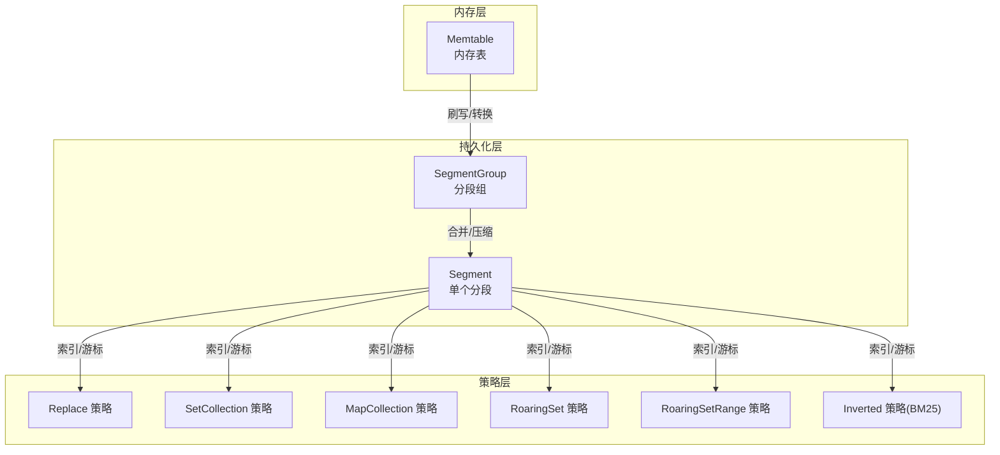
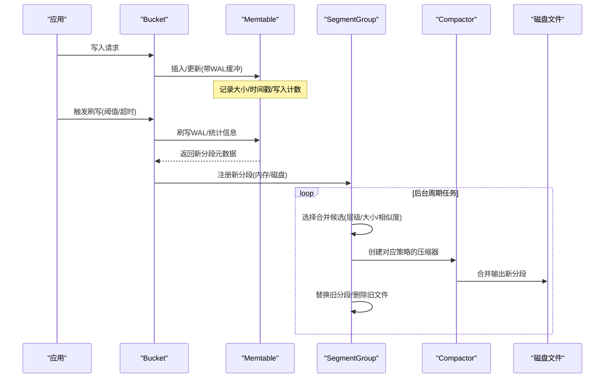
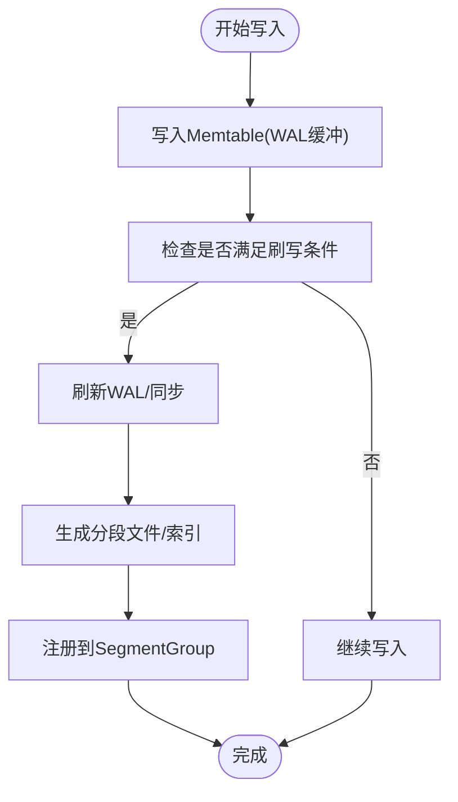
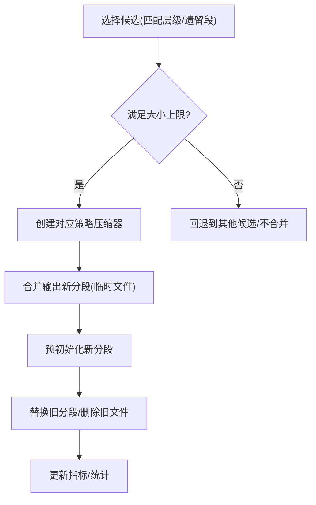
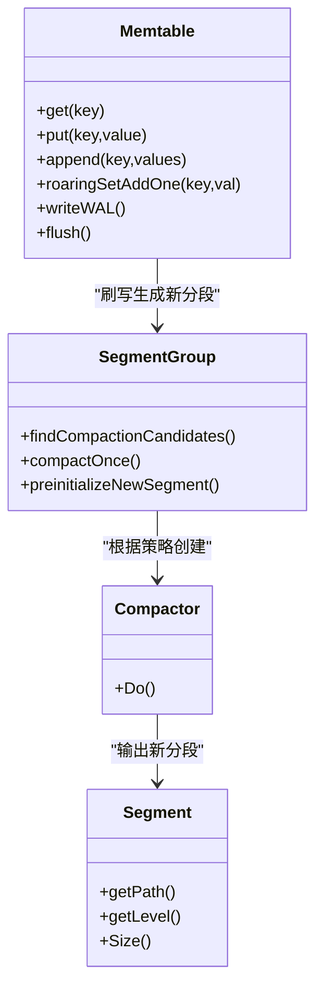
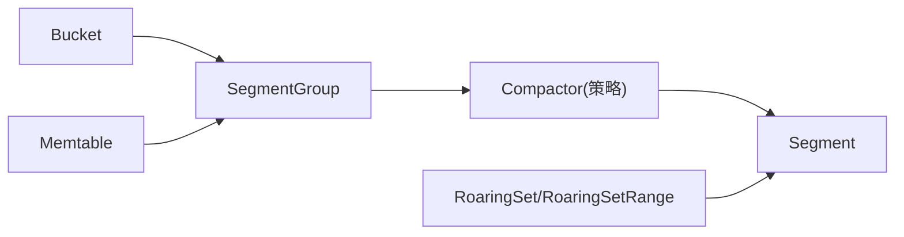

# LSM-Tree 存储引擎

<cite>
**本文引用的文件**
- [adapters/repos/db/lsmkv/memtable.go](file://adapters/repos/db/lsmkv/memtable.go)
- [adapters/repos/db/lsmkv/bucket.go](file://adapters/repos/db/lsmkv/bucket.go)
- [adapters/repos/db/lsmkv/segment_group_compaction.go](file://adapters/repos/db/lsmkv/segment_group_compaction.go)
- [adapters/repos/db/lsmkv/segment_group.go](file://adapters/repos/db/lsmkv/segment_group.go)
- [adapters/repos/db/lsmkv/bucket_options.go](file://adapters/repos/db/lsmkv/bucket_options.go)
- [adapters/repos/db/roaringset/compactor.go](file://adapters/repos/db/roaringset/compactor.go)
- [adapters/repos/db/roaringset/serialization.go](file://adapters/repos/db/roaringset/serialization.go)
- [adapters/repos/db/roaringsetrange/segment_in_memory.go](file://adapters/repos/db/roaringsetrange/segment_in_memory.go)
- [adapters/repos/db/roaringsetrange/segment_node.go](file://adapters/repos/db/roaringsetrange/segment_node.go)
- [adapters/repos/db/roaringsetrange/memtable.go](file://adapters/repos/db/roaringsetrange/memtable.go)
- [adapters/repos/db/compactor/compactor.go](file://adapters/repos/db/compactor/compactor.go)
- [adapters/repos/db/lsmkv/segment_key_and_tombstone_extractor.go](file://adapters/repos/db/lsmkv/segment_key_and_tombstone_extractor.go)
- [adapters/repos/db/lsmkv/memtable_metrics.go](file://adapters/repos/db/lsmkv/memtable_metrics.go)
- [adapters/repos/db/lsmkv/memtable_size_advisor.go](file://adapters/repos/db/lsmkv/memtable_size_advisor.go)
- [adapters/repos/db/lsmkv/compaction_roaring_set_integration_test.go](file://adapters/repos/db/lsmkv/compaction_roaring_set_integration_test.go)
</cite>

## 目录
1. [简介](#简介)
2. [项目结构](#项目结构)
3. [核心组件](#核心组件)
4. [架构总览](#架构总览)
5. [详细组件分析](#详细组件分析)
6. [依赖关系分析](#依赖关系分析)
7. [性能考量](#性能考量)
8. [故障排查指南](#故障排查指南)
9. [结论](#结论)
10. [附录：配置参数详解](#附录配置参数详解)

## 简介
本文件面向系统管理员与开发者，系统性解析 Weaviate 的 LSM-Tree 存储引擎实现，覆盖内存表（MemTable）、只读表（Immutable Table，由磁盘段构成）、以及磁盘上的 SSTable 文件组织；详述数据写入路径、从内存到磁盘的转换流程、合并策略与压缩器（Compactor）工作机制；解释 BSI（Bitmap Secondary Index）与 Roaring Bitmap 的使用场景与性能优势；并提供存储配置参数说明、性能调优建议与容量规划指导。

## 项目结构
Weaviate 的 LSM-Tree 实现主要位于 adapters/repos/db/lsmkv 及相关子模块中，围绕“桶（Bucket）—分段组（SegmentGroup）—单个分段（Segment）”三层结构组织，配合多种策略（如 Replace、SetCollection、MapCollection、RoaringSet、RoaringSetRange、Inverted）支持不同数据模型与查询模式。

图示来源
- [adapters/repos/db/lsmkv/bucket.go](file://adapters/repos/db/lsmkv/bucket.go#L77-L195)
- [adapters/repos/db/lsmkv/segment_group.go](file://adapters/repos/db/lsmkv/segment_group.go#L74-L98)

章节来源
- [adapters/repos/db/lsmkv/bucket.go](file://adapters/repos/db/lsmkv/bucket.go#L197-L324)
- [adapters/repos/db/lsmkv/segment_group.go](file://adapters/repos/db/lsmkv/segment_group.go#L100-L120)

## 核心组件
- 桶（Bucket）
  - 负责管理内存表与磁盘分段组，协调刷写与合并；提供读写接口与一致性视图。
  - 关键字段：内存阈值、WAL 阈值、脏时长阈值、策略、二级索引数量、布隆过滤开关、最大分段大小等。
- 分段组（SegmentGroup）
  - 维护多个有序分段，负责选择合并候选、执行合并、替换旧分段、删除旧文件。
- 内存表（Memtable）
  - 提供高并发读写、提交日志（WAL）缓冲、按策略维护数据结构（二叉搜索树、RoaringSet 等），并支持刷写到磁盘。
- 压缩器（Compactor）
  - 针对不同策略（RoaringSet、RoaringSetRange、Inverted 等）进行合并与重写，生成新的分段文件。
- RoaringSet/RoaringSetRange
  - 使用 Roaring Bitmap 表示集合/范围集合，支持高效的位运算与合并，适合倒排索引与向量维度索引等场景。

章节来源
- [adapters/repos/db/lsmkv/bucket.go](file://adapters/repos/db/lsmkv/bucket.go#L77-L195)
- [adapters/repos/db/lsmkv/segment_group_compaction.go](file://adapters/repos/db/lsmkv/segment_group_compaction.go#L32-L217)
- [adapters/repos/db/lsmkv/memtable.go](file://adapters/repos/db/lsmkv/memtable.go#L110-L150)
- [adapters/repos/db/roaringset/compactor.go](file://adapters/repos/db/roaringset/compactor.go#L122-L135)

## 架构总览
下图展示从写入到合并的关键交互：

图示来源
- [adapters/repos/db/lsmkv/bucket.go](file://adapters/repos/db/lsmkv/bucket.go#L1491-L1518)
- [adapters/repos/db/lsmkv/segment_group_compaction.go](file://adapters/repos/db/lsmkv/segment_group_compaction.go#L269-L468)
- [adapters/repos/db/roaringset/compactor.go](file://adapters/repos/db/roaringset/compactor.go#L122-L135)

## 详细组件分析

### 内存表（MemTable）与刷写流程
- 数据结构
  - 以二叉搜索树维护键值或集合/映射；针对 RoaringSet/RoaringSetRange 维护专用树结构；支持二级索引映射。
  - 提交日志（WAL）缓冲，减少频繁落盘；提供显式 flushWAL/writeWAL 接口。
- 写入路径
  - Replace 策略：插入主键/值，可选二级索引；写入 WAL 并更新内存结构。
  - 集合/映射策略：append/appendMapSorted，写入 WAL 并更新内存结构。
  - RoaringSet/RoaringSetRange：批量添加/删除位点，内部按位图切分与合并。
- 刷写触发条件
  - 内存大小达到阈值、WAL 大小达到阈值、或“脏”状态持续超过阈值。
  - 若处于只读状态则延迟刷写，避免破坏一致性。
- 刷写输出
  - 生成新的磁盘分段文件，构建索引与键位置，注册到 SegmentGroup。

图示来源
- [adapters/repos/db/lsmkv/memtable.go](file://adapters/repos/db/lsmkv/memtable.go#L244-L290)
- [adapters/repos/db/lsmkv/memtable.go](file://adapters/repos/db/lsmkv/memtable.go#L441-L470)
- [adapters/repos/db/lsmkv/memtable.go](file://adapters/repos/db/lsmkv/memtable.go#L563-L568)
- [adapters/repos/db/lsmkv/bucket.go](file://adapters/repos/db/lsmkv/bucket.go#L1491-L1518)

章节来源
- [adapters/repos/db/lsmkv/memtable.go](file://adapters/repos/db/lsmkv/memtable.go#L110-L196)
- [adapters/repos/db/lsmkv/memtable.go](file://adapters/repos/db/lsmkv/memtable.go#L563-L688)
- [adapters/repos/db/lsmkv/bucket.go](file://adapters/repos/db/lsmkv/bucket.go#L1486-L1518)

### 分段组与合并策略
- 合并候选选择
  - 优先匹配层级且满足大小上限；若无匹配则允许“遗留段”合并（需大小相近）。
  - 当发现层级顺序异常时，优先修复层级再考虑合并。
- 合并执行
  - 根据策略创建对应压缩器（RoaringSet、RoaringSetRange、Inverted 等），合并左右相邻分段，生成新的临时分段文件。
  - 同步并关闭文件后，预初始化新分段，替换旧分段，并在后台等待引用计数归零后删除旧文件。
- 内存压力保护
  - 合并前检查可用内存，不足 100MB 则跳过合并，降低 OOM 风险。

图示来源
- [adapters/repos/db/lsmkv/segment_group_compaction.go](file://adapters/repos/db/lsmkv/segment_group_compaction.go#L67-L217)
- [adapters/repos/db/lsmkv/segment_group_compaction.go](file://adapters/repos/db/lsmkv/segment_group_compaction.go#L297-L468)

章节来源
- [adapters/repos/db/lsmkv/segment_group_compaction.go](file://adapters/repos/db/lsmkv/segment_group_compaction.go#L32-L217)
- [adapters/repos/db/lsmkv/segment_group_compaction.go](file://adapters/repos/db/lsmkv/segment_group_compaction.go#L297-L468)

### 压缩器（Compactor）工作原理
- RoaringSet 压缩器
  - 针对 RoaringSet 策略，使用位图合并与去重，支持清理删除标记（tombstones）。
  - 输出受最大新文件大小限制，写入时进行校验与计量。
- RoaringSetRange 压缩器
  - 面向范围型位图，按位切分与合并，支持范围查询优化。
- Inverted 压缩器
  - 面向 BM25 倒排索引，结合属性长度均值与 BM25 参数进行权重计算与索引重建。

章节来源
- [adapters/repos/db/roaringset/compactor.go](file://adapters/repos/db/roaringset/compactor.go#L122-L135)
- [adapters/repos/db/lsmkv/segment_group_compaction.go](file://adapters/repos/db/lsmkv/segment_group_compaction.go#L382-L416)

### BSI（Bitmap Secondary Index）与 Roaring Bitmap
- 使用场景
  - 对集合/范围集合进行高效位运算，适合多维标签、倒排索引、向量维度过滤等。
- 性能优势
  - 位图合并/差集/并集操作在内存中快速完成；支持大基数稀疏集合；与分段合并结合，降低随机 I/O。
- 结构要点
  - Memtable 层按位图切分节点，支持并发合并；磁盘层以节点序列化存储，提供索引与游标访问。

章节来源
- [adapters/repos/db/roaringset/serialization.go](file://adapters/repos/db/roaringset/serialization.go#L114-L217)
- [adapters/repos/db/roaringsetrange/segment_node.go](file://adapters/repos/db/roaringsetrange/segment_node.go#L53-L87)
- [adapters/repos/db/roaringsetrange/segment_in_memory.go](file://adapters/repos/db/roaringsetrange/segment_in_memory.go#L105-L150)
- [adapters/repos/db/roaringsetrange/memtable.go](file://adapters/repos/db/roaringsetrange/memtable.go#L55-L174)

### 数据写入流程（类图）

图示来源
- [adapters/repos/db/lsmkv/memtable.go](file://adapters/repos/db/lsmkv/memtable.go#L198-L290)
- [adapters/repos/db/lsmkv/segment_group_compaction.go](file://adapters/repos/db/lsmkv/segment_group_compaction.go#L269-L468)

## 依赖关系分析
- Bucket 依赖 SegmentGroup 管理磁盘分段生命周期；依赖 Memtable 提供内存写入与刷写能力。
- SegmentGroup 依赖各策略的游标与压缩器，实现跨分段合并。
- 压缩器依赖位图池与写入器，控制输出大小与校验。
- 内存中的 RoaringSet/RoaringSetRange 与磁盘节点序列化相互映射，保证读写一致性。

图示来源
- [adapters/repos/db/lsmkv/bucket.go](file://adapters/repos/db/lsmkv/bucket.go#L77-L195)
- [adapters/repos/db/lsmkv/segment_group_compaction.go](file://adapters/repos/db/lsmkv/segment_group_compaction.go#L354-L416)
- [adapters/repos/db/compactor/compactor.go](file://adapters/repos/db/compactor/compactor.go#L23-L53)

章节来源
- [adapters/repos/db/lsmkv/bucket.go](file://adapters/repos/db/lsmkv/bucket.go#L77-L195)
- [adapters/repos/db/lsmkv/segment_group.go](file://adapters/repos/db/lsmkv/segment_group.go#L74-L98)

## 性能考量
- 写入放大与合并频率
  - 合理设置内存阈值与脏时长阈值，避免过于频繁刷写；同时确保 WAL 不过大导致恢复慢。
  - 合并大小上限（maxSegmentSize）可防止单次合并产生巨大文件，影响后续合并与读取。
- 内存压力与稳定性
  - 合并前检查可用内存，不足 100MB 自动跳过合并，降低 OOM 风险。
- 读取路径优化
  - 布隆过滤器（useBloomFilter）可加速键存在性判断；懒加载（lazySegmentLoading）减少冷启动开销。
  - 对于 RoaringSetRange 等场景，可启用 keepSegmentsInMemory 与 bitmapBufPool 提升查询性能。
- 指标与观测
  - 通过 memtableMetrics 与 SegmentGroup 指标观察刷写、合并次数、失败率与耗时，辅助容量与阈值调优。

章节来源
- [adapters/repos/db/lsmkv/segment_group_compaction.go](file://adapters/repos/db/lsmkv/segment_group_compaction.go#L303-L321)
- [adapters/repos/db/lsmkv/bucket_options.go](file://adapters/repos/db/lsmkv/bucket_options.go#L72-L91)
- [adapters/repos/db/lsmkv/memtable_metrics.go](file://adapters/repos/db/lsmkv/memtable_metrics.go#L154-L222)

## 故障排查指南
- 刷写被暂停
  - 若 Bucket 处于只读状态，刷写会被延迟；检查只读状态与相关告警。
- 合并失败或卡住
  - 查看合并失败计数与耗时指标；确认磁盘空间与文件句柄限制；检查是否因内存压力跳过了合并。
- 读取命中率低
  - 检查布隆过滤器是否开启；确认懒加载策略是否合适；评估合并频率与分段数量。
- 倒排索引异常
  - 确认 Inverted 压缩器使用的 BM25 参数与平均属性长度是否正确；检查 tombstones 清理策略。

章节来源
- [adapters/repos/db/lsmkv/bucket.go](file://adapters/repos/db/lsmkv/bucket.go#L1491-L1518)
- [adapters/repos/db/lsmkv/segment_group_compaction.go](file://adapters/repos/db/lsmkv/segment_group_compaction.go#L281-L295)

## 结论
Weaviate 的 LSM-Tree 存储引擎通过“桶—分段组—分段”的清晰分层，结合多种策略与压缩器，实现了高吞吐写入与高效查询。MemTable 提供高性能写入与 WAL 缓冲，SegmentGroup 负责合并与生命周期管理，RoaringSet/RoaringSetRange 则为集合/范围查询提供了强大的位图支持。通过合理的配置与监控，可在不同负载下获得稳定且可扩展的性能表现。

## 附录：配置参数详解
以下参数可通过 BucketOption 设置，用于调优存储性能与行为：

- 基础阈值
  - WithMemtableThreshold：内存表大小阈值，超过触发刷写。
  - WithWalThreshold：WAL 大小阈值，超过触发刷写。
  - WithMinWalThreshold：最小复用 WAL 大小，低于该阈值可复用 WAL。
  - WithDirtyThreshold：内存表“脏”状态持续时间阈值，超过触发刷写。
- 加载与格式
  - WithPread：禁用内存映射，改用预读方式读取。
  - WithMinMMapSize：最小内存映射大小。
  - WithLazySegmentLoading：懒加载分段，仅在使用时初始化。
  - WithWriteMetadata：将元数据写入单一文件而非分离文件。
  - WithWriteSegmentInfoIntoFileName：在文件名中写入层级与策略信息，便于诊断。
- 合并与清理
  - WithMaxSegmentSize：合并时两段之和的最大限制。
  - WithForceCompaction：强制合并，适用于需要单段顺序扫描的场景。
  - WithDisableCompaction：禁用合并，适用于超大规模增长场景。
  - WithKeepLevelCompaction：合并时不提升层级，便于迁移场景保持连续性。
  - WithSegmentsCleanupInterval：定期清理冗余删除标记（REPLACE 策略）。
  - WithSegmentsChecksumValidationEnabled：启用分段校验，增加可用性但引入延迟。
- 索引与策略
  - WithSecondaryIndices：启用二级索引数量。
  - WithKeepTombstones：保留删除标记（tombstones）。
  - WithUseBloomFilter：启用布隆过滤器。
  - WithCalcCountNetAdditions：启用净增量计数（REPLACE 策略）。
- 动态调整
  - WithDynamicMemtableSizing：动态调整内存表目标大小（初始/步长/最大/活跃时间窗口）。
  - WithAllocChecker：内存分配检查器，用于在内存紧张时抑制内存密集型操作。
- 特定策略
  - WithKeepSegmentsInMemory：保持分段在内存中（RoaringSetRange 等）。
  - WithBitmapBufPool：位图合并缓冲池。
  - WithBM25Config：Inverted 策略的 BM25 参数。
  - WithShouldSkipKeyFunction：在 SetCollection 合并时跳过特定键。

章节来源
- [adapters/repos/db/lsmkv/bucket_options.go](file://adapters/repos/db/lsmkv/bucket_options.go#L44-L283)
- [adapters/repos/db/lsmkv/bucket.go](file://adapters/repos/db/lsmkv/bucket.go#L90-L184)
- [adapters/repos/db/lsmkv/segment_group.go](file://adapters/repos/db/lsmkv/segment_group.go#L100-L120)