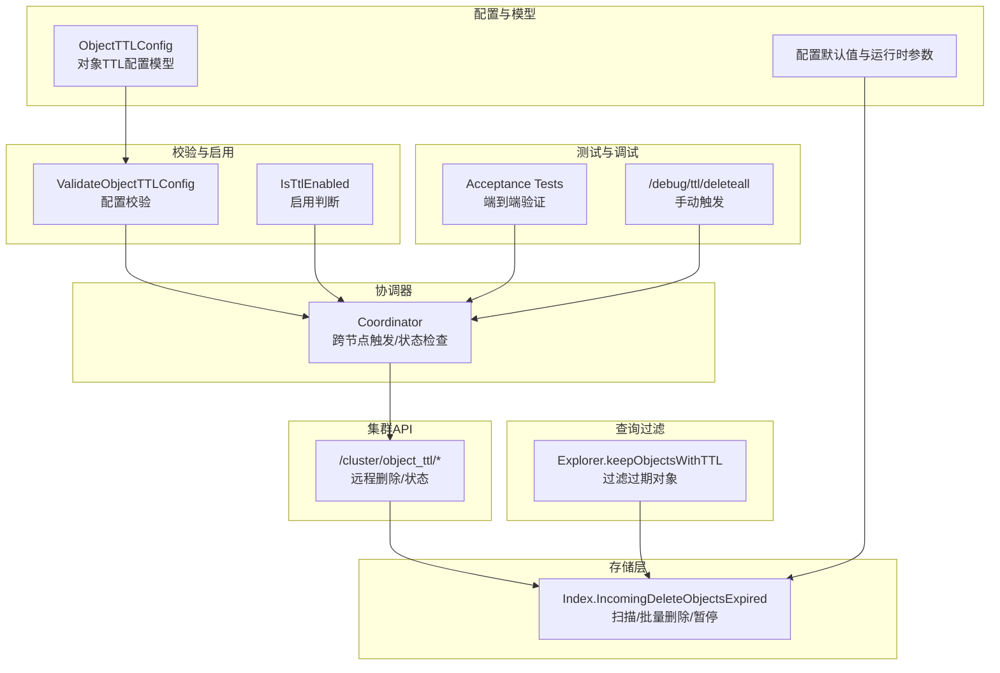
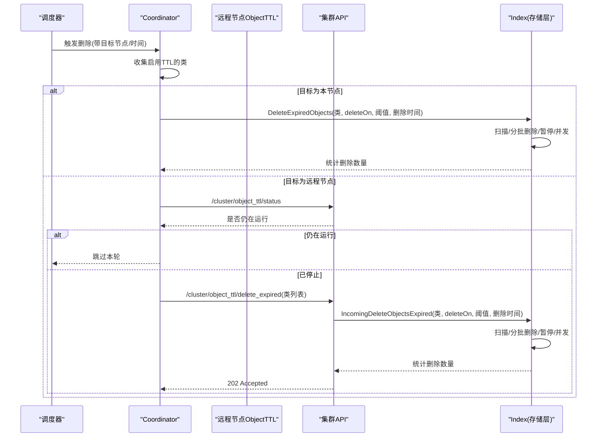
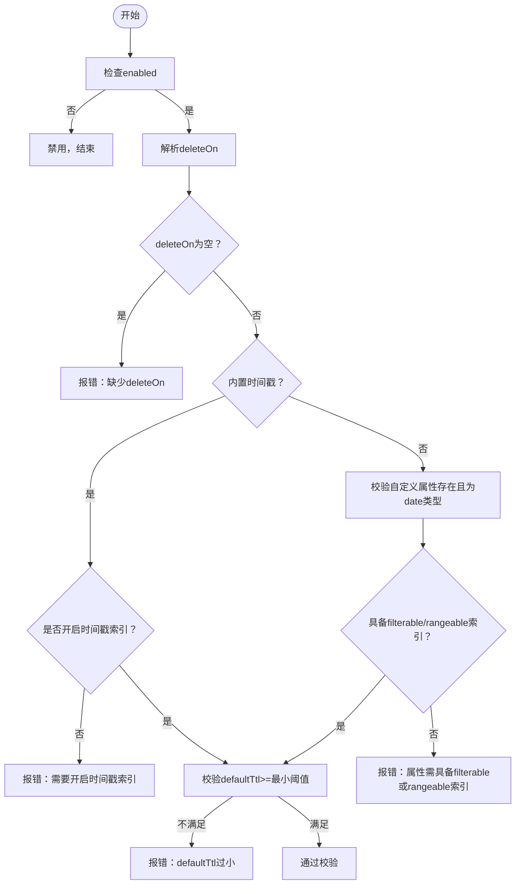
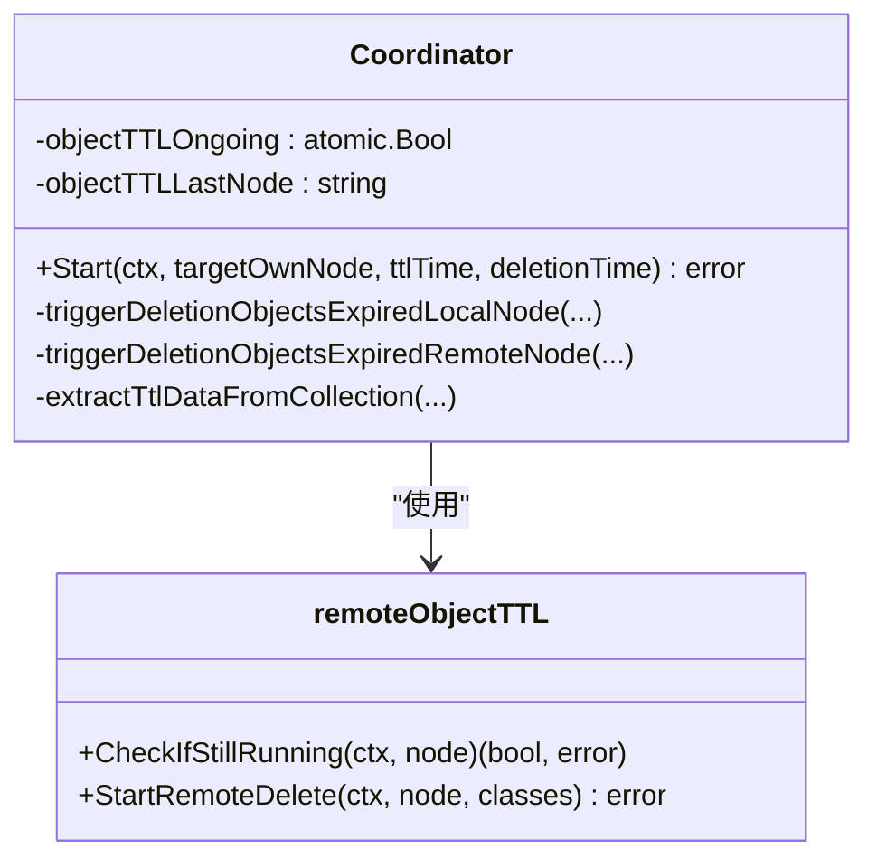
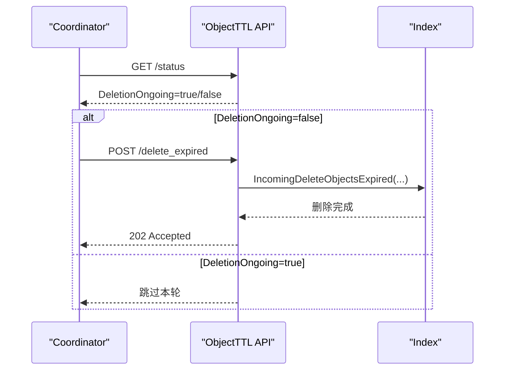
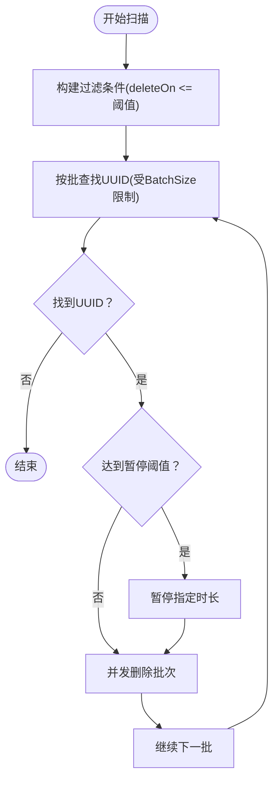
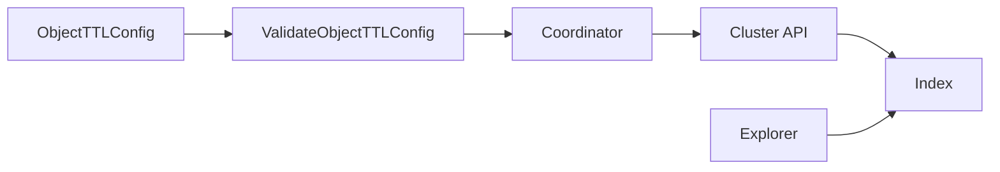
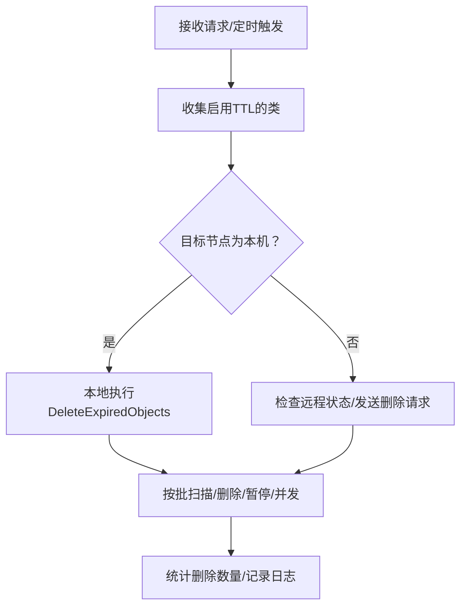

# TTL 过期存储管理

<cite>
**本文引用的文件**
- [adapters/repos/db/ttl/config.go](file://adapters/repos/db/ttl/config.go)
- [usecases/object_ttl/object_ttl.go](file://usecases/object_ttl/object_ttl.go)
- [adapters/handlers/rest/clusterapi/object_ttl.go](file://adapters/handlers/rest/clusterapi/object_ttl.go)
- [entities/models/object_ttl_config.go](file://entities/models/object_ttl_config.go)
- [adapters/handlers/rest/handlers_debug.go](file://adapters/handlers/rest/handlers_debug.go)
- [adapters/repos/db/index.go](file://adapters/repos/db/index.go)
- [usecases/config/config_handler.go](file://usecases/config/config_handler.go)
- [usecases/config/runtimeconfig_test.go](file://usecases/config/runtimeconfig_test.go)
- [test/acceptance_with_python/test_object_ttl.py](file://test/acceptance_with_python/test_object_ttl.py)
- [test/acceptance/multi_node/object_ttl_test.go](file://test/acceptance/multi_node/object_ttl_test.go)
- [usecases/traverser/explorer.go](file://usecases/traverser/explorer.go)
</cite>

## 目录
1. [简介](#简介)
2. [项目结构](#项目结构)
3. [核心组件](#核心组件)
4. [架构总览](#架构总览)
5. [组件详解](#组件详解)
6. [依赖关系分析](#依赖关系分析)
7. [性能考量](#性能考量)
8. [故障排查指南](#故障排查指南)
9. [结论](#结论)
10. [附录](#附录)

## 简介
本技术文档系统性阐述 Weaviate 的 TTL（Time-To-Live）过期存储管理机制，覆盖设计原理、配置项、过期检测与自动清理流程、与存储系统的协调、调度与资源控制、性能优化与运维最佳实践。重点包括：
- 时间戳存储与索引要求
- 过期判定逻辑与过滤策略
- 后台扫描、批量删除与资源节流
- 类级别与对象级别覆盖
- 与事务、并发与一致性的协同
- 调度与运行时参数调优
- 部署与运维实践

## 项目结构
围绕 TTL 的相关模块分布于以下子系统：
- 配置与模型：对象 TTL 配置模型、默认与运行时参数
- 校验与启用：TTL 配置校验与启用判断
- 协调器：跨节点触发与状态检查
- 集群 API：远程删除与状态查询
- 存储层：过期扫描、批量删除与暂停策略
- 查询过滤：按 TTL 过滤结果集
- 测试与调试：端到端验证与手动触发接口

**图表来源**
- [entities/models/object_ttl_config.go](file://entities/models/object_ttl_config.go#L26-L42)
- [adapters/repos/db/ttl/config.go](file://adapters/repos/db/ttl/config.go#L27-L84)
- [usecases/object_ttl/object_ttl.go](file://usecases/object_ttl/object_ttl.go#L66-L134)
- [adapters/handlers/rest/clusterapi/object_ttl.go](file://adapters/handlers/rest/clusterapi/object_ttl.go#L49-L96)
- [adapters/repos/db/index.go](file://adapters/repos/db/index.go#L2565-L2764)
- [usecases/traverser/explorer.go](file://usecases/traverser/explorer.go#L766-L788)
- [usecases/config/config_handler.go](file://usecases/config/config_handler.go#L74-L78)

**章节来源**
- [entities/models/object_ttl_config.go](file://entities/models/object_ttl_config.go#L26-L42)
- [adapters/repos/db/ttl/config.go](file://adapters/repos/db/ttl/config.go#L27-L84)
- [usecases/object_ttl/object_ttl.go](file://usecases/object_ttl/object_ttl.go#L66-L134)
- [adapters/handlers/rest/clusterapi/object_ttl.go](file://adapters/handlers/rest/clusterapi/object_ttl.go#L49-L96)
- [adapters/repos/db/index.go](file://adapters/repos/db/index.go#L2565-L2764)
- [usecases/traverser/explorer.go](file://usecases/traverser/explorer.go#L766-L788)
- [usecases/config/config_handler.go](file://usecases/config/config_handler.go#L74-L78)

## 核心组件
- 对象 TTL 配置模型：定义是否启用、过期基准（内置时间戳或自定义日期属性）、默认 TTL 偏移、是否过滤过期对象等。
- 配置校验与启用：确保 deleteOn 合法、索引满足要求、默认 TTL 不小于最小阈值，并返回是否需要开启时间戳索引。
- 协调器（Coordinator）：周期性触发删除，单节点本地执行或选择远程节点执行；避免重复运行；统计删除数量并记录日志。
- 集群 API：提供远程删除入口与状态查询，保障并发安全与幂等。
- 存储层（Index）：基于过滤条件扫描过期对象，分批删除，支持暂停与并发限制。
- 查询过滤：在搜索时根据 TTL 配置过滤未删除但已过期的对象。
- 调试与测试：提供手动触发接口与端到端测试用例。

**章节来源**
- [entities/models/object_ttl_config.go](file://entities/models/object_ttl_config.go#L26-L42)
- [adapters/repos/db/ttl/config.go](file://adapters/repos/db/ttl/config.go#L27-L84)
- [usecases/object_ttl/object_ttl.go](file://usecases/object_ttl/object_ttl.go#L66-L134)
- [adapters/handlers/rest/clusterapi/object_ttl.go](file://adapters/handlers/rest/clusterapi/object_ttl.go#L49-L96)
- [adapters/repos/db/index.go](file://adapters/repos/db/index.go#L2565-L2764)
- [usecases/traverser/explorer.go](file://usecases/traverser/explorer.go#L766-L788)
- [adapters/handlers/rest/handlers_debug.go](file://adapters/handlers/rest/handlers_debug.go#L1098-L1129)
- [test/acceptance_with_python/test_object_ttl.py](file://test/acceptance_with_python/test_object_ttl.py#L17-L31)

## 架构总览
TTL 的整体流程如下：
- 配置生效后，协调器周期性触发删除任务。
- 在单节点集群中直接本地执行；在多节点集群中由领导者选择一个非领导者节点执行，以降低领导者负载。
- 协调器检查上次执行状态，避免并发重复运行。
- 存储层通过过滤器定位过期对象，按批次删除并支持暂停与并发控制。
- 查询阶段可按配置过滤掉尚未删除的过期对象，提升一致性体验。

**图表来源**
- [usecases/object_ttl/object_ttl.go](file://usecases/object_ttl/object_ttl.go#L66-L134)
- [adapters/handlers/rest/clusterapi/object_ttl.go](file://adapters/handlers/rest/clusterapi/object_ttl.go#L98-L173)
- [adapters/repos/db/index.go](file://adapters/repos/db/index.go#L2565-L2764)

**章节来源**
- [usecases/object_ttl/object_ttl.go](file://usecases/object_ttl/object_ttl.go#L66-L134)
- [adapters/handlers/rest/clusterapi/object_ttl.go](file://adapters/handlers/rest/clusterapi/object_ttl.go#L98-L173)
- [adapters/repos/db/index.go](file://adapters/repos/db/index.go#L2565-L2764)

## 组件详解

### 1) TTL 配置模型与校验
- 配置项
  - enabled：是否启用对象 TTL
  - deleteOn：过期基准，支持内置创建/更新时间戳或自定义日期属性
  - defaultTtl：秒级偏移，用于计算过期时间（ttl = deleteOn + defaultTtl）
  - filterExpiredObjects：是否从结果集中过滤掉尚未删除的过期对象
- 校验规则
  - deleteOn 必填且合法
  - 使用内置时间戳时，需开启 invertedIndexConfig.indexTimestamps（新增类）或在更新时提示
  - defaultTtl 不得低于最小阈值（可通过环境变量覆盖）
  - 自定义日期属性必须存在、类型为 date，且具备 filterable 或 rangeable 索引之一
- 启用判断
  - 通过 IsTtlEnabled 判断是否启用

**图表来源**
- [adapters/repos/db/ttl/config.go](file://adapters/repos/db/ttl/config.go#L27-L84)
- [adapters/repos/db/ttl/config.go](file://adapters/repos/db/ttl/config.go#L100-L152)

**章节来源**
- [entities/models/object_ttl_config.go](file://entities/models/object_ttl_config.go#L26-L42)
- [adapters/repos/db/ttl/config.go](file://adapters/repos/db/ttl/config.go#L27-L84)
- [adapters/repos/db/ttl/config.go](file://adapters/repos/db/ttl/config.go#L100-L152)

### 2) 协调器（Coordinator）与远程执行
- 角色职责
  - 收集启用 TTL 的类及其模式版本
  - 选择目标节点（单节点则本机，多节点则随机选非本机）
  - 避免并发重复执行（原子标志位）
  - 本地执行或通过集群 API 远程触发删除
  - 统计每类删除数量并记录日志
- 远程状态检查
  - 通过 /cluster/object_ttl/status 查询上次执行是否仍在进行
- 远程删除
  - 通过 /cluster/object_ttl/delete_expired 发送类列表（含 deleteOn、阈值、删除时间、模式版本）

**图表来源**
- [usecases/object_ttl/object_ttl.go](file://usecases/object_ttl/object_ttl.go#L41-L64)
- [usecases/object_ttl/object_ttl.go](file://usecases/object_ttl/object_ttl.go#L66-L134)
- [usecases/object_ttl/object_ttl.go](file://usecases/object_ttl/object_ttl.go#L187-L234)

**章节来源**
- [usecases/object_ttl/object_ttl.go](file://usecases/object_ttl/object_ttl.go#L41-L64)
- [usecases/object_ttl/object_ttl.go](file://usecases/object_ttl/object_ttl.go#L66-L134)
- [usecases/object_ttl/object_ttl.go](file://usecases/object_ttl/object_ttl.go#L187-L234)

### 3) 集群 API：远程删除与状态查询
- /cluster/object_ttl/status
  - 返回当前是否有删除任务正在进行
- /cluster/object_ttl/delete_expired
  - 接收类列表（含类名、版本、deleteOn、阈值、删除时间）
  - 并发执行，独立 goroutine 处理请求，避免阻塞 HTTP 处理器
  - 统计每类删除数量并记录日志

**图表来源**
- [adapters/handlers/rest/clusterapi/object_ttl.go](file://adapters/handlers/rest/clusterapi/object_ttl.go#L98-L173)
- [adapters/handlers/rest/clusterapi/object_ttl.go](file://adapters/handlers/rest/clusterapi/object_ttl.go#L83-L96)

**章节来源**
- [adapters/handlers/rest/clusterapi/object_ttl.go](file://adapters/handlers/rest/clusterapi/object_ttl.go#L49-L96)
- [adapters/handlers/rest/clusterapi/object_ttl.go](file://adapters/handlers/rest/clusterapi/object_ttl.go#L98-L173)

### 4) 存储层：扫描、批量删除与暂停
- 过滤条件
  - 基于 deleteOn 属性与阈值（ttlTime - defaultTtl）构造 LessThanOrEqual 条件
- 扫描与删除
  - 分批查找 UUID（受 ObjectsTTLBatchSize 控制）
  - 并发删除（受 ObjectsTTLConcurrencyFactor 控制），最后一轮串行以确保结果一致性
  - 多租户场景逐租户处理
- 暂停策略
  - 每处理 N 批后暂停 D 持续时间（ObjectsTTLPauseEveryNoBatches / ObjectsTTLPauseDuration）
- 并发控制
  - 通过并发因子与 GOMAXPROCS 计算最大并发

**图表来源**
- [adapters/repos/db/index.go](file://adapters/repos/db/index.go#L2583-L2593)
- [adapters/repos/db/index.go](file://adapters/repos/db/index.go#L2665-L2739)

**章节来源**
- [adapters/repos/db/index.go](file://adapters/repos/db/index.go#L2565-L2764)

### 5) 查询过滤：过滤过期对象
- 当 TTL 启用且开启 filterExpiredObjects 时，在查询阶段对尚未删除的过期对象进行过滤
- 过期时间依据 deleteOn 计算（内置时间戳或自定义日期属性）

**章节来源**
- [usecases/traverser/explorer.go](file://usecases/traverser/explorer.go#L766-L788)

### 6) 调试与手动触发
- /debug/ttl/deleteall
  - 可选参数：expiration（RFC3339）、targetOwnNode（布尔）
  - 触发协调器立即执行删除

**章节来源**
- [adapters/handlers/rest/handlers_debug.go](file://adapters/handlers/rest/handlers_debug.go#L1098-L1129)

### 7) 测试与验证
- 端到端测试覆盖：
  - 自定义日期属性删除
  - 更新时间与创建时间删除
  - 多租户场景
  - 过滤过期对象行为
  - 启用/禁用 TTL 的动态切换
- 多节点测试覆盖远程删除与状态检查

**章节来源**
- [test/acceptance_with_python/test_object_ttl.py](file://test/acceptance_with_python/test_object_ttl.py#L33-L297)
- [test/acceptance/multi_node/object_ttl_test.go](file://test/acceptance/multi_node/object_ttl_test.go#L454-L480)

## 依赖关系分析
- 组件耦合
  - Coordinator 依赖 SchemaReader/Getter、DB、远程节点解析器
  - 集群 API 依赖 RemoteIndexIncoming 与配置
  - 存储层依赖过滤器、分片/租户信息与复制属性
- 关键依赖链
  - 配置模型 → 校验 → 协调器 → 集群 API → 存储层
  - 查询过滤 → TTL 配置 → 结果集

**图表来源**
- [entities/models/object_ttl_config.go](file://entities/models/object_ttl_config.go#L26-L42)
- [adapters/repos/db/ttl/config.go](file://adapters/repos/db/ttl/config.go#L27-L84)
- [usecases/object_ttl/object_ttl.go](file://usecases/object_ttl/object_ttl.go#L66-L134)
- [adapters/handlers/rest/clusterapi/object_ttl.go](file://adapters/handlers/rest/clusterapi/object_ttl.go#L98-L173)
- [adapters/repos/db/index.go](file://adapters/repos/db/index.go#L2565-L2764)
- [usecases/traverser/explorer.go](file://usecases/traverser/explorer.go#L766-L788)

**章节来源**
- [usecases/object_ttl/object_ttl.go](file://usecases/object_ttl/object_ttl.go#L66-L134)
- [adapters/handlers/rest/clusterapi/object_ttl.go](file://adapters/handlers/rest/clusterapi/object_ttl.go#L98-L173)
- [adapters/repos/db/index.go](file://adapters/repos/db/index.go#L2565-L2764)
- [usecases/traverser/explorer.go](file://usecases/traverser/explorer.go#L766-L788)

## 性能考量
- 清理频率
  - 通过运行时配置 objects_ttl_delete_schedule 设置定时任务
  - 默认值可在配置处理器中查看
- 批量大小
  - ObjectsTTLBatchSize 控制每次扫描/删除的 UUID 数量
  - 建议根据磁盘吞吐与 CPU 资源逐步调优
- 并发控制
  - ObjectsTTLConcurrencyFactor 与 GOMAXPROCS 共同决定并发上限
  - 过高并发可能导致锁竞争与抖动，建议从小到大测试
- 暂停策略
  - ObjectsTTLPauseEveryNoBatches 与 ObjectsTTLPauseDuration 用于缓解压力
  - 建议在高写入场景适当增加暂停频率与时长
- 索引要求
  - 内置时间戳需开启 invertedIndexConfig.indexTimestamps
  - 自定义日期属性需具备 filterable 或 rangeable 索引
- 查询过滤
  - 开启 filterExpiredObjects 可减少返回过期对象，但会增加查询开销

**章节来源**
- [usecases/config/config_handler.go](file://usecases/config/config_handler.go#L74-L78)
- [usecases/config/config_handler.go](file://usecases/config/config_handler.go#L245-L251)
- [usecases/config/runtimeconfig_test.go](file://usecases/config/runtimeconfig_test.go#L439-L601)
- [adapters/repos/db/ttl/config.go](file://adapters/repos/db/ttl/config.go#L41-L77)
- [adapters/repos/db/index.go](file://adapters/repos/db/index.go#L2612-L2613)
- [adapters/repos/db/index.go](file://adapters/repos/db/index.go#L2668-L2669)
- [adapters/repos/db/index.go](file://adapters/repos/db/index.go#L2692-L2693)

## 故障排查指南
- 常见错误
  - 缺少 deleteOn：校验报错，需设置内置时间戳或自定义日期属性
  - 时间戳未索引：使用内置时间戳时需开启 invertedIndexConfig.indexTimestamps
  - defaultTtl 过小：defaultTtl 必须不小于最小阈值（可由环境变量覆盖）
  - 自定义属性缺失或类型不符：需确保属性存在且为 date 类型
  - 自定义属性无索引：需开启 filterable 或 rangeable 索引之一
- 并发冲突
  - 协调器与集群 API 均有并发控制与状态检查，避免重复执行
  - 若出现“另一个请求仍在处理”，等待后再试
- 删除未生效
  - 检查 deleteOn 与阈值计算是否正确
  - 确认索引已建立且可用
  - 查看日志中的删除统计与耗时
- 手动触发
  - 使用 /debug/ttl/deleteall 指定 expiration 与 targetOwnNode 参数进行快速验证

**章节来源**
- [adapters/repos/db/ttl/config.go](file://adapters/repos/db/ttl/config.go#L100-L152)
- [adapters/handlers/rest/clusterapi/object_ttl.go](file://adapters/handlers/rest/clusterapi/object_ttl.go#L102-L105)
- [adapters/handlers/rest/handlers_debug.go](file://adapters/handlers/rest/handlers_debug.go#L1098-L1129)

## 结论
Weaviate 的 TTL 机制通过严格的配置校验、可靠的跨节点协调、可控的批量删除与暂停策略，实现了高效且可运维的过期对象清理。结合查询过滤与运行时参数调优，可在不同负载场景下平衡清理效率与系统稳定性。

## 附录

### A. 配置项一览
- 对象 TTL 配置
  - enabled：是否启用
  - deleteOn：过期基准（内置时间戳或自定义日期属性）
  - defaultTtl：默认 TTL 偏移（秒）
  - filterExpiredObjects：是否过滤过期对象
- 运行时参数
  - objects_ttl_delete_schedule：删除任务调度表达式
  - objects_ttl_batch_size：批量大小
  - objects_ttl_pause_every_no_batches：暂停前处理批次数
  - objects_ttl_pause_duration：暂停时长
  - objects_ttl_concurrency_factor：并发因子

**章节来源**
- [entities/models/object_ttl_config.go](file://entities/models/object_ttl_config.go#L26-L42)
- [usecases/config/config_handler.go](file://usecases/config/config_handler.go#L245-L251)
- [usecases/config/config_handler.go](file://usecases/config/config_handler.go#L74-L78)

### B. 关键流程图（算法实现映射）

**图表来源**
- [usecases/object_ttl/object_ttl.go](file://usecases/object_ttl/object_ttl.go#L66-L134)
- [adapters/repos/db/index.go](file://adapters/repos/db/index.go#L2565-L2764)