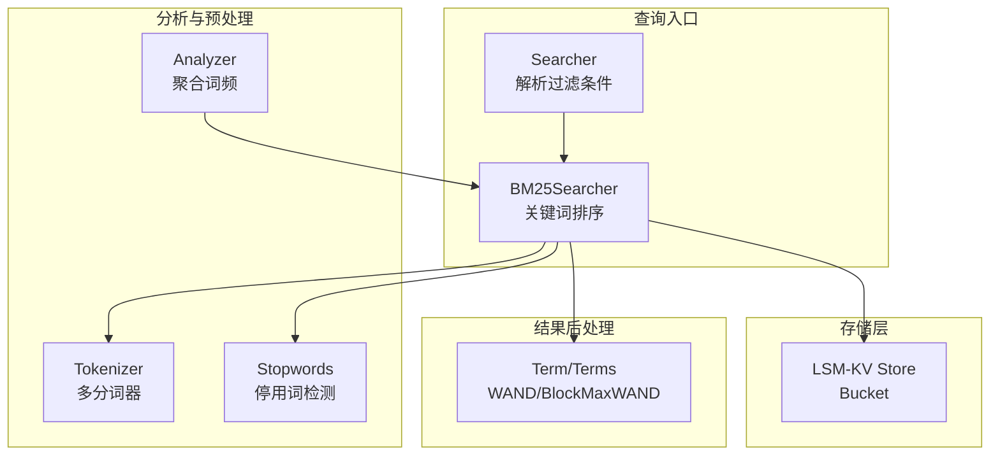
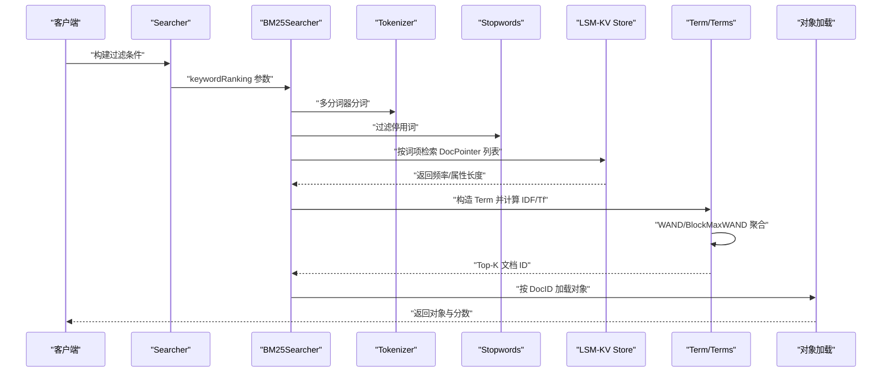
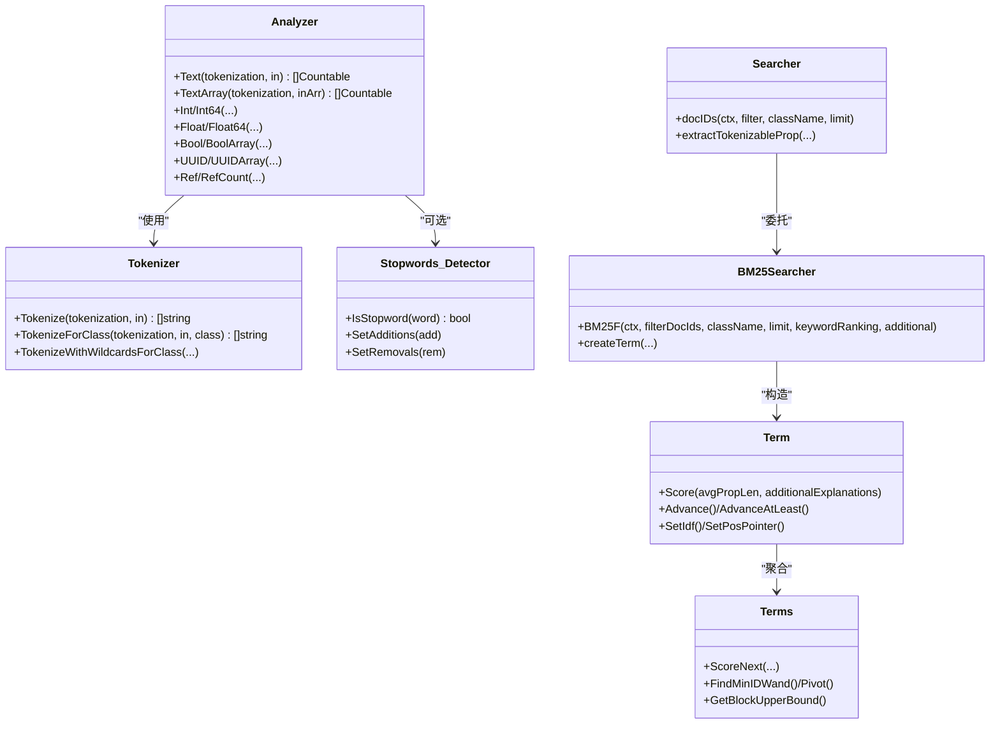
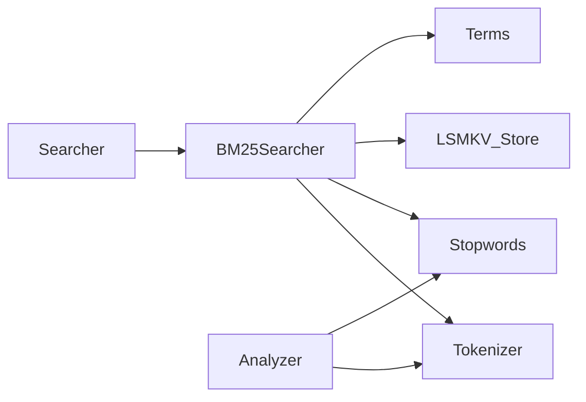

# 倒排索引系统

<cite>
**本文档引用的文件**
- [adapters/repos/db/inverted/analyzer.go](file://adapters/repos/db/inverted/analyzer.go)
- [adapters/repos/db/inverted/searcher.go](file://adapters/repos/db/inverted/searcher.go)
- [adapters/repos/db/inverted/terms/terms.go](file://adapters/repos/db/inverted/terms/terms.go)
- [adapters/repos/db/inverted/bm25_searcher.go](file://adapters/repos/db/inverted/bm25_searcher.go)
- [adapters/repos/db/inverted/config.go](file://adapters/repos/db/inverted/config.go)
- [adapters/repos/db/inverted/stopwords/detector.go](file://adapters/repos/db/inverted/stopwords/detector.go)
- [adapters/repos/db/inverted/stopwords/presets.go](file://adapters/repos/db/inverted/stopwords/presets.go)
- [entities/schema/inverted_index_config.go](file://entities/schema/inverted_index_config.go)
- [entities/tokenizer/tokenizer.go](file://entities/tokenizer/tokenizer.go)
- [adapters/repos/db/lsmkv/store.go](file://adapters/repos/db/lsmkv/store.go)
</cite>

## 目录
1. [简介](#简介)
2. [项目结构](#项目结构)
3. [核心组件](#核心组件)
4. [架构总览](#架构总览)
5. [详细组件分析](#详细组件分析)
6. [依赖关系分析](#依赖关系分析)
7. [性能考量](#性能考量)
8. [故障排查指南](#故障排查指南)
9. [结论](#结论)
10. [附录](#附录)

## 简介
本文件面向 Weaviate 的倒排索引系统，提供从架构设计、数据结构、处理流程到查询优化与维护策略的完整技术文档。重点覆盖以下方面：
- 倒排索引的实现架构：词项索引、位置信息索引（频率与属性长度）、统计信息（IDF）存储与计算
- 索引构建过程：文本分词、可选词干提取、停用词过滤、去重与聚合、词频统计、写入 LSMKV 存储桶
- 查询能力：精确匹配、前缀匹配、通配符匹配、范围查询、短语搜索、布尔查询、模糊匹配
- 查询优化：WAND/WandBlock、BlockMaxWAND、Top-K 堆、属性级与查询词级权重、最小 OR 匹配控制
- 向量倒排融合：BM25F 与向量检索的混合排序
- 配置参数：分词器选择、停用词配置、用户字典、权重设置、清理间隔等
- 维护与重建：索引配置更新、属性长度跟踪、合并与压缩策略
- 性能监控与调优：慢查询日志、并发度、内存与磁盘 I/O 调优

## 项目结构
Weaviate 的倒排索引主要由以下模块协同完成：
- 分析与预处理：Analyzer、Tokenizer、Stopwords
- 查询执行：Searcher、BM25Searcher、Term/Terms
- 存储层：LSM-KV Store/Bucket
- 配置模型：Schema 层的 InvertedIndexConfig、BM25Config

图示来源
- [adapters/repos/db/inverted/searcher.go](file://adapters/repos/db/inverted/searcher.go#L1-L120)
- [adapters/repos/db/inverted/bm25_searcher.go](file://adapters/repos/db/inverted/bm25_searcher.go#L1-L120)
- [adapters/repos/db/inverted/analyzer.go](file://adapters/repos/db/inverted/analyzer.go#L1-L120)
- [entities/tokenizer/tokenizer.go](file://entities/tokenizer/tokenizer.go#L134-L190)
- [adapters/repos/db/lsmkv/store.go](file://adapters/repos/db/lsmkv/store.go#L1-L120)

章节来源
- [adapters/repos/db/inverted/searcher.go](file://adapters/repos/db/inverted/searcher.go#L1-L120)
- [adapters/repos/db/inverted/bm25_searcher.go](file://adapters/repos/db/inverted/bm25_searcher.go#L1-L120)
- [adapters/repos/db/inverted/analyzer.go](file://adapters/repos/db/inverted/analyzer.go#L1-L120)
- [entities/tokenizer/tokenizer.go](file://entities/tokenizer/tokenizer.go#L134-L190)
- [adapters/repos/db/lsmkv/store.go](file://adapters/repos/db/lsmkv/store.go#L1-L120)

## 核心组件
- Analyzer：负责将输入内容按指定 tokenization 进行分词并聚合词频，生成 Countable 列表；支持文本、整数、浮点、布尔、UUID、引用计数等类型的标准化编码。
- Tokenizer：提供多种分词策略（word、lowercase、whitespace、field、trigram、GSE、Kagome 等），并支持用户自定义词典。
- Stopwords：内置英文停用词集与可配置的添加/移除规则，查询时用于过滤无意义词汇。
- Searcher：解析 GraphQL/REST 过滤表达式，构建 prop/value 对，决定使用倒排索引或回退策略，并支持嵌套引用过滤。
- BM25Searcher：执行 BM25F 关键词排序，支持多属性、多分词器、重复词提升、属性权重、最小 OR 匹配、WAND/BlockMaxWAND Top-K 搜索。
- Term/Terms：封装单个词项的倒排列表游标、IDF 计算、TF 归一化、WAND 聚合与合并逻辑。
- LSM-KV Store：承载倒排桶（searchable/filterable/rangeable），提供按词项检索文档指针列表、频率与属性长度。

章节来源
- [adapters/repos/db/inverted/analyzer.go](file://adapters/repos/db/inverted/analyzer.go#L65-L120)
- [entities/tokenizer/tokenizer.go](file://entities/tokenizer/tokenizer.go#L134-L190)
- [adapters/repos/db/inverted/stopwords/detector.go](file://adapters/repos/db/inverted/stopwords/detector.go#L32-L93)
- [adapters/repos/db/inverted/searcher.go](file://adapters/repos/db/inverted/searcher.go#L260-L398)
- [adapters/repos/db/inverted/bm25_searcher.go](file://adapters/repos/db/inverted/bm25_searcher.go#L70-L132)
- [adapters/repos/db/inverted/terms/terms.go](file://adapters/repos/db/inverted/terms/terms.go#L207-L320)
- [adapters/repos/db/lsmkv/store.go](file://adapters/repos/db/lsmkv/store.go#L88-L120)

## 架构总览
下图展示从查询到结果返回的端到端流程，涵盖分词、停用词过滤、倒排检索、WAND 聚合与对象加载。

图示来源
- [adapters/repos/db/inverted/searcher.go](file://adapters/repos/db/inverted/searcher.go#L241-L258)
- [adapters/repos/db/inverted/bm25_searcher.go](file://adapters/repos/db/inverted/bm25_searcher.go#L138-L237)
- [adapters/repos/db/inverted/bm25_searcher.go](file://adapters/repos/db/inverted/bm25_searcher.go#L239-L364)
- [adapters/repos/db/inverted/terms/terms.go](file://adapters/repos/db/inverted/terms/terms.go#L462-L489)
- [adapters/repos/db/lsmkv/store.go](file://adapters/repos/db/lsmkv/store.go#L88-L120)

## 详细组件分析

### Analyzer（分析与聚合）
- 功能要点
  - 文本类：按 class 级 tokenization 进行分词，统计词频并去重聚合
  - 数值/布尔/UUID：转换为可排序的字节表示，便于范围/精确查询
  - 引用：支持引用计数与引用 beacon 字符串
- 复杂度与性能
  - 时间复杂度近似 O(n)，空间复杂度 O(k)（k 为唯一词项数）
  - 通过批量分词与聚合减少后续倒排写入开销

章节来源
- [adapters/repos/db/inverted/analyzer.go](file://adapters/repos/db/inverted/analyzer.go#L72-L99)
- [adapters/repos/db/inverted/analyzer.go](file://adapters/repos/db/inverted/analyzer.go#L103-L151)
- [adapters/repos/db/inverted/analyzer.go](file://adapters/repos/db/inverted/analyzer.go#L217-L242)

### Tokenizer（分词器）
- 支持策略
  - word、lowercase、whitespace、field、trigram
  - 可选：GSE（日语/中文）、Kagome（韩语/日语），并支持用户自定义词典
- 通配符处理
  - 保留 ?/* 以支持 LIKE/通配符查询
- 性能与指标
  - 提供分词耗时与 token 数统计，便于监控与调优

章节来源
- [entities/tokenizer/tokenizer.go](file://entities/tokenizer/tokenizer.go#L134-L190)
- [entities/tokenizer/tokenizer.go](file://entities/tokenizer/tokenizer.go#L270-L303)
- [entities/tokenizer/tokenizer.go](file://entities/tokenizer/tokenizer.go#L305-L348)
- [entities/tokenizer/tokenizer.go](file://entities/tokenizer/tokenizer.go#L375-L403)

### Stopwords（停用词）
- 内置英文预设与可配置添加/移除
- 查询阶段在 word tokenization 下过滤无意义词，避免噪声影响

章节来源
- [adapters/repos/db/inverted/stopwords/presets.go](file://adapters/repos/db/inverted/stopwords/presets.go#L19-L27)
- [adapters/repos/db/inverted/stopwords/detector.go](file://adapters/repos/db/inverted/stopwords/detector.go#L32-L93)
- [adapters/repos/db/inverted/bm25_searcher.go](file://adapters/repos/db/inverted/bm25_searcher.go#L366-L389)

### Searcher（查询解析与执行）
- 解析过滤表达式，区分内部属性、引用属性、地理属性、UUID、时间戳、属性长度、空值等
- 将过滤条件转换为 prop/value 对，决定是否使用倒排索引或回退策略
- 支持嵌套引用过滤与多值包含（ContainsAll/Any/None）

章节来源
- [adapters/repos/db/inverted/searcher.go](file://adapters/repos/db/inverted/searcher.go#L260-L398)
- [adapters/repos/db/inverted/searcher.go](file://adapters/repos/db/inverted/searcher.go#L634-L688)

### BM25Searcher（关键词排序与 Top-K）
- 多分词器并行检索词项，跨属性合并 DocPointerWithScore
- 计算 IDF、TF 归一化（考虑属性长度均值），支持属性权重与重复词提升
- 使用 WAND 或 BlockMaxWAND 进行高效 Top-K 聚合，支持最小 OR 匹配控制
- 返回对象与可选分数解释（频率、属性长度）

章节来源
- [adapters/repos/db/inverted/bm25_searcher.go](file://adapters/repos/db/inverted/bm25_searcher.go#L70-L132)
- [adapters/repos/db/inverted/bm25_searcher.go](file://adapters/repos/db/inverted/bm25_searcher.go#L138-L237)
- [adapters/repos/db/inverted/bm25_searcher.go](file://adapters/repos/db/inverted/bm25_searcher.go#L239-L364)
- [adapters/repos/db/inverted/bm25_searcher.go](file://adapters/repos/db/inverted/bm25_searcher.go#L465-L642)

### Term/Terms（词项与合并）
- Term：封装单个词项的游标、IDF、TF 归一化、推进策略（Advance/AdvanceAtLeast）
- Terms：多词项合并、WAND 聚合、Block 上界估计、最小 OR 匹配校验
- DocPointerWithScore：存储文档 ID、频率、属性长度，支持墓碑标记

章节来源
- [adapters/repos/db/inverted/terms/terms.go](file://adapters/repos/db/inverted/terms/terms.go#L25-L62)
- [adapters/repos/db/inverted/terms/terms.go](file://adapters/repos/db/inverted/terms/terms.go#L207-L320)
- [adapters/repos/db/inverted/terms/terms.go](file://adapters/repos/db/inverted/terms/terms.go#L462-L504)

### 配置模型（InvertedIndexConfig/BM25Config）
- InvertedIndexConfig：BM25 参数、停用词、清理间隔、是否索引时间戳/空状态/属性长度、是否启用 BlockMaxWAND、用户字典
- BM25Config：K1、B 参数
- Schema 层提供模型与实体之间的转换

章节来源
- [entities/schema/inverted_index_config.go](file://entities/schema/inverted_index_config.go#L18-L52)
- [adapters/repos/db/inverted/config.go](file://adapters/repos/db/inverted/config.go#L27-L48)
- [adapters/repos/db/inverted/config.go](file://adapters/repos/db/inverted/config.go#L110-L183)

### 类图（核心类关系）

图示来源
- [adapters/repos/db/inverted/analyzer.go](file://adapters/repos/db/inverted/analyzer.go#L65-L120)
- [entities/tokenizer/tokenizer.go](file://entities/tokenizer/tokenizer.go#L134-L190)
- [adapters/repos/db/inverted/stopwords/detector.go](file://adapters/repos/db/inverted/stopwords/detector.go#L32-L93)
- [adapters/repos/db/inverted/searcher.go](file://adapters/repos/db/inverted/searcher.go#L260-L398)
- [adapters/repos/db/inverted/bm25_searcher.go](file://adapters/repos/db/inverted/bm25_searcher.go#L70-L132)
- [adapters/repos/db/inverted/terms/terms.go](file://adapters/repos/db/inverted/terms/terms.go#L207-L320)

## 依赖关系分析
- 组件耦合
  - Searcher 依赖 Tokenizer、Stopwords、LSM-KV Store 与属性特定索引
  - BM25Searcher 依赖 Searcher 的过滤结果、Term/Terms 的聚合能力
  - Analyzer 与 Tokenizer 独立，但共同服务于倒排构建与查询
- 外部依赖
  - LSM-KV Store 提供倒排桶的持久化与检索接口
  - 并发与限流：基于 GOMAXPROCS 的预算控制与 goroutine 错误组聚合

图示来源
- [adapters/repos/db/inverted/searcher.go](file://adapters/repos/db/inverted/searcher.go#L63-L82)
- [adapters/repos/db/inverted/bm25_searcher.go](file://adapters/repos/db/inverted/bm25_searcher.go#L70-L86)
- [adapters/repos/db/lsmkv/store.go](file://adapters/repos/db/lsmkv/store.go#L88-L120)

章节来源
- [adapters/repos/db/inverted/searcher.go](file://adapters/repos/db/inverted/searcher.go#L63-L82)
- [adapters/repos/db/inverted/bm25_searcher.go](file://adapters/repos/db/inverted/bm25_searcher.go#L70-L86)
- [adapters/repos/db/lsmkv/store.go](file://adapters/repos/db/lsmkv/store.go#L88-L120)

## 性能考量
- 并发与并行
  - 多分词器并行检索词项，利用 CPU 核心加速
  - 使用错误组聚合与预算控制，避免过载
- Top-K 优化
  - WAND/BlockMaxWAND 减少全量排序成本
  - 最小 OR 匹配阈值降低无效候选
- 存储与 I/O
  - LSM-KV 桶策略与合并压缩降低磁盘占用
  - 倒排列表采用固定键长/值长布局，提升解码效率
- 监控与调优
  - 慢查询日志记录各阶段耗时与候选数量
  - 分词器指标（耗时、token 数）辅助容量规划

[本节为通用性能建议，不直接分析具体文件]

## 故障排查指南
- 常见错误
  - 仅停用词：当所有查询词均为停用词且操作为 ContainsAny 时返回错误
  - 缺失索引：属性未建立可搜索/可过滤/可范围索引时报错
  - 数据类型不支持：查询中使用了不支持的数据类型
- 排查步骤
  - 检查 invertedIndexConfig 中的 tokenization、stopwords、清理间隔
  - 确认属性已建立相应索引（filterable/searchable/rangeable）
  - 查看慢查询日志中的 kwd_* 指标，定位瓶颈阶段
  - 若出现 NaN/0 平均属性长度，系统会使用安全默认值，需检查属性长度跟踪器

章节来源
- [adapters/repos/db/inverted/searcher.go](file://adapters/repos/db/inverted/searcher.go#L60-L62)
- [adapters/repos/db/inverted/bm25_searcher.go](file://adapters/repos/db/inverted/bm25_searcher.go#L91-L96)
- [adapters/repos/db/inverted/bm25_searcher.go](file://adapters/repos/db/inverted/bm25_searcher.go#L233-L235)

## 结论
Weaviate 的倒排索引系统通过 Analyzer/Tokenizer/Stopwords 完成高质量的词项构建，借助 BM25F 与 WAND/BlockMaxWAND 实现高效的关键词排序与 Top-K 检索，并与 LSM-KV 存储紧密集成。系统支持多分词器、停用词、属性权重、重复词提升与最小 OR 匹配等高级特性，满足多样化查询需求。配合完善的配置模型与监控指标，可在生产环境中实现稳定、可观测、可调优的全文检索能力。

[本节为总结性内容，不直接分析具体文件]

## 附录

### 索引类型与查询能力
- 精确匹配：基于词项精确查找，适合短语与标识符
- 前缀匹配：通过词项前缀检索实现
- 通配符匹配：保留 ?/* 符号进行 LIKE 查询
- 范围查询：数值/日期/时间戳的范围过滤
- 短语搜索：通过 trigram 或 field 分词策略实现
- 布尔查询：AND/OR/NOT 组合过滤
- 模糊匹配：BM25F 与属性权重结合，提升召回质量

章节来源
- [entities/tokenizer/tokenizer.go](file://entities/tokenizer/tokenizer.go#L181-L190)
- [adapters/repos/db/inverted/searcher.go](file://adapters/repos/db/inverted/searcher.go#L744-L796)

### 向量倒排融合（语义与文本结合）
- BM25F 与向量检索混合：通过 keywordRanking 与向量子查询组合，实现语义与关键词的协同排序
- 混合检索流程：先用 BM25F 获取 Top-K 文档 ID，再在向量索引中进行精排

章节来源
- [adapters/repos/db/inverted/bm25_searcher.go](file://adapters/repos/db/inverted/bm25_searcher.go#L88-L132)

### 索引配置参数说明
- 分词器选择：word、lowercase、whitespace、field、trigram、GSE、Kagome 等
- 停用词配置：预设 en/none，支持 additions/removals
- 用户字典：Kagome/Japanese/Korean 支持用户自定义词典
- 权重设置：属性级权重（^x）、重复词提升、属性长度归一化
- 清理与维护：清理间隔、BlockMaxWAND 开关、索引开关（时间戳/空状态/属性长度）

章节来源
- [entities/schema/inverted_index_config.go](file://entities/schema/inverted_index_config.go#L18-L52)
- [adapters/repos/db/inverted/config.go](file://adapters/repos/db/inverted/config.go#L27-L48)
- [adapters/repos/db/inverted/stopwords/detector.go](file://adapters/repos/db/inverted/stopwords/detector.go#L67-L93)
- [entities/tokenizer/tokenizer.go](file://entities/tokenizer/tokenizer.go#L329-L348)

### 索引维护与重建最佳实践
- 更新倒排配置：验证 cleanupIntervalSeconds、BM25 参数、停用词与用户字典
- 属性长度跟踪：定期检查平均属性长度，修复 NaN/0 情况
- 合并与压缩：合理设置合并策略与压缩参数，平衡写放大与读放大
- 监控与告警：关注分词耗时、倒排大小、Top-K 聚合耗时、慢查询日志

章节来源
- [adapters/repos/db/inverted/config.go](file://adapters/repos/db/inverted/config.go#L27-L48)
- [adapters/repos/db/inverted/bm25_searcher.go](file://adapters/repos/db/inverted/bm25_searcher.go#L227-L235)