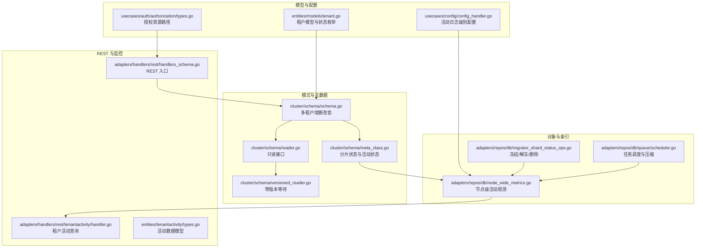
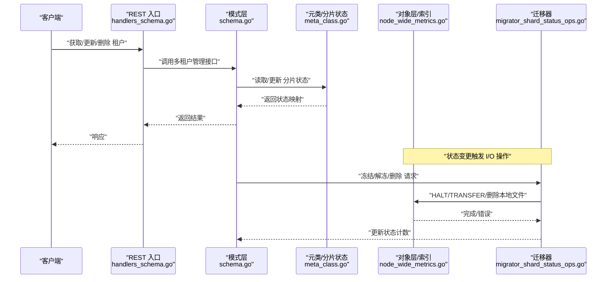
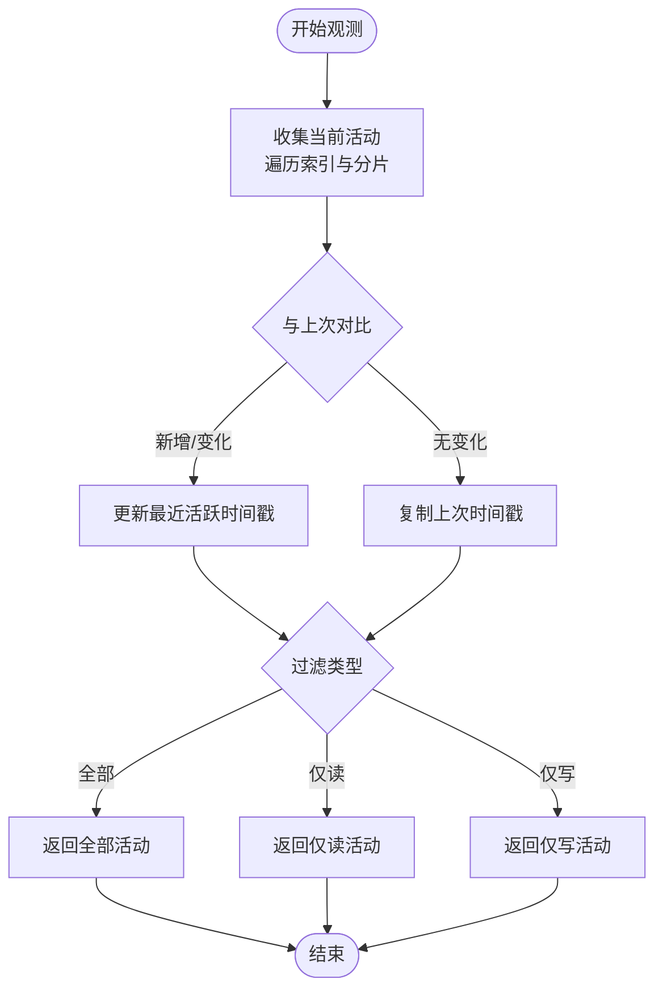
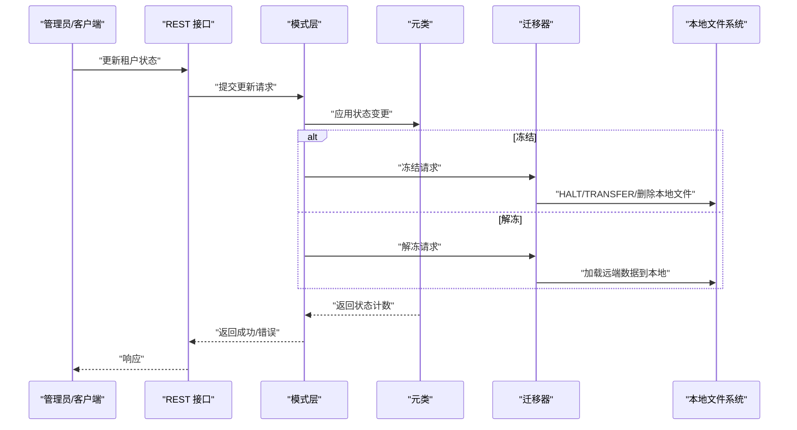
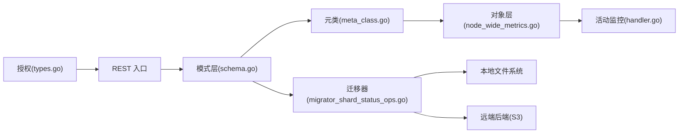

# 多租户存储隔离

<cite>
**本文引用的文件**
- [entities/models/tenant.go](file://entities/models/tenant.go)
- [cluster/schema/schema.go](file://cluster/schema/schema.go)
- [adapters/handlers/rest/tenantactivity/handler.go](file://adapters/handlers/rest/tenantactivity/handler.go)
- [entities/tenantactivity/types.go](file://entities/tenantactivity/types.go)
- [adapters/repos/db/node_wide_metrics.go](file://adapters/repos/db/node_wide_metrics.go)
- [adapters/handlers/rest/operations/schema/tenants_get.go](file://adapters/handlers/rest/operations/schema/tenants_get.go)
- [adapters/handlers/rest/operations/schema/tenants_get_one.go](file://adapters/handlers/rest/operations/schema/tenants_get_one.go)
- [usecases/config/config_handler.go](file://usecases/config/config_handler.go)
- [usecases/schema/manager.go](file://usecases/schema/manager.go)
- [cluster/schema/meta_class.go](file://cluster/schema/meta_class.go)
- [cluster/schema/reader.go](file://cluster/schema/reader.go)
- [cluster/schema/versioned_reader.go](file://cluster/schema/versioned_reader.go)
- [adapters/handlers/rest/handlers_schema.go](file://adapters/handlers/rest/handlers_schema.go)
- [usecases/objects/auto_schema.go](file://usecases/objects/auto_schema.go)
- [adapters/repos/db/migrator_shard_status_ops.go](file://adapters/repos/db/migrator_shard_status_ops.go)
- [adapters/repos/db/queue/scheduler.go](file://adapters/repos/db/queue/scheduler.go)
- [usecases/auth/authorization/types.go](file://usecases/auth/authorization/types.go)
- [test/modules/offload-s3/offload_test.go](file://test/modules/offload-s3/offload_test.go)
- [test/modules/offload-s3/offload_download_test.go](file://test/modules/offload-s3/offload_download_test.go)
- [test/modules/offload-s3/offlad_delete_test.go](file://test/modules/offload-s3/offlad_delete_test.go)
- [test/modules/offload-s3/offload_bucket_test.go](file://test/modules/offload-s3/offload_bucket_test.go)
</cite>

## 目录
1. [引言](#引言)
2. [项目结构](#项目结构)
3. [核心组件](#核心组件)
4. [架构总览](#架构总览)
5. [详细组件分析](#详细组件分析)
6. [依赖关系分析](#依赖关系分析)
7. [性能考量](#性能考量)
8. [故障排查指南](#故障排查指南)
9. [结论](#结论)
10. [附录](#附录)

## 引言
本文件系统性梳理 Weaviate 在多租户（Multi-Tenancy）场景下的存储隔离机制，覆盖数据隔离策略（物理与逻辑）、命名空间与目录组织、文件访问控制、租户活动监控与审计、生命周期管理（创建/删除/状态变更）、性能优化（缓存共享/I/O 调度/资源配额）以及部署最佳实践（安全配置/监控/故障排除）。内容基于仓库中的实际实现进行归纳与可视化说明，帮助读者在理解架构的同时快速定位到关键实现位置。

## 项目结构
Weaviate 的多租户能力横跨“模式层（Schema）”、“对象层（Objects）”、“监控与审计（Tenant Activity）”、“集群与复制（Cluster/Replication）”等多个模块。下图给出与多租户存储隔离相关的关键路径概览：

图表来源
- [cluster/schema/schema.go](file://cluster/schema/schema.go#L460-L659)
- [cluster/schema/meta_class.go](file://cluster/schema/meta_class.go#L135-L151)
- [cluster/schema/reader.go](file://cluster/schema/reader.go#L247-L252)
- [cluster/schema/versioned_reader.go](file://cluster/schema/versioned_reader.go#L130-L139)
- [adapters/repos/db/node_wide_metrics.go](file://adapters/repos/db/node_wide_metrics.go#L220-L419)
- [adapters/repos/db/migrator_shard_status_ops.go](file://adapters/repos/db/migrator_shard_status_ops.go#L67-L239)
- [adapters/repos/db/queue/scheduler.go](file://adapters/repos/db/queue/scheduler.go#L561-L638)
- [adapters/handlers/rest/handlers_schema.go](file://adapters/handlers/rest/handlers_schema.go#L286-L305)
- [adapters/handlers/rest/tenantactivity/handler.go](file://adapters/handlers/rest/tenantactivity/handler.go#L1-L88)
- [entities/tenantactivity/types.go](file://entities/tenantactivity/types.go#L1-L27)
- [entities/models/tenant.go](file://entities/models/tenant.go#L29-L99)
- [usecases/config/config_handler.go](file://usecases/config/config_handler.go#L189-L202)
- [usecases/auth/authorization/types.go](file://usecases/auth/authorization/types.go#L441-L498)

章节来源
- [cluster/schema/schema.go](file://cluster/schema/schema.go#L460-L659)
- [adapters/repos/db/node_wide_metrics.go](file://adapters/repos/db/node_wide_metrics.go#L220-L419)
- [adapters/handlers/rest/tenantactivity/handler.go](file://adapters/handlers/rest/tenantactivity/handler.go#L1-L88)
- [entities/tenantactivity/types.go](file://entities/tenantactivity/types.go#L1-L27)

## 核心组件
- 租户模型与状态：定义租户名称与活动状态枚举，支持 ACTIVE/INACTIVE/OFFLOADED 等状态及迁移态（OFFLOADING/ONLOADING），并在更新时进行校验。
- 模式层多租户管理：提供添加/删除/更新租户、查询租户列表与分片映射等操作，并通过 Raft 应用日志保证一致性。
- 对象层活动观测：周期性收集每个租户的读写活动，生成时间戳用于监控与审计；支持按过滤器返回读/写/全部。
- 迁移与状态转换：支持将热数据（HOT）冻结至远端后端（如 S3），或从远端加载回本地；涉及 HALT/TRANSFER/删除本地文件等步骤。
- 授权与访问控制：根据集合/分片/对象生成授权资源路径，确保对多租户数据的细粒度访问控制。
- 队列与 I/O 调度：对任务进行分组压缩与并发调度，避免热点 I/O 冲突，提升吞吐。

章节来源
- [entities/models/tenant.go](file://entities/models/tenant.go#L29-L99)
- [cluster/schema/schema.go](file://cluster/schema/schema.go#L460-L659)
- [adapters/repos/db/node_wide_metrics.go](file://adapters/repos/db/node_wide_metrics.go#L220-L419)
- [adapters/repos/db/migrator_shard_status_ops.go](file://adapters/repos/db/migrator_shard_status_ops.go#L67-L239)
- [usecases/auth/authorization/types.go](file://usecases/auth/authorization/types.go#L441-L498)
- [adapters/repos/db/queue/scheduler.go](file://adapters/repos/db/queue/scheduler.go#L561-L638)

## 架构总览
下图展示多租户在模式层、对象层与监控层之间的交互流程，以及状态变更（冻结/解冻/删除）如何影响存储布局与访问路径。

图表来源
- [adapters/handlers/rest/handlers_schema.go](file://adapters/handlers/rest/handlers_schema.go#L286-L305)
- [cluster/schema/schema.go](file://cluster/schema/schema.go#L460-L659)
- [cluster/schema/meta_class.go](file://cluster/schema/meta_class.go#L135-L151)
- [adapters/repos/db/migrator_shard_status_ops.go](file://adapters/repos/db/migrator_shard_status_ops.go#L67-L239)
- [adapters/repos/db/node_wide_metrics.go](file://adapters/repos/db/node_wide_metrics.go#L220-L419)

## 详细组件分析

### 数据隔离策略：物理隔离与逻辑隔离
- 物理隔离
  - 冷/冻结状态（OFFLOADED/FROZEN）：数据被迁移至远端后端（如 S3），本地不再持有热数据文件，仅保留最小元信息或空壳，从而实现物理层面的资源隔离与成本降低。
  - 删除租户：当租户被删除时，会尝试删除其本地文件；若处于冷态，直接清理本地目录以释放磁盘空间。
- 逻辑隔离
  - 命名空间与分片映射：每个租户对应一个分片（Shard），通过分片状态（Status）与 BelongsToNodes 映射到具体节点，逻辑上彼此独立。
  - 活动状态（ActivityStatus）：ACTIVE/HOT 表示可查询且驻留本地；INACTIVE/COLD/OFFLOADED 表示不可查询或远程存储；迁移态（OFFLOADING/ONLOADING）由系统内部流转。
  - 授权路径：根据集合/分片/对象生成授权资源路径，确保跨租户访问受控。

章节来源
- [adapters/repos/db/migrator_shard_status_ops.go](file://adapters/repos/db/migrator_shard_status_ops.go#L67-L239)
- [entities/models/tenant.go](file://entities/models/tenant.go#L29-L99)
- [usecases/auth/authorization/types.go](file://usecases/auth/authorization/types.go#L441-L498)

### 存储布局与目录组织
- 目录结构
  - 每个租户对应一个分片目录，路径与集合/分片名称强关联；当租户被冻结/删除时，本地分片目录会被清理或移除。
  - 远端后端（如 S3）作为冷存储介质，数据以桶/前缀组织，迁移器负责上传/下载与路径解析。
- 文件访问控制
  - 通过授权资源路径限制对特定集合/分片/对象的访问，结合租户活动状态决定是否允许读写。
  - 冻结/解冻过程中对分片加锁，避免并发冲突导致的数据损坏。

章节来源
- [adapters/repos/db/migrator_shard_status_ops.go](file://adapters/repos/db/migrator_shard_status_ops.go#L43-L239)
- [usecases/auth/authorization/types.go](file://usecases/auth/authorization/types.go#L441-L498)

### 租户活动监控的存储实现
- 活动观测
  - 定期遍历所有已启用分区的索引，统计每个租户分片的读写计数，生成最近活跃时间戳。
  - 支持三种过滤：全部/仅读/仅写，便于按需导出监控数据。
- 日志与审计
  - 可配置读/写活动的日志级别，便于调试与分析。
  - 提供 REST 接口返回当前节点的租户活动快照，支持按过滤器选择。

图表来源
- [adapters/repos/db/node_wide_metrics.go](file://adapters/repos/db/node_wide_metrics.go#L220-L419)
- [adapters/handlers/rest/tenantactivity/handler.go](file://adapters/handlers/rest/tenantactivity/handler.go#L1-L88)
- [entities/tenantactivity/types.go](file://entities/tenantactivity/types.go#L1-L27)

章节来源
- [adapters/repos/db/node_wide_metrics.go](file://adapters/repos/db/node_wide_metrics.go#L220-L419)
- [adapters/handlers/rest/tenantactivity/handler.go](file://adapters/handlers/rest/tenantactivity/handler.go#L1-L88)
- [entities/tenantactivity/types.go](file://entities/tenantactivity/types.go#L1-L27)
- [usecases/config/config_handler.go](file://usecases/config/config_handler.go#L189-L202)

### 租户生命周期管理
- 创建租户
  - 通过模式层接口添加租户，Raft 应用日志同步到集群，更新分片状态计数。
- 更新租户状态
  - 支持将租户状态从 ACTIVE 更新为 INACTIVE/COLD/OFFLOADED，或反向加载（ONLOADING/UNFREEZING）。
  - 测试覆盖了状态更新、对象写入、查询验证等完整链路。
- 删除租户
  - 删除租户时清理本地文件；若原状态为冷态，直接移除本地目录。

图表来源
- [cluster/schema/schema.go](file://cluster/schema/schema.go#L460-L659)
- [adapters/handlers/rest/handlers_schema.go](file://adapters/handlers/rest/handlers_schema.go#L286-L305)
- [adapters/repos/db/migrator_shard_status_ops.go](file://adapters/repos/db/migrator_shard_status_ops.go#L67-L239)

章节来源
- [cluster/schema/schema.go](file://cluster/schema/schema.go#L460-L659)
- [adapters/handlers/rest/handlers_schema.go](file://adapters/handlers/rest/handlers_schema.go#L286-L305)
- [test/modules/offload-s3/offload_test.go](file://test/modules/offload-s3/offload_test.go#L194-L231)
- [test/modules/offload-s3/offload_download_test.go](file://test/modules/offload-s3/offload_download_test.go#L239-L292)
- [test/modules/offload-s3/offlad_delete_test.go](file://test/modules/offload-s3/offlad_delete_test.go#L324-L409)
- [test/modules/offload-s3/offload_bucket_test.go](file://test/modules/offload-s3/offload_bucket_test.go#L97-L148)

### 多租户分片映射与查询
- 查询租户分片映射
  - 提供 REST 接口返回指定租户的活动状态与版本号，支持隐式激活（当允许时）。
- 只读与版本等待
  - 读取接口封装 Prometheus 计时与版本等待，确保一致性与可观测性。

章节来源
- [usecases/schema/manager.go](file://usecases/schema/manager.go#L259-L268)
- [cluster/schema/meta_class.go](file://cluster/schema/meta_class.go#L135-L151)
- [cluster/schema/reader.go](file://cluster/schema/reader.go#L247-L252)
- [cluster/schema/versioned_reader.go](file://cluster/schema/versioned_reader.go#L130-L139)
- [adapters/handlers/rest/operations/schema/tenants_get.go](file://adapters/handlers/rest/operations/schema/tenants_get.go#L45-L84)
- [adapters/handlers/rest/operations/schema/tenants_get_one.go](file://adapters/handlers/rest/operations/schema/tenants_get_one.go#L45-L84)

## 依赖关系分析
- 组件耦合
  - 模式层（schema.go）是多租户操作的中枢，向上对接 REST 层，向下协调元类与迁移器。
  - 对象层（node_wide_metrics.go）与迁移器（migrator_shard_status_ops.go）紧密协作，共同完成状态变更与 I/O 操作。
  - 监控层（tenantactivity/handler.go）依赖对象层提供的活动数据源。
- 外部集成点
  - 远端后端（如 S3）通过迁移器接入，实现冷数据的上传/下载与路径解析。
  - 授权模块（authorization/types.go）提供资源路径模板，保障跨租户访问控制。

图表来源
- [cluster/schema/schema.go](file://cluster/schema/schema.go#L460-L659)
- [cluster/schema/meta_class.go](file://cluster/schema/meta_class.go#L135-L151)
- [adapters/repos/db/migrator_shard_status_ops.go](file://adapters/repos/db/migrator_shard_status_ops.go#L67-L239)
- [adapters/repos/db/node_wide_metrics.go](file://adapters/repos/db/node_wide_metrics.go#L220-L419)
- [adapters/handlers/rest/tenantactivity/handler.go](file://adapters/handlers/rest/tenantactivity/handler.go#L1-L88)
- [usecases/auth/authorization/types.go](file://usecases/auth/authorization/types.go#L441-L498)

## 性能考量
- 缓存共享
  - 向量量化/缓存组件支持按数据类型分片缓存，减少重复计算与内存占用。
- I/O 调度
  - 任务调度器对同类任务进行分组压缩，降低上下文切换与锁竞争；同时对冷分片不主动加载，避免 I/O 抖动。
- 资源配额管理
  - 通过活动观测与过滤，结合日志级别配置，实现对读写行为的精细化监控与限流建议（需在上层策略中落地）。

章节来源
- [adapters/repos/db/queue/scheduler.go](file://adapters/repos/db/queue/scheduler.go#L561-L638)
- [adapters/repos/db/node_wide_metrics.go](file://adapters/repos/db/node_wide_metrics.go#L220-L419)
- [usecases/config/config_handler.go](file://usecases/config/config_handler.go#L189-L202)

## 故障排查指南
- 租户状态异常
  - 使用 REST 接口查询租户状态与分片映射，确认是否处于迁移态（OFFLOADING/ONLOADING）。
  - 若状态长时间未更新，检查模式层应用日志与版本等待逻辑。
- 冻结/解冻失败
  - 检查迁移器日志，关注 HALT/TRANSFER/删除本地文件阶段的错误；确认远端后端可用性与权限。
- 活动监控缺失
  - 确认活动观测线程已启动，检查过滤参数与日志级别配置；验证对象层是否正确暴露分片活动计数。

章节来源
- [adapters/handlers/rest/handlers_schema.go](file://adapters/handlers/rest/handlers_schema.go#L286-L305)
- [adapters/repos/db/migrator_shard_status_ops.go](file://adapters/repos/db/migrator_shard_status_ops.go#L67-L239)
- [adapters/handlers/rest/tenantactivity/handler.go](file://adapters/handlers/rest/tenantactivity/handler.go#L1-L88)
- [usecases/config/config_handler.go](file://usecases/config/config_handler.go#L189-L202)

## 结论
Weaviate 的多租户存储隔离以“逻辑分片 + 物理迁移”为核心：逻辑上通过分片状态与 BelongsToNodes 实现租户间的数据边界；物理上通过远端后端实现冷数据的隔离与降本。配合完善的活动观测、REST 接口与授权控制，既满足了多租户场景下的数据安全与资源隔离，也为运维提供了可观测与可诊断的能力。在生产环境中，建议结合队列调度与日志级别配置，持续优化 I/O 与缓存策略，确保高并发下的稳定性与性能。

## 附录
- 关键实现路径速览
  - 多租户管理：[cluster/schema/schema.go](file://cluster/schema/schema.go#L460-L659)
  - 租户模型与状态：[entities/models/tenant.go](file://entities/models/tenant.go#L29-L99)
  - 活动监控与过滤：[adapters/repos/db/node_wide_metrics.go](file://adapters/repos/db/node_wide_metrics.go#L220-L419)，[adapters/handlers/rest/tenantactivity/handler.go](file://adapters/handlers/rest/tenantactivity/handler.go#L1-L88)，[entities/tenantactivity/types.go](file://entities/tenantactivity/types.go#L1-L27)
  - 状态迁移与 I/O：[adapters/repos/db/migrator_shard_status_ops.go](file://adapters/repos/db/migrator_shard_status_ops.go#L67-L239)
  - 分片映射与查询：[usecases/schema/manager.go](file://usecases/schema/manager.go#L259-L268)，[cluster/schema/meta_class.go](file://cluster/schema/meta_class.go#L135-L151)，[cluster/schema/reader.go](file://cluster/schema/reader.go#L247-L252)，[cluster/schema/versioned_reader.go](file://cluster/schema/versioned_reader.go#L130-L139)
  - 授权路径：[usecases/auth/authorization/types.go](file://usecases/auth/authorization/types.go#L441-L498)
  - 日志级别配置：[usecases/config/config_handler.go](file://usecases/config/config_handler.go#L189-L202)