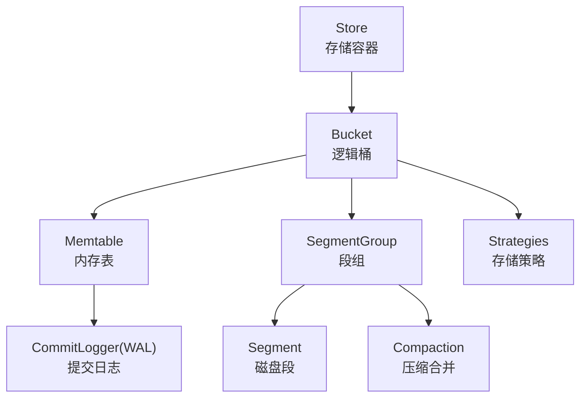
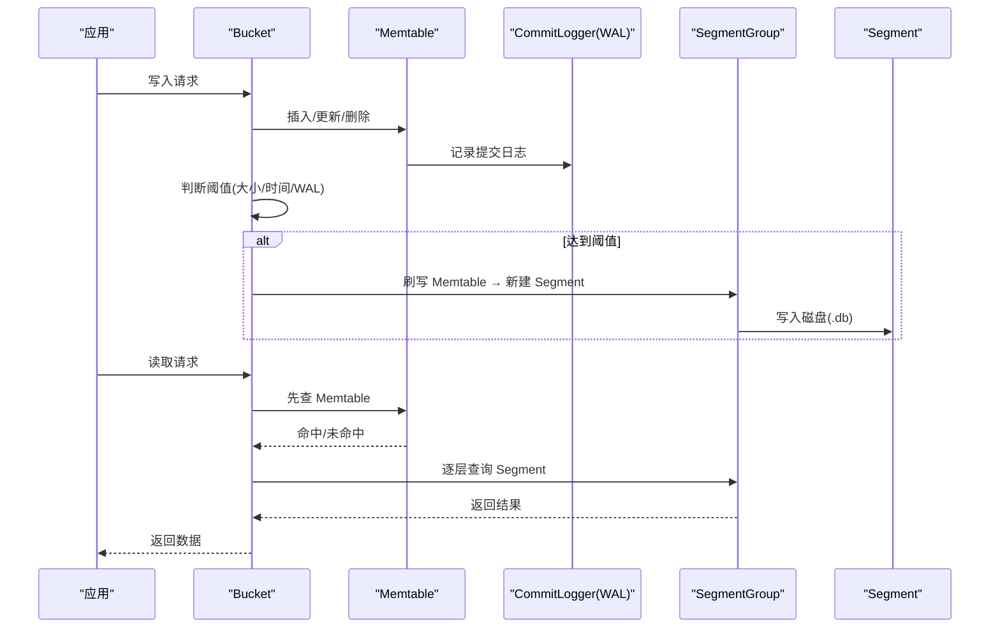
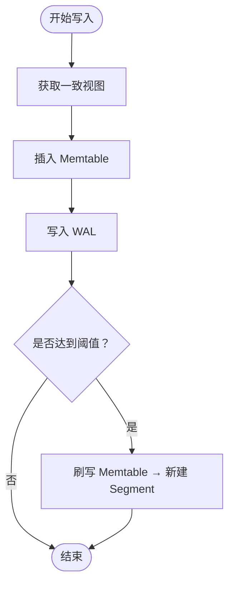
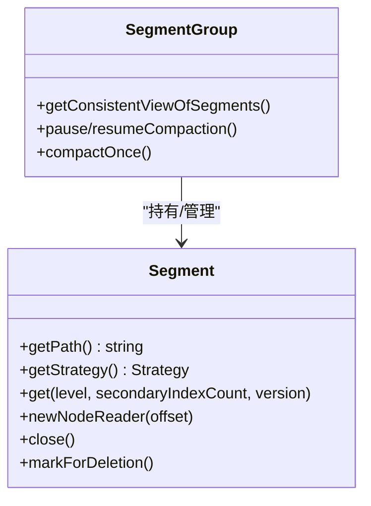
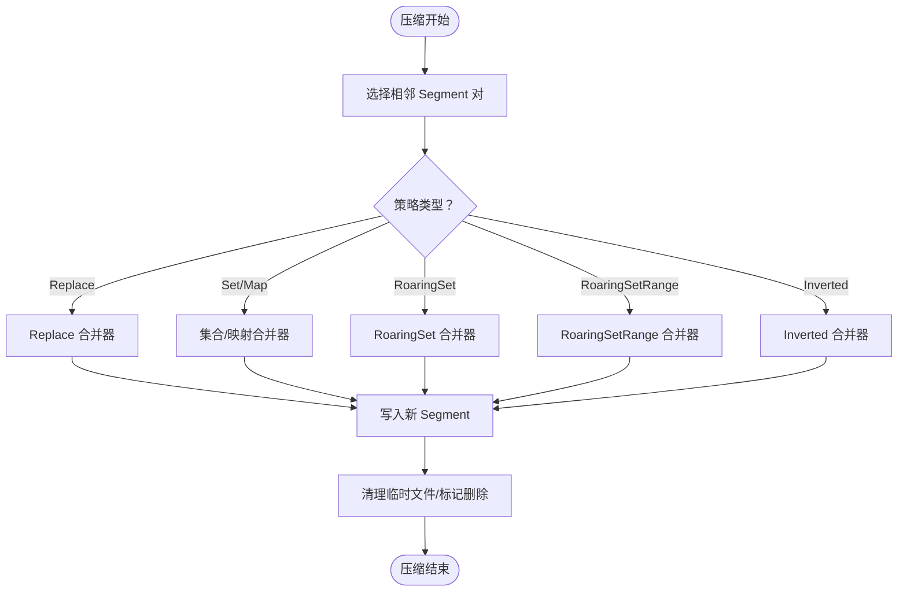
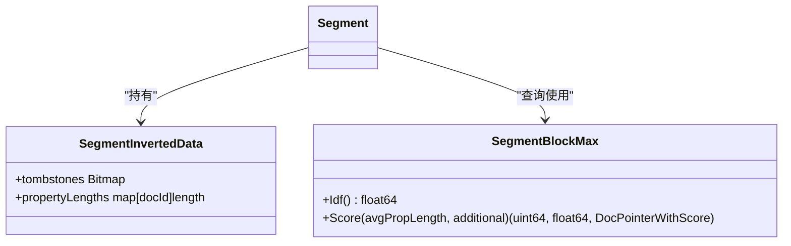
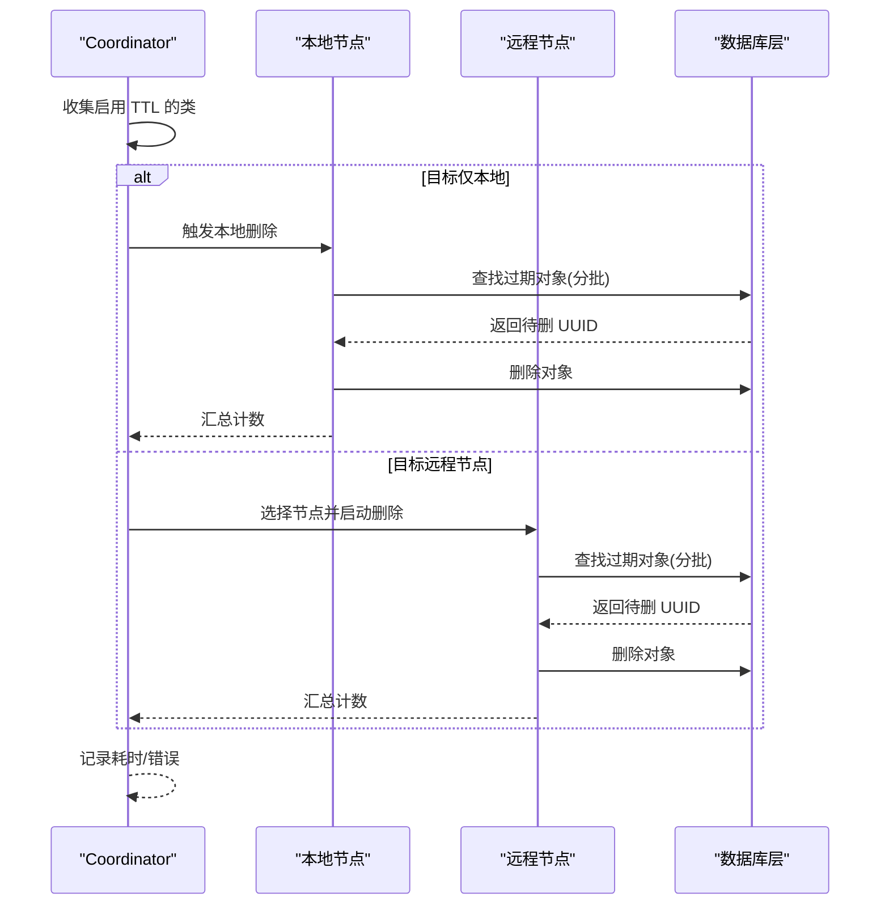
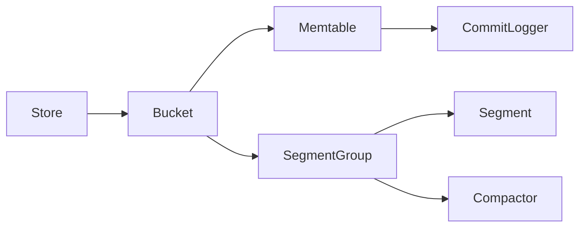

# 存储引擎

<cite>
**本文引用的文件**
- [segment.go](file://adapters/repos/db/lsmkv/segment.go)
- [commitlogger.go](file://adapters/repos/db/lsmkv/commitlogger.go)
- [strategies.go](file://adapters/repos/db/lsmkv/strategies.go)
- [store.go](file://adapters/repos/db/lsmkv/store.go)
- [bucket.go](file://adapters/repos/db/lsmkv/bucket.go)
- [memtable.go](file://adapters/repos/db/lsmkv/memtable.go)
- [segment_group.go](file://adapters/repos/db/lsmkv/segment_group.go)
- [segment_group_compaction.go](file://adapters/repos/db/lsmkv/segment_group_compaction.go)
- [binary_search_tree.go](file://adapters/repos/db/lsmkv/binary_search_tree.go)
- [binary_search_tree_map.go](file://adapters/repos/db/lsmkv/binary_search_tree_map.go)
- [segment_blockmax.go](file://adapters/repos/db/lsmkv/segment_blockmax.go)
- [prop_length_tracker.go](file://adapters/repos/db/inverted/prop_length_tracker.go)
- [object_ttl.go](file://usecases/object_ttl/object_ttl.go)
- [index.go](file://adapters/repos/db/index.go)
- [configure_api.go](file://adapters/handlers/rest/configure_api.go)
- [environment.go](file://usecases/config/environment.go)
- [segment_serialization_benchmarks_test.go](file://adapters/repos/db/lsmkv/segment_serialization_benchmarks_test.go)
- [buf_pool.go](file://adapters/repos/db/roaringset/buf_pool.go)
- [buf_pool_test.go](file://adapters/repos/db/roaringset/buf_pool_test.go)
</cite>

## 目录
1. [简介](#简介)
2. [项目结构](#项目结构)
3. [核心组件](#核心组件)
4. [架构总览](#架构总览)
5. [组件详解](#组件详解)
6. [依赖关系分析](#依赖关系分析)
7. [性能考量与优化建议](#性能考量与优化建议)
8. [故障排查指南](#故障排查指南)
9. [结论](#结论)
10. [附录：配置参数与容量规划](#附录配置参数与容量规划)

## 简介
本文件面向系统管理员与性能工程师，对 Weaviate 的存储引擎进行深度技术解析。Weaviate 的 LSM-Tree 存储引擎以“分层有序”为核心思想，结合内存表（Memtable）、提交日志（WAL）、磁盘段（Segment）与压缩（Compaction）策略，实现高吞吐写入与高效检索。本文将从数据写入流程、内存表管理、磁盘文件组织与合并策略入手，深入解析倒排索引的实现机制（词项索引、位置信息、统计信息），并覆盖多租户数据隔离、TTL 过期清理与垃圾回收策略。最后提供性能优化建议、配置参数说明与容量规划指导。

## 项目结构
Weaviate 的 LSM-Tree 存储位于 adapters/repos/db/lsmkv 目录下，围绕以下关键模块组织：
- Store：存储容器，管理多个 Bucket
- Bucket：逻辑桶，聚合 Memtable 与 SegmentGroup
- Memtable：内存表，支持多种策略（替换、集合、映射、倒排等）
- Segment/SegmentGroup：磁盘段与段组，负责持久化与压缩
- CommitLogger：提交日志（WAL），保障写入持久性
- Strategies：存储策略枚举与校验
- Inverted Index：倒排索引相关实现（词项、频率、位置、统计）

图表来源
- [store.go](file://adapters/repos/db/lsmkv/store.go#L43-L86)
- [bucket.go](file://adapters/repos/db/lsmkv/bucket.go#L77-L195)
- [memtable.go](file://adapters/repos/db/lsmkv/memtable.go#L110-L150)
- [segment.go](file://adapters/repos/db/lsmkv/segment.go#L96-L130)
- [commitlogger.go](file://adapters/repos/db/lsmkv/commitlogger.go#L176-L190)
- [strategies.go](file://adapters/repos/db/lsmkv/strategies.go#L20-L47)

章节来源
- [store.go](file://adapters/repos/db/lsmkv/store.go#L43-L86)
- [bucket.go](file://adapters/repos/db/lsmkv/bucket.go#L77-L195)

## 核心组件
- Store：负责创建/加载桶、统一生命周期管理、并行作业与迁移文件管理
- Bucket：封装 Memtable 与 SegmentGroup，协调阈值触发（脏时长、大小、WAL 大小）、并发读写控制、状态管理
- Memtable：按策略维护键值/集合/映射/倒排等数据结构，提供 WAL 写入、刷写到磁盘能力
- Segment/SegmentGroup：磁盘段与段组，负责段加载、索引构建、布隆过滤器、元数据、清理与压缩
- CommitLogger：延迟初始化的 WAL，采用 CRC 校验，支持批量刷写与同步
- Strategies：策略枚举与校验，确保段文件与策略一致

章节来源
- [store.go](file://adapters/repos/db/lsmkv/store.go#L43-L86)
- [bucket.go](file://adapters/repos/db/lsmkv/bucket.go#L77-L195)
- [memtable.go](file://adapters/repos/db/lsmkv/memtable.go#L110-L150)
- [segment.go](file://adapters/repos/db/lsmkv/segment.go#L96-L130)
- [commitlogger.go](file://adapters/repos/db/lsmkv/commitlogger.go#L176-L190)
- [strategies.go](file://adapters/repos/db/lsmkv/strategies.go#L20-L47)

## 架构总览
LSM-Tree 在 Weaviate 中的运行时视图如下：
- 写入路径：应用写入 → Memtable（含 WAL）→ 触发阈值后刷写为 Segment
- 读取路径：优先 Memtable（最新），再逐层 Segment 查询；支持布隆过滤器快速判定
- 压缩路径：多级 Segment 合并，按策略选择合并器，生成新层级的 Segment
- 倒排索引：在 inverted 策略下，维护词项、频率、位置、属性长度统计与墓碑位图

图表来源
- [bucket.go](file://adapters/repos/db/lsmkv/bucket.go#L554-L628)
- [memtable.go](file://adapters/repos/db/lsmkv/memtable.go#L198-L200)
- [commitlogger.go](file://adapters/repos/db/lsmkv/commitlogger.go#L300-L327)
- [segment_group_compaction.go](file://adapters/repos/db/lsmkv/segment_group_compaction.go#L344-L424)

## 组件详解

### 数据写入流程与内存表管理
- 写入入口：Bucket.GetConsistentView 获取一致视图，先查 Memtable，再查 SegmentGroup
- Memtable 插入：根据策略插入二叉搜索树或集合/映射/倒排结构，并写入 WAL
- 触发刷写：当 Memtable 大小、脏时长或 WAL 超过阈值时，触发刷写
- 刷写过程：Memtable 将数据序列化为 Segment 文件，生成索引与可选元数据

图表来源
- [bucket.go](file://adapters/repos/db/lsmkv/bucket.go#L554-L628)
- [memtable.go](file://adapters/repos/db/lsmkv/memtable.go#L198-L200)
- [commitlogger.go](file://adapters/repos/db/lsmkv/commitlogger.go#L300-L327)

章节来源
- [bucket.go](file://adapters/repos/db/lsmkv/bucket.go#L554-L628)
- [memtable.go](file://adapters/repos/db/lsmkv/memtable.go#L198-L200)
- [commitlogger.go](file://adapters/repos/db/lsmkv/commitlogger.go#L300-L327)

### 磁盘文件组织与段加载
- 段头与索引：段文件包含头部、主索引、可选次级索引、倒排头（inverted 策略），支持校验与预读
- 内存映射与全读：根据段大小与内存压力决定 mmap 或全量读取，减少系统调用
- 布隆过滤器：可选启用，加速键存在性判断
- 元数据与计数：支持预计算 net additions 与元数据文件持久化

图表来源
- [segment.go](file://adapters/repos/db/lsmkv/segment.go#L96-L130)
- [segment.go](file://adapters/repos/db/lsmkv/segment.go#L399-L419)
- [segment_group.go](file://adapters/repos/db/lsmkv/segment_group.go#L40-L98)

章节来源
- [segment.go](file://adapters/repos/db/lsmkv/segment.go#L96-L130)
- [segment.go](file://adapters/repos/db/lsmkv/segment.go#L399-L419)
- [segment_group.go](file://adapters/repos/db/lsmkv/segment_group.go#L40-L98)

### 合并策略与压缩
- 合并触发：SegmentGroup 定期检查并执行一次压缩，按策略选择对应合并器
- 合并器：
  - Replace：去重/覆盖合并
  - Set/MapCollection：集合/映射合并，支持排序与跳过键
  - RoaringSet/RoaringSetRange：位图/范围位图合并
  - Inverted：倒排合并，计算平均属性长度、BM25 参数
- 清理墓碑：根段合并时可清理无用墓碑，降低冗余

图表来源
- [segment_group_compaction.go](file://adapters/repos/db/lsmkv/segment_group_compaction.go#L344-L424)

章节来源
- [segment_group_compaction.go](file://adapters/repos/db/lsmkv/segment_group_compaction.go#L344-L424)

### 倒排索引实现机制
- 词项索引：基于磁盘树索引，支持快速定位词项区间
- 频率与位置：倒排段包含词频、文档频率、位置信息，用于 BM25 评分与精确匹配
- 统计信息：属性长度统计、平均属性长度，用于评分归一化
- 墓碑与删除：倒排策略支持墓碑位图，删除/更新通过墓碑标识
- 查询路径：SegmentBlockMax 提供块级遍历、IDF 计算、评分输出

图表来源
- [segment.go](file://adapters/repos/db/lsmkv/segment.go#L125-L127)
- [segment_blockmax.go](file://adapters/repos/db/lsmkv/segment_blockmax.go#L487-L521)
- [prop_length_tracker.go](file://adapters/repos/db/inverted/prop_length_tracker.go#L1-L23)

章节来源
- [segment.go](file://adapters/repos/db/lsmkv/segment.go#L125-L127)
- [segment_blockmax.go](file://adapters/repos/db/lsmkv/segment_blockmax.go#L487-L521)
- [prop_length_tracker.go](file://adapters/repos/db/inverted/prop_length_tracker.go#L1-L23)

### 多租户数据隔离与资源管理
- 多租户隔离：每个租户拥有独立的存储桶与段组，读写互不干扰
- 并发控制：Bucket 使用 flushLock 保护刷写过程，避免并发冲突
- 资源管理：Store 统一管理桶生命周期，支持并行关闭与迁移文件处理

章节来源
- [store.go](file://adapters/repos/db/lsmkv/store.go#L218-L248)
- [bucket.go](file://adapters/repos/db/lsmkv/bucket.go#L87-L88)

### TTL 过期数据清理与垃圾回收
- 协调器：Coordinator 负责扫描启用了 TTL 的类，按阈值计算过期对象
- 本地/远程执行：可在本地节点或指定远程节点执行删除，避免重复执行
- 分批删除：按批次查找并删除 UUID，支持暂停间隔与并发因子
- 垃圾回收：删除完成后释放引用，等待后续压缩清理冗余

图表来源
- [object_ttl.go](file://usecases/object_ttl/object_ttl.go#L136-L184)
- [object_ttl.go](file://usecases/object_ttl/object_ttl.go#L187-L234)
- [index.go](file://adapters/repos/db/index.go#L2655-L2698)

章节来源
- [object_ttl.go](file://usecases/object_ttl/object_ttl.go#L136-L184)
- [object_ttl.go](file://usecases/object_ttl/object_ttl.go#L187-L234)
- [index.go](file://adapters/repos/db/index.go#L2655-L2698)

## 依赖关系分析
- Bucket 依赖 SegmentGroup 管理磁盘段，依赖 Memtable 提供内存缓冲
- Memtable 依赖 CommitLogger 实现 WAL，依赖多种数据结构（BST、RoaringSet、RoaringSetRange）
- SegmentGroup 依赖各策略的合并器完成压缩
- Store 统一管理多个 Bucket，并提供并行作业与迁移文件处理

图表来源
- [store.go](file://adapters/repos/db/lsmkv/store.go#L43-L86)
- [bucket.go](file://adapters/repos/db/lsmkv/bucket.go#L77-L195)
- [segment_group_compaction.go](file://adapters/repos/db/lsmkv/segment_group_compaction.go#L344-L424)

章节来源
- [store.go](file://adapters/repos/db/lsmkv/store.go#L43-L86)
- [bucket.go](file://adapters/repos/db/lsmkv/bucket.go#L77-L195)
- [segment_group_compaction.go](file://adapters/repos/db/lsmkv/segment_group_compaction.go#L344-L424)

## 性能考量与优化建议
- 缓存策略
  - 段预读：大段启用 mmap，小段全读，结合内存压力检测，平衡 I/O 与内存占用
  - 布隆过滤器：对高频键存在性查询启用布隆过滤器，减少磁盘访问
  - 倒排索引：对倒排段启用内存保留与位图缓冲池，提升查询性能
- 预读与 I/O 优化
  - 使用 Metered Reader/Writer 观测 I/O，识别热点与瓶颈
  - 合理设置最小 mmap 阈值，避免小文件 mmap 带来的额外开销
- 压缩与清理
  - 控制段大小上限与清理间隔，避免过多小段影响查询
  - 倒排合并时清理墓碑，减少冗余
- 并发与批处理
  - 批量写入时尽量复用 WAL 缓冲，减少刷写次数
  - TTL 删除支持并发因子与暂停间隔，避免削峰

章节来源
- [segment.go](file://adapters/repos/db/lsmkv/segment.go#L214-L253)
- [segment.go](file://adapters/repos/db/lsmkv/segment.go#L686-L702)
- [buf_pool.go](file://adapters/repos/db/roaringset/buf_pool.go#L96-L131)
- [segment_serialization_benchmarks_test.go](file://adapters/repos/db/lsmkv/segment_serialization_benchmarks_test.go#L106-L142)

## 故障排查指南
- 写入失败
  - 检查 WAL 是否成功写入与同步
  - 关注 Memtable 刷写是否被并发写阻塞
- 读取异常
  - 确认布隆过滤器与段索引是否正确加载
  - 检查一致性视图获取是否超时
- 压缩问题
  - 观察压缩日志与段大小变化，确认策略匹配
  - 检查内存压力导致的 mmap 失败
- TTL 删除
  - 确认 Coordinator 是否在目标节点重复执行
  - 检查分批删除与暂停间隔配置

章节来源
- [commitlogger.go](file://adapters/repos/db/lsmkv/commitlogger.go#L390-L406)
- [bucket.go](file://adapters/repos/db/lsmkv/bucket.go#L524-L543)
- [segment_group.go](file://adapters/repos/db/lsmkv/segment_group.go#L122-L152)
- [object_ttl.go](file://usecases/object_ttl/object_ttl.go#L220-L230)

## 结论
Weaviate 的 LSM-Tree 存储引擎通过 Memtable+WAL+Segment+Compaction 的组合，在保证高吞吐写入的同时，提供了灵活的策略扩展与高效的倒排检索能力。结合布隆过滤器、段预读与缓冲池等优化手段，可在大规模场景下获得稳定性能。TTL 与多租户隔离进一步增强了生产环境的可用性与安全性。建议在部署时结合业务特征调整阈值与清理策略，并持续监控 I/O 与内存指标以实现最佳效果。

## 附录：配置参数与容量规划
- 环境变量与持久化配置
  - 内存表最小/最大活跃时长
  - 最大 WAL 复用大小
  - LSM 段清理间隔、最大段大小、分离对象压缩
  - 倒排索引范围可内存化
- REST 层配置透传
  - 懒加载段禁用、段信息写入文件名、元数据文件写入开关、TTL 相关参数等

章节来源
- [environment.go](file://usecases/config/environment.go#L1258-L1298)
- [configure_api.go](file://adapters/handlers/rest/configure_api.go#L416-L430)