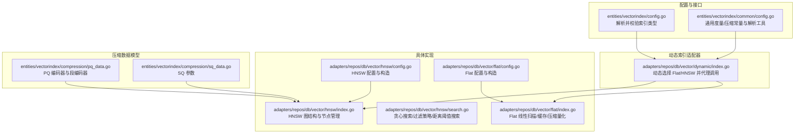
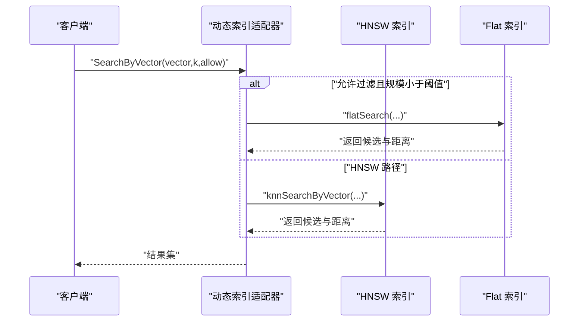
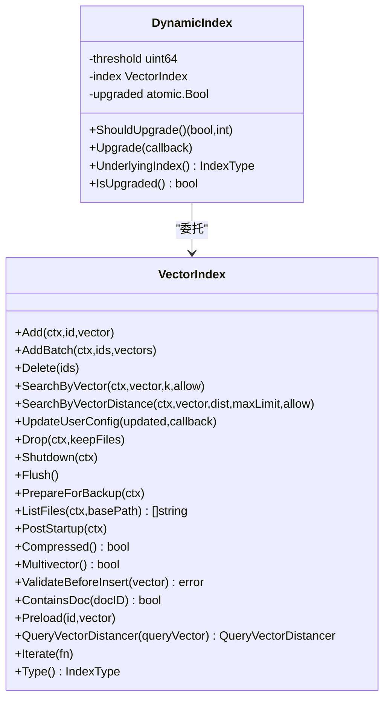
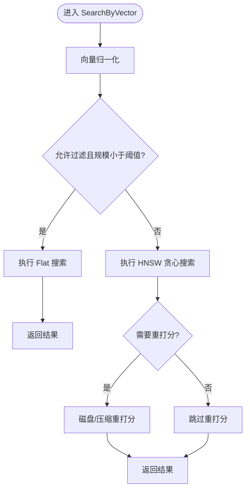
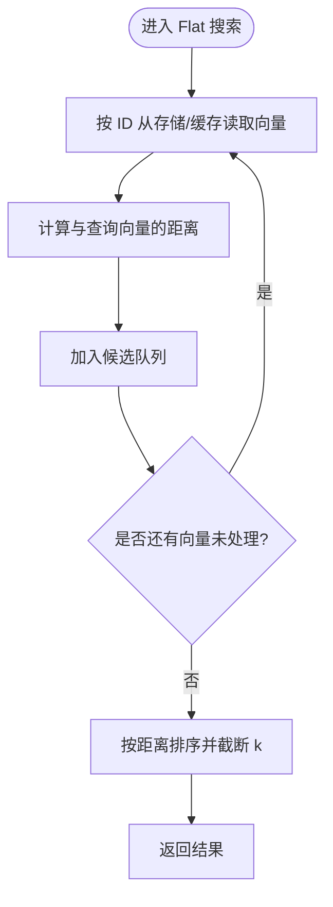
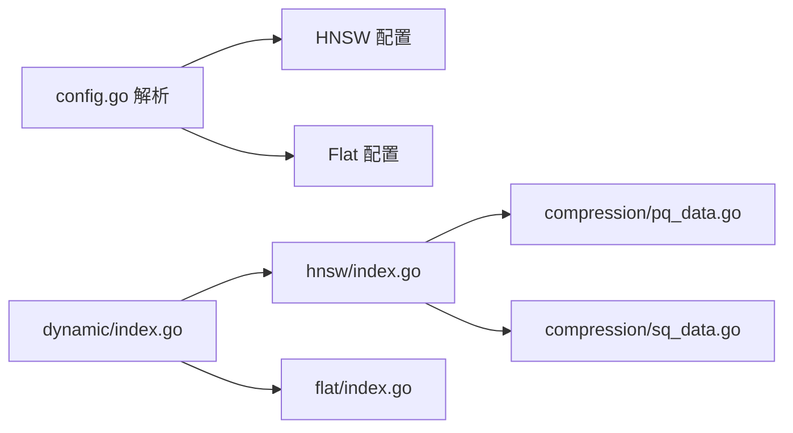

# 向量搜索

<cite>
**本文引用的文件**
- [entities/vectorindex/config.go](file://entities/vectorindex/config.go)
- [entities/vectorindex/common/config.go](file://entities/vectorindex/common/config.go)
- [adapters/repos/db/vector/dynamic/index.go](file://adapters/repos/db/vector/dynamic/index.go)
- [adapters/repos/db/vector/hnsw/config.go](file://adapters/repos/db/vector/hnsw/config.go)
- [adapters/repos/db/vector/flat/config.go](file://adapters/repos/db/vector/flat/config.go)
- [adapters/repos/db/vector/hnsw/index.go](file://adapters/repos/db/vector/hnsw/index.go)
- [adapters/repos/db/vector/hnsw/search.go](file://adapters/repos/db/vector/hnsw/search.go)
- [adapters/repos/db/vector/flat/index.go](file://adapters/repos/db/vector/flat/index.go)
- [entities/vectorindex/compression/pq_data.go](file://entities/vectorindex/compression/pq_data.go)
- [entities/vectorindex/compression/sq_data.go](file://entities/vectorindex/compression/sq_data.go)
</cite>

## 目录
1. [简介](#简介)
2. [项目结构](#项目结构)
3. [核心组件](#核心组件)
4. [架构总览](#架构总览)
5. [详细组件分析](#详细组件分析)
6. [依赖关系分析](#依赖关系分析)
7. [性能考量](#性能考量)
8. [故障排查指南](#故障排查指南)
9. [结论](#结论)
10. [附录](#附录)

## 简介
本文件面向 Weaviate 的向量搜索系统，系统性阐述向量索引接口设计、HNSW 近似最近邻（ANN）搜索算法实现、Flat 线性搜索机制、动态索引的自适应升级策略，以及向量压缩（PQ、SQ、RQ 等）对性能与精度的影响。同时给出相似性计算方法（余弦、欧氏、点积）与查询流程，并提供性能优化建议、参数配置与最佳实践。

## 项目结构
Weaviate 的向量搜索由“索引类型解析”“通用配置与度量”“动态索引适配器”“HNSW/Flat 具体实现”“压缩数据模型”等模块组成。整体采用“接口抽象 + 多实现”的分层设计，支持在运行时根据阈值自动从 Flat 升级到 HNSW。

图表来源
- [entities/vectorindex/config.go](file://entities/vectorindex/config.go#L32-L51)
- [adapters/repos/db/vector/dynamic/index.go](file://adapters/repos/db/vector/dynamic/index.go#L124-L220)
- [adapters/repos/db/vector/hnsw/config.go](file://adapters/repos/db/vector/hnsw/config.go#L26-L58)
- [adapters/repos/db/vector/flat/config.go](file://adapters/repos/db/vector/flat/config.go#L22-L30)
- [adapters/repos/db/vector/hnsw/index.go](file://adapters/repos/db/vector/hnsw/index.go#L44-L200)
- [adapters/repos/db/vector/hnsw/search.go](file://adapters/repos/db/vector/hnsw/search.go#L78-L163)
- [adapters/repos/db/vector/flat/index.go](file://adapters/repos/db/vector/flat/index.go#L49-L125)
- [entities/vectorindex/compression/pq_data.go](file://entities/vectorindex/compression/pq_data.go#L40-L51)
- [entities/vectorindex/compression/sq_data.go](file://entities/vectorindex/compression/sq_data.go#L14-L20)

章节来源
- [entities/vectorindex/config.go](file://entities/vectorindex/config.go#L24-L51)
- [adapters/repos/db/vector/dynamic/index.go](file://adapters/repos/db/vector/dynamic/index.go#L124-L220)

## 核心组件
- 索引类型解析与校验：根据输入字符串解析为 HNSW/Flat/Dynamic/HFresh，并进行配置校验。
- 动态索引适配器：根据阈值与已索引数量在 Flat 与 HNSW 之间自动切换；对外暴露统一的 VectorIndex 接口。
- HNSW 实现：基于层次化导航小世界图（HNSW），支持贪心搜索、过滤策略（SWEEPING/ACORN/RRE）、距离阈值搜索、多向量与压缩。
- Flat 实现：线性扫描存储中的向量，支持缓存与多种压缩（BQ/RQ/PQ/SQ）。
- 压缩数据模型：定义 PQ/SQ 的序列化数据结构，支撑训练与恢复。

章节来源
- [entities/vectorindex/config.go](file://entities/vectorindex/config.go#L32-L51)
- [adapters/repos/db/vector/dynamic/index.go](file://adapters/repos/db/vector/dynamic/index.go#L58-L83)
- [adapters/repos/db/vector/hnsw/index.go](file://adapters/repos/db/vector/hnsw/index.go#L44-L200)
- [adapters/repos/db/vector/flat/index.go](file://adapters/repos/db/vector/flat/index.go#L49-L125)
- [entities/vectorindex/compression/pq_data.go](file://entities/vectorindex/compression/pq_data.go#L40-L51)
- [entities/vectorindex/compression/sq_data.go](file://entities/vectorindex/compression/sq_data.go#L14-L20)

## 架构总览
Weaviate 的向量搜索以“动态索引适配器”为核心，向上提供统一接口，向下根据阈值与状态选择 Flat 或 HNSW。HNSW 在查询路径中可按过滤规模与策略选择贪心搜索或退化为 Flat 搜索；在插入/删除路径中维护图结构与压缩器。Flat 则直接在线性扫描中完成检索，并可结合缓存与压缩提升性能。

图表来源
- [adapters/repos/db/vector/dynamic/index.go](file://adapters/repos/db/vector/dynamic/index.go#L342-L352)
- [adapters/repos/db/vector/hnsw/search.go](file://adapters/repos/db/vector/hnsw/search.go#L78-L92)
- [adapters/repos/db/vector/flat/index.go](file://adapters/repos/db/vector/flat/index.go#L1-L200)

## 详细组件分析

### 向量索引接口与动态选择策略
- VectorIndex 接口：统一的增删改查、配置更新、文件备份/列举、预热、查询距离器、遍历等能力。
- VectorIndexMulti 接口：在 VectorIndex 基础上扩展多向量搜索能力（如多视图/多模态融合）。
- 动态索引策略：当已索引样本数达到阈值时，异步触发从 Flat 升级到 HNSW；升级过程中保留搜索可用性，使用短批复制数据，完成后原子替换索引并清理旧桶。

图表来源
- [adapters/repos/db/vector/dynamic/index.go](file://adapters/repos/db/vector/dynamic/index.go#L58-L83)
- [adapters/repos/db/vector/dynamic/index.go](file://adapters/repos/db/vector/dynamic/index.go#L465-L478)

章节来源
- [adapters/repos/db/vector/dynamic/index.go](file://adapters/repos/db/vector/dynamic/index.go#L58-L83)
- [adapters/repos/db/vector/dynamic/index.go](file://adapters/repos/db/vector/dynamic/index.go#L465-L512)
- [adapters/repos/db/vector/dynamic/index.go](file://adapters/repos/db/vector/dynamic/index.go#L514-L616)

### HNSW 近似最近邻搜索算法
- 图构建与节点管理：内部维护 vertex 数组与多层连接，entryPoint 随最大层级增长而更新；通过最大连接数限制与层级归一化控制图密度。
- 贪婪搜索（knnSearchByVector）：从最高层入口开始，维护候选优先队列，按距离逐步下沉至底层，最终收敛到 k 结果。
- 过滤策略：支持 SWEEPING/ACORN/RRE 三种策略，依据过滤集合大小与配置选择最优路径；当过滤规模低于 flatSearchCutoff 时退化为 Flat 搜索。
- 距离阈值搜索：基于目标距离递归扩大搜索范围，直至满足阈值内全部结果。
- 多向量与交互重排序：支持多向量查询与后期交互重排序，提升跨模态检索质量。
- 压缩与重打分：压缩后需对候选进行重打分，可通过并发度与缓存策略优化冷启动性能。

图表来源
- [adapters/repos/db/vector/hnsw/search.go](file://adapters/repos/db/vector/hnsw/search.go#L78-L92)
- [adapters/repos/db/vector/hnsw/search.go](file://adapters/repos/db/vector/hnsw/search.go#L131-L146)
- [adapters/repos/db/vector/hnsw/index.go](file://adapters/repos/db/vector/hnsw/index.go#L182-L189)

章节来源
- [adapters/repos/db/vector/hnsw/index.go](file://adapters/repos/db/vector/hnsw/index.go#L44-L200)
- [adapters/repos/db/vector/hnsw/search.go](file://adapters/repos/db/vector/hnsw/search.go#L78-L163)

### Flat 线性搜索机制
- 存储与缓存：使用 LSMKV 存储原始向量，支持可选缓存以减少重复读取；缓存类型随压缩方式变化（如 RQ8 使用字节缓存）。
- 压缩与量化：支持 BQ（位宽量化）、RQ（旋转量化，1/8 位）等；压缩后通过量化器与缓存加速检索。
- 线性扫描：逐条计算距离，适用于小规模或压缩场景下的快速检索；可与 HNSW 的过滤策略配合使用。

图表来源
- [adapters/repos/db/vector/flat/index.go](file://adapters/repos/db/vector/flat/index.go#L1-L200)

章节来源
- [adapters/repos/db/vector/flat/index.go](file://adapters/repos/db/vector/flat/index.go#L49-L125)
- [adapters/repos/db/vector/flat/index.go](file://adapters/repos/db/vector/flat/index.go#L155-L195)

### 相似性计算方法
- 距离度量常量：支持余弦（cosine）、点积（dot）、平方 L2（l2-squared）、曼哈顿（manhattan）、汉明（hamming）等。
- 默认度量：默认余弦距离，适合高维单位化向量；点积用于内积相似；平方 L2 适合欧氏距离的高效实现。
- 查询距离器：动态索引适配器提供 QueryVectorDistancer，用于在不同索引间保持一致的查询语义。

章节来源
- [entities/vectorindex/common/config.go](file://entities/vectorindex/common/config.go#L22-L32)
- [adapters/repos/db/vector/dynamic/index.go](file://adapters/repos/db/vector/dynamic/index.go#L77-L77)

### 向量压缩技术（PQ/SQ/RQ）
- PQ（Product Quantization）：将维度划分为段，每段独立量化，支持 Tile/KMeans 编码器；通过段编码器训练与恢复，降低存储与带宽开销。
- SQ（Scalar Quantization）：对每个维度进行标量量化，保存尺度与偏移参数，适合低比特近似。
- RQ（Rotated Quantization）：通过旋转矩阵将向量映射到新空间再进行量化，通常与 BQ 组合使用以提升精度。
- 数据模型：PQData/SQData 定义了压缩参数与编码器元数据，便于持久化与恢复。

章节来源
- [entities/vectorindex/compression/pq_data.go](file://entities/vectorindex/compression/pq_data.go#L40-L51)
- [entities/vectorindex/compression/sq_data.go](file://entities/vectorindex/compression/sq_data.go#L14-L20)
- [adapters/repos/db/vector/hnsw/index.go](file://adapters/repos/db/vector/hnsw/index.go#L170-L195)

### 参数配置与最佳实践
- 索引类型解析：默认 HNSW，支持动态切换；解析时校验类型合法性。
- HNSW 配置：包含根路径、ID、向量获取回调、距离提供者、快照开关、等待缓存预热、异步索引等。
- Flat 配置：包含根路径、ID、目标向量、距离提供者、缓存与压缩策略等。
- 最佳实践：
  - 小规模数据（< 阈值）使用 Flat，避免 HNSW 构建开销；
  - 大规模数据达到阈值后启用动态升级；
  - 启用缓存与合适的重打分并发度，缓解压缩后的重打分延迟；
  - 根据向量维度与精度需求选择压缩方案（PQ/SQ/RQ/BQ）。

章节来源
- [entities/vectorindex/config.go](file://entities/vectorindex/config.go#L24-L51)
- [adapters/repos/db/vector/hnsw/config.go](file://adapters/repos/db/vector/hnsw/config.go#L26-L58)
- [adapters/repos/db/vector/flat/config.go](file://adapters/repos/db/vector/flat/config.go#L22-L30)
- [adapters/repos/db/vector/dynamic/index.go](file://adapters/repos/db/vector/dynamic/index.go#L124-L220)

## 依赖关系分析
- 类型解析依赖各子模块的配置解析函数，确保输入类型与实现一致。
- 动态索引依赖 HNSW/Flat 的具体实现，并在升级时进行数据迁移与资源清理。
- HNSW 依赖压缩辅助库与距离提供者，支持多向量与过滤策略。
- Flat 依赖缓存与量化器，结合压缩策略提升检索效率。

图表来源
- [entities/vectorindex/config.go](file://entities/vectorindex/config.go#L32-L51)
- [adapters/repos/db/vector/dynamic/index.go](file://adapters/repos/db/vector/dynamic/index.go#L124-L220)
- [adapters/repos/db/vector/hnsw/index.go](file://adapters/repos/db/vector/hnsw/index.go#L170-L195)
- [entities/vectorindex/compression/pq_data.go](file://entities/vectorindex/compression/pq_data.go#L40-L51)
- [entities/vectorindex/compression/sq_data.go](file://entities/vectorindex/compression/sq_data.go#L14-L20)

章节来源
- [entities/vectorindex/config.go](file://entities/vectorindex/config.go#L32-L51)
- [adapters/repos/db/vector/dynamic/index.go](file://adapters/repos/db/vector/dynamic/index.go#L124-L220)

## 性能考量
- 索引预加载：动态索引在升级前会分批复制向量，避免长时间阻塞；可结合 Wait/CachePrefill 与异步索引提升启动速度。
- 批量操作：HNSW/Flat 均支持批量插入，减少锁竞争与 IO 次数。
- 内存管理：压缩与缓存策略需平衡内存占用与命中率；重打分并发度应与 CPU 核数匹配。
- 过滤与阈值：合理设置 flatSearchCutoff 与 ef 参数，避免在大过滤集下走 HNSW 导致性能下降。
- 压缩选择：PQ 适合高维长尾分布；SQ/BQ/RQ 适合低比特近似与快速检索；需权衡精度与存储/带宽。

## 故障排查指南
- 升级失败：检查动态索引升级日志与上下文取消状态；确认 bbolt 桶写入与 HNSW 目录存在性。
- 搜索异常：确认过滤规模与阈值设置；检查是否误退化为 Flat 搜索；验证距离提供者与向量归一化。
- 压缩问题：核对压缩配置与重打分限制；检查量化器初始化与持久化；关注缓存命中与并发重打分。
- 文件与备份：使用 PrepareForBackup/ListFiles 确认索引文件路径；注意升级后旧桶清理与压缩桶一致性。

章节来源
- [adapters/repos/db/vector/dynamic/index.go](file://adapters/repos/db/vector/dynamic/index.go#L487-L512)
- [adapters/repos/db/vector/dynamic/index.go](file://adapters/repos/db/vector/dynamic/index.go#L514-L616)
- [adapters/repos/db/vector/hnsw/search.go](file://adapters/repos/db/vector/hnsw/search.go#L78-L92)
- [adapters/repos/db/vector/hnsw/index.go](file://adapters/repos/db/vector/hnsw/index.go#L182-L189)

## 结论
Weaviate 的向量搜索通过“动态索引适配器 + HNSW/Flat 双实现 + 压缩与缓存”的组合，在不同规模与精度需求下提供高效、可扩展的相似性检索能力。合理配置阈值、压缩与缓存策略，结合过滤与阈值搜索，可在保证召回的同时显著降低延迟与资源消耗。

## 附录
- 示例与参数建议（基于源码行为总结）：
  - 小规模（< 阈值）：使用 Flat，启用缓存与合适重打分限制。
  - 大规模（≥ 阈值）：启用动态升级；HNSW 设置合理的 ef、flatSearchCutoff 与快照策略。
  - 压缩策略：高维长尾用 PQ；低比特近似用 SQ/BQ/RQ；注意重打分并发度与缓存命中。
- 关键流程参考：
  - 动态升级流程：[adapters/repos/db/vector/dynamic/index.go](file://adapters/repos/db/vector/dynamic/index.go#L487-L616)
  - HNSW 贪心搜索：[adapters/repos/db/vector/hnsw/search.go](file://adapters/repos/db/vector/hnsw/search.go#L78-L92)
  - Flat 线性搜索：[adapters/repos/db/vector/flat/index.go](file://adapters/repos/db/vector/flat/index.go#L1-L200)