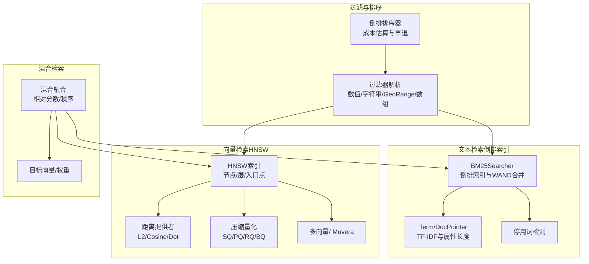
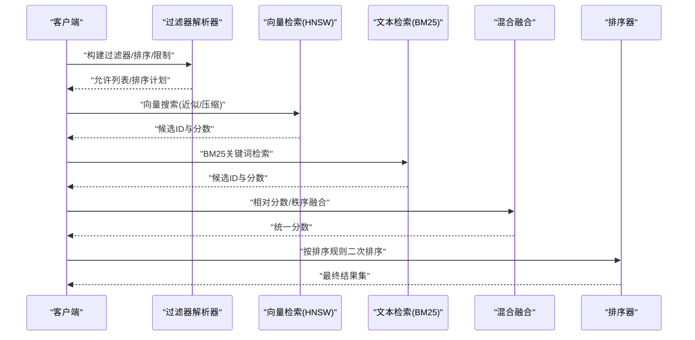
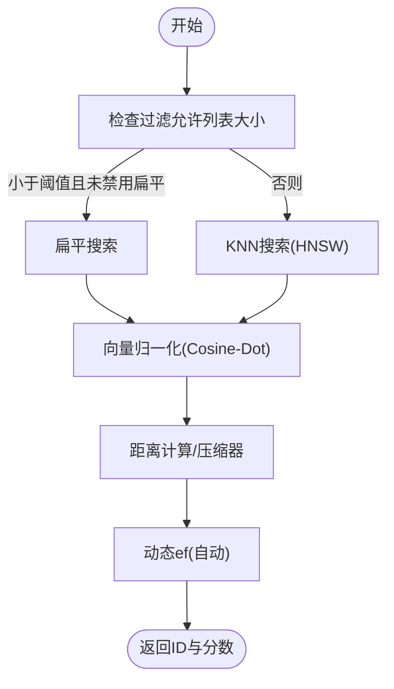
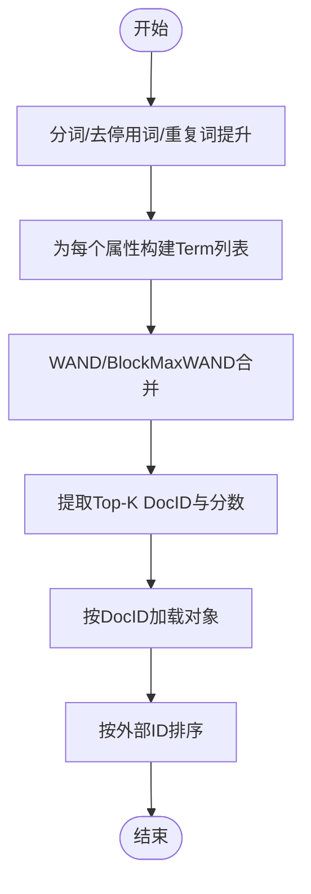
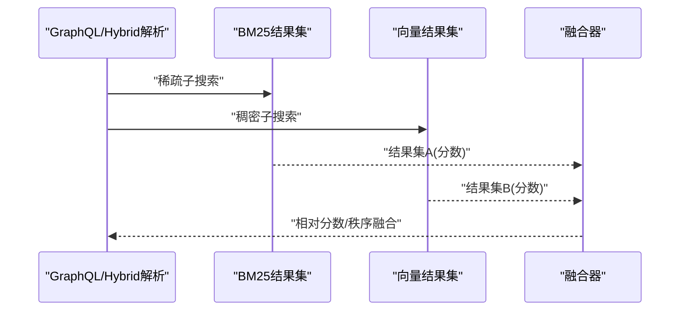
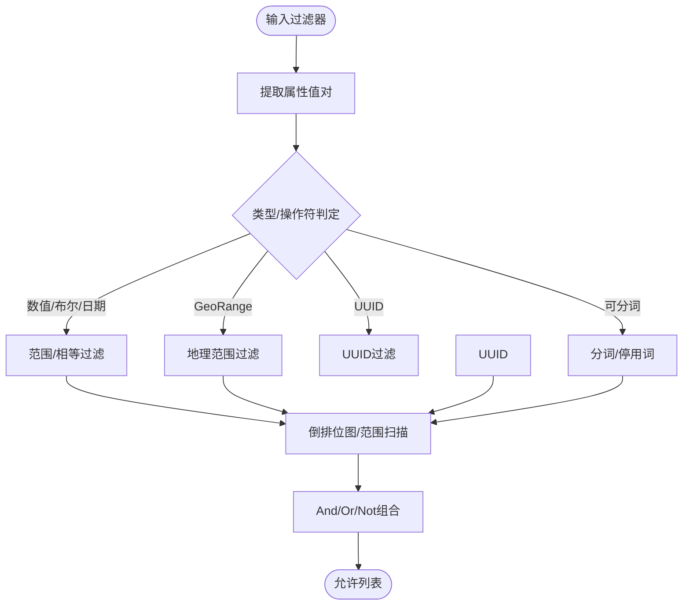
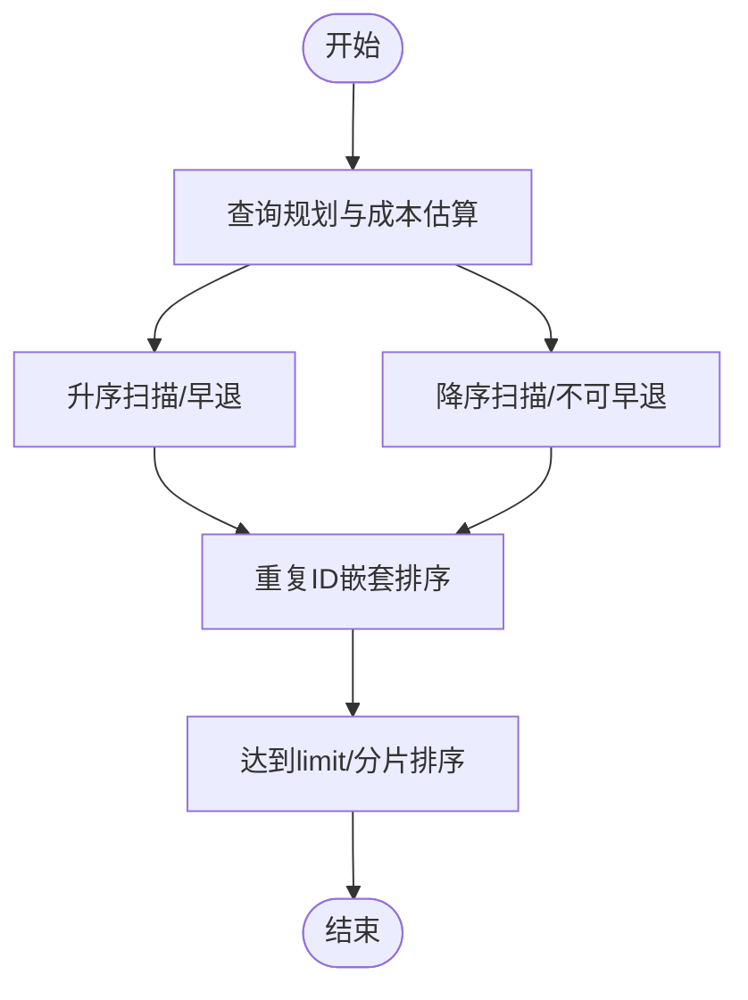
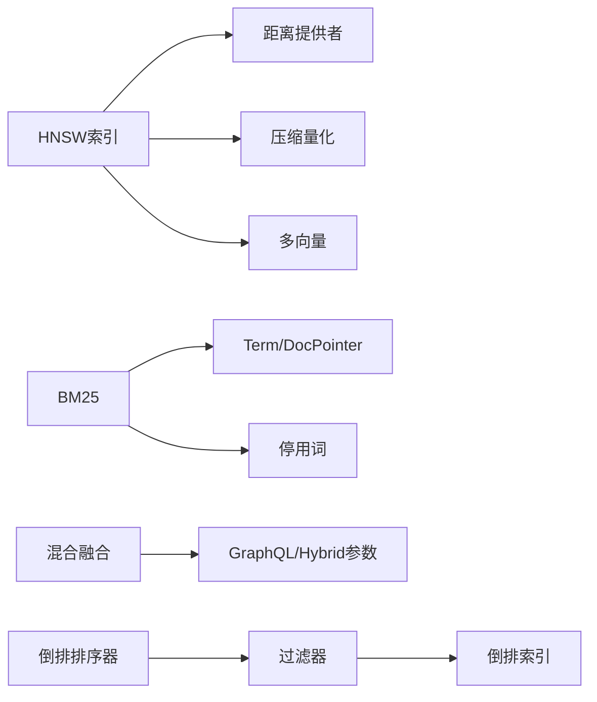

# 搜索引擎

<cite>
**本文引用的文件**
- [adapters/repos/db/vector/hnsw/index.go](file://adapters/repos/db/vector/hnsw/index.go)
- [adapters/repos/db/vector/hnsw/search.go](file://adapters/repos/db/vector/hnsw/search.go)
- [adapters/repos/db/vector/hnsw/flat_search.go](file://adapters/repos/db/vector/hnsw/flat_search.go)
- [adapters/repos/db/inverted/bm25_searcher.go](file://adapters/repos/db/inverted/bm25_searcher.go)
- [adapters/repos/db/inverted/terms/terms.go](file://adapters/repos/db/inverted/terms/terms.go)
- [adapters/repos/db/inverted/searcher.go](file://adapters/repos/db/inverted/searcher.go)
- [usecases/traverser/hybrid/hybrid_fusion.go](file://usecases/traverser/hybrid/hybrid_fusion.go)
- [adapters/handlers/graphql/local/common_filters/hybrid.go](file://adapters/handlers/graphql/local/common_filters/hybrid.go)
- [adapters/repos/db/sorter/inverted_sorter.go](file://adapters/repos/db/sorter/inverted_sorter.go)
- [adapters/repos/db/sorter/query_planner.go](file://adapters/repos/db/sorter/query_planner.go)
- [entities/filters/filters.go](file://entities/filters/filters.go)
- [entities/models/where_filter.go](file://entities/models/where_filter.go)
- [grpc/generated/protocol/v1/base.pb.go](file://grpc/generated/protocol/v1/base.pb.go)
- [adapters/repos/db/index.go](file://adapters/repos/db/index.go)
- [entities/vectorindex/hnsw/config.go](file://entities/vectorindex/hnsw/config.go)
- [adapters/repos/db/vector/compressionhelpers/scalar_quantization_test.go](file://adapters/repos/db/vector/compressionhelpers/scalar_quantization_test.go)
- [adapters/repos/db/vector/hnsw/compress_sift_test.go](file://adapters/repos/db/vector/hnsw/compress_sift_test.go)
- [test/benchmark_bm25/cmd/import.go](file://test/benchmark_bm25/cmd/import.go)
</cite>

## 目录
1. [简介](#简介)
2. [项目结构](#项目结构)
3. [核心组件](#核心组件)
4. [架构总览](#架构总览)
5. [详细组件分析](#详细组件分析)
6. [依赖关系分析](#依赖关系分析)
7. [性能考量](#性能考量)
8. [故障排查指南](#故障排查指南)
9. [结论](#结论)
10. [附录](#附录)

## 简介
本文件面向不同技能水平的开发者，系统化梳理 Weaviate 搜索引擎在向量检索、文本检索（BM25）、混合检索、过滤器与排序、以及结果处理方面的实现原理与优化策略。内容覆盖：
- 向量索引选择与相似度计算：HNSW、压缩量化（SQ/PQ/RQ/BQ）与多向量支持
- 文本检索机制：BM25 关键词匹配、倒排索引构建与查询解析
- 混合搜索融合：相对分数归一化融合与秩序融合
- 过滤器系统：数值、字符串、布尔、日期、UUID、GeoRange、数组/集合等
- 排序与结果集处理：基于倒排索引的排序与成本估算
- 性能优化与查询模式最佳实践：动态 ef、扁平搜索阈值、压缩与缓存、WAND/BlockMaxWAND、停止词与最小 OR 匹配

## 项目结构
Weaviate 的搜索由“倒排索引 + 向量索引”双引擎协同完成，并通过混合检索将语义与关键词检索融合，最终统一排序与返回。

图示来源
- [adapters/repos/db/inverted/bm25_searcher.go](file://adapters/repos/db/inverted/bm25_searcher.go#L88-L132)
- [adapters/repos/db/vector/hnsw/index.go](file://adapters/repos/db/vector/hnsw/index.go#L44-L214)
- [usecases/traverser/hybrid/hybrid_fusion.go](file://usecases/traverser/hybrid/hybrid_fusion.go#L93-L182)
- [adapters/repos/db/inverted/searcher.go](file://adapters/repos/db/inverted/searcher.go#L241-L258)
- [adapters/repos/db/sorter/inverted_sorter.go](file://adapters/repos/db/sorter/inverted_sorter.go#L94-L187)

章节来源
- [adapters/repos/db/inverted/bm25_searcher.go](file://adapters/repos/db/inverted/bm25_searcher.go#L88-L132)
- [adapters/repos/db/vector/hnsw/index.go](file://adapters/repos/db/vector/hnsw/index.go#L44-L214)
- [usecases/traverser/hybrid/hybrid_fusion.go](file://usecases/traverser/hybrid/hybrid_fusion.go#L93-L182)
- [adapters/repos/db/inverted/searcher.go](file://adapters/repos/db/inverted/searcher.go#L241-L258)
- [adapters/repos/db/sorter/inverted_sorter.go](file://adapters/repos/db/sorter/inverted_sorter.go#L94-L187)

## 核心组件
- 向量检索（HNSW）
  - HNSW 构建与搜索：入口点、层高、连接数、ef 参数、扁平搜索阈值
  - 距离提供者：支持 L2、Cosine、Dot；Cosine-Dot 需要向量归一化
  - 压缩量化：SQ/PQ/RQ/BQ，运行时切换与统计
  - 多向量：Muvera 编码与映射存储
- 文本检索（BM25）
  - 倒排索引桶：按属性分桶，支持多种 tokenization
  - WAND/BlockMaxWAND：多路 Term 合并，支持最小 OR 匹配
  - 停用词：Word Tokenization 下移除停用词
  - TF-IDF：基于属性平均长度与重复词提升
- 混合检索
  - 相对分数归一化融合：按各源最大/最小值归一后加权求和
  - 秩序融合：基于秩次的加权累加
- 过滤器与排序
  - 过滤器：数值、字符串、布尔、日期、UUID、GeoRange、数组/集合、NULL 判定
  - 排序：倒排排序器的成本估算与早退策略，支持多字段嵌套排序

章节来源
- [adapters/repos/db/vector/hnsw/index.go](file://adapters/repos/db/vector/hnsw/index.go#L44-L214)
- [adapters/repos/db/vector/hnsw/search.go](file://adapters/repos/db/vector/hnsw/search.go#L78-L92)
- [adapters/repos/db/inverted/bm25_searcher.go](file://adapters/repos/db/inverted/bm25_searcher.go#L238-L364)
- [usecases/traverser/hybrid/hybrid_fusion.go](file://usecases/traverser/hybrid/hybrid_fusion.go#L93-L182)
- [adapters/repos/db/inverted/searcher.go](file://adapters/repos/db/inverted/searcher.go#L241-L258)
- [adapters/repos/db/sorter/inverted_sorter.go](file://adapters/repos/db/sorter/inverted_sorter.go#L94-L187)

## 架构总览
Weaviate 的搜索流程分为“过滤与预筛选”、“向量检索”、“文本检索”、“混合融合”、“排序与结果截断”。

图示来源
- [adapters/repos/db/inverted/searcher.go](file://adapters/repos/db/inverted/searcher.go#L84-L118)
- [adapters/repos/db/vector/hnsw/search.go](file://adapters/repos/db/vector/hnsw/search.go#L78-L92)
- [adapters/repos/db/inverted/bm25_searcher.go](file://adapters/repos/db/inverted/bm25_searcher.go#L88-L132)
- [usecases/traverser/hybrid/hybrid_fusion.go](file://usecases/traverser/hybrid/hybrid_fusion.go#L93-L182)
- [adapters/repos/db/sorter/inverted_sorter.go](file://adapters/repos/db/sorter/inverted_sorter.go#L94-L187)

## 详细组件分析

### 向量索引与相似度计算
- HNSW 结构与参数
  - 入口点、最大连接数、层归一化、efConstruction、ef、动态 ef（min/max/factor）
  - 扁平搜索阈值与并发、是否禁止扁平搜索
  - 压缩开关、Rescore 并发、多向量与 Muvera
- 搜索路径
  - SearchByVector：根据过滤后的允许列表决定走 flatSearch 或 knnSearch
  - autoEfFromK：根据 k 自动推导 ef，避免过早截断
  - QueryVectorDistancer：按是否压缩选择压缩器或常规距离提供者
- 归一化
  - Cosine-Dot 需要向量归一化，提供 in-place 归一化以减少分配

图示来源
- [adapters/repos/db/vector/hnsw/search.go](file://adapters/repos/db/vector/hnsw/search.go#L78-L92)
- [adapters/repos/db/vector/hnsw/index.go](file://adapters/repos/db/vector/hnsw/index.go#L890-L943)
- [adapters/repos/db/vector/hnsw/flat_search.go](file://adapters/repos/db/vector/hnsw/flat_search.go#L28-L47)

章节来源
- [adapters/repos/db/vector/hnsw/index.go](file://adapters/repos/db/vector/hnsw/index.go#L44-L214)
- [adapters/repos/db/vector/hnsw/search.go](file://adapters/repos/db/vector/hnsw/search.go#L78-L92)
- [adapters/repos/db/vector/hnsw/flat_search.go](file://adapters/repos/db/vector/hnsw/flat_search.go#L28-L47)

### 文本检索（BM25）与倒排索引
- 查询准备
  - 统计对象总数 N、属性平均长度、各 tokenization 的查询词与重复词提升
  - 生成 Term 列表（按属性与属性提升）
- 检索执行
  - createTerm：从倒排桶读取 DocPointerWithScore，合并多属性结果，计算 IDF
  - WAND/BlockMaxWAND：多路 Term 合并，支持最小 OR 匹配
  - 可选额外解释：每条命中记录的频率与属性长度
- 对象加载与排序
  - 通过对象桶按 DocID 加载对象，按外部 ID 排序

图示来源
- [adapters/repos/db/inverted/bm25_searcher.go](file://adapters/repos/db/inverted/bm25_searcher.go#L138-L237)
- [adapters/repos/db/inverted/bm25_searcher.go](file://adapters/repos/db/inverted/bm25_searcher.go#L238-L364)
- [adapters/repos/db/inverted/bm25_searcher.go](file://adapters/repos/db/inverted/bm25_searcher.go#L450-L463)
- [adapters/repos/db/inverted/terms/terms.go](file://adapters/repos/db/inverted/terms/terms.go#L222-L261)

章节来源
- [adapters/repos/db/inverted/bm25_searcher.go](file://adapters/repos/db/inverted/bm25_searcher.go#L88-L132)
- [adapters/repos/db/inverted/bm25_searcher.go](file://adapters/repos/db/inverted/bm25_searcher.go#L238-L364)
- [adapters/repos/db/inverted/terms/terms.go](file://adapters/repos/db/inverted/terms/terms.go#L222-L261)

### 混合搜索算法
- 相对分数归一化融合
  - 计算每个源的最大/最小 SecondarySortValue，归一化到 [0,1] 后乘以权重再累加
  - 支持降序/升序排序，二次排序值相同时按 ID 稳定排序
- 秩序融合
  - 基于秩次的加权累加，保留更多信息差异
- GraphQL/Hybrid 参数解析
  - 支持 nearText/nearVector/spaseSearch 子搜索，设置 alpha、fusionType、maxVectorDistance、properties、bm25SearchOperator 等

图示来源
- [usecases/traverser/hybrid/hybrid_fusion.go](file://usecases/traverser/hybrid/hybrid_fusion.go#L93-L182)
- [adapters/handlers/graphql/local/common_filters/hybrid.go](file://adapters/handlers/graphql/local/common_filters/hybrid.go#L30-L188)

章节来源
- [usecases/traverser/hybrid/hybrid_fusion.go](file://usecases/traverser/hybrid/hybrid_fusion.go#L93-L182)
- [adapters/handlers/graphql/local/common_filters/hybrid.go](file://adapters/handlers/graphql/local/common_filters/hybrid.go#L30-L188)

### 过滤器系统
- 支持操作符
  - 数值：Equal、NotEqual、GreaterThan、GreaterThanEqual、LessThan、LessThanEqual
  - 字符串：Equal、Like、IsNull
  - 地理：WithinGeoRange
  - 数组/集合：ContainsAny、ContainsAll、ContainsNone
  - 逻辑：And、Or、Not
- 解析与执行
  - 提取属性值对（propValuePair），按类型转换为字节值
  - GeoRange、UUID、内部属性（ID、时间戳）、可分词属性（停用词处理）
  - 支持嵌套过滤与 ContainsAny 的停用词特殊处理

图示来源
- [adapters/repos/db/inverted/searcher.go](file://adapters/repos/db/inverted/searcher.go#L260-L342)
- [adapters/repos/db/inverted/searcher.go](file://adapters/repos/db/inverted/searcher.go#L478-L498)
- [adapters/repos/db/inverted/searcher.go](file://adapters/repos/db/inverted/searcher.go#L500-L538)
- [adapters/repos/db/inverted/searcher.go](file://adapters/repos/db/inverted/searcher.go#L634-L688)
- [entities/filters/filters.go](file://entities/filters/filters.go#L21-L100)
- [entities/models/where_filter.go](file://entities/models/where_filter.go#L30-L97)
- [grpc/generated/protocol/v1/base.pb.go](file://grpc/generated/protocol/v1/base.pb.go#L905-L1024)

章节来源
- [adapters/repos/db/inverted/searcher.go](file://adapters/repos/db/inverted/searcher.go#L260-L342)
- [adapters/repos/db/inverted/searcher.go](file://adapters/repos/db/inverted/searcher.go#L478-L498)
- [adapters/repos/db/inverted/searcher.go](file://adapters/repos/db/inverted/searcher.go#L500-L538)
- [adapters/repos/db/inverted/searcher.go](file://adapters/repos/db/inverted/searcher.go#L634-L688)
- [entities/filters/filters.go](file://entities/filters/filters.go#L21-L100)
- [entities/models/where_filter.go](file://entities/models/where_filter.go#L30-L97)
- [grpc/generated/protocol/v1/base.pb.go](file://grpc/generated/protocol/v1/base.pb.go#L905-L1024)

### 排序机制与结果集处理
- 倒排排序器
  - 单字段快速路径：按 DocID 顺序扫描，支持早退
  - 多字段嵌套：遇到重复 ID 时启动嵌套排序
  - 成本估算：考虑磁盘访问与 JSON 反序列化，结合过滤命中率
- 结果集处理
  - 多分片场景下按 ID 排序兜底
  - 自动剪枝（autocut）与显式 limit 截断
  - 参考查询不施加限制，保证参考完整性

图示来源
- [adapters/repos/db/sorter/inverted_sorter.go](file://adapters/repos/db/sorter/inverted_sorter.go#L94-L187)
- [adapters/repos/db/sorter/query_planner.go](file://adapters/repos/db/sorter/query_planner.go#L102-L141)
- [adapters/repos/db/index.go](file://adapters/repos/db/index.go#L1856-L1892)

章节来源
- [adapters/repos/db/sorter/inverted_sorter.go](file://adapters/repos/db/sorter/inverted_sorter.go#L94-L187)
- [adapters/repos/db/sorter/query_planner.go](file://adapters/repos/db/sorter/query_planner.go#L102-L141)
- [adapters/repos/db/index.go](file://adapters/repos/db/index.go#L1856-L1892)

## 依赖关系分析
- 向量索引依赖
  - 距离提供者与归一化策略（Cosine-Dot）
  - 压缩量化组件（SQ/PQ/RQ/BQ）与运行时切换
  - 多向量映射与 Muvera 存储
- 文本索引依赖
  - 倒排桶策略（StrategyInverted）与属性均值跟踪
  - 停用词检测与 tokenization
  - WAND/BlockMaxWAND 合并与最小 OR 匹配
- 混合检索依赖
  - GraphQL/Hybrid 参数解析与目标向量组合
  - 融合算法（相对分数/秩序）与解释分数累积
- 过滤与排序依赖
  - 属性索引能力（可过滤/可搜索/可范围）
  - 倒排排序器的成本模型与早退策略

图示来源
- [adapters/repos/db/vector/hnsw/index.go](file://adapters/repos/db/vector/hnsw/index.go#L44-L214)
- [adapters/repos/db/inverted/bm25_searcher.go](file://adapters/repos/db/inverted/bm25_searcher.go#L88-L132)
- [usecases/traverser/hybrid/hybrid_fusion.go](file://usecases/traverser/hybrid/hybrid_fusion.go#L93-L182)
- [adapters/repos/db/inverted/searcher.go](file://adapters/repos/db/inverted/searcher.go#L241-L258)
- [adapters/repos/db/sorter/inverted_sorter.go](file://adapters/repos/db/sorter/inverted_sorter.go#L94-L187)

章节来源
- [adapters/repos/db/vector/hnsw/index.go](file://adapters/repos/db/vector/hnsw/index.go#L44-L214)
- [adapters/repos/db/inverted/bm25_searcher.go](file://adapters/repos/db/inverted/bm25_searcher.go#L88-L132)
- [usecases/traverser/hybrid/hybrid_fusion.go](file://usecases/traverser/hybrid/hybrid_fusion.go#L93-L182)
- [adapters/repos/db/inverted/searcher.go](file://adapters/repos/db/inverted/searcher.go#L241-L258)
- [adapters/repos/db/sorter/inverted_sorter.go](file://adapters/repos/db/sorter/inverted_sorter.go#L94-L187)

## 性能考量
- 向量检索
  - 动态 ef：根据 k 自动调整 ef，避免早期截断导致召回下降
  - 扁平搜索阈值：小规模过滤时走扁平搜索，降低 HNSW 层级遍历开销
  - 压缩量化：SQ/PQ/RQ/BQ 在大体量数据上显著节省内存与加速检索，需关注首次 Rescore 开销
  - 多向量：Muvera 编码适合多片段向量，注意映射存储与查询路径
- 文本检索
  - BlockMaxWAND 与 WAND：在多属性/多词合并时显著提速
  - 停用词：Word Tokenization 下移除停用词，减少无效 Term
  - 最小 OR 匹配：控制召回与精度平衡
- 混合检索
  - 相对分数归一化：保留源间相对差异，适合不同置信尺度
  - 秩序融合：对秩次敏感的场景更稳健
- 过滤与排序
  - 倒排排序器成本估算：在过滤命中率低时优先对象桶策略
  - 早退策略：升序扫描在满足 limit 时可提前退出
- 实战基准
  - BM25 基准工具输出查询耗时、吞吐、指标分布与 NDCG/P@1/P@5，便于调参与回归

章节来源
- [adapters/repos/db/vector/hnsw/search.go](file://adapters/repos/db/vector/hnsw/search.go#L60-L76)
- [adapters/repos/db/vector/hnsw/index.go](file://adapters/repos/db/vector/hnsw/index.go#L890-L943)
- [adapters/repos/db/vector/compressionhelpers/scalar_quantization_test.go](file://adapters/repos/db/vector/compressionhelpers/scalar_quantization_test.go#L121-L131)
- [adapters/repos/db/vector/hnsw/compress_sift_test.go](file://adapters/repos/db/vector/hnsw/compress_sift_test.go#L305-L483)
- [adapters/repos/db/inverted/bm25_searcher.go](file://adapters/repos/db/inverted/bm25_searcher.go#L108-L129)
- [adapters/repos/db/sorter/query_planner.go](file://adapters/repos/db/sorter/query_planner.go#L102-L141)
- [test/benchmark_bm25/cmd/import.go](file://test/benchmark_bm25/cmd/import.go#L238-L247)

## 故障排查指南
- 常见错误与定位
  - 缺少可搜索/可过滤索引：文本属性必须具备相应索引才能参与过滤或 BM25
  - GeoRange 类型错误：仅 geoCoordinates 属性可使用 WithinGeoRange
  - UUID 过滤格式：需传入合法 UUID 字符串
  - 停用词全部命中：ContainsAny 在所有词均为停用词时会报错
  - 过滤器与排序组合：多分片场景下排序策略与 limit 行为需关注
- 日志与慢查询追踪
  - 使用 AnnotateSlowQueryLog 记录方法、耗时、过滤规模、Top-K 数量等，辅助定位瓶颈
- 建议排查步骤
  - 确认过滤器类型与属性索引能力
  - 检查 tokenization 与停用词配置
  - 调整 ef、扁平阈值、压缩参数与融合权重
  - 使用基准工具对比不同配置下的性能指标

章节来源
- [adapters/repos/db/inverted/searcher.go](file://adapters/repos/db/inverted/searcher.go#L436-L448)
- [adapters/repos/db/inverted/searcher.go](file://adapters/repos/db/inverted/searcher.go#L481-L484)
- [adapters/repos/db/inverted/searcher.go](file://adapters/repos/db/inverted/searcher.go#L517-L519)
- [adapters/repos/db/inverted/searcher.go](file://adapters/repos/db/inverted/searcher.go#L394-L396)
- [adapters/repos/db/inverted/bm25_searcher.go](file://adapters/repos/db/inverted/bm25_searcher.go#L121-L129)

## 结论
Weaviate 的搜索体系以“倒排索引 + 向量索引”为核心，辅以灵活的过滤器与排序机制，并通过混合检索将语义与关键词优势互补。通过动态 ef、扁平搜索阈值、压缩量化与 WAND 合并等策略，可在大规模数据上实现高效、可扩展的检索体验。建议在生产中结合业务特征，持续用基准工具评估与调优参数，确保在召回、精度与延迟之间取得最佳平衡。

## 附录
- 参数与配置要点
  - HNSW：MaxConnections、EFConstruction、EF、DynamicEFMin/Max/Factor、FlatSearchCutoff、压缩开关与训练参数
  - BM25：K1、B、最小 OR 匹配、属性提升、停用词策略
  - 混合：alpha、fusionType、maxVectorDistance、properties、子搜索权重
  - 过滤：数值/字符串/布尔/日期/UUID/GeoRange/数组/集合/IsNull
- 示例与最佳实践
  - 小规模过滤优先扁平搜索，避免 HNSW 层级开销
  - 文本检索开启 BlockMaxWAND，合理设置最小 OR 匹配
  - 向量检索启用压缩量化，结合 Rescore 并发与多向量编码
  - 混合检索使用相对分数归一化融合，配合 alpha 与权重微调
  - 使用基准工具定期评估 NDCG/Precision、吞吐与延迟