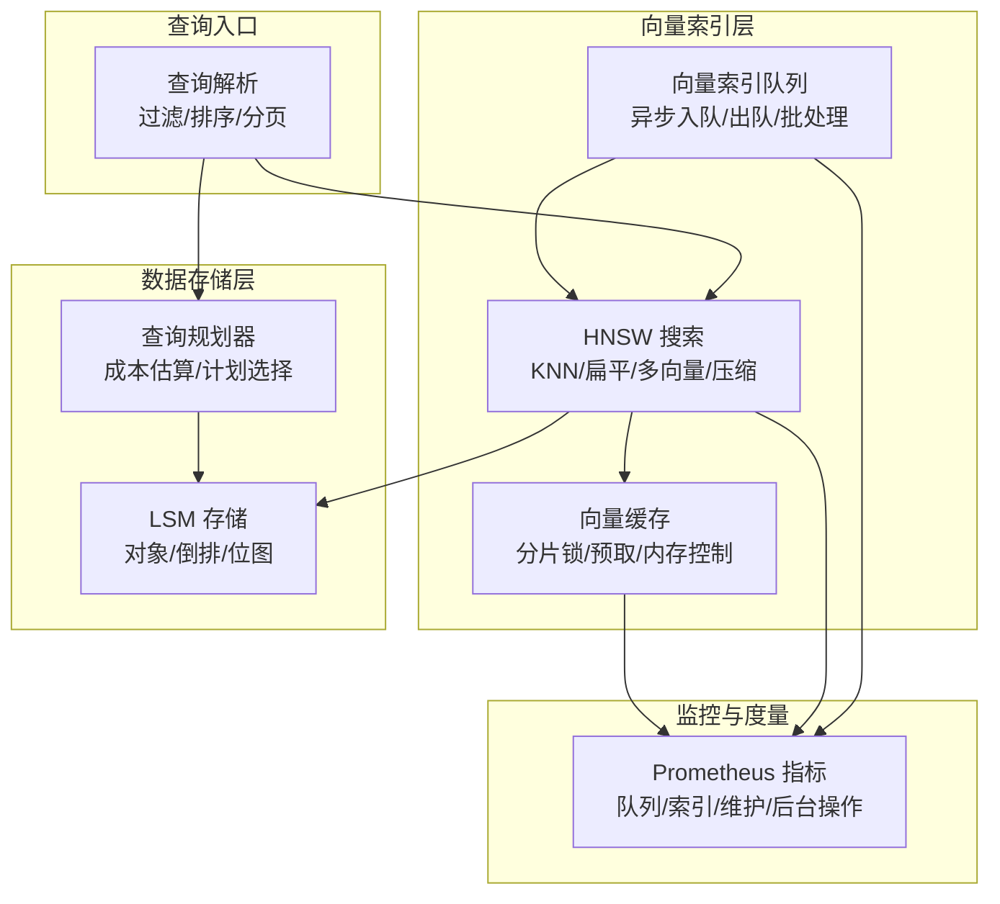
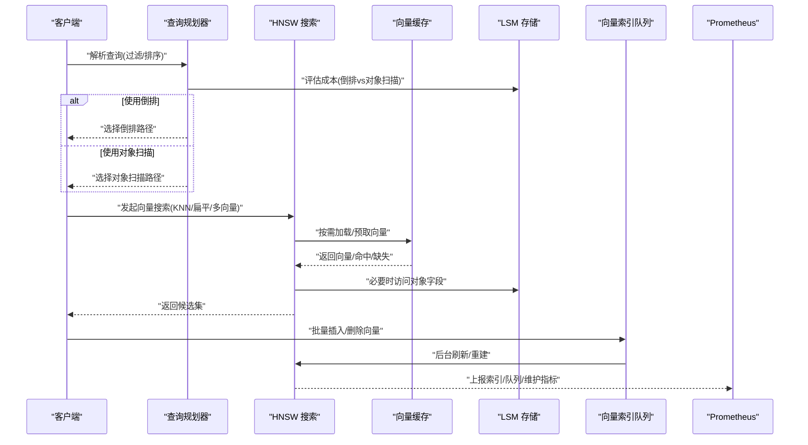
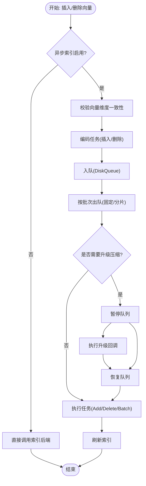
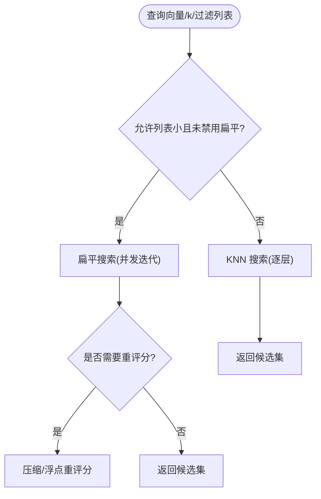
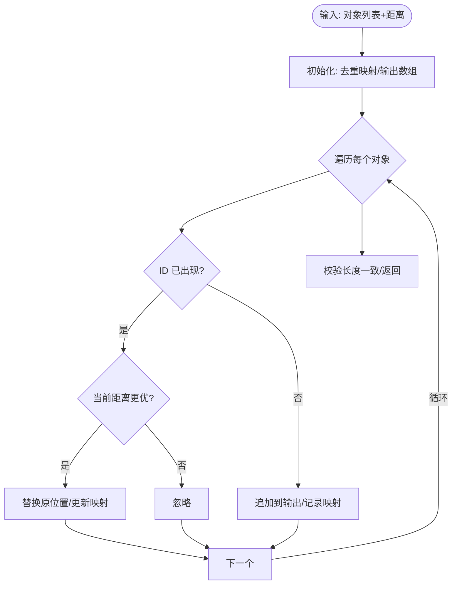
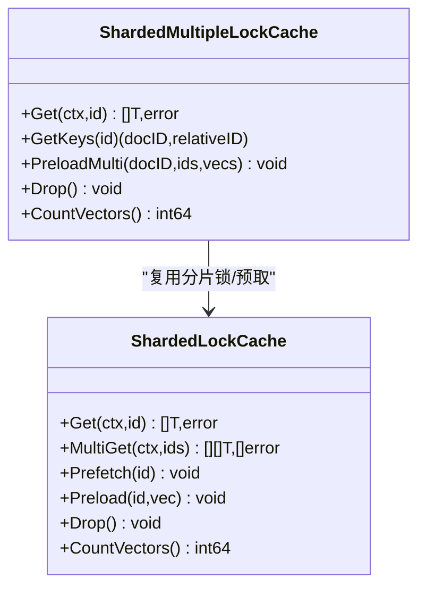
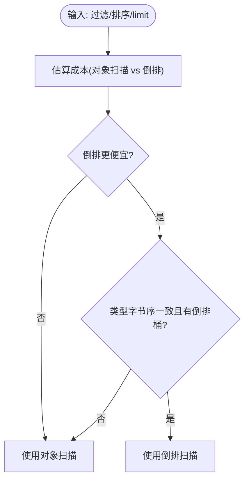
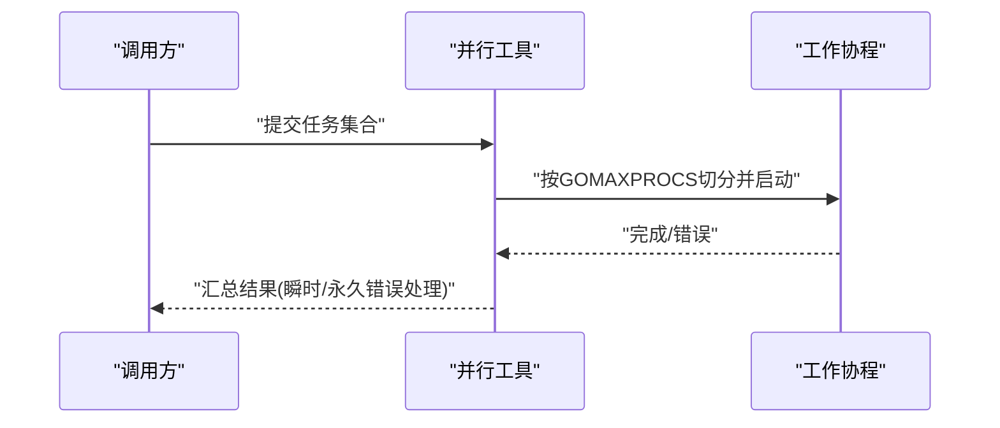
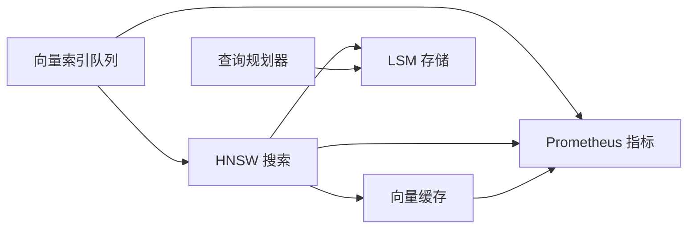

# 搜索性能优化

<cite>
**本文引用的文件**
- [adapters/repos/db/vector_index_queue.go](file://adapters/repos/db/vector_index_queue.go)
- [adapters/repos/db/vector_index_queue_metrics.go](file://adapters/repos/db/vector_index_queue_metrics.go)
- [usecases/monitoring/prometheus.go](file://usecases/monitoring/prometheus.go)
- [adapters/repos/db/vector/hnsw/search.go](file://adapters/repos/db/vector/hnsw/search.go)
- [adapters/repos/db/vector/hnsw/flat_search.go](file://adapters/repos/db/vector/hnsw/flat_search.go)
- [adapters/repos/db/search_deduplication.go](file://adapters/repos/db/search_deduplication.go)
- [adapters/repos/db/vector/cache/sharded_lock_cache.go](file://adapters/repos/db/vector/cache/sharded_lock_cache.go)
- [adapters/repos/db/sorter/query_planner.go](file://adapters/repos/db/sorter/query_planner.go)
- [adapters/repos/db/vector/compressionhelpers/utils.go](file://adapters/repos/db/vector/compressionhelpers/utils.go)
- [entities/concurrency/gomaxprocs.go](file://entities/concurrency/gomaxprocs.go)
- [adapters/repos/db/vector/compressionhelpers/parallel_iterator.go](file://adapters/repos/db/vector/compressionhelpers/parallel_iterator.go)
- [adapters/repos/db/vector/hfresh/metrics.go](file://adapters/repos/db/vector/hfresh/metrics.go)
- [adapters/repos/db/vector/dynamic/index_test.go](file://adapters/repos/db/vector/dynamic/index_test.go)
- [adapters/repos/db/search_deduplication_test.go](file://adapters/repos/db/search_deduplication_test.go)
- [adapters/repos/db/queue/worker_test.go](file://adapters/repos/db/queue/worker_test.go)
- [adapters/repos/db/vector/cache/sharded_lock_cache_test.go](file://adapters/repos/db/vector/cache/sharded_lock_cache_test.go)
- [adapters/repos/db/sorter/query_planner_test.go](file://adapters/repos/db/sorter/query_planner_test.go)
</cite>

## 目录
1. [简介](#简介)
2. [项目结构](#项目结构)
3. [核心组件](#核心组件)
4. [架构总览](#架构总览)
5. [详细组件分析](#详细组件分析)
6. [依赖关系分析](#依赖关系分析)
7. [性能考量](#性能考量)
8. [故障排查指南](#故障排查指南)
9. [结论](#结论)
10. [附录](#附录)

## 简介
本技术文档聚焦 Weaviate 的搜索性能优化，系统性梳理从查询执行到向量索引、缓存与并发控制的关键路径，覆盖以下主题：
- 搜索查询执行流程与性能瓶颈识别
- 向量索引队列工作机制与监控指标
- 搜索去重算法优化与内存控制
- 结果缓存、索引缓存与查询计划缓存
- 并行搜索实现原理与并发控制策略
- 实用调优建议（索引配置、查询重写、资源分配）
- 监控指标解读与性能分析方法
- 性能测试、基准测试与故障排除

## 项目结构
Weaviate 的搜索性能相关代码主要分布在如下模块：
- 向量索引与搜索：hnsw 包含 KNN 搜索、扁平搜索、多向量与压缩支持等
- 队列与异步索引：向量索引队列负责批量入队、分批处理与后台刷新
- 缓存体系：向量缓存（单向量/多向量）与分片锁设计
- 查询规划：排序查询的成本估算与计划选择
- 并发与资源：GOMAXPROCS 限制、并行工具与回退策略
- 监控指标：Prometheus 指标定义与分组聚合

图表来源
- [adapters/repos/db/vector_index_queue.go](file://adapters/repos/db/vector_index_queue.go#L38-L110)
- [adapters/repos/db/vector/hnsw/search.go](file://adapters/repos/db/vector/hnsw/search.go#L78-L92)
- [adapters/repos/db/vector/hnsw/flat_search.go](file://adapters/repos/db/vector/hnsw/flat_search.go#L28-L141)
- [adapters/repos/db/vector/cache/sharded_lock_cache.go](file://adapters/repos/db/vector/cache/sharded_lock_cache.go#L29-L86)
- [adapters/repos/db/sorter/query_planner.go](file://adapters/repos/db/sorter/query_planner.go#L106-L193)
- [usecases/monitoring/prometheus.go](file://usecases/monitoring/prometheus.go#L594-L686)

章节来源
- [adapters/repos/db/vector_index_queue.go](file://adapters/repos/db/vector_index_queue.go#L38-L110)
- [adapters/repos/db/vector/hnsw/search.go](file://adapters/repos/db/vector/hnsw/search.go#L78-L92)
- [adapters/repos/db/vector/hnsw/flat_search.go](file://adapters/repos/db/vector/hnsw/flat_search.go#L28-L141)
- [adapters/repos/db/vector/cache/sharded_lock_cache.go](file://adapters/repos/db/vector/cache/sharded_lock_cache.go#L29-L86)
- [adapters/repos/db/sorter/query_planner.go](file://adapters/repos/db/sorter/query_planner.go#L106-L193)
- [usecases/monitoring/prometheus.go](file://usecases/monitoring/prometheus.go#L594-L686)

## 核心组件
- 向量索引队列：负责将插入/删除任务异步入队，按批出队并调用索引后端，支持压缩升级与后台刷新
- HNSW 搜索：支持 KNN 搜索、扁平搜索、多向量与压缩场景；具备自动 EF 计算、过滤策略与重评分
- 搜索去重：基于 ID 的去重与分数替换，保证最终结果唯一且最优
- 向量缓存：分片读写锁、预取、内存压力感知与周期清理，支持单向量与多向量
- 查询规划：对排序查询进行成本估算，选择倒排或对象扫描策略
- 并发与资源：基于 GOMAXPROCS 的并发上限、并行工具与指数回退

章节来源
- [adapters/repos/db/vector_index_queue.go](file://adapters/repos/db/vector_index_queue.go#L38-L110)
- [adapters/repos/db/vector/hnsw/search.go](file://adapters/repos/db/vector/hnsw/search.go#L78-L92)
- [adapters/repos/db/search_deduplication.go](file://adapters/repos/db/search_deduplication.go#L21-L59)
- [adapters/repos/db/vector/cache/sharded_lock_cache.go](file://adapters/repos/db/vector/cache/sharded_lock_cache.go#L29-L86)
- [adapters/repos/db/sorter/query_planner.go](file://adapters/repos/db/sorter/query_planner.go#L106-L193)
- [adapters/repos/db/vector/compressionhelpers/utils.go](file://adapters/repos/db/vector/compressionhelpers/utils.go#L25-L63)

## 架构总览
下图展示搜索请求在系统中的关键流转：查询解析后进入 HNSW/KNN 或扁平搜索路径，同时通过查询规划器决定是否走倒排索引；向量索引队列异步维护索引，Prometheus 指标贯穿全链路。

图表来源
- [adapters/repos/db/sorter/query_planner.go](file://adapters/repos/db/sorter/query_planner.go#L178-L193)
- [adapters/repos/db/vector/hnsw/search.go](file://adapters/repos/db/vector/hnsw/search.go#L78-L92)
- [adapters/repos/db/vector/hnsw/flat_search.go](file://adapters/repos/db/vector/hnsw/flat_search.go#L28-L141)
- [adapters/repos/db/vector/cache/sharded_lock_cache.go](file://adapters/repos/db/vector/cache/sharded_lock_cache.go#L136-L195)
- [adapters/repos/db/vector_index_queue.go](file://adapters/repos/db/vector_index_queue.go#L121-L160)
- [usecases/monitoring/prometheus.go](file://usecases/monitoring/prometheus.go#L594-L686)

## 详细组件分析

### 向量索引队列与异步索引
- 批处理与分片：支持固定批次大小或按磁盘分片累积，合并多个批次后统一处理
- 压缩升级：在达到阈值时暂停队列，触发索引升级，完成后恢复
- 指标与监控：插入/删除计数、队列长度/磁盘占用、分区处理耗时等
- 错误处理：永久错误立即丢弃，瞬时错误指数回退重试

图表来源
- [adapters/repos/db/vector_index_queue.go](file://adapters/repos/db/vector_index_queue.go#L121-L197)
- [adapters/repos/db/vector_index_queue.go](file://adapters/repos/db/vector_index_queue.go#L245-L289)
- [adapters/repos/db/vector_index_queue_metrics.go](file://adapters/repos/db/vector_index_queue_metrics.go#L99-L125)
- [usecases/monitoring/prometheus.go](file://usecases/monitoring/prometheus.go#L594-L602)

章节来源
- [adapters/repos/db/vector_index_queue.go](file://adapters/repos/db/vector_index_queue.go#L38-L110)
- [adapters/repos/db/vector_index_queue.go](file://adapters/repos/db/vector_index_queue.go#L121-L197)
- [adapters/repos/db/vector_index_queue.go](file://adapters/repos/db/vector_index_queue.go#L245-L289)
- [adapters/repos/db/vector_index_queue_metrics.go](file://adapters/repos/db/vector_index_queue_metrics.go#L35-L84)
- [usecases/monitoring/prometheus.go](file://usecases/monitoring/prometheus.go#L594-L602)

### HNSW 搜索与扁平搜索
- 自动 EF：根据 k 与配置因子计算 EF，确保不截断结果
- 扁平搜索：在允许列表较小时采用，支持并发迭代与重评分
- 多向量与压缩：支持多向量与压缩向量的距离计算与预取
- 过滤策略：支持 Sweeping/ACORN/RRE 等策略以适配不同过滤比例

图表来源
- [adapters/repos/db/vector/hnsw/search.go](file://adapters/repos/db/vector/hnsw/search.go#L78-L92)
- [adapters/repos/db/vector/hnsw/flat_search.go](file://adapters/repos/db/vector/hnsw/flat_search.go#L28-L141)
- [adapters/repos/db/vector/hnsw/search.go](file://adapters/repos/db/vector/hnsw/search.go#L215-L225)

章节来源
- [adapters/repos/db/vector/hnsw/search.go](file://adapters/repos/db/vector/hnsw/search.go#L44-L76)
- [adapters/repos/db/vector/hnsw/search.go](file://adapters/repos/db/vector/hnsw/search.go#L78-L92)
- [adapters/repos/db/vector/hnsw/flat_search.go](file://adapters/repos/db/vector/hnsw/flat_search.go#L28-L141)

### 搜索去重算法与内存控制
- 去重策略：以对象 ID 为键，保留更优距离的结果；线性遍历更新映射
- 内存控制：严格保持输出数组与分数数组长度一致，避免越界

图表来源
- [adapters/repos/db/search_deduplication.go](file://adapters/repos/db/search_deduplication.go#L21-L59)

章节来源
- [adapters/repos/db/search_deduplication.go](file://adapters/repos/db/search_deduplication.go#L21-L59)
- [adapters/repos/db/search_deduplication_test.go](file://adapters/repos/db/search_deduplication_test.go#L23-L245)

### 向量缓存体系与内存管理
- 分片锁缓存：按页粒度分片读写锁，降低锁竞争；支持预取与周期清理
- 内存压力感知：在加载前检查可分配空间，避免 OOM 导致的性能抖动
- 单/多向量：分别提供单向量与多向量缓存实现，支持相对 ID 映射

图表来源
- [adapters/repos/db/vector/cache/sharded_lock_cache.go](file://adapters/repos/db/vector/cache/sharded_lock_cache.go#L29-L86)
- [adapters/repos/db/vector/cache/sharded_lock_cache.go](file://adapters/repos/db/vector/cache/sharded_lock_cache.go#L425-L548)

章节来源
- [adapters/repos/db/vector/cache/sharded_lock_cache.go](file://adapters/repos/db/vector/cache/sharded_lock_cache.go#L136-L195)
- [adapters/repos/db/vector/cache/sharded_lock_cache.go](file://adapters/repos/db/vector/cache/sharded_lock_cache.go#L573-L612)
- [adapters/repos/db/vector/cache/sharded_lock_cache_test.go](file://adapters/repos/db/vector/cache/sharded_lock_cache_test.go#L216-L251)

### 查询规划与成本估算
- 成本模型：对象扫描与倒排扫描的成本估算，考虑随机/顺序 I/O 与反序列化开销
- 决策条件：倒排更优、类型字节序一致、属性存在倒排桶
- 慢查询日志：记录决策过程便于事后分析

图表来源
- [adapters/repos/db/sorter/query_planner.go](file://adapters/repos/db/sorter/query_planner.go#L106-L193)

章节来源
- [adapters/repos/db/sorter/query_planner.go](file://adapters/repos/db/sorter/query_planner.go#L77-L193)
- [adapters/repos/db/sorter/query_planner_test.go](file://adapters/repos/db/sorter/query_planner_test.go#L212-L236)

### 并行搜索与并发控制
- 并行工具：Concurrently/ConcurrentlyWithError 基于 GOMAXPROCS 切分任务
- 回退策略：指数回退与最大等待时间，避免雪崩
- 资源上限：NoMoreThanGOMAXPROCS 限制并发度

图表来源
- [adapters/repos/db/vector/compressionhelpers/utils.go](file://adapters/repos/db/vector/compressionhelpers/utils.go#L25-L63)
- [adapters/repos/db/queue/worker_test.go](file://adapters/repos/db/queue/worker_test.go#L151-L260)
- [entities/concurrency/gomaxprocs.go](file://entities/concurrency/gomaxprocs.go#L19-L39)

章节来源
- [adapters/repos/db/vector/compressionhelpers/utils.go](file://adapters/repos/db/vector/compressionhelpers/utils.go#L25-L63)
- [adapters/repos/db/vector/compressionhelpers/parallel_iterator.go](file://adapters/repos/db/vector/compressionhelpers/parallel_iterator.go#L373-L399)
- [adapters/repos/db/queue/worker_test.go](file://adapters/repos/db/queue/worker_test.go#L151-L260)
- [entities/concurrency/gomaxprocs.go](file://entities/concurrency/gomaxprocs.go#L19-L39)

## 依赖关系分析
- 组件耦合：HNSW 依赖缓存与压缩辅助；查询规划器依赖 LSM 存储统计；队列依赖调度器与磁盘队列
- 指标耦合：Prometheus 指标贯穿队列、索引与后台操作，支持按类/分片/目标向量聚合
- 循环依赖：未发现直接循环导入；各模块通过接口与抽象层解耦

图表来源
- [adapters/repos/db/vector/hnsw/search.go](file://adapters/repos/db/vector/hnsw/search.go#L78-L92)
- [adapters/repos/db/vector/cache/sharded_lock_cache.go](file://adapters/repos/db/vector/cache/sharded_lock_cache.go#L136-L195)
- [adapters/repos/db/sorter/query_planner.go](file://adapters/repos/db/sorter/query_planner.go#L106-L193)
- [adapters/repos/db/vector_index_queue.go](file://adapters/repos/db/vector_index_queue.go#L121-L160)
- [usecases/monitoring/prometheus.go](file://usecases/monitoring/prometheus.go#L594-L686)

章节来源
- [adapters/repos/db/vector/hnsw/search.go](file://adapters/repos/db/vector/hnsw/search.go#L78-L92)
- [adapters/repos/db/vector/cache/sharded_lock_cache.go](file://adapters/repos/db/vector/cache/sharded_lock_cache.go#L136-L195)
- [adapters/repos/db/sorter/query_planner.go](file://adapters/repos/db/sorter/query_planner.go#L106-L193)
- [adapters/repos/db/vector_index_queue.go](file://adapters/repos/db/vector_index_queue.go#L121-L160)
- [usecases/monitoring/prometheus.go](file://usecases/monitoring/prometheus.go#L594-L686)

## 性能考量
- 索引配置优化
  - HNSW EF/EFConstruction：根据召回率与延迟权衡调整；k 较大时自动提升 EF
  - 扁平搜索阈值：合理设置 flatSearchCutoff，避免小过滤集误用 KNN
  - 多向量与压缩：在高维/稀疏场景启用多向量；压缩可显著节省内存但需注意重评分
- 查询重写
  - 将过滤条件尽量前置到允许列表，减少候选集规模
  - 对排序查询优先使用倒排索引，确保类型字节序一致
- 资源分配
  - 限制并发度：使用 GOMAXPROCS 上限，避免过度并行导致上下文切换开销
  - 并行工具：Concurrently/WithError 控制协程数量与错误传播
- 缓存策略
  - 启用向量缓存并设置合理的最大容量与清理周期
  - 预取热点向量，降低检索阶段的磁盘访问
- 队列与后台
  - 合理设置批大小与分片大小，平衡吞吐与延迟
  - 监控队列长度与磁盘占用，及时发现积压

[本节为通用指导，无需特定文件引用]

## 故障排查指南
- 队列异常
  - 检查队列长度与磁盘占用是否异常增长；确认批处理是否正常合并
  - 观察插入/删除计数是否与预期一致，定位卡顿环节
- 搜索慢查询
  - 查看 HNSW 层每层耗时与扁平搜索耗时；确认是否启用重评分
  - 检查过滤策略是否触发 ACORN/Sweeping 等分支
- 去重问题
  - 确认去重后对象与距离数组长度一致；检查重复 ID 的分数替换逻辑
- 缓存 OOM
  - 关注内存分配拒绝计数；适当降低缓存上限或缩短清理周期
- 查询规划偏差
  - 检查倒排成本估算与实际路径；确认类型字节序与倒排桶是否存在

章节来源
- [adapters/repos/db/vector_index_queue_metrics.go](file://adapters/repos/db/vector_index_queue_metrics.go#L99-L125)
- [adapters/repos/db/vector/hnsw/search.go](file://adapters/repos/db/vector/hnsw/search.go#L233-L237)
- [adapters/repos/db/search_deduplication.go](file://adapters/repos/db/search_deduplication.go#L55-L58)
- [usecases/monitoring/prometheus.go](file://usecases/monitoring/prometheus.go#L682-L685)
- [adapters/repos/db/sorter/query_planner.go](file://adapters/repos/db/sorter/query_planner.go#L178-L193)

## 结论
Weaviate 的搜索性能优化围绕“异步索引队列 + HNSW 搜索 + 向量缓存 + 查询规划 + 并发控制”构建高效链路。通过合理的索引参数、查询重写与资源限制，并结合完善的监控指标与测试验证，可在大规模向量检索场景中获得稳定低延迟表现。

[本节为总结，无需特定文件引用]

## 附录

### 监控指标与含义
- 队列与异步索引
  - vector_index_queue_insert_count / vector_index_queue_delete_count：按类/分片/目标向量统计插入/删除数量
  - queue_size / queue_disk_usage / queue_paused / queue_count / queue_partition_processing_duration_ms：队列状态与分区处理耗时
- 向量索引
  - vector_index_size / vector_index_operations / vector_index_durations / vector_index_maintenance_durations：索引规模、操作次数与时延
  - vector_index_postings / vector_index_posting_size_vectors：倒排规模与列表长度分布
  - vector_index_pending_background_operations / vector_index_background_operations_*：后台操作排队与耗时
  - vector_index_memory_allocation_rejected_total：因内存不足拒绝的批操作总数
- 其他
  - queries_durations / queries_filtered_vector_durations / concurrent_queries_count：查询整体与向量过滤耗时与并发数
  - lsm_* / mmap_operations / file_io_*：底层存储与内存映射相关指标

章节来源
- [usecases/monitoring/prometheus.go](file://usecases/monitoring/prometheus.go#L572-L686)

### 性能测试与基准
- 向量索引动态测试：通过随机向量生成与暴力对比验证 KNN 正确性与性能
- 去重单元测试：覆盖多种输入组合，验证去重与分数替换
- 查询规划测试：构造不同匹配比例与排序场景，验证倒排/对象扫描选择

章节来源
- [adapters/repos/db/vector/dynamic/index_test.go](file://adapters/repos/db/vector/dynamic/index_test.go#L285-L306)
- [adapters/repos/db/search_deduplication_test.go](file://adapters/repos/db/search_deduplication_test.go#L23-L245)
- [adapters/repos/db/sorter/query_planner_test.go](file://adapters/repos/db/sorter/query_planner_test.go#L212-L236)