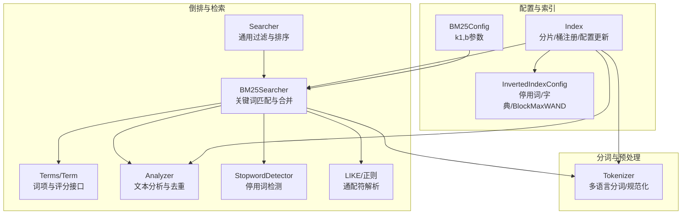
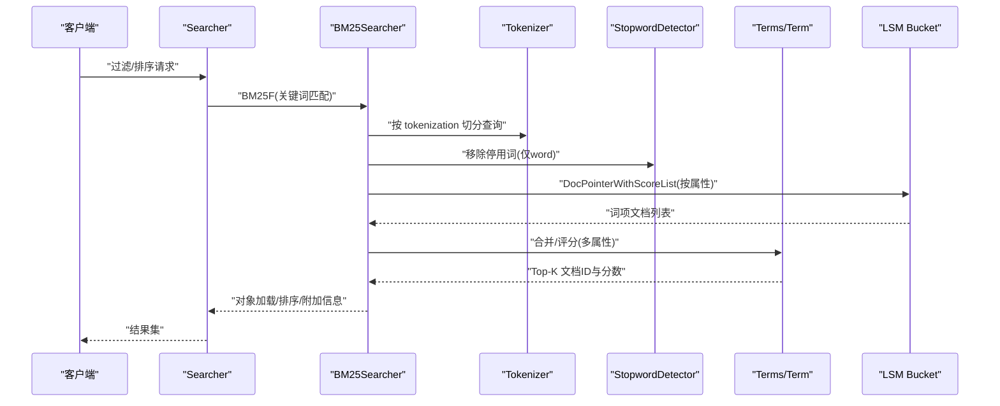
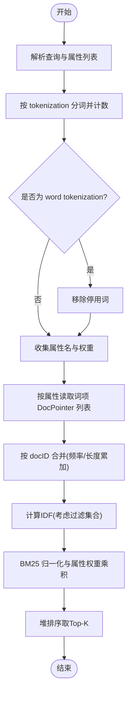
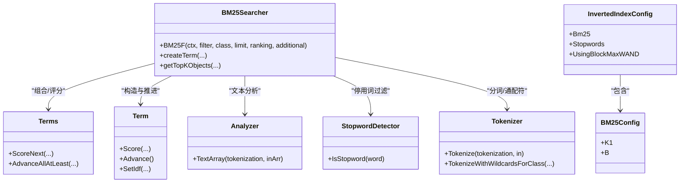

# 文本搜索

<cite>
**本文档引用的文件**
- [adapters/repos/db/inverted/bm25_searcher.go](file://adapters/repos/db/inverted/bm25_searcher.go)
- [adapters/repos/db/inverted/terms/terms.go](file://adapters/repos/db/inverted/terms/terms.go)
- [adapters/repos/db/inverted/analyzer.go](file://adapters/repos/db/inverted/analyzer.go)
- [adapters/repos/db/inverted/stopwords/detector.go](file://adapters/repos/db/inverted/stopwords/detector.go)
- [adapters/repos/db/inverted/stopwords/presets.go](file://adapters/repos/db/inverted/stopwords/presets.go)
- [adapters/repos/db/inverted/like_regexp.go](file://adapters/repos/db/inverted/like_regexp.go)
- [adapters/repos/db/inverted/like_regexp_test.go](file://adapters/repos/db/inverted/like_regexp_test.go)
- [adapters/repos/db/inverted/searcher.go](file://adapters/repos/db/inverted/searcher.go)
- [adapters/repos/db/index.go](file://adapters/repos/db/index.go)
- [entities/tokenizer/tokenizer.go](file://entities/tokenizer/tokenizer.go)
- [entities/models/b_m25_config.go](file://entities/models/b_m25_config.go)
- [entities/models/inverted_index_config.go](file://entities/models/inverted_index_config.go)
- [adapters/repos/db/bm25f_test.go](file://adapters/repos/db/bm25f_test.go)
- [adapters/repos/db/bm25f_block_test.go](file://adapters/repos/db/bm25f_block_test.go)
- [adapters/repos/db/inverted/analyzer_test.go](file://adapters/repos/db/inverted/analyzer_test.go)
- [adapters/repos/db/inverted/stopwords/detector_test.go](file://adapters/repos/db/inverted/stopwords/detector_test.go)
- [test/acceptance/grpc/filtered_search_test.go](file://test/acceptance/grpc/filtered_search_test.go)
</cite>

## 目录
1. [简介](#简介)
2. [项目结构](#项目结构)
3. [核心组件](#核心组件)
4. [架构总览](#架构总览)
5. [详细组件分析](#详细组件分析)
6. [依赖关系分析](#依赖关系分析)
7. [性能考量](#性能考量)
8. [故障排查指南](#故障排查指南)
9. [结论](#结论)
10. [附录](#附录)

## 简介
本文件面向 Weaviate 的文本搜索系统，聚焦于 BM25F 关键词匹配算法的数学原理与实现细节，覆盖以下主题：
- BM25F 数学公式与实现要点：词频归一化、逆文档频率 IDF 计算、字段权重与重复词提升
- 倒排索引构建流程：词元提取、标准化、索引条目存储
- 文本预处理：分词、大小写转换、停用词过滤、词干提取（通过外部模块）
- 查询解析：布尔表达式、通配符 LIKE/正则、短语搜索
- 多字段搜索：字段级权重分配与合并策略
- 性能优化：索引压缩、查询缓存、并行处理
- 实战示例与配置项说明

## 项目结构
Weaviate 的文本搜索能力主要分布在 inverted 包与 tokenizer、models 等模块中：
- inverted 包：倒排索引、BM25F 查询器、分析器、停用词、LIKE/正则支持、通用搜索器
- tokenizer 包：多语言分词器、词元规范化、通配符分词
- models 包：BM25 参数、倒排索引配置等模型定义
- db 层：索引初始化、分片管理、查询入口

图表来源
- [adapters/repos/db/inverted/bm25_searcher.go](file://adapters/repos/db/inverted/bm25_searcher.go#L46-L86)
- [adapters/repos/db/inverted/terms/terms.go](file://adapters/repos/db/inverted/terms/terms.go#L207-L323)
- [adapters/repos/db/inverted/analyzer.go](file://adapters/repos/db/inverted/analyzer.go#L65-L99)
- [adapters/repos/db/inverted/stopwords/detector.go](file://adapters/repos/db/inverted/stopwords/detector.go#L26-L64)
- [adapters/repos/db/inverted/like_regexp.go](file://adapters/repos/db/inverted/like_regexp.go#L21-L62)
- [adapters/repos/db/inverted/searcher.go](file://adapters/repos/db/inverted/searcher.go#L45-L82)
- [adapters/repos/db/index.go](file://adapters/repos/db/index.go#L226-L305)
- [entities/tokenizer/tokenizer.go](file://entities/tokenizer/tokenizer.go#L134-L190)
- [entities/models/b_m25_config.go](file://entities/models/b_m25_config.go#L29-L36)
- [entities/models/inverted_index_config.go](file://entities/models/inverted_index_config.go#L31-L56)

章节来源
- [adapters/repos/db/inverted/bm25_searcher.go](file://adapters/repos/db/inverted/bm25_searcher.go#L1-L132)
- [adapters/repos/db/index.go](file://adapters/repos/db/index.go#L318-L442)

## 核心组件
- BM25Searcher：负责解析查询、生成词项、并行检索、合并评分、返回 Top-K 结果，并可输出额外解释信息
- Terms/Term：封装词项的文档指针列表、IDF、位置指针、评分与推进逻辑
- Analyzer：将输入文本按指定 tokenization 规则切分为词元并统计频次
- StopwordDetector：基于预设与用户配置的停用词集合过滤查询词
- Tokenizer：提供多种分词策略（word、lowercase、whitespace、field、trigram、日韩中 GSE/Kagome 等），以及带通配符的分词
- LIKE/正则：将 LIKE 模式转换为正则表达式并提供可优化前缀
- Searcher：通用过滤器与排序入口，支持属性长度/空值等过滤
- Index：索引生命周期管理、分片初始化、停用词与自定义词典注入、倒排配置更新

章节来源
- [adapters/repos/db/inverted/bm25_searcher.go](file://adapters/repos/db/inverted/bm25_searcher.go#L46-L132)
- [adapters/repos/db/inverted/terms/terms.go](file://adapters/repos/db/inverted/terms/terms.go#L191-L323)
- [adapters/repos/db/inverted/analyzer.go](file://adapters/repos/db/inverted/analyzer.go#L65-L99)
- [adapters/repos/db/inverted/stopwords/detector.go](file://adapters/repos/db/inverted/stopwords/detector.go#L26-L64)
- [entities/tokenizer/tokenizer.go](file://entities/tokenizer/tokenizer.go#L134-L190)
- [adapters/repos/db/inverted/like_regexp.go](file://adapters/repos/db/inverted/like_regexp.go#L21-L62)
- [adapters/repos/db/inverted/searcher.go](file://adapters/repos/db/inverted/searcher.go#L45-L82)
- [adapters/repos/db/index.go](file://adapters/repos/db/index.go#L318-L442)

## 架构总览
下面的序列图展示从查询到结果返回的关键调用链路。

图表来源
- [adapters/repos/db/inverted/searcher.go](file://adapters/repos/db/inverted/searcher.go#L84-L118)
- [adapters/repos/db/inverted/bm25_searcher.go](file://adapters/repos/db/inverted/bm25_searcher.go#L88-L132)
- [adapters/repos/db/inverted/terms/terms.go](file://adapters/repos/db/inverted/terms/terms.go#L404-L447)
- [entities/tokenizer/tokenizer.go](file://entities/tokenizer/tokenizer.go#L134-L190)
- [adapters/repos/db/inverted/stopwords/detector.go](file://adapters/repos/db/inverted/stopwords/detector.go#L26-L64)

## 详细组件分析

### BM25F 关键词匹配与评分
- 词频归一化：使用 BM25 的 k1、b 参数对词频进行归一化，结合属性长度进行归一
- 逆文档频率（IDF）：基于倒排索引中命中词项的文档数量估算
- 字段权重：每个属性可配置 boost，最终得分乘以属性权重
- 重复词提升：对查询中重复出现的词元进行重复次数加权
- 合并策略：多属性词项按 docID 合并，频率与属性长度累加，再统一计算 BM25 得分

图表来源
- [adapters/repos/db/inverted/bm25_searcher.go](file://adapters/repos/db/inverted/bm25_searcher.go#L138-L237)
- [adapters/repos/db/inverted/bm25_searcher.go](file://adapters/repos/db/inverted/bm25_searcher.go#L465-L642)
- [adapters/repos/db/inverted/terms/terms.go](file://adapters/repos/db/inverted/terms/terms.go#L231-L239)

章节来源
- [adapters/repos/db/inverted/bm25_searcher.go](file://adapters/repos/db/inverted/bm25_searcher.go#L138-L237)
- [adapters/repos/db/inverted/terms/terms.go](file://adapters/repos/db/inverted/terms/terms.go#L231-L239)

### 倒排索引构建与存储
- 文本分析：Analyzer 将输入文本按 tokenization 切分为词元并统计频次
- 去重与聚合：对同义词元进行去重与频次统计
- LSMKV 存储：词项与文档映射以固定格式存储，便于快速读取与合并
- 属性桶：每个属性对应独立的可搜索桶，支持多属性并行检索

章节来源
- [adapters/repos/db/inverted/analyzer.go](file://adapters/repos/db/inverted/analyzer.go#L65-L99)
- [adapters/repos/db/index.go](file://adapters/repos/db/index.go#L344-L354)

### 文本预处理与分词
- 多种 tokenization：
  - word：非字母数字切分并小写
  - lowercase：空白切分并小写
  - whitespace：空白切分
  - field：整段去除首尾空白
  - trigram：三字符 ngram
  - GSE/Kagome：日/韩/中分词
- 通配符分词：支持 ?/* 的保留与小写化
- 自定义词典：支持用户字典注入

章节来源
- [entities/tokenizer/tokenizer.go](file://entities/tokenizer/tokenizer.go#L134-L190)
- [adapters/repos/db/index.go](file://adapters/repos/db/index.go#L344-L354)

### 停用词过滤与预设
- 支持预设（如 en）、添加与移除
- 仅对 word tokenization 生效
- 动态替换配置时即时生效

章节来源
- [adapters/repos/db/inverted/stopwords/detector.go](file://adapters/repos/db/inverted/stopwords/detector.go#L26-L64)
- [adapters/repos/db/inverted/stopwords/presets.go](file://adapters/repos/db/inverted/stopwords/presets.go#L14-L27)
- [adapters/repos/db/index.go](file://adapters/repos/db/index.go#L786-L796)

### 查询解析与布尔/通配/短语
- 布尔表达式：AND/OR/NOT 组合，支持最小 OR 匹配阈值
- LIKE/通配符：将 LIKE 模式转换为正则，支持前缀优化
- 短语搜索：通过 trigram 或 field tokenization 实现近似短语匹配
- 测试验证：包含 LIKE/通配符与过滤器的端到端测试

章节来源
- [adapters/repos/db/inverted/like_regexp.go](file://adapters/repos/db/inverted/like_regexp.go#L21-L62)
- [adapters/repos/db/inverted/like_regexp_test.go](file://adapters/repos/db/inverted/like_regexp_test.go#L22-L130)
- [adapters/repos/db/inverted/analyzer_test.go](file://adapters/repos/db/inverted/analyzer_test.go#L481-L533)
- [test/acceptance/grpc/filtered_search_test.go](file://test/acceptance/grpc/filtered_search_test.go#L120-L150)

### 多字段搜索与权重分配
- 属性权重：属性名后追加 "^N" 表示权重倍数
- 平均属性长度：用于归一化词频
- 合并策略：按 docID 合并来自不同属性的频率与长度，再统一评分

章节来源
- [adapters/repos/db/inverted/bm25_searcher.go](file://adapters/repos/db/inverted/bm25_searcher.go#L177-L225)

### 查询入口与通用过滤
- Searcher 提供通用过滤与排序入口，支持属性长度/空值等过滤
- 对象加载：按 docID 批量加载并裁剪删除项

章节来源
- [adapters/repos/db/inverted/searcher.go](file://adapters/repos/db/inverted/searcher.go#L84-L118)
- [adapters/repos/db/inverted/searcher.go](file://adapters/repos/db/inverted/searcher.go#L131-L200)

## 依赖关系分析

图表来源
- [adapters/repos/db/inverted/bm25_searcher.go](file://adapters/repos/db/inverted/bm25_searcher.go#L46-L86)
- [adapters/repos/db/inverted/terms/terms.go](file://adapters/repos/db/inverted/terms/terms.go#L191-L323)
- [adapters/repos/db/inverted/analyzer.go](file://adapters/repos/db/inverted/analyzer.go#L65-L99)
- [adapters/repos/db/inverted/stopwords/detector.go](file://adapters/repos/db/inverted/stopwords/detector.go#L22-L24)
- [entities/tokenizer/tokenizer.go](file://entities/tokenizer/tokenizer.go#L134-L190)
- [entities/models/inverted_index_config.go](file://entities/models/inverted_index_config.go#L31-L56)
- [entities/models/b_m25_config.go](file://entities/models/b_m25_config.go#L29-L36)

章节来源
- [adapters/repos/db/inverted/bm25_searcher.go](file://adapters/repos/db/inverted/bm25_searcher.go#L46-L86)
- [adapters/repos/db/inverted/terms/terms.go](file://adapters/repos/db/inverted/terms/terms.go#L191-L323)
- [adapters/repos/db/inverted/analyzer.go](file://adapters/repos/db/inverted/analyzer.go#L65-L99)
- [adapters/repos/db/inverted/stopwords/detector.go](file://adapters/repos/db/inverted/stopwords/detector.go#L22-L24)
- [entities/tokenizer/tokenizer.go](file://entities/tokenizer/tokenizer.go#L134-L190)
- [entities/models/inverted_index_config.go](file://entities/models/inverted_index_config.go#L31-L56)
- [entities/models/b_m25_config.go](file://entities/models/b_m25_config.go#L29-L36)

## 性能考量
- 并行化
  - BM25Searcher 在词项构造与属性桶读取阶段使用并发组与 CPU 限制
  - 多属性并行读取与合并，减少整体等待时间
- 评分与合并
  - 使用 WAND/BlockMaxWAND 估算上界，提前剪枝，降低全量评分成本
  - 仅在必要时输出额外解释信息，避免额外开销
- 索引与存储
  - LSMKV 倒排桶采用固定布局，便于快速解码与合并
  - 支持 BlockMaxWAND 以提升评分效率
- 配置优化
  - 合理设置 BM25 的 k1、b 参数
  - 启用 BlockMaxWAND 与合适的清理间隔
  - 使用自定义词典与停用词配置减少噪声

章节来源
- [adapters/repos/db/inverted/bm25_searcher.go](file://adapters/repos/db/inverted/bm25_searcher.go#L283-L318)
- [adapters/repos/db/inverted/bm25_searcher.go](file://adapters/repos/db/inverted/bm25_searcher.go#L348-L363)
- [adapters/repos/db/index.go](file://adapters/repos/db/index.go#L778-L796)
- [entities/models/inverted_index_config.go](file://entities/models/inverted_index_config.go#L54-L55)

## 故障排查指南
- 仅停用词查询
  - 现象：返回“仅停用词”错误
  - 处理：调整停用词配置或增加有效查询词
- 缺失可搜索索引
  - 现象：对未建立可搜索索引的属性报错
  - 处理：确认属性已启用可搜索索引
- LIKE/通配符匹配异常
  - 现象：LIKE 模式未按预期匹配
  - 处理：检查模式转换与前缀优化逻辑
- 端到端过滤异常
  - 现象：过滤器未生效或结果异常
  - 处理：参考端到端测试用例核对行为

章节来源
- [adapters/repos/db/inverted/searcher.go](file://adapters/repos/db/inverted/searcher.go#L60-L61)
- [adapters/repos/db/inverted/bm25_searcher.go](file://adapters/repos/db/inverted/bm25_searcher.go#L91-L96)
- [adapters/repos/db/inverted/like_regexp_test.go](file://adapters/repos/db/inverted/like_regexp_test.go#L22-L130)
- [test/acceptance/grpc/filtered_search_test.go](file://test/acceptance/grpc/filtered_search_test.go#L120-L150)

## 结论
Weaviate 的文本搜索以 BM25F 为核心，结合多 tokenization、停用词过滤、通配符与短语支持，实现了高效且灵活的关键词检索。通过并行化与 BlockMaxWAND 评分策略，系统在大规模数据上仍能保持良好性能。合理的配置（BM25 参数、BlockMaxWAND、停用词与自定义词典）与查询写法（属性权重、最小 OR 匹配）是获得高质量检索结果的关键。

## 附录

### 查询语法与示例
- 多字段搜索与权重
  - 语法：属性名后追加 "^N" 表示权重倍数
  - 示例：text^2 title^1
- LIKE/通配符
  - 语法：支持 ? 与 *，自动转换为正则
  - 示例："car*" 匹配以 car 开头的词
- 最小 OR 匹配
  - 作用：控制多个词项至少需满足的数量
- 端到端过滤
  - 通过过滤器限制候选集后再进行 BM25 评分

章节来源
- [adapters/repos/db/inverted/bm25_searcher.go](file://adapters/repos/db/inverted/bm25_searcher.go#L177-L185)
- [adapters/repos/db/inverted/like_regexp.go](file://adapters/repos/db/inverted/like_regexp.go#L41-L46)
- [test/acceptance/grpc/filtered_search_test.go](file://test/acceptance/grpc/filtered_search_test.go#L120-L150)

### 配置选项说明
- BM25Config
  - K1：词频饱和参数，默认 1.2
  - B：文档长度归一化参数，默认 0.75
- InvertedIndexConfig
  - bm25：BM25 参数
  - stopwords：停用词配置
  - tokenizerUserDict：自定义词典
  - usingBlockMaxWAND：是否启用 BlockMaxWAND
  - indexPropertyLength：是否索引属性长度
  - indexNullState/indexTimestamps：是否索引空状态/时间戳

章节来源
- [entities/models/b_m25_config.go](file://entities/models/b_m25_config.go#L29-L36)
- [entities/models/inverted_index_config.go](file://entities/models/inverted_index_config.go#L31-L56)
- [adapters/repos/db/index.go](file://adapters/repos/db/index.go#L778-L796)

### 测试与验证
- BM25F 一致性与块式 WAND
  - 验证 BM25 与 BM25F 在相同数据下的排序一致性
  - 验证块式 WAND 与传统 WAND 的一致性
- 分词与停用词
  - 验证不同 tokenization 的分词结果
  - 验证停用词添加/移除行为
- LIKE/通配符
  - 验证 LIKE 模式转换与匹配行为

章节来源
- [adapters/repos/db/bm25f_test.go](file://adapters/repos/db/bm25f_test.go#L865-L887)
- [adapters/repos/db/bm25f_block_test.go](file://adapters/repos/db/bm25f_block_test.go#L743-L782)
- [adapters/repos/db/inverted/analyzer_test.go](file://adapters/repos/db/inverted/analyzer_test.go#L481-L533)
- [adapters/repos/db/inverted/stopwords/detector_test.go](file://adapters/repos/db/inverted/stopwords/detector_test.go#L21-L107)
- [adapters/repos/db/inverted/like_regexp_test.go](file://adapters/repos/db/inverted/like_regexp_test.go#L22-L130)