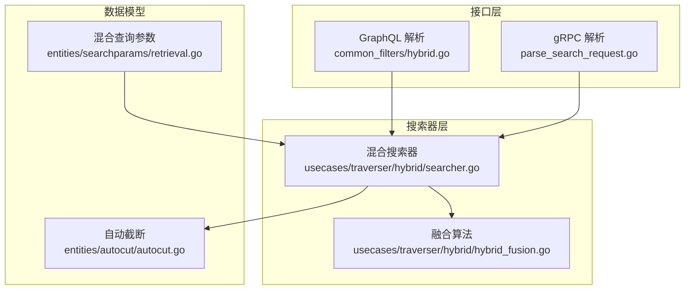
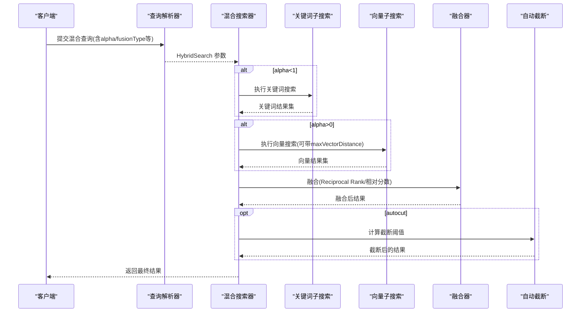
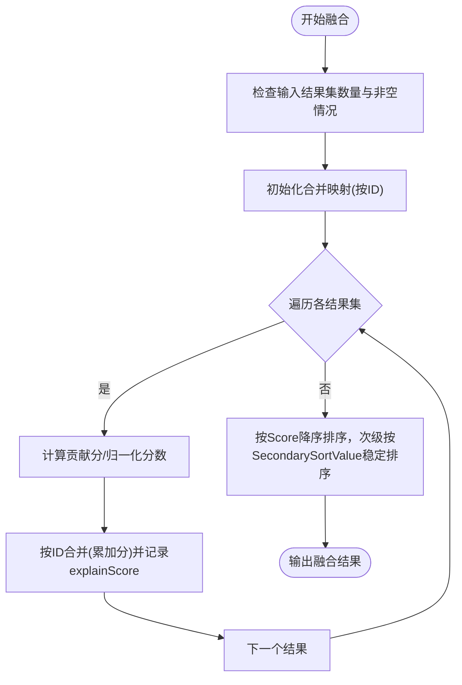
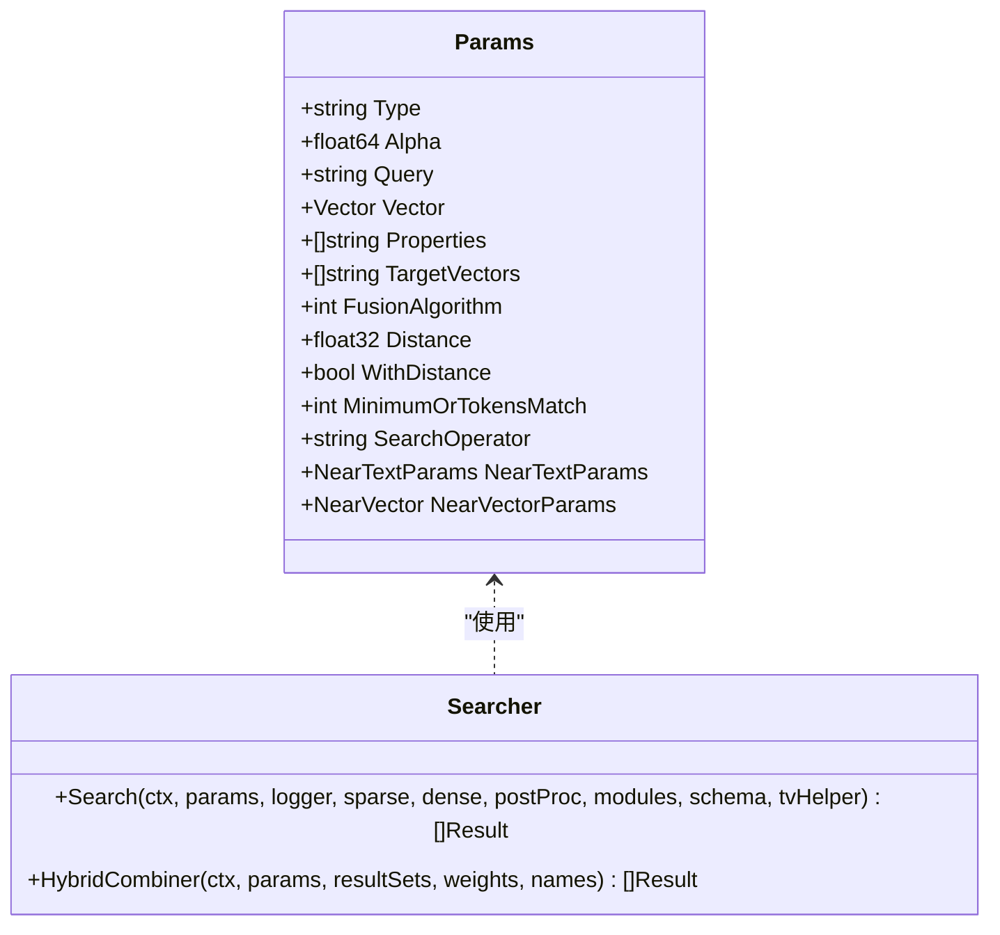
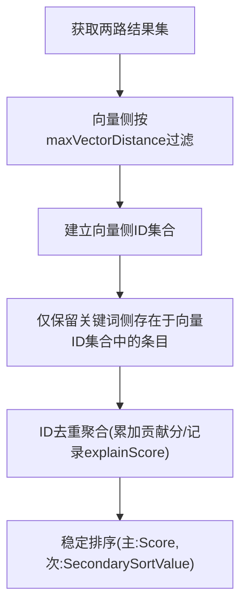
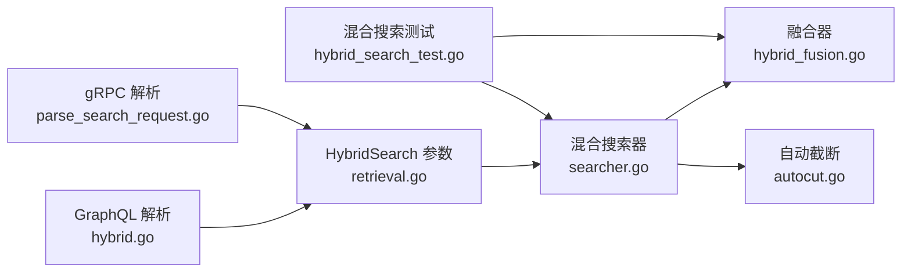

# 混合搜索

<cite>
**本文引用的文件**
- [hybrid_fusion.go](file://usecases/traverser/hybrid/hybrid_fusion.go)
- [searcher.go](file://usecases/traverser/hybrid/searcher.go)
- [hybrid.go](file://adapters/handlers/graphql/local/common_filters/hybrid.go)
- [retrieval.go](file://entities/searchparams/retrieval.go)
- [autocut.go](file://entities/autocut/autocut.go)
- [hybrid_search_test.go](file://adapters/repos/db/hybrid_search_test.go)
- [parse_search_request.go](file://adapters/handlers/grpc/v1/parse_search_request.go)
- [search_deduplication_test.go](file://adapters/repos/db/search_deduplication_test.go)
</cite>

## 目录
1. [简介](#简介)
2. [项目结构](#项目结构)
3. [核心组件](#核心组件)
4. [架构总览](#架构总览)
5. [详细组件分析](#详细组件分析)
6. [依赖关系分析](#依赖关系分析)
7. [性能考量](#性能考量)
8. [故障排查指南](#故障排查指南)
9. [结论](#结论)
10. [附录](#附录)

## 简介
本文件面向 Weaviate 的混合搜索系统，系统性阐述语义（向量）搜索与关键词（BM25）搜索的融合机制，包括结果去重、评分融合与最终排序策略；解析不同混合策略（加权求和、相对分数融合、交叉编码/重排序等）的适用场景与实现要点；给出性能优化建议（早期停止、并行处理、内存管理）与配置参数说明（权重、阈值、结果限制），并提供可操作的查询模式与最佳实践。

## 项目结构
Weaviate 的混合搜索由以下层次构成：
- GraphQL/REST 层：解析用户输入，提取混合查询参数（alpha、fusionType、vector/nearText/nearVector、属性、BM25 操作符等）
- 搜索器层：执行向量与关键词子搜索，构造统一的结果集，进行融合与后处理
- 融合层：实现 Reciprocal Rank 融合与相对分数融合两种策略
- 后处理层：可选的自动截断（autocut）、模块扩展（如 rerank）

图表来源
- [hybrid.go](file://adapters/handlers/graphql/local/common_filters/hybrid.go#L30-L188)
- [parse_search_request.go](file://adapters/handlers/grpc/v1/parse_search_request.go#L305-L337)
- [searcher.go](file://usecases/traverser/hybrid/searcher.go#L74-L153)
- [hybrid_fusion.go](file://usecases/traverser/hybrid/hybrid_fusion.go#L22-L81)
- [retrieval.go](file://entities/searchparams/retrieval.go#L102-L117)
- [autocut.go](file://entities/autocut/autocut.go#L14-L51)

章节来源
- [hybrid.go](file://adapters/handlers/graphql/local/common_filters/hybrid.go#L30-L188)
- [parse_search_request.go](file://adapters/handlers/grpc/v1/parse_search_request.go#L305-L337)
- [searcher.go](file://usecases/traverser/hybrid/searcher.go#L74-L153)
- [hybrid_fusion.go](file://usecases/traverser/hybrid/hybrid_fusion.go#L22-L81)
- [retrieval.go](file://entities/searchparams/retrieval.go#L102-L117)
- [autocut.go](file://entities/autocut/autocut.go#L14-L51)

## 核心组件
- 混合查询参数模型：定义 alpha、query、vector、targetVectors、fusionType、distance、withDistance、最小 OR 匹配、BM25 操作符、nearText/nearVector 子搜索等
- 搜索器：根据 alpha 动态组合关键词与向量搜索，支持 maxVectorDistance 过滤、二次排序值、模块扩展
- 融合算法：提供 Reciprocal Rank 融合与相对分数融合两种策略
- 自动截断：基于评分曲线极值检测的自适应结果上限裁剪

章节来源
- [retrieval.go](file://entities/searchparams/retrieval.go#L102-L117)
- [searcher.go](file://usecases/traverser/hybrid/searcher.go#L74-L153)
- [hybrid_fusion.go](file://usecases/traverser/hybrid/hybrid_fusion.go#L22-L81)
- [autocut.go](file://entities/autocut/autocut.go#L14-L51)

## 架构总览
混合搜索的关键流程如下：
- 输入解析：从 GraphQL 或 gRPC 提取混合查询参数，校验互斥条件（如 vector 与 nearText/nearVector 同时存在则报错）
- 子搜索执行：按 alpha 权重分别执行关键词与向量子搜索；向量侧可应用 maxVectorDistance 过滤
- 结果融合：使用指定融合算法合并两路结果，保留唯一 ID 并累加贡献分
- 后处理：可选 autocut 截断、模块扩展（如 rerank）
- 输出：返回最终排序后的结果

图表来源
- [searcher.go](file://usecases/traverser/hybrid/searcher.go#L74-L153)
- [hybrid_fusion.go](file://usecases/traverser/hybrid/hybrid_fusion.go#L22-L81)
- [autocut.go](file://entities/autocut/autocut.go#L14-L51)
- [hybrid.go](file://adapters/handlers/graphql/local/common_filters/hybrid.go#L113-L185)

## 详细组件分析

### 融合策略与评分机制
- Reciprocal Rank 融合
  - 对每个结果集，按其在集合中的排名位置计算贡献分，并累加到最终得分
  - 使用 SecondarySortValue 作为次级排序依据，解决同分场景下的稳定排序
  - 通过 explainScore 记录各集合对最终得分的贡献明细
- 相对分数融合
  - 先对每一路结果的 SecondarySortValue 做归一化（min-max），再乘以对应权重求和
  - 保留 explainScore 以便追踪归一化与加权过程

图表来源
- [hybrid_fusion.go](file://usecases/traverser/hybrid/hybrid_fusion.go#L22-L81)
- [hybrid_fusion.go](file://usecases/traverser/hybrid/hybrid_fusion.go#L93-L182)

章节来源
- [hybrid_fusion.go](file://usecases/traverser/hybrid/hybrid_fusion.go#L22-L81)
- [hybrid_fusion.go](file://usecases/traverser/hybrid/hybrid_fusion.go#L93-L182)

### 混合搜索器与参数处理
- 搜索器根据 alpha 动态选择执行关键词或向量子搜索，并在需要时应用 maxVectorDistance 过滤
- 向量侧 SecondarySortValue 设为 1 - 距离，便于与关键词侧的相对分数融合保持一致尺度
- 支持模块扩展（如 rerank），在融合后统一追加额外属性

图表来源
- [retrieval.go](file://entities/searchparams/retrieval.go#L102-L117)
- [searcher.go](file://usecases/traverser/hybrid/searcher.go#L33-L40)
- [searcher.go](file://usecases/traverser/hybrid/searcher.go#L74-L194)

章节来源
- [searcher.go](file://usecases/traverser/hybrid/searcher.go#L74-L153)
- [retrieval.go](file://entities/searchparams/retrieval.go#L102-L117)

### 查询参数解析与互斥校验
- GraphQL 与 gRPC 解析器负责将用户请求转换为 HybridSearch 参数
- 校验互斥条件：不能同时传入 vector 与 nearText/nearVector；alpha 必须在 [0,1] 区间
- 支持 BM25 操作符与最小 OR 匹配数、目标向量组合等高级特性

章节来源
- [hybrid.go](file://adapters/handlers/graphql/local/common_filters/hybrid.go#L113-L185)
- [parse_search_request.go](file://adapters/handlers/grpc/v1/parse_search_request.go#L305-L337)

### 结果去重与稳定性
- 去重基于结果 ID（UUID）聚合，确保同一对象不会在融合后重复出现
- 在向量距离过滤阶段，先筛选出低于阈值的向量结果，再将关键词结果集中仅保留存在于该集合中的条目，从而避免跨通道重复

图表来源
- [searcher.go](file://usecases/traverser/hybrid/searcher.go#L123-L132)
- [hybrid_fusion.go](file://usecases/traverser/hybrid/hybrid_fusion.go#L22-L81)

章节来源
- [searcher.go](file://usecases/traverser/hybrid/searcher.go#L123-L132)
- [search_deduplication_test.go](file://adapters/repos/db/search_deduplication_test.go#L23-L245)

### 自动截断（Autocut）
- 基于评分序列的极值检测，自动确定截断点，减少尾部噪声
- 适用于大规模混合检索后对结果质量与吞吐的平衡

章节来源
- [autocut.go](file://entities/autocut/autocut.go#L14-L51)
- [searcher.go](file://usecases/traverser/hybrid/searcher.go#L313-L320)

### 示例与查询模式
- 基础混合查询：指定 query、vector 与 alpha，选择 fusionType
- 子搜索组合：支持 nearText、nearVector、BM25（sparseSearch）等子搜索的加权组合
- gRPC 模式：支持 nearText/nearVector 参数、BM25 操作符、rerank 模块参数透传

章节来源
- [hybrid_search_test.go](file://adapters/repos/db/hybrid_search_test.go#L524-L560)
- [hybrid_search_test.go](file://adapters/repos/db/hybrid_search_test.go#L602-L642)
- [parse_search_request.go](file://adapters/handlers/grpc/v1/parse_search_request.go#L305-L337)
- [parse_search_request.go](file://adapters/handlers/grpc/v1/parse_search_request.go#L611-L619)

## 依赖关系分析
- 接口层（GraphQL/gRPC）依赖参数模型与解析器
- 搜索器依赖融合器与自动截断模块
- 融合器依赖统一的结果结构（包含 ID、Score、SecondarySortValue、explainScore 等）
- 测试覆盖了融合顺序、权重影响、向量/关键词单独与联合场景

图表来源
- [hybrid.go](file://adapters/handlers/graphql/local/common_filters/hybrid.go#L30-L188)
- [parse_search_request.go](file://adapters/handlers/grpc/v1/parse_search_request.go#L305-L337)
- [retrieval.go](file://entities/searchparams/retrieval.go#L102-L117)
- [searcher.go](file://usecases/traverser/hybrid/searcher.go#L74-L153)
- [hybrid_fusion.go](file://usecases/traverser/hybrid/hybrid_fusion.go#L22-L81)
- [autocut.go](file://entities/autocut/autocut.go#L14-L51)
- [hybrid_search_test.go](file://adapters/repos/db/hybrid_search_test.go#L402-L464)

章节来源
- [hybrid.go](file://adapters/handlers/graphql/local/common_filters/hybrid.go#L30-L188)
- [parse_search_request.go](file://adapters/handlers/grpc/v1/parse_search_request.go#L305-L337)
- [retrieval.go](file://entities/searchparams/retrieval.go#L102-L117)
- [searcher.go](file://usecases/traverser/hybrid/searcher.go#L74-L153)
- [hybrid_fusion.go](file://usecases/traverser/hybrid/hybrid_fusion.go#L22-L81)
- [autocut.go](file://entities/autocut/autocut.go#L14-L51)
- [hybrid_search_test.go](file://adapters/repos/db/hybrid_search_test.go#L402-L464)

## 性能考量
- 早期停止
  - 向量搜索阶段可启用 maxVectorDistance，提前截断低质量候选，降低融合成本
  - autocut 在融合后按评分曲线自动裁剪，减少下游处理开销
- 并行处理
  - 关键词与向量子搜索可并行执行，缩短端到端延迟
  - 模块扩展（如 rerank）可在融合后异步执行，避免阻塞主路径
- 内存管理
  - 融合阶段使用 ID 映射聚合，避免重复存储
  - 向量距离过滤后缩小关键词侧候选规模，降低内存占用
- 排序稳定性
  - 通过 SecondarySortValue 保证同分场景的稳定排序，避免随机抖动

## 故障排查指南
- 参数互斥错误
  - 症状：同时传入 vector 与 nearText/nearVector 抛出异常
  - 处理：确保只使用一种查询模式
- alpha 越界
  - 症状：alpha 不在 [0,1] 抛错
  - 处理：修正 alpha 值
- 融合结果为空
  - 症状：融合后无结果
  - 处理：检查子搜索是否返回结果、maxVectorDistance 是否过严、属性索引是否正确
- 排序不稳定
  - 症状：相同分数对象顺序不固定
  - 处理：确保 SecondarySortValue 可用，或在上层增加稳定键

章节来源
- [hybrid.go](file://adapters/handlers/graphql/local/common_filters/hybrid.go#L177-L185)
- [searcher.go](file://usecases/traverser/hybrid/searcher.go#L123-L132)

## 结论
Weaviate 的混合搜索通过清晰的参数模型、灵活的融合策略与严格的去重机制，在保证结果质量的同时兼顾性能与可扩展性。推荐在大多数场景下采用相对分数融合，并结合 autocut 与 maxVectorDistance 实现高质量与高效率的平衡。对于需要细粒度重排序的场景，可引入 rerank 模块进行二次排序。

## 附录

### 配置参数速查
- alpha：向量侧权重，范围 [0,1]，越大越偏向向量搜索
- fusionType：融合算法类型（Reciprocal Rank 或相对分数）
- vector/nearText/nearVector：三者互斥，任选其一
- maxVectorDistance：向量距离阈值，启用后会过滤掉高于阈值的向量结果
- properties/targetVectors：指定属性与目标向量
- BM25 操作符与最小 OR 匹配：控制 BM25 的匹配行为
- autocut：融合后自动截断的极值阈值

章节来源
- [retrieval.go](file://entities/searchparams/retrieval.go#L102-L117)
- [hybrid.go](file://adapters/handlers/graphql/local/common_filters/hybrid.go#L113-L185)
- [parse_search_request.go](file://adapters/handlers/grpc/v1/parse_search_request.go#L305-L337)