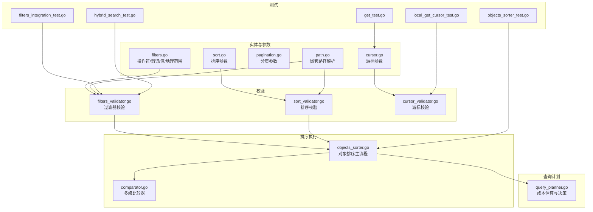
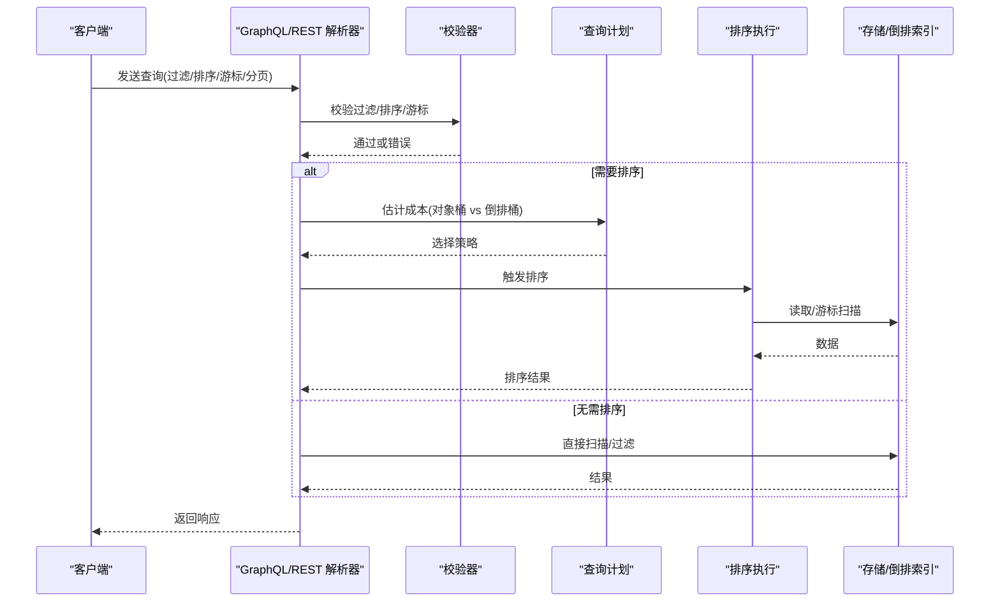
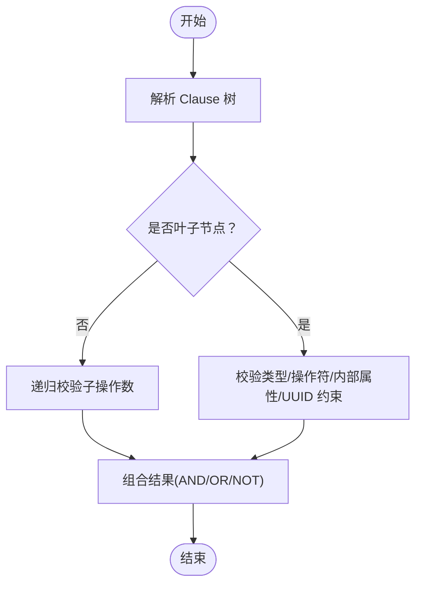
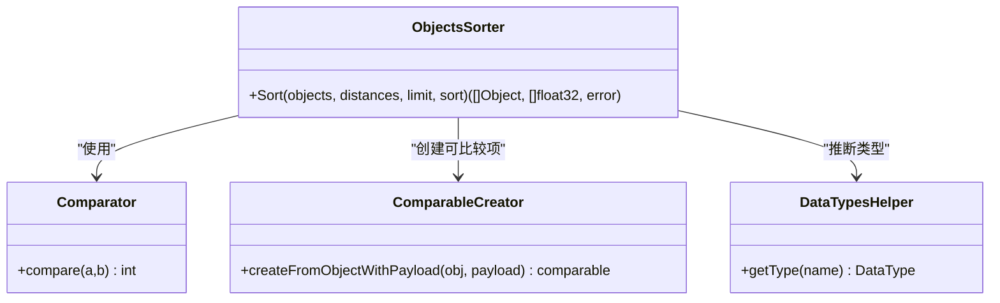
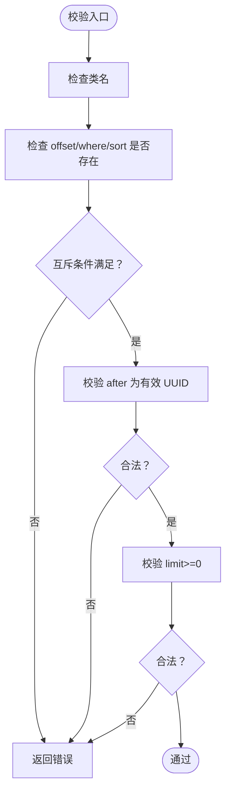
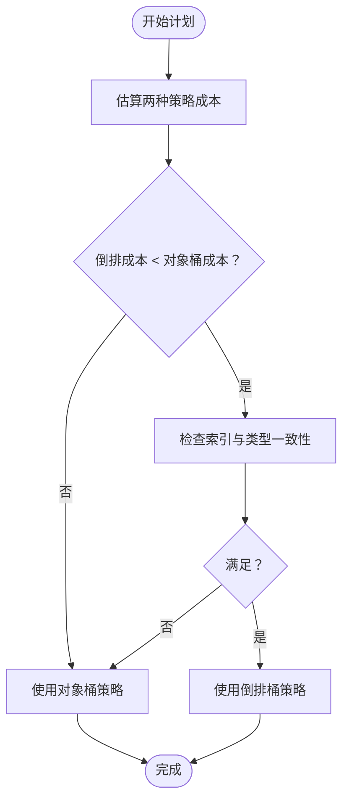
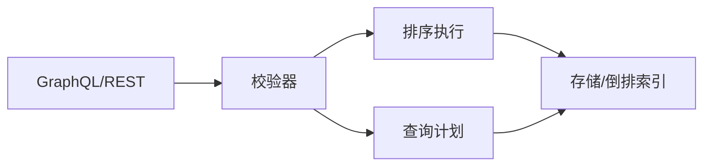

# 过滤与排序

<cite>
**本文档引用的文件**
- [entities/filters/filters.go](file://entities/filters/filters.go)
- [entities/filters/sort.go](file://entities/filters/sort.go)
- [entities/filters/pagination.go](file://entities/filters/pagination.go)
- [entities/filters/path.go](file://entities/filters/path.go)
- [entities/filters/filters_validator.go](file://entities/filters/filters_validator.go)
- [entities/filters/sort_validator.go](file://entities/filters/sort_validator.go)
- [entities/filters/cursor.go](file://entities/filters/cursor.go)
- [entities/filters/cursor_validator.go](file://entities/filters/cursor_validator.go)
- [adapters/repos/db/sorter/objects_sorter.go](file://adapters/repos/db/sorter/objects_sorter.go)
- [adapters/repos/db/sorter/comparator.go](file://adapters/repos/db/sorter/comparator.go)
- [adapters/repos/db/sorter/query_planner.go](file://adapters/repos/db/sorter/query_planner.go)
- [adapters/repos/db/inverted/searcher_integration_test.go](file://adapters/repos/db/inverted/searcher_integration_test.go)
- [adapters/repos/db/filters_integration_test.go](file://adapters/repos/db/filters_integration_test.go)
- [adapters/repos/db/hybrid_search_test.go](file://adapters/repos/db/hybrid_search_test.go)
- [adapters/repos/db/sorter/objects_sorter_test.go](file://adapters/repos/db/sorter/objects_sorter_test.go)
- [adapters/handlers/graphql/local/get/get_test.go](file://adapters/handlers/graphql/local/get/get_test.go)
- [test/acceptance/graphql_resolvers/local_get_cursor_test.go](file://test/acceptance/graphql_resolvers/local_get_cursor_test.go)
- [grpc/generated/protocol/v1/base.pb.go](file://grpc/generated/protocol/v1/base.pb.go)
</cite>

## 目录
1. [简介](#简介)
2. [项目结构](#项目结构)
3. [核心组件](#核心组件)
4. [架构总览](#架构总览)
5. [详细组件分析](#详细组件分析)
6. [依赖关系分析](#依赖关系分析)
7. [性能考量](#性能考量)
8. [故障排查指南](#故障排查指南)
9. [结论](#结论)
10. [附录：最佳实践与示例](#附录最佳实践与示例)

## 简介
本文件面向 Weaviate 的过滤与排序子系统，系统性阐述以下内容：
- 过滤器体系：数值比较、字符串匹配、地理位置过滤、引用类型过滤与组合逻辑（AND/OR/NOT）及优先级处理
- 排序机制：按分数、按距离、按 ID 的排序算法细节与限制
- 游标分页：after/limit 参数的语义、校验规则与多分片行为
- 性能优化：索引利用、查询计划与执行优化策略
- 最佳实践：查询设计、性能调优与内存管理建议
- 示例与复杂查询模式：提供可直接映射到源码路径的参考位置

## 项目结构
Weaviate 的过滤与排序能力由“实体模型层”“验证层”“排序执行层”“查询计划层”以及“测试用例”共同构成。核心文件分布如下：
- 实体模型与参数：filters.go、sort.go、pagination.go、path.go、cursor.go
- 校验逻辑：filters_validator.go、sort_validator.go、cursor_validator.go
- 排序执行：objects_sorter.go、comparator.go
- 查询计划：query_planner.go
- 测试与验收：多个集成测试与验收测试覆盖过滤、排序、游标等场景

**图表来源**
- [entities/filters/filters.go](file://entities/filters/filters.go#L21-L165)
- [entities/filters/sort.go](file://entities/filters/sort.go#L14-L46)
- [entities/filters/pagination.go](file://entities/filters/pagination.go#L25-L59)
- [entities/filters/path.go](file://entities/filters/path.go#L21-L146)
- [entities/filters/cursor.go](file://entities/filters/cursor.go#L14-L37)
- [entities/filters/filters_validator.go](file://entities/filters/filters_validator.go#L31-L290)
- [entities/filters/sort_validator.go](file://entities/filters/sort_validator.go#L22-L85)
- [entities/filters/cursor_validator.go](file://entities/filters/cursor_validator.go#L23-L49)
- [adapters/repos/db/sorter/objects_sorter.go](file://adapters/repos/db/sorter/objects_sorter.go#L20-L110)
- [adapters/repos/db/sorter/comparator.go](file://adapters/repos/db/sorter/comparator.go#L14-L36)
- [adapters/repos/db/sorter/query_planner.go](file://adapters/repos/db/sorter/query_planner.go#L50-L193)
- [adapters/repos/db/inverted/searcher_integration_test.go](file://adapters/repos/db/inverted/searcher_integration_test.go#L453-L620)
- [adapters/repos/db/filters_integration_test.go](file://adapters/repos/db/filters_integration_test.go#L681-L724)
- [adapters/repos/db/hybrid_search_test.go](file://adapters/repos/db/hybrid_search_test.go#L721-L783)
- [adapters/repos/db/sorter/objects_sorter_test.go](file://adapters/repos/db/sorter/objects_sorter_test.go#L127-L416)
- [test/acceptance/graphql_resolvers/local_get_cursor_test.go](file://test/acceptance/graphql_resolvers/local_get_cursor_test.go#L26-L136)
- [adapters/handlers/graphql/local/get/get_test.go](file://adapters/handlers/graphql/local/get/get_test.go#L1699-L1757)

**章节来源**
- [entities/filters/filters.go](file://entities/filters/filters.go#L21-L165)
- [entities/filters/sort.go](file://entities/filters/sort.go#L14-L46)
- [entities/filters/pagination.go](file://entities/filters/pagination.go#L25-L59)
- [entities/filters/path.go](file://entities/filters/path.go#L21-L146)
- [entities/filters/cursor.go](file://entities/filters/cursor.go#L14-L37)
- [entities/filters/filters_validator.go](file://entities/filters/filters_validator.go#L31-L290)
- [entities/filters/sort_validator.go](file://entities/filters/sort_validator.go#L22-L85)
- [entities/filters/cursor_validator.go](file://entities/filters/cursor_validator.go#L23-L49)
- [adapters/repos/db/sorter/objects_sorter.go](file://adapters/repos/db/sorter/objects_sorter.go#L20-L110)
- [adapters/repos/db/sorter/comparator.go](file://adapters/repos/db/sorter/comparator.go#L14-L36)
- [adapters/repos/db/sorter/query_planner.go](file://adapters/repos/db/sorter/query_planner.go#L50-L193)

## 核心组件
- 过滤器模型与操作符
  - 支持相等、不等、大小比较、LIKE、地理位置 WithinGeoRange、IsNull、数组 ContainsAny/ContainsAll/ContainsNone，以及组合操作符 AND/OR/NOT
  - 值类型与地理范围封装，支持多数据类型与 GeoCoordinates
- 排序参数
  - 支持单字段或多字段排序，顺序为 asc/desc；内部属性与部分特殊字段有约束
- 分页与游标
  - Offset/Limit/Autocut 与 after/limit 组合，游标模式下禁止与其他检索参数混用
- 路径解析
  - 支持类名-属性-子路径的嵌套解析，含长度过滤与引用路径校验
- 校验器
  - 过滤器校验：类型匹配、引用计数、UUID 合法性、内部属性约束
  - 排序校验：顺序合法性、引用字段禁止、UUID 不支持排序
  - 游标校验：after 必须为有效 UUID，limit 非负，与 offset/where/sort 冲突检测

**章节来源**
- [entities/filters/filters.go](file://entities/filters/filters.go#L21-L165)
- [entities/filters/sort.go](file://entities/filters/sort.go#L14-L46)
- [entities/filters/pagination.go](file://entities/filters/pagination.go#L25-L59)
- [entities/filters/path.go](file://entities/filters/path.go#L21-L146)
- [entities/filters/filters_validator.go](file://entities/filters/filters_validator.go#L31-L290)
- [entities/filters/sort_validator.go](file://entities/filters/sort_validator.go#L22-L85)
- [entities/filters/cursor.go](file://entities/filters/cursor.go#L14-L37)
- [entities/filters/cursor_validator.go](file://entities/filters/cursor_validator.go#L23-L49)

## 架构总览
过滤与排序在请求进入后，按“参数提取 → 校验 → 执行/计划 → 返回结果”的路径运行。

**图表来源**
- [adapters/repos/db/sorter/query_planner.go](file://adapters/repos/db/sorter/query_planner.go#L56-L193)
- [adapters/repos/db/sorter/objects_sorter.go](file://adapters/repos/db/sorter/objects_sorter.go#L33-L104)
- [entities/filters/filters_validator.go](file://entities/filters/filters_validator.go#L31-L290)
- [entities/filters/sort_validator.go](file://entities/filters/sort_validator.go#L22-L85)
- [entities/filters/cursor_validator.go](file://entities/filters/cursor_validator.go#L23-L49)

## 详细组件分析

### 过滤器系统与组合逻辑
- 操作符与值
  - 支持数值比较、字符串 LIKE、地理位置 WithinGeoRange、IsNull、数组 Contains 系列、AND/OR/NOT 组合
  - 值类型与解包：支持整型自动转换、GeoCoordinates 封装
- 组合逻辑
  - Clause 以 Operator + On + Value 或 Operands 形式表达，递归校验与执行
  - AND/OR/NOT 的优先级：无显式括号时，按树形结构从根到叶逐层求值；建议使用嵌套结构明确组合意图
- 引用类型过滤
  - 对引用属性直接过滤仅允许整型（用于统计引用数量），否则需通过嵌套路径指向被引用类的原始属性
- 地理位置过滤
  - 使用 GeoRange 包含坐标与最大距离，结合 WithinGeoRange 操作符
- 字符串匹配
  - 使用 Like 操作符进行通配匹配

**图表来源**
- [entities/filters/filters.go](file://entities/filters/filters.go#L111-L165)
- [entities/filters/filters_validator.go](file://entities/filters/filters_validator.go#L43-L147)
- [entities/filters/path.go](file://entities/filters/path.go#L77-L146)

**章节来源**
- [entities/filters/filters.go](file://entities/filters/filters.go#L21-L165)
- [entities/filters/filters_validator.go](file://entities/filters/filters_validator.go#L31-L290)
- [entities/filters/path.go](file://entities/filters/path.go#L21-L146)
- [adapters/repos/db/inverted/searcher_integration_test.go](file://adapters/repos/db/inverted/searcher_integration_test.go#L453-L620)
- [adapters/repos/db/filters_integration_test.go](file://adapters/repos/db/filters_integration_test.go#L681-L724)

### 排序机制与算法细节
- 单字段与多字段排序
  - 多字段排序按顺序逐级比较，先比较高位字段，再比较低位字段
- 支持的数据类型与顺序
  - 支持 asc/desc；内部属性与部分特殊字段有约束
- 排序执行流程
  - 从对象集合与可选的距离数组构建可比较键，使用比较器链进行排序
  - 支持限制返回数量（limit）
- 特殊字段排序
  - 按分数、按距离、按 ID 的排序在执行层统一处理，具体取决于输入数据与配置

**图表来源**
- [adapters/repos/db/sorter/objects_sorter.go](file://adapters/repos/db/sorter/objects_sorter.go#L20-L110)
- [adapters/repos/db/sorter/comparator.go](file://adapters/repos/db/sorter/comparator.go#L14-L36)

**章节来源**
- [entities/filters/sort.go](file://entities/filters/sort.go#L14-L46)
- [entities/filters/sort_validator.go](file://entities/filters/sort_validator.go#L22-L85)
- [adapters/repos/db/sorter/objects_sorter.go](file://adapters/repos/db/sorter/objects_sorter.go#L33-L104)
- [adapters/repos/db/sorter/comparator.go](file://adapters/repos/db/sorter/comparator.go#L18-L36)
- [adapters/repos/db/sorter/objects_sorter_test.go](file://adapters/repos/db/sorter/objects_sorter_test.go#L127-L416)

### 游标分页与校验
- 参数与语义
  - after: 以 UUID 表示起始游标；limit: 每页条目数（非负）
- 校验规则
  - after 必须为有效 UUID；limit 必须设置且非负；与 offset/where/sort 在游标模式下互斥
- 多分片行为
  - 游标遍历会跨分片顺序读取，保证稳定序列
- 错误场景
  - 混用其他检索参数、未设置 limit、after 非法等均触发错误

**图表来源**
- [entities/filters/cursor_validator.go](file://entities/filters/cursor_validator.go#L23-L49)
- [entities/filters/cursor.go](file://entities/filters/cursor.go#L14-L37)

**章节来源**
- [entities/filters/cursor.go](file://entities/filters/cursor.go#L14-L37)
- [entities/filters/cursor_validator.go](file://entities/filters/cursor_validator.go#L23-L49)
- [test/acceptance/graphql_resolvers/local_get_cursor_test.go](file://test/acceptance/graphql_resolvers/local_get_cursor_test.go#L26-L136)
- [adapters/handlers/graphql/local/get/get_test.go](file://adapters/handlers/graphql/local/get/get_test.go#L1699-L1757)

### 查询计划与索引利用
- 成本估算
  - 对象桶策略：遍历对象桶，反序列化对象，抽取排序键，维护前 N
  - 倒排桶策略：利用已按属性字典序排序的倒排桶，直接游标扫描至 N 条
- 决策条件
  - 当倒排桶策略更便宜且属性具备相应 LSM 索引、逻辑类型保持字节序一致性时采用
  - 降序时引入额外开销与随机访问成本调整
- 失败回退
  - 不满足条件时回退到对象桶扫描，并在慢查询日志中标注原因

**图表来源**
- [adapters/repos/db/sorter/query_planner.go](file://adapters/repos/db/sorter/query_planner.go#L77-L193)

**章节来源**
- [adapters/repos/db/sorter/query_planner.go](file://adapters/repos/db/sorter/query_planner.go#L56-L193)

### 地理位置过滤与引用类型过滤
- 地理位置过滤
  - 使用 GeoRange 与 WithinGeoRange 操作符，支持经纬度与最大距离
- 引用类型过滤
  - 直接对引用属性过滤仅支持整型（统计引用数量）
  - 需要对被引用类的原始属性进行过滤时，使用三层嵌套路径：[属性名, 引用类名, 原始属性名]

**章节来源**
- [entities/filters/filters.go](file://entities/filters/filters.go#L159-L165)
- [entities/filters/filters_validator.go](file://entities/filters/filters_validator.go#L120-L132)
- [grpc/generated/protocol/v1/base.pb.go](file://grpc/generated/protocol/v1/base.pb.go#L1312-L1319)

## 依赖关系分析
- 组件耦合
  - 过滤器与排序参数通过校验器与执行器解耦，便于独立演进
  - 查询计划器与存储层通过 LSMKV 接口交互，避免直接耦合
- 关键依赖链
  - GraphQL/REST → 校验器 → 排序执行/查询计划 → 存储
  - 排序执行依赖比较器与数据类型助手，确保类型安全与正确排序

**图表来源**
- [adapters/repos/db/sorter/objects_sorter.go](file://adapters/repos/db/sorter/objects_sorter.go#L33-L104)
- [adapters/repos/db/sorter/query_planner.go](file://adapters/repos/db/sorter/query_planner.go#L56-L193)

**章节来源**
- [adapters/repos/db/sorter/objects_sorter.go](file://adapters/repos/db/sorter/objects_sorter.go#L20-L110)
- [adapters/repos/db/sorter/query_planner.go](file://adapters/repos/db/sorter/query_planner.go#L50-L193)

## 性能考量
- 索引利用
  - 倒排桶排序仅在属性具备相应 LSM 索引且类型字节序一致时启用
  - 未建立索引的属性将回退到对象桶扫描
- 成本估算
  - 通过折扣与随机访问惩罚因子平衡不同介质与工作负载
  - 降序时增加初始定位与回退扫描的成本
- 内存与 I/O
  - 对象桶策略需要反序列化与内存维护，适合小结果集
  - 倒排桶策略减少反序列化次数，适合大结果集与高过滤命中率场景
- 游标分页
  - 游标模式下避免 offset/where/sort 与其他检索参数混用，降低复杂度与资源消耗

**章节来源**
- [adapters/repos/db/sorter/query_planner.go](file://adapters/repos/db/sorter/query_planner.go#L77-L193)

## 故障排查指南
- 常见错误与定位
  - 过滤器类型不匹配：检查属性真实数据类型与操作符组合
  - 引用属性过滤非法：确认使用整型统计或通过嵌套路径访问原始属性
  - UUID 属性操作符限制：仅支持特定操作符，避免使用不支持的比较
  - 游标参数冲突：after/limit 与 offset/where/sort 不能同时出现
  - 排序字段不支持：引用字段与 UUID 类型不支持排序
- 定位方法
  - 查看校验器返回的具体错误信息
  - 使用慢查询日志中的计划成本估算输出判断策略选择
  - 参考测试用例中的错误场景与期望行为

**章节来源**
- [entities/filters/filters_validator.go](file://entities/filters/filters_validator.go#L174-L219)
- [entities/filters/sort_validator.go](file://entities/filters/sort_validator.go#L69-L83)
- [entities/filters/cursor_validator.go](file://entities/filters/cursor_validator.go#L23-L49)
- [adapters/repos/db/sorter/query_planner.go](file://adapters/repos/db/sorter/query_planner.go#L178-L193)

## 结论
Weaviate 的过滤与排序系统通过清晰的模型定义、严格的校验与灵活的查询计划，在保证类型安全与语义正确的同时，提供了高效的执行路径。合理利用索引与游标分页，遵循排序与过滤的最佳实践，可在大规模数据上获得稳定的性能表现。

## 附录：最佳实践与示例
- 过滤设计
  - 优先使用倒排索引字段进行过滤，减少全表扫描
  - 引用过滤尽量使用嵌套路径访问原始属性，避免直接对引用计数过滤
  - 地理位置过滤使用 WithinGeoRange 并限定合理半径
- 排序设计
  - 仅对具备索引且类型字节序一致的字段进行排序
  - 避免对引用字段与 UUID 字段进行排序
  - 多字段排序时，将区分度高的字段置于高位
- 游标分页
  - 使用 after/limit 获取稳定序列，避免 offset
  - 游标模式下不要混用 where/sort/offset 等参数
- 性能调优
  - 通过慢查询日志评估计划选择是否合理
  - 在高过滤命中率场景启用索引以提升排序性能
- 示例参考（路径）
  - 过滤组合与布尔逻辑：[filters_integration_test.go](file://adapters/repos/db/filters_integration_test.go#L681-L724)
  - 混合检索与过滤：[hybrid_search_test.go](file://adapters/repos/db/hybrid_search_test.go#L721-L783)
  - 排序覆盖多种数据类型与顺序：[objects_sorter_test.go](file://adapters/repos/db/sorter/objects_sorter_test.go#L127-L416)
  - 游标分页与错误校验：[local_get_cursor_test.go](file://test/acceptance/graphql_resolvers/local_get_cursor_test.go#L26-L136), [get_test.go](file://adapters/handlers/graphql/local/get/get_test.go#L1699-L1757)