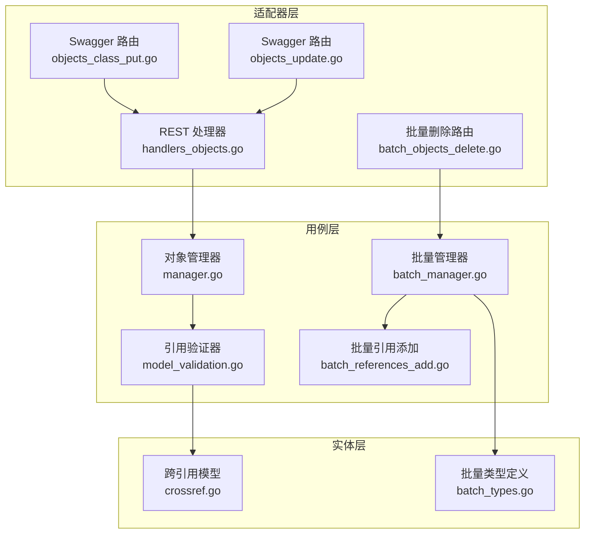
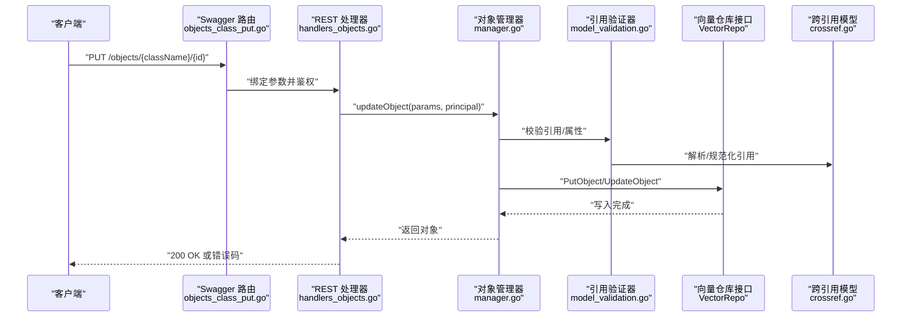
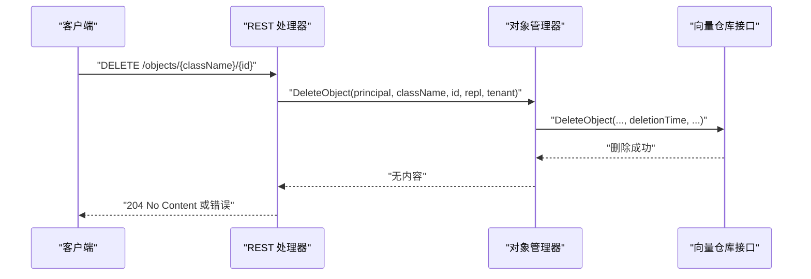
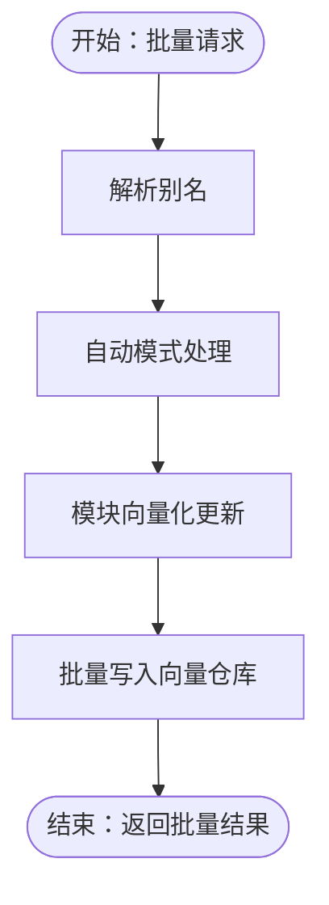
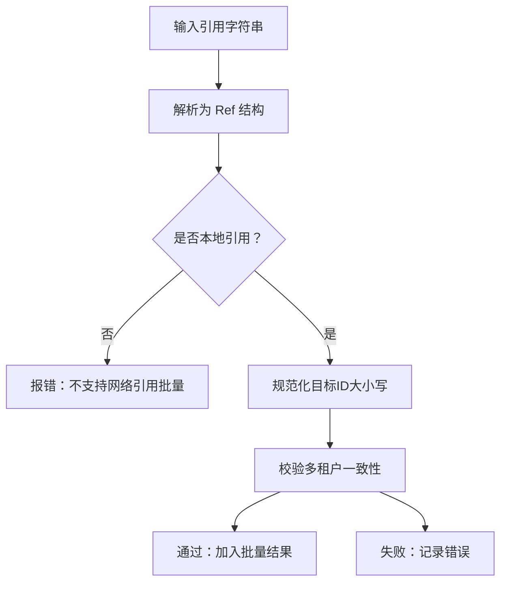
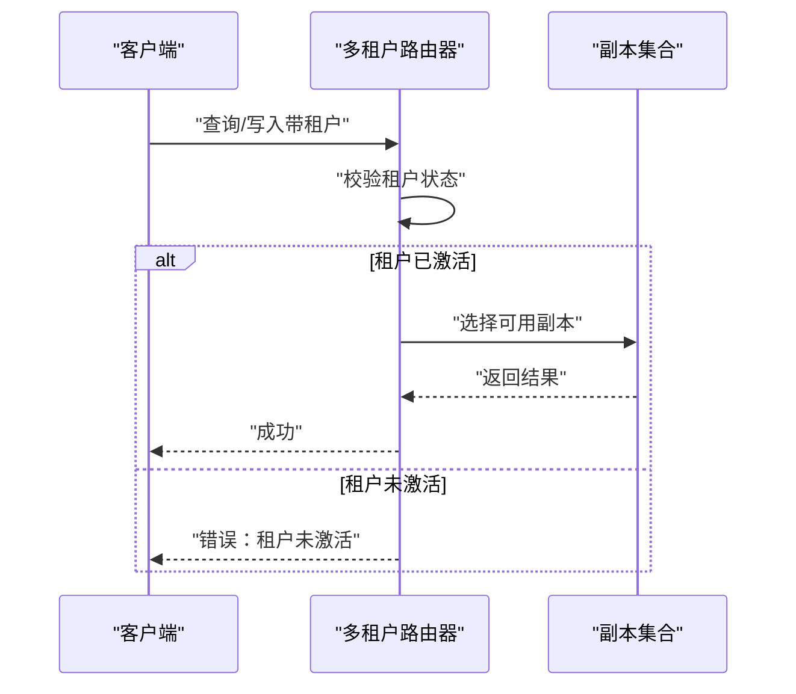
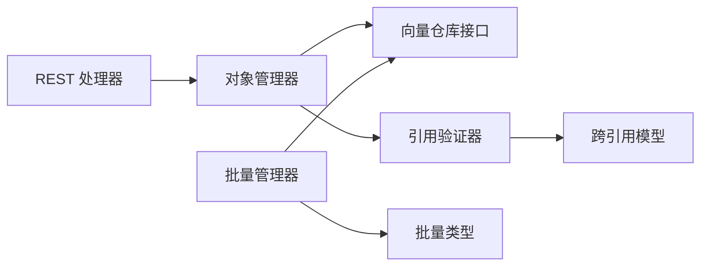

# 数据管理

<cite>
**本文档引用的文件**
- [usecases/objects/manager.go](file://usecases/objects/manager.go)
- [adapters/handlers/rest/handlers_objects.go](file://adapters/handlers/rest/handlers_objects.go)
- [adapters/handlers/rest/operations/objects/objects_class_put.go](file://adapters/handlers/rest/operations/objects/objects_class_put.go)
- [adapters/handlers/rest/operations/objects/objects_update.go](file://adapters/handlers/rest/operations/objects/objects_update.go)
- [usecases/objects/batch_manager.go](file://usecases/objects/batch_manager.go)
- [usecases/objects/batch_types.go](file://usecases/objects/batch_types.go)
- [adapters/handlers/rest/operations/batch/batch_objects_delete.go](file://adapters/handlers/rest/operations/batch/batch_objects_delete.go)
- [usecases/objects/validation/model_validation.go](file://usecases/objects/validation/model_validation.go)
- [entities/schema/crossref/crossref.go](file://entities/schema/crossref/crossref.go)
- [usecases/objects/batch_references_add.go](file://usecases/objects/batch_references_add.go)
- [test/acceptance/stress_tests/concurrent_batches_test.go](file://test/acceptance/stress_tests/concurrent_batches_test.go)
- [test/helper/objects.go](file://test/helper/objects.go)
- [test/acceptance/replication/read_repair/multi_tenancy_test.go](file://test/acceptance/replication/read_repair/multi_tenancy_test.go)
- [cluster/router/router_test.go](file://cluster/router/router_test.go)
- [test/acceptance_with_go_client/multi_tenancy_tests/implicit_activation_test.go](file://test/acceptance_with_go_client/multi_tenancy_tests/implicit_activation_test.go)
- [test/acceptance/replication/replica_replication/fast/delete_tenant_test.go](file://test/acceptance/replication/replica_replication/fast/delete_tenant_test.go)
</cite>

## 目录
1. [简介](#简介)
2. [项目结构](#项目结构)
3. [核心组件](#核心组件)
4. [架构总览](#架构总览)
5. [详细组件分析](#详细组件分析)
6. [依赖分析](#依赖分析)
7. [性能考虑](#性能考虑)
8. [故障排查指南](#故障排查指南)
9. [结论](#结论)
10. [附录](#附录)

## 简介
本章节面向初学者与高级开发者，系统性讲解 Weaviate 的数据管理能力，重点覆盖：
- 对象 CRUD：PutObject（替换）、DeleteObject（删除）、UpdateObject（更新）等核心操作的实现机制与调用链路
- 批量操作：批量插入、批量删除、批量引用创建的实现原理与并发特性
- 引用关系：跨引用解析、引用缓存与引用完整性校验策略
- 多租户：数据隔离、副本与路由策略、一致性与可用性权衡
- 一致性与事务：写入一致性级别、读修复、副本状态与租户激活状态对查询的影响
- 性能优化与最佳实践：批处理、并发、向量化与模块集成

## 项目结构
Weaviate 的数据管理由“用例层（usecases）+ 适配器层（adapters）+ 实体层（entities）”构成：
- 用例层负责业务编排与一致性控制（如 Manager、BatchManager）
- 适配器层负责对外接口（REST/gRPC）与授权、绑定参数
- 实体层提供跨引用、模型与工具类型

**图表来源**
- [adapters/handlers/rest/handlers_objects.go](file://adapters/handlers/rest/handlers_objects.go#L337-L360)
- [adapters/handlers/rest/operations/objects/objects_class_put.go](file://adapters/handlers/rest/operations/objects/objects_class_put.go#L40-L84)
- [adapters/handlers/rest/operations/objects/objects_update.go](file://adapters/handlers/rest/operations/objects/objects_update.go#L45-L84)
- [adapters/handlers/rest/operations/batch/batch_objects_delete.go](file://adapters/handlers/rest/operations/batch/batch_objects_delete.go#L40-L85)
- [usecases/objects/manager.go](file://usecases/objects/manager.go#L76-L188)
- [usecases/objects/batch_manager.go](file://usecases/objects/batch_manager.go#L27-L78)
- [usecases/objects/validation/model_validation.go](file://usecases/objects/validation/model_validation.go#L66-L153)
- [usecases/objects/batch_references_add.go](file://usecases/objects/batch_references_add.go#L202-L286)
- [entities/schema/crossref/crossref.go](file://entities/schema/crossref/crossref.go#L28-L118)
- [usecases/objects/batch_types.go](file://usecases/objects/batch_types.go#L45-L97)

**章节来源**
- [usecases/objects/manager.go](file://usecases/objects/manager.go#L76-L188)
- [usecases/objects/batch_manager.go](file://usecases/objects/batch_manager.go#L27-L78)
- [adapters/handlers/rest/handlers_objects.go](file://adapters/handlers/rest/handlers_objects.go#L337-L360)

## 核心组件
- 对象管理器（Manager）：封装对象的增删改查、引用管理、查询与向量化扩展，统一处理别名解析、时间戳与内存监控
- 批量管理器（BatchManager）：提供批量对象写入、批量删除、批量引用添加的编排与指标统计
- 引用验证器（Validator）：解析与校验单个/多个引用，确保目标存在且格式正确
- 跨引用模型（crossref.Ref）：统一本地/远程引用的解析与序列化
- 批量类型（BatchTypes）：定义批量请求/响应结构，保留原始索引与错误信息

**章节来源**
- [usecases/objects/manager.go](file://usecases/objects/manager.go#L76-L188)
- [usecases/objects/batch_manager.go](file://usecases/objects/batch_manager.go#L27-L78)
- [usecases/objects/validation/model_validation.go](file://usecases/objects/validation/model_validation.go#L66-L153)
- [entities/schema/crossref/crossref.go](file://entities/schema/crossref/crossref.go#L28-L118)
- [usecases/objects/batch_types.go](file://usecases/objects/batch_types.go#L45-L97)

## 架构总览
下图展示了从 REST 请求到用例层再到存储层的整体调用链，以及批量与引用处理的关键节点。

**图表来源**
- [adapters/handlers/rest/operations/objects/objects_class_put.go](file://adapters/handlers/rest/operations/objects/objects_class_put.go#L40-L84)
- [adapters/handlers/rest/handlers_objects.go](file://adapters/handlers/rest/handlers_objects.go#L362-L372)
- [usecases/objects/manager.go](file://usecases/objects/manager.go#L119-L144)
- [usecases/objects/validation/model_validation.go](file://usecases/objects/validation/model_validation.go#L96-L153)
- [entities/schema/crossref/crossref.go](file://entities/schema/crossref/crossref.go#L75-L118)

## 详细组件分析

### 对象 CRUD 实现机制
- 替换对象（PutObject）
  - 入口：REST 路由绑定参数后调用处理器，再进入管理器的更新流程
  - 关键点：鉴权、别名解析、引用校验、向量化扩展、写入一致性级别
- 删除对象（DeleteObject）
  - 入口：REST 处理器调用管理器删除，支持多租户与一致性参数
  - 错误映射：权限不足、未找到、多租户错误、服务器内部错误
- 更新对象（UpdateObject）
  - 入口：REST 处理器调用管理器更新；存在废弃端点提示使用带类名的路径

**图表来源**
- [adapters/handlers/rest/handlers_objects.go](file://adapters/handlers/rest/handlers_objects.go#L337-L360)
- [usecases/objects/manager.go](file://usecases/objects/manager.go#L119-L144)

**章节来源**
- [adapters/handlers/rest/operations/objects/objects_class_put.go](file://adapters/handlers/rest/operations/objects/objects_class_put.go#L40-L84)
- [adapters/handlers/rest/handlers_objects.go](file://adapters/handlers/rest/handlers_objects.go#L337-L360)
- [adapters/handlers/rest/operations/objects/objects_update.go](file://adapters/handlers/rest/operations/objects/objects_update.go#L45-L84)

### 批量操作实现原理
- 批量插入
  - 批量管理器聚合对象，进行别名解析、自动模式与模块向量化更新，最终通过向量仓库批量写入
  - 并发与稳定性：测试显示高并发批量写入仍可保持结果正确
- 批量删除
  - 基于过滤条件删除，受查询最大结果限制；支持 DryRun 输出统计
- 批量引用创建
  - 解析引用源/目标，校验本地性与多租户一致性，支持批量落库

**图表来源**
- [usecases/objects/batch_manager.go](file://usecases/objects/batch_manager.go#L27-L78)
- [usecases/objects/batch_types.go](file://usecases/objects/batch_types.go#L45-L97)
- [adapters/handlers/rest/operations/batch/batch_objects_delete.go](file://adapters/handlers/rest/operations/batch/batch_objects_delete.go#L40-L85)

**章节来源**
- [usecases/objects/batch_manager.go](file://usecases/objects/batch_manager.go#L27-L78)
- [usecases/objects/batch_types.go](file://usecases/objects/batch_types.go#L45-L97)
- [adapters/handlers/rest/operations/batch/batch_objects_delete.go](file://adapters/handlers/rest/operations/batch/batch_objects_delete.go#L40-L85)
- [test/acceptance/stress_tests/concurrent_batches_test.go](file://test/acceptance/stress_tests/concurrent_batches_test.go#L59-L94)

### 引用关系处理机制
- 跨引用解析
  - 使用统一的 Ref 结构解析 URI 形式的引用，确保本地/远程标识、类名、UUID 合法
- 引用缓存与完整性
  - 验证器在存在性检查时支持空租户回退，保证跨 MT/非 MT 引用的健壮性
- 批量引用校验
  - 校验本地源与目标、大小写规范化、多租户一致性规则（同启/不同启、租户键一致）

**图表来源**
- [entities/schema/crossref/crossref.go](file://entities/schema/crossref/crossref.go#L43-L118)
- [usecases/objects/validation/model_validation.go](file://usecases/objects/validation/model_validation.go#L96-L153)
- [usecases/objects/batch_references_add.go](file://usecases/objects/batch_references_add.go#L202-L286)

**章节来源**
- [entities/schema/crossref/crossref.go](file://entities/schema/crossref/crossref.go#L28-L118)
- [usecases/objects/validation/model_validation.go](file://usecases/objects/validation/model_validation.go#L96-L153)
- [usecases/objects/batch_references_add.go](file://usecases/objects/batch_references_add.go#L202-L286)

### 多租户数据隔离与复制机制
- 隔离与路由
  - 路由器根据租户状态选择副本，租户非活动时拒绝请求
- 复制与一致性
  - 租户级复制操作独立管理，删除租户不影响其他租户的复制状态
- 测试验证
  - 多租户开启、租户激活状态下的数据导入与查询可用性
  - 多节点场景下租户数据隔离与读修复一致性

**图表来源**
- [cluster/router/router_test.go](file://cluster/router/router_test.go#L956-L991)
- [test/acceptance/replication/read_repair/multi_tenancy_test.go](file://test/acceptance/replication/read_repair/multi_tenancy_test.go#L57-L101)
- [test/acceptance_with_go_client/multi_tenancy_tests/implicit_activation_test.go](file://test/acceptance_with_go_client/multi_tenancy_tests/implicit_activation_test.go#L40-L77)
- [test/acceptance/replication/replica_replication/fast/delete_tenant_test.go](file://test/acceptance/replication/replica_replication/fast/delete_tenant_test.go#L88-L134)

**章节来源**
- [cluster/router/router_test.go](file://cluster/router/router_test.go#L956-L991)
- [test/acceptance/replication/read_repair/multi_tenancy_test.go](file://test/acceptance/replication/read_repair/multi_tenancy_test.go#L57-L101)
- [test/acceptance_with_go_client/multi_tenancy_tests/implicit_activation_test.go](file://test/acceptance_with_go_client/multi_tenancy_tests/implicit_activation_test.go#L40-L77)
- [test/acceptance/replication/replica_replication/fast/delete_tenant_test.go](file://test/acceptance/replication/replica_replication/fast/delete_tenant_test.go#L88-L134)

### 数据一致性与事务处理
- 写入一致性级别
  - REST 层通过一致性参数传递给管理器，影响写入时的副本确认策略
- 读修复与副本状态
  - 多节点场景下，读修复与副本状态变更会影响可见性与一致性
- 事务语义
  - 单对象写入为原子；批量写入由底层存储决定，但整体流程以“顺序校验+批量提交”为主

**章节来源**
- [adapters/handlers/rest/handlers_objects.go](file://adapters/handlers/rest/handlers_objects.go#L362-L372)
- [test/acceptance/replication/read_repair/multi_tenancy_test.go](file://test/acceptance/replication/read_repair/multi_tenancy_test.go#L57-L101)

### 具体代码示例（以路径代替代码片段）
- 替换对象（REST 路由与处理器）
  - [objects_class_put.go](file://adapters/handlers/rest/operations/objects/objects_class_put.go#L40-L84)
  - [handlers_objects.go](file://adapters/handlers/rest/handlers_objects.go#L362-L372)
- 删除对象（REST 处理器与错误映射）
  - [handlers_objects.go](file://adapters/handlers/rest/handlers_objects.go#L337-L360)
- 批量删除（路由与参数绑定）
  - [batch_objects_delete.go](file://adapters/handlers/rest/operations/batch/batch_objects_delete.go#L40-L85)
- 引用解析与校验
  - [crossref.go](file://entities/schema/crossref/crossref.go#L43-L118)
  - [model_validation.go](file://usecases/objects/validation/model_validation.go#L96-L153)
- 批量引用校验与多租户规则
  - [batch_references_add.go](file://usecases/objects/batch_references_add.go#L202-L286)
- 并发批量写入测试
  - [concurrent_batches_test.go](file://test/acceptance/stress_tests/concurrent_batches_test.go#L59-L94)
- 批量删除辅助方法
  - [objects.go](file://test/helper/objects.go#L392-L436)

## 依赖分析
- 组件耦合
  - REST 处理器仅依赖管理器接口，职责清晰；管理器依赖向量仓库接口与模块提供者，便于替换存储与扩展向量化
- 外部依赖
  - 跨引用解析依赖标准 URI 解析；引用验证依赖存在性检查回调
- 循环依赖
  - 当前结构以接口分层，未见循环依赖迹象

**图表来源**
- [adapters/handlers/rest/handlers_objects.go](file://adapters/handlers/rest/handlers_objects.go#L337-L360)
- [usecases/objects/manager.go](file://usecases/objects/manager.go#L76-L188)
- [usecases/objects/validation/model_validation.go](file://usecases/objects/validation/model_validation.go#L66-L153)
- [entities/schema/crossref/crossref.go](file://entities/schema/crossref/crossref.go#L28-L118)
- [usecases/objects/batch_manager.go](file://usecases/objects/batch_manager.go#L27-L78)
- [usecases/objects/batch_types.go](file://usecases/objects/batch_types.go#L45-L97)

**章节来源**
- [usecases/objects/manager.go](file://usecases/objects/manager.go#L76-L188)
- [usecases/objects/batch_manager.go](file://usecases/objects/batch_manager.go#L27-L78)

## 性能考虑
- 批量优先：优先使用批量接口减少网络往返与事务开销
- 并发控制：合理设置并发度，避免超过存储层吞吐上限
- 向量化与模块：按需启用模块向量化，注意其对内存与 CPU 的影响
- 查询限制：批量删除受查询最大结果限制，必要时分批执行
- 多租户路由：确保租户处于活动状态，避免因路由失败导致重试与延迟

## 故障排查指南
- 权限不足
  - REST 处理器会将权限错误映射为 403，检查角色与资源授权
- 未找到对象
  - 删除/更新时若对象不存在返回 404，确认 ID 与租户
- 多租户错误
  - 跨租户引用或租户未激活会导致 422/错误响应，核对租户状态与引用规则
- 引用格式错误
  - 跨引用 URI 不合法或目标 ID 大小写不一致，参考解析与规范化逻辑
- 并发冲突
  - 高并发批量写入出现竞争，结合测试用例调整并发与重试策略

**章节来源**
- [adapters/handlers/rest/handlers_objects.go](file://adapters/handlers/rest/handlers_objects.go#L337-L360)
- [usecases/objects/validation/model_validation.go](file://usecases/objects/validation/model_validation.go#L96-L153)
- [usecases/objects/batch_references_add.go](file://usecases/objects/batch_references_add.go#L202-L286)
- [test/acceptance/stress_tests/concurrent_batches_test.go](file://test/acceptance/stress_tests/concurrent_batches_test.go#L59-L94)

## 结论
Weaviate 的数据管理以“用例层编排 + 接口层解耦 + 实体层抽象”的方式实现了对象 CRUD、批量操作、引用完整性与多租户隔离。通过一致性级别、读修复与副本状态管理，系统在可用性与一致性之间提供了灵活的配置。建议在生产中采用批量接口、合理并发与模块化向量化，并严格遵循多租户与引用规则以获得稳定性能。

## 附录
- 最佳实践清单
  - 使用带类名的更新端点替代废弃端点
  - 批量写入前先做引用解析与多租户校验
  - 设置合理的批量大小与并发度，结合查询限制分批执行
  - 多租户场景下确保租户处于活动状态后再进行写入
  - 在高并发场景下观察指标并适当降载