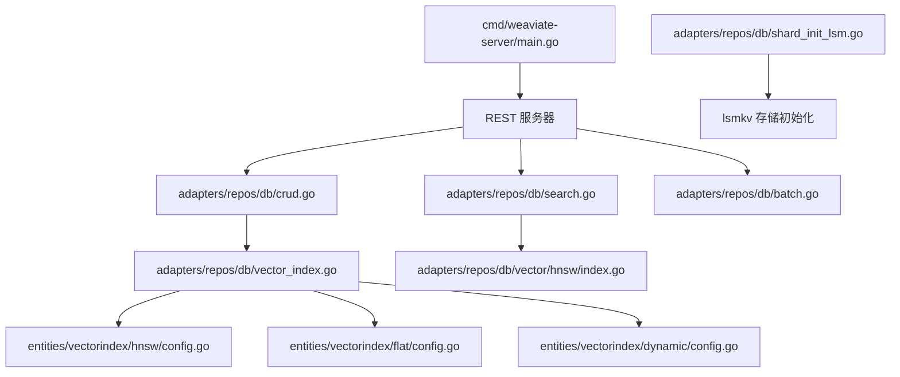
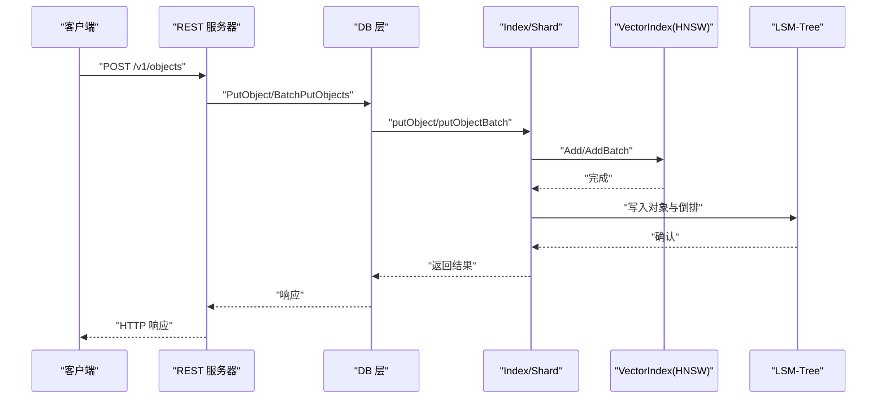
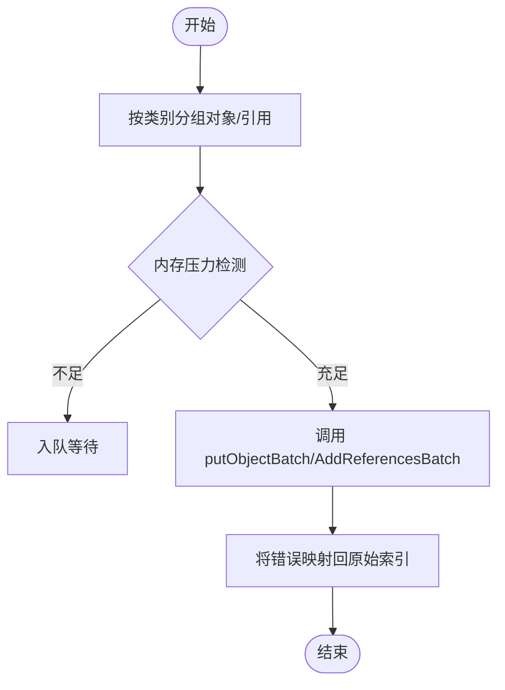
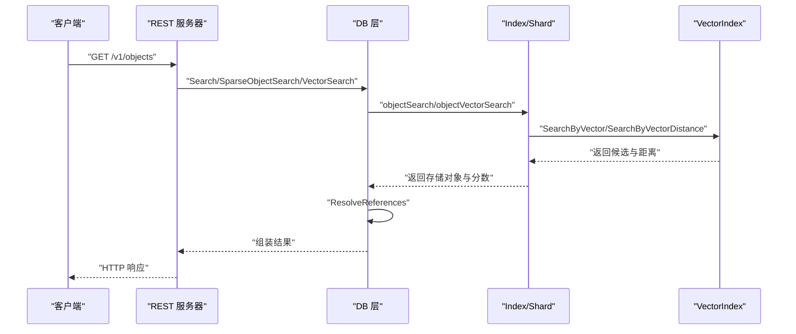
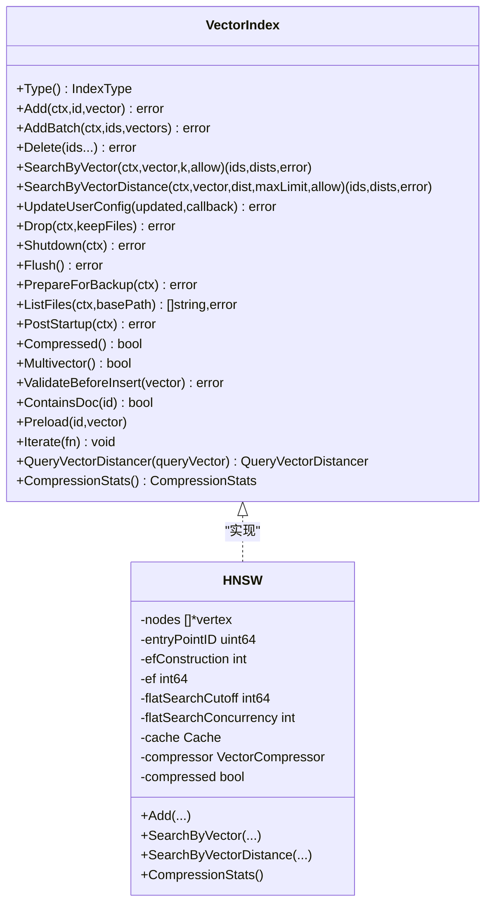
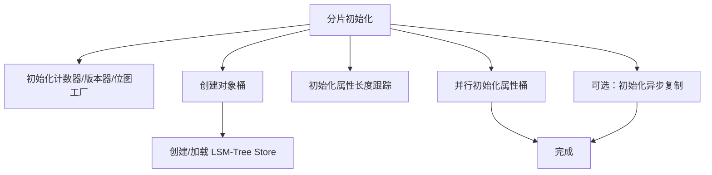
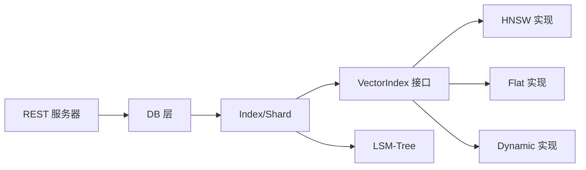

# 核心功能模块

<cite>
**本文引用的文件**
- [cmd/weaviate-server/main.go](file://cmd/weaviate-server/main.go)
- [adapters/repos/db/crud.go](file://adapters/repos/db/crud.go)
- [adapters/repos/db/search.go](file://adapters/repos/db/search.go)
- [adapters/repos/db/batch.go](file://adapters/repos/db/batch.go)
- [adapters/repos/db/vector_index.go](file://adapters/repos/db/vector_index.go)
- [adapters/repos/db/vector/hnsw/index.go](file://adapters/repos/db/vector/hnsw/index.go)
- [entities/vectorindex/hnsw/config.go](file://entities/vectorindex/hnsw/config.go)
- [entities/vectorindex/flat/config.go](file://entities/vectorindex/flat/config.go)
- [entities/vectorindex/dynamic/config.go](file://entities/vectorindex/dynamic/config.go)
- [entities/vectorindex/compression/state.go](file://entities/vectorindex/compression/state.go)
- [adapters/repos/db/shard_init_lsm.go](file://adapters/repos/db/shard_init_lsm.go)
- [adapters/repos/db/vector/compressionhelpers/compressionhelpers.go](file://adapters/repos/db/vector/compressionhelpers/compressionhelpers.go)
- [adapters/repos/db/vector/common/common.go](file://adapters/repos/db/vector/common/common.go)
- [adapters/repos/db/vector/cache/cache.go](file://adapters/repos/db/vector/cache/cache.go)
- [adapters/repos/db/vector/distancer/provider.go](file://adapters/repos/db/vector/distancer/provider.go)
- [adapters/repos/db/vector/multivector/multivector.go](file://adapters/repos/db/vector/multivector/multivector.go)
- [adapters/repos/db/vector/priorityqueue/priorityqueue.go](file://adapters/repos/db/vector/priorityqueue/priorityqueue.go)
- [adapters/repos/db/vector/pools/pools.go](file://adapters/repos/db/vector/pools/pools.go)
- [adapters/repos/db/vector/graph_state.go](file://adapters/repos/db/vector/graph_state.go)
- [adapters/repos/db/vector/compression_data.go](file://adapters/repos/db/vector/compression_data.go)
- [adapters/repos/db/vector/multivector_config.go](file://adapters/repos/db/vector/multivector_config.go)
- [adapters/repos/db/vector/pq_config.go](file://adapters/repos/db/vector/pq_config.go)
- [adapters/repos/db/vector/rq_config.go](file://adapters/repos/db/vector/rq_config.go)
- [adapters/repos/db/vector/sq_config.go](file://adapters/repos/db/vector/sq_config.go)
- [adapters/repos/db/vector/bq_config.go](file://adapters/repos/db/vector/bq_config.go)
- [adapters/repos/db/vector/hnsw/graph_state.go](file://adapters/repos/db/vector/hnsw/graph_state.go)
- [adapters/repos/db/vector/hnsw/packedconn/connections.go](file://adapters/repos/db/vector/hnsw/packedconn/connections.go)
- [adapters/repos/db/vector/hnsw/deserialization.go](file://adapters/repos/db/vector/hnsw/deserialization.go)
- [adapters/repos/db/vector/hnsw/multivector_config.go](file://adapters/repos/db/vector/hnsw/multivector_config.go)
- [adapters/repos/db/vector/hnsw/pq_config.go](file://adapters/repos/db/vector/hnsw/pq_config.go)
- [adapters/repos/db/vector/hnsw/rq_config.go](file://adapters/repos/db/vector/hnsw/rq_config.go)
- [adapters/repos/db/vector/hnsw/sq_config.go](file://adapters/repos/db/vector/hnsw/sq_config.go)
- [adapters/repos/db/vector/hnsw/bq_config.go](file://adapters/repos/db/vector/hnsw/bq_config.go)
- [adapters/repos/db/vector/hnsw/compression_data.go](file://adapters/repos/db/vector/hnsw/compression_data.go)
- [adapters/repos/db/vector/hnsw/deserialization.go](file://adapters/repos/db/vector/hnsw/deserialization.go)
- [adapters/repos/db/vector/hnsw/graph_state.go](file://adapters/repos/db/vector/hnsw/graph_state.go)
- [adapters/repos/db/vector/hnsw/packedconn/connections.go](file://adapters/repos/db/vector/hnsw/packedconn/connections.go)
- [adapters/repos/db/vector/hnsw/multivector_config.go](file://adapters/repos/db/vector/hnsw/multivector_config.go)
- [adapters/repos/db/vector/hnsw/pq_config.go](file://adapters/repos/db/vector/hnsw/pq_config.go)
- [adapters/repos/db/vector/hnsw/rq_config.go](file://adapters/repos/db/vector/hnsw/rq_config.go)
- [adapters/repos/db/vector/hnsw/sq_config.go](file://adapters/repos/db/vector/hnsw/sq_config.go)
- [adapters/repos/db/vector/hnsw/bq_config.go](file://adapters/repos/db/vector/hnsw/bq_config.go)
- [adapters/repos/db/vector/hnsw/compression_data.go](file://adapters/repos/db/vector/hnsw/compression_data.go)
- [adapters/repos/db/vector/hnsw/deserialization.go](file://adapters/repos/db/vector/hnsw/deserialization.go)
- [adapters/repos/db/vector/hnsw/graph_state.go](file://adapters/repos/db/vector/hnsw/graph_state.go)
- [adapters/repos/db/vector/hnsw/packedconn/connections.go](file://adapters/repos/db/vector/hnsw/packedconn/connections.go)
- [adapters/repos/db/vector/hnsw/multivector_config.go](file://adapters/repos/db/vector/hnsw/multivector_config.go)
- [adapters/repos/db/vector/hnsw/pq_config.go](file://adapters/repos/db/vector/hnsw/pq_config.go)
- [adapters/repos/db/vector/hnsw/rq_config.go](file://adapters/repos/db/vector/hnsw/rq_config.go)
- [adapters/repos/db/vector/hnsw/sq_config.go](file://adapters/repos/db/vector/hnsw/sq_config.go)
- [adapters/repos/db/vector/hnsw/bq_config.go](file://adapters/repos/db/vector/hnsw/bq_config.go)
- [adapters/repos/db/vector/hnsw/compression_data.go](file://adapters/repos/db/vector/hnsw/compression_data.go)
- [adapters/repos/db/vector/hnsw/deserialization.go](file://adapters/repos/db/vector/hnsw/deserialization.go)
- [adapters/repos/db/vector/hnsw/graph_state.go](file://adapters/repos/db/vector/hnsw/graph_state.go)
- [adapters/repos/db/vector/hnsw/packedconn/connections.go](file://adapters/repos/db/vector/hnsw/packedconn/connections.go)
- [adapters/repos/db/vector/hnsw/multivector_config.go](file://adapters/repos/db/vector/hnsw/multivector_config.go)
- [adapters/repos/db/vector/hnsw/pq_config.go](file://adapters/repos/db/vector/hnsw/pq_config.go)
- [adapters/repos/db/vector/hnsw/rq_config.go](file://adapters/repos/db/vector/hnsw/rq_config.go)
- [adapters/repos/db/vector/hnsw/sq_config.go](file://adapters/repos/db/vector/hnsw/sq_config.go)
- [adapters/repos/db/vector/hnsw/bq_config.go](file://adapters/repos/db/vector/hnsw/bq_config.go)
- [adapters/repos/db/vector/hnsw/compression_data.go](file://adapters/repos/db/vector/hnsw/compression_data.go)
- [adapters/repos/db/vector/hnsw/deserialization.go](file://adapters/repos/db/vector/hnsw/deserialization.go)
- [adapters/repos/db/vector/hnsw/graph_state.go](file://adapters/repos/db/vector/hnsw/graph_state.go)
- [adapters/repos/db/vector/hnsw/packedconn/connections.go](file://adapters/repos/db/vector/hnsw/packedconn/connections.go)
- [adapters/repos/db/vector/hnsw/multivector_config.go](file://adapters/repos/db/vector/hnsw/multivector_config.go)
- [adapters/repos/db/vector/hnsw/pq_config.go](file://adapters/repos/db/vector/hnsw/pq_config.go)
- [adapters/repos/db/vector/hnsw/rq_config.go](file://adapters/repos/db/vector/hnsw/rq_config.go)
- [adapters/repos/db/vector/hnsw/sq_config.go](file://adapters/repos/db/vector/hnsw/sq_config.go)
- [adapters/repos/db/vector/hnsw/bq_config.go](file://adapters/repos/db/vector/hnsw/bq_config.go)
- [adapters/repos/db/vector/hnsw/compression_data.go](file://adapters/repos/db/vector/hnsw/compression_data.go)
- [adapters/repos/db/vector/hnsw/deserialization.go](file://adapters/repos/db/vector/hnsw/deserialization.go)
- [adapters/repos/db/vector/hnsw/graph_state.go](file://adapters/repos/db/vector/hnsw/graph_state.go)
- [adapters/repos/db/vector/hnsw/packedconn/connections.go](file://adapters/repos/db/vector/hnsw/packedconn/connections.go)
- [adapters/repos/db/vector/hnsw/multivector_config.go](file://adapters/repos/db/vector/hnsw/multivector_config.go)
- [adapters/repos/db/vector/hnsw/pq_config.go](file://adapters/repos/db/vector/hnsw/pq_config.go)
- [adapters/repos/db/vector/hnsw/rq_config.go](file://adapters/repos/db/vector/hnsw/rq_config.go)
- [adapters/repos/db/vector/hnsw/sq_config.go](file://adapters/repos/db/vector/hnsw/sq_config.go)
- [adapters/repos/db/vector/hnsw/bq_config.go](file://adapters/repos/db/vector/hnsw/bq_config.go)
- [adapters/repos/db/vector/hnsw/compression_data.go](file://adapters/repos/db/vector/hnsw/compression_data.go)
- [adapters/repos/db/vector/hnsw/deserialization.go](file://adapters/repos/db/vector/hnsw/deserialization.go)
- [adapters/repos/db/vector/hnsw/graph_state.go](file://adapters/repos/db/vector/hnsw/graph_state.go)
- [adapters/repos/db/vector/hnsw/packedconn/connections.go](file://adapters/repos/db/vector/hnsw/packedconn/connections.go)
- [adapters/repos/db/vector/hnsw/multivector_config.go](file://adapters/repos/db/vector/hnsw/multivector_config.go)
- [adapters/repos/db/vector/hnsw/pq_config.go](file://adapters/repos/db/vector/hnsw/pq_config.go)
- [adapters/repos/db/vector/hnsw/rq_config.go](file://adapters/repos/db/vector/hnsw/rq_config.go)
- [adapters/repos/db/vector/hnsw/sq_config.go](file://adapters/repos/db/vector/hnsw/sq_config.go......
</cite>

## 目录
1. [简介](#简介)
2. [项目结构](#项目结构)
3. [核心组件](#核心组件)
4. [架构总览](#架构总览)
5. [详细组件分析](#详细组件分析)
6. [依赖分析](#依赖分析)
7. [性能考虑](#性能考虑)
8. [故障排查指南](#故障排查指南)
9. [结论](#结论)
10. [附录](#附录)

## 简介
本文件聚焦 Weaviate 的核心功能模块，围绕数据管理、搜索引擎与向量索引系统、存储引擎设计展开，提供从概念到实现细节的完整说明。内容覆盖：
- 数据管理：对象 CRUD、向量管理、引用关系处理、批量写入
- 搜索引擎：向量检索、文本检索、混合检索、过滤与排序
- 向量索引：HNSW、Flat、动态索引与压缩技术
- 存储引擎：LSM-Tree 结构、数据持久化、索引与压缩优化
- 交互关系与依赖、性能优化建议与最佳实践

## 项目结构
Weaviate 服务入口通过命令行启动 REST API 服务器，随后由适配器层对接业务用例与底层存储。核心目录与职责概览：
- cmd/weaviate-server：服务入口，加载 Swagger 规范并启动 HTTP 服务
- adapters/repos/db：数据库核心实现，包含 CRUD、搜索、批量、向量索引与 LSM 初始化等
- entities/vectorindex：向量索引配置与压缩状态定义
- entities/vectorindex/hnsw、flat、dynamic：各类向量索引配置
- adapters/repos/db/vector：向量索引实现（HNSW 等）及通用工具
- adapters/repos/db/lsmkv：LSM-Tree 存储实现（由分片初始化调用）



**图表来源**
- [cmd/weaviate-server/main.go](file://cmd/weaviate-server/main.go#L30-L66)
- [adapters/repos/db/crud.go](file://adapters/repos/db/crud.go#L35-L51)
- [adapters/repos/db/search.go](file://adapters/repos/db/search.go#L115-L139)
- [adapters/repos/db/batch.go](file://adapters/repos/db/batch.go#L44-L140)
- [adapters/repos/db/vector_index.go](file://adapters/repos/db/vector_index.go#L23-L54)
- [adapters/repos/db/vector/hnsw/index.go](file://adapters/repos/db/vector/hnsw/index.go#L44-L200)
- [adapters/repos/db/shard_init_lsm.go](file://adapters/repos/db/shard_init_lsm.go#L118-L146)

**章节来源**
- [cmd/weaviate-server/main.go](file://cmd/weaviate-server/main.go#L30-L66)

## 核心组件
- 数据管理（CRUD 与批量）
  - 对象写入/删除/存在性检查/多对象查询/引用合并
  - 批量对象与批量引用写入，支持内存压力检测与错误映射
- 搜索引擎
  - 文本检索（稀疏向量）、向量检索、跨类向量检索、聚合与分组
  - 参考解析与结果后处理
- 向量索引接口
  - 统一的向量索引接口定义，支持单向量与多向量、压缩与多向量能力标识
- 存储引擎（LSM-Tree）
  - 分片级 LSM 初始化、对象桶与属性长度跟踪、版本与位图工厂

**章节来源**
- [adapters/repos/db/crud.go](file://adapters/repos/db/crud.go#L35-L307)
- [adapters/repos/db/search.go](file://adapters/repos/db/search.go#L68-L526)
- [adapters/repos/db/vector_index.go](file://adapters/repos/db/vector_index.go#L23-L67)
- [adapters/repos/db/shard_init_lsm.go](file://adapters/repos/db/shard_init_lsm.go#L118-L200)

## 架构总览
Weaviate 的查询与写入路径如下：
- 写入：REST 层接收请求，调用 DB.PutObject/BatchPutObjects/Merge/AddReference 等，最终落到具体 Index/Shard 的写入流程
- 查询：REST 层调用 DB.Search/SparseObjectSearch/VectorSearch/CrossClassVectorSearch，内部委派给 Index/Shard 的检索实现
- 向量索引：Index/Shard 在需要时创建或复用 VectorIndex（如 HNSW），并结合缓存、距离计算与压缩策略
- 存储：LSM-Tree 提供对象与倒排索引的持久化与压缩



**图表来源**
- [adapters/repos/db/crud.go](file://adapters/repos/db/crud.go#L35-L140)
- [adapters/repos/db/batch.go](file://adapters/repos/db/batch.go#L44-L140)
- [adapters/repos/db/vector_index.go](file://adapters/repos/db/vector_index.go#L23-L54)
- [adapters/repos/db/shard_init_lsm.go](file://adapters/repos/db/shard_init_lsm.go#L148-L170)

## 详细组件分析

### 数据管理（CRUD 与批量）
- 对象 CRUD
  - PutObject：将模型对象转换为存储对象，定位 Index 并写入
  - DeleteObject/DeleteExpiredObjects：删除指定对象或过期对象
  - Exists/Object/ObjectByID/ObjectsByID：存在性检查与对象读取
  - MultiGet：按多个 ID 跨索引聚合结果
- 引用关系
  - AddReference/Merge：将引用合并到目标对象，支持复制属性与租户
- 批量写入
  - BatchPutObjects：按类分组、内存压力检测、并发写入、错误映射回原始索引
  - AddBatchReferences：按源类分组批量添加引用



**图表来源**
- [adapters/repos/db/batch.go](file://adapters/repos/db/batch.go#L44-L140)
- [adapters/repos/db/crud.go](file://adapters/repos/db/crud.go#L35-L307)

**章节来源**
- [adapters/repos/db/crud.go](file://adapters/repos/db/crud.go#L35-L307)
- [adapters/repos/db/batch.go](file://adapters/repos/db/batch.go#L44-L200)

### 搜索引擎实现
- 文本检索（稀疏向量）
  - SparseObjectSearch：基于倒排索引与关键字排序，返回存储对象与分数
- 向量检索
  - VectorSearch：支持目标向量组合、距离阈值、排序与分组
  - CrossClassVectorSearch：跨索引向量检索，汇总并按距离排序
- 聚合与分组
  - Aggregate：对指定类执行聚合
- 结果后处理
  - ResolveReferences：解析跨引用，支持分组场景



**图表来源**
- [adapters/repos/db/search.go](file://adapters/repos/db/search.go#L68-L268)
- [adapters/repos/db/vector_index.go](file://adapters/repos/db/vector_index.go#L23-L54)

**章节来源**
- [adapters/repos/db/search.go](file://adapters/repos/db/search.go#L68-L526)

### 向量索引系统（HNSW、Flat、动态与压缩）
- 接口抽象
  - VectorIndex/VectorIndexMulti：统一的向量索引接口，支持单向量与多向量、压缩与多向量能力、距离计算器、文件列表与预热等
- HNSW 实现要点
  - 图结构与连接管理、层级与入口点、EF 参数、扁平搜索阈值与并发、缓存与度量
  - 压缩配置与重评分并发、多向量支持、距离提供者
- Flat/HNSW/动态配置
  - 通过 entities/vectorindex 下的配置文件定义索引参数
- 压缩状态
  - compression/state.go 描述压缩状态与统计



**图表来源**
- [adapters/repos/db/vector_index.go](file://adapters/repos/db/vector_index.go#L23-L67)
- [adapters/repos/db/vector/hnsw/index.go](file://adapters/repos/db/vector/hnsw/index.go#L44-L200)

**章节来源**
- [adapters/repos/db/vector_index.go](file://adapters/repos/db/vector_index.go#L23-L67)
- [adapters/repos/db/vector/hnsw/index.go](file://adapters/repos/db/vector/hnsw/index.go#L44-L200)
- [entities/vectorindex/hnsw/config.go](file://entities/vectorindex/hnsw/config.go)
- [entities/vectorindex/flat/config.go](file://entities/vectorindex/flat/config.go)
- [entities/vectorindex/dynamic/config.go](file://entities/vectorindex/dynamic/config.go)
- [entities/vectorindex/compression/state.go](file://entities/vectorindex/compression/state.go)

### 存储引擎设计（LSM-Tree）
- 分片初始化
  - initNonVector：并行初始化对象桶、属性长度跟踪、属性桶、异步复制等
  - initLSMStore：创建 LSM-Tree Store，配置监控与回调
  - initObjectBucket：创建对象桶（替换策略、二级索引、墓碑保留等）
  - initProplenTracker：属性长度跟踪器
  - initIndexCounterVersionerAndBitmapFactory：索引计数器、版本器与位图工厂
- LSM 特性
  - 替换策略、二级索引、墓碑保留、懒加载、计数监控、周期性压缩与刷新回调



**图表来源**
- [adapters/repos/db/shard_init_lsm.go](file://adapters/repos/db/shard_init_lsm.go#L33-L116)
- [adapters/repos/db/shard_init_lsm.go](file://adapters/repos/db/shard_init_lsm.go#L118-L170)

**章节来源**
- [adapters/repos/db/shard_init_lsm.go](file://adapters/repos/db/shard_init_lsm.go#L33-L200)

### 向量索引实现细节（HNSW）
- 关键字段与锁
  - 全局读写锁、删除专用锁、重置上下文、首次插入保护、连接上限、层级与入口点、EF 参数、扁平搜索阈值与并发
- 缓存与度量
  - 向量缓存、插入与整体度量、随机函数用于测试稳定性
- 压缩与重评分
  - 压缩器、PQ/RQ/SQ/BQ 配置、重评分并发、压缩状态原子标记
- 多向量与距离提供者
  - 多向量支持、单向量/多向量距离提供者、视图与临时向量访问器
- 连接打包与序列化
  - 打包连接、图状态与序列化

```mermaid
classDiagram
class HNSW_Index {
-nodes []*vertex
-entryPointID uint64
-maximumConnections int
-currentMaximumLayer int
-efConstruction int
-ef int64
-flatSearchCutoff int64
-flatSearchConcurrency int
-levelNormalizer float64
-tombstones map[uint64]struct{}
-cache Cache
-compressor VectorCompressor
-compressed bool
-multiVectorForID MultiVectorForID
-distancerProvider Provider
-multiDistancerProvider Provider
+Add(...)
+AddBatch(...)
+Delete(...)
+SearchByVector(...)
+SearchByVectorDistance(...)
+CompressionStats()
}
```

**图表来源**
- [adapters/repos/db/vector/hnsw/index.go](file://adapters/repos/db/vector/hnsw/index.go#L44-L200)
- [adapters/repos/db/vector/hnsw/packedconn/connections.go](file://adapters/repos/db/vector/hnsw/packedconn/connections.go)
- [adapters/repos/db/vector/hnsw/deserialization.go](file://adapters/repos/db/vector/hnsw/deserialization.go)
- [adapters/repos/db/vector/hnsw/graph_state.go](file://adapters/repos/db/vector/hnsw/graph_state.go)

**章节来源**
- [adapters/repos/db/vector/hnsw/index.go](file://adapters/repos/db/vector/hnsw/index.go#L44-L200)

## 依赖分析
- 组件耦合
  - DB 层通过 Index/Shard 抽象与 VectorIndex/LSM 解耦，便于替换与扩展
  - VectorIndex 接口统一了 HNSW/Flat/Dynamic 的行为契约
- 直接依赖
  - 搜索链路依赖过滤器、排序、游标与额外属性
  - 写入链路依赖内存监控、错误复合器与复制属性
- 外部集成
  - REST 层通过 Swagger 规范暴露 API；LSM-Tree 作为底层存储



**图表来源**
- [adapters/repos/db/vector_index.go](file://adapters/repos/db/vector_index.go#L23-L67)
- [adapters/repos/db/vector/hnsw/index.go](file://adapters/repos/db/vector/hnsw/index.go#L44-L200)
- [adapters/repos/db/shard_init_lsm.go](file://adapters/repos/db/shard_init_lsm.go#L118-L170)

**章节来源**
- [adapters/repos/db/vector_index.go](file://adapters/repos/db/vector_index.go#L23-L67)
- [adapters/repos/db/search.go](file://adapters/repos/db/search.go#L68-L139)
- [adapters/repos/db/crud.go](file://adapters/repos/db/crud.go#L35-L140)

## 性能考虑
- 向量检索
  - 合理设置 EF/EFConstruction 与扁平搜索阈值，平衡召回率与延迟
  - 使用缓存与压缩可降低内存占用与 IO 压力，注意重评分并发与冷启动
- 写入吞吐
  - 批量写入优先，启用内存压力检测避免 OOM；按类分组减少锁竞争
  - 异步索引开启时，入队与出队分离，提升整体吞吐
- 存储与压缩
  - LSM-Tree 合理配置段大小与刷新策略，利用周期性压缩回调降低磁盘占用
  - 倒排索引与属性桶并行初始化，缩短启动时间
- 并发与锁
  - 插入与删除互斥保护，避免并发冲突；读多写少场景下读写锁提升并发

[本节为通用指导，无需特定文件来源]

## 故障排查指南
- 写入失败
  - 检查索引是否存在、租户配置是否匹配、内存压力检测是否触发
  - 批量写入错误映射回原始索引，定位具体条目
- 查询异常
  - 校验排序字段合法性、分页限制与最大结果阈值
  - 跨类向量检索时关注错误聚合与距离排序
- 向量索引问题
  - HNSW 删除/重建/重置流程需注意上下文与锁；压缩状态下重评分耗时较长
- 存储问题
  - LSM 初始化失败通常与路径权限或磁盘空间有关；检查对象桶与属性长度跟踪初始化日志

**章节来源**
- [adapters/repos/db/crud.go](file://adapters/repos/db/crud.go#L35-L307)
- [adapters/repos/db/search.go](file://adapters/repos/db/search.go#L204-L268)
- [adapters/repos/db/batch.go](file://adapters/repos/db/batch.go#L44-L200)
- [adapters/repos/db/vector/hnsw/index.go](file://adapters/repos/db/vector/hnsw/index.go#L44-L200)
- [adapters/repos/db/shard_init_lsm.go](file://adapters/repos/db/shard_init_lsm.go#L118-L170)

## 结论
Weaviate 的核心通过清晰的接口抽象与模块化设计实现了高可用的数据管理、灵活的搜索引擎与高效的向量索引系统。LSM-Tree 提供稳健的持久化基础，HNSW/Flat/Dynamic 与压缩技术满足不同场景的性能需求。遵循本文的最佳实践与故障排查建议，可在生产环境中获得稳定且高性能的表现。

[本节为总结，无需特定文件来源]

## 附录
- 使用模式与示例路径
  - 对象写入：参见 [PutObject](file://adapters/repos/db/crud.go#L35-L51)
  - 批量写入：参见 [BatchPutObjects](file://adapters/repos/db/batch.go#L44-L140)
  - 向量检索：参见 [VectorSearch](file://adapters/repos/db/search.go#L141-L185)
  - 跨类向量检索：参见 [CrossClassVectorSearch](file://adapters/repos/db/search.go#L204-L268)
  - HNSW 初始化与写入：参见 [HNSW Index](file://adapters/repos/db/vector/hnsw/index.go#L44-L200)
  - LSM 初始化：参见 [initLSMStore](file://adapters/repos/db/shard_init_lsm.go#L118-L146)

[本节为补充说明，无需特定文件来源]