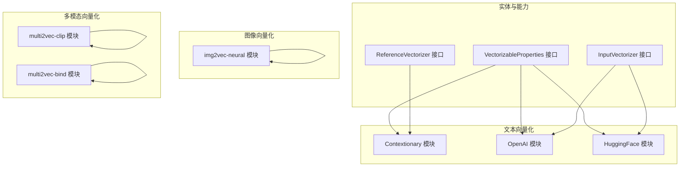
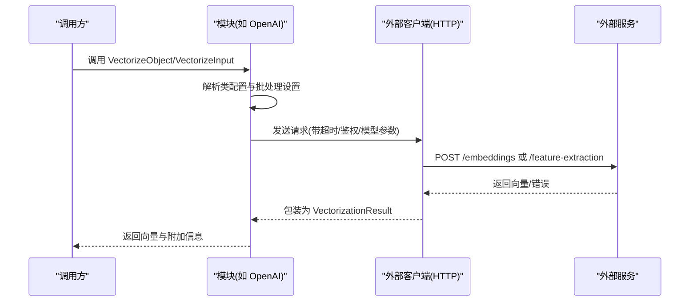
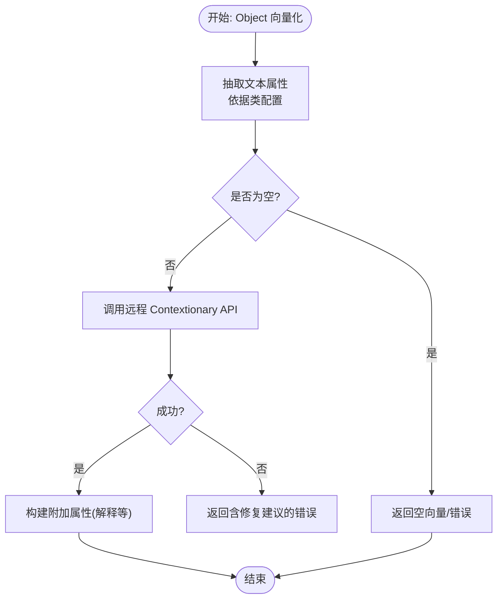
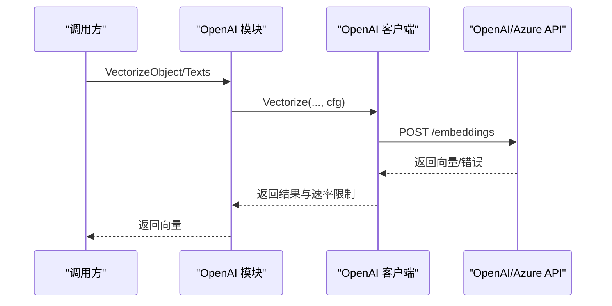
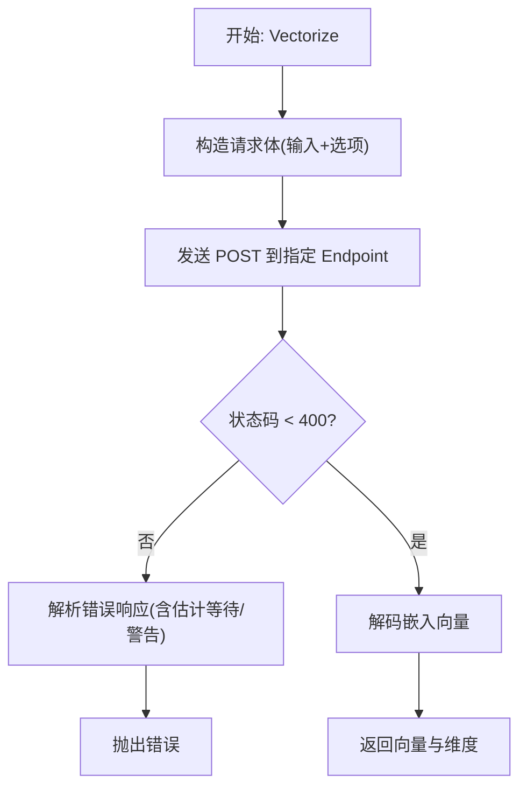
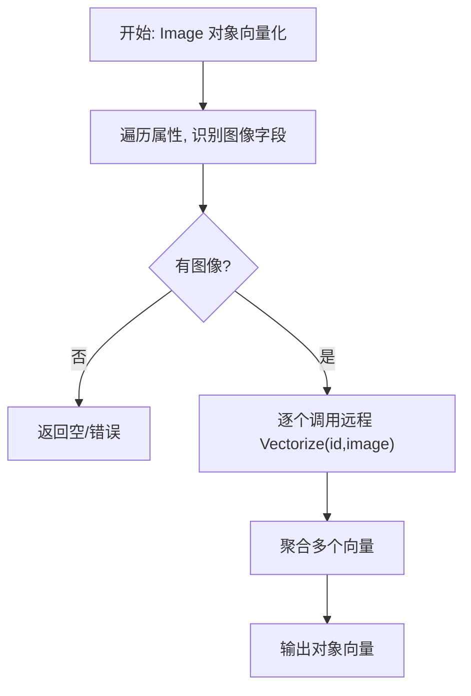
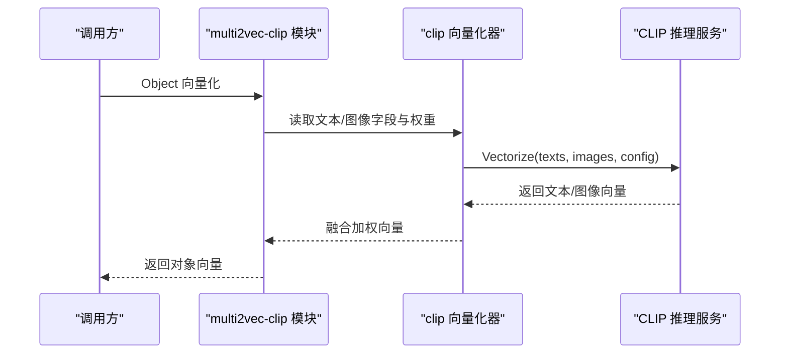
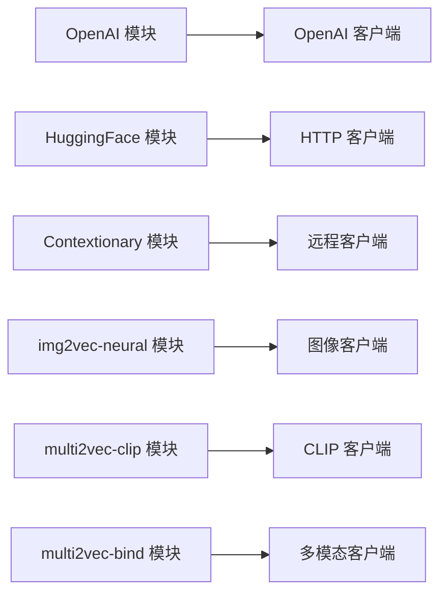

# 向量化模块

<cite>
**本文引用的文件**
- [entities/modulecapabilities/vectorizer.go](file://entities/modulecapabilities/vectorizer.go)
- [modules/text2vec-contextionary/module.go](file://modules/text2vec-contextionary/module.go)
- [modules/text2vec-contextionary/vectorizer/vectorizer.go](file://modules/text2vec-contextionary/vectorizer/vectorizer.go)
- [modules/text2vec-openai/module.go](file://modules/text2vec-openai/module.go)
- [modules/text2vec-openai/clients/openai.go](file://modules/text2vec-openai/clients/openai.go)
- [modules/text2vec-huggingface/module.go](file://modules/text2vec-huggingface/module.go)
- [modules/text2vec-huggingface/clients/huggingface.go](file://modules/text2vec-huggingface/clients/huggingface.go)
- [modules/img2vec-neural/module.go](file://modules/img2vec-neural/module.go)
- [modules/img2vec-neural/vectorizer/vectorizer.go](file://modules/img2vec-neural/vectorizer/vectorizer.go)
- [modules/multi2vec-clip/module.go](file://modules/multi2vec-clip/module.go)
- [modules/multi2vec-clip/vectorizer/vectorizer.go](file://modules/multi2vec-clip/vectorizer/vectorizer.go)
- [modules/multi2vec-bind/module.go](file://modules/multi2vec-bind/module.go)
</cite>

## 目录
1. [简介](#简介)
2. [项目结构](#项目结构)
3. [核心组件](#核心组件)
4. [架构总览](#架构总览)
5. [详细组件分析](#详细组件分析)
6. [依赖关系分析](#依赖关系分析)
7. [性能考量](#性能考量)
8. [故障排查指南](#故障排查指南)
9. [结论](#结论)
10. [附录：使用示例与最佳实践](#附录使用示例与最佳实践)

## 简介
本文件系统性梳理 Weaviate 的向量化模块，覆盖文本向量化（OpenAI、HuggingFace、Contextionary）、图像向量化（img2vec-neural）以及多模态向量化（multi2vec-*，如 clip、bind）。文档从接口设计、参数配置、批处理与速率限制、错误处理与性能优化等维度展开，并提供可操作的使用建议与排障指引，帮助数据科学家与 AI 工程师高效落地。

## 项目结构
Weaviate 将每个向量化器实现为独立模块，遵循统一的模块接口，通过实体层的通用能力接口对接上层调用。主要目录与职责如下：
- 实体与能力接口：定义向量化器、输入向量化、参考向量化等通用能力
- 文本向量化模块：OpenAI、HuggingFace、Contextionary 等
- 图像向量化模块：img2vec-neural
- 多模态向量化模块：multi2vec-clip、multi2vec-bind 等
- 客户端与网络层：封装外部服务调用、速率限制与错误处理

图表来源
- [entities/modulecapabilities/vectorizer.go](file://entities/modulecapabilities/vectorizer.go#L25-L53)
- [modules/text2vec-contextionary/module.go](file://modules/text2vec-contextionary/module.go#L215-L263)
- [modules/text2vec-openai/module.go](file://modules/text2vec-openai/module.go#L128-L161)
- [modules/text2vec-huggingface/module.go](file://modules/text2vec-huggingface/module.go#L119-L127)
- [modules/img2vec-neural/module.go](file://modules/img2vec-neural/module.go#L91-L101)
- [modules/multi2vec-clip/module.go](file://modules/multi2vec-clip/module.go#L132-L156)
- [modules/multi2vec-bind/module.go](file://modules/multi2vec-bind/module.go#L160-L170)

章节来源
- [entities/modulecapabilities/vectorizer.go](file://entities/modulecapabilities/vectorizer.go#L25-L53)
- [modules/text2vec-contextionary/module.go](file://modules/text2vec-contextionary/module.go#L215-L263)
- [modules/text2vec-openai/module.go](file://modules/text2vec-openai/module.go#L128-L161)
- [modules/text2vec-huggingface/module.go](file://modules/text2vec-huggingface/module.go#L119-L127)
- [modules/img2vec-neural/module.go](file://modules/img2vec-neural/module.go#L91-L101)
- [modules/multi2vec-clip/module.go](file://modules/multi2vec-clip/module.go#L132-L156)
- [modules/multi2vec-bind/module.go](file://modules/multi2vec-bind/module.go#L160-L170)

## 核心组件
- 向量化器接口族
  - 对象向量化：支持对单个对象或批量对象生成向量，并可返回附加信息
  - 输入向量化：仅对纯文本输入生成向量
  - 参考向量化：基于引用对象的向量合成目标对象向量（适用于 ref2vec）
- 文本向量化器
  - Contextionary：本地/远程上下文词典驱动的文本向量化
  - OpenAI：支持 Azure/OpenAI 第三方提供商，具备令牌与速率限制控制
  - HuggingFace：通过 HuggingFace Inference API 进行特征提取
- 图像向量化器
  - img2vec-neural：将图像属性向量化并聚合为最终向量
- 多模态向量化器
  - multi2vec-clip：同时处理文本与图像，按权重融合
  - multi2vec-bind：支持图像、音频、视频、IMU、热成像、深度图等多模态输入

章节来源
- [entities/modulecapabilities/vectorizer.go](file://entities/modulecapabilities/vectorizer.go#L25-L53)
- [modules/text2vec-contextionary/module.go](file://modules/text2vec-contextionary/module.go#L215-L263)
- [modules/text2vec-openai/module.go](file://modules/text2vec-openai/module.go#L128-L161)
- [modules/text2vec-huggingface/module.go](file://modules/text2vec-huggingface/module.go#L119-L127)
- [modules/img2vec-neural/module.go](file://modules/img2vec-neural/module.go#L91-L101)
- [modules/multi2vec-clip/module.go](file://modules/multi2vec-clip/module.go#L132-L156)
- [modules/multi2vec-bind/module.go](file://modules/multi2vec-bind/module.go#L160-L170)

## 架构总览
Weaviate 的向量化模块采用“模块即插件”架构：每个模块实现统一的能力接口，负责初始化客户端、解析类配置、执行对象/输入向量化、提供 GraphQL 参数与搜索器扩展。文本向量化器通常封装外部 HTTP 客户端，处理速率限制与错误；图像与多模态向量化器在对象属性中识别媒体字段，调用远程推理服务并进行向量聚合。

图表来源
- [modules/text2vec-openai/module.go](file://modules/text2vec-openai/module.go#L104-L121)
- [modules/text2vec-openai/clients/openai.go](file://modules/text2vec-openai/clients/openai.go#L39-L51)
- [modules/text2vec-huggingface/module.go](file://modules/text2vec-huggingface/module.go#L99-L112)
- [modules/text2vec-huggingface/clients/huggingface.go](file://modules/text2vec-huggingface/clients/huggingface.go#L114-L161)

## 详细组件分析

### 文本向量化：Contextionary
- 角色与职责
  - 作为文本向量化器，负责将对象文本属性组合为语义向量
  - 提供 GraphQL nearText 参数、额外属性（解释、最近邻、语义路径）与分类器
- 关键流程
  - 对象文本抽取：根据类配置决定是否向量化类名/属性名与属性值
  - 远程调用：将拼接后的语料发送到上下文词典推理服务
  - 错误处理：当无法提取有效词汇时，给出明确修复建议
- 批处理策略
  - 顺序化批处理以避免并发导致的性能退化

图表来源
- [modules/text2vec-contextionary/vectorizer/vectorizer.go](file://modules/text2vec-contextionary/vectorizer/vectorizer.go#L76-L139)
- [modules/text2vec-contextionary/module.go](file://modules/text2vec-contextionary/module.go#L221-L241)

章节来源
- [modules/text2vec-contextionary/module.go](file://modules/text2vec-contextionary/module.go#L215-L263)
- [modules/text2vec-contextionary/vectorizer/vectorizer.go](file://modules/text2vec-contextionary/vectorizer/vectorizer.go#L76-L139)

### 文本向量化：OpenAI
- 角色与职责
  - 支持 OpenAI 与 Azure OpenAI，具备令牌与速率限制控制
  - 提供对象与输入向量化，统计外部请求指标
- 配置要点
  - 通过环境变量设置 API Key 与组织信息，支持 Azure 部署参数
  - 类配置映射到模型版本、维度、基础 URL 等
- 批处理与速率限制
  - 基于令牌数与对象数的批大小控制，返回速率限制状态
  - 统计单次/批量请求次数与输入长度，便于监控

图表来源
- [modules/text2vec-openai/module.go](file://modules/text2vec-openai/module.go#L104-L121)
- [modules/text2vec-openai/clients/openai.go](file://modules/text2vec-openai/clients/openai.go#L39-L78)

章节来源
- [modules/text2vec-openai/module.go](file://modules/text2vec-openai/module.go#L128-L161)
- [modules/text2vec-openai/clients/openai.go](file://modules/text2vec-openai/clients/openai.go#L39-L78)

### 文本向量化：HuggingFace
- 角色与职责
  - 通过 HuggingFace Inference API 进行特征提取
  - 支持自定义 Endpoint、等待模型、GPU 与缓存选项
- 配置要点
  - 优先从请求头获取 API Key，其次使用环境变量
  - 默认路由与模型路径可被覆盖
- 错误处理
  - 统一解析 HTTP 错误与服务端错误消息，包含估计等待时间与警告

图表来源
- [modules/text2vec-huggingface/clients/huggingface.go](file://modules/text2vec-huggingface/clients/huggingface.go#L114-L161)
- [modules/text2vec-huggingface/clients/huggingface.go](file://modules/text2vec-huggingface/clients/huggingface.go#L163-L189)

章节来源
- [modules/text2vec-huggingface/module.go](file://modules/text2vec-huggingface/module.go#L119-L127)
- [modules/text2vec-huggingface/clients/huggingface.go](file://modules/text2vec-huggingface/clients/huggingface.go#L88-L161)

### 图像向量化：img2vec-neural
- 角色与职责
  - 识别对象中的图像属性，调用远程推理服务生成向量并聚合
- 属性识别
  - 通过类配置判断哪些属性是图像字段
- 向量聚合
  - 将多个图像向量按策略合并得到对象最终向量

图表来源
- [modules/img2vec-neural/vectorizer/vectorizer.go](file://modules/img2vec-neural/vectorizer/vectorizer.go#L59-L94)
- [modules/img2vec-neural/module.go](file://modules/img2vec-neural/module.go#L97-L101)

章节来源
- [modules/img2vec-neural/module.go](file://modules/img2vec-neural/module.go#L91-L101)
- [modules/img2vec-neural/vectorizer/vectorizer.go](file://modules/img2vec-neural/vectorizer/vectorizer.go#L59-L94)

### 多模态向量化：multi2vec-clip
- 角色与职责
  - 同时处理文本与图像，按字段权重融合生成最终向量
- 字段与权重
  - 分别识别文本与图像字段，读取对应权重并归一化
- 远程调用
  - 将文本与图像列表一并提交到推理服务，分别返回文本/图像向量

图表来源
- [modules/multi2vec-clip/vectorizer/vectorizer.go](file://modules/multi2vec-clip/vectorizer/vectorizer.go#L70-L115)
- [modules/multi2vec-clip/module.go](file://modules/multi2vec-clip/module.go#L132-L156)

章节来源
- [modules/multi2vec-clip/module.go](file://modules/multi2vec-clip/module.go#L132-L156)
- [modules/multi2vec-clip/vectorizer/vectorizer.go](file://modules/multi2vec-clip/vectorizer/vectorizer.go#L70-L115)

### 多模态向量化：multi2vec-bind
- 角色与职责
  - 支持图像、音频、视频、IMU、热成像、深度图等多种模态
  - 提供近邻查询与搜索器扩展
- 字段识别与权重
  - 与 CLIP 类似，按字段类型识别并计算权重

章节来源
- [modules/multi2vec-bind/module.go](file://modules/multi2vec-bind/module.go#L160-L170)
- [modules/multi2vec-bind/module.go](file://modules/multi2vec-bind/module.go#L166-L170)

## 依赖关系分析
- 模块与能力接口
  - 各模块均实现统一的 Vectorizer、InputVectorizer、MetaProvider、Searcher 等能力接口
- 模块间耦合
  - 模块内部通过客户端封装外部服务调用，降低对外部实现细节的耦合
  - 多模态模块复用对象向量化组件，统一字段抽取与权重处理
- 批处理与速率限制
  - 文本向量化模块普遍内置批处理与令牌/请求数限制逻辑，减少外部服务压力

图表来源
- [modules/text2vec-openai/module.go](file://modules/text2vec-openai/module.go#L104-L121)
- [modules/text2vec-huggingface/module.go](file://modules/text2vec-huggingface/module.go#L99-L112)
- [modules/text2vec-contextionary/module.go](file://modules/text2vec-contextionary/module.go#L103-L113)
- [modules/img2vec-neural/module.go](file://modules/img2vec-neural/module.go#L72-L89)
- [modules/multi2vec-clip/module.go](file://modules/multi2vec-clip/module.go#L105-L130)
- [modules/multi2vec-bind/module.go](file://modules/multi2vec-bind/module.go#L139-L157)

章节来源
- [modules/text2vec-openai/module.go](file://modules/text2vec-openai/module.go#L104-L121)
- [modules/text2vec-huggingface/module.go](file://modules/text2vec-huggingface/module.go#L99-L112)
- [modules/text2vec-contextionary/module.go](file://modules/text2vec-contextionary/module.go#L103-L113)
- [modules/img2vec-neural/module.go](file://modules/img2vec-neural/module.go#L72-L89)
- [modules/multi2vec-clip/module.go](file://modules/multi2vec-clip/module.go#L105-L130)
- [modules/multi2vec-bind/module.go](file://modules/multi2vec-bind/module.go#L139-L157)

## 性能考量
- 批处理策略
  - OpenAI/HuggingFace 等模块内置批处理设置，需结合令牌数与对象数合理配置
  - Contextionary 在高并发下建议顺序化批处理以避免性能抖动
- 速率限制与重试
  - OpenAI 模块返回速率限制状态，建议在上层进行退避与重试
  - HuggingFace 客户端提供默认 RPM/TPM，可根据服务端能力调整
- 网络与超时
  - 设置合理的 HTTP 超时与重试策略，避免阻塞写入/查询
- 向量维度与内存
  - 不同模型输出维度不同，需在 schema 中显式声明维度以节省内存
  - 多模态融合时注意权重归一化，避免向量幅度过大导致索引性能下降

[本节为通用性能建议，不直接分析具体文件]

## 故障排查指南
- Contextionary 无可用词汇
  - 现象：对象无法向量化，提示无法提取有效词汇
  - 处理：开启类名/属性名向量化或确保至少一个文本属性包含有效词汇；必要时扩展上下文词典后重导入
- OpenAI/Azure 配置错误
  - 现象：鉴权失败或模型不可用
  - 处理：检查 API Key、组织 ID、部署 ID、模型版本与基础 URL；确认第三方提供商开关与 API 版本
- HuggingFace 服务异常
  - 现象：HTTP 5xx 或返回错误消息
  - 处理：查看服务端错误与估计等待时间，必要时启用等待模型、GPU 与缓存选项
- 多模态字段权重缺失
  - 现象：融合向量异常或为空
  - 处理：检查文本/图像字段权重配置并确保已归一化

章节来源
- [modules/text2vec-contextionary/vectorizer/vectorizer.go](file://modules/text2vec-contextionary/vectorizer/vectorizer.go#L109-L136)
- [modules/text2vec-openai/clients/openai.go](file://modules/text2vec-openai/clients/openai.go#L63-L78)
- [modules/text2vec-huggingface/clients/huggingface.go](file://modules/text2vec-huggingface/clients/huggingface.go#L163-L189)
- [modules/multi2vec-clip/vectorizer/vectorizer.go](file://modules/multi2vec-clip/vectorizer/vectorizer.go#L117-L134)

## 结论
Weaviate 的向量化模块通过统一接口与模块化设计，实现了对多种文本、图像与多模态向量化器的无缝集成。开发者只需关注类配置与字段映射，即可在不同外部服务之间灵活切换。结合批处理、速率限制与错误处理机制，可在保证稳定性的同时获得良好的吞吐与延迟表现。

[本节为总结性内容，不直接分析具体文件]

## 附录：使用示例与最佳实践
- 文本向量化
  - OpenAI：设置 OPENAI_APIKEY/OPENAI_ORGANIZATION 或 AZURE_APIKEY，配置模型版本与维度；对长文本分段或使用查询专用模型
  - HuggingFace：设置 HUGGINGFACE_APIKEY，选择合适模型与 endpoint；启用 waitForModel/useGPU/useCache
  - Contextionary：确保 schema 中至少存在一个有效词汇，必要时扩展词典
- 图像向量化
  - 在 schema 中标记图像字段；确保远程推理服务可用且返回向量
- 多模态向量化
  - 明确文本/图像字段权重并归一化；对多模态输入进行预处理（如裁剪、缩放、格式转换）
- 性能优化
  - 合理设置批大小与令牌上限；利用速率限制状态进行退避
  - 在 schema 中声明维度，避免动态推断带来的开销
  - 使用近邻搜索参数（如距离阈值、返回数量）提升检索效率

[本节为通用实践建议，不直接分析具体文件]