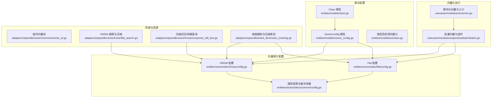
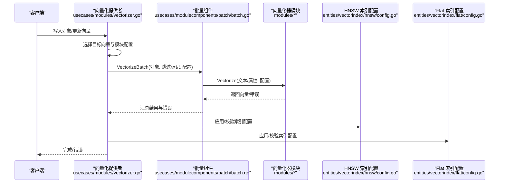
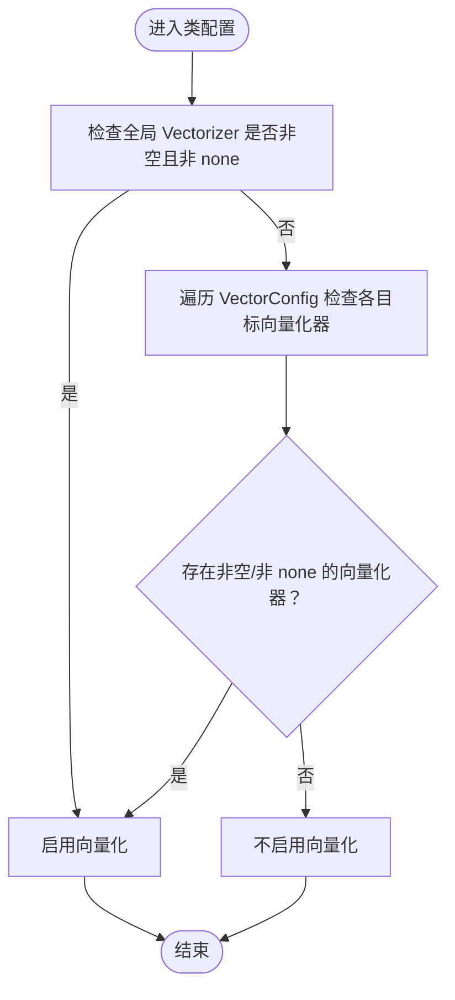
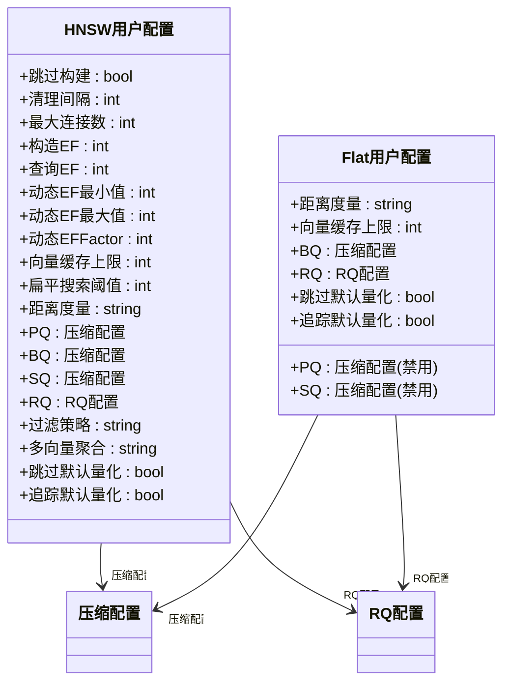
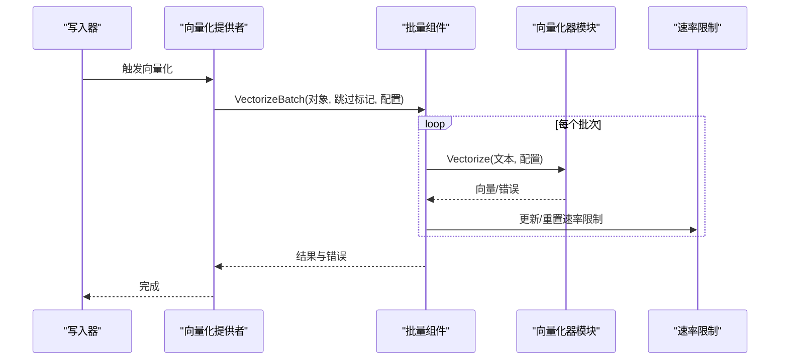
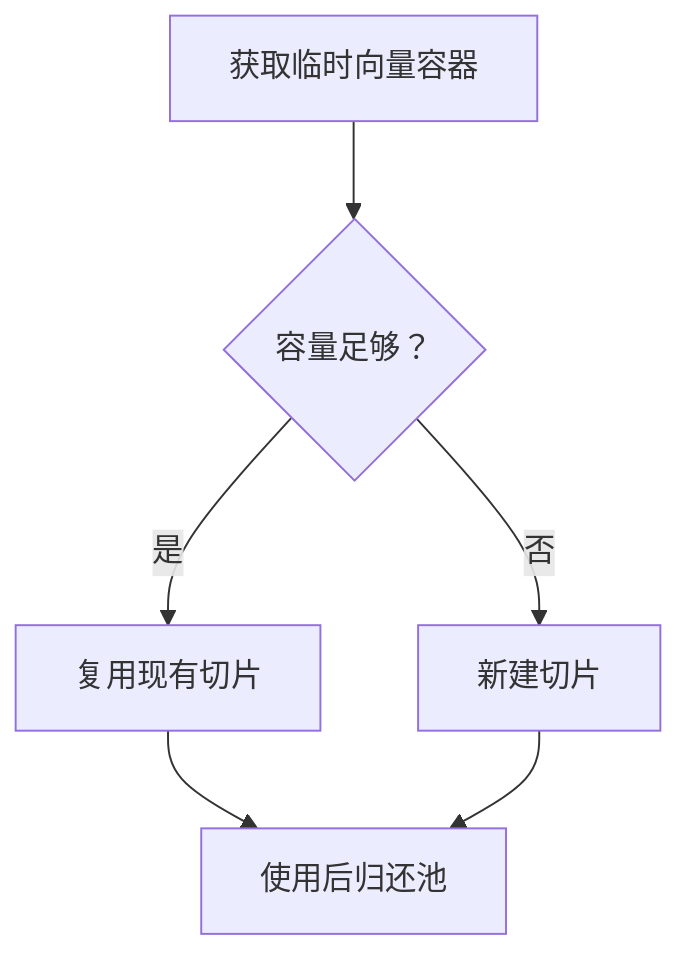
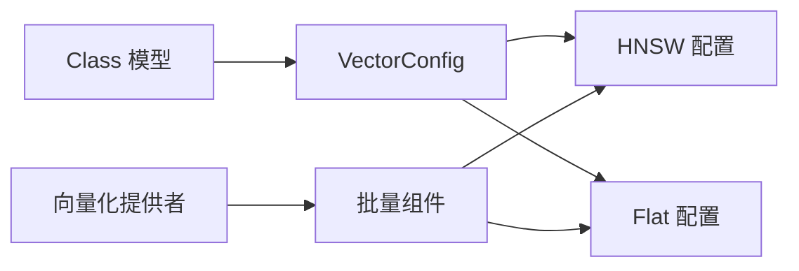

# 向量化配置与优化

<cite>
**本文引用的文件**
- [entities/models/class.go](file://entities/models/class.go)
- [entities/models/vector_config.go](file://entities/models/vector_config.go)
- [entities/modelsext/class.go](file://entities/modelsext/class.go)
- [entities/vectorindex/common/config.go](file://entities/vectorindex/common/config.go)
- [entities/vectorindex/hnsw/config.go](file://entities/vectorindex/hnsw/config.go)
- [entities/vectorindex/flat/config.go](file://entities/vectorindex/flat/config.go)
- [adapters/repos/db/vector/common/vector_id.go](file://adapters/repos/db/vector/common/vector_id.go)
- [adapters/repos/db/vector/hnsw/flat_search.go](file://adapters/repos/db/vector/hnsw/flat_search.go)
- [adapters/repos/db/vector/hnsw/compress_recall_test.go](file://adapters/repos/db/vector/hnsw/compress_recall_test.go)
- [adapters/repos/db/vector/hnsw/compress_sift_test.go](file://adapters/repos/db/vector/hnsw/compress_sift_test.go)
- [adapters/repos/db/shard_dimension_tracking.go](file://adapters/repos/db/shard_dimension_tracking.go)
- [modules/text2vec-openai/module.go](file://modules/text2vec-openai/module.go)
- [modules/text2vec-model2vec/module.go](file://modules/text2vec-model2vec/module.go)
- [modules/text2vec-transformers/module.go](file://modules/text2vec-transformers/module.go)
- [usecases/modulecomponents/batch/batch.go](file://usecases/modulecomponents/batch/batch.go)
- [usecases/modules/vectorizer.go](file://usecases/modules/vectorizer.go)
- [test/helper/sample-schema/books/books.go](file://test/helper/sample-schema/books/books.go)
- [test/modules/many-modules/many_modules_openai_test.go](file://test/modules/many-modules/many_modules_openai_test.go)
- [test/acceptance_with_go_client/named_vectors_tests/test_suits/named_vectors_test_data.go](file://test/acceptance_with_go_client/named_vectors_tests/test_suits/named_vectors_test_data.go)
- [test/acceptance_with_python/test_multi_target_search.py](file://test/acceptance_with_python/test_multi_target_search.py)
</cite>

## 目录
1. [简介](#简介)
2. [项目结构](#项目结构)
3. [核心组件](#核心组件)
4. [架构总览](#架构总览)
5. [详细组件分析](#详细组件分析)
6. [依赖关系分析](#依赖关系分析)
7. [性能考量](#性能考量)
8. [故障排除指南](#故障排除指南)
9. [结论](#结论)
10. [附录](#附录)

## 简介
本技术文档聚焦 Weaviate 的向量化配置与优化，覆盖以下主题：
- 类设置（Class Settings）中向量化器与向量索引的配置方法，包括向量维度、批处理大小、超时设置等关键参数
- 向量化器的内存管理、并发处理与资源优化
- 向量化质量评估、性能基准测试与成本效益分析
- 向量化器选择指南、部署优化建议与常见问题排查

目标读者：系统管理员与性能工程师，提供可操作的配置与优化指导。

## 项目结构
Weaviate 的向量化能力由“类模型”“向量索引配置”“模块化向量化器”“批量处理与并发”“硬件加速距离计算”等模块协同实现。下图展示与向量化相关的核心文件与职责映射。

**图表来源**
- [entities/models/class.go](file://entities/models/class.go#L32-L72)
- [entities/models/vector_config.go](file://entities/models/vector_config.go#L26-L39)
- [entities/modelsext/class.go](file://entities/modelsext/class.go#L43-L65)
- [entities/vectorindex/hnsw/config.go](file://entities/vectorindex/hnsw/config.go#L47-L136)
- [entities/vectorindex/flat/config.go](file://entities/vectorindex/flat/config.go#L43-L84)
- [entities/vectorindex/common/config.go](file://entities/vectorindex/common/config.go#L22-L40)
- [usecases/modulecomponents/batch/batch.go](file://usecases/modulecomponents/batch/batch.go#L438-L482)
- [usecases/modules/vectorizer.go](file://usecases/modules/vectorizer.go#L186-L393)
- [adapters/repos/db/vector/common/vector_id.go](file://adapters/repos/db/vector/common/vector_id.go#L164-L196)
- [adapters/repos/db/vector/hnsw/flat_search.go](file://adapters/repos/db/vector/hnsw/flat_search.go#L28-L47)
- [adapters/repos/db/vector/hnsw/compress_sift_test.go](file://adapters/repos/db/vector/hnsw/compress_sift_test.go#L444-L483)
- [adapters/repos/db/shard_dimension_tracking.go](file://adapters/repos/db/shard_dimension_tracking.go#L184-L222)

**章节来源**
- [entities/models/class.go](file://entities/models/class.go#L32-L72)
- [entities/models/vector_config.go](file://entities/models/vector_config.go#L26-L39)
- [entities/modelsext/class.go](file://entities/modelsext/class.go#L43-L65)
- [entities/vectorindex/hnsw/config.go](file://entities/vectorindex/hnsw/config.go#L47-L136)
- [entities/vectorindex/flat/config.go](file://entities/vectorindex/flat/config.go#L43-L84)
- [entities/vectorindex/common/config.go](file://entities/vectorindex/common/config.go#L22-L40)

## 核心组件
- 类与向量配置模型
  - Class 模型支持全局向量化器与命名向量（VectorConfig）两种方式；VectorConfig 可指定向量索引类型与具体索引配置。
  - 判断类是否需要向量化可通过工具函数检查 Vectorizer 或 VectorConfig 中的向量化器名称。
- 向量索引配置
  - HNSW 与 Flat 均提供默认值与校验逻辑，支持距离度量、缓存上限、压缩（PQ/BQ/SQ/RQ）与过滤策略等。
  - 通用配置提供距离度量与缓存上限默认值。
- 批量向量化与并发
  - 批处理组件负责令牌计数、批次聚合、速率限制与错误收集，并在模块层统一调度。
  - 模块化向量化入口按目标向量并行执行，支持多向量目标与参考向量化。

**章节来源**
- [entities/models/class.go](file://entities/models/class.go#L61-L71)
- [entities/models/vector_config.go](file://entities/models/vector_config.go#L26-L39)
- [entities/modelsext/class.go](file://entities/modelsext/class.go#L43-L65)
- [entities/vectorindex/hnsw/config.go](file://entities/vectorindex/hnsw/config.go#L47-L136)
- [entities/vectorindex/flat/config.go](file://entities/vectorindex/flat/config.go#L43-L84)
- [entities/vectorindex/common/config.go](file://entities/vectorindex/common/config.go#L22-L40)
- [usecases/modulecomponents/batch/batch.go](file://usecases/modulecomponents/batch/batch.go#L438-L482)
- [usecases/modules/vectorizer.go](file://usecases/modules/vectorizer.go#L186-L393)

## 架构总览
下图展示从对象写入到向量生成与索引检索的关键流程，以及与向量化器、索引配置与批量组件的关系。

**图表来源**
- [usecases/modules/vectorizer.go](file://usecases/modules/vectorizer.go#L186-L393)
- [usecases/modulecomponents/batch/batch.go](file://usecases/modulecomponents/batch/batch.go#L438-L482)
- [entities/vectorindex/hnsw/config.go](file://entities/vectorindex/hnsw/config.go#L138-L258)
- [entities/vectorindex/flat/config.go](file://entities/vectorindex/flat/config.go#L86-L130)

## 详细组件分析

### 类设置与命名向量（Class Settings）
- 全局向量化器与命名向量
  - 类模型支持通过全局字段指定向量化器与索引类型，或使用 VectorConfig 为不同向量目标分别配置。
  - 判断类是否启用向量化可通过工具函数遍历 Vectorizer 与 VectorConfig。
- 示例与验证
  - 测试样例展示了如何为 OpenAI 向量化器设置模型与维度，并以命名向量形式应用到类配置中。
  - 多模块测试覆盖了 OpenAI 向量化器的多种配置组合与默认行为。

**图表来源**
- [entities/modelsext/class.go](file://entities/modelsext/class.go#L43-L65)
- [entities/models/class.go](file://entities/models/class.go#L61-L71)
- [test/helper/sample-schema/books/books.go](file://test/helper/sample-schema/books/books.go#L43-L65)
- [test/modules/many-modules/many_modules_openai_test.go](file://test/modules/many-modules/many_modules_openai_test.go#L72-L118)

**章节来源**
- [entities/models/class.go](file://entities/models/class.go#L61-L71)
- [entities/modelsext/class.go](file://entities/modelsext/class.go#L43-L65)
- [test/helper/sample-schema/books/books.go](file://test/helper/sample-schema/books/books.go#L43-L65)
- [test/modules/many-modules/many_modules_openai_test.go](file://test/modules/many-modules/many_modules_openai_test.go#L72-L118)

### 向量索引配置（HNSW 与 Flat）
- HNSW 配置要点
  - 默认值：连接数、构造/查询参数、清理间隔、缓存上限、距离度量、过滤策略等。
  - 压缩配置：PQ、BQ、SQ、RQ 及其启用/分段/编码/位宽/重打分阈值等。
  - 校验规则：参数边界、仅能启用一种压缩方式、Muvera 参数约束等。
- Flat 配置要点
  - 默认值：距离度量、缓存上限、压缩开关与重打分阈值、RQ 位宽等。
  - 校验规则：不可同时启用多种压缩；RQ 位宽必须为 1 或 8；未启用压缩时禁止开启缓存。
- 通用配置
  - 提供距离度量枚举与默认缓存上限常量，便于索引配置解析与默认填充。

**图表来源**
- [entities/vectorindex/hnsw/config.go](file://entities/vectorindex/hnsw/config.go#L47-L136)
- [entities/vectorindex/flat/config.go](file://entities/vectorindex/flat/config.go#L43-L84)
- [entities/vectorindex/common/config.go](file://entities/vectorindex/common/config.go#L22-L40)

**章节来源**
- [entities/vectorindex/hnsw/config.go](file://entities/vectorindex/hnsw/config.go#L47-L136)
- [entities/vectorindex/hnsw/config.go](file://entities/vectorindex/hnsw/config.go#L260-L319)
- [entities/vectorindex/flat/config.go](file://entities/vectorindex/flat/config.go#L43-L84)
- [entities/vectorindex/flat/config.go](file://entities/vectorindex/flat/config.go#L156-L231)
- [entities/vectorindex/common/config.go](file://entities/vectorindex/common/config.go#L22-L40)

### 向量化器模块与批处理
- OpenAI 向量化器
  - 提供默认批处理设置：对象/令牌倍乘、最大时间、最大对象数、最大令牌数、令牌限制与返回速率限制等。
- Transformers 与 Model2Vec 向量化器
  - 提供模块初始化、超时等待与客户端启动等通用流程。
- 批处理组件
  - 统一处理令牌统计、批次聚合、速率限制更新与错误回填；支持令牌限制与重置函数。
- 并发与目标向量
  - 按目标向量并行执行，支持多向量目标与参考向量化；错误按位置映射回原始对象。

**图表来源**
- [modules/text2vec-openai/module.go](file://modules/text2vec-openai/module.go#L37-L46)
- [modules/text2vec-transformers/module.go](file://modules/text2vec-transformers/module.go#L32-L36)
- [modules/text2vec-model2vec/module.go](file://modules/text2vec-model2vec/module.go#L90-L111)
- [usecases/modulecomponents/batch/batch.go](file://usecases/modulecomponents/batch/batch.go#L438-L482)
- [usecases/modules/vectorizer.go](file://usecases/modules/vectorizer.go#L283-L393)

**章节来源**
- [modules/text2vec-openai/module.go](file://modules/text2vec-openai/module.go#L37-L46)
- [modules/text2vec-transformers/module.go](file://modules/text2vec-transformers/module.go#L32-L36)
- [modules/text2vec-model2vec/module.go](file://modules/text2vec-model2vec/module.go#L90-L111)
- [usecases/modulecomponents/batch/batch.go](file://usecases/modulecomponents/batch/batch.go#L438-L482)
- [usecases/modules/vectorizer.go](file://usecases/modules/vectorizer.go#L283-L393)

### 内存管理、并发与资源优化
- 临时向量池
  - 使用 sync.Pool 管理临时向量切片，避免频繁分配与 GC 压力，提升批量处理性能。
- HNSW 搜索与压缩
  - 支持压缩后的距离计算器与重打分策略，结合缓存上限控制内存占用。
- 压缩基准与切换
  - 基于数据规模动态切换压缩策略，平衡构建时间与检索质量。

**图表来源**
- [adapters/repos/db/vector/common/vector_id.go](file://adapters/repos/db/vector/common/vector_id.go#L164-L196)
- [adapters/repos/db/vector/hnsw/flat_search.go](file://adapters/repos/db/vector/hnsw/flat_search.go#L28-L47)
- [adapters/repos/db/vector/hnsw/compress_sift_test.go](file://adapters/repos/db/vector/hnsw/compress_sift_test.go#L444-L483)

**章节来源**
- [adapters/repos/db/vector/common/vector_id.go](file://adapters/repos/db/vector/common/vector_id.go#L164-L196)
- [adapters/repos/db/vector/hnsw/flat_search.go](file://adapters/repos/db/vector/hnsw/flat_search.go#L28-L47)
- [adapters/repos/db/vector/hnsw/compress_sift_test.go](file://adapters/repos/db/vector/hnsw/compress_sift_test.go#L444-L483)

### 向量化质量评估与性能基准
- 多目标向量一致性
  - 测试用例验证同一对象在不同向量化器与索引配置下的向量一致性与差异性，用于质量对比。
- 多目标近似检索
  - 支持对多个目标向量进行求和、最小值、平均值与手动权重等聚合策略，便于多模态检索质量评估。
- 基准测试
  - HNSW 压缩构建与召回测试提供了构建耗时、压缩耗时与召回率的基准数据，可用于成本-效果权衡。

**章节来源**
- [test/acceptance_with_go_client/named_vectors_tests/test_suits/named_vectors_test_data.go](file://test/acceptance_with_go_client/named_vectors_tests/test_suits/named_vectors_test_data.go#L376-L395)
- [test/acceptance_with_python/test_multi_target_search.py](file://test/acceptance_with_python/test_multi_target_search.py#L74-L111)
- [adapters/repos/db/vector/hnsw/compress_recall_test.go](file://adapters/repos/db/vector/hnsw/compress_recall_test.go#L83-L116)
- [adapters/repos/db/vector/hnsw/compress_sift_test.go](file://adapters/repos/db/vector/hnsw/compress_sift_test.go#L305-L320)

## 依赖关系分析
- 类模型与向量配置
  - Class 与 VectorConfig 决定向量化器与索引类型；命名向量允许在同一类内并行维护多个向量目标。
- 向量索引配置
  - HNSW/Flat 的默认值与校验规则影响构建与查询性能；压缩配置直接影响内存与带宽消耗。
- 批处理与并发
  - 批处理组件统一调度模块化向量化器，结合速率限制与令牌统计，保障吞吐与稳定性。

**图表来源**
- [entities/models/class.go](file://entities/models/class.go#L61-L71)
- [entities/models/vector_config.go](file://entities/models/vector_config.go#L26-L39)
- [entities/vectorindex/hnsw/config.go](file://entities/vectorindex/hnsw/config.go#L138-L258)
- [entities/vectorindex/flat/config.go](file://entities/vectorindex/flat/config.go#L86-L130)
- [usecases/modules/vectorizer.go](file://usecases/modules/vectorizer.go#L186-L393)
- [usecases/modulecomponents/batch/batch.go](file://usecases/modulecomponents/batch/batch.go#L438-L482)

**章节来源**
- [entities/models/class.go](file://entities/models/class.go#L61-L71)
- [entities/models/vector_config.go](file://entities/models/vector_config.go#L26-L39)
- [entities/vectorindex/hnsw/config.go](file://entities/vectorindex/hnsw/config.go#L138-L258)
- [entities/vectorindex/flat/config.go](file://entities/vectorindex/flat/config.go#L86-L130)
- [usecases/modules/vectorizer.go](file://usecases/modules/vectorizer.go#L186-L393)
- [usecases/modulecomponents/batch/batch.go](file://usecases/modulecomponents/batch/batch.go#L438-L482)

## 性能考量
- 向量维度与索引配置
  - 通过 VectorConfig 为不同目标向量设置独立维度与索引类型，避免跨目标冲突。
  - HNSW/Flat 的默认缓存上限与压缩配置可显著降低内存占用与网络带宽。
- 批处理与速率限制
  - 合理设置最大对象数与最大令牌数，结合速率限制与重置函数，避免下游服务限流与抖动。
- 并发与目标向量
  - 多目标向量并行处理，减少整体延迟；错误按位置映射，便于快速定位失败项。
- 硬件加速与距离计算
  - 在支持 AVX/AVX512 的平台上，优先使用硬件加速的距离计算实现，提升查询吞吐。

[本节为通用指导，无需列出具体文件来源]

## 故障排除指南
- 向量化器未生效
  - 检查类是否启用向量化（全局 Vectorizer 或 VectorConfig 中的向量化器名称），确认未设置为 none。
- 索引配置错误
  - HNSW/Flat 校验失败时，检查参数边界、压缩配置互斥与 RQ 位宽限制。
- 批处理超时或限流
  - 调整最大时间、最大对象数与最大令牌数；确保速率限制更新与重置逻辑正确。
- 多目标向量不一致
  - 对比不同向量化器与索引配置下的向量一致性，必要时调整聚合策略或权重。

**章节来源**
- [entities/modelsext/class.go](file://entities/modelsext/class.go#L43-L65)
- [entities/vectorindex/hnsw/config.go](file://entities/vectorindex/hnsw/config.go#L260-L319)
- [entities/vectorindex/flat/config.go](file://entities/vectorindex/flat/config.go#L156-L231)
- [usecases/modulecomponents/batch/batch.go](file://usecases/modulecomponents/batch/batch.go#L438-L482)
- [test/acceptance_with_go_client/named_vectors_tests/test_suits/named_vectors_test_data.go](file://test/acceptance_with_go_client/named_vectors_tests/test_suits/named_vectors_test_data.go#L376-L395)

## 结论
- Weaviate 的向量化体系通过类模型与命名向量灵活配置，结合 HNSW/Flat 的索引配置与压缩策略，在性能与资源之间取得平衡。
- 批处理组件与并发机制确保大规模向量化任务的稳定与高效。
- 基于基准测试与多目标一致性验证，可进行有针对性的质量评估与成本效益分析。
- 建议在生产环境中根据数据规模与查询特征选择合适的索引与压缩策略，并持续监控与迭代配置。

[本节为总结性内容，无需列出具体文件来源]

## 附录
- 向量化器选择指南
  - 文本优先：Transformers/OpenAI 等通用文本嵌入；模型自托管：Model2Vec。
  - 多模态：Multi2Vec 系列（AWS/Clip/Jina/Voyage 等）按场景选择。
- 部署优化建议
  - 合理设置批大小与超时，启用硬件加速距离计算，使用压缩与缓存降低内存压力。
- 成本效益分析
  - 通过构建耗时、压缩耗时与召回率等指标进行权衡，结合业务 SLA 与预算制定最优配置。

[本节为通用指导，无需列出具体文件来源]