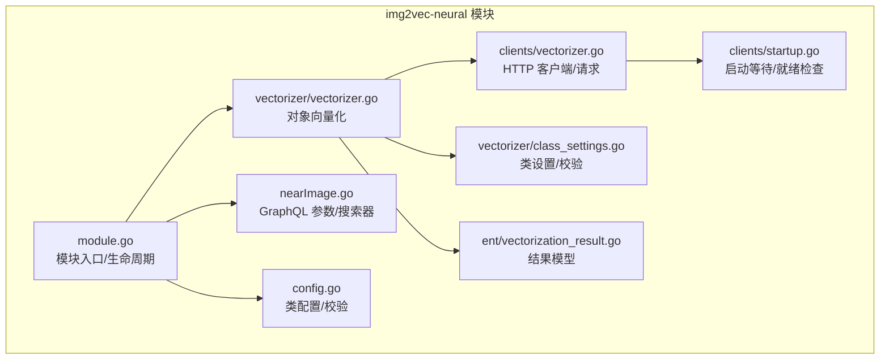
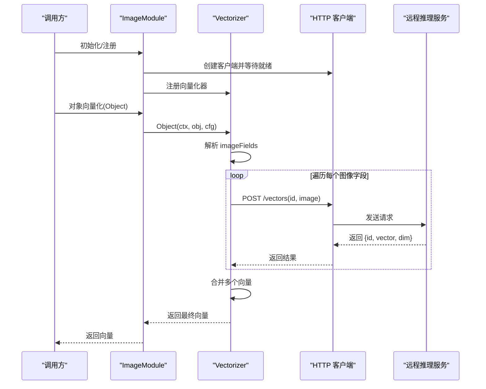
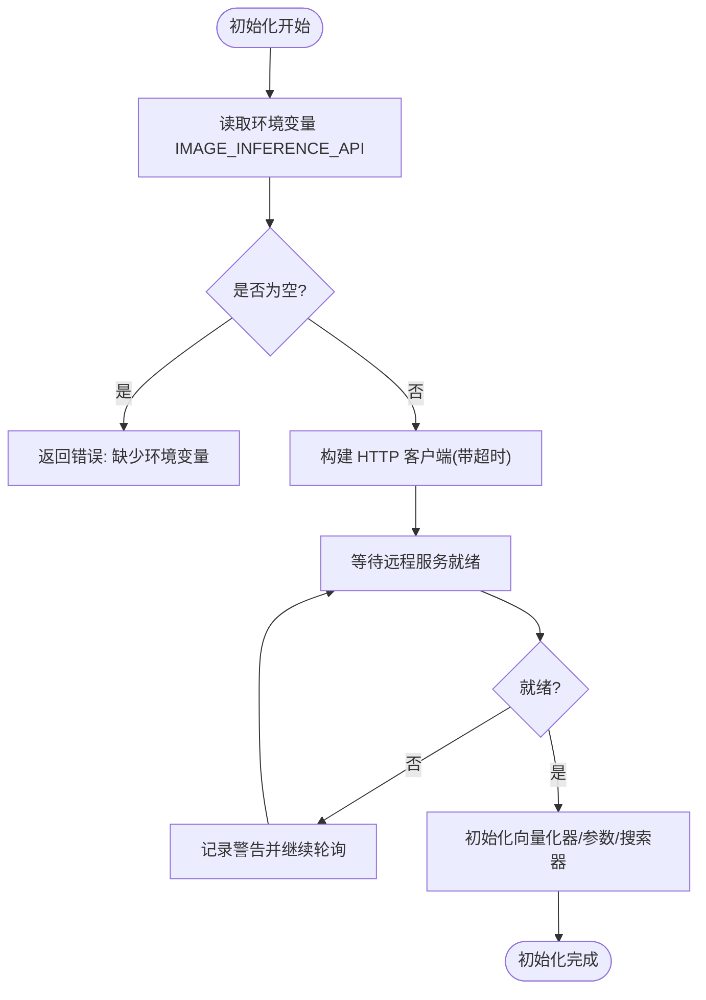
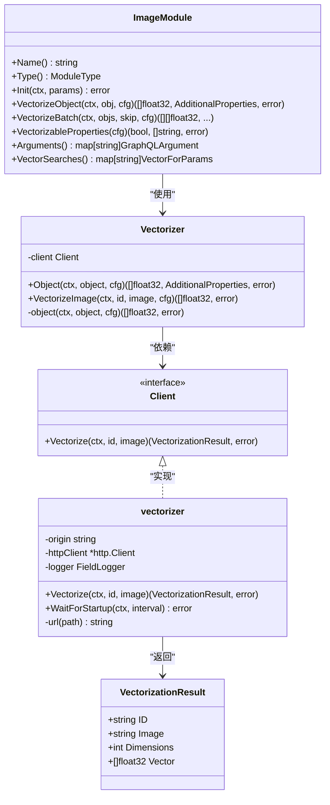
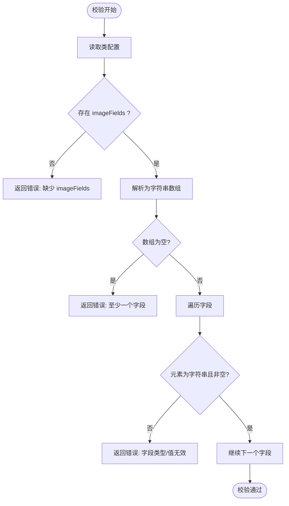
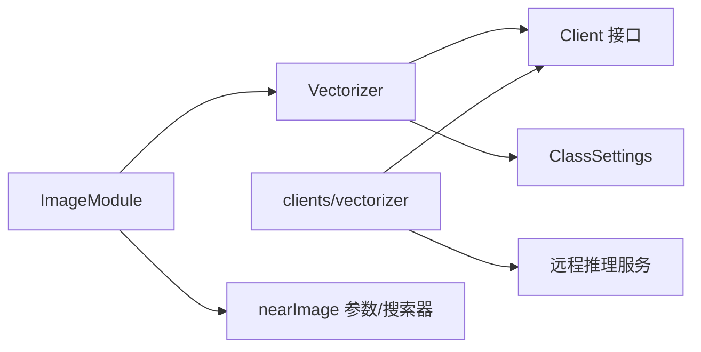

# 图像向量化模块

<cite>
**本文引用的文件**
- [modules/img2vec-neural/module.go](file://modules/img2vec-neural/module.go)
- [modules/img2vec-neural/config.go](file://modules/img2vec-neural/config.go)
- [modules/img2vec-neural/nearImage.go](file://modules/img2vec-neural/nearImage.go)
- [modules/img2vec-neural/vectorizer/vectorizer.go](file://modules/img2vec-neural/vectorizer/vectorizer.go)
- [modules/img2vec-neural/vectorizer/class_settings.go](file://modules/img2vec-neural/vectorizer/class_settings.go)
- [modules/img2vec-neural/clients/vectorizer.go](file://modules/img2vec-neural/clients/vectorizer.go)
- [modules/img2vec-neural/clients/startup.go](file://modules/img2vec-neural/clients/startup.go)
- [modules/img2vec-neural/ent/vectorization_result.go](file://modules/img2vec-neural/ent/vectorization_result.go)
- [modules/img2vec-neural/vectorizer/vectorizer_test.go](file://modules/img2vec-neural/vectorizer/vectorizer_test.go)
- [modules/img2vec-neural/vectorizer/class_settings_test.go](file://modules/img2vec-neural/vectorizer/class_settings_test.go)
</cite>

## 目录
1. [简介](#简介)
2. [项目结构](#项目结构)
3. [核心组件](#核心组件)
4. [架构总览](#架构总览)
5. [详细组件分析](#详细组件分析)
6. [依赖关系分析](#依赖关系分析)
7. [性能考量](#性能考量)
8. [故障排查指南](#故障排查指南)
9. [结论](#结论)
10. [附录](#附录)

## 简介
本技术文档聚焦 Weaviate 的图像向量化模块 img2vec-neural，系统性阐述其工作原理与实现细节。该模块负责将图像属性转换为高维稠密向量，支持多图像字段聚合、远程推理服务集成、GraphQL 近似检索参数以及批量向量化能力。文档覆盖以下主题：
- 向量化流程：从对象属性中识别图像字段、调用远程推理服务、合并多图向量
- 配置项与校验：imageFields 字段列表、类级配置校验
- 输入输出规范：图像数据格式、返回向量维度与结构
- 预处理要点：图像尺寸、颜色空间、归一化等在远程服务侧完成
- 性能优化：批量化、超时控制、重试策略与资源管理
- 使用示例：通过配置与 GraphQL 查询调用近似图像检索

## 项目结构
img2vec-neural 模块采用分层设计：
- 模块入口与生命周期：module.go 负责初始化、注册 GraphQL 参数与向量搜索器
- 类配置与校验：config.go 提供类配置接口与校验逻辑
- 向量化器：vectorizer 包含对象向量化与远程客户端交互
- 客户端：clients 包含 HTTP 客户端、启动等待与请求封装
- 实体模型：ent 定义向量化结果结构
- 近似检索：nearImage 将图像查询参数映射到向量搜索

图表来源
- [modules/img2vec-neural/module.go](file://modules/img2vec-neural/module.go#L1-L116)
- [modules/img2vec-neural/config.go](file://modules/img2vec-neural/config.go#L1-L45)
- [modules/img2vec-neural/nearImage.go](file://modules/img2vec-neural/nearImage.go#L1-L37)
- [modules/img2vec-neural/vectorizer/vectorizer.go](file://modules/img2vec-neural/vectorizer/vectorizer.go#L1-L95)
- [modules/img2vec-neural/vectorizer/class_settings.go](file://modules/img2vec-neural/vectorizer/class_settings.go#L1-L97)
- [modules/img2vec-neural/clients/vectorizer.go](file://modules/img2vec-neural/clients/vectorizer.go#L1-L104)
- [modules/img2vec-neural/clients/startup.go](file://modules/img2vec-neural/clients/startup.go#L1-L69)
- [modules/img2vec-neural/ent/vectorization_result.go](file://modules/img2vec-neural/ent/vectorization_result.go#L1-L20)

章节来源
- [modules/img2vec-neural/module.go](file://modules/img2vec-neural/module.go#L1-L116)
- [modules/img2vec-neural/config.go](file://modules/img2vec-neural/config.go#L1-L45)
- [modules/img2vec-neural/nearImage.go](file://modules/img2vec-neural/nearImage.go#L1-L37)
- [modules/img2vec-neural/vectorizer/vectorizer.go](file://modules/img2vec-neural/vectorizer/vectorizer.go#L1-L95)
- [modules/img2vec-neural/vectorizer/class_settings.go](file://modules/img2vec-neural/vectorizer/class_settings.go#L1-L97)
- [modules/img2vec-neural/clients/vectorizer.go](file://modules/img2vec-neural/clients/vectorizer.go#L1-L104)
- [modules/img2vec-neural/clients/startup.go](file://modules/img2vec-neural/clients/startup.go#L1-L69)
- [modules/img2vec-neural/ent/vectorization_result.go](file://modules/img2vec-neural/ent/vectorization_result.go#L1-L20)

## 核心组件
- 模块入口 ImageModule
  - 职责：初始化远程向量化客户端、注册 GraphQL 近似图像参数、注册向量搜索器、提供对象向量化与批量向量化能力
  - 关键点：通过环境变量 IMAGE_INFERENCE_API 指定远程推理服务地址；初始化阶段会等待服务就绪
- 向量化器 Vectorizer
  - 职责：从对象属性中识别图像字段、调用远程客户端进行向量化、合并多个图像向量
  - 关键点：支持多图像字段；对每个图像生成唯一 ID 并调用远程服务；最终将多个向量按内置策略合并
- 类设置 ClassSettings
  - 职责：解析与校验 imageFields 配置，判断某属性是否为图像字段
  - 关键点：必须为非空字符串数组；至少包含一个字段名
- 客户端 Client
  - 职责：构造 JSON 请求体、发送 POST /vectors、解析响应、处理错误码
  - 关键点：请求体包含 id 与 image；响应包含 id、vector 与 dim；状态码大于 399 视为失败
- 启动等待 WaitForStartup
  - 职责：周期性 GET /.well-known/ready 检查服务就绪；超时或错误时持续重试
- 结果模型 VectorizationResult
  - 职责：统一描述一次向量化操作的输出，包含 id、原始 image、向量维度与向量本身

章节来源
- [modules/img2vec-neural/module.go](file://modules/img2vec-neural/module.go#L32-L116)
- [modules/img2vec-neural/vectorizer/vectorizer.go](file://modules/img2vec-neural/vectorizer/vectorizer.go#L24-L95)
- [modules/img2vec-neural/vectorizer/class_settings.go](file://modules/img2vec-neural/vectorizer/class_settings.go#L20-L97)
- [modules/img2vec-neural/clients/vectorizer.go](file://modules/img2vec-neural/clients/vectorizer.go#L28-L104)
- [modules/img2vec-neural/clients/startup.go](file://modules/img2vec-neural/clients/startup.go#L22-L69)
- [modules/img2vec-neural/ent/vectorization_result.go](file://modules/img2vec-neural/ent/vectorization_result.go#L14-L20)

## 架构总览
下图展示了从对象到向量的完整链路，包括配置校验、图像字段识别、远程调用与向量合并。

图表来源
- [modules/img2vec-neural/module.go](file://modules/img2vec-neural/module.go#L57-L95)
- [modules/img2vec-neural/vectorizer/vectorizer.go](file://modules/img2vec-neural/vectorizer/vectorizer.go#L44-L94)
- [modules/img2vec-neural/clients/vectorizer.go](file://modules/img2vec-neural/clients/vectorizer.go#L44-L87)

## 详细组件分析

### 组件一：模块入口与生命周期
- 初始化流程
  - 读取环境变量 IMAGE_INFERENCE_API，若为空则报错
  - 基于超时与日志构建 HTTP 客户端，并等待远程服务就绪
  - 初始化向量化器与 GraphQL 近似图像参数及向量搜索器
- 能力暴露
  - 提供 VectorizeObject、VectorizeBatch、VectorizableProperties、Arguments、VectorSearches 等接口
- 错误处理
  - 初始化阶段对远程服务不可达与就绪检查失败进行包装与返回

图表来源
- [modules/img2vec-neural/module.go](file://modules/img2vec-neural/module.go#L57-L89)
- [modules/img2vec-neural/clients/startup.go](file://modules/img2vec-neural/clients/startup.go#L22-L69)

章节来源
- [modules/img2vec-neural/module.go](file://modules/img2vec-neural/module.go#L57-L95)
- [modules/img2vec-neural/clients/startup.go](file://modules/img2vec-neural/clients/startup.go#L22-L69)

### 组件二：向量化器与远程客户端
- 对象向量化 Object
  - 依据 ClassSettings 列表筛选图像字段
  - 逐个调用 VectorizeImage，得到多个向量后进行合并
- 远程客户端 Vectorize
  - 请求路径：POST /vectors
  - 请求体：包含 id 与 image
  - 响应体：包含 id、vector 与 dim；状态码大于 399 视为失败
- 结果模型
  - 统一返回 VectorizationResult，包含 id、image、dimensions、vector

图表来源
- [modules/img2vec-neural/module.go](file://modules/img2vec-neural/module.go#L32-L116)
- [modules/img2vec-neural/vectorizer/vectorizer.go](file://modules/img2vec-neural/vectorizer/vectorizer.go#L24-L95)
- [modules/img2vec-neural/clients/vectorizer.go](file://modules/img2vec-neural/clients/vectorizer.go#L28-L104)
- [modules/img2vec-neural/ent/vectorization_result.go](file://modules/img2vec-neural/ent/vectorization_result.go#L14-L20)

章节来源
- [modules/img2vec-neural/vectorizer/vectorizer.go](file://modules/img2vec-neural/vectorizer/vectorizer.go#L44-L94)
- [modules/img2vec-neural/clients/vectorizer.go](file://modules/img2vec-neural/clients/vectorizer.go#L44-L87)
- [modules/img2vec-neural/ent/vectorization_result.go](file://modules/img2vec-neural/ent/vectorization_result.go#L14-L20)

### 组件三：类配置与校验
- 属性解析
  - 从类配置中读取 imageFields，必须为非空字符串数组
- 校验规则
  - imageFields 不存在或类型不正确则失败
  - 数组长度为 0 或元素为空字符串则失败
  - 元素类型非字符串则失败
- 图像字段判定
  - 通过 ImageField(property) 判断某属性是否属于图像字段

图表来源
- [modules/img2vec-neural/vectorizer/class_settings.go](file://modules/img2vec-neural/vectorizer/class_settings.go#L65-L96)

章节来源
- [modules/img2vec-neural/vectorizer/class_settings.go](file://modules/img2vec-neural/vectorizer/class_settings.go#L28-L96)
- [modules/img2vec-neural/config.go](file://modules/img2vec-neural/config.go#L34-L39)

### 组件四：近似图像检索参数与搜索器
- GraphQL 参数
  - 通过 nearImage.New() 提供 GraphQL 参数定义
- 向量搜索
  - 通过 nearImage.NewSearcher(m.vectorizer) 注册向量搜索器
  - 支持基于图像的相似度检索

章节来源
- [modules/img2vec-neural/nearImage.go](file://modules/img2vec-neural/nearImage.go#L19-L31)

### 组件五：配置项、输入格式与输出特性
- 配置项
  - imageFields：必需，字符串数组，指定包含图像数据的属性名列表
- 输入格式
  - 图像字段需为字符串类型，内容由远程推理服务解析
- 输出向量
  - 返回一维浮点数组，维度由远程服务在响应中声明
- 多图向量合并
  - 当对象包含多个图像字段时，模块会分别向量化并合并，具体合并策略由内部实现提供

章节来源
- [modules/img2vec-neural/vectorizer/class_settings.go](file://modules/img2vec-neural/vectorizer/class_settings.go#L34-L48)
- [modules/img2vec-neural/vectorizer/vectorizer.go](file://modules/img2vec-neural/vectorizer/vectorizer.go#L83-L94)
- [modules/img2vec-neural/clients/vectorizer.go](file://modules/img2vec-neural/clients/vectorizer.go#L98-L103)

### 组件六：预处理与远程推理
- 远程推理服务职责
  - 图像尺寸调整、颜色空间转换、归一化等预处理在远程服务侧完成
  - 模块仅负责将图像数据与标识符传递给远程服务
- 本地职责
  - 仅负责拼装请求体、发送请求、解析响应与错误处理

章节来源
- [modules/img2vec-neural/clients/vectorizer.go](file://modules/img2vec-neural/clients/vectorizer.go#L44-L87)

### 组件七：使用示例（路径指引）
- 配置类 schema 时设置 imageFields
  - 参考路径：[modules/img2vec-neural/vectorizer/class_settings.go](file://modules/img2vec-neural/vectorizer/class_settings.go#L34-L48)
- 在对象属性中提供图像字段（字符串）
  - 参考路径：[modules/img2vec-neural/vectorizer/vectorizer_test.go](file://modules/img2vec-neural/vectorizer/vectorizer_test.go#L34-L40)
- 调用对象向量化
  - 参考路径：[modules/img2vec-neural/module.go](file://modules/img2vec-neural/module.go#L91-L95)
- 批量向量化
  - 参考路径：[modules/img2vec-neural/module.go](file://modules/img2vec-neural/module.go#L103-L105)
- GraphQL 近似图像检索参数
  - 参考路径：[modules/img2vec-neural/nearImage.go](file://modules/img2vec-neural/nearImage.go#L25-L31)

章节来源
- [modules/img2vec-neural/vectorizer/vectorizer_test.go](file://modules/img2vec-neural/vectorizer/vectorizer_test.go#L27-L71)
- [modules/img2vec-neural/module.go](file://modules/img2vec-neural/module.go#L91-L105)
- [modules/img2vec-neural/nearImage.go](file://modules/img2vec-neural/nearImage.go#L25-L31)

## 依赖关系分析
- 模块耦合
  - ImageModule 依赖 Vectorizer 与 nearImage 组件
  - Vectorizer 依赖 Client 接口与 ClassSettings
  - Client 实现由 clients/vectorizer 提供
- 外部依赖
  - 远程推理服务：通过 HTTP 协议访问 /vectors 与 /.well-known/ready
  - 日志与超时：通过传入的 logger 与 http.Client.Timeout 控制
- 循环依赖
  - 未发现循环依赖；各层职责清晰，接口边界明确

图表来源
- [modules/img2vec-neural/module.go](file://modules/img2vec-neural/module.go#L32-L116)
- [modules/img2vec-neural/vectorizer/vectorizer.go](file://modules/img2vec-neural/vectorizer/vectorizer.go#L24-L37)
- [modules/img2vec-neural/clients/vectorizer.go](file://modules/img2vec-neural/clients/vectorizer.go#L28-L42)

章节来源
- [modules/img2vec-neural/module.go](file://modules/img2vec-neural/module.go#L32-L116)
- [modules/img2vec-neural/vectorizer/vectorizer.go](file://modules/img2vec-neural/vectorizer/vectorizer.go#L24-L37)
- [modules/img2vec-neural/clients/vectorizer.go](file://modules/img2vec-neural/clients/vectorizer.go#L28-L42)

## 性能考量
- 批量向量化
  - 使用批量工具函数进行并发向量化，减少网络往返与服务压力
  - 参考路径：[modules/img2vec-neural/module.go](file://modules/img2vec-neural/module.go#L103-L105)
- 超时与重试
  - 客户端与启动等待均支持超时控制，避免阻塞初始化
  - 参考路径：[modules/img2vec-neural/clients/vectorizer.go](file://modules/img2vec-neural/clients/vectorizer.go#L34-L42)，[modules/img2vec-neural/clients/startup.go](file://modules/img2vec-neural/clients/startup.go#L22-L43)
- 多图向量合并
  - 多图像字段时，向量化次数增加；建议合理规划 imageFields 数量，避免过度拆分
- 远程服务负载
  - 将预处理与模型推理放在远程服务侧，降低本地 CPU 占用；注意服务可用性与延迟

章节来源
- [modules/img2vec-neural/module.go](file://modules/img2vec-neural/module.go#L103-L105)
- [modules/img2vec-neural/clients/vectorizer.go](file://modules/img2vec-neural/clients/vectorizer.go#L34-L42)
- [modules/img2vec-neural/clients/startup.go](file://modules/img2vec-neural/clients/startup.go#L22-L43)

## 故障排查指南
- 环境变量缺失
  - 现象：初始化时报错提示缺少 IMAGE_INFERENCE_API
  - 处理：设置环境变量并确保服务可达
  - 参考路径：[modules/img2vec-neural/module.go](file://modules/img2vec-neural/module.go#L76-L79)
- 远程服务不可达或未就绪
  - 现象：启动等待失败或请求返回高状态码
  - 处理：检查服务健康检查端点 /.well-known/ready；确认网络连通与超时设置
  - 参考路径：[modules/img2vec-neural/clients/startup.go](file://modules/img2vec-neural/clients/startup.go#L45-L68)，[modules/img2vec-neural/clients/vectorizer.go](file://modules/img2vec-neural/clients/vectorizer.go#L77-L86)
- 配置错误
  - 现象：校验失败，提示 imageFields 缺失、类型不符或为空
  - 处理：确保 imageFields 为非空字符串数组
  - 参考路径：[modules/img2vec-neural/vectorizer/class_settings.go](file://modules/img2vec-neural/vectorizer/class_settings.go#L65-L96)
- 图像字段类型不匹配
  - 现象：向量化失败或未识别图像字段
  - 处理：确保图像字段为字符串类型
  - 参考路径：[modules/img2vec-neural/vectorizer/vectorizer.go](file://modules/img2vec-neural/vectorizer/vectorizer.go#L73-L79)

章节来源
- [modules/img2vec-neural/module.go](file://modules/img2vec-neural/module.go#L76-L79)
- [modules/img2vec-neural/clients/startup.go](file://modules/img2vec-neural/clients/startup.go#L45-L68)
- [modules/img2vec-neural/clients/vectorizer.go](file://modules/img2vec-neural/clients/vectorizer.go#L77-L86)
- [modules/img2vec-neural/vectorizer/class_settings.go](file://modules/img2vec-neural/vectorizer/class_settings.go#L65-L96)
- [modules/img2vec-neural/vectorizer/vectorizer.go](file://modules/img2vec-neural/vectorizer/vectorizer.go#L73-L79)

## 结论
img2vec-neural 模块通过清晰的分层设计与严格的配置校验，实现了从对象属性到高维向量的可靠转换。其关键优势在于：
- 将图像预处理与模型推理下沉至远程服务，简化本地实现
- 提供多图像字段聚合与批量向量化能力，满足复杂场景需求
- 通过 GraphQL 近似图像检索参数，无缝融入 Weaviate 的检索体系
在实际部署中，建议重点关注远程服务的稳定性与延迟、合理规划 imageFields 数量，并结合批量工具提升吞吐。

## 附录
- 测试参考
  - 向量化器单元测试：验证单图与多图字段向量化
    - 参考路径：[modules/img2vec-neural/vectorizer/vectorizer_test.go](file://modules/img2vec-neural/vectorizer/vectorizer_test.go#L27-L71)
  - 类设置校验测试：覆盖多种非法配置场景
    - 参考路径：[modules/img2vec-neural/vectorizer/class_settings_test.go](file://modules/img2vec-neural/vectorizer/class_settings_test.go#L22-L95)