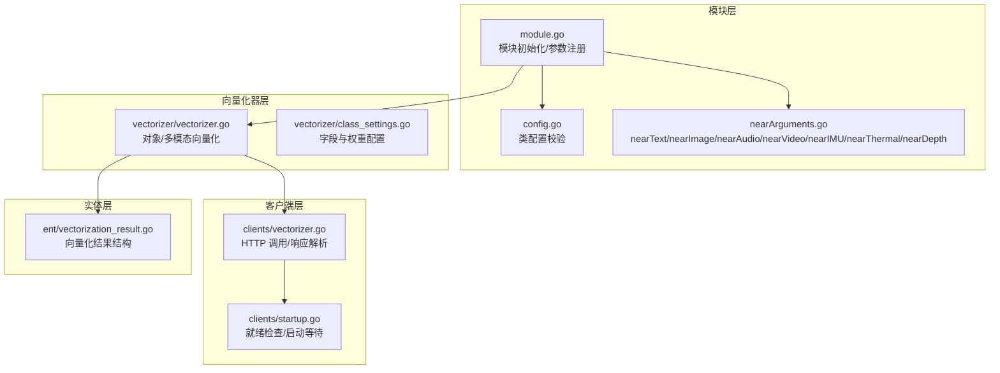
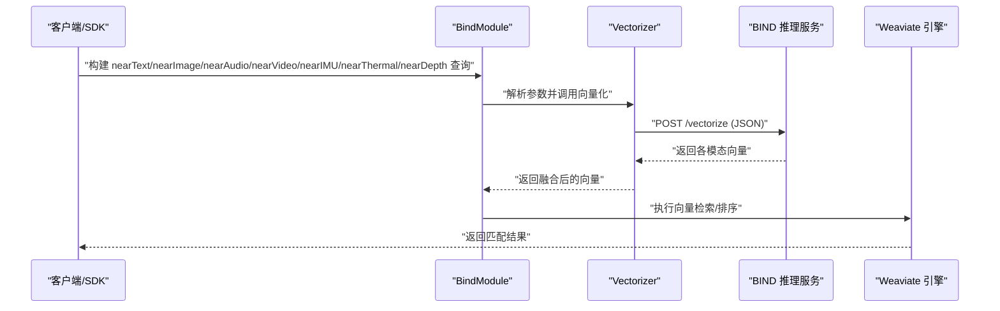
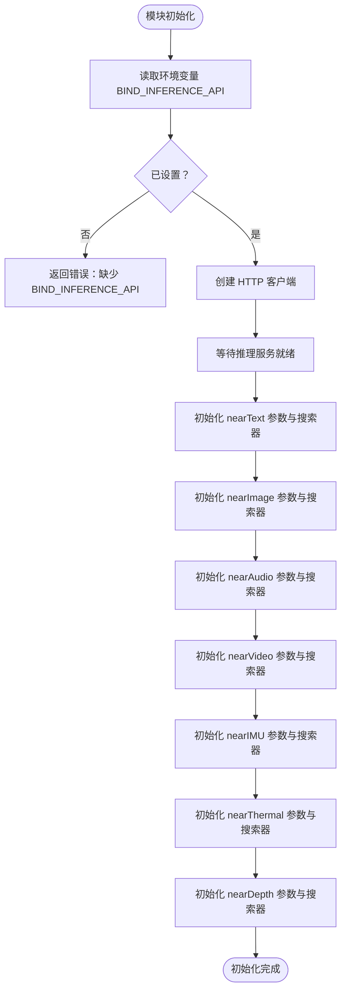
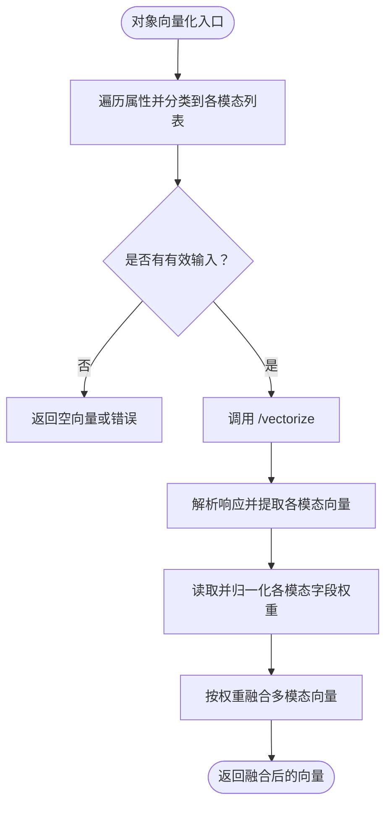
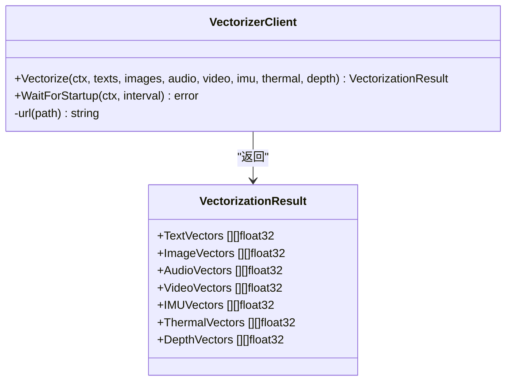
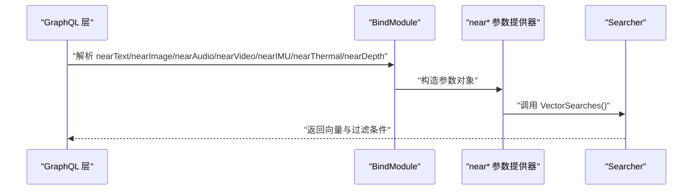
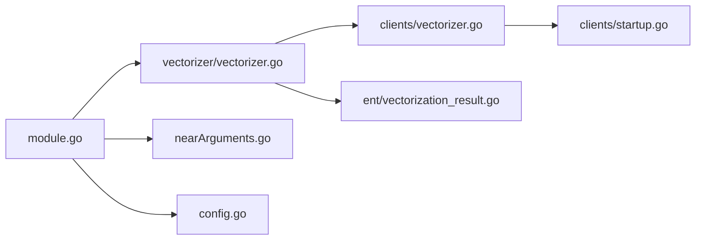

# BIND 多模态向量化

<cite>
**本文引用的文件**   
- [modules/multi2vec-bind/module.go](file://modules/multi2vec-bind/module.go)
- [modules/multi2vec-bind/config.go](file://modules/multi2vec-bind/config.go)
- [modules/multi2vec-bind/nearArguments.go](file://modules/multi2vec-bind/nearArguments.go)
- [modules/multi2vec-bind/vectorizer/vectorizer.go](file://modules/multi2vec-bind/vectorizer/vectorizer.go)
- [modules/multi2vec-bind/vectorizer/class_settings.go](file://modules/multi2vec-bind/vectorizer/class_settings.go)
- [modules/multi2vec-bind/clients/vectorizer.go](file://modules/multi2vec-bind/clients/vectorizer.go)
- [modules/multi2vec-bind/clients/startup.go](file://modules/multi2vec-bind/clients/startup.go)
- [modules/multi2vec-bind/ent/vectorization_result.go](file://modules/multi2vec-bind/ent/vectorization_result.go)
- [test/modules/multi2vec-bind/bind_test.go](file://test/modules/multi2vec-bind/bind_test.go)
- [test/docker/bind.go](file://test/docker/bind.go)
- [adapters/handlers/grpc/v1/parse_search_request.go](file://adapters/handlers/grpc/v1/parse_search_request.go)
- [grpc/generated/protocol/v1/search_get.pb.go](file://grpc/generated/protocol/v1/search_get.pb.go)
</cite>

## 目录
1. [简介](#简介)
2. [项目结构](#项目结构)
3. [核心组件](#核心组件)
4. [架构总览](#架构总览)
5. [组件详解](#组件详解)
6. [依赖关系分析](#依赖关系分析)
7. [性能考量](#性能考量)
8. [故障排查指南](#故障排查指南)
9. [结论](#结论)
10. [附录](#附录)

## 简介
本文件面向生物医学信息学研究者与医疗 AI 应用开发者，系统性阐述 Weaviate 中 BIND（Biomedical Image and Natural Language Description）多模态向量化模块的设计与实现。BIND 模块支持将医学图像、文本、音频、视频、IMU、热成像与深度图等多种模态统一映射到同一向量空间，从而在生物医学检索与分析任务中实现跨模态语义对齐。文档覆盖：
- 模型如何实现联合向量化表示
- 生物医学领域的特殊需求与挑战
- 配置与部署要点（含 nearText 与 nearImage 参数）
- 启动校验、环境配置与错误处理机制
- 在医疗影像检索、报告分析等场景的实践建议
- 性能优化策略与最佳实践

## 项目结构
BIND 模块位于 multi2vec-bind 目录，采用“模块层 + 向量化器 + 客户端 + 实体”的分层组织方式：
- 模块层：对外暴露模块能力，初始化远程推理服务，注册 nearText/nearImage/nearAudio/nearVideo/nearIMU/nearThermal/nearDepth 参数解析与搜索器
- 向量化器层：负责从对象属性中提取多模态字段，调用远程推理服务并聚合权重
- 客户端层：封装 HTTP 请求，等待推理服务就绪，解析响应
- 实体层：定义向量化结果的数据结构
- 配置与测试：类配置校验、近似查询参数注册、端到端测试与容器化集成

**图表来源**
- [modules/multi2vec-bind/module.go](file://modules/multi2vec-bind/module.go#L36-L118)
- [modules/multi2vec-bind/config.go](file://modules/multi2vec-bind/config.go#L24-L39)
- [modules/multi2vec-bind/nearArguments.go](file://modules/multi2vec-bind/nearArguments.go#L25-L91)
- [modules/multi2vec-bind/vectorizer/vectorizer.go](file://modules/multi2vec-bind/vectorizer/vectorizer.go#L25-L185)
- [modules/multi2vec-bind/vectorizer/class_settings.go](file://modules/multi2vec-bind/vectorizer/class_settings.go#L29-L104)
- [modules/multi2vec-bind/clients/vectorizer.go](file://modules/multi2vec-bind/clients/vectorizer.go#L28-L99)
- [modules/multi2vec-bind/clients/startup.go](file://modules/multi2vec-bind/clients/startup.go#L22-L68)
- [modules/multi2vec-bind/ent/vectorization_result.go](file://modules/multi2vec-bind/ent/vectorization_result.go#L14-L22)

**章节来源**
- [modules/multi2vec-bind/module.go](file://modules/multi2vec-bind/module.go#L36-L118)
- [modules/multi2vec-bind/nearArguments.go](file://modules/multi2vec-bind/nearArguments.go#L25-L91)

## 核心组件
- 模块入口与生命周期
  - 名称与类型声明、初始化远程向量化器、注册 nearText/nearImage/nearAudio/nearVideo/nearIMU/nearThermal/nearDepth 参数与搜索器
  - 启动阶段通过环境变量绑定推理服务地址，并进行就绪检查
- 向量化器
  - 支持对象级多模态字段抽取与向量化；按字段权重归一化后加权融合
  - 提供独立的文本/图像/音频/视频/IMU/热成像/深度向量化接口
- 客户端
  - 统一 JSON 请求体，调用 /vectorize 接口；解析响应并返回各模态向量
  - 提供就绪检查接口，轮询 /.well-known/ready
- 类配置
  - 基于通用多模态设置，校验字段与权重配置，确保类定义合法

**章节来源**
- [modules/multi2vec-bind/module.go](file://modules/multi2vec-bind/module.go#L77-L118)
- [modules/multi2vec-bind/vectorizer/vectorizer.go](file://modules/multi2vec-bind/vectorizer/vectorizer.go#L59-L185)
- [modules/multi2vec-bind/clients/vectorizer.go](file://modules/multi2vec-bind/clients/vectorizer.go#L44-L99)
- [modules/multi2vec-bind/clients/startup.go](file://modules/multi2vec-bind/clients/startup.go#L22-L68)
- [modules/multi2vec-bind/vectorizer/class_settings.go](file://modules/multi2vec-bind/vectorizer/class_settings.go#L34-L104)

## 架构总览
BIND 模块通过 Weaviate 的模块扩展机制接入，对外提供 GraphQL 查询参数 nearText 与多种 nearX 参数，内部委托向量化器调用远程推理服务，最终在 Weaviate 内部完成向量检索与排序。

**图表来源**
- [modules/multi2vec-bind/module.go](file://modules/multi2vec-bind/module.go#L160-L184)
- [modules/multi2vec-bind/vectorizer/vectorizer.go](file://modules/multi2vec-bind/vectorizer/vectorizer.go#L59-L185)
- [modules/multi2vec-bind/clients/vectorizer.go](file://modules/multi2vec-bind/clients/vectorizer.go#L44-L99)

## 组件详解

### 模块初始化与参数注册
- 初始化流程
  - 读取环境变量 BIND_INFERENCE_API，若未设置则报错
  - 创建 HTTP 客户端并等待推理服务就绪
  - 初始化 nearText 与七种 nearX 搜索器与 GraphQL 参数提供器
- 参数注册
  - nearText：依赖其他模块提供的文本变换器（如 text2vec-*），用于将查询概念转换为向量
  - nearImage/audio/video/imu/thermal/depth：直接使用绑定向量化器进行向量化

**图表来源**
- [modules/multi2vec-bind/module.go](file://modules/multi2vec-bind/module.go#L85-L118)
- [modules/multi2vec-bind/clients/startup.go](file://modules/multi2vec-bind/clients/startup.go#L22-L68)

**章节来源**
- [modules/multi2vec-bind/module.go](file://modules/multi2vec-bind/module.go#L85-L137)
- [modules/multi2vec-bind/nearArguments.go](file://modules/multi2vec-bind/nearArguments.go#L25-L91)

### 对象级多模态向量化
- 字段识别
  - 遍历对象属性，根据类配置判断是否为文本/图像/音频/视频/IMU/热成像/深度字段
- 调用远程服务
  - 将各模态文本/媒体列表打包为 JSON 请求体，调用 /vectorize
- 权重融合
  - 从类配置读取各模态字段权重，归一化后与对应向量拼接并加权融合

**图表来源**
- [modules/multi2vec-bind/vectorizer/vectorizer.go](file://modules/multi2vec-bind/vectorizer/vectorizer.go#L120-L185)
- [modules/multi2vec-bind/vectorizer/class_settings.go](file://modules/multi2vec-bind/vectorizer/class_settings.go#L34-L104)

**章节来源**
- [modules/multi2vec-bind/vectorizer/vectorizer.go](file://modules/multi2vec-bind/vectorizer/vectorizer.go#L59-L185)
- [modules/multi2vec-bind/vectorizer/class_settings.go](file://modules/multi2vec-bind/vectorizer/class_settings.go#L34-L104)

### 远程推理服务交互
- 请求体
  - 包含 texts/images/audio/video/imu/thermal/depth 数组
- 响应体
  - 返回各模态向量数组与可选错误信息
- 错误处理
  - HTTP 非 200 状态时，优先解析错误字符串，否则返回状态码错误

**图表来源**
- [modules/multi2vec-bind/clients/vectorizer.go](file://modules/multi2vec-bind/clients/vectorizer.go#L44-L99)
- [modules/multi2vec-bind/ent/vectorization_result.go](file://modules/multi2vec-bind/ent/vectorization_result.go#L14-L22)

**章节来源**
- [modules/multi2vec-bind/clients/vectorizer.go](file://modules/multi2vec-bind/clients/vectorizer.go#L44-L99)
- [modules/multi2vec-bind/ent/vectorization_result.go](file://modules/multi2vec-bind/ent/vectorization_result.go#L14-L22)

### GraphQL 与 gRPC 参数解析
- nearText
  - 依赖外部文本变换器，支持 concepts/certainty/distance 等参数
- nearImage/audio/video/imu/thermal/depth
  - 支持 distance/certainty 互斥校验，二者同时提供将触发错误
- gRPC 协议
  - SearchRequest 中包含 NearImage/NearAudio/NearVideo/NearIMU/NearThermal/NearDepth 字段

**图表来源**
- [modules/multi2vec-bind/nearArguments.go](file://modules/multi2vec-bind/nearArguments.go#L67-L117)
- [adapters/handlers/grpc/v1/parse_search_request.go](file://adapters/handlers/grpc/v1/parse_search_request.go#L942-L990)
- [grpc/generated/protocol/v1/search_get.pb.go](file://grpc/generated/protocol/v1/search_get.pb.go#L212-L252)

**章节来源**
- [modules/multi2vec-bind/nearArguments.go](file://modules/multi2vec-bind/nearArguments.go#L67-L117)
- [adapters/handlers/grpc/v1/parse_search_request.go](file://adapters/handlers/grpc/v1/parse_search_request.go#L942-L990)
- [grpc/generated/protocol/v1/search_get.pb.go](file://grpc/generated/protocol/v1/search_get.pb.go#L212-L252)

## 依赖关系分析
- 模块层依赖向量化器层与客户端层
- 向量化器层依赖通用多模态设置与权重归一化工具
- 客户端层依赖 HTTP 客户端与日志库
- GraphQL/gRPC 层依赖参数解析器与 Weaviate 引擎

**图表来源**
- [modules/multi2vec-bind/module.go](file://modules/multi2vec-bind/module.go#L36-L56)
- [modules/multi2vec-bind/vectorizer/vectorizer.go](file://modules/multi2vec-bind/vectorizer/vectorizer.go#L25-L33)
- [modules/multi2vec-bind/clients/vectorizer.go](file://modules/multi2vec-bind/clients/vectorizer.go#L28-L42)

**章节来源**
- [modules/multi2vec-bind/module.go](file://modules/multi2vec-bind/module.go#L36-L56)
- [modules/multi2vec-bind/vectorizer/vectorizer.go](file://modules/multi2vec-bind/vectorizer/vectorizer.go#L25-L33)
- [modules/multi2vec-bind/clients/vectorizer.go](file://modules/multi2vec-bind/clients/vectorizer.go#L28-L42)

## 性能考量
- 远程调用开销
  - /vectorize 为一次性请求，建议批量合并输入以减少往返次数
- 权重融合
  - 归一化权重避免某模态主导，但需注意字段数量与权重设置对向量维度的影响
- 并发与批处理
  - 使用批量向量化接口可提升吞吐；合理设置 HTTP 超时与重试策略
- 检索参数
  - nearText 与 nearImage 可组合使用，但需平衡距离阈值与召回率

[本节为通用性能建议，不直接分析具体文件]

## 故障排查指南
- 环境变量缺失
  - 症状：初始化时报错提示未设置 BIND_INFERENCE_API
  - 处理：在启动环境中设置 BIND_INFERENCE_API 指向推理服务地址
- 推理服务未就绪
  - 症状：启动等待超时或就绪检查失败
  - 处理：确认推理服务镜像版本、网络连通性与 /.well-known/ready 端点返回码
- 远程调用失败
  - 症状：HTTP 非 200 或响应体解析失败
  - 处理：检查推理服务日志、请求体格式与输入模态合法性
- nearText 与 nearImage 参数冲突
  - 症状：同时提供 distance 与 certainty 报错
  - 处理：仅提供其中之一；或在 SDK 层正确构造参数

**章节来源**
- [modules/multi2vec-bind/module.go](file://modules/multi2vec-bind/module.go#L143-L146)
- [modules/multi2vec-bind/clients/startup.go](file://modules/multi2vec-bind/clients/startup.go#L22-L68)
- [modules/multi2vec-bind/clients/vectorizer.go](file://modules/multi2vec-bind/clients/vectorizer.go#L82-L88)
- [adapters/handlers/grpc/v1/parse_search_request.go](file://adapters/handlers/grpc/v1/parse_search_request.go#L945-L956)

## 结论
BIND 多模态向量化模块通过清晰的分层设计与参数注册机制，将多模态输入统一映射至向量空间，满足生物医学领域对跨模态检索与分析的需求。结合合理的权重配置、批量处理与参数选择，可在医疗影像检索、报告分析等场景中取得稳定且高效的性能表现。

[本节为总结性内容，不直接分析具体文件]

## 附录

### 配置与部署要点
- 环境变量
  - BIND_INFERENCE_API：推理服务地址（例如 http://multi2vec-bind:8080）
- 类配置
  - 通过类配置声明各模态字段与权重，确保字段存在且权重合法
- 近似查询参数
  - nearText：concepts、certainty/distance
  - nearImage/audio/video/imu/thermal/depth：各自媒体内容与 certainty/distance

**章节来源**
- [modules/multi2vec-bind/module.go](file://modules/multi2vec-bind/module.go#L143-L146)
- [modules/multi2vec-bind/config.go](file://modules/multi2vec-bind/config.go#L24-L39)
- [modules/multi2vec-bind/nearArguments.go](file://modules/multi2vec-bind/nearArguments.go#L67-L91)

### 使用示例（基于测试与容器）
- 端到端测试
  - 示例测试展示了 nearText 查询与断言距离非负
- 容器化集成
  - 通过测试容器启动 multi2vec-bind 镜像，自动注入 BIND_INFERENCE_API 环境变量并等待就绪

**章节来源**
- [test/modules/multi2vec-bind/bind_test.go](file://test/modules/multi2vec-bind/bind_test.go#L27-L84)
- [test/docker/bind.go](file://test/docker/bind.go#L26-L66)