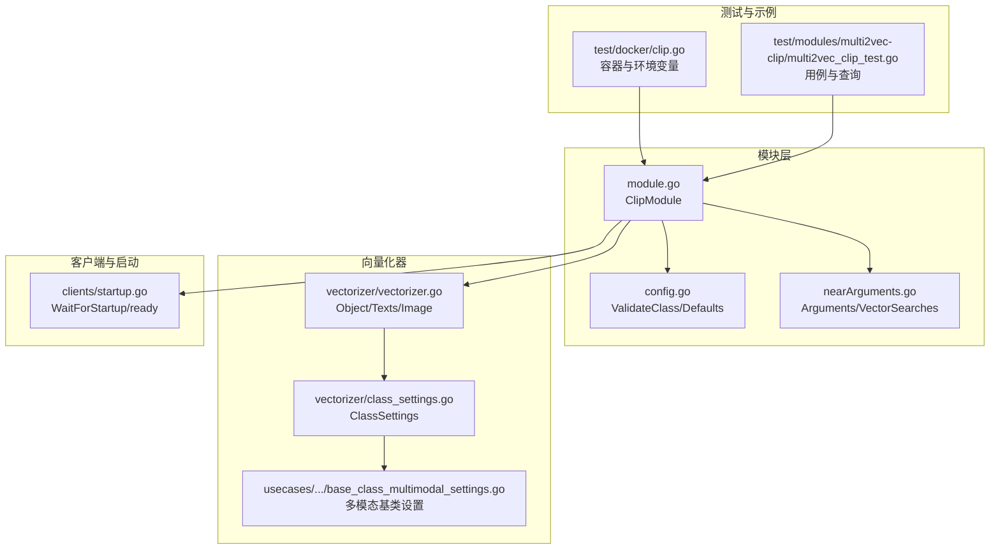
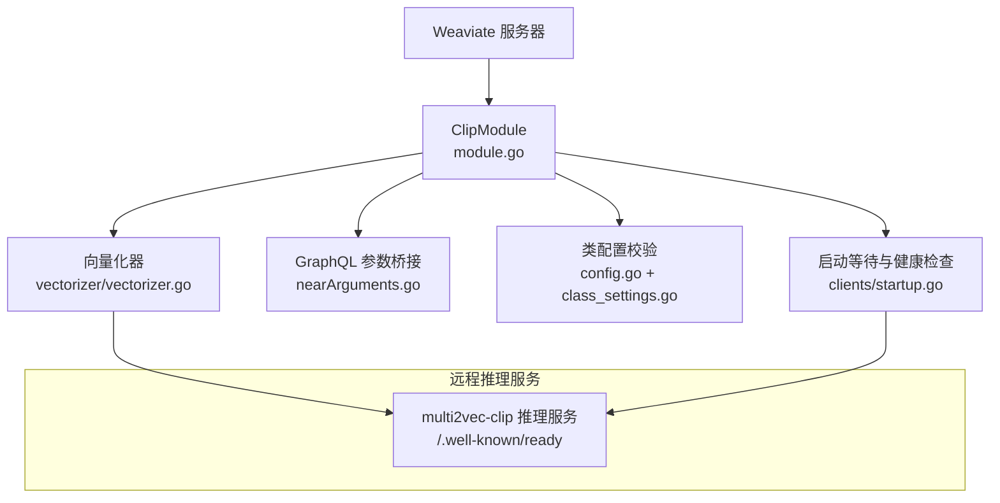
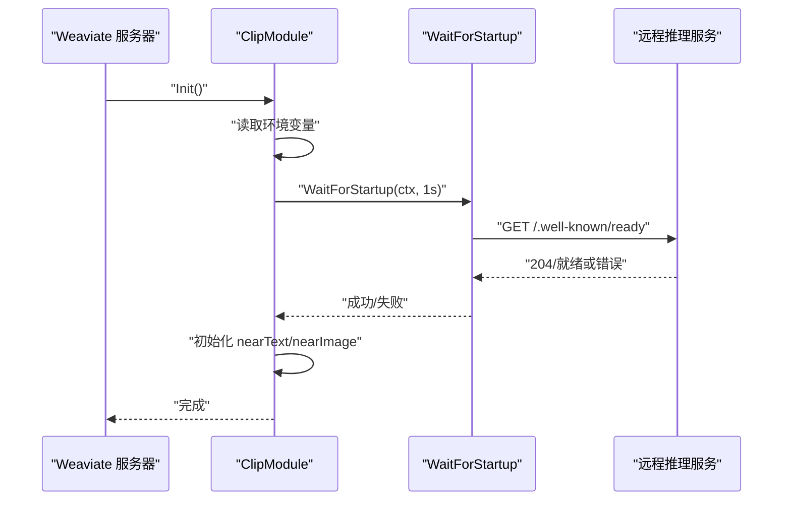
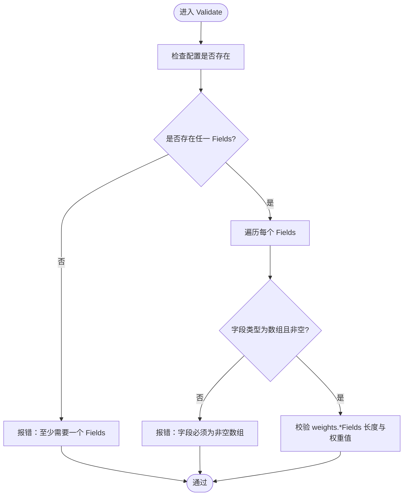
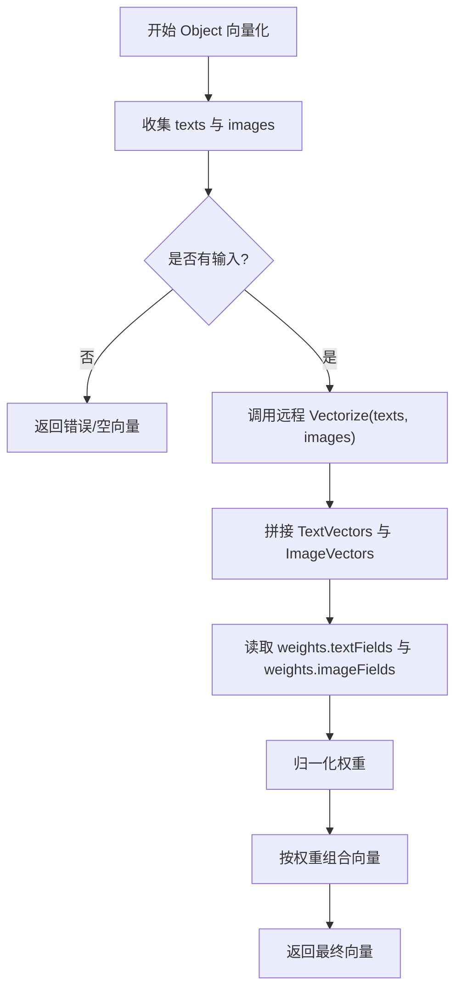
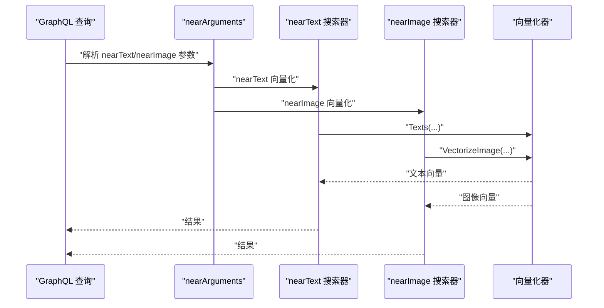
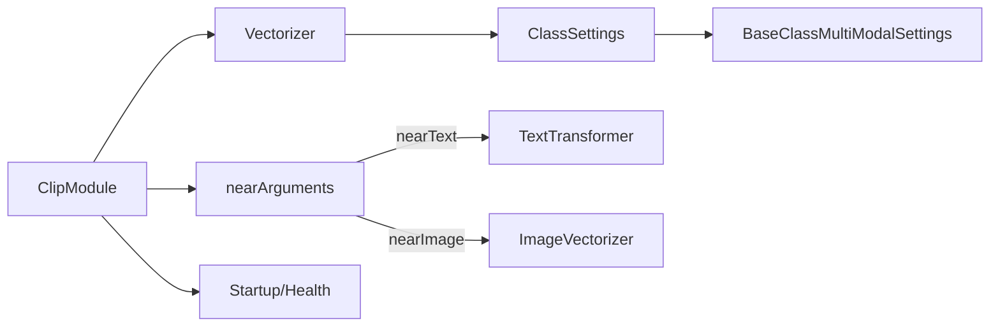

# CLIP 多模态向量化

<cite>
**本文引用的文件**
- [modules/multi2vec-clip/module.go](file://modules/multi2vec-clip/module.go)
- [modules/multi2vec-clip/config.go](file://modules/multi2vec-clip/config.go)
- [modules/multi2vec-clip/nearArguments.go](file://modules/multi2vec-clip/nearArguments.go)
- [modules/multi2vec-clip/vectorizer/vectorizer.go](file://modules/multi2vec-clip/vectorizer/vectorizer.go)
- [modules/multi2vec-clip/vectorizer/class_settings.go](file://modules/multi2vec-clip/vectorizer/class_settings.go)
- [modules/multi2vec-clip/clients/startup.go](file://modules/multi2vec-clip/clients/startup.go)
- [usecases/modulecomponents/settings/base_class_multimodal_settings.go](file://usecases/modulecomponents/settings/base_class_multimodal_settings.go)
- [test/docker/clip.go](file://test/docker/clip.go)
- [test/modules/multi2vec-clip/multi2vec_clip_test.go](file://test/modules/multi2vec-clip/multi2vec_clip_test.go)
</cite>

## 目录
1. [简介](#简介)
2. [项目结构](#项目结构)
3. [核心组件](#核心组件)
4. [架构总览](#架构总览)
5. [详细组件分析](#详细组件分析)
6. [依赖关系分析](#依赖关系分析)
7. [性能考量](#性能考量)
8. [故障排查指南](#故障排查指南)
9. [结论](#结论)
10. [附录](#附录)

## 简介
本文件面向需要在 Weaviate 中实现跨模态检索与图像-文本联合嵌入的应用开发者，系统性阐述 CLIP 多模态向量化模块的设计与实现。内容覆盖：
- CLIP 在多模态向量化中的应用原理：通过统一的跨模态嵌入空间，将文本与图像映射到同一语义空间，支持 nearText 与 nearImage 查询。
- Weaviate 中的实现细节：模块初始化、远程推理服务对接、类配置校验、向量组合策略、GraphQL 参数扩展与查询执行。
- 配置与运行：环境变量（如 CLIP_INFERENCE_API、CLIP_WAIT_FOR_STARTUP）、启动等待机制与超时控制。
- 使用示例：nearText 与 nearImage 查询参数、目标向量选择、权重组合策略。

## 项目结构
围绕 CLIP 多模态向量化的关键目录与文件如下：
- 模块入口与能力注册：module.go
- 类配置与校验：config.go、vectorizer/class_settings.go、usecases/modulecomponents/settings/base_class_multimodal_settings.go
- GraphQL 参数与近邻搜索桥接：nearArguments.go
- 向量化器：vectorizer/vectorizer.go
- 启动等待与健康检查：clients/startup.go
- 测试与示例：test/docker/clip.go、test/modules/multi2vec-clip/multi2vec_clip_test.go

图表来源
- [modules/multi2vec-clip/module.go](file://modules/multi2vec-clip/module.go#L37-L164)
- [modules/multi2vec-clip/config.go](file://modules/multi2vec-clip/config.go#L24-L42)
- [modules/multi2vec-clip/nearArguments.go](file://modules/multi2vec-clip/nearArguments.go#L20-L58)
- [modules/multi2vec-clip/vectorizer/vectorizer.go](file://modules/multi2vec-clip/vectorizer/vectorizer.go#L26-L135)
- [modules/multi2vec-clip/vectorizer/class_settings.go](file://modules/multi2vec-clip/vectorizer/class_settings.go#L19-L61)
- [usecases/modulecomponents/settings/base_class_multimodal_settings.go](file://usecases/modulecomponents/settings/base_class_multimodal_settings.go#L33-L280)
- [modules/multi2vec-clip/clients/startup.go](file://modules/multi2vec-clip/clients/startup.go#L22-L69)
- [test/docker/clip.go](file://test/docker/clip.go#L24-L66)
- [test/modules/multi2vec-clip/multi2vec_clip_test.go](file://test/modules/multi2vec-clip/multi2vec_clip_test.go#L24-L90)

章节来源
- [modules/multi2vec-clip/module.go](file://modules/multi2vec-clip/module.go#L37-L164)
- [modules/multi2vec-clip/config.go](file://modules/multi2vec-clip/config.go#L24-L42)
- [modules/multi2vec-clip/nearArguments.go](file://modules/multi2vec-clip/nearArguments.go#L20-L58)
- [modules/multi2vec-clip/vectorizer/vectorizer.go](file://modules/multi2vec-clip/vectorizer/vectorizer.go#L26-L135)
- [modules/multi2vec-clip/vectorizer/class_settings.go](file://modules/multi2vec-clip/vectorizer/class_settings.go#L19-L61)
- [usecases/modulecomponents/settings/base_class_multimodal_settings.go](file://usecases/modulecomponents/settings/base_class_multimodal_settings.go#L33-L280)
- [modules/multi2vec-clip/clients/startup.go](file://modules/multi2vec-clip/clients/startup.go#L22-L69)
- [test/docker/clip.go](file://test/docker/clip.go#L24-L66)
- [test/modules/multi2vec-clip/multi2vec_clip_test.go](file://test/modules/multi2vec-clip/multi2vec_clip_test.go#L24-L90)

## 核心组件
- 模块入口与生命周期
  - 名称与类型：模块名为 multi2vec-clip，类型为 Multi2Vec。
  - 初始化：解析环境变量 CLIP_INFERENCE_API，可选 CLIP_WAIT_FOR_STARTUP；根据是否需要等待远程服务就绪决定启动流程；初始化 nearText 与 nearImage 的 GraphQL 参数与搜索器。
  - 能力暴露：作为向量化器与输入向量化器，支持对象批量向量化、单条文本向量化、类配置校验与元信息查询。
- 类配置与校验
  - 支持字段：imageFields、textFields 及其权重 weights.*Fields。
  - 校验规则：至少存在一个 Fields 数组；数组元素必须非空字符串；weights 数组长度需与对应 Fields 数量一致；权重值需为数值。
- GraphQL 参数与近邻搜索
  - nearText：从其他模块注入 nearText 文本变换器，用于将查询文本转换为向量参与检索。
  - nearImage：直接将图像输入转换为向量参与检索。
  - 统一暴露：Arguments() 与 VectorSearches() 将两类参数与搜索器合并导出。
- 向量化器
  - 输入：对象属性中匹配 imageFields 与 textFields 的字段。
  - 输出：对文本与图像分别向量化后，按权重组合得到最终向量。
  - 权重：支持为 textFields 与 imageFields 分配权重，并进行归一化。
- 启动等待与健康检查
  - 通过 /.well-known/ready 健康检查端点轮询等待远程服务可用；默认间隔 1 秒，单次请求超时 500ms；上下文过期则终止等待。

章节来源
- [modules/multi2vec-clip/module.go](file://modules/multi2vec-clip/module.go#L37-L164)
- [modules/multi2vec-clip/config.go](file://modules/multi2vec-clip/config.go#L24-L42)
- [modules/multi2vec-clip/nearArguments.go](file://modules/multi2vec-clip/nearArguments.go#L20-L58)
- [modules/multi2vec-clip/vectorizer/vectorizer.go](file://modules/multi2vec-clip/vectorizer/vectorizer.go#L52-L135)
- [modules/multi2vec-clip/vectorizer/class_settings.go](file://modules/multi2vec-clip/vectorizer/class_settings.go#L19-L61)
- [usecases/modulecomponents/settings/base_class_multimodal_settings.go](file://usecases/modulecomponents/settings/base_class_multimodal_settings.go#L101-L280)
- [modules/multi2vec-clip/clients/startup.go](file://modules/multi2vec-clip/clients/startup.go#L22-L69)

## 架构总览
下图展示了 Weaviate 与 CLIP 远程推理服务之间的交互路径，以及模块内部的职责划分。

图表来源
- [modules/multi2vec-clip/module.go](file://modules/multi2vec-clip/module.go#L71-L130)
- [modules/multi2vec-clip/vectorizer/vectorizer.go](file://modules/multi2vec-clip/vectorizer/vectorizer.go#L52-L115)
- [modules/multi2vec-clip/nearArguments.go](file://modules/multi2vec-clip/nearArguments.go#L20-L52)
- [modules/multi2vec-clip/config.go](file://modules/multi2vec-clip/config.go#L34-L39)
- [modules/multi2vec-clip/clients/startup.go](file://modules/multi2vec-clip/clients/startup.go#L22-L69)

## 详细组件分析

### 模块初始化与远程服务对接
- 环境变量
  - CLIP_INFERENCE_API：必需，指定远程推理服务地址。
  - CLIP_WAIT_FOR_STARTUP：可选，布尔开关，控制是否等待远程服务就绪。
- 启动等待机制
  - 以 1 秒为周期轮询 /.well-known/ready；单次请求超时 500ms；若上下文过期则返回错误。
- 初始化流程
  - 解析环境变量与等待策略；
  - 创建客户端并可选等待远程就绪；
  - 初始化 nearText/nearImage 的 GraphQL 参数与搜索器；
  - 注入其他模块的 nearText 文本变换器。

图表来源
- [modules/multi2vec-clip/module.go](file://modules/multi2vec-clip/module.go#L105-L130)
- [modules/multi2vec-clip/clients/startup.go](file://modules/multi2vec-clip/clients/startup.go#L22-L69)

章节来源
- [modules/multi2vec-clip/module.go](file://modules/multi2vec-clip/module.go#L105-L130)
- [modules/multi2vec-clip/clients/startup.go](file://modules/multi2vec-clip/clients/startup.go#L22-L69)

### 类配置与校验
- 支持字段
  - imageFields：图像字段列表
  - textFields：文本字段列表
  - weights：可选，为各字段分配权重
- 校验逻辑
  - 至少存在一个 Fields；
  - 字段名必须为非空字符串；
  - weights.*Fields 长度需与对应 Fields 数量一致；
  - 权重值必须为数值。

图表来源
- [modules/multi2vec-clip/vectorizer/class_settings.go](file://modules/multi2vec-clip/vectorizer/class_settings.go#L58-L61)
- [usecases/modulecomponents/settings/base_class_multimodal_settings.go](file://usecases/modulecomponents/settings/base_class_multimodal_settings.go#L130-L222)

章节来源
- [modules/multi2vec-clip/vectorizer/class_settings.go](file://modules/multi2vec-clip/vectorizer/class_settings.go#L58-L61)
- [usecases/modulecomponents/settings/base_class_multimodal_settings.go](file://usecases/modulecomponents/settings/base_class_multimodal_settings.go#L130-L222)

### 向量化流程与权重组合
- 输入收集
  - 遍历对象属性，将匹配 imageFields 的字符串加入 images，匹配 textFields 的字符串加入 texts。
- 远程向量化
  - 调用远程推理服务，返回文本向量与图像向量。
- 权重与归一化
  - 获取 textFields 与 imageFields 的权重；
  - 归一化权重；
  - 对向量进行加权融合，生成最终向量。

图表来源
- [modules/multi2vec-clip/vectorizer/vectorizer.go](file://modules/multi2vec-clip/vectorizer/vectorizer.go#L70-L115)
- [usecases/modulecomponents/settings/base_class_multimodal_settings.go](file://usecases/modulecomponents/settings/base_class_multimodal_settings.go#L243-L279)

章节来源
- [modules/multi2vec-clip/vectorizer/vectorizer.go](file://modules/multi2vec-clip/vectorizer/vectorizer.go#L70-L115)
- [usecases/modulecomponents/settings/base_class_multimodal_settings.go](file://usecases/modulecomponents/settings/base_class_multimodal_settings.go#L243-L279)

### GraphQL 参数与查询执行
- nearText
  - 从其他模块注入 nearText 文本变换器，将查询文本转换为向量参与检索。
- nearImage
  - 直接将图像输入转换为向量参与检索。
- 参数合并
  - Arguments() 与 VectorSearches() 将两类参数与搜索器合并导出，供 GraphQL 查询使用。

图表来源
- [modules/multi2vec-clip/nearArguments.go](file://modules/multi2vec-clip/nearArguments.go#L20-L52)
- [modules/multi2vec-clip/vectorizer/vectorizer.go](file://modules/multi2vec-clip/vectorizer/vectorizer.go#L52-L68)

章节来源
- [modules/multi2vec-clip/nearArguments.go](file://modules/multi2vec-clip/nearArguments.go#L20-L52)
- [modules/multi2vec-clip/vectorizer/vectorizer.go](file://modules/multi2vec-clip/vectorizer/vectorizer.go#L52-L68)

### 配置示例与使用要点
- 启用与连接
  - 设置环境变量 CLIP_INFERENCE_API 指向推理服务地址；可选设置 CLIP_WAIT_FOR_STARTUP 控制启动等待。
  - 容器化测试场景中，会自动注入 CLIP_INFERENCE_API 并等待就绪。
- 类配置
  - 为类的某个向量配置启用 multi2vec-clip，并声明 imageFields 与 textFields。
  - 可选 weights 为不同字段分配权重，实现文本与图像的联合加权。
- nearText 与 nearImage 查询
  - nearText：传入查询文本，结合注入的 nearText 文本变换器生成向量参与检索。
  - nearImage：传入图像数据（如 base64），直接生成向量参与检索。
  - 可通过 targetVectors 指定目标向量名称，确保使用正确的向量配置。

章节来源
- [test/docker/clip.go](file://test/docker/clip.go#L61-L66)
- [test/modules/multi2vec-clip/multi2vec_clip_test.go](file://test/modules/multi2vec-clip/multi2vec_clip_test.go#L33-L87)
- [modules/multi2vec-clip/module.go](file://modules/multi2vec-clip/module.go#L105-L130)

## 依赖关系分析
- 模块耦合
  - ClipModule 依赖 vectorizer 包提供的对象向量化能力与类设置校验；
  - nearArguments 依赖 nearText 与 nearImage 的通用参数与搜索器实现；
  - 启动等待依赖 HTTP 健康检查端点。
- 外部依赖
  - 远程推理服务：multi2vec-clip；
  - 测试框架：容器化启动与环境变量注入。

图表来源
- [modules/multi2vec-clip/module.go](file://modules/multi2vec-clip/module.go#L37-L103)
- [modules/multi2vec-clip/nearArguments.go](file://modules/multi2vec-clip/nearArguments.go#L20-L52)
- [modules/multi2vec-clip/vectorizer/vectorizer.go](file://modules/multi2vec-clip/vectorizer/vectorizer.go#L26-L51)
- [modules/multi2vec-clip/vectorizer/class_settings.go](file://modules/multi2vec-clip/vectorizer/class_settings.go#L19-L52)
- [usecases/modulecomponents/settings/base_class_multimodal_settings.go](file://usecases/modulecomponents/settings/base_class_multimodal_settings.go#L33-L100)

章节来源
- [modules/multi2vec-clip/module.go](file://modules/multi2vec-clip/module.go#L37-L103)
- [modules/multi2vec-clip/nearArguments.go](file://modules/multi2vec-clip/nearArguments.go#L20-L52)
- [modules/multi2vec-clip/vectorizer/vectorizer.go](file://modules/multi2vec-clip/vectorizer/vectorizer.go#L26-L51)
- [modules/multi2vec-clip/vectorizer/class_settings.go](file://modules/multi2vec-clip/vectorizer/class_settings.go#L19-L52)
- [usecases/modulecomponents/settings/base_class_multimodal_settings.go](file://usecases/modulecomponents/settings/base_class_multimodal_settings.go#L33-L100)

## 性能考量
- 远程调用开销
  - 向量化请求依赖远程推理服务，网络延迟与服务响应时间为主要瓶颈。
  - 建议合理设置 ModuleHttpClientTimeout，避免长时间阻塞。
- 启动等待策略
  - 默认每 1 秒轮询一次健康检查，单次请求超时 500ms；可根据部署情况调整等待策略。
- 权重与向量维度
  - 权重归一化有助于平衡文本与图像贡献；向量维度由推理服务决定，建议与索引类型与查询需求匹配。

## 故障排查指南
- 环境变量未设置
  - 症状：初始化时报错提示 CLIP_INFERENCE_API 未设置。
  - 处理：确保 CLIP_INFERENCE_API 指向有效地址；必要时设置 CLIP_WAIT_FOR_STARTUP 为 false 以跳过等待。
- 远程服务不可达
  - 症状：WaitForStartup 循环日志显示“推理服务未就绪”。
  - 处理：确认推理服务已启动并通过 /.well-known/ready 返回 204；检查网络连通性与防火墙。
- 类配置错误
  - 症状：ValidateClass 报错，提示字段或权重不合法。
  - 处理：核对 imageFields/textFields 是否非空、权重数组长度是否与字段数量一致、权重值是否为数值。
- 查询无结果或结果异常
  - 症状：nearText/nearImage 查询无命中或相关性不佳。
  - 处理：检查 targetVectors 指定是否正确；调整 weights 以增强某类模态的权重；确认推理服务版本与模型一致。

章节来源
- [modules/multi2vec-clip/module.go](file://modules/multi2vec-clip/module.go#L108-L111)
- [modules/multi2vec-clip/clients/startup.go](file://modules/multi2vec-clip/clients/startup.go#L36-L42)
- [modules/multi2vec-clip/config.go](file://modules/multi2vec-clip/config.go#L34-L39)
- [usecases/modulecomponents/settings/base_class_multimodal_settings.go](file://usecases/modulecomponents/settings/base_class_multimodal_settings.go#L186-L222)

## 结论
Weaviate 的 multi2vec-clip 模块通过统一的远程推理服务，实现了文本与图像在同一嵌入空间中的联合向量化与检索。模块以清晰的配置校验、灵活的权重组合与完善的 GraphQL 参数桥接，为跨模态搜索提供了稳定可靠的能力。开发者可通过合理的环境变量配置、类配置与查询参数，快速构建图像-文本检索与跨模态相似度搜索的应用。

## 附录
- 环境变量
  - CLIP_INFERENCE_API：远程推理服务地址（必需）
  - CLIP_WAIT_FOR_STARTUP：是否等待远程服务就绪（可选，默认开启）
- 启动等待机制
  - 轮询间隔：1 秒
  - 单次请求超时：500ms
- 查询参数
  - nearText：依赖注入的文本变换器
  - nearImage：直接图像向量化
  - targetVectors：指定目标向量名称

章节来源
- [modules/multi2vec-clip/module.go](file://modules/multi2vec-clip/module.go#L108-L123)
- [modules/multi2vec-clip/clients/startup.go](file://modules/multi2vec-clip/clients/startup.go#L22-L69)
- [test/docker/clip.go](file://test/docker/clip.go#L61-L66)
- [test/modules/multi2vec-clip/multi2vec_clip_test.go](file://test/modules/multi2vec-clip/multi2vec_clip_test.go#L74-L87)