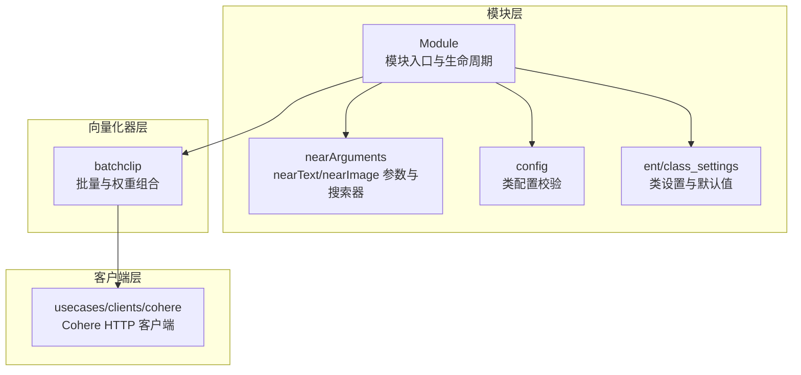
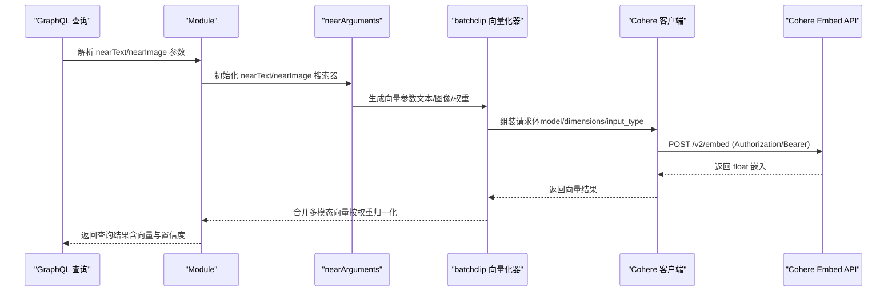
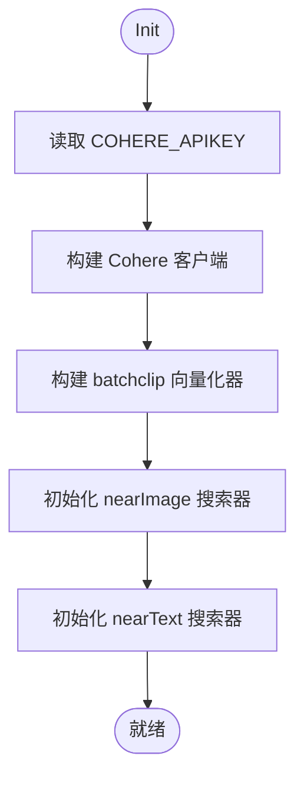
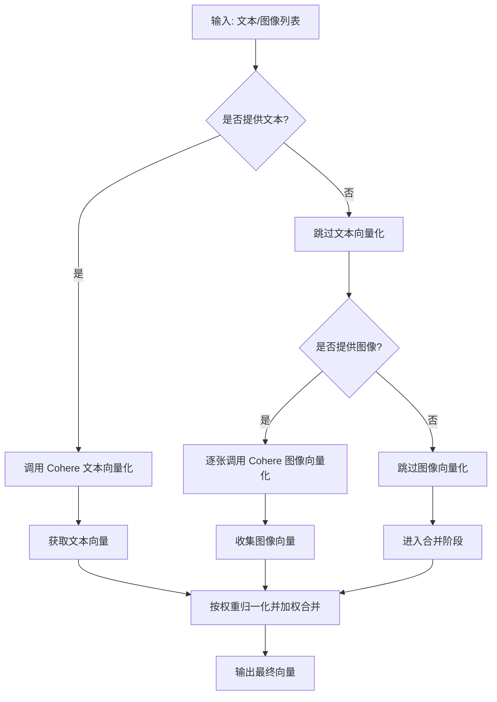
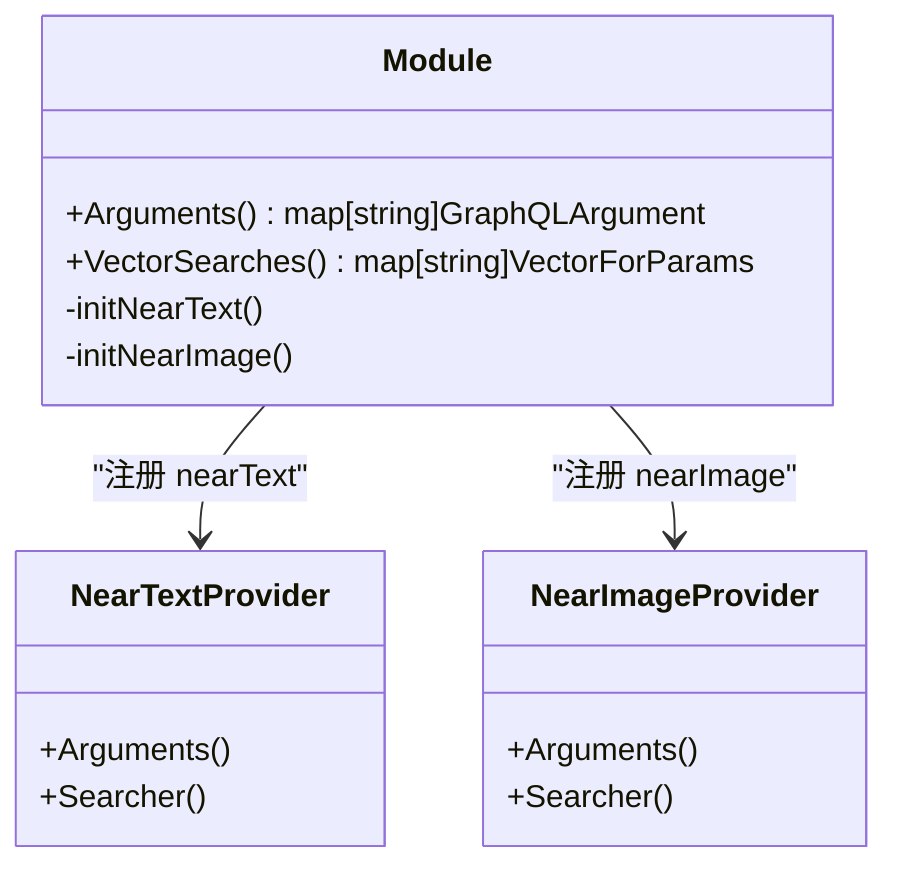
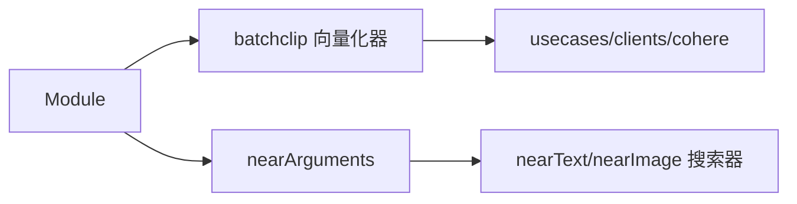

# Cohere 多模态向量化

<cite>
**本文引用的文件**
- [modules/multi2vec-cohere/module.go](file://modules/multi2vec-cohere/module.go)
- [modules/multi2vec-cohere/clients/cohere.go](file://modules/multi2vec-cohere/clients/cohere.go)
- [modules/multi2vec-cohere/config.go](file://modules/multi2vec-cohere/config.go)
- [modules/multi2vec-cohere/nearArguments.go](file://modules/multi2vec-cohere/nearArguments.go)
- [modules/multi2vec-cohere/ent/class_settings.go](file://modules/multi2vec-cohere/ent/class_settings.go)
- [usecases/modulecomponents/clients/cohere/cohere.go](file://usecases/modulecomponents/clients/cohere/cohere.go)
- [usecases/modulecomponents/vectorizer/batchclip/batch_clip_vectorizer.go](file://usecases/modulecomponents/vectorizer/batchclip/batch_clip_vectorizer.go)
- [test/modules/multi2vec-cohere/multi2vec_cohere_test.go](file://test/modules/multi2vec-cohere/multi2vec_cohere_test.go)
- [test/modules/multi2vec-cohere/setup_test.go](file://test/modules/multi2vec-cohere/setup_test.go)
- [test/helper/sample-schema/multimodal/multimodal.go](file://test/helper/sample-schema/multimodal/multimodal.go)
- [adapters/clients/client.go](file://adapters/clients/client.go)
- [adapters/clients/client_test.go](file://adapters/clients/client_test.go)
- [usecases/modulecomponents/client_results.go](file://usecases/modulecomponents/client_results.go)
- [entities/interval/backoff.go](file://entities/interval/backoff.go)
</cite>

## 目录
1. [简介](#简介)
2. [项目结构](#项目结构)
3. [核心组件](#核心组件)
4. [架构总览](#架构总览)
5. [详细组件分析](#详细组件分析)
6. [依赖关系分析](#依赖关系分析)
7. [性能考量](#性能考量)
8. [故障排查指南](#故障排查指南)
9. [结论](#结论)
10. [附录](#附录)

## 简介
本技术文档聚焦 Weaviate 的 Cohere 多模态向量化模块（multi2vec-cohere），系统阐述其在文本-图像联合嵌入方面的实现方式、配置方法、查询接口与错误处理策略，并结合测试用例给出 nearText 与 nearImage 的实际使用路径。文档同时提供与本地向量化器的对比视角，帮助企业级开发者完成从环境准备到生产集成的全链路实践。

## 项目结构
multi2vec-cohere 模块位于 modules/multi2vec-cohere 目录，围绕“模块入口 → 向量化器 → 客户端 → 批处理组合”的层次组织，配合 usecases 层的通用客户端与批处理工具，形成可复用的多模态向量化能力。

图示来源
- [modules/multi2vec-cohere/module.go](file://modules/multi2vec-cohere/module.go#L60-L104)
- [modules/multi2vec-cohere/nearArguments.go](file://modules/multi2vec-cohere/nearArguments.go#L20-L30)
- [modules/multi2vec-cohere/config.go](file://modules/multi2vec-cohere/config.go#L34-L39)
- [modules/multi2vec-cohere/ent/class_settings.go](file://modules/multi2vec-cohere/ent/class_settings.go#L41-L88)
- [usecases/modulecomponents/vectorizer/batchclip/batch_clip_vectorizer.go](file://usecases/modulecomponents/vectorizer/batchclip/batch_clip_vectorizer.go#L27-L40)
- [usecases/modulecomponents/clients/cohere/cohere.go](file://usecases/modulecomponents/clients/cohere/cohere.go#L99-L108)

章节来源
- [modules/multi2vec-cohere/module.go](file://modules/multi2vec-cohere/module.go#L12-L138)
- [modules/multi2vec-cohere/clients/cohere.go](file://modules/multi2vec-cohere/clients/cohere.go#L27-L100)
- [modules/multi2vec-cohere/ent/class_settings.go](file://modules/multi2vec-cohere/ent/class_settings.go#L19-L88)

## 核心组件
- 模块入口（Module）
  - 负责初始化向量化器、nearImage/nearText 搜索器与 GraphQL 参数提供者；暴露向量检索与输入向量化能力。
- 向量化器（batchclip）
  - 支持对象/批量向量化、文本与图像分别或联合向量化、按字段权重归一化后合并。
- Cohere 客户端（usecases/clients/cohere）
  - 封装 HTTP 请求、鉴权头、错误消息解析、速率限制辅助等。
- 类配置（ent/class_settings）
  - 提供 model/baseURL/truncate/dimensions 等参数读取与默认值；校验多模态字段集合。

章节来源
- [modules/multi2vec-cohere/module.go](file://modules/multi2vec-cohere/module.go#L60-L130)
- [usecases/modulecomponents/vectorizer/batchclip/batch_clip_vectorizer.go](file://usecases/modulecomponents/vectorizer/batchclip/batch_clip_vectorizer.go#L27-L40)
- [usecases/modulecomponents/clients/cohere/cohere.go](file://usecases/modulecomponents/clients/cohere/cohere.go#L99-L161)
- [modules/multi2vec-cohere/ent/class_settings.go](file://modules/multi2vec-cohere/ent/class_settings.go#L41-L88)

## 架构总览
下图展示从 GraphQL 查询到 Cohere API 的调用链路，以及 Weaviate 内部的参数解析与向量合并流程。

图示来源
- [modules/multi2vec-cohere/nearArguments.go](file://modules/multi2vec-cohere/nearArguments.go#L20-L30)
- [modules/multi2vec-cohere/clients/cohere.go](file://modules/multi2vec-cohere/clients/cohere.go#L57-L99)
- [usecases/modulecomponents/clients/cohere/cohere.go](file://usecases/modulecomponents/clients/cohere/cohere.go#L110-L161)
- [usecases/modulecomponents/vectorizer/batchclip/batch_clip_vectorizer.go](file://usecases/modulecomponents/vectorizer/batchclip/batch_clip_vectorizer.go#L226-L236)

## 详细组件分析

### 模块入口与生命周期
- 初始化
  - 从环境变量读取 COHERE_APIKEY，构造 Cohere 客户端与 batchclip 向量化器。
  - 初始化 nearImage 与 nearText 搜索器及 GraphQL 参数提供者。
- 能力暴露
  - 对外提供 VectorizeObject/VectorizeBatch/VectorizeInput 等能力，支持对象级与批量向量化。
- 配置校验
  - 通过 ent.ClassSettings.validate 校验多模态字段集合与参数合法性。

图示来源
- [modules/multi2vec-cohere/module.go](file://modules/multi2vec-cohere/module.go#L60-L104)

章节来源
- [modules/multi2vec-cohere/module.go](file://modules/multi2vec-cohere/module.go#L60-L130)
- [modules/multi2vec-cohere/config.go](file://modules/multi2vec-cohere/config.go#L34-L39)

### 向量化器与权重合并
- 文本与图像分别向量化
  - 文本：input_type=search_document；图像：input_type=image，逐张发送。
- 权重归一化与向量合并
  - 读取 textFields/imageFields 权重，进行归一化后加权合并，输出单一向量或保留多向量。

图示来源
- [modules/multi2vec-cohere/clients/cohere.go](file://modules/multi2vec-cohere/clients/cohere.go#L57-L99)
- [usecases/modulecomponents/vectorizer/batchclip/batch_clip_vectorizer.go](file://usecases/modulecomponents/vectorizer/batchclip/batch_clip_vectorizer.go#L226-L278)

章节来源
- [usecases/modulecomponents/vectorizer/batchclip/batch_clip_vectorizer.go](file://usecases/modulecomponents/vectorizer/batchclip/batch_clip_vectorizer.go#L27-L40)
- [modules/multi2vec-cohere/clients/cohere.go](file://modules/multi2vec-cohere/clients/cohere.go#L57-L99)

### GraphQL 参数与查询入口
- nearText
  - 通过 nearText.New(m.nearTextTransformer) 注册 GraphQL 参数与向量搜索器。
- nearImage
  - 通过 nearImage.New() 注册 GraphQL 参数与向量搜索器。
- 组合返回
  - Arguments()/VectorSearches() 合并 nearText 与 nearImage 的参数与搜索器。

图示来源
- [modules/multi2vec-cohere/nearArguments.go](file://modules/multi2vec-cohere/nearArguments.go#L20-L52)

章节来源
- [modules/multi2vec-cohere/nearArguments.go](file://modules/multi2vec-cohere/nearArguments.go#L20-L52)

### 类配置与默认值
- 关键参数
  - model/baseURL/truncate/dimensions；默认模型为 embed-multilingual-v3.0；默认 baseURL 为 https://api.cohere.com；默认 truncate 为 END。
- 字段权重
  - 支持 textFields 与 imageFields 的权重配置，用于向量合并。
- 校验
  - ValidateMultiModal 校验多模态字段集合与参数合法性。

章节来源
- [modules/multi2vec-cohere/ent/class_settings.go](file://modules/multi2vec-cohere/ent/class_settings.go#L19-L88)

### Cohere 客户端与速率限制
- 请求封装
  - 设置 Authorization: Bearer、Accept/Content-Type、Request-Source；根据 input_type 区分文本与图像请求体。
- 错误处理
  - 非 200 状态码时解析 message 并返回错误；空响应体时返回明确错误。
- 速率限制
  - 默认 RPM=10000，TPM=10000000；提供 GetVectorizerRateLimit 辅助函数；HasTokenLimit/ReturnsRateLimit 返回 false 表示不透传限流。
- API Key 获取
  - 优先从请求上下文 X-Cohere-Api-Key，其次从环境变量 COHERE_APIKEY。

章节来源
- [usecases/modulecomponents/clients/cohere/cohere.go](file://usecases/modulecomponents/clients/cohere/cohere.go#L99-L161)
- [usecases/modulecomponents/clients/cohere/cohere.go](file://usecases/modulecomponents/clients/cohere/cohere.go#L209-L236)
- [usecases/modulecomponents/clients/cohere/cohere.go](file://usecases/modulecomponents/clients/cohere/cohere.go#L245-L255)

### 测试与使用案例
- 环境准备
  - 通过环境变量 COHERE_APIKEY 启用测试；单节点容器环境由 composeModules 构建。
- nearImage 查询
  - 使用 base64 编码的图像 blob 作为 nearImage.image；targetVectors 指定目标向量名；断言返回对象的 title 与置信度。
- 多向量维度验证
  - 针对不同配置（如 embed-english-light-v3.0、embed-v4.0+256 维）断言返回向量维度。

章节来源
- [test/modules/multi2vec-cohere/setup_test.go](file://test/modules/multi2vec-cohere/setup_test.go#L23-L51)
- [test/modules/multi2vec-cohere/multi2vec_cohere_test.go](file://test/modules/multi2vec-cohere/multi2vec_cohere_test.go#L78-L96)
- [test/helper/sample-schema/multimodal/multimodal.go](file://test/helper/sample-schema/multimodal/multimodal.go#L182-L245)

## 依赖关系分析
- 模块与向量化器
  - Module 依赖 batchclip 向量化器进行对象/批量向量化与权重合并。
- 向量化器与客户端
  - batchclip 通过 usecases/clients/cohere 发起 HTTP 请求至 Cohere Embed API。
- GraphQL 与搜索器
  - nearArguments 将 nearText/nearImage 的参数与搜索器注入 Module，供 GraphQL 查询使用。

图示来源
- [modules/multi2vec-cohere/module.go](file://modules/multi2vec-cohere/module.go#L60-L104)
- [modules/multi2vec-cohere/nearArguments.go](file://modules/multi2vec-cohere/nearArguments.go#L20-L52)
- [usecases/modulecomponents/vectorizer/batchclip/batch_clip_vectorizer.go](file://usecases/modulecomponents/vectorizer/batchclip/batch_clip_vectorizer.go#L27-L40)
- [usecases/modulecomponents/clients/cohere/cohere.go](file://usecases/modulecomponents/clients/cohere/cohere.go#L99-L108)

章节来源
- [modules/multi2vec-cohere/module.go](file://modules/multi2vec-cohere/module.go#L60-L104)
- [modules/multi2vec-cohere/nearArguments.go](file://modules/multi2vec-cohere/nearArguments.go#L20-L52)

## 性能考量
- 批量与并发
  - 向量化器支持批量对象处理，内部以固定批次大小进行批处理，降低网络往返次数。
- 权重与维度
  - 通过 weights 归一化减少无效特征影响；通过 dimensions 指定输出维度，平衡存储与检索效率。
- 速率限制与退避
  - 客户端提供默认 RPM/TPM 与速率限制辅助函数；结合指数退避与最大尝试时间控制重试行为。
- 与本地向量化器对比
  - 本地向量化器通常具备更低延迟与更可控的成本，但多模态与跨语言能力可能不及云端模型；Cohere 在多语言与多模态上具备更强的通用性与稳定性。

[本节为通用性能讨论，不直接分析具体文件]

## 故障排查指南
- 常见错误
  - API Key 缺失：检查 X-Cohere-Api-Key 或 COHERE_APIKEY 是否正确设置。
  - 非 200 响应：关注返回 message 并核对模型/输入类型/维度配置。
  - 空响应：确认输入非空且格式正确（图像需 base64 data URI）。
- 重试与退避
  - 采用指数退避与最大尝试时间控制；区分瞬时错误与永久错误，避免无限重试。
- 速率限制
  - 当前客户端未透传限流，建议在上游统一限流或使用请求上下文传递自定义 RPM/TPM。

章节来源
- [usecases/modulecomponents/clients/cohere/cohere.go](file://usecases/modulecomponents/clients/cohere/cohere.go#L147-L150)
- [usecases/modulecomponents/clients/cohere/cohere.go](file://usecases/modulecomponents/clients/cohere/cohere.go#L238-L255)
- [adapters/clients/client.go](file://adapters/clients/client.go#L107-L124)
- [adapters/clients/client_test.go](file://adapters/clients/client_test.go#L32-L105)

## 结论
multi2vec-cohere 通过模块化设计将 GraphQL 参数、向量化器与 Cohere 客户端解耦，既满足 nearText/nearImage 的查询需求，又支持多模态向量的权重合并与维度定制。结合测试用例与速率限制辅助，可在企业环境中稳定地实现高质量的多模态嵌入与检索。

[本节为总结性内容，不直接分析具体文件]

## 附录

### 配置示例与最佳实践
- API 密钥
  - 环境变量：COHERE_APIKEY；或在请求上下文中设置 X-Cohere-Api-Key。
- 模型与维度
  - model：默认 embed-multilingual-v3.0；可选 embed-english-light-v3.0 或 embed-v4.0。
  - dimensions：指定输出维度，如 256/384/1024。
- 输入类型
  - 文本：input_type=search_document；图像：input_type=image（逐张发送）。
- 权重与字段
  - textFields 与 imageFields 分别配置权重，确保总和为 1；仅在需要联合向量时启用权重合并。

章节来源
- [modules/multi2vec-cohere/ent/class_settings.go](file://modules/multi2vec-cohere/ent/class_settings.go#L25-L63)
- [modules/multi2vec-cohere/clients/cohere.go](file://modules/multi2vec-cohere/clients/cohere.go#L64-L94)
- [usecases/modulecomponents/clients/cohere/cohere.go](file://usecases/modulecomponents/clients/cohere/cohere.go#L163-L191)

### nearText 与 nearImage 实战要点
- nearText
  - 通过 nearTextTransformer 进行文本预处理；参数与搜索器由 nearArguments 注入。
- nearImage
  - 图像以 base64 data URI 提交；逐张请求以满足 Cohere API 单次一张的限制。
- 维度断言
  - 不同模型与维度配置对应不同向量长度，测试中已覆盖典型场景。

章节来源
- [modules/multi2vec-cohere/nearArguments.go](file://modules/multi2vec-cohere/nearArguments.go#L26-L29)
- [modules/multi2vec-cohere/clients/cohere.go](file://modules/multi2vec-cohere/clients/cohere.go#L77-L94)
- [test/modules/multi2vec-cohere/multi2vec_cohere_test.go](file://test/modules/multi2vec-cohere/multi2vec_cohere_test.go#L78-L96)