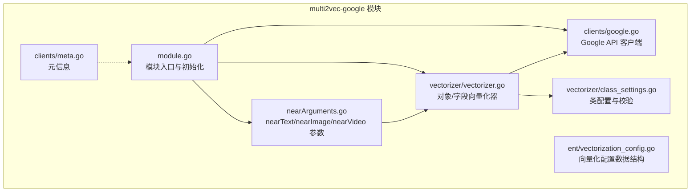
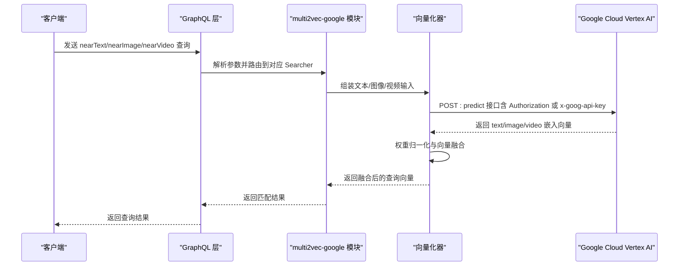
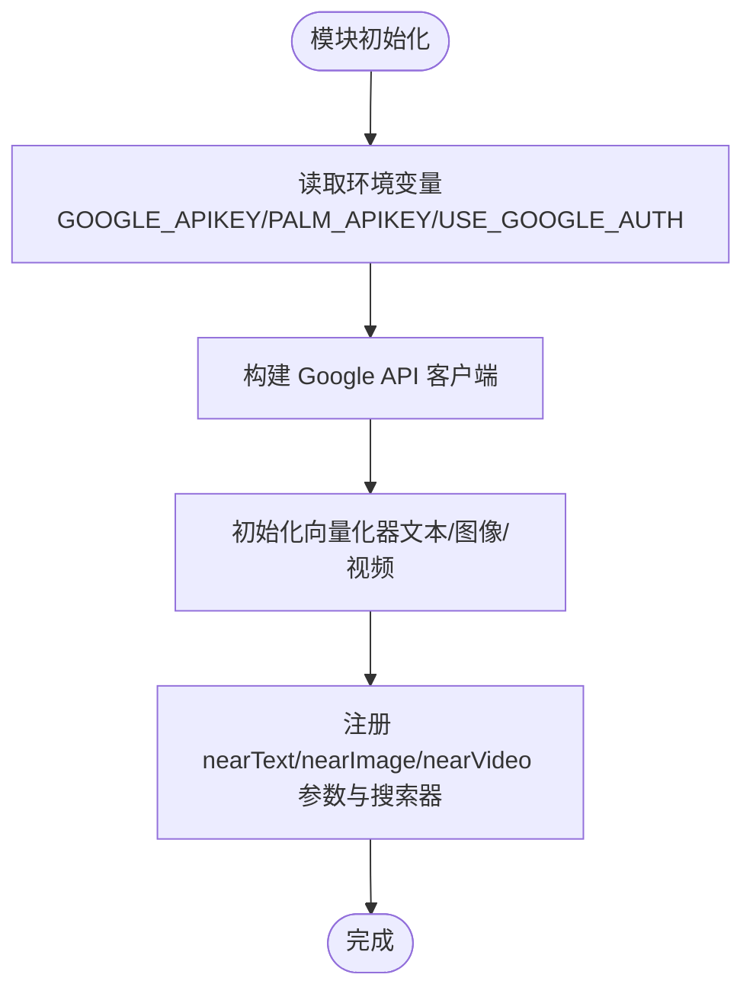
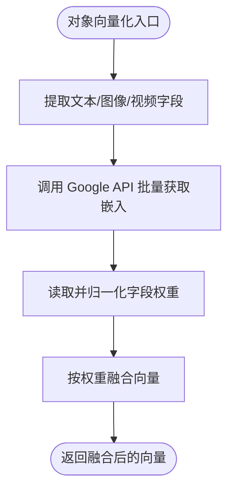
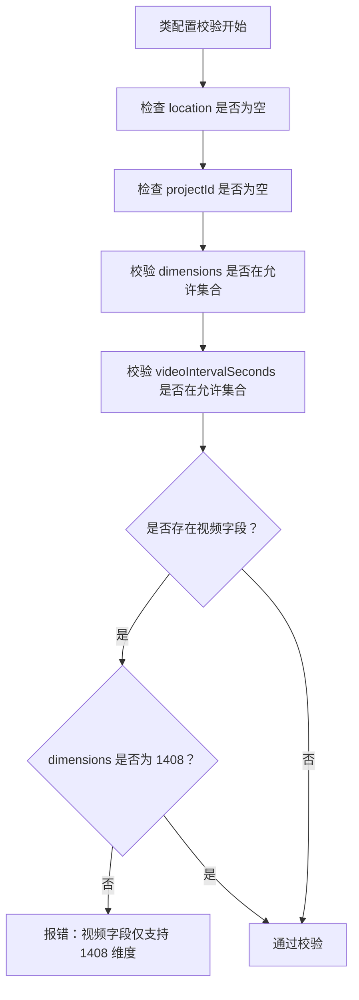
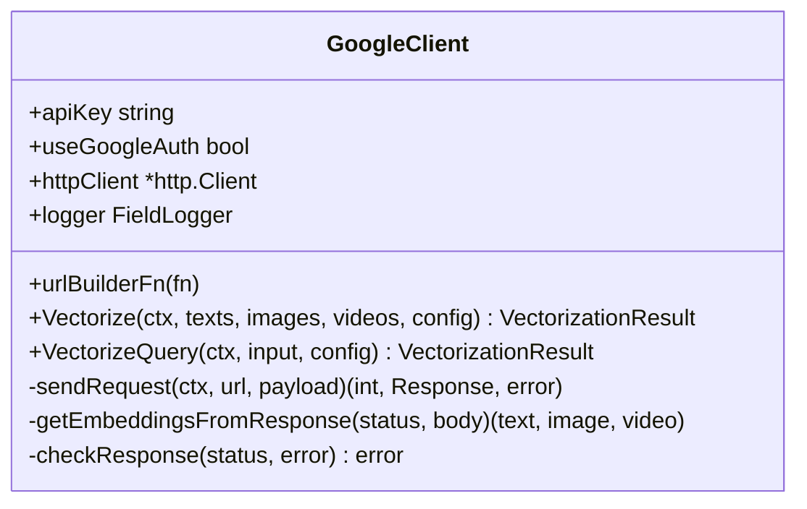
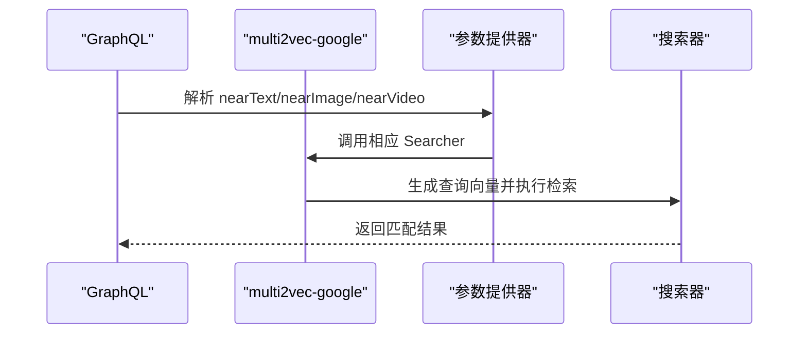
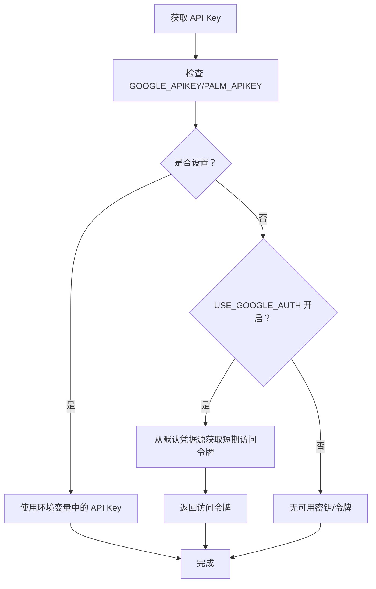
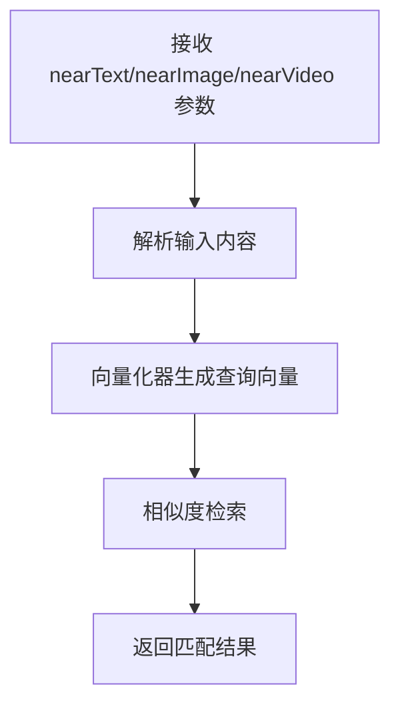
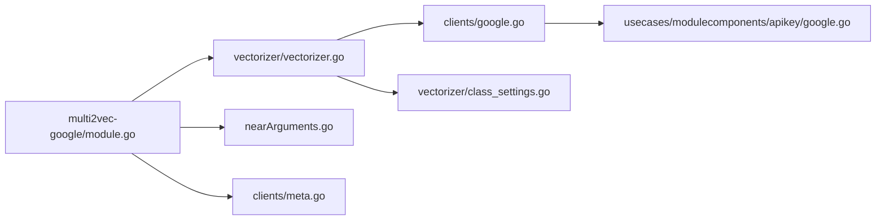

# Google 多模态向量化

<cite>
**本文引用的文件**
- [modules/multi2vec-google/module.go](file://modules/multi2vec-google/module.go)
- [modules/multi2vec-google/clients/google.go](file://modules/multi2vec-google/clients/google.go)
- [modules/multi2vec-google/vectorizer/vectorizer.go](file://modules/multi2vec-google/vectorizer/vectorizer.go)
- [modules/multi2vec-google/vectorizer/class_settings.go](file://modules/multi2vec-google/vectorizer/class_settings.go)
- [modules/multi2vec-google/nearArguments.go](file://modules/multi2vec-google/nearArguments.go)
- [modules/multi2vec-google/ent/vectorization_config.go](file://modules/multi2vec-google/ent/vectorization_config.go)
- [modules/multi2vec-google/clients/meta.go](file://modules/multi2vec-google/clients/meta.go)
- [usecases/modulecomponents/apikey/google.go](file://usecases/modulecomponents/apikey/google.go)
- [test/modules/multi2vec-google/setup_test.go](file://test/modules/multi2vec-google/setup_test.go)
- [modules/text2vec-google/clients/google.go](file://modules/text2vec-google/clients/google.go)
- [modules/text2vec-google/nearText.go](file://modules/text2vec-google/nearText.go)
</cite>

## 目录
1. [简介](#简介)
2. [项目结构](#项目结构)
3. [核心组件](#核心组件)
4. [架构总览](#架构总览)
5. [详细组件分析](#详细组件分析)
6. [依赖关系分析](#依赖关系分析)
7. [性能考量](#性能考量)
8. [故障排查指南](#故障排查指南)
9. [结论](#结论)
10. [附录](#附录)

## 简介
本文件面向企业级应用，系统性阐述 Weaviate 中 Google 多模态向量化模块（multi2vec-google）的技术实现与最佳实践。该模块基于 Google Cloud Vertex AI 的多模态嵌入能力，支持同时对文本、图像与视频进行联合向量化，并通过 nearText、nearImage、nearVideo 查询参数实现语义检索。文档覆盖以下主题：
- Google 多模态模型的技术特性与支持的模态组合
- 配置项与认证方式（API Key 与 Google OAuth2）
- nearText 与 nearImage 参数在查询中的使用方法
- 请求限流、错误重试与成本优化策略
- 服务端部署与测试环境搭建要点

## 项目结构
Weaviate 将多模态向量化能力以模块化方式组织，核心位于 multi2vec-google 模块目录中，包含客户端、向量化器、类配置与 GraphQL 参数提供器等组件。

**图表来源**
- [modules/multi2vec-google/module.go](file://modules/multi2vec-google/module.go#L1-L176)
- [modules/multi2vec-google/clients/google.go](file://modules/multi2vec-google/clients/google.go#L1-L287)
- [modules/multi2vec-google/vectorizer/vectorizer.go](file://modules/multi2vec-google/vectorizer/vectorizer.go#L1-L189)
- [modules/multi2vec-google/vectorizer/class_settings.go](file://modules/multi2vec-google/vectorizer/class_settings.go#L1-L172)
- [modules/multi2vec-google/nearArguments.go](file://modules/multi2vec-google/nearArguments.go#L1-L71)
- [modules/multi2vec-google/ent/vectorization_config.go](file://modules/multi2vec-google/ent/vectorization_config.go#L1-L21)
- [modules/multi2vec-google/clients/meta.go](file://modules/multi2vec-google/clients/meta.go#L1-L20)

**章节来源**
- [modules/multi2vec-google/module.go](file://modules/multi2vec-google/module.go#L1-L176)
- [modules/multi2vec-google/clients/google.go](file://modules/multi2vec-google/clients/google.go#L1-L287)
- [modules/multi2vec-google/vectorizer/vectorizer.go](file://modules/multi2vec-google/vectorizer/vectorizer.go#L1-L189)
- [modules/multi2vec-google/vectorizer/class_settings.go](file://modules/multi2vec-google/vectorizer/class_settings.go#L1-L172)
- [modules/multi2vec-google/nearArguments.go](file://modules/multi2vec-google/nearArguments.go#L1-L71)
- [modules/multi2vec-google/ent/vectorization_config.go](file://modules/multi2vec-google/ent/vectorization_config.go#L1-L21)
- [modules/multi2vec-google/clients/meta.go](file://modules/multi2vec-google/clients/meta.go#L1-L20)

## 核心组件
- 模块入口与生命周期管理：负责初始化客户端、注册 nearText/nearImage/nearVideo 参数与搜索器，并暴露元信息。
- 向量化器：根据类配置提取对象中的文本、图像、视频字段，调用 Google API 获取嵌入向量并按权重融合。
- 类配置与校验：定义 location、project_id、model_id、dimensions、video_interval_seconds 等参数及可用值范围。
- Google API 客户端：封装 HTTP 请求、鉴权头设置、响应解析与错误处理。
- GraphQL 参数提供器：将 nearText/nearImage/nearVideo 参数注入到 GraphQL 查询层。
- 元信息：提供模块名称与官方文档链接。

**章节来源**
- [modules/multi2vec-google/module.go](file://modules/multi2vec-google/module.go#L36-L176)
- [modules/multi2vec-google/vectorizer/vectorizer.go](file://modules/multi2vec-google/vectorizer/vectorizer.go#L26-L189)
- [modules/multi2vec-google/vectorizer/class_settings.go](file://modules/multi2vec-google/vectorizer/class_settings.go#L25-L172)
- [modules/multi2vec-google/clients/google.go](file://modules/multi2vec-google/clients/google.go#L36-L287)
- [modules/multi2vec-google/nearArguments.go](file://modules/multi2vec-google/nearArguments.go#L21-L71)
- [modules/multi2vec-google/clients/meta.go](file://modules/multi2vec-google/clients/meta.go#L14-L19)

## 架构总览
下图展示了从 Weaviate GraphQL 查询到 Google Cloud Vertex AI 的调用链路，以及本地向量化器与权重融合逻辑。

**图表来源**
- [modules/multi2vec-google/nearArguments.go](file://modules/multi2vec-google/nearArguments.go#L21-L65)
- [modules/multi2vec-google/vectorizer/vectorizer.go](file://modules/multi2vec-google/vectorizer/vectorizer.go#L52-L137)
- [modules/multi2vec-google/clients/google.go](file://modules/multi2vec-google/clients/google.go#L58-L144)

**章节来源**
- [modules/multi2vec-google/nearArguments.go](file://modules/multi2vec-google/nearArguments.go#L21-L65)
- [modules/multi2vec-google/vectorizer/vectorizer.go](file://modules/multi2vec-google/vectorizer/vectorizer.go#L52-L137)
- [modules/multi2vec-google/clients/google.go](file://modules/multi2vec-google/clients/google.go#L58-L144)

## 详细组件分析

### 模块入口与初始化
- 初始化阶段加载日志、HTTP 客户端超时与认证开关，创建向量化器与 GraphQL 参数提供器，并注册 nearText/nearImage/nearVideo 搜索器。
- 支持环境变量作为 API Key 的回退（GOOGLE_APIKEY/PALM_APIKEY），并可启用 Google OAuth2 认证。

**图表来源**
- [modules/multi2vec-google/module.go](file://modules/multi2vec-google/module.go#L87-L141)

**章节来源**
- [modules/multi2vec-google/module.go](file://modules/multi2vec-google/module.go#L87-L141)

### 向量化器与权重融合
- 对象向量化：遍历对象属性，识别文本/图像/视频字段，分别收集输入序列；调用客户端批量获取嵌入向量。
- 权重融合：从类配置读取各字段权重，归一化后对文本/图像/视频向量进行加权融合，输出单一查询向量。

**图表来源**
- [modules/multi2vec-google/vectorizer/vectorizer.go](file://modules/multi2vec-google/vectorizer/vectorizer.go#L85-L137)

**章节来源**
- [modules/multi2vec-google/vectorizer/vectorizer.go](file://modules/multi2vec-google/vectorizer/vectorizer.go#L52-L137)

### 类配置与参数校验
- 关键参数：
  - location：区域（必填）
  - projectId：项目 ID（必填）
  - modelId：模型标识，默认 multimodalembedding@001
  - dimensions：向量维度，可用值包括 128/256/512/1408
  - videoIntervalSeconds：视频分段间隔，默认 120 秒，可用值 4/8/15/120
- 校验规则：
  - 必填项缺失会报错
  - 不在允许范围内的 dimensions 或 videoIntervalSeconds 将被拒绝
  - 当存在视频字段时，仅允许 1408 维度

**图表来源**
- [modules/multi2vec-google/vectorizer/class_settings.go](file://modules/multi2vec-google/vectorizer/class_settings.go#L112-L155)

**章节来源**
- [modules/multi2vec-google/vectorizer/class_settings.go](file://modules/multi2vec-google/vectorizer/class_settings.go#L25-L172)

### Google API 客户端
- URL 构建：根据 location/projectId/model 动态生成 :predict 端点。
- 请求头：
  - Vertex AI 模式：Authorization: Bearer <token>
  - Generative AI 模式：x-goog-api-key: <key>
- 响应解析：解析 textEmbedding/imageEmbedding/videoEmbeddings，视频多片段向量合并后参与融合。
- 错误处理：状态码非 200 或返回 error 字段时统一报错。

**图表来源**
- [modules/multi2vec-google/clients/google.go](file://modules/multi2vec-google/clients/google.go#L36-L287)

**章节来源**
- [modules/multi2vec-google/clients/google.go](file://modules/multi2vec-google/clients/google.go#L58-L287)

### GraphQL 参数与查询搜索器
- nearText/nearImage/nearVideo 参数由模块注册到 GraphQL 层，查询时转换为向量并参与相似度检索。
- nearText 可通过扩展模块的 TextTransform 提供额外的文本预处理能力。

**图表来源**
- [modules/multi2vec-google/nearArguments.go](file://modules/multi2vec-google/nearArguments.go#L21-L65)

**章节来源**
- [modules/multi2vec-google/nearArguments.go](file://modules/multi2vec-google/nearArguments.go#L21-L65)

### 认证与密钥管理
- API Key 获取顺序：优先 GOOGLE_APIKEY，其次 PALM_APIKEY。
- Google OAuth2：当启用 USE_GOOGLE_AUTH 且使用 Vertex AI 模式时，自动从默认凭据源获取短期访问令牌。
- 文本向量化模块（text2vec-google）支持两种模式：
  - Vertex AI 模式：Authorization: Bearer <token>
  - Generative AI 模式：x-goog-api-key: <key>

**图表来源**
- [modules/multi2vec-google/module.go](file://modules/multi2vec-google/module.go#L128-L133)
- [usecases/modulecomponents/apikey/google.go](file://usecases/modulecomponents/apikey/google.go#L70-L103)
- [modules/text2vec-google/clients/google.go](file://modules/text2vec-google/clients/google.go#L171-L250)

**章节来源**
- [modules/multi2vec-google/module.go](file://modules/multi2vec-google/module.go#L128-L133)
- [usecases/modulecomponents/apikey/google.go](file://usecases/modulecomponents/apikey/google.go#L25-L103)
- [modules/text2vec-google/clients/google.go](file://modules/text2vec-google/clients/google.go#L171-L250)

### nearText 与 nearImage 参数使用
- nearText：支持传入关键词列表或自然语言描述，结合类配置的任务类型（如检索/问答/分类等）生成查询向量。
- nearImage：支持传入 base64 编码的图像，与文本联合向量化并融合。
- nearVideo：支持传入 base64 编码的视频，按设定的分段间隔抽取片段向量并融合。

**图表来源**
- [modules/multi2vec-google/nearArguments.go](file://modules/multi2vec-google/nearArguments.go#L21-L65)
- [modules/multi2vec-google/vectorizer/vectorizer.go](file://modules/multi2vec-google/vectorizer/vectorizer.go#L52-L137)

**章节来源**
- [modules/multi2vec-google/nearArguments.go](file://modules/multi2vec-google/nearArguments.go#L21-L65)
- [modules/multi2vec-google/vectorizer/vectorizer.go](file://modules/multi2vec-google/vectorizer/vectorizer.go#L52-L137)

## 依赖关系分析
- 模块与客户端：模块通过向量化器调用 Google 客户端，客户端负责网络请求与响应解析。
- 配置与校验：向量化器依赖类配置模块读取与校验参数。
- GraphQL：参数提供器与搜索器将查询参数映射为向量并执行检索。
- 认证：API Key 管理器支持环境变量与 Google OAuth2 两种路径。

**图表来源**
- [modules/multi2vec-google/module.go](file://modules/multi2vec-google/module.go#L87-L141)
- [modules/multi2vec-google/vectorizer/vectorizer.go](file://modules/multi2vec-google/vectorizer/vectorizer.go#L26-L189)
- [modules/multi2vec-google/clients/google.go](file://modules/multi2vec-google/clients/google.go#L36-L287)
- [modules/multi2vec-google/vectorizer/class_settings.go](file://modules/multi2vec-google/vectorizer/class_settings.go#L50-L172)
- [usecases/modulecomponents/apikey/google.go](file://usecases/modulecomponents/apikey/google.go#L25-L103)
- [modules/multi2vec-google/clients/meta.go](file://modules/multi2vec-google/clients/meta.go#L14-L19)

**章节来源**
- [modules/multi2vec-google/module.go](file://modules/multi2vec-google/module.go#L87-L141)
- [modules/multi2vec-google/vectorizer/vectorizer.go](file://modules/multi2vec-google/vectorizer/vectorizer.go#L26-L189)
- [modules/multi2vec-google/clients/google.go](file://modules/multi2vec-google/clients/google.go#L36-L287)
- [modules/multi2vec-google/vectorizer/class_settings.go](file://modules/multi2vec-google/vectorizer/class_settings.go#L50-L172)
- [usecases/modulecomponents/apikey/google.go](file://usecases/modulecomponents/apikey/google.go#L25-L103)
- [modules/multi2vec-google/clients/meta.go](file://modules/multi2vec-google/clients/meta.go#L14-L19)

## 性能考量
- 请求批量化：客户端按最大输入长度循环发送请求，尽量减少往返次数。
- 视频分段：通过 videoIntervalSeconds 控制分段间隔，平衡精度与成本。
- 维度选择：文本/图像建议使用较小维度以降低成本；视频字段仅支持 1408 维度。
- 权重融合：合理分配文本/图像/视频权重，避免某一模态主导检索结果。
- 超时与重试：设置合理的 HTTP 超时时间；对外部依赖失败进行幂等重试（建议在上层网关或业务层实现）。

## 故障排查指南
- 常见错误与定位
  - 空响应或维度不一致：检查模型与维度配置是否匹配，确认返回体解析逻辑。
  - 认证失败：确认 GOOGLE_APIKEY/PALM_APIKEY 设置正确，或启用 USE_GOOGLE_AUTH 并确保默认凭据可用。
  - 参数校验失败：核对 location、projectId、dimensions、videoIntervalSeconds 是否满足要求。
- 日志与元信息
  - 模块提供 MetaInfo，包含官方文档链接，便于快速查阅。
- 测试环境
  - 单节点测试通过环境变量 GCP_PROJECT 与 GOOGLE_APIKEY 启动容器并运行集成测试。

**章节来源**
- [modules/multi2vec-google/clients/google.go](file://modules/multi2vec-google/clients/google.go#L173-L182)
- [modules/multi2vec-google/vectorizer/class_settings.go](file://modules/multi2vec-google/vectorizer/class_settings.go#L112-L155)
- [modules/multi2vec-google/clients/meta.go](file://modules/multi2vec-google/clients/meta.go#L14-L19)
- [test/modules/multi2vec-google/setup_test.go](file://test/modules/multi2vec-google/setup_test.go#L27-L60)

## 结论
Weaviate 的 Google 多模态向量化模块通过清晰的模块边界与强校验机制，将 Google Cloud Vertex AI 的多模态嵌入能力无缝集成到查询流程中。借助 nearText/nearImage/nearVideo 参数，用户可在同一查询中融合文本与图像/视频语义，实现高质量的联合检索。配合合理的参数配置与认证策略，可在保证检索质量的同时控制成本与提升稳定性。

## 附录

### 配置示例与最佳实践
- 环境变量
  - GOOGLE_APIKEY：用于 Vertex AI 或 Generative AI 的 API Key
  - PALM_APIKEY：作为 GOOGLE_APIKEY 的回退
  - USE_GOOGLE_AUTH：启用后优先使用 Google OAuth2 获取短期访问令牌
- 类配置要点
  - 必填项：location、projectId
  - 模型与维度：modelId 默认 multimodalembedding@001；dimensions 可选 128/256/512/1408
  - 视频分段：videoIntervalSeconds 默认 120，可选 4/8/15/120
  - 视频字段：若启用视频字段，必须使用 1408 维度
- nearText/nearImage 使用建议
  - nearText：提供明确的查询意图与上下文，有助于提升检索效果
  - nearImage：确保图像已编码为 base64；可与 nearText 联合使用
  - nearVideo：根据视频长度与目标精度调整分段间隔
- 认证与安全
  - 生产环境优先使用 Google OAuth2（USE_GOOGLE_AUTH），避免长期暴露 API Key
  - 限制 API Key 的最小权限范围，仅授予 Vertex AI 相关权限
- 成本优化
  - 合理选择维度与分段间隔
  - 对高频查询进行缓存与批量化
  - 监控错误率与延迟，及时调整超时与重试策略