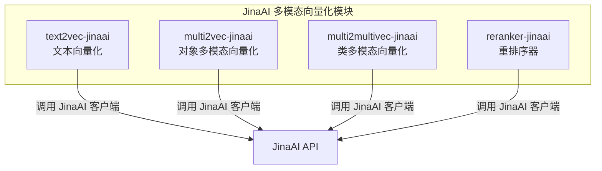
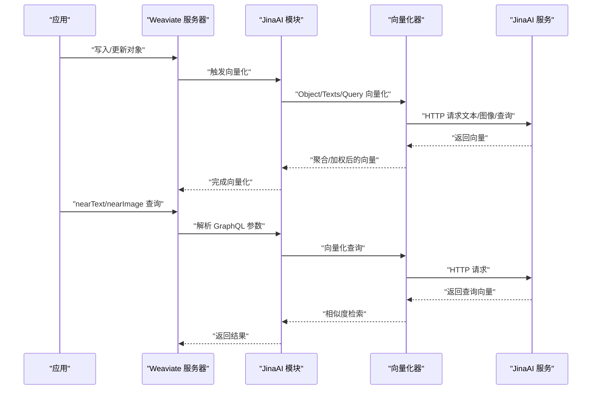
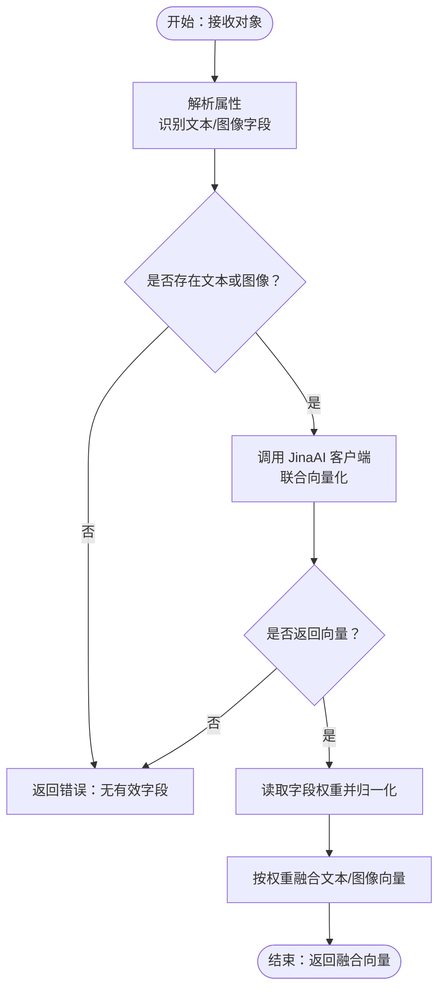
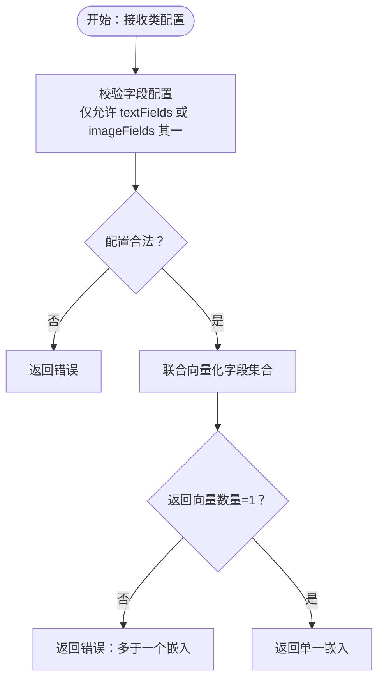
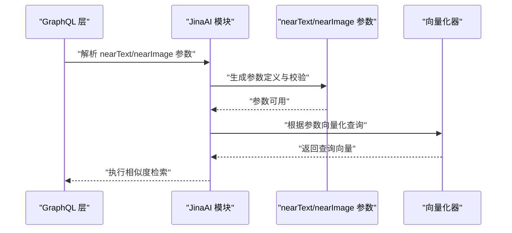
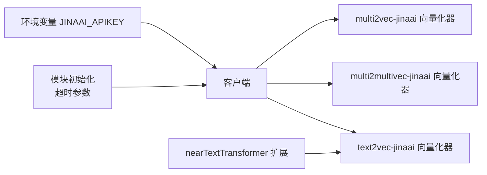

# JinaAI 多模态向量化

<cite>
**本文引用的文件**
- [modules/multi2vec-jinaai/module.go](file://modules/multi2vec-jinaai/module.go)
- [modules/multi2vec-jinaai/vectorizer/vectorizer.go](file://modules/multi2vec-jinaai/vectorizer/vectorizer.go)
- [modules/multi2vec-jinaai/nearArguments.go](file://modules/multi2vec-jinaai/nearArguments.go)
- [modules/multi2multivec-jinaai/module.go](file://modules/multi2multivec-jinaai/module.go)
- [modules/multi2multivec-jinaai/vectorizer/vectorizer.go](file://modules/multi2multivec-jinaai/vectorizer/vectorizer.go)
- [modules/multi2multivec-jinaai/ent/class_settings.go](file://modules/multi2multivec-jinaai/ent/class_settings.go)
- [modules/text2vec-jinaai/module.go](file://modules/text2vec-jinaai/module.go)
- [modules/reranker-jinaai/module.go](file://modules/reranker-jinaai/module.go)
</cite>

## 目录
1. [简介](#简介)
2. [项目结构](#项目结构)
3. [核心组件](#核心组件)
4. [架构总览](#架构总览)
5. [详细组件分析](#详细组件分析)
6. [依赖关系分析](#依赖关系分析)
7. [性能考量](#性能考量)
8. [故障排查指南](#故障排查指南)
9. [结论](#结论)
10. [附录：配置与使用示例](#附录配置与使用示例)

## 简介
本文件系统性梳理 Weaviate 中基于 JinaAI 的多模态向量化能力，覆盖以下主题：
- JinaAI 在多模态向量化中的架构定位与实现特色
- 文本-图像联合编码与跨模态对齐的实现路径
- nearText 与 nearImage 查询参数的高级用法与性能优化
- 配置项（如服务地址、模型选择）与连接池相关参数
- 扩展性与稳定性在大规模数据集上的表现
- 面向高性能多模态处理的实践建议

## 项目结构
Weaviate 对 JinaAI 的支持主要分布在三个模块中：
- text2vec-jinaai：单模态文本向量化（文本到向量）
- multi2vec-jinaai：多模态对象向量化（对象内文本+图像字段联合编码）
- multi2multivec-jinaai：多模态类向量化（类级文本或图像字段集合向量化）
- reranker-jinaai：基于 JinaAI 的重排序器（文本-文本重排）

图表来源
- [modules/text2vec-jinaai/module.go](file://modules/text2vec-jinaai/module.go#L68-L116)
- [modules/multi2vec-jinaai/module.go](file://modules/multi2vec-jinaai/module.go#L60-L104)
- [modules/multi2multivec-jinaai/module.go](file://modules/multi2multivec-jinaai/module.go#L60-L104)
- [modules/reranker-jinaai/module.go](file://modules/reranker-jinaai/module.go#L53-L71)

章节来源
- [modules/text2vec-jinaai/module.go](file://modules/text2vec-jinaai/module.go#L1-L167)
- [modules/multi2vec-jinaai/module.go](file://modules/multi2vec-jinaai/module.go#L1-L138)
- [modules/multi2multivec-jinaai/module.go](file://modules/multi2multivec-jinaai/module.go#L1-L138)
- [modules/reranker-jinaai/module.go](file://modules/reranker-jinaai/module.go#L1-L87)

## 核心组件
- 模块入口与生命周期
  - 初始化：加载 HTTP 超时、从环境变量读取 API Key、构建客户端与向量化器
  - 扩展初始化：注册 nearText 变换器，以便 nearText 查询参数可用
- 向量化器
  - multi2vec-jinaai：对象级文本+图像字段联合编码，支持权重归一化融合
  - multi2multivec-jinaai：类级文本或图像字段集合向量化，返回单一嵌入
- GraphQL 参数与检索器
  - nearText / nearImage 参数通过通用组件注入，支持查询时向量化与相似度检索
- 元信息与额外属性
  - 提供 MetaInfo（用于模型/服务信息）
  - text2vec-jinaai 提供额外属性（如文本向量化相关统计）

章节来源
- [modules/multi2vec-jinaai/module.go](file://modules/multi2vec-jinaai/module.go#L60-L104)
- [modules/multi2multivec-jinaai/module.go](file://modules/multi2multivec-jinaai/module.go#L60-L104)
- [modules/text2vec-jinaai/module.go](file://modules/text2vec-jinaai/module.go#L68-L116)
- [modules/multi2vec-jinaai/nearArguments.go](file://modules/multi2vec-jinaai/nearArguments.go#L20-L52)
- [modules/multi2multivec-jinaai/nearArguments.go](file://modules/multi2multivec-jinaai/nearArguments.go#L20-L52)

## 架构总览
下图展示了 Weaviate 与 JinaAI 的交互关系，以及多模态向量化在查询与写入路径中的位置。

图表来源
- [modules/multi2vec-jinaai/vectorizer/vectorizer.go](file://modules/multi2vec-jinaai/vectorizer/vectorizer.go#L54-L119)
- [modules/multi2multivec-jinaai/vectorizer/vectorizer.go](file://modules/multi2multivec-jinaai/vectorizer/vectorizer.go#L72-L115)
- [modules/multi2vec-jinaai/nearArguments.go](file://modules/multi2vec-jinaai/nearArguments.go#L20-L52)
- [modules/text2vec-jinaai/module.go](file://modules/text2vec-jinaai/module.go#L68-L116)

## 详细组件分析

### 组件 A：对象级多模态向量化（multi2vec-jinaai）
- 功能要点
  - 支持对象内的文本与图像字段联合编码
  - 将文本与图像向量按权重归一化后融合，输出单一向量
  - 支持批量向量化与错误映射
- 关键流程
  - 解析对象属性，区分文本/图像字段
  - 调用客户端进行联合向量化
  - 计算权重并归一化，融合多路向量

图表来源
- [modules/multi2vec-jinaai/vectorizer/vectorizer.go](file://modules/multi2vec-jinaai/vectorizer/vectorizer.go#L72-L119)

章节来源
- [modules/multi2vec-jinaai/vectorizer/vectorizer.go](file://modules/multi2vec-jinaai/vectorizer/vectorizer.go#L1-L155)
- [modules/multi2vec-jinaai/module.go](file://modules/multi2vec-jinaai/module.go#L106-L130)

### 组件 B：类级多模态向量化（multi2multivec-jinaai）
- 功能要点
  - 针对类级配置，仅允许选择“文本字段”或“图像字段”之一
  - 返回单一嵌入（当存在多个向量时会报错）
- 关键流程
  - 校验类配置（仅允许一种字段类型）
  - 联合向量化该类字段集合
  - 若有多路向量则报错，否则返回单一嵌入

图表来源
- [modules/multi2multivec-jinaai/ent/class_settings.go](file://modules/multi2multivec-jinaai/ent/class_settings.go#L71-L106)
- [modules/multi2multivec-jinaai/vectorizer/vectorizer.go](file://modules/multi2multivec-jinaai/vectorizer/vectorizer.go#L72-L115)

章节来源
- [modules/multi2multivec-jinaai/ent/class_settings.go](file://modules/multi2multivec-jinaai/ent/class_settings.go#L1-L164)
- [modules/multi2multivec-jinaai/vectorizer/vectorizer.go](file://modules/multi2multivec-jinaai/vectorizer/vectorizer.go#L1-L116)

### 组件 C：nearText 与 nearImage 查询参数
- nearText
  - 通过 nearTextTransformer 注入，支持将自然语言转换为查询向量
  - GraphQL 参数由 nearText 组件提供，并注册为向量搜索器
- nearImage
  - 通过 nearImage 组件提供图像查询参数
  - GraphQL 参数与向量搜索器均注册到模块

图表来源
- [modules/multi2vec-jinaai/nearArguments.go](file://modules/multi2vec-jinaai/nearArguments.go#L20-L52)
- [modules/multi2multivec-jinaai/nearArguments.go](file://modules/multi2multivec-jinaai/nearArguments.go#L20-L52)

章节来源
- [modules/multi2vec-jinaai/nearArguments.go](file://modules/multi2vec-jinaai/nearArguments.go#L1-L58)
- [modules/multi2multivec-jinaai/nearArguments.go](file://modules/multi2multivec-jinaai/nearArguments.go#L1-L58)

### 组件 D：元信息与额外属性（MetaInfo）
- text2vec-jinaai：提供额外属性（如文本向量化相关统计）
- multi2vec-jinaai / multi2multivec-jinaai：直接暴露客户端的 MetaInfo
- reranker-jinaai：提供重排序器的 MetaInfo 与额外属性

章节来源
- [modules/text2vec-jinaai/module.go](file://modules/text2vec-jinaai/module.go#L118-L144)
- [modules/multi2vec-jinaai/module.go](file://modules/multi2vec-jinaai/module.go#L122-L124)
- [modules/multi2multivec-jinaai/module.go](file://modules/multi2multivec-jinaai/module.go#L122-L124)
- [modules/reranker-jinaai/module.go](file://modules/reranker-jinaai/module.go#L73-L79)

## 依赖关系分析
- 模块间耦合
  - 各模块均依赖统一的客户端与向量化器接口，便于替换与扩展
  - nearTextTransformer 通过扩展接口注入，增强 nearText 的灵活性
- 外部依赖
  - JinaAI API：通过环境变量 JINAAI_APIKEY 进行鉴权
  - HTTP 客户端超时：由模块初始化参数传入

图表来源
- [modules/multi2vec-jinaai/module.go](file://modules/multi2vec-jinaai/module.go#L94-L104)
- [modules/multi2multivec-jinaai/module.go](file://modules/multi2multivec-jinaai/module.go#L94-L104)
- [modules/text2vec-jinaai/module.go](file://modules/text2vec-jinaai/module.go#L102-L116)

章节来源
- [modules/multi2vec-jinaai/module.go](file://modules/multi2vec-jinaai/module.go#L60-L104)
- [modules/multi2multivec-jinaai/module.go](file://modules/multi2multivec-jinaai/module.go#L60-L104)
- [modules/text2vec-jinaai/module.go](file://modules/text2vec-jinaai/module.go#L68-L116)

## 性能考量
- 批量策略
  - multi2vec-jinaai：使用通用批处理工具进行批量向量化，减少请求次数
  - text2vec-jinaai：内置批处理设置（如最大对象数、令牌上限等），避免过大的批次导致向量化时间显著上升
- 权重融合
  - 对文本/图像向量进行权重归一化融合，有助于在多字段场景下保持语义一致性
- 查询路径
  - nearText/nearImage 参数在 GraphQL 层解析后，直接驱动向量化器生成查询向量，降低中间层开销

章节来源
- [modules/multi2vec-jinaai/module.go](file://modules/multi2vec-jinaai/module.go#L112-L114)
- [modules/text2vec-jinaai/module.go](file://modules/text2vec-jinaai/module.go#L34-L44)
- [modules/multi2vec-jinaai/vectorizer/vectorizer.go](file://modules/multi2vec-jinaai/vectorizer/vectorizer.go#L121-L138)

## 故障排查指南
- 常见错误与定位
  - “空向量”：当 JinaAI 返回向量数量不匹配时抛出错误，检查输入数据类型与字段配置
  - “多于一个嵌入”：类级多模态向量化要求单一嵌入，若返回多路向量需调整字段配置
  - “无有效字段”：对象/类未配置文本或图像字段，或字段类型不符
- 排查步骤
  - 检查环境变量 JINAAI_APIKEY 是否正确设置
  - 校验类配置：确保仅配置 textFields 或 imageFields 其一
  - 减小批次大小或缩短输入长度，观察是否仍出现超时或异常

章节来源
- [modules/multi2vec-jinaai/vectorizer/vectorizer.go](file://modules/multi2vec-jinaai/vectorizer/vectorizer.go#L61-L71)
- [modules/multi2multivec-jinaai/vectorizer/vectorizer.go](file://modules/multi2multivec-jinaai/vectorizer/vectorizer.go#L107-L111)
- [modules/multi2multivec-jinaai/ent/class_settings.go](file://modules/multi2multivec-jinaai/ent/class_settings.go#L71-L106)

## 结论
Weaviate 对 JinaAI 的多模态向量化提供了清晰的模块化实现：
- 在对象与类两个层面分别支持文本与图像的联合编码
- 通过 nearText/nearImage 参数实现自然语言与视觉内容的统一检索
- 以权重归一化与批处理策略提升性能与稳定性
- 面向大规模数据集，建议结合字段配置、批次控制与查询参数优化，获得更优的吞吐与延迟表现

## 附录：配置与使用示例
- 环境变量
  - JINAAI_APIKEY：用于鉴权 JinaAI 服务
- 类配置（多模态类向量化）
  - baseURL：JinaAI 服务地址，默认值参见类设置
  - model：模型名称，默认为指定模型
  - textFields / imageFields：二选一，定义参与向量化的字段集合
- nearText 与 nearImage 查询参数
  - nearText：支持自然语言查询，可配合 nearTextTransformer 使用
  - nearImage：支持图像 URL/数据的查询
- 批量与超时
  - text2vec-jinaai 内置批处理设置（对象数、令牌数、最大批处理时间等），可根据需要调整
  - 模块初始化时传入的 HTTP 超时将影响客户端请求行为

章节来源
- [modules/multi2multivec-jinaai/ent/class_settings.go](file://modules/multi2multivec-jinaai/ent/class_settings.go#L24-L56)
- [modules/text2vec-jinaai/module.go](file://modules/text2vec-jinaai/module.go#L34-L44)
- [modules/multi2vec-jinaai/nearArguments.go](file://modules/multi2vec-jinaai/nearArguments.go#L20-L52)
- [modules/multi2multivec-jinaai/nearArguments.go](file://modules/multi2multivec-jinaai/nearArguments.go#L20-L52)