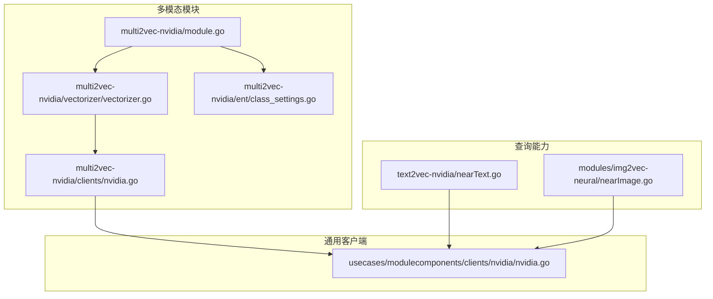
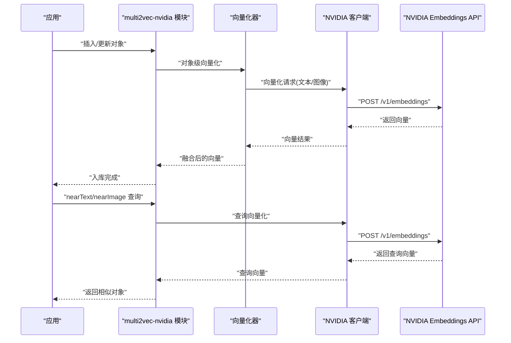
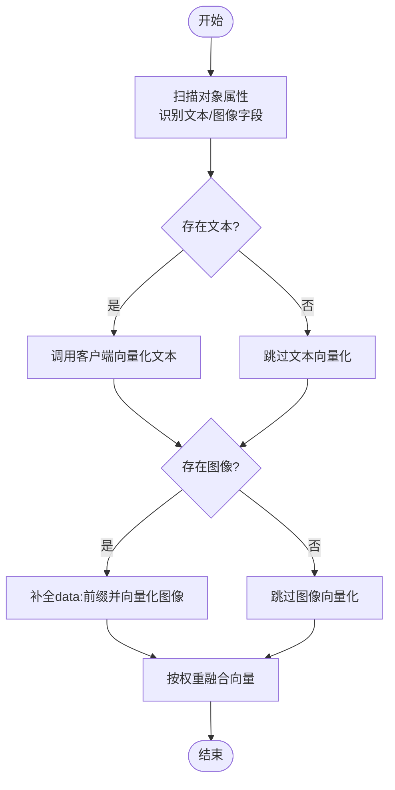
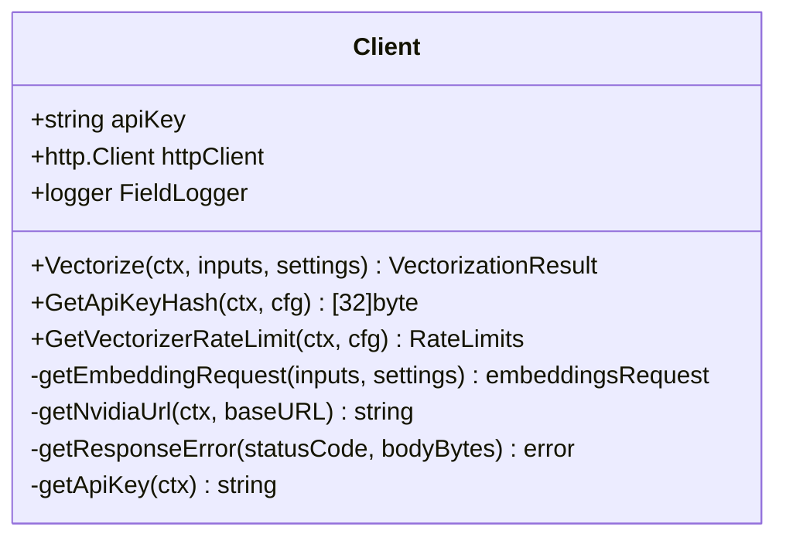
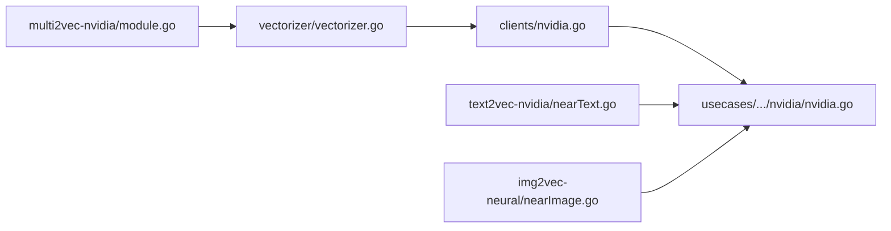

# NVIDIA 多模态向量化

<cite>
**本文引用的文件**
- [modules/multi2vec-nvidia/module.go](file://modules/multi2vec-nvidia/module.go)
- [modules/multi2vec-nvidia/vectorizer/vectorizer.go](file://modules/multi2vec-nvidia/vectorizer/vectorizer.go)
- [modules/multi2vec-nvidia/clients/nvidia.go](file://modules/multi2vec-nvidia/clients/nvidia.go)
- [modules/multi2vec-nvidia/ent/class_settings.go](file://modules/multi2vec-nvidia/ent/class_settings.go)
- [usecases/modulecomponents/clients/nvidia/nvidia.go](file://usecases/modulecomponents/clients/nvidia/nvidia.go)
- [modules/text2vec-nvidia/clients/nvidia.go](file://modules/text2vec-nvidia/clients/nvidia.go)
- [modules/text2vec-nvidia/nearText.go](file://modules/text2vec-nvidia/nearText.go)
- [modules/img2vec-neural/nearImage.go](file://modules/img2vec-neural/nearImage.go)
- [test/modules/multi2vec-nvidia/multi2vec_nvidia_test.go](file://test/modules/multi2vec-nvidia/multi2vec_nvidia_test.go)
- [test/modules/text2vec-nvidia/text2vec_nvidia_test.go](file://test/modules/text2vec-nvidia/text2vec_nvidia_test.go)
</cite>

## 目录
1. [简介](#简介)
2. [项目结构](#项目结构)
3. [核心组件](#核心组件)
4. [架构总览](#架构总览)
5. [组件详解](#组件详解)
6. [依赖关系分析](#依赖关系分析)
7. [性能与资源特性](#性能与资源特性)
8. [故障排查指南](#故障排查指南)
9. [结论](#结论)
10. [附录：配置与部署示例](#附录配置与部署示例)

## 简介
本技术文档聚焦 Weaviate 中基于 NVIDIA 的多模态向量化能力，系统阐述其在文本-图像联合嵌入方面的实现方式、运行机制与性能特征。Weaviate 通过“多模态向量化”模块（multi2vec-nvidia）将文本与图像统一编码为高维稠密向量，并支持权重融合、近邻检索与 GraphQL 查询参数化。该模块以 NVIDIA 提供的 API 服务为后端，结合 Weaviate 的向量化管线与查询子系统，形成从数据入库到检索的完整链路。

本模块不直接使用本地 GPU 进行推理，而是通过 HTTP 客户端调用 NVIDIA 接口完成向量化；因此，它并不涉及 CUDA 环境或本地 GPU 资源管理。但其设计与接口对后续扩展到本地 GPU 向量化（如引入本地推理引擎）提供了清晰的抽象边界。

## 项目结构
围绕 NVIDIA 多模态向量化的关键目录与文件如下：
- multi2vec-nvidia 模块：负责对象级多模态向量化、权重融合与 GraphQL 参数注入
- vectorizer 层：封装对象属性扫描、文本/图像分别向量化与向量合并
- clients 层：对接 NVIDIA API 的 HTTP 客户端
- ent 层：类配置解析与默认值管理
- usecases/modulecomponents/clients/nvidia：通用 NVIDIA 客户端实现
- text2vec-nvidia 与 img2vec-neural：分别提供文本与图像的 nearText/nearImage 查询能力

**图示来源**
- [modules/multi2vec-nvidia/module.go](file://modules/multi2vec-nvidia/module.go#L60-L104)
- [modules/multi2vec-nvidia/vectorizer/vectorizer.go](file://modules/multi2vec-nvidia/vectorizer/vectorizer.go#L51-L116)
- [modules/multi2vec-nvidia/clients/nvidia.go](file://modules/multi2vec-nvidia/clients/nvidia.go#L52-L90)
- [usecases/modulecomponents/clients/nvidia/nvidia.go](file://usecases/modulecomponents/clients/nvidia/nvidia.go#L104-L159)
- [modules/text2vec-nvidia/nearText.go](file://modules/text2vec-nvidia/nearText.go#L19-L31)
- [modules/img2vec-neural/nearImage.go](file://modules/img2vec-neural/nearImage.go#L19-L31)

**章节来源**
- [modules/multi2vec-nvidia/module.go](file://modules/multi2vec-nvidia/module.go#L1-L138)
- [modules/multi2vec-nvidia/vectorizer/vectorizer.go](file://modules/multi2vec-nvidia/vectorizer/vectorizer.go#L1-L152)
- [modules/multi2vec-nvidia/clients/nvidia.go](file://modules/multi2vec-nvidia/clients/nvidia.go#L1-L91)
- [modules/multi2vec-nvidia/ent/class_settings.go](file://modules/multi2vec-nvidia/ent/class_settings.go#L1-L80)
- [usecases/modulecomponents/clients/nvidia/nvidia.go](file://usecases/modulecomponents/clients/nvidia/nvidia.go#L1-L235)
- [modules/text2vec-nvidia/nearText.go](file://modules/text2vec-nvidia/nearText.go#L1-L37)
- [modules/img2vec-neural/nearImage.go](file://modules/img2vec-neural/nearImage.go#L1-L37)

## 核心组件
- 模块入口与生命周期
  - 模块名称与类型声明、初始化与扩展初始化流程
  - 初始化向量化器与 nearText/nearImage 查询能力
- 向量化器
  - 对象级向量化：扫描对象属性，分别提取文本与图像字段，调用客户端生成向量，按权重融合
  - 图像向量化：自动补全 base64 前缀，确保输入格式正确
- 客户端
  - 统一构造请求体、设置鉴权头、调用 NVIDIA Embeddings 接口
  - 支持通过请求上下文覆盖 BaseURL 与 API Key
- 类配置
  - 默认模型与基础 URL、字段权重与可向量化属性校验
- 查询能力
  - nearText：基于文本向量的相似度搜索
  - nearImage：基于图像向量的相似度搜索

**章节来源**
- [modules/multi2vec-nvidia/module.go](file://modules/multi2vec-nvidia/module.go#L60-L104)
- [modules/multi2vec-nvidia/vectorizer/vectorizer.go](file://modules/multi2vec-nvidia/vectorizer/vectorizer.go#L51-L116)
- [modules/multi2vec-nvidia/clients/nvidia.go](file://modules/multi2vec-nvidia/clients/nvidia.go#L52-L90)
- [modules/multi2vec-nvidia/ent/class_settings.go](file://modules/multi2vec-nvidia/ent/class_settings.go#L47-L80)
- [usecases/modulecomponents/clients/nvidia/nvidia.go](file://usecases/modulecomponents/clients/nvidia/nvidia.go#L104-L159)
- [modules/text2vec-nvidia/nearText.go](file://modules/text2vec-nvidia/nearText.go#L19-L31)
- [modules/img2vec-neural/nearImage.go](file://modules/img2vec-neural/nearImage.go#L19-L31)

## 架构总览
下图展示了从对象入库到查询检索的整体流程，以及与 NVIDIA API 的交互位置。

**图示来源**
- [modules/multi2vec-nvidia/module.go](file://modules/multi2vec-nvidia/module.go#L106-L130)
- [modules/multi2vec-nvidia/vectorizer/vectorizer.go](file://modules/multi2vec-nvidia/vectorizer/vectorizer.go#L51-L116)
- [modules/multi2vec-nvidia/clients/nvidia.go](file://modules/multi2vec-nvidia/clients/nvidia.go#L52-L90)
- [usecases/modulecomponents/clients/nvidia/nvidia.go](file://usecases/modulecomponents/clients/nvidia/nvidia.go#L104-L159)

## 组件详解

### 多模态模块入口
- 模块类型为 Multi2Vec，负责对象级向量化与 nearText/nearImage 查询能力的注册
- 初始化阶段构建向量化器与 nearImage 能力；nearText 能力通过扩展初始化从其他模块注入

**章节来源**
- [modules/multi2vec-nvidia/module.go](file://modules/multi2vec-nvidia/module.go#L52-L92)

### 向量化器：对象级多模态向量生成
- 属性扫描：遍历对象属性，识别文本与图像字段
- 分别向量化：文本与图像分别调用客户端生成向量
- 权重融合：根据字段权重归一化后加权求和，得到最终向量

**图示来源**
- [modules/multi2vec-nvidia/vectorizer/vectorizer.go](file://modules/multi2vec-nvidia/vectorizer/vectorizer.go#L70-L116)

**章节来源**
- [modules/multi2vec-nvidia/vectorizer/vectorizer.go](file://modules/multi2vec-nvidia/vectorizer/vectorizer.go#L51-L116)

### 客户端：NVIDIA API 调用
- 请求构造：序列化请求体，设置鉴权头与内容类型
- URL 解析：优先使用请求上下文中的 BaseURL，否则使用配置
- 错误处理：针对常见状态码返回结构化错误
- 查询模式：支持文本与图像输入，返回浮点向量数组

**图示来源**
- [usecases/modulecomponents/clients/nvidia/nvidia.go](file://usecases/modulecomponents/clients/nvidia/nvidia.go#L81-L235)

**章节来源**
- [usecases/modulecomponents/clients/nvidia/nvidia.go](file://usecases/modulecomponents/clients/nvidia/nvidia.go#L104-L159)
- [modules/multi2vec-nvidia/clients/nvidia.go](file://modules/multi2vec-nvidia/clients/nvidia.go#L52-L90)

### 类配置：模型与字段权重
- 默认模型与基础 URL
- 文本/图像字段识别与权重
- 可向量化属性集合与多模态校验

**章节来源**
- [modules/multi2vec-nvidia/ent/class_settings.go](file://modules/multi2vec-nvidia/ent/class_settings.go#L47-L80)

### nearText 与 nearImage 查询
- nearText：通过 nearText 搜索器与 GraphQL 参数提供器注入
- nearImage：通过 nearImage 搜索器与 GraphQL 参数提供器注入

**章节来源**
- [modules/text2vec-nvidia/nearText.go](file://modules/text2vec-nvidia/nearText.go#L19-L31)
- [modules/img2vec-neural/nearImage.go](file://modules/img2vec-neural/nearImage.go#L19-L31)

## 依赖关系分析
- 模块层依赖
  - multi2vec-nvidia 模块依赖 vectorizer 层与 clients 层
  - vectorizer 层依赖通用类配置与向量融合工具
  - clients 层依赖通用 NVIDIA 客户端
- 查询层依赖
  - nearText 与 nearImage 依赖通用搜索器与 GraphQL 参数提供器
  - 两者均通过通用 NVIDIA 客户端完成向量化

**图示来源**
- [modules/multi2vec-nvidia/module.go](file://modules/multi2vec-nvidia/module.go#L60-L104)
- [modules/multi2vec-nvidia/vectorizer/vectorizer.go](file://modules/multi2vec-nvidia/vectorizer/vectorizer.go#L51-L116)
- [modules/multi2vec-nvidia/clients/nvidia.go](file://modules/multi2vec-nvidia/clients/nvidia.go#L52-L90)
- [usecases/modulecomponents/clients/nvidia/nvidia.go](file://usecases/modulecomponents/clients/nvidia/nvidia.go#L104-L159)
- [modules/text2vec-nvidia/nearText.go](file://modules/text2vec-nvidia/nearText.go#L19-L31)
- [modules/img2vec-neural/nearImage.go](file://modules/img2vec-neural/nearImage.go#L19-L31)

**章节来源**
- [modules/multi2vec-nvidia/module.go](file://modules/multi2vec-nvidia/module.go#L60-L104)
- [modules/multi2vec-nvidia/vectorizer/vectorizer.go](file://modules/multi2vec-nvidia/vectorizer/vectorizer.go#L51-L116)
- [modules/multi2vec-nvidia/clients/nvidia.go](file://modules/multi2vec-nvidia/clients/nvidia.go#L52-L90)
- [usecases/modulecomponents/clients/nvidia/nvidia.go](file://usecases/modulecomponents/clients/nvidia/nvidia.go#L104-L159)
- [modules/text2vec-nvidia/nearText.go](file://modules/text2vec-nvidia/nearText.go#L19-L31)
- [modules/img2vec-neural/nearImage.go](file://modules/img2vec-neural/nearImage.go#L19-L31)

## 性能与资源特性
- 计算路径
  - 文本与图像分别向量化，随后进行权重融合，整体复杂度与输入数量线性相关
- 网络与延迟
  - 所有向量化请求经由 HTTP 客户端发送至 NVIDIA API，受网络与服务端限流影响
- 速率限制
  - 通用客户端提供速率限制接口占位，当前实现未启用令牌级限流
- 内存与并发
  - 向量化器内部使用切片收集向量并进行加权融合，内存占用与向量维度与样本数成正比

**章节来源**
- [usecases/modulecomponents/clients/nvidia/nvidia.go](file://usecases/modulecomponents/clients/nvidia/nvidia.go#L187-L197)
- [modules/multi2vec-nvidia/vectorizer/vectorizer.go](file://modules/multi2vec-nvidia/vectorizer/vectorizer.go#L118-L135)

## 故障排查指南
- API Key 缺失
  - 当请求头与环境变量均未提供时，会返回明确的错误提示
- 请求超时或网络异常
  - 客户端在构造请求、发送请求与读取响应时均可能失败，需检查网络连通性与超时设置
- 服务端错误
  - 针对常见状态码（如 400/402/422/500）返回结构化错误，便于定位问题
- 测试验证
  - 提供多模态与文本向量化的测试用例，可作为行为参考与回归验证

**章节来源**
- [usecases/modulecomponents/clients/nvidia/nvidia.go](file://usecases/modulecomponents/clients/nvidia/nvidia.go#L199-L230)
- [test/modules/multi2vec-nvidia/multi2vec_nvidia_test.go](file://test/modules/multi2vec-nvidia/multi2vec_nvidia_test.go)
- [test/modules/text2vec-nvidia/text2vec_nvidia_test.go](file://test/modules/text2vec-nvidia/text2vec_nvidia_test.go)

## 结论
Weaviate 的 NVIDIA 多模态向量化模块通过清晰的分层设计，实现了文本-图像联合嵌入与查询能力。其核心优势在于：
- 易于集成：以标准 HTTP 客户端对接 NVIDIA API，无需本地 GPU
- 可配置性强：支持模型、基础 URL、字段权重等灵活配置
- 可扩展性好：查询能力通过扩展机制注入，便于与其他模块协同

对于需要本地 GPU 加速的场景，可在现有接口基础上引入本地推理客户端，保持上层调用一致，从而平滑演进至混合云/本地部署。

## 附录：配置与部署示例
以下示例仅描述配置项与调用要点，具体键值请依据实际环境设置。

- 环境变量
  - NVIDIA_APIKEY：用于鉴权的 API Key
- GraphQL 查询参数
  - nearText：通过 nearText GraphQL 参数提供器注入，支持文本相似度检索
  - nearImage：通过 nearImage GraphQL 参数提供器注入，支持图像相似度检索
- 类配置
  - model：指定使用的模型名称
  - baseURL：指定 NVIDIA API 的基础 URL（可通过请求上下文覆盖）
  - 文本/图像字段权重：用于融合阶段的加权计算

**章节来源**
- [modules/multi2vec-nvidia/ent/class_settings.go](file://modules/multi2vec-nvidia/ent/class_settings.go#L47-L80)
- [modules/text2vec-nvidia/nearText.go](file://modules/text2vec-nvidia/nearText.go#L19-L31)
- [modules/img2vec-neural/nearImage.go](file://modules/img2vec-neural/nearImage.go#L19-L31)
- [usecases/modulecomponents/clients/nvidia/nvidia.go](file://usecases/modulecomponents/clients/nvidia/nvidia.go#L171-L177)