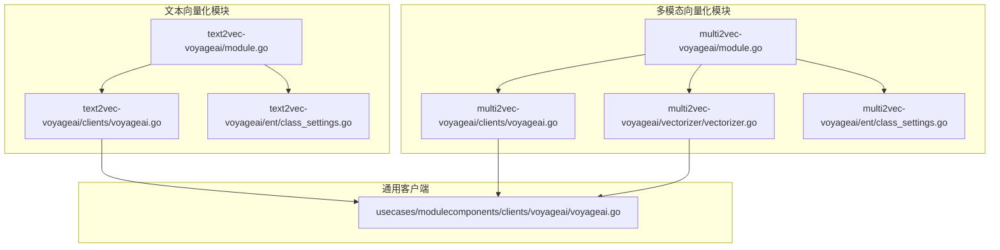
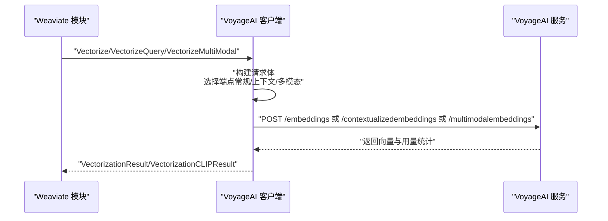
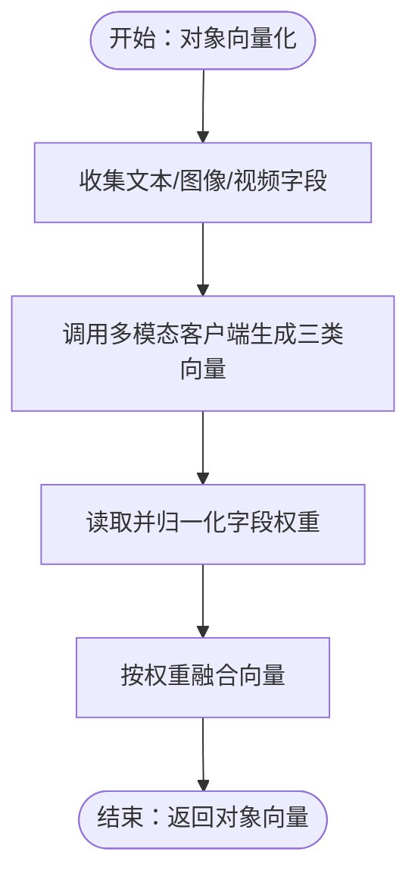
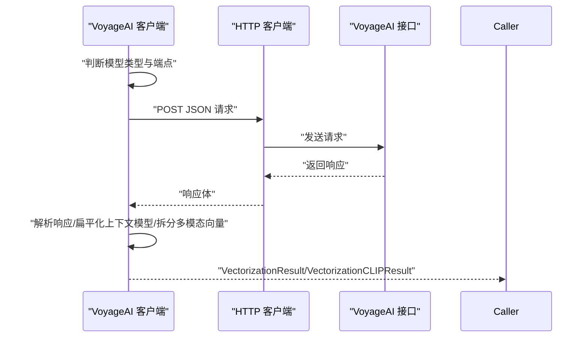
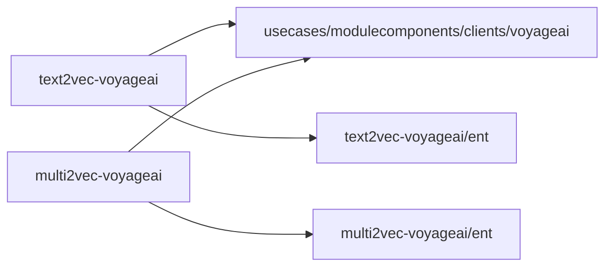

# VoyageAI 多模态向量化

<cite>
**本文引用的文件**
- [modules/text2vec-voyageai/module.go](file://modules/text2vec-voyageai/module.go)
- [modules/text2vec-voyageai/clients/voyageai.go](file://modules/text2vec-voyageai/clients/voyageai.go)
- [modules/text2vec-voyageai/ent/class_settings.go](file://modules/text2vec-voyageai/ent/class_settings.go)
- [modules/multi2vec-voyageai/module.go](file://modules/multi2vec-voyageai/module.go)
- [modules/multi2vec-voyageai/clients/voyageai.go](file://modules/multi2vec-voyageai/clients/voyageai.go)
- [modules/multi2vec-voyageai/vectorizer/vectorizer.go](file://modules/multi2vec-voyageai/vectorizer/vectorizer.go)
- [modules/multi2vec-voyageai/ent/class_settings.go](file://modules/multi2vec-voyageai/ent/class_settings.go)
- [usecases/modulecomponents/clients/voyageai/voyageai.go](file://usecases/modulecomponents/clients/voyageai/voyageai.go)
</cite>

## 目录
1. [简介](#简介)
2. [项目结构](#项目结构)
3. [核心组件](#核心组件)
4. [架构总览](#架构总览)
5. [详细组件分析](#详细组件分析)
6. [依赖关系分析](#依赖关系分析)
7. [性能考量](#性能考量)
8. [故障排查指南](#故障排查指南)
9. [结论](#结论)
10. [附录：配置与使用示例](#附录配置与使用示例)

## 简介
本文件为 Weaviate 的 VoyageAI 多模态向量化模块提供系统化技术文档。Weaviate 通过内置的 text2vec-voyageai 与 multi2vec-voyageai 模块，集成 VoyageAI 的多模态嵌入能力，支持文本、图像与视频的联合向量化，并提供 nearText、nearImage、nearVideo 等查询能力。该模块在以下方面具备显著优势：
- 长文本处理：通过可配置的截断策略与上下文模型支持，平衡长文本与高维语义表达。
- 多语言支持：Voyage 模型在多语言场景下具备稳健的跨语言语义对齐能力，适合国际化应用。
- 领域适应：通过输出维度裁剪与权重融合，适配电商、内容推荐、知识管理等垂直领域。
- 跨模态语义对齐：统一的向量空间使得文本、图像、视频在同一语义空间内进行检索与匹配。
- API 版本与路由：模块自动根据模型类型选择合适的端点（常规/上下文），并支持自定义 baseURL 与输入类型。
- 会话与速率控制：基于令牌与请求数的速率限制机制，结合上下文头与环境变量灵活配置。

## 项目结构
围绕 VoyageAI 的模块位于 modules/text2vec-voyageai 与 modules/multi2vec-voyageai，分别负责纯文本与多模态向量化；底层通用客户端位于 usecases/modulecomponents/clients/voyageai。



**图表来源**
- [modules/text2vec-voyageai/module.go](file://modules/text2vec-voyageai/module.go#L61-L131)
- [modules/text2vec-voyageai/clients/voyageai.go](file://modules/text2vec-voyageai/clients/voyageai.go#L77-L92)
- [modules/text2vec-voyageai/ent/class_settings.go](file://modules/text2vec-voyageai/ent/class_settings.go#L32-L62)
- [modules/multi2vec-voyageai/module.go](file://modules/multi2vec-voyageai/module.go#L33-L110)
- [modules/multi2vec-voyageai/clients/voyageai.go](file://modules/multi2vec-voyageai/clients/voyageai.go#L49-L101)
- [modules/multi2vec-voyageai/vectorizer/vectorizer.go](file://modules/multi2vec-voyageai/vectorizer/vectorizer.go#L32-L147)
- [modules/multi2vec-voyageai/ent/class_settings.go](file://modules/multi2vec-voyageai/ent/class_settings.go#L34-L92)
- [usecases/modulecomponents/clients/voyageai/voyageai.go](file://usecases/modulecomponents/clients/voyageai/voyageai.go#L136-L145)

**章节来源**
- [modules/text2vec-voyageai/module.go](file://modules/text2vec-voyageai/module.go#L1-L186)
- [modules/multi2vec-voyageai/module.go](file://modules/multi2vec-voyageai/module.go#L1-L144)

## 核心组件
- 文本向量化模块（text2vec-voyageai）
  - 初始化与生命周期：从环境变量加载 API Key，构造客户端与批处理向量化器，注册 GraphQL nearText 参数与额外属性提供者。
  - 批处理策略：基于模型的令牌上限与对象数量限制，结合令牌倍数估算，控制批大小与超时。
  - 配置项：model、baseURL、truncate、dimensions 等。
- 多模态向量化模块（multi2vec-voyageai）
  - 对象级向量化：按类配置识别文本/图像/视频字段，调用多模态客户端生成三类向量，再按权重融合。
  - 查询能力：支持 nearText、nearImage、nearVideo 的独立向量化查询。
  - 配置项：baseURL、model、truncate，以及各模态字段的权重配置。
- 通用客户端（usecases/modulecomponents/clients/voyageai）
  - 请求路由：根据模型是否为上下文模型自动切换端点（常规/上下文）。
  - 请求体格式：常规模型使用一维输入数组；上下文模型使用二维输入数组；多模态模型使用混合内容数组。
  - 响应解析：统一解析为扁平向量结果，支持 usage 统计与错误消息。
  - 速率限制：支持从上下文头或默认值获取 RPM/TPM，并在每次请求后更新剩余限额。

**章节来源**
- [modules/text2vec-voyageai/module.go](file://modules/text2vec-voyageai/module.go#L36-L97)
- [modules/multi2vec-voyageai/module.go](file://modules/multi2vec-voyageai/module.go#L62-L110)
- [usecases/modulecomponents/clients/voyageai/voyageai.go](file://usecases/modulecomponents/clients/voyageai/voyageai.go#L147-L245)

## 架构总览
下图展示了 Weaviate 与 VoyageAI 的交互流程，包括请求路由、参数映射与响应解析。



**图表来源**
- [usecases/modulecomponents/clients/voyageai/voyageai.go](file://usecases/modulecomponents/clients/voyageai/voyageai.go#L147-L245)
- [modules/text2vec-voyageai/clients/voyageai.go](file://modules/text2vec-voyageai/clients/voyageai.go#L83-L104)
- [modules/multi2vec-voyageai/clients/voyageai.go](file://modules/multi2vec-voyageai/clients/voyageai.go#L55-L101)

## 详细组件分析

### 文本向量化模块（text2vec-voyageai）
- 初始化与依赖注入
  - 从环境变量读取 API Key，构造 HTTP 客户端与 URL 构建器。
  - 注入批处理向量化器，设置令牌倍数、最大对象/令牌限制与超时。
- 批处理与令牌估算
  - 不同模型的令牌上限不同，模块根据模型动态调整批次大小与令牌限制。
- GraphQL 与 nearText
  - 通过扩展其他模块的 nearText 变换器，实现 GraphQL nearText 参数解析与执行。

```mermaid
classDiagram
class Text2VecModule {
+Name() string
+Type() ModuleType
+Init(ctx, params) error
+InitExtension(modules) error
+VectorizeObject(ctx, obj, cfg) ([]float32, AdditionalProps, error)
+MetaInfo() map[string]interface{}
}
class Vectorizer {
+Object(ctx, obj, cfg) ([]float32, AdditionalProps, error)
+Texts(ctx, texts, cfg) ([]float32, error)
}
class Client {
+Vectorize(ctx, input, settings) (VectorizationResult, RateLimits, int, error)
+VectorizeQuery(ctx, input, settings) (VectorizationResult, error)
+GetVectorizerRateLimit(ctx, modelRL) RateLimits
}
Text2VecModule --> Vectorizer : "组合"
Vectorizer --> Client : "依赖"
```

**图表来源**
- [modules/text2vec-voyageai/module.go](file://modules/text2vec-voyageai/module.go#L61-L131)
- [modules/text2vec-voyageai/clients/voyageai.go](file://modules/text2vec-voyageai/clients/voyageai.go#L77-L114)

**章节来源**
- [modules/text2vec-voyageai/module.go](file://modules/text2vec-voyageai/module.go#L83-L131)
- [modules/text2vec-voyageai/clients/voyageai.go](file://modules/text2vec-voyageai/clients/voyageai.go#L28-L46)

### 多模态向量化模块（multi2vec-voyageai）
- 对象级向量化
  - 依据类配置识别文本/图像/视频字段，分别收集输入，调用多模态客户端生成三类向量。
  - 使用权重归一化后对向量进行加权融合，得到最终对象向量。
- 查询能力
  - nearText、nearImage、nearVideo 分别调用对应查询向量化接口。
- 类配置
  - 支持 baseURL、model、truncate，以及文本/图像/视频字段的权重配置。



**图表来源**
- [modules/multi2vec-voyageai/vectorizer/vectorizer.go](file://modules/multi2vec-voyageai/vectorizer/vectorizer.go#L96-L147)
- [modules/multi2vec-voyageai/ent/class_settings.go](file://modules/multi2vec-voyageai/ent/class_settings.go#L48-L92)

**章节来源**
- [modules/multi2vec-voyageai/vectorizer/vectorizer.go](file://modules/multi2vec-voyageai/vectorizer/vectorizer.go#L63-L147)
- [modules/multi2vec-voyageai/ent/class_settings.go](file://modules/multi2vec-voyageai/ent/class_settings.go#L34-L92)

### 通用客户端（VoyageAI）
- 请求路由与端点选择
  - 常规模型：/embeddings；上下文模型：/contextualizedembeddings；多模态模型：/multimodalembeddings。
  - 支持通过上下文头覆盖 baseURL。
- 请求体与响应解析
  - 常规模型：一维输入数组；上下文模型：二维输入数组；多模态模型：混合内容数组（文本/图像/视频）。
  - 上下文模型响应需扁平化处理；多模态模型按输入顺序拆分文本/图像/视频向量。
- 速率限制
  - 从上下文头或默认模型限额中获取 RPM/TPM，请求后按令牌使用量与请求次数更新剩余限额。



**图表来源**
- [usecases/modulecomponents/clients/voyageai/voyageai.go](file://usecases/modulecomponents/clients/voyageai/voyageai.go#L277-L357)

**章节来源**
- [usecases/modulecomponents/clients/voyageai/voyageai.go](file://usecases/modulecomponents/clients/voyageai/voyageai.go#L147-L245)

## 依赖关系分析
- 模块到客户端
  - text2vec-voyageai 与 multi2vec-voyageai 均依赖 usecases/modulecomponents/clients/voyageai 实现 HTTP 通信与请求/响应处理。
- 配置依赖
  - 两类模块均通过各自的 ent 包读取类配置（baseURL、model、truncate、dimensions、字段权重等）。
- 批处理与速率控制
  - text2vec-voyageai 通过内置批处理组件与速率限制函数对接 VoyageRLModel 限额。



**图表来源**
- [modules/text2vec-voyageai/module.go](file://modules/text2vec-voyageai/module.go#L117-L131)
- [modules/multi2vec-voyageai/module.go](file://modules/multi2vec-voyageai/module.go#L100-L110)
- [modules/text2vec-voyageai/ent/class_settings.go](file://modules/text2vec-voyageai/ent/class_settings.go#L32-L62)
- [modules/multi2vec-voyageai/ent/class_settings.go](file://modules/multi2vec-voyageai/ent/class_settings.go#L34-L92)

**章节来源**
- [modules/text2vec-voyageai/module.go](file://modules/text2vec-voyageai/module.go#L117-L131)
- [modules/multi2vec-voyageai/module.go](file://modules/multi2vec-voyageai/module.go#L100-L110)

## 性能考量
- 批处理优化
  - 根据模型动态设定最大令牌数与对象数，避免单次请求过大导致超时或失败。
  - 令牌倍数用于近似 Go 语言编码开销，提升批处理吞吐。
- 向量融合
  - 多模态向量化采用权重归一化后融合，确保不同模态贡献均衡，减少噪声影响。
- 速率限制
  - 结合 RPM/TPM 与上下文头动态限额，降低限流风险；请求后即时更新剩余限额，保证后续请求准确。

[本节为通用性能建议，不直接分析具体文件]

## 故障排查指南
- 缺少 API Key
  - 若请求头与环境变量均未提供，将报错提示未找到 API Key。
- 网络与端点问题
  - 当响应非 200 时，客户端会返回包含状态码与错误详情的消息；检查 baseURL 与模型名称。
- 响应为空
  - 若返回向量为空，检查输入格式与模型支持情况；多模态模型需确保输入顺序与类型正确。
- 速率限制
  - 若频繁触发限流，检查上下文头中的 RPM/TPM 设置或降低批大小与并发。

**章节来源**
- [usecases/modulecomponents/clients/voyageai/voyageai.go](file://usecases/modulecomponents/clients/voyageai/voyageai.go#L388-L398)
- [usecases/modulecomponents/clients/voyageai/voyageai.go](file://usecases/modulecomponents/clients/voyageai/voyageai.go#L345-L356)
- [usecases/modulecomponents/clients/voyageai/voyageai.go](file://usecases/modulecomponents/clients/voyageai/voyageai.go#L408-L434)

## 结论
Weaviate 的 VoyageAI 多模态向量化模块通过清晰的模块化设计与通用客户端抽象，实现了对文本、图像与视频的统一向量化与查询能力。模块在长文本处理、多语言支持与领域适应方面具备良好表现，并通过批处理与速率限制机制保障生产可用性。对于跨境电商、内容推荐与知识管理等国际化场景，该模块能够提供稳定高效的跨模态语义检索能力。

[本节为总结性内容，不直接分析具体文件]

## 附录：配置与使用示例

### 环境与访问配置
- API Key 获取与设置
  - 优先从请求上下文头 X-Voyageai-Api-Key 读取；若不存在，则回退至环境变量 VOYAGEAI_APIKEY。
- 自定义 baseURL
  - 可通过请求上下文头 X-Voyageai-Baseurl 覆盖默认基础地址；否则使用模块默认地址。

**章节来源**
- [usecases/modulecomponents/clients/voyageai/voyageai.go](file://usecases/modulecomponents/clients/voyageai/voyageai.go#L373-L379)
- [usecases/modulecomponents/clients/voyageai/voyageai.go](file://usecases/modulecomponents/clients/voyageai/voyageai.go#L388-L398)

### 文本向量化配置要点
- 关键参数
  - model：指定模型名称（如 voy age-3、voyage-4、voyage-context-3 等）。
  - baseURL：自定义服务地址（可选）。
  - truncate：是否截断（默认开启）。
  - dimensions：输出维度裁剪（可选）。
- 批处理策略
  - 不同模型的最大令牌数与对象数不同，模块会据此调整批大小与超时。

**章节来源**
- [modules/text2vec-voyageai/ent/class_settings.go](file://modules/text2vec-voyageai/ent/class_settings.go#L20-L55)
- [modules/text2vec-voyageai/module.go](file://modules/text2vec-voyageai/module.go#L36-L59)

### 多模态向量化配置要点
- 关键参数
  - model：多模态模型名称（如 voyage-multimodal-3）。
  - baseURL：自定义服务地址（可选）。
  - truncate：是否截断（默认开启）。
  - 字段权重：分别为文本/图像/视频字段设置权重，模块会进行归一化融合。
- 输入类型
  - 文档向量化：InputType=Document。
  - 查询向量化：InputType=Query。

**章节来源**
- [modules/multi2vec-voyageai/ent/class_settings.go](file://modules/multi2vec-voyageai/ent/class_settings.go#L19-L92)
- [modules/multi2vec-voyageai/clients/voyageai.go](file://modules/multi2vec-voyageai/clients/voyageai.go#L55-L101)

### nearText/nearImage/nearVideo 使用与最佳实践
- nearText
  - 文本查询向量化：调用 VectorizeQuery，InputType=Query。
  - 适用于多语言与长文本场景，建议结合 truncate 与 dimensions 控制向量质量与长度。
- nearImage
  - 图像查询向量化：支持传入图像 base64 或 data URI，客户端自动封装为多模态输入。
  - 建议对大尺寸图像进行预处理以提升速度与稳定性。
- nearVideo
  - 视频查询向量化：支持传入视频 base64 或 data URI，客户端自动封装为多模态输入。
  - 建议对视频进行抽帧或片段切分，以平衡精度与性能。

**章节来源**
- [modules/text2vec-voyageai/clients/voyageai.go](file://modules/text2vec-voyageai/clients/voyageai.go#L94-L104)
- [modules/multi2vec-voyageai/clients/voyageai.go](file://modules/multi2vec-voyageai/clients/voyageai.go#L79-L101)
- [usecases/modulecomponents/clients/voyageai/voyageai.go](file://usecases/modulecomponents/clients/voyageai/voyageai.go#L247-L275)

### 应用场景与效果
- 跨境电商
  - 利用多语言文本与商品图片的联合向量化，实现跨语言商品检索与视觉相似度匹配。
- 内容推荐
  - 将文章文本、封面图与短视频片段统一向量化，提升跨媒体内容的协同过滤与个性化推荐效果。
- 知识管理
  - 对文档、图表与演示视频进行统一向量化，支持跨模态的知识检索与问答。

[本节为概念性说明，不直接分析具体文件]