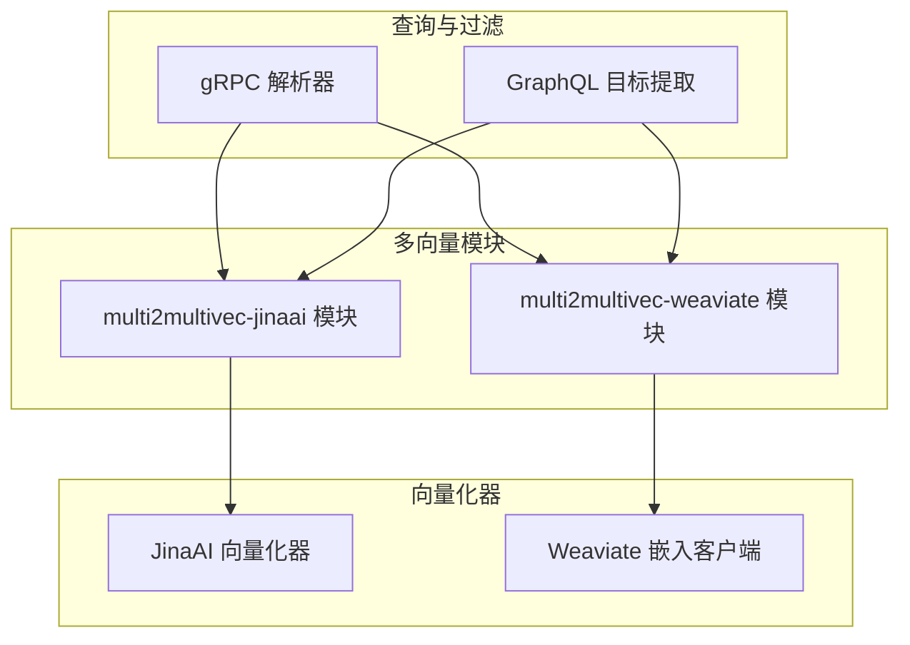
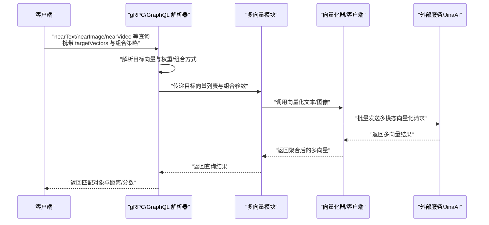
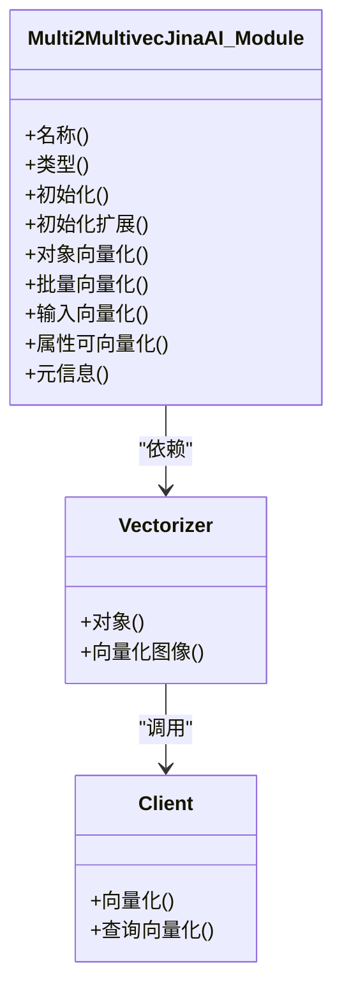
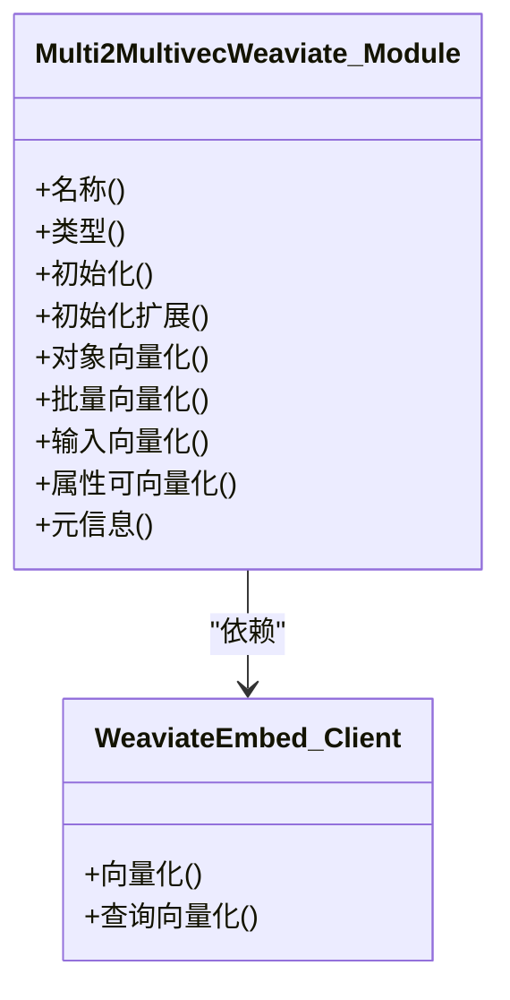
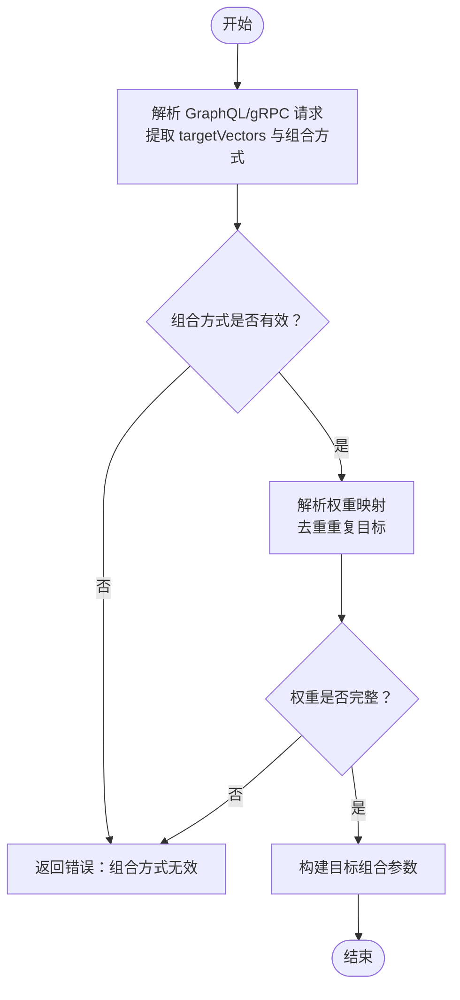
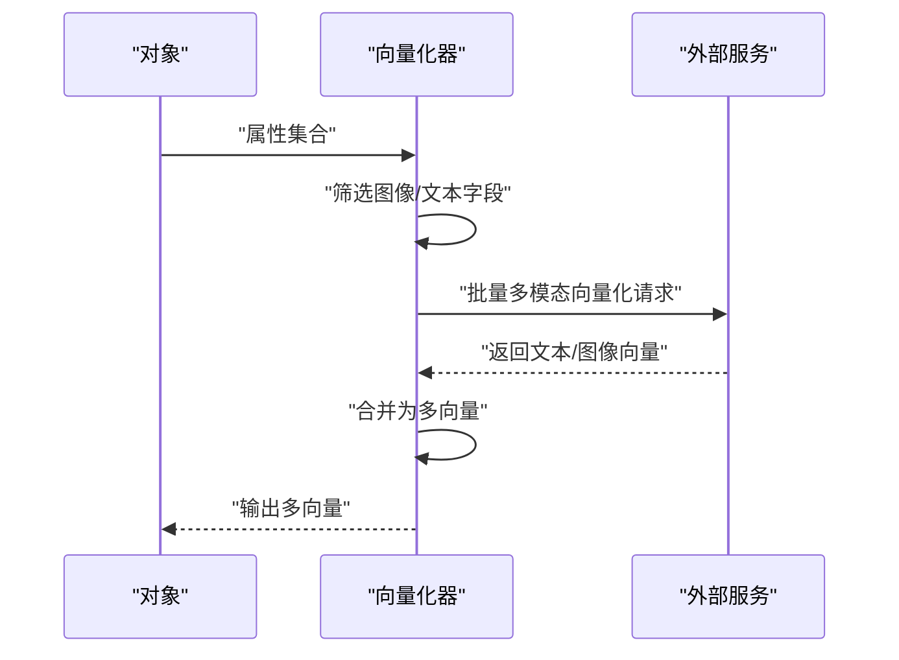
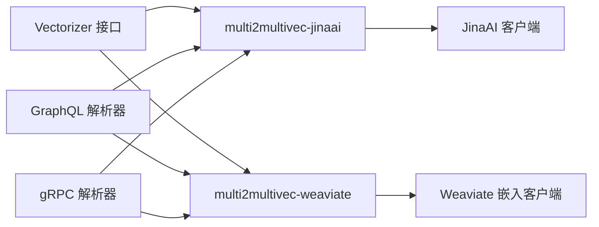

# 多向量多模态向量化

<cite>
**本文引用的文件**
- [modules/multi2multivec-jinaai/module.go](file://modules/multi2multivec-jinaai/module.go)
- [modules/multi2multivec-weaviate/module.go](file://modules/multi2multivec-weaviate/module.go)
- [modules/multi2multivec-jinaai/vectorizer/vectorizer.go](file://modules/multi2multivec-jinaai/vectorizer/vectorizer.go)
- [modules/multi2multivec-weaviate/clients/weaviate_embed.go](file://modules/multi2multivec-weaviate/clients/weaviate_embed.go)
- [entities/modulecapabilities/vectorizer.go](file://entities/modulecapabilities/vectorizer.go)
- [adapters/handlers/grpc/v1/parse_search_request.go](file://adapters/handlers/grpc/v1/parse_search_request.go)
- [adapters/handlers/graphql/local/common_filters/extract_targets.go](file://adapters/handlers/graphql/local/common_filters/extract_targets.go)
- [test/modules/multi2multivec-jinaai/multi2multivec_jinaai_test.go](file://test/modules/multi2multivec-jinaai/multi2multivec_jinaai_test.go)
- [test/acceptance/grpc/grpc_search_test.go](file://test/acceptance/grpc/grpc_search_test.go)
</cite>

## 目录
1. [简介](#简介)
2. [项目结构](#项目结构)
3. [核心组件](#核心组件)
4. [架构总览](#架构总览)
5. [组件详解](#组件详解)
6. [依赖关系分析](#依赖关系分析)
7. [性能与内存优化](#性能与内存优化)
8. [故障排查指南](#故障排查指南)
9. [结论](#结论)
10. [附录：配置与使用示例](#附录配置与使用示例)

## 简介
本技术文档聚焦 Weaviate 的“多向量多模态向量化”能力，系统阐述如何同时生成多个向量表示以提升检索精度与覆盖范围。文档重点解析两类实现路径：
- 基于外部服务（如 JinaAI）的多向量向量化模块
- Weaviate 自研的多向量向量化模块

内容涵盖：
- 多向量策略在检索中的作用机制
- JinaAI 与 Weaviate 自研模块的实现差异与适用场景
- 启用多向量模式、设置向量组合策略与管理存储开销的方法
- 向量聚合、权重分配与去重处理的技术细节
- 查询性能优化、内存管理与计算复杂度控制
- 在复杂检索任务中的优势与局限性，并给出面向高级应用开发者的最佳实践

## 项目结构
围绕多向量多模态向量化，Weaviate 在模块层提供了两个实现：
- multi2multivec-jinaai：通过外部 JinaAI 接口批量生成文本与图像的多模态嵌入，支持多向量对象向量化与查询向量化
- multi2multivec-weaviate：基于 Weaviate 自研嵌入客户端，提供图像输入的多向量向量化与查询向量化能力（当前不支持文本输入）

二者均遵循统一的模块接口，支持对象批量向量化、属性可向量化探测、元信息查询等。

图表来源
- [modules/multi2multivec-jinaai/module.go](file://modules/multi2multivec-jinaai/module.go#L60-L104)
- [modules/multi2multivec-weaviate/module.go](file://modules/multi2multivec-weaviate/module.go#L90-L97)
- [adapters/handlers/grpc/v1/parse_search_request.go](file://adapters/handlers/grpc/v1/parse_search_request.go#L128-L169)
- [adapters/handlers/graphql/local/common_filters/extract_targets.go](file://adapters/handlers/graphql/local/common_filters/extract_targets.go#L43-L81)

章节来源
- [modules/multi2multivec-jinaai/module.go](file://modules/multi2multivec-jinaai/module.go#L60-L104)
- [modules/multi2multivec-weaviate/module.go](file://modules/multi2multivec-weaviate/module.go#L90-L97)

## 核心组件
- 模块接口与能力
  - 多向量模块需实现模块接口与向量化接口，支持对象向量化、批量向量化、输入向量化、属性可向量化探测与元信息查询
- JinaAI 多向量模块
  - 初始化外部客户端，支持文本与图像字段的多模态向量化；对象向量化时按配置收集文本/图像字段并调用外部接口
- Weaviate 自研多向量模块
  - 使用内置嵌入客户端，支持图像输入的多向量向量化与查询向量化；当前不支持文本输入

章节来源
- [entities/modulecapabilities/vectorizer.go](file://entities/modulecapabilities/vectorizer.go#L25-L53)
- [modules/multi2multivec-jinaai/module.go](file://modules/multi2multivec-jinaai/module.go#L60-L104)
- [modules/multi2multivec-weaviate/module.go](file://modules/multi2multivec-weaviate/module.go#L90-L97)

## 架构总览
下图展示了从请求到向量生成与组合的关键流程，包括 gRPC/GraphQL 层的目标向量与组合策略解析、模块初始化与外部服务调用、以及最终的向量聚合与返回。

图表来源
- [adapters/handlers/grpc/v1/parse_search_request.go](file://adapters/handlers/grpc/v1/parse_search_request.go#L128-L169)
- [adapters/handlers/grpc/v1/parse_search_request.go](file://adapters/handlers/grpc/v1/parse_search_request.go#L942-L984)
- [adapters/handlers/graphql/local/common_filters/extract_targets.go](file://adapters/handlers/graphql/local/common_filters/extract_targets.go#L43-L81)
- [modules/multi2multivec-jinaai/vectorizer/vectorizer.go](file://modules/multi2multivec-jinaai/vectorizer/vectorizer.go#L53-L115)
- [modules/multi2multivec-weaviate/clients/weaviate_embed.go](file://modules/multi2multivec-weaviate/clients/weaviate_embed.go#L41-L76)

## 组件详解

### JinaAI 多向量模块
- 初始化与扩展
  - 从环境变量加载密钥，初始化外部客户端与向量化器；注册 nearText/nearImage 的 GraphQL 参数与搜索器
- 对象向量化
  - 遍历对象属性，根据配置识别图像/文本字段，调用外部接口批量生成多模态向量；若同时存在文本与图像，合并为多向量
- 查询向量化
  - 支持对文本输入进行查询向量化，返回多向量结果

图表来源
- [modules/multi2multivec-jinaai/module.go](file://modules/multi2multivec-jinaai/module.go#L60-L104)
- [modules/multi2multivec-jinaai/vectorizer/vectorizer.go](file://modules/multi2multivec-jinaai/vectorizer/vectorizer.go#L53-L115)

章节来源
- [modules/multi2multivec-jinaai/module.go](file://modules/multi2multivec-jinaai/module.go#L60-L104)
- [modules/multi2multivec-jinaai/vectorizer/vectorizer.go](file://modules/multi2multivec-jinaai/vectorizer/vectorizer.go#L53-L115)

### Weaviate 自研多向量模块
- 初始化与扩展
  - 初始化内置嵌入客户端与向量化器；注册 nearText 的 GraphQL 参数与搜索器
- 对象向量化
  - 调用内置客户端进行图像输入的多向量向量化；当前不支持文本输入
- 查询向量化
  - 支持对文本输入进行查询向量化，返回多向量结果

图表来源
- [modules/multi2multivec-weaviate/module.go](file://modules/multi2multivec-weaviate/module.go#L90-L97)
- [modules/multi2multivec-weaviate/clients/weaviate_embed.go](file://modules/multi2multivec-weaviate/clients/weaviate_embed.go#L41-L76)

章节来源
- [modules/multi2multivec-weaviate/module.go](file://modules/multi2multivec-weaviate/module.go#L90-L97)
- [modules/multi2multivec-weaviate/clients/weaviate_embed.go](file://modules/multi2multivec-weaviate/clients/weaviate_embed.go#L41-L76)

### 查询目标与组合策略
- 目标向量解析
  - gRPC/GraphQL 层负责解析查询中的目标向量列表与组合策略（平均、求和、最小值、手动权重、相对得分）
- 权重与去重
  - GraphQL 层支持为每个目标向量指定权重，自动去重重复目标并校验权重完整性
- 多向量查询
  - 测试用例覆盖了多种组合方式与权重配置，确保查询端能正确传递目标向量与权重

图表来源
- [adapters/handlers/grpc/v1/parse_search_request.go](file://adapters/handlers/grpc/v1/parse_search_request.go#L128-L169)
- [adapters/handlers/graphql/local/common_filters/extract_targets.go](file://adapters/handlers/graphql/local/common_filters/extract_targets.go#L43-L81)

章节来源
- [adapters/handlers/grpc/v1/parse_search_request.go](file://adapters/handlers/grpc/v1/parse_search_request.go#L128-L169)
- [adapters/handlers/graphql/local/common_filters/extract_targets.go](file://adapters/handlers/graphql/local/common_filters/extract_targets.go#L43-L81)
- [test/acceptance/grpc/grpc_search_test.go](file://test/acceptance/grpc/grpc_search_test.go#L487-L511)

### 多向量对象向量化流程（JinaAI）
- 输入准备
  - 遍历对象属性，识别图像/文本字段
- 批量调用
  - 将文本与图像输入一并发送至外部接口，获取多模态向量
- 结果整合
  - 若同时产生文本与图像向量，合并为多向量；若无可用输入则报错

图表来源
- [modules/multi2multivec-jinaai/vectorizer/vectorizer.go](file://modules/multi2multivec-jinaai/vectorizer/vectorizer.go#L72-L115)

章节来源
- [modules/multi2multivec-jinaai/vectorizer/vectorizer.go](file://modules/multi2multivec-jinaai/vectorizer/vectorizer.go#L72-L115)

## 依赖关系分析
- 模块与接口
  - 多向量模块实现统一的模块接口与向量化接口，确保与 Weaviate 核心检索流程无缝集成
- 外部依赖
  - JinaAI 模块依赖外部 API 客户端；Weaviate 自研模块依赖内置嵌入客户端
- 查询层依赖
  - gRPC/GraphQL 解析器负责将查询参数转换为内部目标组合参数，再交由模块执行

图表来源
- [entities/modulecapabilities/vectorizer.go](file://entities/modulecapabilities/vectorizer.go#L25-L53)
- [modules/multi2multivec-jinaai/module.go](file://modules/multi2multivec-jinaai/module.go#L60-L104)
- [modules/multi2multivec-weaviate/module.go](file://modules/multi2multivec-weaviate/module.go#L90-L97)

章节来源
- [entities/modulecapabilities/vectorizer.go](file://entities/modulecapabilities/vectorizer.go#L25-L53)
- [modules/multi2multivec-jinaai/module.go](file://modules/multi2multivec-jinaai/module.go#L60-L104)
- [modules/multi2multivec-weaviate/module.go](file://modules/multi2multivec-weaviate/module.go#L90-L97)

## 性能与内存优化
- 批量向量化
  - Weaviate 自研模块提供批量向量化入口，减少外部调用次数与网络开销
- 组合策略选择
  - 平均/求和/最小值等组合方式在不同数据分布下的性能与稳定性不同，建议结合业务场景选择
- 权重与去重
  - 合理设置权重并避免冗余目标向量，有助于降低计算与存储开销
- 存储开销管理
  - 多向量会增加存储与索引开销，应结合向量维度与数量评估成本

[本节为通用性能讨论，无需列出具体文件来源]

## 故障排查指南
- 常见问题
  - 未配置外部 API 密钥或密钥无效：JinaAI 模块初始化失败
  - 文本输入不被支持：Weaviate 自研模块当前不支持文本输入
  - 目标向量与权重不匹配：GraphQL 层会校验权重完整性并返回错误
  - 查询参数冲突：gRPC/GraphQL 层禁止同时提供距离与置信度
- 定位方法
  - 查看模块初始化日志与外部服务响应
  - 检查 GraphQL/gRPC 请求中 targetVectors 与组合方式是否一致
  - 确认对象属性中是否存在配置的图像/文本字段

章节来源
- [modules/multi2multivec-jinaai/module.go](file://modules/multi2multivec-jinaai/module.go#L94-L104)
- [modules/multi2multivec-weaviate/clients/weaviate_embed.go](file://modules/multi2multivec-weaviate/clients/weaviate_embed.go#L41-L76)
- [adapters/handlers/grpc/v1/parse_search_request.go](file://adapters/handlers/grpc/v1/parse_search_request.go#L128-L169)
- [adapters/handlers/graphql/local/common_filters/extract_targets.go](file://adapters/handlers/graphql/local/common_filters/extract_targets.go#L43-L81)

## 结论
- 多向量多模态向量化通过同时生成多个向量表示，显著提升了跨模态检索的精度与覆盖范围
- JinaAI 模块适合需要外部高质量多模态模型的场景；Weaviate 自研模块适合对部署与隐私有更高要求的场景
- 正确配置目标向量与组合策略、合理分配权重并进行去重，是获得稳定性能与较低存储开销的关键
- 在复杂检索任务中，建议结合业务语料与数据分布，选择合适的组合方式与权重策略，并持续监控性能与成本

[本节为总结性内容，无需列出具体文件来源]

## 附录：配置与使用示例
以下示例展示如何启用多向量模式、设置向量组合策略与管理存储开销。请根据实际需求调整字段与权重。

- 启用多向量模式（Schema 示例）
  - 为类配置向量化器与向量索引，开启多向量支持
  - 参考测试用例中的类定义与向量配置

- 设置向量组合策略（GraphQL 示例）
  - 指定目标向量列表与组合方式（平均/求和/最小值/手动权重/相对得分）
  - 为每个目标向量提供权重映射，确保权重与目标向量一一对应

- 管理存储开销
  - 控制向量维度与目标向量数量，避免过度膨胀
  - 选择合适的组合方式，减少冗余向量

章节来源
- [test/modules/multi2multivec-jinaai/multi2multivec_jinaai_test.go](file://test/modules/multi2multivec-jinaai/multi2multivec_jinaai_test.go#L31-L47)
- [adapters/handlers/graphql/local/common_filters/extract_targets.go](file://adapters/handlers/graphql/local/common_filters/extract_targets.go#L43-L81)
- [test/acceptance/grpc/grpc_search_test.go](file://test/acceptance/grpc/grpc_search_test.go#L487-L511)
- [test/acceptance/grpc/grpc_search_test.go](file://test/acceptance/grpc/grpc_search_test.go#L855-L889)
- [test/acceptance/grpc/grpc_search_test.go](file://test/acceptance/grpc/grpc_search_test.go#L927-L961)