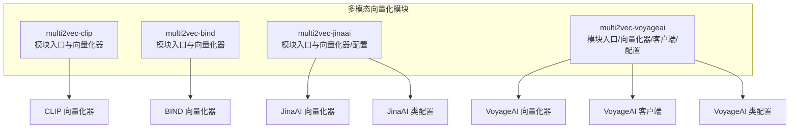
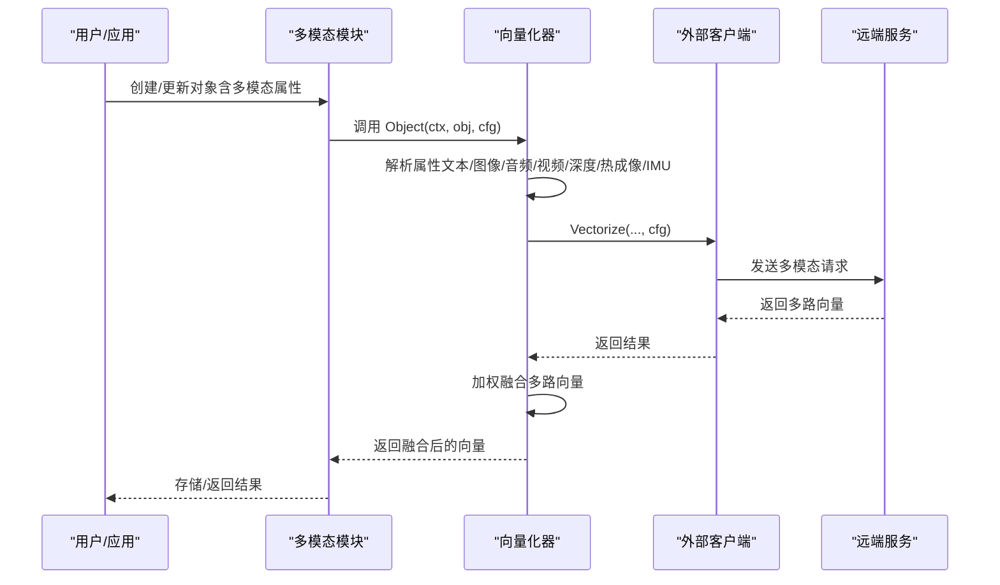
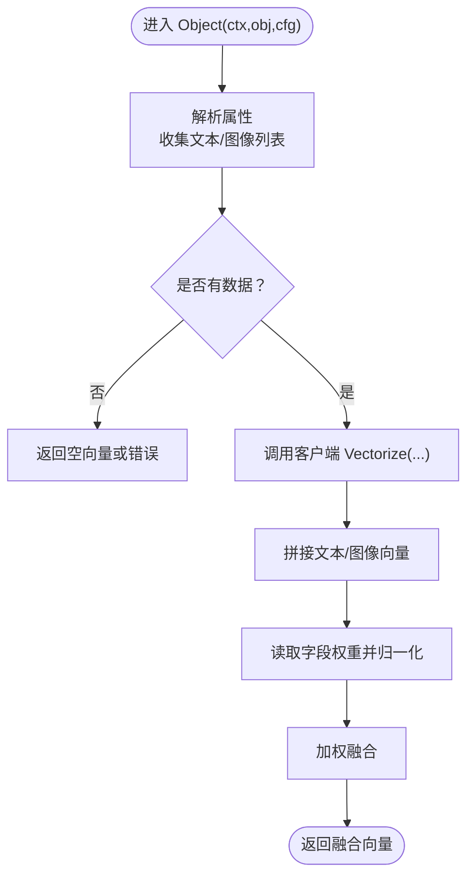
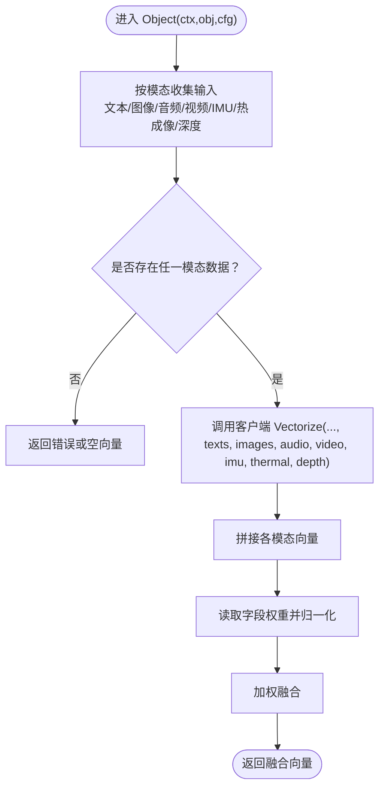
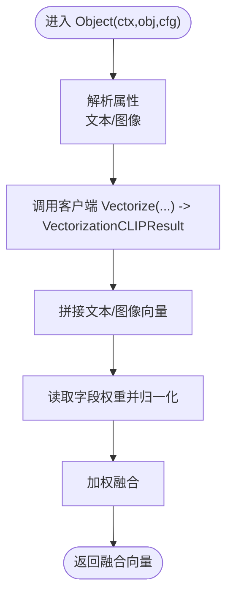
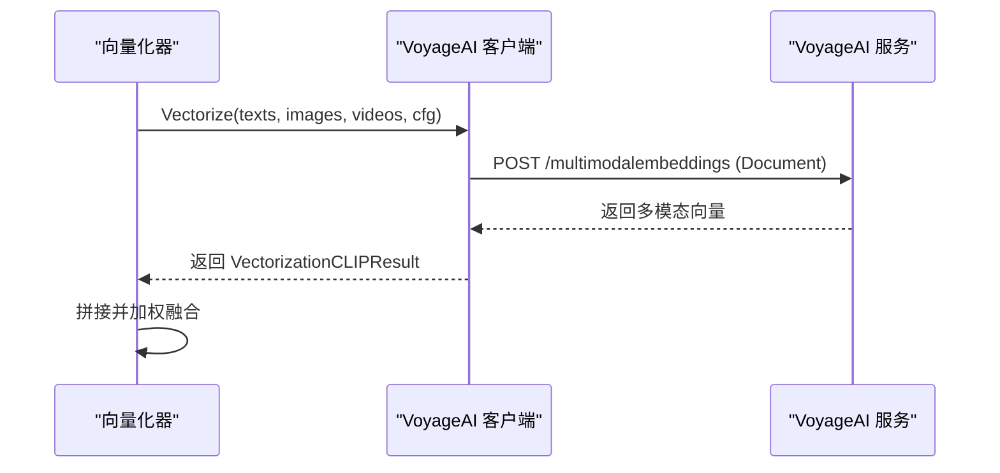
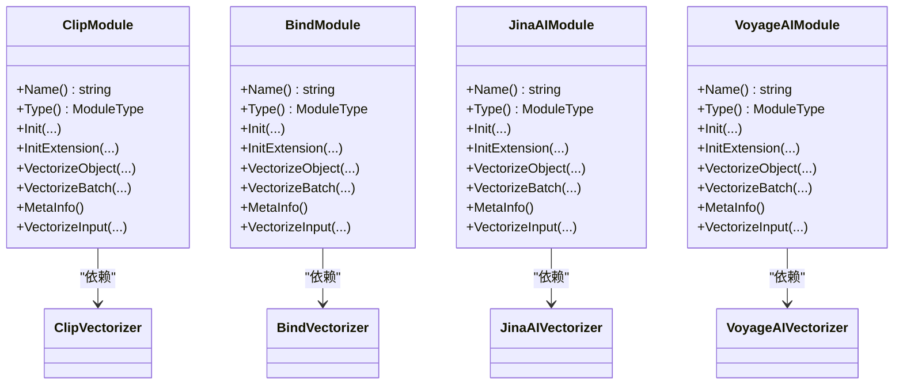

# 多模态向量化模块

<cite>
**本文引用的文件**   
- [modules/multi2vec-clip/module.go](file://modules/multi2vec-clip/module.go)
- [modules/multi2vec-clip/vectorizer/vectorizer.go](file://modules/multi2vec-clip/vectorizer/vectorizer.go)
- [modules/multi2vec-bind/module.go](file://modules/multi2vec-bind/module.go)
- [modules/multi2vec-bind/vectorizer/vectorizer.go](file://modules/multi2vec-bind/vectorizer/vectorizer.go)
- [modules/multi2vec-jinaai/module.go](file://modules/multi2vec-jinaai/module.go)
- [modules/multi2vec-jinaai/vectorizer/vectorizer.go](file://modules/multi2vec-jinaai/vectorizer/vectorizer.go)
- [modules/multi2vec-jinaai/ent/class_settings.go](file://modules/multi2vec-jinaai/ent/class_settings.go)
- [modules/multi2vec-voyageai/module.go](file://modules/multi2vec-voyageai/module.go)
- [modules/multi2vec-voyageai/vectorizer/vectorizer.go](file://modules/multi2vec-voyageai/vectorizer/vectorizer.go)
- [modules/multi2vec-voyageai/clients/voyageai.go](file://modules/multi2vec-voyageai/clients/voyageai.go)
- [modules/multi2vec-voyageai/ent/class_settings.go](file://modules/multi2vec-voyageai/ent/class_settings.go)
- [test/modules/multi2vec-voyageai/multi2vec_voyageai_test.go](file://test/modules/multi2vec-voyageai/multi2vec_voyageai_test.go)
- [test/modules/multi2vec-jinaai/multi2vec_jinaai_test.go](file://test/modules/multi2vec-jinaai/multi2vec_jinaai_test.go)
</cite>

## 目录
1. [简介](#简介)
2. [项目结构](#项目结构)
3. [核心组件](#核心组件)
4. [架构总览](#架构总览)
5. [详细组件分析](#详细组件分析)
6. [依赖关系分析](#依赖关系分析)
7. [性能考量](#性能考量)
8. [故障排查指南](#故障排查指南)
9. [结论](#结论)
10. [附录：配置与使用示例路径](#附录配置与使用示例路径)

## 简介
本文件系统性梳理 Weaviate 的多模态向量化模块，覆盖文本、图像、视频等多模态输入的统一向量化流程，重点解析 CLIP、BIND、JinaAI、VoyageAI 四类多模态向量化器的实现原理、配置方式与使用方法；阐述跨模态嵌入对齐、联合特征提取与模态融合策略；并提供可直接定位到源码的示例路径，帮助研究人员与开发者快速上手。

## 项目结构
Weaviate 将多模态向量化能力以“模块化”形式组织在 modules 目录下，每个向量化器（如 multi2vec-clip、multi2vec-bind、multi2vec-jinaai、multi2vec-voyageai）均包含：
- 模块入口与生命周期管理（module.go）
- 向量化器实现（vectorizer/vectorizer.go）
- 类配置与校验（ent/class_settings.go）
- 客户端适配（clients/*，部分模块）

**图表来源**
- [modules/multi2vec-clip/module.go](file://modules/multi2vec-clip/module.go#L37-L47)
- [modules/multi2vec-bind/module.go](file://modules/multi2vec-bind/module.go#L36-L56)
- [modules/multi2vec-jinaai/module.go](file://modules/multi2vec-jinaai/module.go#L37-L46)
- [modules/multi2vec-voyageai/module.go](file://modules/multi2vec-voyageai/module.go#L37-L48)

**章节来源**
- [modules/multi2vec-clip/module.go](file://modules/multi2vec-clip/module.go#L31-L84)
- [modules/multi2vec-bind/module.go](file://modules/multi2vec-bind/module.go#L30-L118)
- [modules/multi2vec-jinaai/module.go](file://modules/multi2vec-jinaai/module.go#L31-L73)
- [modules/multi2vec-voyageai/module.go](file://modules/multi2vec-voyageai/module.go#L31-L79)

## 核心组件
- 模块接口与类型
  - 所有模块实现统一的模块接口，声明名称、类型（Multi2Vec）、初始化与扩展初始化、对象向量化、批量向量化、输入向量化、元信息查询等能力。
- 向量化器
  - 负责从对象属性中抽取多模态字段（文本/图像/音频/视频/深度/热成像/IMU），调用客户端进行远程向量化，并对多路向量进行加权融合。
- 类配置与校验
  - 统一的多模态基础设置封装，支持字段权重、模型参数、维度限制、URL/Truncate 等配置项，并提供校验逻辑。
- 客户端适配
  - 针对不同供应商（如 VoyageAI）封装请求与响应，区分查询与多模态输入模式。

**章节来源**
- [modules/multi2vec-clip/module.go](file://modules/multi2vec-clip/module.go#L63-L103)
- [modules/multi2vec-bind/module.go](file://modules/multi2vec-bind/module.go#L77-L137)
- [modules/multi2vec-jinaai/module.go](file://modules/multi2vec-jinaai/module.go#L52-L92)
- [modules/multi2vec-voyageai/module.go](file://modules/multi2vec-voyageai/module.go#L54-L98)

## 架构总览
多模态向量化在 Weaviate 中遵循“模块-向量化器-客户端”的分层设计。模块负责生命周期与 GraphQL/Near* 能力注册，向量化器负责属性解析与向量融合，客户端负责与外部服务通信。

**图表来源**
- [modules/multi2vec-clip/vectorizer/vectorizer.go](file://modules/multi2vec-clip/vectorizer/vectorizer.go#L52-L115)
- [modules/multi2vec-bind/vectorizer/vectorizer.go](file://modules/multi2vec-bind/vectorizer/vectorizer.go#L120-L185)
- [modules/multi2vec-voyageai/vectorizer/vectorizer.go](file://modules/multi2vec-voyageai/vectorizer/vectorizer.go#L96-L147)

## 详细组件分析

### CLIP 向量化器（multi2vec-clip）
- 实现要点
  - 模块入口：读取环境变量（推理服务地址、启动等待开关），初始化向量化器与 Near* 能力。
  - 向量化器：从对象属性中收集文本与图像字段，调用客户端执行向量化，随后按字段权重进行加权融合。
  - 支持批量向量化与输入向量化（文本）。
- 关键流程
  - 属性解析：遍历对象属性，根据类配置判断是否为文本/图像字段。
  - 融合策略：将各模态向量拼接后按权重归一化并加权求和。

**图表来源**
- [modules/multi2vec-clip/vectorizer/vectorizer.go](file://modules/multi2vec-clip/vectorizer/vectorizer.go#L70-L115)

**章节来源**
- [modules/multi2vec-clip/module.go](file://modules/multi2vec-clip/module.go#L71-L130)
- [modules/multi2vec-clip/vectorizer/vectorizer.go](file://modules/multi2vec-clip/vectorizer/vectorizer.go#L52-L115)

### BIND 向量化器（multi2vec-bind）
- 实现要点
  - 模块入口：支持图像、音频、视频、IMU、热成像、深度等多种模态的 Near* 能力注册。
  - 向量化器：支持多种模态输入，分别向客户端请求对应向量，并进行加权融合。
  - 支持单模态查询（如 VectorizeImage/Audio/Video/IMU/Thermal/Depth）与对象级融合。
- 关键流程
  - 属性解析：针对每种模态分别收集输入。
  - 融合策略：将多模态向量拼接后按权重归一化并加权求和。

**图表来源**
- [modules/multi2vec-bind/vectorizer/vectorizer.go](file://modules/multi2vec-bind/vectorizer/vectorizer.go#L120-L185)

**章节来源**
- [modules/multi2vec-bind/module.go](file://modules/multi2vec-bind/module.go#L85-L158)
- [modules/multi2vec-bind/vectorizer/vectorizer.go](file://modules/multi2vec-bind/vectorizer/vectorizer.go#L59-L185)

### JinaAI 向量化器（multi2vec-jinaai）
- 实现要点
  - 模块入口：通过环境变量初始化客户端，注册 NearImage/NearText 能力。
  - 向量化器：支持文本与图像字段，调用客户端 Vectorize(VectorizationCLIPResult)，随后按权重融合。
  - 类配置：支持 baseURL、model、dimensions 等参数，并对维度范围进行校验。
- 关键流程
  - 属性解析：根据类配置判断文本/图像字段。
  - 融合策略：将文本/图像向量拼接后按权重归一化并加权求和。

**图表来源**
- [modules/multi2vec-jinaai/vectorizer/vectorizer.go](file://modules/multi2vec-jinaai/vectorizer/vectorizer.go#L73-L119)

**章节来源**
- [modules/multi2vec-jinaai/module.go](file://modules/multi2vec-jinaai/module.go#L60-L104)
- [modules/multi2vec-jinaai/vectorizer/vectorizer.go](file://modules/multi2vec-jinaai/vectorizer/vectorizer.go#L54-L119)
- [modules/multi2vec-jinaai/ent/class_settings.go](file://modules/multi2vec-jinaai/ent/class_settings.go#L49-L109)

### VoyageAI 向量化器（multi2vec-voyageai）
- 实现要点
  - 模块入口：通过环境变量初始化客户端，注册 NearImage/NearText/NearVideo 能力。
  - 向量化器：支持文本、图像、视频字段，调用客户端 Vectorize(VectorizationCLIPResult)，随后按权重融合。
  - 客户端适配：区分 Vectorize、VectorizeQuery、VectorizeImageQuery、VectorizeVideoQuery，支持 Query/Document 输入类型与 truncate 控制。
  - 类配置：支持 baseURL、model、truncate 等参数。
- 关键流程
  - 属性解析：根据类配置判断文本/图像/视频字段。
  - 融合策略：将文本/图像/视频向量拼接后按权重归一化并加权求和。

**图表来源**
- [modules/multi2vec-voyageai/vectorizer/vectorizer.go](file://modules/multi2vec-voyageai/vectorizer/vectorizer.go#L96-L147)
- [modules/multi2vec-voyageai/clients/voyageai.go](file://modules/multi2vec-voyageai/clients/voyageai.go#L55-L101)

**章节来源**
- [modules/multi2vec-voyageai/module.go](file://modules/multi2vec-voyageai/module.go#L62-L110)
- [modules/multi2vec-voyageai/vectorizer/vectorizer.go](file://modules/multi2vec-voyageai/vectorizer/vectorizer.go#L63-L147)
- [modules/multi2vec-voyageai/clients/voyageai.go](file://modules/multi2vec-voyageai/clients/voyageai.go#L55-L101)
- [modules/multi2vec-voyageai/ent/class_settings.go](file://modules/multi2vec-voyageai/ent/class_settings.go#L48-L92)

## 依赖关系分析
- 模块与向量化器
  - 模块持有向量化器实例，负责生命周期初始化与 Near* 能力注册。
- 向量化器与客户端
  - 向量化器通过 Client 接口与外部服务交互，屏蔽具体供应商差异。
- 类配置与校验
  - 类配置封装了字段权重、模型参数、URL/Truncate 等，统一校验逻辑保证参数合法性。

**图表来源**
- [modules/multi2vec-clip/module.go](file://modules/multi2vec-clip/module.go#L37-L47)
- [modules/multi2vec-bind/module.go](file://modules/multi2vec-bind/module.go#L36-L56)
- [modules/multi2vec-jinaai/module.go](file://modules/multi2vec-jinaai/module.go#L37-L46)
- [modules/multi2vec-voyageai/module.go](file://modules/multi2vec-voyageai/module.go#L37-L48)

**章节来源**
- [modules/multi2vec-clip/module.go](file://modules/multi2vec-clip/module.go#L71-L130)
- [modules/multi2vec-bind/module.go](file://modules/multi2vec-bind/module.go#L85-L158)
- [modules/multi2vec-jinaai/module.go](file://modules/multi2vec-jinaai/module.go#L60-L104)
- [modules/multi2vec-voyageai/module.go](file://modules/multi2vec-voyageai/module.go#L62-L110)

## 性能考量
- 远程调用延迟
  - 多模态向量化通常依赖外部服务，网络延迟与并发请求数是关键瓶颈。建议合理设置超时与并发上限。
- 向量维度与权重
  - 不同模型输出维度不同，融合前需确保向量长度一致；权重归一化有助于稳定融合结果。
- 批量处理
  - 使用批量向量化接口可减少往返开销，提升吞吐。
- 缓存与预热
  - 对频繁访问的类配置进行缓存与启动等待优化，避免冷启动带来的首次延迟。

## 故障排查指南
- 环境变量未设置
  - CLIP/BIND 模块需要相应推理服务地址环境变量；未设置会导致初始化失败。
- 参数校验失败
  - JinaAI/VoyageAI 的类配置包含维度范围等约束，需按默认值与范围要求配置。
- 远端服务异常
  - 客户端会将远端错误透传，检查 API Key、URL、模型名与输入格式。

**章节来源**
- [modules/multi2vec-clip/module.go](file://modules/multi2vec-clip/module.go#L105-L123)
- [modules/multi2vec-bind/module.go](file://modules/multi2vec-bind/module.go#L139-L151)
- [modules/multi2vec-jinaai/ent/class_settings.go](file://modules/multi2vec-jinaai/ent/class_settings.go#L83-L109)
- [modules/multi2vec-voyageai/ent/class_settings.go](file://modules/multi2vec-voyageai/ent/class_settings.go#L90-L92)

## 结论
Weaviate 的多模态向量化模块通过清晰的分层设计与统一的类配置机制，实现了对文本、图像、视频等多模态输入的一致处理。CLIP、BIND、JinaAI、VoyageAI 各具特色：前者强调通用 CLIP 能力，后者支持更丰富的传感器模态；JinaAI/VoyageAI 提供多模态嵌入与查询模式，便于跨模态检索与联合查询。结合权重归一化与向量融合策略，可在实际业务中灵活构建高质量的多模态检索系统。

## 附录：配置与使用示例路径
以下示例展示了如何在测试中配置与使用多模态向量化器，读者可据此定位到具体实现与参数位置：

- CLIP（图像向量化与近邻检索）
  - 示例路径：[test/modules/multi2vec-voyageai/multi2vec_voyageai_test.go](file://test/modules/multi2vec-voyageai/multi2vec_voyageai_test.go#L28-L106)
  - 关键点：定义类与向量化配置（imageFields/textFields/weights/vectorizeClassName），导入数据后执行 nearImage 查询。

- JinaAI（多模态与模型选择）
  - 示例路径：[test/modules/multi2vec-jinaai/multi2vec_jinaai_test.go](file://test/modules/multi2vec-jinaai/multi2vec_jinaai_test.go#L24-L65)
  - 关键点：设置 model/dimensions/imageFields/textFields/weights 等参数，验证不同模型维度与权重效果。

- VoyageAI（多模态与视频支持）
  - 示例路径：[test/modules/multi2vec-voyageai/multi2vec_voyageai_test.go](file://test/modules/multi2vec-voyageai/multi2vec_voyageai_test.go#L108-L116)
  - 关键点：启用 videoFields 并设置相应权重，验证视频向量化与检索。

- 类配置与校验
  - JinaAI 配置：[modules/multi2vec-jinaai/ent/class_settings.go](file://modules/multi2vec-jinaai/ent/class_settings.go#L49-L109)
  - VoyageAI 配置：[modules/multi2vec-voyageai/ent/class_settings.go](file://modules/multi2vec-voyageai/ent/class_settings.go#L48-L92)

- 客户端适配（VoyageAI）
  - 请求分派：[modules/multi2vec-voyageai/clients/voyageai.go](file://modules/multi2vec-voyageai/clients/voyageai.go#L55-L101)

- 向量化器实现
  - CLIP：[modules/multi2vec-clip/vectorizer/vectorizer.go](file://modules/multi2vec-clip/vectorizer/vectorizer.go#L70-L115)
  - BIND：[modules/multi2vec-bind/vectorizer/vectorizer.go](file://modules/multi2vec-bind/vectorizer/vectorizer.go#L120-L185)
  - JinaAI：[modules/multi2vec-jinaai/vectorizer/vectorizer.go](file://modules/multi2vec-jinaai/vectorizer/vectorizer.go#L73-L119)
  - VoyageAI：[modules/multi2vec-voyageai/vectorizer/vectorizer.go](file://modules/multi2vec-voyageai/vectorizer/vectorizer.go#L96-L147)