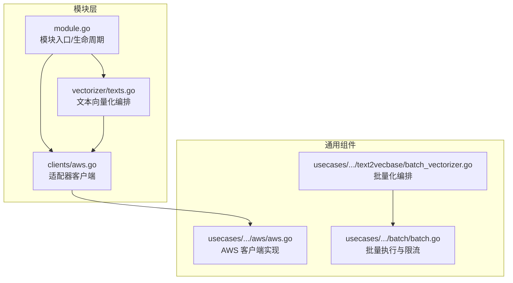
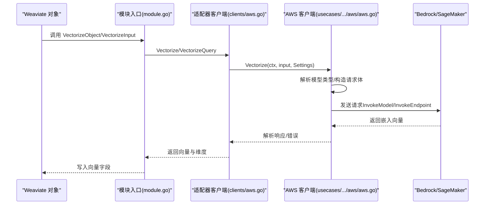
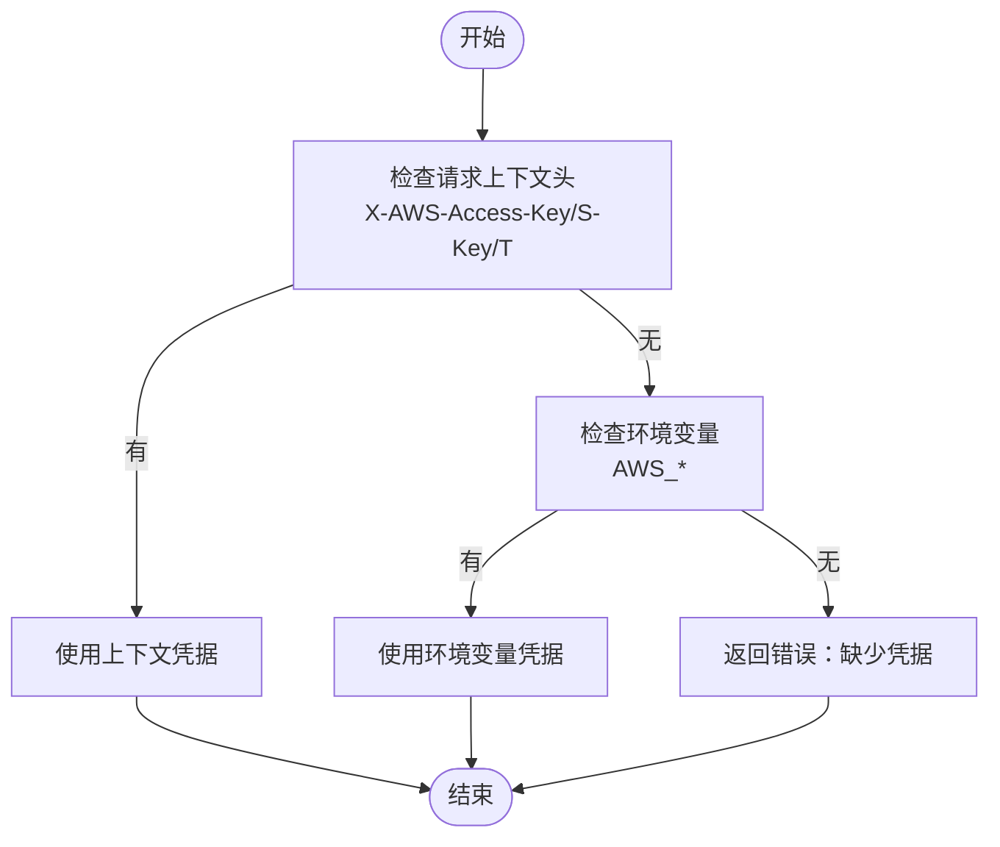
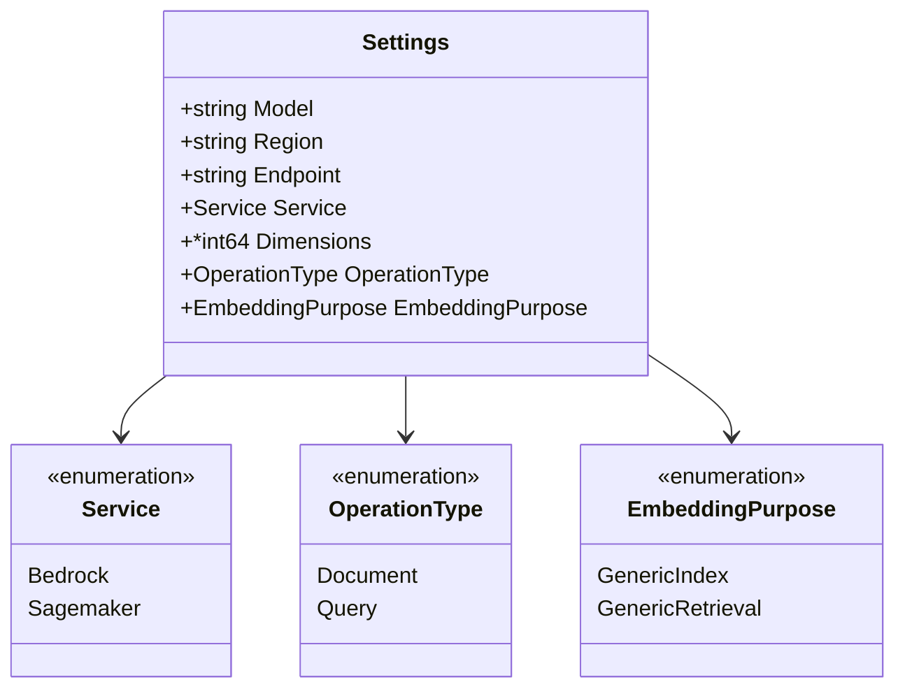
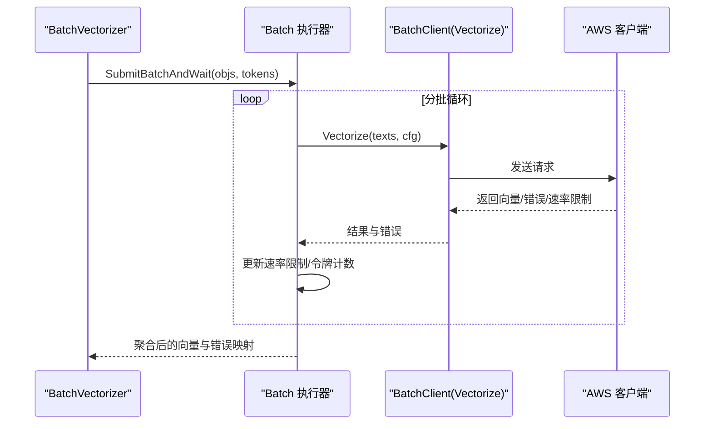
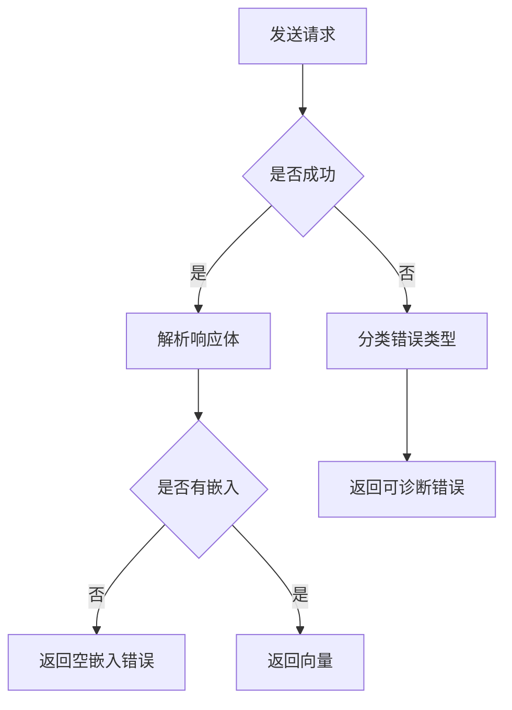
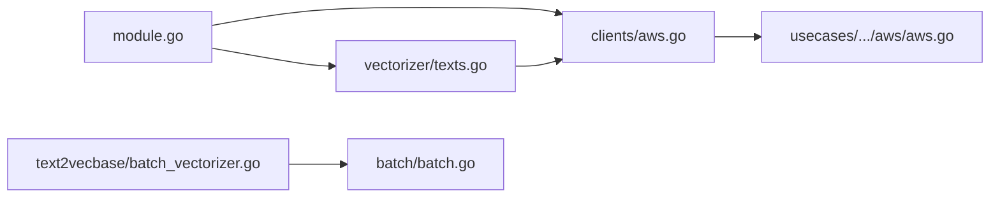

# AWS 向量化器

<cite>
**本文引用的文件**
- [modules/text2vec-aws/module.go](file://modules/text2vec-aws/module.go)
- [modules/text2vec-aws/clients/aws.go](file://modules/text2vec-aws/clients/aws.go)
- [modules/text2vec-aws/vectorizer/texts.go](file://modules/text2vec-aws/vectorizer/texts.go)
- [modules/text2vec-aws/vectorizer/texts_test.go](file://modules/text2vec-aws/vectorizer/texts_test.go)
- [usecases/modulecomponents/clients/aws/aws.go](file://usecases/modulecomponents/clients/aws/aws.go)
- [usecases/modulecomponents/text2vecbase/batch_vectorizer.go](file://usecases/modulecomponents/text2vecbase/batch_vectorizer.go)
- [usecases/modulecomponents/batch/batch.go](file://usecases/modulecomponents/batch/batch.go)
- [adapters/clients/client.go](file://adapters/clients/client.go)
- [adapters/clients/client_test.go](file://adapters/clients/client_test.go)
- [modules/backup-s3/client.go](file://modules/backup-s3/client.go)
- [modules/generative-aws/config/class_settings.go](file://modules/generative-aws/config/class_settings.go)
</cite>

## 目录
1. [简介](#简介)
2. [项目结构](#项目结构)
3. [核心组件](#核心组件)
4. [架构总览](#架构总览)
5. [组件详解](#组件详解)
6. [依赖关系分析](#依赖关系分析)
7. [性能与成本优化](#性能与成本优化)
8. [故障排查指南](#故障排查指南)
9. [结论](#结论)
10. [附录：配置与使用示例路径](#附录配置与使用示例路径)

## 简介
本技术文档聚焦 Weaviate 的 AWS 文本向量化器（text2vec-aws），系统性阐述其与 AWS Bedrock、SageMaker 等服务的集成方式，涵盖认证与授权（IAM）、区域选择、模型与端点配置、批量向量化机制、错误处理策略以及成本优化与性能基准建议。文档同时提供面向开发者的代码级视图与面向运维的部署实践指导。

## 项目结构
AWS 向量化器由三层组成：
- 模块入口与生命周期管理：负责初始化客户端、日志与元数据提供者，并暴露向量化能力给上层对象与 GraphQL。
- 客户端适配层：封装 AWS SDK 调用，支持 Bedrock 与 SageMaker，统一请求/响应解析与错误处理。
- 向量化编排层：负责单文本与批量文本的向量化流程，聚合多向量结果并返回。

**图表来源**
- [modules/text2vec-aws/module.go](file://modules/text2vec-aws/module.go#L34-L102)
- [modules/text2vec-aws/clients/aws.go](file://modules/text2vec-aws/clients/aws.go#L24-L60)
- [modules/text2vec-aws/vectorizer/texts.go](file://modules/text2vec-aws/vectorizer/texts.go#L23-L47)
- [usecases/modulecomponents/clients/aws/aws.go](file://usecases/modulecomponents/clients/aws/aws.go#L177-L272)
- [usecases/modulecomponents/text2vecbase/batch_vectorizer.go](file://usecases/modulecomponents/text2vecbase/batch_vectorizer.go#L83-L104)
- [usecases/modulecomponents/batch/batch.go](file://usecases/modulecomponents/batch/batch.go#L438-L482)

**章节来源**
- [modules/text2vec-aws/module.go](file://modules/text2vec-aws/module.go#L34-L102)
- [modules/text2vec-aws/clients/aws.go](file://modules/text2vec-aws/clients/aws.go#L24-L60)
- [modules/text2vec-aws/vectorizer/texts.go](file://modules/text2vec-aws/vectorizer/texts.go#L23-L47)
- [usecases/modulecomponents/clients/aws/aws.go](file://usecases/modulecomponents/clients/aws/aws.go#L177-L272)
- [usecases/modulecomponents/text2vecbase/batch_vectorizer.go](file://usecases/modulecomponents/text2vecbase/batch_vectorizer.go#L83-L104)
- [usecases/modulecomponents/batch/batch.go](file://usecases/modulecomponents/batch/batch.go#L438-L482)

## 核心组件
- 模块入口（module.go）
  - 初始化 AWS 凭证（从环境变量或请求上下文提取），构建 AWS 客户端并注入到向量化器。
  - 提供对象级与输入级向量化接口，以及额外属性与元信息查询能力。
- 客户端适配器（clients/aws.go）
  - 将 Weaviate 的向量化配置映射为 AWS Settings，调用底层 AWS 客户端。
- AWS 客户端实现（usecases/.../aws/aws.go）
  - 支持 Bedrock 与 SageMaker 两种服务后端；根据模型类型选择不同请求体与解析逻辑。
  - 统一错误处理与重试策略，支持维度与用途等高级参数。
- 批量化编排（text2vecbase/batch_vectorizer.go 与 batch/batch.go）
  - 将多个文本分批提交，聚合结果并处理部分失败场景。

**章节来源**
- [modules/text2vec-aws/module.go](file://modules/text2vec-aws/module.go#L56-L102)
- [modules/text2vec-aws/clients/aws.go](file://modules/text2vec-aws/clients/aws.go#L36-L60)
- [usecases/modulecomponents/clients/aws/aws.go](file://usecases/modulecomponents/clients/aws/aws.go#L200-L272)
- [usecases/modulecomponents/text2vecbase/batch_vectorizer.go](file://usecases/modulecomponents/text2vecbase/batch_vectorizer.go#L83-L104)
- [usecases/modulecomponents/batch/batch.go](file://usecases/modulecomponents/batch/batch.go#L438-L482)

## 架构总览
下图展示了从 Weaviate 对象到 AWS 向量化器的调用链路，以及与 AWS 服务的交互。

**图表来源**
- [modules/text2vec-aws/module.go](file://modules/text2vec-aws/module.go#L123-L149)
- [modules/text2vec-aws/clients/aws.go](file://modules/text2vec-aws/clients/aws.go#L36-L60)
- [usecases/modulecomponents/clients/aws/aws.go](file://usecases/modulecomponents/clients/aws/aws.go#L200-L272)

## 组件详解

### 认证与授权（IAM）与凭据来源
- 多源凭据优先级
  - 请求上下文头：X-AWS-Access-Key、X-AWS-Secret-Key、X-AWS-Session-Token。
  - 环境变量：AWS_ACCESS_KEY_ID/AWS_ACCESS_KEY、AWS_SECRET_ACCESS_KEY/AWS_SECRET_KEY、AWS_SESSION_TOKEN。
  - 若均未提供，将报错提示缺少凭据。
- 会话令牌（可选）
  - 当存在临时凭证时，可通过 X-AWS-Session-Token 注入。

**图表来源**
- [usecases/modulecomponents/clients/aws/aws.go](file://usecases/modulecomponents/clients/aws/aws.go#L535-L567)

**章节来源**
- [usecases/modulecomponents/clients/aws/aws.go](file://usecases/modulecomponents/clients/aws/aws.go#L535-L567)

### 服务配置与模型选择
- 服务选择
  - 支持 bedrock 与 sagemaker 两种服务后端。
- 区域与端点
  - Bedrock：通过 region 指定区域；模型标识决定具体模型族（如 amazon.*、cohere.*）。
  - SageMaker：通过 endpoint 指定端点名称。
- 高级参数
  - Bedrock 支持输出维度（dimensions）、嵌入用途（embedding purpose）等。
- 类配置校验（参考 generative-aws 的类设置，向量化器遵循一致的参数语义）
  - 服务与模型合法性校验、参数范围约束等。

**图表来源**
- [usecases/modulecomponents/clients/aws/aws.go](file://usecases/modulecomponents/clients/aws/aws.go#L167-L176)

**章节来源**
- [usecases/modulecomponents/clients/aws/aws.go](file://usecases/modulecomponents/clients/aws/aws.go#L147-L176)
- [modules/generative-aws/config/class_settings.go](file://modules/generative-aws/config/class_settings.go#L190-L200)

### 批量向量化机制
- 编排层
  - 将对象集合按令牌数与对象数进行分批，提交至底层客户端。
  - 聚合结果并向量合并（当返回多个向量时）。
- 执行层
  - 底层客户端在每次请求中处理错误与速率限制，必要时更新令牌使用计数。
- 重试与退避
  - 采用指数退避与最大尝试次数控制，避免无限重试。

**图表来源**
- [usecases/modulecomponents/text2vecbase/batch_vectorizer.go](file://usecases/modulecomponents/text2vecbase/batch_vectorizer.go#L83-L104)
- [usecases/modulecomponents/batch/batch.go](file://usecases/modulecomponents/batch/batch.go#L438-L482)
- [adapters/clients/client.go](file://adapters/clients/client.go#L107-L128)

**章节来源**
- [usecases/modulecomponents/text2vecbase/batch_vectorizer.go](file://usecases/modulecomponents/text2vecbase/batch_vectorizer.go#L83-L104)
- [usecases/modulecomponents/batch/batch.go](file://usecases/modulecomponents/batch/batch.go#L438-L482)
- [adapters/clients/client.go](file://adapters/clients/client.go#L107-L128)

### 错误处理策略
- Bedrock 常见错误
  - 模型不可用或区域不支持：明确提示区域可用性与模型标识校验。
  - 基础模型解析失败：提示模型标识有效性。
- SageMaker
  - 端点调用失败：包装为可识别的错误。
- 通用错误
  - 响应体解析失败：统一返回解析错误。
  - 空嵌入响应：提示无法获取向量。

**图表来源**
- [usecases/modulecomponents/clients/aws/aws.go](file://usecases/modulecomponents/clients/aws/aws.go#L413-L452)
- [usecases/modulecomponents/clients/aws/aws.go](file://usecases/modulecomponents/clients/aws/aws.go#L476-L519)

**章节来源**
- [usecases/modulecomponents/clients/aws/aws.go](file://usecases/modulecomponents/clients/aws/aws.go#L413-L452)
- [usecases/modulecomponents/clients/aws/aws.go](file://usecases/modulecomponents/clients/aws/aws.go#L476-L519)

### 单元测试与行为验证
- 测试覆盖
  - 验证不同输入与配置组合下的请求体与服务/区域/模型参数传递正确性。
  - 验证向量化结果维度与预期一致。

**章节来源**
- [modules/text2vec-aws/vectorizer/texts_test.go](file://modules/text2vec-aws/vectorizer/texts_test.go#L81-L102)

## 依赖关系分析
- 模块入口依赖适配器客户端与 AWS 客户端实现。
- 向量化器依赖客户端适配器，客户端适配器再依赖 AWS SDK。
- 批量化编排依赖通用批处理执行器与速率限制机制。

**图表来源**
- [modules/text2vec-aws/module.go](file://modules/text2vec-aws/module.go#L34-L102)
- [modules/text2vec-aws/clients/aws.go](file://modules/text2vec-aws/clients/aws.go#L24-L60)
- [modules/text2vec-aws/vectorizer/texts.go](file://modules/text2vec-aws/vectorizer/texts.go#L23-L47)
- [usecases/modulecomponents/clients/aws/aws.go](file://usecases/modulecomponents/clients/aws/aws.go#L177-L272)
- [usecases/modulecomponents/text2vecbase/batch_vectorizer.go](file://usecases/modulecomponents/text2vecbase/batch_vectorizer.go#L44-L56)
- [usecases/modulecomponents/batch/batch.go](file://usecases/modulecomponents/batch/batch.go#L438-L482)

**章节来源**
- [modules/text2vec-aws/module.go](file://modules/text2vec-aws/module.go#L34-L102)
- [modules/text2vec-aws/clients/aws.go](file://modules/text2vec-aws/clients/aws.go#L24-L60)
- [modules/text2vec-aws/vectorizer/texts.go](file://modules/text2vec-aws/vectorizer/texts.go#L23-L47)
- [usecases/modulecomponents/clients/aws/aws.go](file://usecases/modulecomponents/clients/aws/aws.go#L177-L272)
- [usecases/modulecomponents/text2vecbase/batch_vectorizer.go](file://usecases/modulecomponents/text2vecbase/batch_vectorizer.go#L44-L56)
- [usecases/modulecomponents/batch/batch.go](file://usecases/modulecomponents/batch/batch.go#L438-L482)

## 性能与成本优化
- 选择合适的服务与模型
  - Bedrock：按模型族选择（如 Amazon Nova/Titan、Cohere），利用维度与用途参数以减少后续检索开销。
  - SageMaker：确保端点稳定与容量充足，避免冷启动抖动。
- 批量策略
  - 合理设置每批对象数量与令牌上限，平衡吞吐与延迟。
  - 利用速率限制回调与令牌复位函数，动态调整批大小。
- 重试与退避
  - 使用指数退避与最大尝试次数，避免雪崩效应。
- 成本控制
  - 优先使用 Bedrock 的按需计费与区域可用性，避免跨区域访问。
  - 控制输出维度与输入长度，降低令牌消耗。
  - 在 SageMaker 场景下，合理规划端点实例规格与自动伸缩策略。

[本节为通用优化建议，无需特定文件引用]

## 故障排查指南
- 常见错误定位
  - Bedrock 模型不可用：检查模型标识与区域可用性。
  - 空嵌入响应：确认输入非空且模型支持。
  - 凭据缺失：检查请求头或环境变量配置。
- 重试与超时
  - 检查指数退避与最大尝试次数设置，避免过早放弃。
- 日志与指标
  - 关注批处理错误计数与令牌使用统计，辅助定位瓶颈。

**章节来源**
- [usecases/modulecomponents/clients/aws/aws.go](file://usecases/modulecomponents/clients/aws/aws.go#L413-L452)
- [adapters/clients/client.go](file://adapters/clients/client.go#L107-L128)
- [adapters/clients/client_test.go](file://adapters/clients/client_test.go#L32-L105)

## 结论
Weaviate 的 AWS 文本向量化器通过清晰的模块化设计，实现了对 Bedrock 与 SageMaker 的统一接入，具备完善的认证、配置、批量与错误处理能力。结合合理的批量策略、重试与成本控制手段，可在企业环境中实现安全、可扩展且高性价比的向量化服务。

## 附录：配置与使用示例路径
以下为关键配置与使用示例的文件路径指引（请在对应文件中查看具体参数与示例）：
- 模块入口与初始化
  - [modules/text2vec-aws/module.go](file://modules/text2vec-aws/module.go#L56-L102)
- 客户端适配器
  - [modules/text2vec-aws/clients/aws.go](file://modules/text2vec-aws/clients/aws.go#L36-L60)
- AWS 客户端实现（服务选择、模型解析、错误处理）
  - [usecases/modulecomponents/clients/aws/aws.go](file://usecases/modulecomponents/clients/aws/aws.go#L267-L317)
  - [usecases/modulecomponents/clients/aws/aws.go](file://usecases/modulecomponents/clients/aws/aws.go#L413-L452)
- 批量向量化编排
  - [usecases/modulecomponents/text2vecbase/batch_vectorizer.go](file://usecases/modulecomponents/text2vecbase/batch_vectorizer.go#L83-L104)
  - [usecases/modulecomponents/batch/batch.go](file://usecases/modulecomponents/batch/batch.go#L438-L482)
- 凭据来源与 IAM 集成
  - [usecases/modulecomponents/clients/aws/aws.go](file://usecases/modulecomponents/clients/aws/aws.go#L535-L567)
  - [modules/backup-s3/client.go](file://modules/backup-s3/client.go#L82-L94)
- 类配置与参数校验（参考 generative-aws 的类设置）
  - [modules/generative-aws/config/class_settings.go](file://modules/generative-aws/config/class_settings.go#L94-L147)
  - [modules/generative-aws/config/class_settings.go](file://modules/generative-aws/config/class_settings.go#L190-L200)