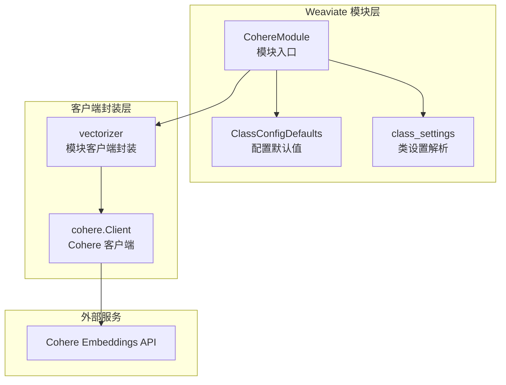
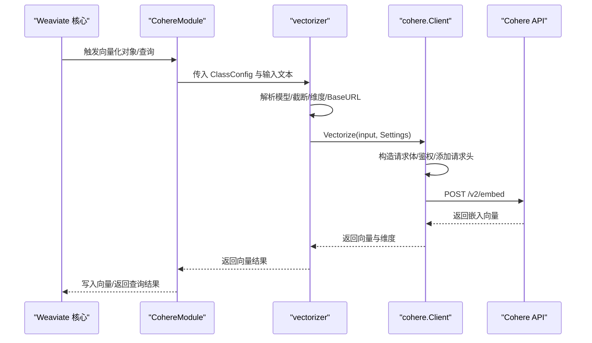
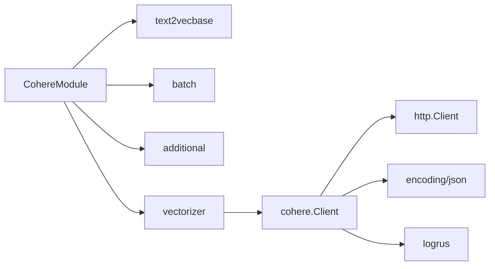

# Cohere 向量化器

<cite>
**本文引用的文件**
- [模块入口：module.go](file://modules/text2vec-cohere/module.go)
- [配置默认值：config.go](file://modules/text2vec-cohere/config.go)
- [类设置：class_settings.go](file://modules/text2vec-cohere/ent/class_settings.go)
- [客户端封装：clients/cohere.go](file://modules/text2vec-cohere/clients/cohere.go)
- [Cohere 客户端：usecases/modulecomponents/clients/cohere/cohere.go](file://usecases/modulecomponents/clients/cohere/cohere.go)
- [单元测试：clients/cohere_test.go](file://modules/text2vec-cohere/clients/cohere_test.go)
- [README：README.md](file://README.md)
</cite>

## 目录
1. [简介](#简介)
2. [项目结构](#项目结构)
3. [核心组件](#核心组件)
4. [架构总览](#架构总览)
5. [详细组件分析](#详细组件分析)
6. [依赖关系分析](#依赖关系分析)
7. [性能与成本考量](#性能与成本考量)
8. [故障排查指南](#故障排查指南)
9. [结论](#结论)
10. [附录](#附录)

## 简介
本文件面向 Weaviate 的 Cohere 文本向量化器，系统化阐述其与 Cohere Embeddings API 的集成实现，覆盖 API 密钥配置、模型选择、批量处理机制、文本预处理策略、向量维度配置与质量评估方法，并提供可操作的配置与使用路径。同时给出与 Weaviate 核心模块的交互方式、错误处理与性能特性说明，帮助读者在生产环境中高效、稳定地使用 Cohere 向量化能力。

## 项目结构
Cohere 向量化器位于 modules/text2vec-cohere 目录，采用“模块层 + 客户端层”的分层设计：
- 模块层负责对外暴露 Weaviate 的模块接口，初始化客户端、批处理策略与元信息提供者。
- 客户端层封装对 Cohere Embeddings API 的调用，负责请求构造、鉴权、响应解析与速率限制管理。
- 类设置层负责从 Weaviate 的类配置中提取模型、输入类型、截断策略与维度等参数。



图表来源
- [模块入口：module.go](file://modules/text2vec-cohere/module.go#L1-L167)
- [配置默认值：config.go](file://modules/text2vec-cohere/config.go#L1-L51)
- [类设置：class_settings.go](file://modules/text2vec-cohere/ent/class_settings.go#L1-L72)
- [客户端封装：clients/cohere.go](file://modules/text2vec-cohere/clients/cohere.go#L1-L73)
- [Cohere 客户端：usecases/modulecomponents/clients/cohere/cohere.go](file://usecases/modulecomponents/clients/cohere/cohere.go#L1-L260)

章节来源
- [模块入口：module.go](file://modules/text2vec-cohere/module.go#L1-L167)
- [配置默认值：config.go](file://modules/text2vec-cohere/config.go#L1-L51)
- [类设置：class_settings.go](file://modules/text2vec-cohere/ent/class_settings.go#L1-L72)
- [客户端封装：clients/cohere.go](file://modules/text2vec-cohere/clients/cohere.go#L1-L73)
- [Cohere 客户端：usecases/modulecomponents/clients/cohere/cohere.go](file://usecases/modulecomponents/clients/cohere/cohere.go#L1-L260)

## 核心组件
- 模块入口（CohereModule）
  - 实现 Weaviate 模块接口，负责初始化向量化器、附加属性提供者与 GraphQL 参数提供者。
  - 初始化批处理策略，设置最大对象数、最大令牌数、批次超时等。
  - 从环境变量加载 API Key 并注入客户端。
- 客户端封装（vectorizer）
  - 将 Weaviate 的类配置转换为 Cohere 客户端所需的 Settings，统一调用 Vectorize/VectorizeQuery。
  - 支持从请求上下文读取动态 BaseURL 与 API Key。
- Cohere 客户端（cohere.Client）
  - 构造 Embeddings 请求体，设置 Authorization 头与 Request-Source。
  - 从上下文或环境变量获取 API Key；支持从请求头传入临时密钥。
  - 解析响应，返回向量与维度信息；处理非 200 状态码与空响应。
  - 提供速率限制辅助（从上下文读取或默认值），用于批处理协调。

章节来源
- [模块入口：module.go](file://modules/text2vec-cohere/module.go#L34-L112)
- [客户端封装：clients/cohere.go](file://modules/text2vec-cohere/clients/cohere.go#L32-L72)
- [Cohere 客户端：usecases/modulecomponents/clients/cohere/cohere.go](file://usecases/modulecomponents/clients/cohere/cohere.go#L99-L260)

## 架构总览
Cohere 向量化器在 Weaviate 中的调用链路如下：
- Weaviate 对象导入/查询触发向量化。
- 模块入口根据类配置选择模型、输入类型、截断策略与维度。
- 客户端封装将配置映射为 Cohere Settings 并发起请求。
- Cohere 客户端构造请求、鉴权、发送并解析响应。
- 批处理层按配置进行分批与超时控制，最终返回向量结果。



图表来源
- [模块入口：module.go](file://modules/text2vec-cohere/module.go#L99-L112)
- [客户端封装：clients/cohere.go](file://modules/text2vec-cohere/clients/cohere.go#L39-L64)
- [Cohere 客户端：usecases/modulecomponents/clients/cohere/cohere.go](file://usecases/modulecomponents/clients/cohere/cohere.go#L110-L161)

## 详细组件分析

### 模块入口（CohereModule）
- 初始化流程
  - 从环境变量读取 COHERE_APIKEY，创建客户端。
  - 注入批处理客户端，设置批大小、令牌上限、超时与返回率限开关。
  - 初始化元信息提供者与附加属性提供者。
- 批处理策略
  - 最大对象数：96（遵循 Cohere API 限制）。
  - 最大令牌数：500000（无硬性限制）。
  - 最大批处理时间：10 秒。
  - 无令牌限制，不返回速率限制信息。
- 类配置与校验
  - 默认字段：vectorizeClassName、model、truncate、baseUrl。
  - 属性默认：skip、vectorizePropertyName。
  - 校验 truncate 是否在允许集合内。

章节来源
- [模块入口：module.go](file://modules/text2vec-cohere/module.go#L34-L112)
- [配置默认值：config.go](file://modules/text2vec-cohere/config.go#L25-L48)

### 客户端封装（vectorizer）
- 输入映射
  - 文档向量化：InputType = search_document。
  - 查询向量化：InputType = search_query。
  - 截断策略与模型、BaseURL、维度均来自类设置。
- 上下文与动态配置
  - 支持从请求上下文读取 X-Cohere-Api-Key 与 X-Cohere-Baseurl。
  - 若未提供，则回退至模块初始化时注入的 API Key 与默认 BaseURL。
- 速率限制与密钥哈希
  - 提供 GetVectorizerRateLimit 与 GetApiKeyHash，便于批处理与缓存。

章节来源
- [客户端封装：clients/cohere.go](file://modules/text2vec-cohere/clients/cohere.go#L39-L72)

### Cohere 客户端（cohere.Client）
- 请求构造
  - URL：/v2/embed，默认 BaseURL 为 https://api.cohere.ai，可通过上下文覆盖。
  - 请求头：Authorization（Bearer）、Accept、Content-Type、Request-Source。
  - 请求体：embeddingsRequest，包含 texts/images、model、input_type、embedding_types、truncate、output_dimension。
- 鉴权与错误处理
  - 优先从上下文读取 X-Cohere-Api-Key；若为空则回退到初始化时的 API Key。
  - 若仍为空，抛出明确错误提示。
  - 非 200 状态码时，解析并返回错误消息。
- 响应解析
  - 返回向量二维数组与维度长度。
  - 空响应时返回错误。
- 速率限制
  - 从上下文读取速率限制（如 X-Cohere-Ratelimit-RequestPM-Embedding），否则使用默认 RPM。
  - 提供 AfterRequest 函数以更新剩余请求与重置时间。

章节来源
- [Cohere 客户端：usecases/modulecomponents/clients/cohere/cohere.go](file://usecases/modulecomponents/clients/cohere/cohere.go#L110-L260)

### 类设置（class_settings）
- 默认值
  - BaseURL：https://api.cohere.ai
  - Model：embed-multilingual-v3.0
  - Truncate：END
  - 其他布尔与输入处理默认值。
- 可选值校验
  - Truncate 仅允许 NONE/START/END/LEFT/RIGHT。
- 维度配置
  - 支持通过类配置指定 output_dimension，用于裁剪输出向量维度。

章节来源
- [类设置：class_settings.go](file://modules/text2vec-cohere/ent/class_settings.go#L21-L71)

### 单元测试要点
- 正常路径：构造向量结果，断言维度与向量值。
- 超时/过期：上下文过期时返回相应错误。
- 服务端错误：非 200 状态码时返回带错误消息的异常。
- API Key 来源：支持 X-Cohere-Api-Key 请求头与环境变量。
- 速率限制：从上下文读取速率限制头并生效。

章节来源
- [单元测试：clients/cohere_test.go](file://modules/text2vec-cohere/clients/cohere_test.go#L35-L166)

## 依赖关系分析
- 模块层依赖
  - usecases/modulecomponents/text2vecbase：批处理与基础向量化抽象。
  - usecases/modulecomponents/batch：批处理客户端与设置。
  - usecases/modulecomponents/additional：附加属性提供。
- 客户端层依赖
  - usecases/modulecomponents/clients/cohere：Cohere 官方客户端封装。
  - entities/moduletools：类配置接口。
  - github.com/sirupsen/logrus：日志。
- 外部依赖
  - Cohere Embeddings API（/v2/embed）。
  - HTTP 客户端与 JSON 编解码。



图表来源
- [模块入口：module.go](file://modules/text2vec-cohere/module.go#L14-L30)
- [客户端封装：clients/cohere.go](file://modules/text2vec-cohere/clients/cohere.go#L14-L25)
- [Cohere 客户端：usecases/modulecomponents/clients/cohere/cohere.go](file://usecases/modulecomponents/clients/cohere/cohere.go#L14-L31)

章节来源
- [模块入口：module.go](file://modules/text2vec-cohere/module.go#L14-L30)
- [客户端封装：clients/cohere.go](file://modules/text2vec-cohere/clients/cohere.go#L14-L25)
- [Cohere 客户端：usecases/modulecomponents/clients/cohere/cohere.go](file://usecases/modulecomponents/clients/cohere/cohere.go#L14-L31)

## 性能与成本考量
- 批处理策略
  - 最大对象数：96（遵循 Cohere API 限制）。
  - 最大令牌数：500000（无硬性限制）。
  - 最大批处理时间：10 秒。
  - 无令牌限制，不返回速率限制信息。
- 速率限制
  - 默认 RPM：10000（生产密钥默认值）。
  - 可通过上下文头覆盖（如 X-Cohere-Ratelimit-RequestPM-Embedding）。
  - 客户端提供 AfterRequest 函数以更新剩余请求与重置时间。
- 成本与质量
  - Cohere Embeddings API 提供多语言支持与高质量语义向量，适合企业级可靠性与多语言场景。
  - 输出维度可通过 dimensions 参数裁剪，以平衡存储与检索性能。
- 与 Weaviate 的集成优势
  - 自动批处理与超时控制，避免单次请求过大导致的延迟。
  - 支持查询与文档向量化区分（InputType），提升检索质量。

章节来源
- [模块入口：module.go](file://modules/text2vec-cohere/module.go#L34-L41)
- [Cohere 客户端：usecases/modulecomponents/clients/cohere/cohere.go](file://usecases/modulecomponents/clients/cohere/cohere.go#L33-L36)
- [Cohere 客户端：usecases/modulecomponents/clients/cohere/cohere.go](file://usecases/modulecomponents/clients/cohere/cohere.go#L209-L236)

## 故障排查指南
- API Key 相关
  - 错误：未找到 API Key（既不在请求头也不在环境变量）。
  - 排查：确认 COHERE_APIKEY 环境变量已设置；或在请求上下文中提供 X-Cohere-Api-Key。
- BaseURL 相关
  - 错误：连接失败或状态码非 200。
  - 排查：确认 BaseURL 可达；必要时通过 X-Cohere-Baseurl 覆盖。
- 截断策略
  - 错误：truncate 不在允许集合内。
  - 排查：将 truncate 设置为 NONE/START/END/LEFT/RIGHT。
- 响应异常
  - 错误：空响应或解析失败。
  - 排查：检查输入文本格式与长度；确认模型与维度配置有效。
- 速率限制
  - 现象：频繁被限流。
  - 排查：通过上下文头设置更高的 RPM；或调整批处理大小与超时。

章节来源
- [Cohere 客户端：usecases/modulecomponents/clients/cohere/cohere.go](file://usecases/modulecomponents/clients/cohere/cohere.go#L245-L255)
- [类设置：class_settings.go](file://modules/text2vec-cohere/ent/class_settings.go#L60-L71)
- [单元测试：clients/cohere_test.go](file://modules/text2vec-cohere/clients/cohere_test.go#L112-L149)

## 结论
Weaviate 的 Cohere 向量化器通过清晰的模块层与客户端层分离，实现了对 Cohere Embeddings API 的稳健集成。其批处理策略、动态 API Key 与 BaseURL 支持、以及可配置的模型与维度，使其在多语言、企业级可靠性与成本控制方面具备良好表现。配合 Weaviate 的整体架构，可实现高效、可扩展的语义检索与 RAG 场景。

## 附录

### 配置与使用路径
- 环境变量
  - COHERE_APIKEY：Cohere API 密钥（优先级低于请求头）。
- 类配置（ClassConfig）
  - model：模型名称（默认 embed-multilingual-v3.0）。
  - truncate：截断策略（默认 END）。
  - baseUrl：Cohere API 基础地址（默认 https://api.cohere.ai）。
  - dimensions：输出向量维度（可选）。
- 请求上下文（可选）
  - X-Cohere-Api-Key：临时 API Key。
  - X-Cohere-Baseurl：临时 BaseURL。
  - X-Cohere-Ratelimit-RequestPM-Embedding：速率限制（RPM）。
- 批处理参数（模块内部）
  - 最大对象数：96
  - 最大令牌数：500000
  - 最大批处理时间：10 秒
  - 无令牌限制，不返回速率限制信息

章节来源
- [模块入口：module.go](file://modules/text2vec-cohere/module.go#L102-L108)
- [配置默认值：config.go](file://modules/text2vec-cohere/config.go#L25-L31)
- [类设置：class_settings.go](file://modules/text2vec-cohere/ent/class_settings.go#L21-L31)
- [客户端封装：clients/cohere.go](file://modules/text2vec-cohere/clients/cohere.go#L43-L49)
- [Cohere 客户端：usecases/modulecomponents/clients/cohere/cohere.go](file://usecases/modulecomponents/clients/cohere/cohere.go#L193-L199)

### 代码级类图（模块与客户端）
```mermaid
classDiagram
class CohereModule {
+Name() string
+Type() ModuleType
+Init(ctx, params) error
+VectorizeObject(...)
+VectorizeBatch(...)
+MetaInfo() map[string]interface{}
}
class vectorizer {
-client *cohere.Client
-logger FieldLogger
+Vectorize(ctx, input, cfg)
+VectorizeQuery(ctx, input, cfg)
+GetApiKeyHash(ctx, cfg) [32]byte
+GetVectorizerRateLimit(ctx, cfg) RateLimits
}
class Client {
-apiKey string
-httpClient *http.Client
-urlBuilder UrlBuilder
-logger FieldLogger
+Vectorize(ctx, inputs, settings) VectorizationResult
+GetApiKeyHash(ctx, cfg) [32]byte
+GetVectorizerRateLimit(ctx, cfg) RateLimits
}
CohereModule --> vectorizer : "组合"
vectorizer --> Client : "委托"
```

图表来源
- [模块入口：module.go](file://modules/text2vec-cohere/module.go#L47-L55)
- [客户端封装：clients/cohere.go](file://modules/text2vec-cohere/clients/cohere.go#L27-L30)
- [Cohere 客户端：usecases/modulecomponents/clients/cohere/cohere.go](file://usecases/modulecomponents/clients/cohere/cohere.go#L72-L77)