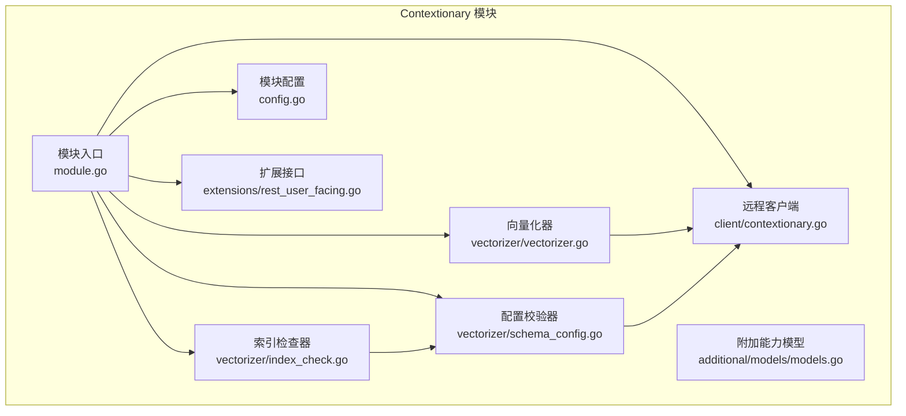
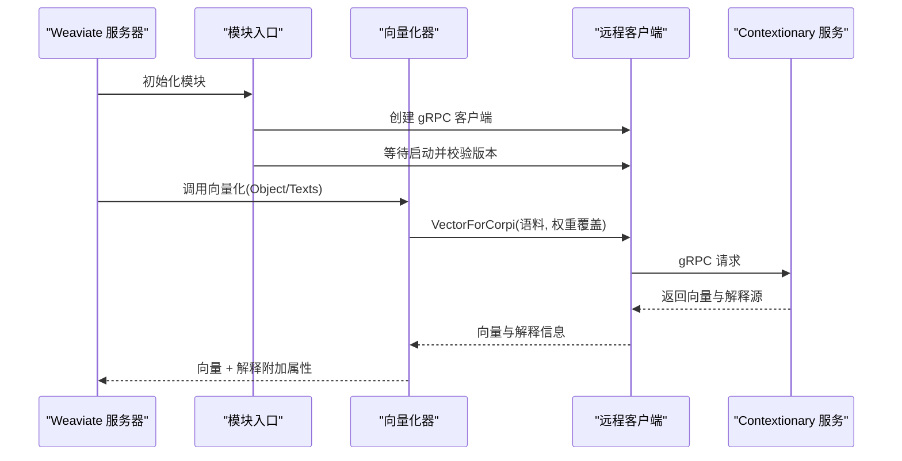
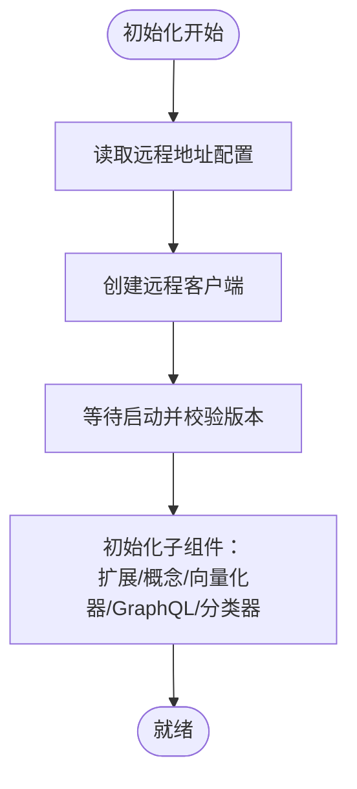
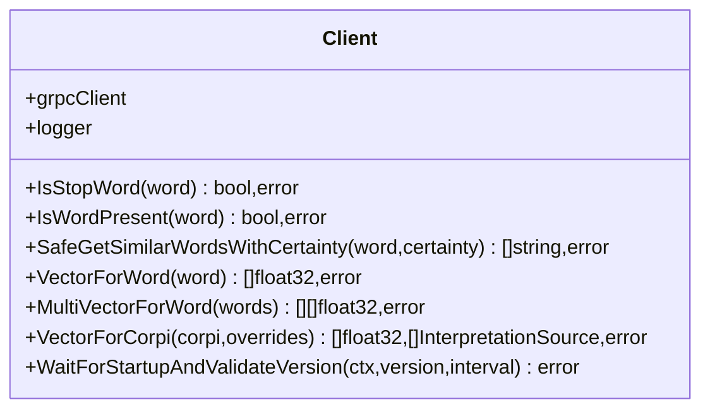
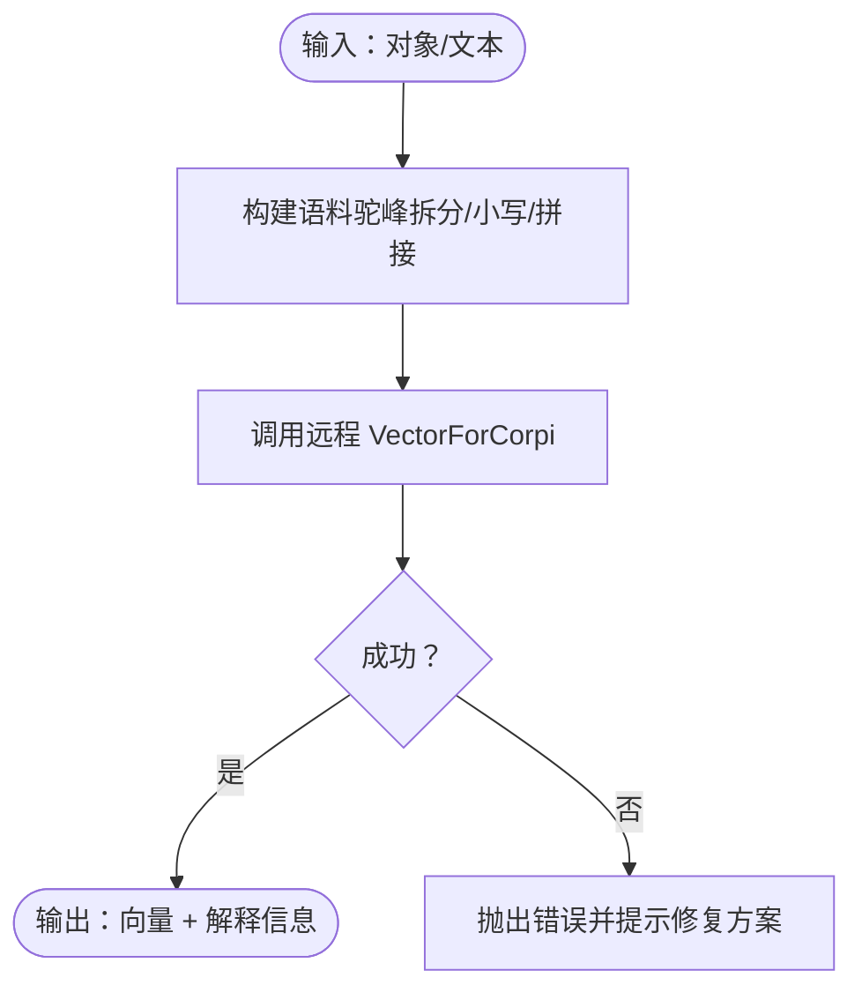
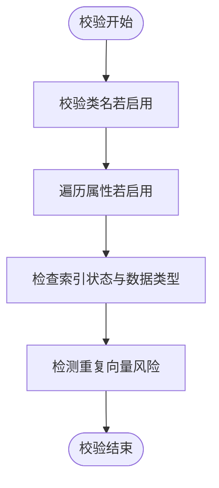
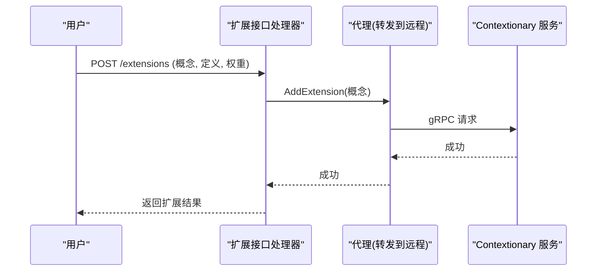
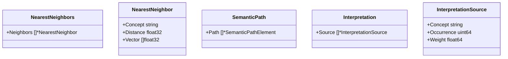
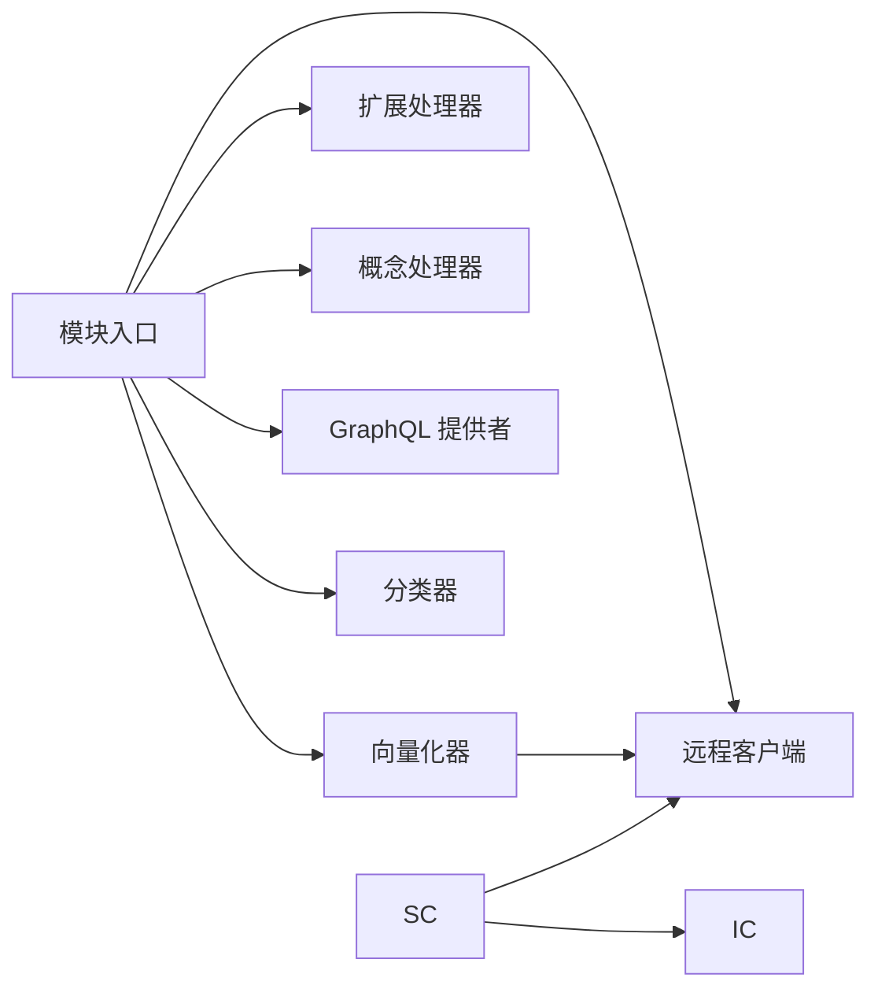

# Contextionary 向量化器

<cite>
**本文引用的文件**
- [模块入口：module.go](file://modules/text2vec-contextionary/module.go)
- [远程客户端：client/contextionary.go](file://modules/text2vec-contextionary/client/contextionary.go)
- [向量化器：vectorizer/vectorizer.go](file://modules/text2vec-contextionary/vectorizer/vectorizer.go)
- [配置校验器：vectorizer/schema_config.go](file://modules/text2vec-contextionary/vectorizer/schema_config.go)
- [索引检查器：vectorizer/index_check.go](file://modules/text2vec-contextionary/vectorizer/index_check.go)
- [模块配置：config.go](file://modules/text2vec-contextionary/config.go)
- [附加能力模型：additional/models/models.go](file://modules/text2vec-contextionary/additional/models/models.go)
- [扩展接口：extensions/rest_user_facing.go](file://modules/text2vec-contextionary/extensions/rest_user_facing.go)
- [示例模式：test/helper/sample-schema/books/books.go](file://test/helper/sample-schema/books/books.go)
- [示例模式：test/helper/sample-schema/documents/documents.go](file://test/helper/sample-schema/documents/documents.go)
- [GraphQL 测试：test/acceptance/graphql_resolvers/setup_test.go](file://test/acceptance/graphql_resolvers/setup_test.go)
- [OpenAPI 规范片段](file://openapi-specs/schema.json)
</cite>

## 目录
1. [简介](#简介)
2. [项目结构](#项目结构)
3. [核心组件](#核心组件)
4. [架构总览](#架构总览)
5. [详细组件分析](#详细组件分析)
6. [依赖关系分析](#依赖关系分析)
7. [性能考量](#性能考量)
8. [故障排查指南](#故障排查指南)
9. [结论](#结论)
10. [附录](#附录)

## 简介
Contextionary 是 Weaviate 的本地文本向量化器，通过独立的远程推理服务提供词向量与语义能力。其核心特性包括：
- 完全本地运行：Weaviate 侧仅负责编排与调用，不直接下载或存储模型权重
- 无需互联网连接：在离线环境中亦可工作（前提为远程 Contextionary 服务可用）
- 内置领域适应能力：支持通过 REST 接口扩展词汇表，适配行业术语
- 可扩展的词汇表：通过“扩展”机制动态注入新概念
- 上下文感知：基于远程服务的语义网格与近义词检索能力
- 丰富的附加能力：最近邻、语义路径、特征投影与解释信息

## 项目结构
Contextionary 模块位于 modules/text2vec-contextionary 目录，主要由以下子模块组成：
- 模块入口与生命周期管理
- 远程客户端（gRPC）与版本校验
- 向量化器与对象/文本处理
- 配置校验与索引策略
- 扩展与概念查询的 REST 接口
- GraphQL 参数与附加能力提供者
- 分类器与语义路径等扩展功能

图表来源
- [模块入口：module.go](file://modules/text2vec-contextionary/module.go#L46-L136)
- [远程客户端：client/contextionary.go](file://modules/text2vec-contextionary/client/contextionary.go#L36-L56)
- [向量化器：vectorizer/vectorizer.go](file://modules/text2vec-contextionary/vectorizer/vectorizer.go#L32-L68)
- [配置校验器：vectorizer/schema_config.go](file://modules/text2vec-contextionary/vectorizer/schema_config.go#L27-L47)
- [索引检查器：vectorizer/index_check.go](file://modules/text2vec-contextionary/vectorizer/index_check.go#L20-L27)
- [模块配置：config.go](file://modules/text2vec-contextionary/config.go#L25-L48)
- [扩展接口：extensions/rest_user_facing.go](file://modules/text2vec-contextionary/extensions/rest_user_facing.go#L83-L89)
- [附加能力模型：additional/models/models.go](file://modules/text2vec-contextionary/additional/models/models.go#L14-L48)

章节来源
- [模块入口：module.go](file://modules/text2vec-contextionary/module.go#L46-L136)
- [远程客户端：client/contextionary.go](file://modules/text2vec-contextionary/client/contextionary.go#L36-L56)
- [向量化器：vectorizer/vectorizer.go](file://modules/text2vec-contextionary/vectorizer/vectorizer.go#L32-L68)
- [配置校验器：vectorizer/schema_config.go](file://modules/text2vec-contextionary/vectorizer/schema_config.go#L27-L47)
- [索引检查器：vectorizer/index_check.go](file://modules/text2vec-contextionary/vectorizer/index_check.go#L20-L27)
- [模块配置：config.go](file://modules/text2vec-contextionary/config.go#L25-L48)
- [扩展接口：extensions/rest_user_facing.go](file://modules/text2vec-contextionary/extensions/rest_user_facing.go#L83-L89)
- [附加能力模型：additional/models/models.go](file://modules/text2vec-contextionary/additional/models/models.go#L14-L48)

## 核心组件
- 模块入口与生命周期
  - 负责初始化远程客户端、扩展、概念、向量化器、GraphQL 提供者与分类器
  - 提供 HTTP 根处理器，暴露扩展与概念查询接口
- 远程客户端
  - 建立 gRPC 连接，封装远程服务调用（词向量、近义词、最近邻、版本校验等）
  - 提供启动等待与版本兼容性检查
- 向量化器
  - 将对象或文本转换为向量；支持解释信息输出
  - 处理属性抽取、驼峰转小写、权重覆盖等
- 配置校验器
  - 校验类名/属性名是否为停用词、是否存在于词表
  - 校验索引状态与重复向量风险提示
- 索引检查器
  - 提供类级与属性级的向量化开关与索引策略
- 扩展接口
  - 支持通过 REST 添加自定义概念，增强领域适应能力
- 附加能力模型
  - 定义最近邻、语义路径、特征投影与解释信息的数据结构

章节来源
- [模块入口：module.go](file://modules/text2vec-contextionary/module.go#L92-L136)
- [远程客户端：client/contextionary.go](file://modules/text2vec-contextionary/client/contextionary.go#L36-L56)
- [向量化器：vectorizer/vectorizer.go](file://modules/text2vec-contextionary/vectorizer/vectorizer.go#L32-L95)
- [配置校验器：vectorizer/schema_config.go](file://modules/text2vec-contextionary/vectorizer/schema_config.go#L27-L76)
- [索引检查器：vectorizer/index_check.go](file://modules/text2vec-contextionary/vectorizer/index_check.go#L20-L27)
- [扩展接口：extensions/rest_user_facing.go](file://modules/text2vec-contextionary/extensions/rest_user_facing.go#L83-L89)
- [附加能力模型：additional/models/models.go](file://modules/text2vec-contextionary/additional/models/models.go#L14-L48)

## 架构总览
Contextionary 的调用链路如下：
- Weaviate 侧通过模块入口初始化远程客户端
- 向量化请求经由向量化器组装文本语料，调用远程客户端获取向量
- 远程客户端通过 gRPC 与独立的 Contextionary 服务通信
- 扩展与概念查询通过模块提供的 HTTP 接口访问

图表来源
- [模块入口：module.go](file://modules/text2vec-contextionary/module.go#L92-L136)
- [远程客户端：client/contextionary.go](file://modules/text2vec-contextionary/client/contextionary.go#L256-L274)
- [向量化器：vectorizer/vectorizer.go](file://modules/text2vec-contextionary/vectorizer/vectorizer.go#L70-L95)

## 详细组件分析

### 组件一：模块入口与生命周期
- 初始化流程
  - 获取应用状态与日志器
  - 从配置中读取远程 Contextionary 地址并创建客户端
  - 等待远程服务启动并校验最小版本
  - 初始化扩展、概念、向量化器、GraphQL 提供者与分类器
- HTTP 根处理器
  - 暴露扩展存储与用户接口、概念查询接口

图表来源
- [模块入口：module.go](file://modules/text2vec-contextionary/module.go#L92-L136)

章节来源
- [模块入口：module.go](file://modules/text2vec-contextionary/module.go#L92-L136)

### 组件二：远程客户端（gRPC）
- 功能
  - 连接远程 Contextionary 服务（gRPC）
  - 提供词向量、近义词、最近邻、词表存在性与停用词判断
  - 版本等待与兼容性校验
- 错误处理
  - 对连接被拒绝等错误进行日志告警
  - 对无效参数返回特定错误类型，便于上层处理

图表来源
- [远程客户端：client/contextionary.go](file://modules/text2vec-contextionary/client/contextionary.go#L36-L56)
- [远程客户端：client/contextionary.go](file://modules/text2vec-contextionary/client/contextionary.go#L256-L274)

章节来源
- [远程客户端：client/contextionary.go](file://modules/text2vec-contextionary/client/contextionary.go#L36-L56)
- [远程客户端：client/contextionary.go](file://modules/text2vec-contextionary/client/contextionary.go#L155-L197)
- [远程客户端：client/contextionary.go](file://modules/text2vec-contextionary/client/contextionary.go#L256-L274)
- [远程客户端：client/contextionary.go](file://modules/text2vec-contextionary/client/contextionary.go#L316-L359)

### 组件三：向量化器
- 功能
  - 将对象属性与类名组合为语料，调用远程客户端生成向量
  - 输出解释信息（概念、出现次数、权重）
  - 支持文本数组、驼峰命名拆分与小写化
- 错误处理
  - 当无法提取有效词汇时，返回特定错误并给出修复建议（启用类名/属性名向量化或扩展词汇表）

图表来源
- [向量化器：vectorizer/vectorizer.go](file://modules/text2vec-contextionary/vectorizer/vectorizer.go#L76-L139)

章节来源
- [向量化器：vectorizer/vectorizer.go](file://modules/text2vec-contextionary/vectorizer/vectorizer.go#L70-L156)
- [向量化器：vectorizer/vectorizer.go](file://modules/text2vec-contextionary/vectorizer/vectorizer.go#L158-L174)

### 组件四：配置校验器与索引策略
- 类名校验
  - 若启用类名向量化，则逐段检查是否为停用词且存在于词表
- 属性名校验
  - 同上，针对属性名
- 索引状态校验
  - 若类名未向量化，必须至少存在一个文本型属性且未排除索引，否则报错
- 重复向量风险提示
  - 若仅由类名决定向量，可能产生重复，触发性能警告

图表来源
- [配置校验器：vectorizer/schema_config.go](file://modules/text2vec-contextionary/vectorizer/schema_config.go#L49-L76)
- [配置校验器：vectorizer/schema_config.go](file://modules/text2vec-contextionary/vectorizer/schema_config.go#L165-L202)
- [配置校验器：vectorizer/schema_config.go](file://modules/text2vec-contextionary/vectorizer/schema_config.go#L204-L236)

章节来源
- [配置校验器：vectorizer/schema_config.go](file://modules/text2vec-contextionary/vectorizer/schema_config.go#L49-L76)
- [配置校验器：vectorizer/schema_config.go](file://modules/text2vec-contextionary/vectorizer/schema_config.go#L165-L202)
- [配置校验器：vectorizer/schema_config.go](file://modules/text2vec-contextionary/vectorizer/schema_config.go#L204-L236)

### 组件五：扩展与领域适应
- 扩展接口
  - 用户可通过 REST 添加自定义概念（概念名、定义、权重），远程服务据此扩展词表
- 使用场景
  - 行业术语未收录于通用词表时，先扩展再导入数据以获得正确向量

图表来源
- [扩展接口：extensions/rest_user_facing.go](file://modules/text2vec-contextionary/extensions/rest_user_facing.go#L54-L81)
- [扩展接口：extensions/rest_user_facing.go](file://modules/text2vec-contextionary/extensions/rest_user_facing.go#L83-L89)

章节来源
- [扩展接口：extensions/rest_user_facing.go](file://modules/text2vec-contextionary/extensions/rest_user_facing.go#L54-L81)
- [扩展接口：extensions/rest_user_facing.go](file://modules/text2vec-contextionary/extensions/rest_user_facing.go#L83-L89)

### 组件六：附加能力与数据模型
- 最近邻
  - 基于向量检索最近邻词及其距离
- 语义路径
  - 构建从查询到结果的概念路径
- 特征投影
  - 将高维向量投影到低维空间
- 解释信息
  - 记录每个概念的出现次数与权重来源

图表来源
- [附加能力模型：additional/models/models.go](file://modules/text2vec-contextionary/additional/models/models.go#L18-L48)

章节来源
- [附加能力模型：additional/models/models.go](file://modules/text2vec-contextionary/additional/models/models.go#L14-L48)

## 依赖关系分析
- 模块入口依赖远程客户端、向量化器、扩展与概念处理器、GraphQL 提供者与分类器
- 向量化器依赖远程客户端与对象文本抽取组件
- 配置校验器依赖远程客户端进行停用词与词表存在性检查
- 索引检查器为配置校验器提供类/属性级开关

图表来源
- [模块入口：module.go](file://modules/text2vec-contextionary/module.go#L175-L201)
- [向量化器：vectorizer/vectorizer.go](file://modules/text2vec-contextionary/vectorizer/vectorizer.go#L63-L67)
- [配置校验器：vectorizer/schema_config.go](file://modules/text2vec-contextionary/vectorizer/schema_config.go#L43-L46)
- [索引检查器：vectorizer/index_check.go](file://modules/text2vec-contextionary/vectorizer/index_check.go#L25-L27)

章节来源
- [模块入口：module.go](file://modules/text2vec-contextionary/module.go#L175-L201)
- [向量化器：vectorizer/vectorizer.go](file://modules/text2vec-contextionary/vectorizer/vectorizer.go#L63-L67)
- [配置校验器：vectorizer/schema_config.go](file://modules/text2vec-contextionary/vectorizer/schema_config.go#L43-L46)
- [索引检查器：vectorizer/index_check.go](file://modules/text2vec-contextionary/vectorizer/index_check.go#L25-L27)

## 性能考量
- 向量化批处理
  - 模块对批量对象向量化采用顺序处理，避免并发带来的性能退化
- 索引策略
  - 仅当类名未向量化时，需确保存在文本型属性且未排除索引，否则可能导致重复向量与导入性能下降
- 远程调用
  - gRPC 调用的延迟与吞吐取决于远程 Contextionary 服务的部署与资源

章节来源
- [模块入口：module.go](file://modules/text2vec-contextionary/module.go#L221-L241)
- [配置校验器：vectorizer/schema_config.go](file://modules/text2vec-contextionary/vectorizer/schema_config.go#L165-L202)
- [配置校验器：vectorizer/schema_config.go](file://modules/text2vec-contextionary/vectorizer/schema_config.go#L204-L236)

## 故障排查指南
- 连接被拒绝
  - 远程 Contextionary 服务未启动或网络不可达，模块会在日志中记录告警
- 无可用词汇
  - 当类名与属性均未向量化且文本属性不含有效词汇时，会返回特定错误并提供修复建议（启用类名/属性名向量化或扩展词汇表）
- 版本不兼容
  - 启动阶段会等待并校验最小版本，不满足要求时会报错

章节来源
- [远程客户端：client/contextionary.go](file://modules/text2vec-contextionary/client/contextionary.go#L165-L171)
- [向量化器：vectorizer/vectorizer.go](file://modules/text2vec-contextionary/vectorizer/vectorizer.go#L109-L136)
- [远程客户端：client/contextionary.go](file://modules/text2vec-contextionary/client/contextionary.go#L316-L359)

## 结论
Contextionary 通过模块化设计将 Weaviate 与远程推理服务解耦，既保证了本地运行与离线可用性，又提供了强大的语义能力与领域适应性。其清晰的配置校验、索引策略与扩展接口，使其在企业级知识图谱与私有化部署场景中具备显著优势。

## 附录

### A. 配置与使用要点
- 类级参数
  - vectorizeClassName：是否将类名纳入向量化
- 属性级参数
  - skip：是否跳过该属性索引
  - vectorizePropertyName：是否将属性名纳入向量化
- 示例（来自测试样例）
  - 仅对 title 或 description 向量化
  - 混合向量化：类名与部分属性同时参与
  - 多类向量化（文档/段落）

章节来源
- [模块配置：config.go](file://modules/text2vec-contextionary/config.go#L25-L38)
- [示例模式：books.go](file://test/helper/sample-schema/books/books.go#L67-L98)
- [示例模式：books.go](file://test/helper/sample-schema/books/books.go#L100-L122)
- [示例模式：documents.go](file://test/helper/sample-schema/documents/documents.go#L56-L61)
- [GraphQL 测试：setup_test.go](file://test/acceptance/graphql_resolvers/setup_test.go#L286-L386)

### B. OpenAPI 规范相关片段
- C11yExtension：扩展概念的请求体字段（概念、定义、权重）
- C11yVector：对象向量表示
- C11yNearestNeighbors：最近邻结果

章节来源
- [OpenAPI 规范片段](file://openapi-specs/schema.json#L453-L471)
- [OpenAPI 规范片段](file://openapi-specs/schema.json#L488-L492)
- [OpenAPI 规范片段](file://openapi-specs/schema.json#L472-L487)