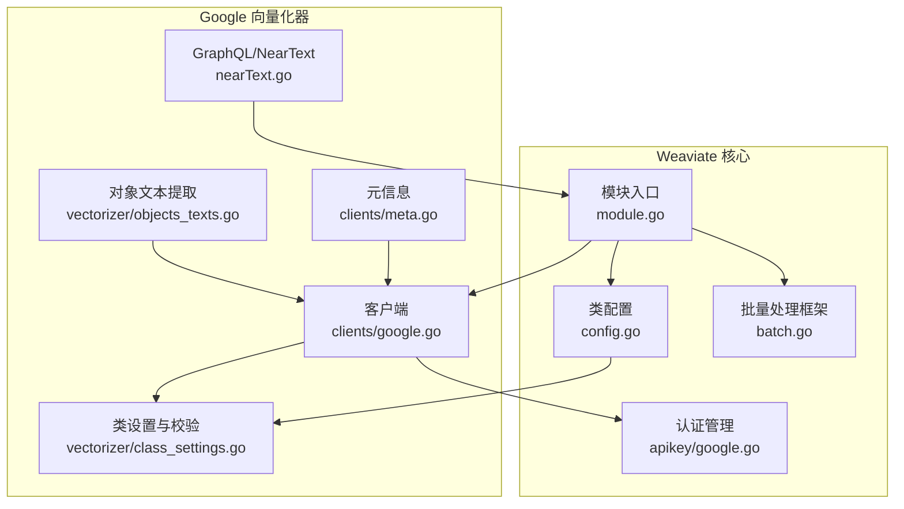
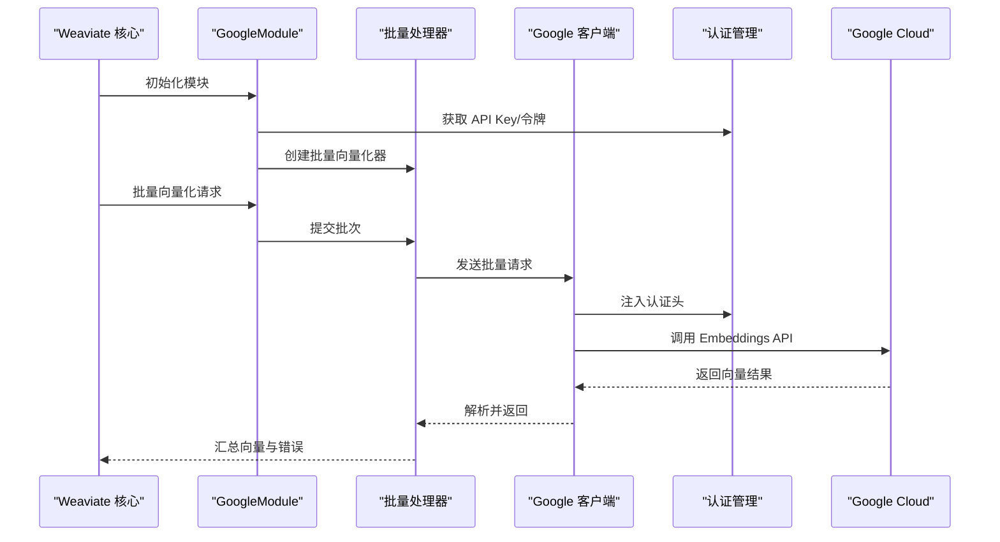
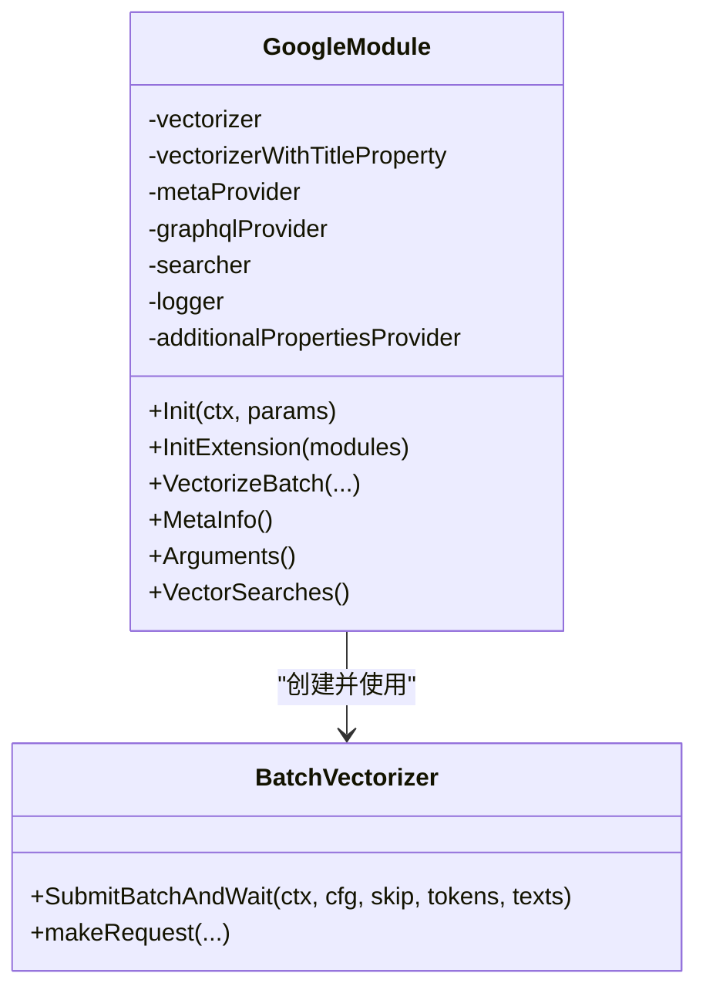
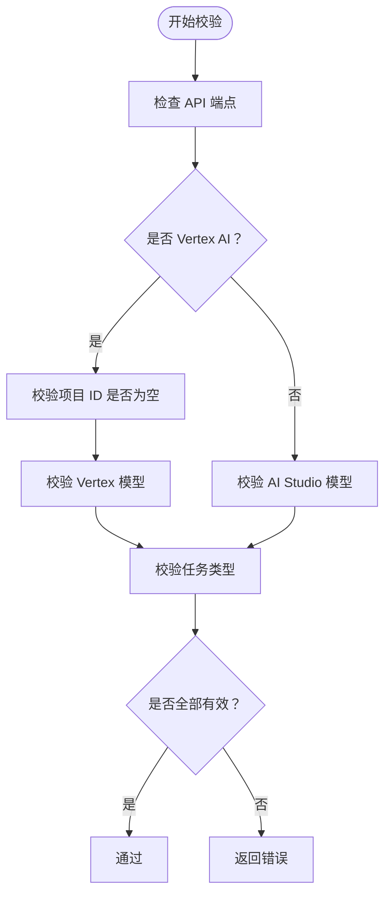
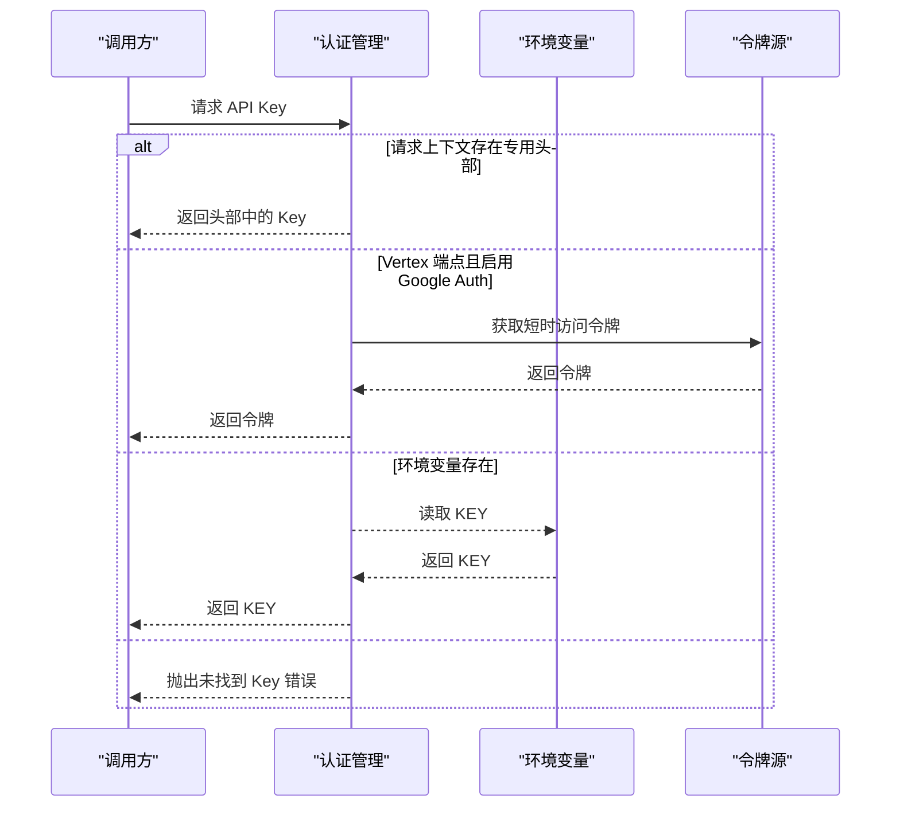
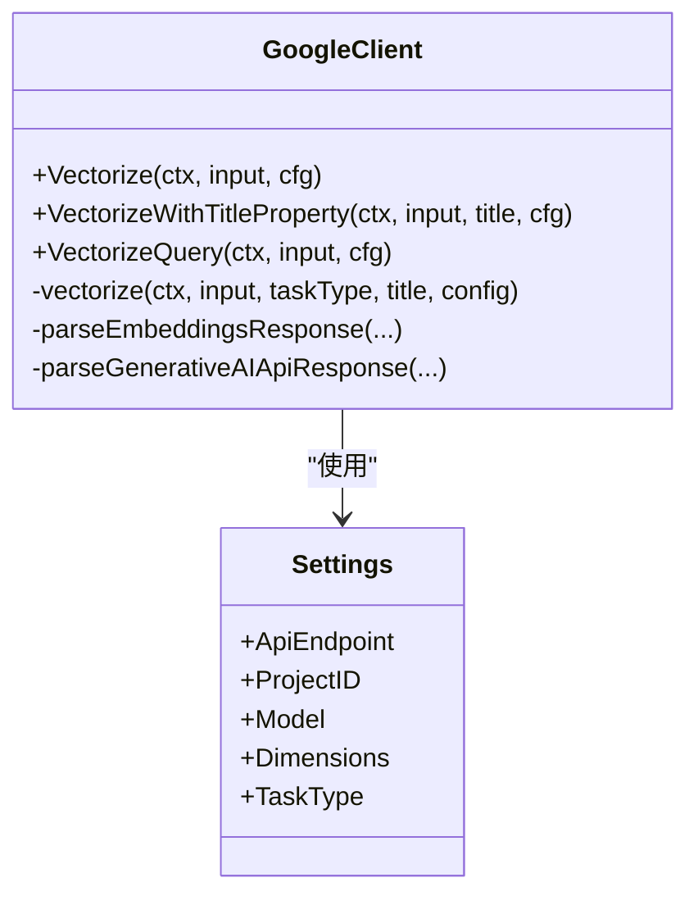
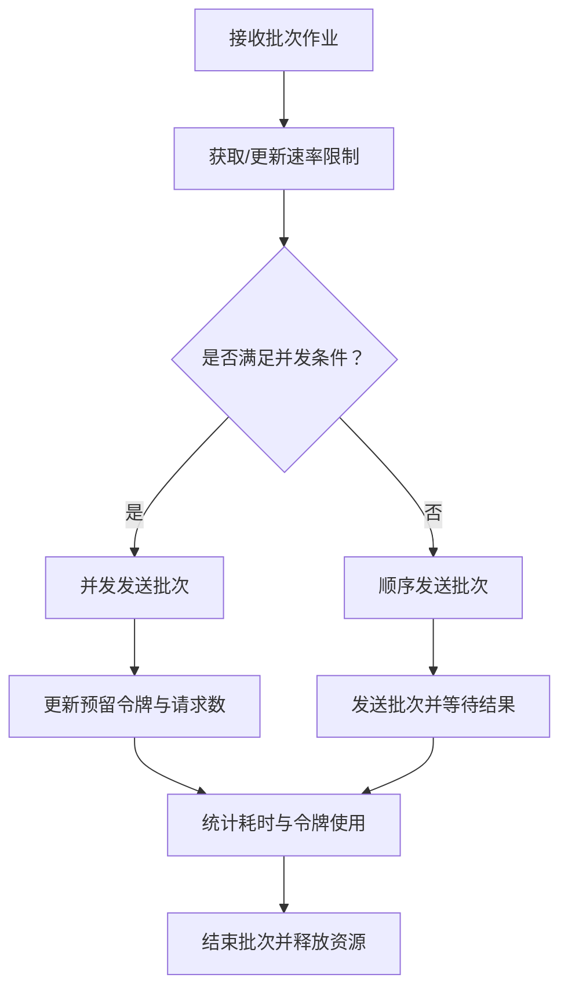
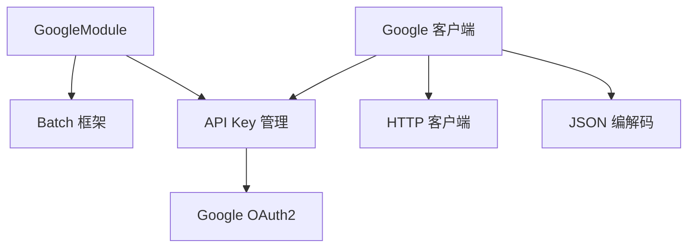

# Google 向量化器

<cite>
**本文档引用的文件**
- [modules/text2vec-google/module.go](file://modules/text2vec-google/module.go)
- [modules/text2vec-google/config.go](file://modules/text2vec-google/config.go)
- [modules/text2vec-google/clients/google.go](file://modules/text2vec-google/clients/google.go)
- [modules/text2vec-google/clients/meta.go](file://modules/text2vec-google/clients/meta.go)
- [modules/text2vec-google/vectorizer/class_settings.go](file://modules/text2vec-google/vectorizer/class_settings.go)
- [modules/text2vec-google/vectorizer/objects_texts.go](file://modules/text2vec-google/vectorizer/objects_texts.go)
- [modules/text2vec-google/nearText.go](file://modules/text2vec-google/nearText.go)
- [usecases/modulecomponents/apikey/google.go](file://usecases/modulecomponents/apikey/google.go)
- [usecases/modulecomponents/batch/batch.go](file://usecases/modulecomponents/batch/batch.go)
- [modules/text2vec-google/clients/google_test.go](file://modules/text2vec-google/clients/google_test.go)
- [test/modules/text2vec-google/text2vec_google_test.go](file://test/modules/text2vec-google/text2vec_google_test.go)
</cite>

## 目录
1. [简介](#简介)
2. [项目结构](#项目结构)
3. [核心组件](#核心组件)
4. [架构概览](#架构概览)
5. [详细组件分析](#详细组件分析)
6. [依赖关系分析](#依赖关系分析)
7. [性能考虑](#性能考虑)
8. [故障排除指南](#故障排除指南)
9. [结论](#结论)
10. [附录](#附录)

## 简介
本文件为 Weaviate 的 Google 文本向量化器提供全面技术文档。该模块基于 Google Cloud AI Platform（Vertex AI）与 Google Generative AI Studio 提供的文本嵌入能力，支持多种模型与任务类型，具备企业级可靠性与高精度语义向量生成能力。文档涵盖认证配置、API 调用流程、批量处理机制、模型选择策略、错误处理与监控指标，并提供配置示例与最佳实践。

## 项目结构
Google 向量化器位于模块化目录中，采用分层设计：
- 模块入口与生命周期管理：modules/text2vec-google/module.go
- 类配置与校验：modules/text2vec-google/config.go、modules/text2vec-google/vectorizer/class_settings.go
- 客户端与 API 调用：modules/text2vec-google/clients/google.go
- GraphQL 参数与搜索器：modules/text2vec-google/nearText.go
- 批量处理框架：usecases/modulecomponents/batch/batch.go
- 认证与令牌管理：usecases/modulecomponents/apikey/google.go
- 测试与示例：modules/text2vec-google/clients/google_test.go、test/modules/text2vec-google/text2vec_google_test.go

**图表来源**
- [modules/text2vec-google/module.go](file://modules/text2vec-google/module.go#L74-L129)
- [modules/text2vec-google/clients/google.go](file://modules/text2vec-google/clients/google.go#L87-L98)
- [modules/text2vec-google/vectorizer/class_settings.go](file://modules/text2vec-google/vectorizer/class_settings.go#L92-L97)
- [usecases/modulecomponents/batch/batch.go](file://usecases/modulecomponents/batch/batch.go#L75-L92)
- [usecases/modulecomponents/apikey/google.go](file://usecases/modulecomponents/apikey/google.go#L34-L68)

**章节来源**
- [modules/text2vec-google/module.go](file://modules/text2vec-google/module.go#L1-L179)
- [modules/text2vec-google/config.go](file://modules/text2vec-google/config.go#L1-L48)
- [modules/text2vec-google/clients/google.go](file://modules/text2vec-google/clients/google.go#L1-L465)

## 核心组件
- 模块初始化与生命周期：负责加载环境变量、构建客户端、注册 GraphQL 参数与搜索器、初始化批量向量化器。
- 类配置与校验：定义默认参数、属性默认值、类级别验证逻辑（项目 ID、模型名称、任务类型等）。
- 客户端与 API 调用：封装 Google Cloud Vertex AI 与 Generative AI Studio 的请求构建、认证头注入、响应解析与错误处理。
- 批量处理：基于令牌与请求限制的智能调度，支持并发与顺序两种模式，自动重试与限流。
- 认证与令牌：优先从请求上下文读取 API Key，其次回退到环境变量；Vertex AI 支持短时访问令牌。
- GraphQL/NearText：提供 GraphQL 查询参数与向量搜索能力。

**章节来源**
- [modules/text2vec-google/module.go](file://modules/text2vec-google/module.go#L74-L129)
- [modules/text2vec-google/config.go](file://modules/text2vec-google/config.go#L25-L45)
- [modules/text2vec-google/clients/google.go](file://modules/text2vec-google/clients/google.go#L122-L145)
- [usecases/modulecomponents/batch/batch.go](file://usecases/modulecomponents/batch/batch.go#L130-L235)
- [usecases/modulecomponents/apikey/google.go](file://usecases/modulecomponents/apikey/google.go#L34-L103)

## 架构概览
Google 向量化器通过模块入口统一接入 Weaviate，客户端根据配置选择 Vertex AI 或 Generative AI Studio 端点，结合任务类型与维度参数生成语义向量。批量处理框架在令牌与请求限制内进行智能调度，确保吞吐与稳定性。

**图表来源**
- [modules/text2vec-google/module.go](file://modules/text2vec-google/module.go#L108-L129)
- [usecases/modulecomponents/batch/batch.go](file://usecases/modulecomponents/batch/batch.go#L470-L509)
- [modules/text2vec-google/clients/google.go](file://modules/text2vec-google/clients/google.go#L151-L197)
- [usecases/modulecomponents/apikey/google.go](file://usecases/modulecomponents/apikey/google.go#L34-L68)

## 详细组件分析

### 模块入口与生命周期
- 初始化阶段：读取环境变量（GOOGLE_APIKEY、PALM_APIKEY）、USE_GOOGLE_AUTH，构建客户端并注册 GraphQL 参数与 NearText 搜索器。
- 批量向量化：配置批量超时、最大对象数、令牌上限与倍率，启用令牌限制与并发调度。
- 元信息提供：返回模块文档链接以便用户查阅官方文档。

**图表来源**
- [modules/text2vec-google/module.go](file://modules/text2vec-google/module.go#L47-L129)
- [usecases/modulecomponents/batch/batch.go](file://usecases/modulecomponents/batch/batch.go#L75-L92)

**章节来源**
- [modules/text2vec-google/module.go](file://modules/text2vec-google/module.go#L74-L129)
- [modules/text2vec-google/nearText.go](file://modules/text2vec-google/nearText.go#L19-L31)

### 类配置与模型选择
- 默认参数：类名向量化开关、属性索引默认行为、默认 API 端点、模型与任务类型。
- 校验规则：
  - Vertex AI：必须提供项目 ID；模型需在可用列表中。
  - Generative AI Studio：可不提供项目 ID；模型需在 AI Studio 可用列表中。
  - 任务类型仅允许预定义集合。
- 维度参数：不同模型有默认维度，可通过配置覆盖。

**图表来源**
- [modules/text2vec-google/vectorizer/class_settings.go](file://modules/text2vec-google/vectorizer/class_settings.go#L99-L130)

**章节来源**
- [modules/text2vec-google/vectorizer/class_settings.go](file://modules/text2vec-google/vectorizer/class_settings.go#L24-L86)
- [modules/text2vec-google/config.go](file://modules/text2vec-google/config.go#L25-L45)

### 认证机制与 API 配置
- API Key 优先级：
  - 请求上下文中的专用头部（Vertex/Studio/Palm/通用）。
  - USE_GOOGLE_AUTH 开启且为 Vertex 端点时，使用短时访问令牌。
  - 环境变量 GOOGLE_APIKEY/PALM_APIKEY。
- 头部注入：
  - Generative AI Studio 使用 x-goog-api-key。
  - Vertex AI 使用 Authorization: Bearer。
- 令牌缓存：短时访问令牌在有效期内复用，避免频繁刷新。

**图表来源**
- [usecases/modulecomponents/apikey/google.go](file://usecases/modulecomponents/apikey/google.go#L34-L103)

**章节来源**
- [usecases/modulecomponents/apikey/google.go](file://usecases/modulecomponents/apikey/google.go#L34-L103)
- [modules/text2vec-google/clients/google.go](file://modules/text2vec-google/clients/google.go#L171-L180)

### API 调用与任务类型映射
- 端点选择：
  - Vertex AI：us-central1-aiplatform.googleapis.com。
  - Generative AI Studio：generativelanguage.googleapis.com。
- 请求体构建：
  - Vertex AI：实例数组，支持输出维度参数。
  - Generative AI Studio：内容请求数组，支持任务类型与标题。
- 响应解析：
  - Vertex AI：预测结果中的嵌入向量。
  - Generative AI Studio：批量嵌入结果，兼容旧版模型字段。
- 任务类型映射：
  - 文档级检索：默认 RETRIEVAL_DOCUMENT。
  - 查询级检索：默认 RETRIEVAL_QUERY。
  - 其他任务类型：问题回答、事实验证、代码检索、分类、聚类、语义相似度。

**图表来源**
- [modules/text2vec-google/clients/google.go](file://modules/text2vec-google/clients/google.go#L107-L120)
- [modules/text2vec-google/clients/google.go](file://modules/text2vec-google/clients/google.go#L151-L197)

**章节来源**
- [modules/text2vec-google/clients/google.go](file://modules/text2vec-google/clients/google.go#L58-L68)
- [modules/text2vec-google/clients/google.go](file://modules/text2vec-google/clients/google.go#L203-L235)
- [modules/text2vec-google/clients/google.go](file://modules/text2vec-google/clients/google.go#L344-L377)

### 批量处理机制
- 批量参数：
  - 对象数上限、时间上限、令牌上限、令牌倍率、是否启用令牌限制。
- 调度策略：
  - 并发模式：当剩余令牌充足时并行发送多个批次，预留令牌并在完成后释放。
  - 顺序模式：逐个批次发送，实时更新速率限制。
- 令牌与请求限制：
  - 自定义速率限制器，按 61 秒周期重置。
  - 通过回调函数在每次请求后扣减剩余令牌与请求数。
- 错误处理：
  - 上下文取消/超时、单对象过大、网络错误等场景均有明确错误返回。

**图表来源**
- [usecases/modulecomponents/batch/batch.go](file://usecases/modulecomponents/batch/batch.go#L130-L235)
- [usecases/modulecomponents/batch/batch.go](file://usecases/modulecomponents/batch/batch.go#L283-L429)
- [modules/text2vec-google/clients/google.go](file://modules/text2vec-google/clients/google.go#L122-L145)

**章节来源**
- [modules/text2vec-google/module.go](file://modules/text2vec-google/module.go#L38-L45)
- [usecases/modulecomponents/batch/batch.go](file://usecases/modulecomponents/batch/batch.go#L130-L235)
- [modules/text2vec-google/clients/google.go](file://modules/text2vec-google/clients/google.go#L122-L145)

### GraphQL 与 NearText 集成
- GraphQL 参数：NearText 查询参数由模块提供，支持与向量搜索结合。
- 搜索器：NearText 搜索器基于向量化器执行查询向量生成与相似度计算。

**章节来源**
- [modules/text2vec-google/nearText.go](file://modules/text2vec-google/nearText.go#L19-L31)

## 依赖关系分析
- 模块依赖：
  - usecases/modulecomponents/batch：批量处理框架。
  - usecases/modulecomponents/apikey：认证与令牌管理。
  - usecases/modulecomponents：通用向量化结果与速率限制。
- 第三方依赖：
  - Google OAuth2 令牌源（Vertex AI 场景）。
  - HTTP 客户端与 JSON 编解码。

**图表来源**
- [modules/text2vec-google/module.go](file://modules/text2vec-google/module.go#L108-L129)
- [usecases/modulecomponents/apikey/google.go](file://usecases/modulecomponents/apikey/google.go#L77-L93)

**章节来源**
- [modules/text2vec-google/module.go](file://modules/text2vec-google/module.go#L108-L129)
- [usecases/modulecomponents/apikey/google.go](file://usecases/modulecomponents/apikey/google.go#L77-L93)

## 性能考虑
- 批量大小与时间：
  - 最大对象数与时间上限用于控制单次批量的规模与时长，避免超时。
- 令牌限制：
  - 通过速率限制器与预留令牌机制，最大化吞吐同时避免超出配额。
- 并发策略：
  - 在令牌充足时并发发送多个批次，显著提升吞吐。
- 监控指标：
  - 批量队列等待时长、请求耗时、令牌使用量、请求次数等指标便于性能分析与优化。

**章节来源**
- [modules/text2vec-google/module.go](file://modules/text2vec-google/module.go#L38-L45)
- [usecases/modulecomponents/batch/batch.go](file://usecases/modulecomponents/batch/batch.go#L192-L202)

## 故障排除指南
- 认证失败：
  - 确认请求上下文或环境变量中提供了正确的 API Key。
  - Vertex 端点且启用 Google Auth 时，确认服务账号具有相应权限。
- 项目 ID 缺失：
  - Vertex 端点必须提供项目 ID，否则校验失败。
- 模型名称错误：
  - Vertex AI 与 Generative AI Studio 的模型列表不同，请参考可用模型清单。
- 任务类型错误：
  - 仅支持预定义的任务类型集合。
- 上下文超时：
  - 批量处理中若上下文超时，会返回相应错误；适当调整超时时间或减少批量大小。
- 响应解析错误：
  - API 返回非 200 或包含错误字段时，客户端会抛出连接失败错误。

**章节来源**
- [modules/text2vec-google/clients/google.go](file://modules/text2vec-google/clients/google.go#L237-L246)
- [modules/text2vec-google/vectorizer/class_settings.go](file://modules/text2vec-google/vectorizer/class_settings.go#L99-L130)
- [modules/text2vec-google/clients/google_test.go](file://modules/text2vec-google/clients/google_test.go#L132-L174)

## 结论
Google 文本向量化器通过模块化设计与完善的认证、批量处理与错误处理机制，实现了与 Google Cloud 生态系统的无缝集成。其企业级可靠性体现在速率限制、并发调度与监控指标上，高质量的语义向量得益于多模型支持与任务类型适配。配合灵活的配置选项与测试用例，开发者可以快速完成部署与优化。

## 附录

### 配置示例与最佳实践
- 环境变量
  - GOOGLE_APIKEY 或 PALM_APIKEY：用于 Vertex/Studio 端点的 API Key。
  - USE_GOOGLE_AUTH：启用后 Vertex 端点使用短时访问令牌。
- 类配置参数
  - apiEndpoint：默认 Vertex 端点，也可指向 Generative AI Studio。
  - projectId：Vertex 端点必填。
  - modelId/model：模型名称，默认为 Gemini 系列。
  - dimensions：输出向量维度，部分模型有默认值。
  - taskType：任务类型，如 RETRIEVAL_QUERY、QUESTION_ANSWERING 等。
  - titleProperty：文档级向量化时使用的标题字段。
- 批量向量化
  - 合理设置最大对象数、时间与令牌上限，以平衡吞吐与稳定性。
  - 在高并发场景下启用并发模式，充分利用令牌配额。

**章节来源**
- [modules/text2vec-google/config.go](file://modules/text2vec-google/config.go#L25-L45)
- [modules/text2vec-google/vectorizer/class_settings.go](file://modules/text2vec-google/vectorizer/class_settings.go#L148-L173)
- [modules/text2vec-google/module.go](file://modules/text2vec-google/module.go#L38-L45)

### 成本效益与定价模式
- 模型选择：
  - 不同模型的单价与性能各异，建议根据任务类型与精度需求选择合适模型。
- 批量策略：
  - 合理的批量大小与并发调度可降低请求次数，从而节省成本。
- 监控与优化：
  - 通过监控指标识别瓶颈，动态调整批量参数与并发策略。

[本节为通用指导，无需特定文件引用]

### 性能基准测试
- 建议指标：
  - 批量吞吐（对象/秒）、平均请求耗时、令牌使用效率、错误率。
- 测试方法：
  - 使用测试套件对不同模型与任务类型进行基准测试，记录关键指标并对比分析。

**章节来源**
- [test/modules/text2vec-google/text2vec_google_test.go](file://test/modules/text2vec-google/text2vec_google_test.go#L21-L98)