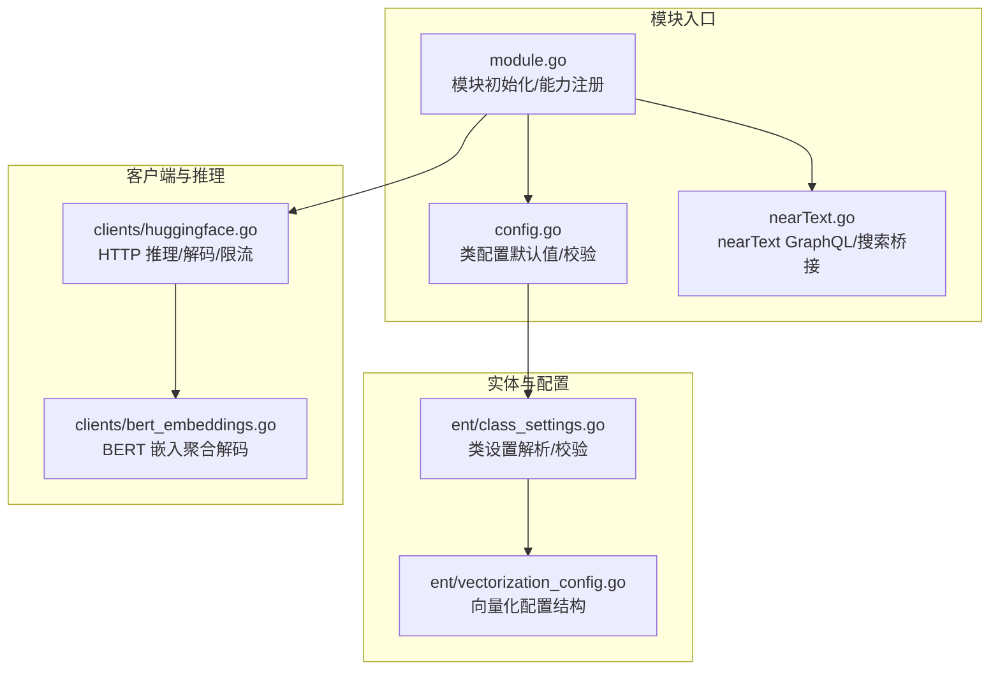
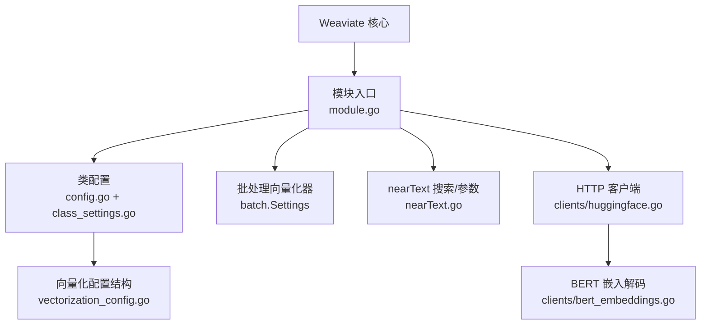
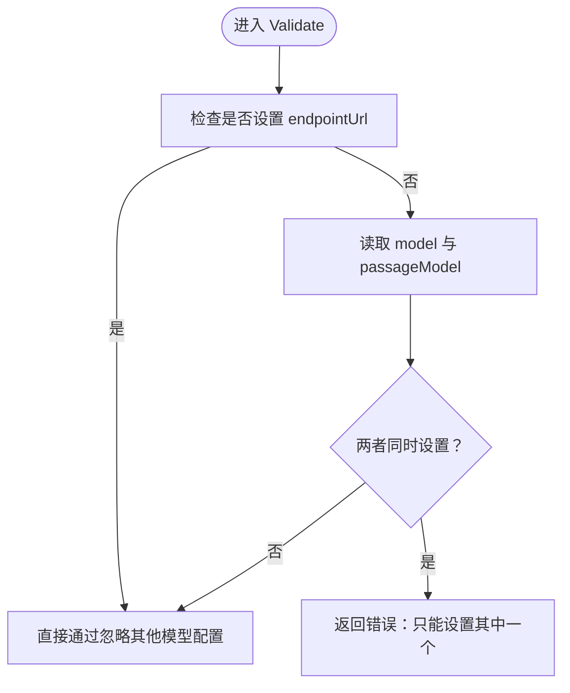
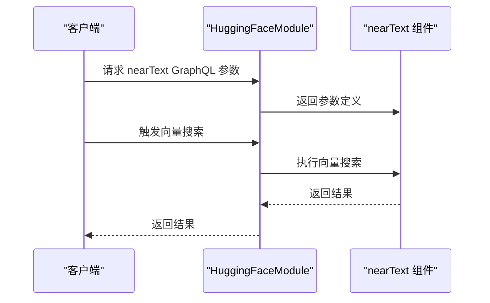
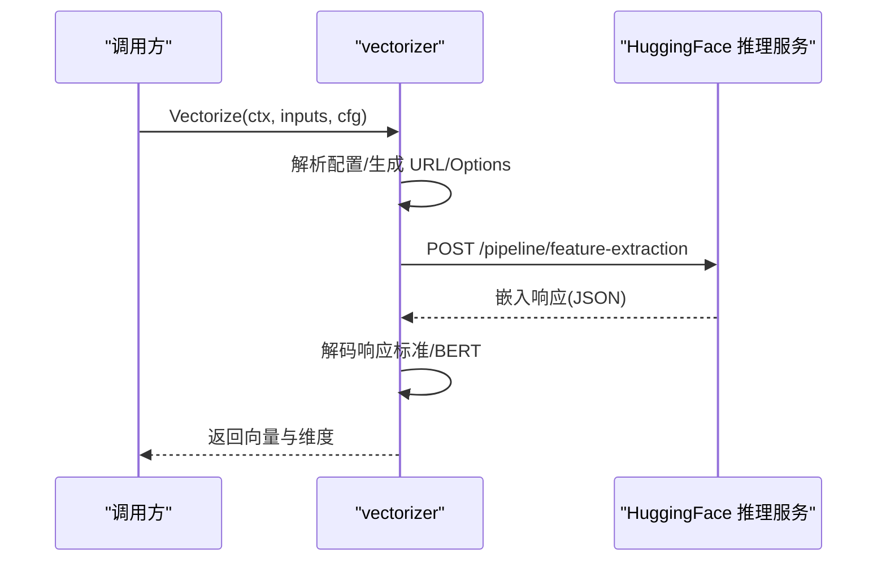
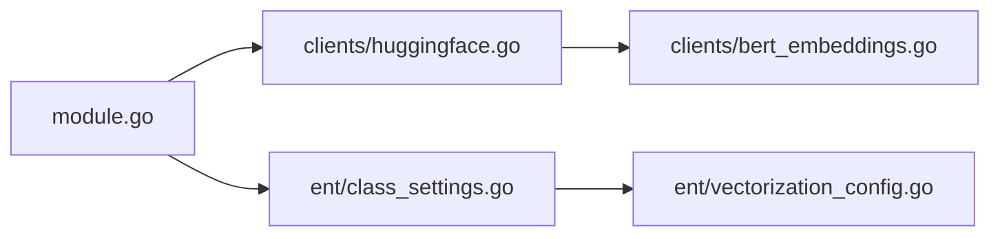

# HuggingFace 向量化器

<cite>
**本文引用的文件**
- [modules/text2vec-huggingface/module.go](file://modules/text2vec-huggingface/module.go)
- [modules/text2vec-huggingface/config.go](file://modules/text2vec-huggingface/config.go)
- [modules/text2vec-huggingface/nearText.go](file://modules/text2vec-huggingface/nearText.go)
- [modules/text2vec-huggingface/clients/huggingface.go](file://modules/text2vec-huggingface/clients/huggingface.go)
- [modules/text2vec-huggingface/clients/bert_embeddings.go](file://modules/text2vec-huggingface/clients/bert_embeddings.go)
- [modules/text2vec-huggingface/ent/class_settings.go](file://modules/text2vec-huggingface/ent/class_settings.go)
- [modules/text2vec-huggingface/ent/vectorization_config.go](file://modules/text2vec-huggingface/ent/vectorization_config.go)
- [test/modules/text2vec-huggingface/text2vec_huggingface_test.go](file://test/modules/text2vec-huggingface/text2vec_huggingface_test.go)
</cite>

## 目录
1. [简介](#简介)
2. [项目结构](#项目结构)
3. [核心组件](#核心组件)
4. [架构总览](#架构总览)
5. [详细组件分析](#详细组件分析)
6. [依赖关系分析](#依赖关系分析)
7. [性能与资源特性](#性能与资源特性)
8. [故障排查指南](#故障排查指南)
9. [结论](#结论)
10. [附录：配置与使用示例](#附录配置与使用示例)

## 简介
本技术文档面向 Weaviate 的 HuggingFace 文本向量化器模块，系统性解析其与 HuggingFace Transformers 生态的集成方式，覆盖以下关键主题：
- 在线 API 调用与模型选择策略
- 类配置参数与默认值
- 模型加载机制、推理优化、批处理策略与内存管理
- 隐私友好的本地部署选项与开源生态优势
- 典型使用场景与最佳实践

该模块通过统一的文本向量化接口，将输入文本转换为稠密向量，用于后续的相似度检索与语义搜索。

## 项目结构
HuggingFace 向量化器位于 modules/text2vec-huggingface 目录下，主要由以下层次构成：
- 模块入口与生命周期管理：module.go
- 类配置与校验：config.go、ent/class_settings.go、ent/vectorization_config.go
- GraphQL 参数与近邻搜索桥接：nearText.go
- 客户端与推理实现：clients/huggingface.go、clients/bert_embeddings.go



图表来源
- [modules/text2vec-huggingface/module.go](file://modules/text2vec-huggingface/module.go#L43-L117)
- [modules/text2vec-huggingface/config.go](file://modules/text2vec-huggingface/config.go#L25-L49)
- [modules/text2vec-huggingface/nearText.go](file://modules/text2vec-huggingface/nearText.go#L19-L31)
- [modules/text2vec-huggingface/ent/class_settings.go](file://modules/text2vec-huggingface/ent/class_settings.go#L34-L87)
- [modules/text2vec-huggingface/ent/vectorization_config.go](file://modules/text2vec-huggingface/ent/vectorization_config.go#L14-L18)
- [modules/text2vec-huggingface/clients/huggingface.go](file://modules/text2vec-huggingface/clients/huggingface.go#L70-L161)
- [modules/text2vec-huggingface/clients/bert_embeddings.go](file://modules/text2vec-huggingface/clients/bert_embeddings.go#L16-L41)

章节来源
- [modules/text2vec-huggingface/module.go](file://modules/text2vec-huggingface/module.go#L43-L117)
- [modules/text2vec-huggingface/config.go](file://modules/text2vec-huggingface/config.go#L25-L49)
- [modules/text2vec-huggingface/nearText.go](file://modules/text2vec-huggingface/nearText.go#L19-L31)
- [modules/text2vec-huggingface/ent/class_settings.go](file://modules/text2vec-huggingface/ent/class_settings.go#L34-L87)
- [modules/text2vec-huggingface/ent/vectorization_config.go](file://modules/text2vec-huggingface/ent/vectorization_config.go#L14-L18)
- [modules/text2vec-huggingface/clients/huggingface.go](file://modules/text2vec-huggingface/clients/huggingface.go#L70-L161)
- [modules/text2vec-huggingface/clients/bert_embeddings.go](file://modules/text2vec-huggingface/clients/bert_embeddings.go#L16-L41)

## 核心组件
- 模块入口与能力注册
  - 名称与类型：模块名为 text2vec-huggingface，类型为 Text2ManyVec（多模态/多向量）
  - 初始化流程：读取环境变量中的 HUGGINGFACE_APIKEY，构造 HTTP 客户端，注册批处理向量化器与额外属性提供者
  - 批处理策略：无令牌上限，最大对象数每批 100，最大批时长约 10 秒，最大令牌数按类配置动态设定
- 类配置与校验
  - 默认值：是否向量化类名、模型、waitForModel、useGPU、useCache
  - 校验规则：若显式设置了 endpointUrl，则忽略其他模型相关配置；若同时设置 model 与 passageModel 则报错
- GraphQL 与搜索桥接
  - nearText GraphQL 参数与向量搜索器通过 nearText 组件桥接，支持在 GraphQL 查询中进行近邻文本检索
- 客户端与推理
  - HTTP 推理：默认路由到 HuggingFace 推理服务，支持自定义 endpointUrl
  - 模型选项：waitForModel、useGPU、useCache
  - 响应解码：支持标准嵌入数组与 BERT 多维嵌入的平均池化聚合
  - 错误处理：对非 2xx 状态码进行结构化错误封装，并携带警告信息
  - 速率限制：模块上下文提供请求后刷新逻辑，但返回值标记为不返回速率限制

章节来源
- [modules/text2vec-huggingface/module.go](file://modules/text2vec-huggingface/module.go#L32-L41)
- [modules/text2vec-huggingface/module.go](file://modules/text2vec-huggingface/module.go#L65-L117)
- [modules/text2vec-huggingface/config.go](file://modules/text2vec-huggingface/config.go#L25-L49)
- [modules/text2vec-huggingface/nearText.go](file://modules/text2vec-huggingface/nearText.go#L19-L31)
- [modules/text2vec-huggingface/clients/huggingface.go](file://modules/text2vec-huggingface/clients/huggingface.go#L33-L43)
- [modules/text2vec-huggingface/clients/huggingface.go](file://modules/text2vec-huggingface/clients/huggingface.go#L88-L161)
- [modules/text2vec-huggingface/clients/huggingface.go](file://modules/text2vec-huggingface/clients/huggingface.go#L163-L189)
- [modules/text2vec-huggingface/clients/huggingface.go](file://modules/text2vec-huggingface/clients/huggingface.go#L191-L224)
- [modules/text2vec-huggingface/clients/bert_embeddings.go](file://modules/text2vec-huggingface/clients/bert_embeddings.go#L22-L41)

## 架构总览
HuggingFace 向量化器采用“模块 + 客户端 + 实体配置”的分层设计：
- 模块层负责生命周期与能力注册
- 客户端层负责网络请求、响应解码与错误处理
- 实体层负责类配置解析与校验



图表来源
- [modules/text2vec-huggingface/module.go](file://modules/text2vec-huggingface/module.go#L65-L117)
- [modules/text2vec-huggingface/config.go](file://modules/text2vec-huggingface/config.go#L25-L49)
- [modules/text2vec-huggingface/nearText.go](file://modules/text2vec-huggingface/nearText.go#L19-L31)
- [modules/text2vec-huggingface/clients/huggingface.go](file://modules/text2vec-huggingface/clients/huggingface.go#L70-L161)
- [modules/text2vec-huggingface/clients/bert_embeddings.go](file://modules/text2vec-huggingface/clients/bert_embeddings.go#L16-L41)
- [modules/text2vec-huggingface/ent/class_settings.go](file://modules/text2vec-huggingface/ent/class_settings.go#L34-L87)
- [modules/text2vec-huggingface/ent/vectorization_config.go](file://modules/text2vec-huggingface/ent/vectorization_config.go#L14-L18)

## 详细组件分析

### 组件一：模块入口与生命周期（module.go）
- 初始化
  - 从环境变量读取 HUGGINGFACE_APIKEY
  - 创建 HTTP 客户端并注入超时
  - 注册批处理向量化器与额外属性提供者
- 批处理设置
  - 无令牌上限，最大对象数每批 100，最大批时长约 10 秒，最大令牌数按类配置动态设定
- 能力注册
  - 支持向量化对象、批量向量化、元信息查询、GraphQL nearText 参数与搜索

```mermaid
classDiagram
class HuggingFaceModule {
+Name() string
+Type() ModuleType
+Init(ctx, params) error
+InitExtension(modules) error
+VectorizeObject(ctx, obj, cfg) ([]float32, AdditionalProperties, error)
+VectorizeBatch(ctx, objs, skip, cfg) ([][]float32, [], map[int]error)
+MetaInfo() (map[string]interface{}, error)
+AdditionalProperties() map[string]AdditionalProperty
+VectorizeInput(ctx, input, cfg) ([]float32, error)
}
class BatchSettings {
+TokenMultiplier int
+MaxTimePerBatch float64
+MaxObjectsPerBatch int
+MaxTokensPerBatch(cfg) int
+HasTokenLimit bool
+ReturnsRateLimit bool
}
HuggingFaceModule --> BatchSettings : "使用"
```

图表来源
- [modules/text2vec-huggingface/module.go](file://modules/text2vec-huggingface/module.go#L47-L55)
- [modules/text2vec-huggingface/module.go](file://modules/text2vec-huggingface/module.go#L34-L41)
- [modules/text2vec-huggingface/module.go](file://modules/text2vec-huggingface/module.go#L65-L117)

章节来源
- [modules/text2vec-huggingface/module.go](file://modules/text2vec-huggingface/module.go#L34-L117)

### 组件二：类配置与校验（config.go、ent/class_settings.go、ent/vectorization_config.go）
- 默认值
  - 默认模型：sentence-transformers/msmarco-bert-base-dot-v5
  - 默认选项：waitForModel=false、useGPU=false、useCache=true
  - 默认行为：向量化类名开启、属性索引开启、属性名向量化关闭
- 校验规则
  - 若显式设置 endpointUrl，则忽略其他模型相关配置
  - 不能同时设置 model 与 passageModel
- 配置结构
  - VectorizationConfig 包含 endpointUrl、model、waitForModel、useGPU、useCache



图表来源
- [modules/text2vec-huggingface/ent/class_settings.go](file://modules/text2vec-huggingface/ent/class_settings.go#L67-L87)
- [modules/text2vec-huggingface/ent/class_settings.go](file://modules/text2vec-huggingface/ent/class_settings.go#L89-L103)
- [modules/text2vec-huggingface/ent/vectorization_config.go](file://modules/text2vec-huggingface/ent/vectorization_config.go#L14-L18)

章节来源
- [modules/text2vec-huggingface/config.go](file://modules/text2vec-huggingface/config.go#L25-L49)
- [modules/text2vec-huggingface/ent/class_settings.go](file://modules/text2vec-huggingface/ent/class_settings.go#L21-L87)
- [modules/text2vec-huggingface/ent/vectorization_config.go](file://modules/text2vec-huggingface/ent/vectorization_config.go#L14-L18)

### 组件三：GraphQL 与近邻搜索（nearText.go）
- nearText GraphQL 参数与向量搜索器通过 nearText 组件桥接
- 模块扩展阶段会尝试从其他模块获取 nearText 文本变换器，以增强 nearText 的文本预处理能力



图表来源
- [modules/text2vec-huggingface/nearText.go](file://modules/text2vec-huggingface/nearText.go#L19-L31)

章节来源
- [modules/text2vec-huggingface/nearText.go](file://modules/text2vec-huggingface/nearText.go#L19-L31)

### 组件四：HTTP 推理与响应解码（clients/huggingface.go、clients/bert_embeddings.go）
- HTTP 推理
  - 默认路由：https://router.huggingface.co/hf-inference/models/{model}/pipeline/feature-extraction
  - 支持自定义 endpointUrl
  - 发送 JSON 请求，包含 inputs 与 options（waitForModel、useGPU、useCache）
  - 读取 Authorization 头或环境变量 HUGGINGFACE_APIKEY
- 响应解码
  - 支持两种格式：
    - 标准嵌入数组：直接返回
    - BERT 多维嵌入：对每个样本进行平均池化，得到最终向量
- 错误处理
  - 对非 2xx 状态码进行结构化错误封装，包含错误消息、估计等待时间与警告列表
- 速率限制
  - 提供请求后刷新逻辑，但返回值标记为不返回速率限制



图表来源
- [modules/text2vec-huggingface/clients/huggingface.go](file://modules/text2vec-huggingface/clients/huggingface.go#L88-L161)
- [modules/text2vec-huggingface/clients/huggingface.go](file://modules/text2vec-huggingface/clients/huggingface.go#L191-L224)
- [modules/text2vec-huggingface/clients/bert_embeddings.go](file://modules/text2vec-huggingface/clients/bert_embeddings.go#L22-L41)

章节来源
- [modules/text2vec-huggingface/clients/huggingface.go](file://modules/text2vec-huggingface/clients/huggingface.go#L33-L43)
- [modules/text2vec-huggingface/clients/huggingface.go](file://modules/text2vec-huggingface/clients/huggingface.go#L88-L161)
- [modules/text2vec-huggingface/clients/huggingface.go](file://modules/text2vec-huggingface/clients/huggingface.go#L163-L189)
- [modules/text2vec-huggingface/clients/huggingface.go](file://modules/text2vec-huggingface/clients/huggingface.go#L191-L224)
- [modules/text2vec-huggingface/clients/huggingface.go](file://modules/text2vec-huggingface/clients/huggingface.go#L263-L289)
- [modules/text2vec-huggingface/clients/bert_embeddings.go](file://modules/text2vec-huggingface/clients/bert_embeddings.go#L22-L41)

## 依赖关系分析
- 模块与客户端
  - 模块通过 clients.New(apiKey, timeout, logger) 构造 HTTP 客户端
  - 客户端负责网络请求、响应解码与错误处理
- 模块与实体配置
  - 类配置解析由 ent.NewClassSettings(cfg) 完成，随后映射到 VectorizationConfig
- 批处理与令牌限制
  - 批处理设置中 HasTokenLimit=false，表示不限制令牌数，适合大模型推理场景



图表来源
- [modules/text2vec-huggingface/module.go](file://modules/text2vec-huggingface/module.go#L99-L112)
- [modules/text2vec-huggingface/ent/class_settings.go](file://modules/text2vec-huggingface/ent/class_settings.go#L39-L41)
- [modules/text2vec-huggingface/ent/vectorization_config.go](file://modules/text2vec-huggingface/ent/vectorization_config.go#L14-L18)
- [modules/text2vec-huggingface/clients/huggingface.go](file://modules/text2vec-huggingface/clients/huggingface.go#L77-L86)
- [modules/text2vec-huggingface/clients/bert_embeddings.go](file://modules/text2vec-huggingface/clients/bert_embeddings.go#L18-L20)

章节来源
- [modules/text2vec-huggingface/module.go](file://modules/text2vec-huggingface/module.go#L99-L112)
- [modules/text2vec-huggingface/ent/class_settings.go](file://modules/text2vec-huggingface/ent/class_settings.go#L39-L41)
- [modules/text2vec-huggingface/ent/vectorization_config.go](file://modules/text2vec-huggingface/ent/vectorization_config.go#L14-L18)
- [modules/text2vec-huggingface/clients/huggingface.go](file://modules/text2vec-huggingface/clients/huggingface.go#L77-L86)
- [modules/text2vec-huggingface/clients/bert_embeddings.go](file://modules/text2vec-huggingface/clients/bert_embeddings.go#L18-L20)

## 性能与资源特性
- 批处理策略
  - 最大对象数每批 100，最大批时长约 10 秒，令牌数上限按类配置动态设定
  - 无令牌上限，适合大规模文本向量化
- 推理优化
  - 支持 useCache 与 waitForModel，可在模型未就绪或缓存可用时优化延迟
  - BERT 嵌入采用平均池化，降低维度冗余
- 内存管理
  - 解码阶段按需分配向量切片，BERT 平均池化过程为原地累加后归一化
- 速率限制
  - 模块上下文提供请求后刷新逻辑，但返回值标记为不返回速率限制，实际使用中建议结合外部限流策略

章节来源
- [modules/text2vec-huggingface/module.go](file://modules/text2vec-huggingface/module.go#L34-L41)
- [modules/text2vec-huggingface/clients/huggingface.go](file://modules/text2vec-huggingface/clients/huggingface.go#L234-L261)
- [modules/text2vec-huggingface/clients/bert_embeddings.go](file://modules/text2vec-huggingface/clients/bert_embeddings.go#L22-L41)

## 故障排查指南
- 缺少 API Key
  - 现象：请求失败并提示未找到有效令牌
  - 处理：确保在请求头 X-Huggingface-Api-Key 或环境变量 HUGGINGFACE_APIKEY 中提供有效令牌
- 服务器内部错误
  - 现象：状态码 500，返回错误与警告列表
  - 处理：检查模型可用性、资源占用与 HuggingFace 侧状态
- 响应不可解析
  - 现象：无法解析嵌入响应
  - 处理：确认返回格式符合预期（标准嵌入数组或 BERT 多维嵌入），必要时调整模型或请求参数
- 配置冲突
  - 现象：同时设置 model 与 passageModel 报错
  - 处理：仅保留一个配置项

章节来源
- [modules/text2vec-huggingface/clients/huggingface.go](file://modules/text2vec-huggingface/clients/huggingface.go#L263-L273)
- [modules/text2vec-huggingface/clients/huggingface.go](file://modules/text2vec-huggingface/clients/huggingface.go#L163-L189)
- [modules/text2vec-huggingface/clients/huggingface.go](file://modules/text2vec-huggingface/clients/huggingface.go#L191-L224)
- [modules/text2vec-huggingface/ent/class_settings.go](file://modules/text2vec-huggingface/ent/class_settings.go#L82-L86)

## 结论
HuggingFace 向量化器通过清晰的模块化设计，将 HuggingFace 推理服务无缝集成到 Weaviate 的向量化管线中。其特点包括：
- 支持广泛的预训练模型（如 BERT、RoBERTa、Sentence-BERT 等）
- 可定制的模型配置（waitForModel、useGPU、useCache）
- 隐私友好的本地部署选项（通过 endpointUrl 自定义推理服务）
- 开源生态优势（基于 HuggingFace 推理服务与 Transformers 生态）

在性能方面，模块采用灵活的批处理策略与解码优化，适合大规模文本向量化任务。建议在生产环境中结合外部限流策略与监控体系，确保稳定与高效。

## 附录：配置与使用示例
- 环境变量
  - HUGGINGFACE_APIKEY：用于鉴权的 API Key
- 类配置要点
  - vectorizeClassName：是否将类名向量化
  - model/passageModel：模型名称（二者择一）
  - options.waitForModel/useGPU/useCache：模型加载与执行选项
  - endpointUrl：自定义推理服务地址（优先于模型配置）
- 使用示例（路径参考）
  - 测试用例展示了如何在向量化配置中指定模型与选项，并进行向量搜索与混合搜索
  - 参考路径：[test/modules/text2vec-huggingface/text2vec_huggingface_test.go](file://test/modules/text2vec-huggingface/text2vec_huggingface_test.go#L42-L84)

章节来源
- [test/modules/text2vec-huggingface/text2vec_huggingface_test.go](file://test/modules/text2vec-huggingface/text2vec_huggingface_test.go#L42-L84)
- [modules/text2vec-huggingface/ent/class_settings.go](file://modules/text2vec-huggingface/ent/class_settings.go#L21-L32)
- [modules/text2vec-huggingface/ent/class_settings.go](file://modules/text2vec-huggingface/ent/class_settings.go#L79-L86)
- [modules/text2vec-huggingface/clients/huggingface.go](file://modules/text2vec-huggingface/clients/huggingface.go#L283-L289)