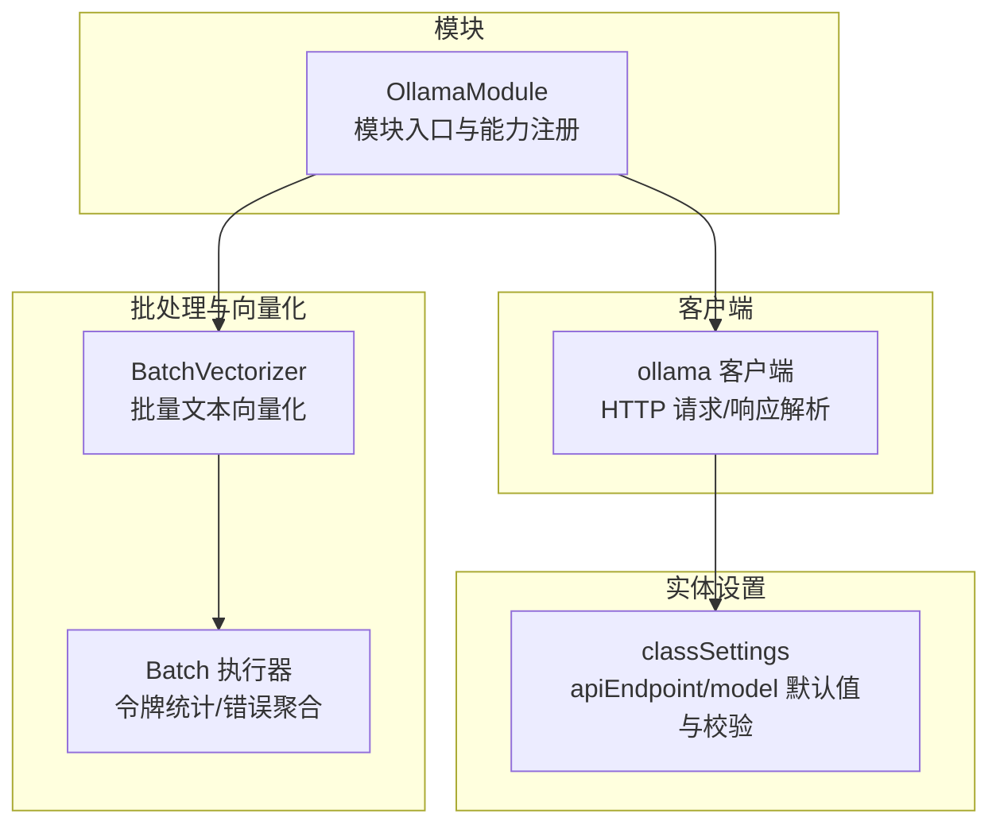
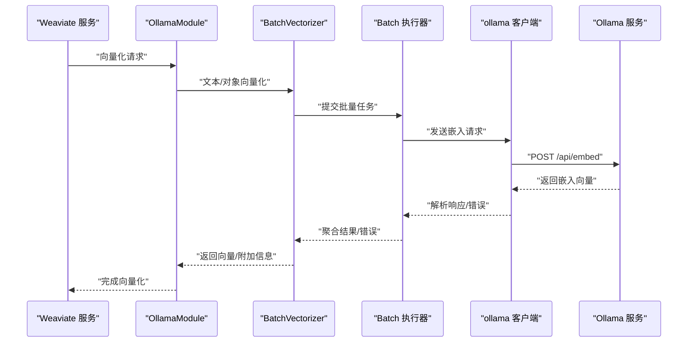
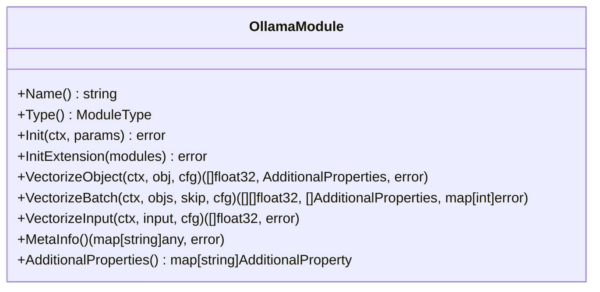
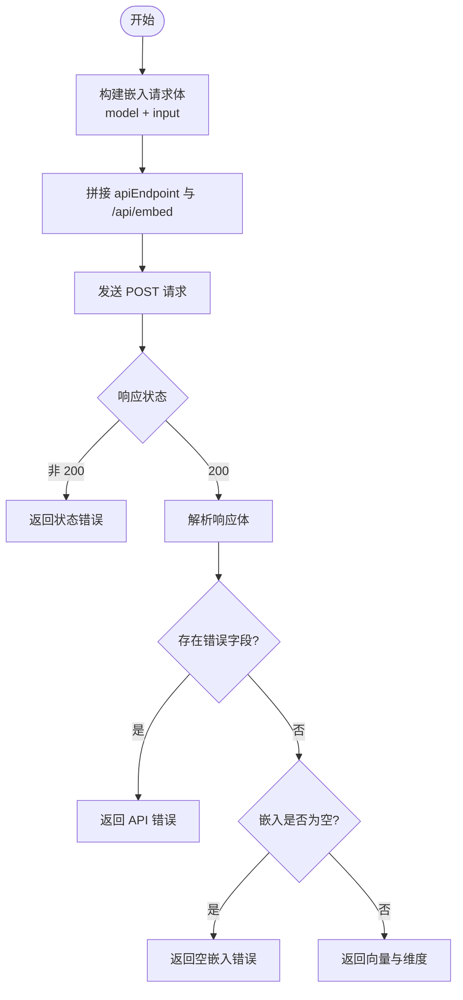
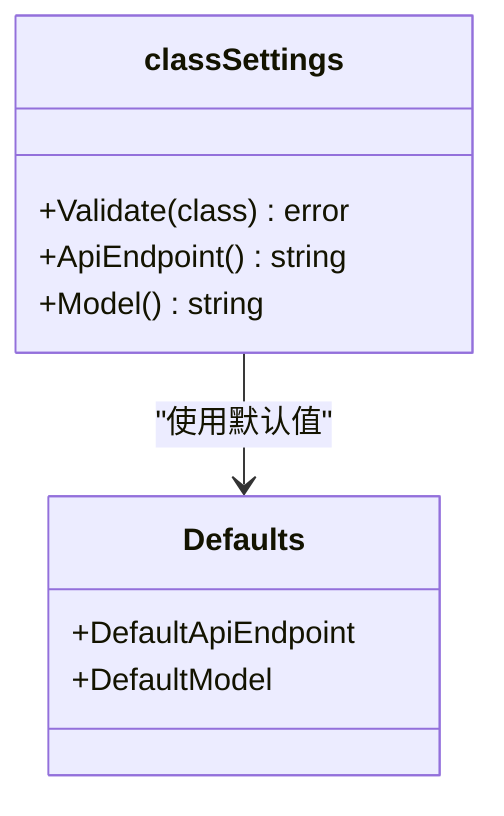
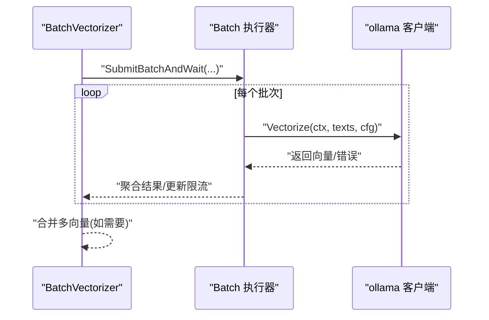
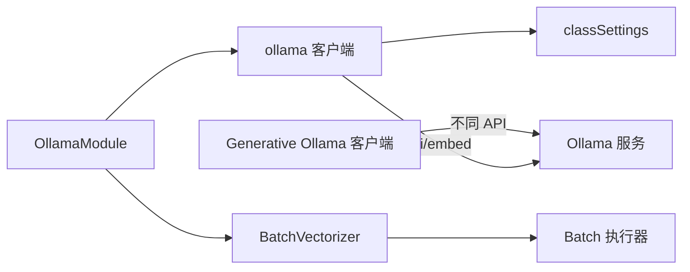

# Ollama 向量化器

<cite>
**本文引用的文件**
- [modules/text2vec-ollama/module.go](file://modules/text2vec-ollama/module.go)
- [modules/text2vec-ollama/config.go](file://modules/text2vec-ollama/config.go)
- [modules/text2vec-ollama/clients/ollama.go](file://modules/text2vec-ollama/clients/ollama.go)
- [modules/text2vec-ollama/clients/meta.go](file://modules/text2vec-ollama/clients/meta.go)
- [modules/text2vec-ollama/ent/class_settings.go](file://modules/text2vec-ollama/ent/class_settings.go)
- [usecases/modulecomponents/text2vecbase/batch_vectorizer.go](file://usecases/modulecomponents/text2vecbase/batch_vectorizer.go)
- [usecases/modulecomponents/batch/batch.go](file://usecases/modulecomponents/batch/batch.go)
- [example/ollama_and_rag_test.go](file://example/ollama_and_rag_test.go)
- [test/docker/ollama.go](file://test/docker/ollama.go)
- [test/docker/compose.go](file://test/docker/compose.go)
- [modules/generative-ollama/clients/ollama.go](file://modules/generative-ollama/clients/ollama.go)
- [modules/generative-ollama/clients/ollama_meta.go](file://modules/generative-ollama/clients/ollama_meta.go)
- [modules/generative-ollama/module.go](file://modules/generative-ollama/module.go)
- [modules/generative-ollama/parameters/provider.go](file://modules/generative-ollama/parameters/provider.go)
</cite>

## 目录
1. [简介](#简介)
2. [项目结构](#项目结构)
3. [核心组件](#核心组件)
4. [架构总览](#架构总览)
5. [详细组件分析](#详细组件分析)
6. [依赖关系分析](#依赖关系分析)
7. [性能考量](#性能考量)
8. [故障排查指南](#故障排查指南)
9. [结论](#结论)
10. [附录](#附录)

## 简介
本技术文档聚焦 Weaviate 的 Ollama 文本向量化器，系统阐述其与本地 LLM 服务的集成方式，覆盖模型下载、本地推理与资源管理；详解向量化器特性（完全本地运行、多开源模型支持、低延迟推理、隐私保护）；解释模型管理机制、推理优化、批处理策略与系统资源占用；并提供配置示例、性能对比维度、硬件要求与部署最佳实践。

## 项目结构
Ollama 向量化器位于模块化子目录中，采用“模块-客户端-实体设置”的分层组织：
- 模块入口与能力注册：负责模块生命周期、能力初始化与对外接口暴露
- 客户端：封装与 Ollama API 的 HTTP 交互，解析嵌入请求与响应
- 实体设置：封装类配置项（apiEndpoint、model 等），提供默认值与校验
- 批处理与向量化基类：统一文本向量化流程、批处理与错误聚合

图表来源
- [modules/text2vec-ollama/module.go](file://modules/text2vec-ollama/module.go#L33-L141)
- [modules/text2vec-ollama/clients/ollama.go](file://modules/text2vec-ollama/clients/ollama.go#L31-L135)
- [modules/text2vec-ollama/ent/class_settings.go](file://modules/text2vec-ollama/ent/class_settings.go#L22-L69)
- [usecases/modulecomponents/text2vecbase/batch_vectorizer.go](file://usecases/modulecomponents/text2vecbase/batch_vectorizer.go#L83-L104)
- [usecases/modulecomponents/batch/batch.go](file://usecases/modulecomponents/batch/batch.go#L438-L482)

章节来源
- [modules/text2vec-ollama/module.go](file://modules/text2vec-ollama/module.go#L33-L141)
- [modules/text2vec-ollama/clients/ollama.go](file://modules/text2vec-ollama/clients/ollama.go#L31-L135)
- [modules/text2vec-ollama/ent/class_settings.go](file://modules/text2vec-ollama/ent/class_settings.go#L22-L69)
- [usecases/modulecomponents/text2vecbase/batch_vectorizer.go](file://usecases/modulecomponents/text2vecbase/batch_vectorizer.go#L83-L104)
- [usecases/modulecomponents/batch/batch.go](file://usecases/modulecomponents/batch/batch.go#L438-L482)

## 核心组件
- 模块入口（OllamaModule）
  - 负责模块名称、类型声明、初始化与扩展初始化
  - 初始化向量化器与附加属性提供者
  - 对外暴露对象/输入向量化、批处理、元信息等能力
- 客户端（ollama）
  - 将输入文本序列化为嵌入请求，调用 Ollama API
  - 解析响应，返回向量化结果与维度信息
  - 处理错误（状态码非 200、空嵌入、API 错误等）
- 类配置（classSettings）
  - 提供 apiEndpoint 与 model 的默认值与校验
  - 保证 apiEndpoint 与 model 不为空
- 批处理与向量化基类
  - 统一文本向量化流程，支持批量提交与错误聚合
  - 计算令牌数、监控指标与速率限制更新

章节来源
- [modules/text2vec-ollama/module.go](file://modules/text2vec-ollama/module.go#L33-L141)
- [modules/text2vec-ollama/clients/ollama.go](file://modules/text2vec-ollama/clients/ollama.go#L51-L135)
- [modules/text2vec-ollama/ent/class_settings.go](file://modules/text2vec-ollama/ent/class_settings.go#L22-L69)
- [usecases/modulecomponents/text2vecbase/batch_vectorizer.go](file://usecases/modulecomponents/text2vecbase/batch_vectorizer.go#L83-L104)
- [usecases/modulecomponents/batch/batch.go](file://usecases/modulecomponents/batch/batch.go#L438-L482)

## 架构总览
Ollama 向量化器通过 HTTP 与本地 Ollama 服务交互，完成文本嵌入生成。模块层负责能力注册与配置校验，客户端层负责网络请求与响应解析，批处理层负责批量调度与错误聚合。

图表来源
- [modules/text2vec-ollama/module.go](file://modules/text2vec-ollama/module.go#L105-L127)
- [usecases/modulecomponents/text2vecbase/batch_vectorizer.go](file://usecases/modulecomponents/text2vecbase/batch_vectorizer.go#L83-L104)
- [usecases/modulecomponents/batch/batch.go](file://usecases/modulecomponents/batch/batch.go#L438-L482)
- [modules/text2vec-ollama/clients/ollama.go](file://modules/text2vec-ollama/clients/ollama.go#L51-L96)

## 详细组件分析

### 模块入口（OllamaModule）
- 能力与生命周期
  - 模块名与类型声明
  - 初始化：注入日志、初始化向量化器与附加属性提供者
  - 扩展初始化：与其他模块协作，注册 nearText 变换能力
- 向量化能力
  - 对象向量化：委托 BatchVectorizer
  - 输入向量化：单条文本向量化
  - 批处理：批量对象向量化，内部以固定批次大小提交
- 元信息与附加属性
  - 提供模块元信息（文档链接）
  - 提供附加属性（如向量化相关调试信息）

图表来源
- [modules/text2vec-ollama/module.go](file://modules/text2vec-ollama/module.go#L33-L141)

章节来源
- [modules/text2vec-ollama/module.go](file://modules/text2vec-ollama/module.go#L33-L141)

### 客户端（ollama）
- 请求构建
  - 依据类配置构造嵌入请求体（模型名与输入文本数组）
  - 使用配置的 apiEndpoint 作为基础地址，拼接 /api/embed
- 发送与解析
  - POST 请求发送至 Ollama API
  - 解析响应体，提取嵌入向量与维度
  - 错误处理：状态码非 200、API 返回错误、空嵌入等
- 查询路径
  - 提供 VectorizeQuery 用于查询时向量化

图表来源
- [modules/text2vec-ollama/clients/ollama.go](file://modules/text2vec-ollama/clients/ollama.go#L51-L135)

章节来源
- [modules/text2vec-ollama/clients/ollama.go](file://modules/text2vec-ollama/clients/ollama.go#L51-L135)

### 类配置（classSettings）
- 默认值
  - apiEndpoint 默认为本地 11434 端口
  - model 默认 nomic-embed-text
- 校验
  - apiEndpoint 与 model 均不可为空
- 其他行为
  - 统一封装字符串属性读取与小写化开关

图表来源
- [modules/text2vec-ollama/ent/class_settings.go](file://modules/text2vec-ollama/ent/class_settings.go#L22-L69)

章节来源
- [modules/text2vec-ollama/ent/class_settings.go](file://modules/text2vec-ollama/ent/class_settings.go#L22-L69)

### 批处理与向量化基类
- 批处理流程
  - 统计令牌数、提交批量任务、聚合结果与错误
  - 更新速率限制或令牌重置
- 文本向量化
  - 支持查询场景下的单次向量化
  - 对多个向量进行合并（如需要）

图表来源
- [usecases/modulecomponents/text2vecbase/batch_vectorizer.go](file://usecases/modulecomponents/text2vecbase/batch_vectorizer.go#L83-L104)
- [usecases/modulecomponents/batch/batch.go](file://usecases/modulecomponents/batch/batch.go#L438-L482)

章节来源
- [usecases/modulecomponents/text2vecbase/batch_vectorizer.go](file://usecases/modulecomponents/text2vecbase/batch_vectorizer.go#L83-L104)
- [usecases/modulecomponents/batch/batch.go](file://usecases/modulecomponents/batch/batch.go#L438-L482)

### 元信息与附加属性
- 元信息
  - 提供模块名称与 Ollama API 文档链接
- 附加属性
  - 为 GraphQL/查询提供附加信息（如向量化调试信息）

章节来源
- [modules/text2vec-ollama/clients/meta.go](file://modules/text2vec-ollama/clients/meta.go#L14-L19)

## 依赖关系分析
- 模块与客户端
  - OllamaModule 依赖 ollama 客户端进行 HTTP 交互
- 模块与实体设置
  - 客户端读取 classSettings 获取 apiEndpoint 与 model
- 批处理链路
  - BatchVectorizer -> Batch 执行器 -> ollama 客户端
- 生成式 Ollama（对比参考）
  - 生成式模块与向量化模块共享相同的 Ollama 客户端实现，但调用不同 API（/api/generate）

图表来源
- [modules/text2vec-ollama/module.go](file://modules/text2vec-ollama/module.go#L91-L98)
- [modules/text2vec-ollama/clients/ollama.go](file://modules/text2vec-ollama/clients/ollama.go#L31-L49)
- [modules/text2vec-ollama/ent/class_settings.go](file://modules/text2vec-ollama/ent/class_settings.go#L41-L69)
- [usecases/modulecomponents/text2vecbase/batch_vectorizer.go](file://usecases/modulecomponents/text2vecbase/batch_vectorizer.go#L83-L104)
- [usecases/modulecomponents/batch/batch.go](file://usecases/modulecomponents/batch/batch.go#L438-L482)
- [modules/generative-ollama/clients/ollama.go](file://modules/generative-ollama/clients/ollama.go#L153-L159)

章节来源
- [modules/text2vec-ollama/module.go](file://modules/text2vec-ollama/module.go#L91-L98)
- [modules/text2vec-ollama/clients/ollama.go](file://modules/text2vec-ollama/clients/ollama.go#L31-L49)
- [modules/text2vec-ollama/ent/class_settings.go](file://modules/text2vec-ollama/ent/class_settings.go#L41-L69)
- [usecases/modulecomponents/text2vecbase/batch_vectorizer.go](file://usecases/modulecomponents/text2vecbase/batch_vectorizer.go#L83-L104)
- [usecases/modulecomponents/batch/batch.go](file://usecases/modulecomponents/batch/batch.go#L438-L482)
- [modules/generative-ollama/clients/ollama.go](file://modules/generative-ollama/clients/ollama.go#L153-L159)

## 性能考量
- 批处理策略
  - 模块内部以固定批次大小提交（如 10），有助于减少网络往返次数
  - 批处理执行器会统计令牌数、聚合错误并更新速率限制
- 推理优化
  - 本地 Ollama 服务可利用 GPU 加速（取决于宿主环境）
  - 选择合适模型与输入长度可显著影响吞吐与延迟
- 资源占用
  - Ollama 服务占用显存与 CPU，建议根据可用资源选择模型大小
  - Weaviate 侧的 HTTP 客户端超时时间可按网络与模型延迟调整
- 延迟与吞吐
  - 批量提交与模型并发能力共同决定整体吞吐
  - 查询路径与导入路径共享同一客户端，需关注并发与队列排队

章节来源
- [modules/text2vec-ollama/module.go](file://modules/text2vec-ollama/module.go#L111-L113)
- [usecases/modulecomponents/batch/batch.go](file://usecases/modulecomponents/batch/batch.go#L438-L482)

## 故障排查指南
- 常见错误与定位
  - 状态码非 200：检查 Ollama 服务可达性与端口映射
  - API 返回错误：检查模型名称、上下文与服务端日志
  - 空嵌入响应：确认输入文本非空、模型已加载
  - 上下文过期：检查 Weaviate 的 HTTP 客户端超时设置
- 测试与验证
  - 使用测试容器启动 Ollama 并拉取指定模型
  - 通过示例脚本验证向量化与 RAG 工作流

章节来源
- [modules/text2vec-ollama/clients/ollama.go](file://modules/text2vec-ollama/clients/ollama.go#L106-L122)
- [modules/text2vec-ollama/clients/ollama_test.go](file://modules/text2vec-ollama/clients/ollama_test.go#L33-L99)
- [test/docker/ollama.go](file://test/docker/ollama.go#L37-L73)
- [example/ollama_and_rag_test.go](file://example/ollama_and_rag_test.go#L14-L112)

## 结论
Ollama 向量化器通过简洁的模块化设计与稳健的客户端实现，实现了与本地 LLM 服务的无缝集成。其特性包括完全本地运行、多开源模型支持、低延迟推理与隐私保护。借助批处理与速率限制机制，能够在高并发场景下保持稳定性能。配合合理的模型选择与硬件配置，可满足多样化的语义搜索与 RAG 场景需求。

## 附录

### 配置与使用示例
- Weaviate 类配置要点
  - vectorizer 设置为 text2vec-ollama
  - moduleConfig 中提供 apiEndpoint 与 model
  - 可选：vectorizeClassName、properties 等
- 示例参考
  - 使用示例脚本展示如何创建集合、插入对象并触发向量化
  - 通过测试容器拉取并运行 Ollama 服务

章节来源
- [example/ollama_and_rag_test.go](file://example/ollama_and_rag_test.go#L36-L53)
- [test/docker/ollama.go](file://test/docker/ollama.go#L37-L73)

### 模型管理与部署最佳实践
- 模型管理
  - 在 Ollama 服务中提前拉取所需模型，避免首次请求冷启动开销
  - 根据业务场景选择合适模型（如 nomic-embed-text、其他开源嵌入模型）
- 部署建议
  - 将 Weaviate 与 Ollama 部署在同一网络，使用稳定的主机名或别名
  - 调整 Weaviate 的 HTTP 客户端超时时间以适配模型推理延迟
  - 监控 Ollama 服务的资源占用，合理分配 GPU/CPU

章节来源
- [modules/text2vec-ollama/ent/class_settings.go](file://modules/text2vec-ollama/ent/class_settings.go#L31-L32)
- [test/docker/ollama.go](file://test/docker/ollama.go#L37-L73)

### 生成式 Ollama 对比参考
- 生成式模块与向量化模块共享底层 Ollama 客户端
- 生成式调用 /api/generate，向量化调用 /api/embed
- 两者均支持从上下文或配置中读取 apiEndpoint 与 model

章节来源
- [modules/generative-ollama/clients/ollama.go](file://modules/generative-ollama/clients/ollama.go#L153-L159)
- [modules/generative-ollama/clients/ollama_meta.go](file://modules/generative-ollama/clients/ollama_meta.go#L14-L21)
- [modules/generative-ollama/module.go](file://modules/generative-ollama/module.go#L46-L82)
- [modules/generative-ollama/parameters/provider.go](file://modules/generative-ollama/parameters/provider.go#L16-L22)