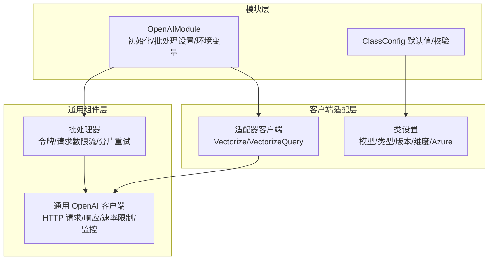
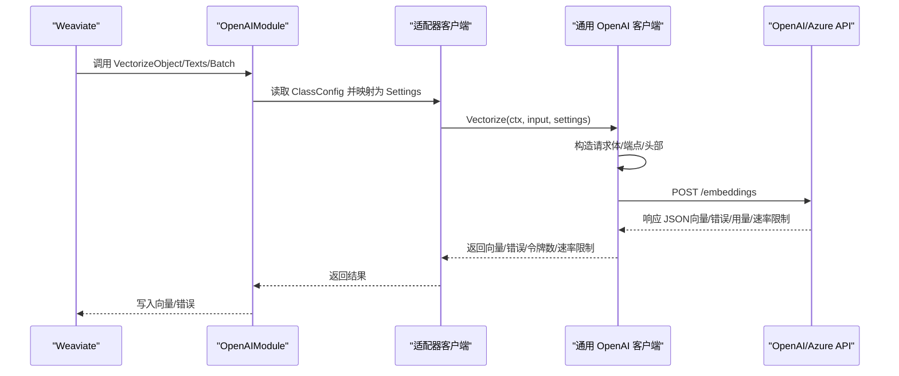

# OpenAI 向量化器

<cite>
**本文引用的文件**
- [modules/text2vec-openai/module.go](file://modules/text2vec-openai/module.go)
- [modules/text2vec-openai/clients/openai.go](file://modules/text2vec-openai/clients/openai.go)
- [modules/text2vec-openai/config.go](file://modules/text2vec-openai/config.go)
- [modules/text2vec-openai/ent/class_settings.go](file://modules/text2vec-openai/ent/class_settings.go)
- [usecases/modulecomponents/clients/openai/openai.go](file://usecases/modulecomponents/clients/openai/openai.go)
- [usecases/modulecomponents/batch/batch.go](file://usecases/modulecomponents/batch/batch.go)
- [usecases/monitoring/prometheus.go](file://usecases/monitoring/prometheus.go)
- [modules/text2vec-openai/ent/class_settings_test.go](file://modules/text2vec-openai/ent/class_settings_test.go)
- [test/helper/sample-schema/books/books.go](file://test/helper/sample-schema/books/books.go)
</cite>

## 目录
1. [简介](#简介)
2. [项目结构](#项目结构)
3. [核心组件](#核心组件)
4. [架构总览](#架构总览)
5. [详细组件分析](#详细组件分析)
6. [依赖关系分析](#依赖关系分析)
7. [性能与成本考量](#性能与成本考量)
8. [故障排查指南](#故障排查指南)
9. [结论](#结论)
10. [附录：配置与示例](#附录配置与示例)

## 简介
本文件面向 Weaviate 的 OpenAI 文本向量化模块，系统性阐述其与 OpenAI Embeddings API 的集成实现，覆盖以下主题：
- API 密钥配置与组织标识
- Azure OpenAI 支持与端点构建
- 批量处理机制与速率限制管理
- 模型选择与维度控制（text-embedding-3-small、text-embedding-3-large、text-embedding-ada-002 等）
- 文本预处理、分词与向量维度选择策略
- 质量评估与监控指标
- 错误处理、重试与最佳实践
- 在 Weaviate 中的配置示例与批量向量化操作

## 项目结构
OpenAI 向量化器由三层组成：
- 模块层：负责初始化、批处理设置、环境变量读取与对外接口暴露
- 客户端适配层：封装 OpenAI 原生客户端，桥接 Weaviate 的 Settings 与请求体
- 通用组件层：统一的 OpenAI 客户端实现，负责 HTTP 请求、响应解析、速率限制提取与监控上报



图表来源
- [modules/text2vec-openai/module.go](file://modules/text2vec-openai/module.go#L37-L46)
- [modules/text2vec-openai/clients/openai.go](file://modules/text2vec-openai/clients/openai.go#L32-L78)
- [usecases/modulecomponents/clients/openai/openai.go](file://usecases/modulecomponents/clients/openai/openai.go#L160-L254)
- [usecases/modulecomponents/batch/batch.go](file://usecases/modulecomponents/batch/batch.go#L110-L467)

章节来源
- [modules/text2vec-openai/module.go](file://modules/text2vec-openai/module.go#L33-L121)
- [modules/text2vec-openai/clients/openai.go](file://modules/text2vec-openai/clients/openai.go#L27-L78)
- [usecases/modulecomponents/clients/openai/openai.go](file://usecases/modulecomponents/clients/openai/openai.go#L1-L272)
- [usecases/modulecomponents/batch/batch.go](file://usecases/modulecomponents/batch/batch.go#L110-L467)

## 核心组件
- OpenAIModule：模块入口，负责读取环境变量（OPENAI_APIKEY、OPENAI_ORGANIZATION、AZURE_APIKEY），初始化向量化器与批处理器，并提供对象/文本向量化、元信息与额外属性能力。
- 适配器客户端：将 Weaviate 的 ClassConfig 映射为 OpenAI Settings，调用通用客户端执行向量化。
- 通用 OpenAI 客户端：构造请求体、拼接端点、发送 HTTP 请求、解析响应、提取速率限制与令牌用量、上报监控指标。
- 批处理器：按令牌/请求上限切分批次，动态等待与重试，聚合结果并回填错误。

章节来源
- [modules/text2vec-openai/module.go](file://modules/text2vec-openai/module.go#L104-L121)
- [modules/text2vec-openai/clients/openai.go](file://modules/text2vec-openai/clients/openai.go#L39-L78)
- [usecases/modulecomponents/clients/openai/openai.go](file://usecases/modulecomponents/clients/openai/openai.go#L160-L254)
- [usecases/modulecomponents/batch/batch.go](file://usecases/modulecomponents/batch/batch.go#L130-L467)

## 架构总览
OpenAI 向量化器的关键流程如下：



图表来源
- [modules/text2vec-openai/module.go](file://modules/text2vec-openai/module.go#L128-L141)
- [modules/text2vec-openai/clients/openai.go](file://modules/text2vec-openai/clients/openai.go#L39-L61)
- [usecases/modulecomponents/clients/openai/openai.go](file://usecases/modulecomponents/clients/openai/openai.go#L160-L254)

## 详细组件分析

### 1) 模块初始化与环境变量
- 从环境变量读取 OPENAI_APIKEY、OPENAI_ORGANIZATION、AZURE_APIKEY
- 初始化向量化器与批处理器，设置批处理参数（最大对象数、最大令牌数、是否返回速率限制等）
- 提供对象/文本向量化、元信息与额外属性能力

章节来源
- [modules/text2vec-openai/module.go](file://modules/text2vec-openai/module.go#L104-L121)
- [modules/text2vec-openai/module.go](file://modules/text2vec-openai/module.go#L37-L46)

### 2) 类配置与模型/维度校验
- 支持模型类型：text、code；默认模型为 text-embedding-3-small
- 支持模型族：legacy（ada/babbage/curie/davinci）与 v3（text-embedding-3-small/large）
- 维度校验：仅对 v3 模型生效；Azure 模式下不强制维度
- Azure 配置校验：资源名与部署 ID 必须同时提供，且 API 版本需在允许列表中
- 模型版本策略：默认根据模型与类型推断版本，ada+text 默认 002，其他默认 001

章节来源
- [modules/text2vec-openai/ent/class_settings.go](file://modules/text2vec-openai/ent/class_settings.go#L26-L84)
- [modules/text2vec-openai/ent/class_settings.go](file://modules/text2vec-openai/ent/class_settings.go#L167-L211)
- [modules/text2vec-openai/ent/class_settings.go](file://modules/text2vec-openai/ent/class_settings.go#L247-L255)
- [modules/text2vec-openai/ent/class_settings.go](file://modules/text2vec-openai/ent/class_settings.go#L257-L266)

### 3) 适配器客户端与 Settings 映射
- 将 Weaviate 的 ClassConfig 映射为 openai.Settings，包括：
  - 类型、模型、模型版本
  - Azure 资源名、部署 ID、API 版本
  - 自定义 baseURL、第三方提供商标记
  - 维度与按动作（document/query）选择的模型字符串
- 提供 Vectorize/VectorizeQuery/获取速率限制/获取 API Key 哈希

章节来源
- [modules/text2vec-openai/clients/openai.go](file://modules/text2vec-openai/clients/openai.go#L63-L78)
- [modules/text2vec-openai/ent/class_settings.go](file://modules/text2vec-openai/ent/class_settings.go#L103-L112)

### 4) 通用 OpenAI 客户端：请求/响应/速率限制
- 构造请求体：根据是否 Azure/模型版本/维度决定字段
- 构建端点：支持从上下文覆盖 baseURL、部署 ID、资源名
- 发送请求：添加 API Key/组织标识/内容类型头
- 解析响应：提取向量、错误、用量（prompt/completion tokens）
- 速率限制：从响应头解析并更新本地速率限制状态
- 监控：上报外部请求计数、时延、大小、状态码、令牌用量等

章节来源
- [usecases/modulecomponents/clients/openai/openai.go](file://usecases/modulecomponents/clients/openai/openai.go#L37-L55)
- [usecases/modulecomponents/clients/openai/openai.go](file://usecases/modulecomponents/clients/openai/openai.go#L160-L254)
- [usecases/modulecomponents/clients/openai/openai.go](file://usecases/modulecomponents/clients/openai/openai.go#L256-L272)

### 5) 批处理器：分片、限流与重试
- 将大批次按令牌上限拆分为小批次，避免单次请求超限
- 动态等待：当剩余令牌不足或请求速率受限时，按剩余时间与令牌消耗比例计算休眠
- 超时保护：若等待超过批处理最大时长则中止当前批次并标记错误
- 结果回填：将向量按原始索引回填，错误单独记录
- 令牌复位：根据每次请求使用的令牌数进行复位计算

章节来源
- [usecases/modulecomponents/batch/batch.go](file://usecases/modulecomponents/batch/batch.go#L130-L467)

### 6) 错误处理与监控指标
- 对外错误：连接失败、状态码非 200、无数据返回、请求头错误等
- 监控指标：外部请求总量、时延、请求/响应大小、状态码分布、令牌用量、批处理错误、重复/重试统计等
- 日志采样：对速率限制与错误进行采样日志输出

章节来源
- [usecases/modulecomponents/clients/openai/openai.go](file://usecases/modulecomponents/clients/openai/openai.go#L223-L225)
- [usecases/monitoring/prometheus.go](file://usecases/monitoring/prometheus.go#L151-L179)

## 依赖关系分析

```mermaid
classDiagram
class OpenAIModule {
+Name() string
+Type() ModuleType
+Init(ctx, params) error
+VectorizeObject(...)
+VectorizeBatch(...)
+MetaInfo() map[string]interface{}
}
class AdapterClient {
+Vectorize(ctx, input, cfg)
+VectorizeQuery(ctx, input, cfg)
+GetVectorizerRateLimit(ctx, cfg)
+GetApiKeyHash(ctx, cfg)
}
class GenericOpenAIClient {
+Vectorize(ctx, input, settings)
+VectorizeQuery(ctx, input, settings)
+buildURL(ctx, settings)
+getRateLimitsFromHeader(...)
}
class BatchProcessor {
+SubmitBatchAndWait(ctx, cfg, skip, counts, texts)
}
OpenAIModule --> AdapterClient : "组合"
AdapterClient --> GenericOpenAIClient : "委托"
OpenAIModule --> BatchProcessor : "组合"
```

图表来源
- [modules/text2vec-openai/module.go](file://modules/text2vec-openai/module.go#L52-L60)
- [modules/text2vec-openai/clients/openai.go](file://modules/text2vec-openai/clients/openai.go#L27-L61)
- [usecases/modulecomponents/clients/openai/openai.go](file://usecases/modulecomponents/clients/openai/openai.go#L140-L158)
- [usecases/modulecomponents/batch/batch.go](file://usecases/modulecomponents/batch/batch.go#L110-L121)

## 性能与成本考量
- 模型选择
  - text-embedding-3-small：默认 1536 维，适合大多数场景，成本较低
  - text-embedding-3-large：默认 3072 维，语义表达更强，成本更高
  - text-embedding-ada-002：兼容旧版模型，可指定维度（仅 Azure 不强制）
- 批处理优化
  - 最大对象数与最大令牌数限制：避免单次请求过大导致失败
  - 令牌/请求双限流：根据剩余令牌与请求余量动态调整休眠
  - 超时保护：防止长时间阻塞导致整体批处理失败
- 监控与可观测性
  - 令牌用量分布、请求时延、状态码分布、批处理长度与队列时延
  - 速率限制统计与重复/重试次数，辅助容量规划与成本控制

章节来源
- [modules/text2vec-openai/ent/class_settings.go](file://modules/text2vec-openai/ent/class_settings.go#L42-L58)
- [modules/text2vec-openai/ent/class_settings.go](file://modules/text2vec-openai/ent/class_settings.go#L268-L276)
- [modules/text2vec-openai/module.go](file://modules/text2vec-openai/module.go#L37-L46)
- [usecases/modulecomponents/batch/batch.go](file://usecases/modulecomponents/batch/batch.go#L374-L404)
- [usecases/monitoring/prometheus.go](file://usecases/monitoring/prometheus.go#L151-L179)

## 故障排查指南
- 常见错误
  - 模型/维度/版本不匹配：检查模型名称、版本与维度是否符合规则
  - Azure 配置缺失：资源名与部署 ID 必须同时提供，API 版本需在允许列表
  - 无数据返回：确认输入文本非空、网络连通、API Key 有效
- 诊断步骤
  - 查看外部请求状态码与错误消息
  - 关注令牌用量与剩余令牌，判断是否触发令牌上限
  - 检查批处理超时与速率限制等待时间
- 重试与降级
  - 对于临时网络错误与速率限制，批处理器会自动等待与重试
  - 若超时仍未恢复，建议降低批大小或增加并发度以缓解压力

章节来源
- [modules/text2vec-openai/ent/class_settings.go](file://modules/text2vec-openai/ent/class_settings.go#L167-L211)
- [usecases/modulecomponents/clients/openai/openai.go](file://usecases/modulecomponents/clients/openai/openai.go#L223-L225)
- [usecases/modulecomponents/batch/batch.go](file://usecases/modulecomponents/batch/batch.go#L385-L398)

## 结论
Weaviate 的 OpenAI 向量化器通过模块化设计实现了对 OpenAI Embeddings API 的稳定集成，具备完善的模型/维度校验、Azure 支持、批量处理与速率限制管理能力。配合丰富的监控指标与错误处理策略，可在不同规模与成本目标下高效生成高质量语义向量。

## 附录：配置与示例

### 环境变量
- OPENAI_APIKEY：OpenAI API 密钥
- OPENAI_ORGANIZATION：OpenAI 组织标识（可选）
- AZURE_APIKEY：Azure OpenAI API 密钥（当启用 Azure 时）

章节来源
- [modules/text2vec-openai/module.go](file://modules/text2vec-openai/module.go#L107-L109)

### 类配置参数（ModuleConfig）
- vectorizeClassName：是否将类名向量化
- model：模型名称（默认 text-embedding-3-small）
- type：文档类型（text/code，默认 text）
- modelVersion：模型版本（默认根据模型与类型推断）
- dimensions：向量维度（v3 模型可用；Azure 模式下可为空）
- isAzure：是否使用 Azure OpenAI
- resourceName：Azure 资源名
- deploymentId：Azure 部署 ID
- apiVersion：Azure API 版本
- baseURL：自定义基础 URL（用于第三方 OpenAI 兼容服务）

章节来源
- [modules/text2vec-openai/config.go](file://modules/text2vec-openai/config.go#L25-L40)
- [modules/text2vec-openai/ent/class_settings.go](file://modules/text2vec-openai/ent/class_settings.go#L90-L165)
- [modules/text2vec-openai/ent/class_settings.go](file://modules/text2vec-openai/ent/class_settings.go#L247-L255)

### 示例：在 Weaviate 中配置 OpenAI 向量化器
- 使用默认配置（text-embedding-3-small）
- 指定模型与维度（例如 text-embedding-3-large, 3072 维）
- 使用命名向量配置（指定特定目标向量）

章节来源
- [test/helper/sample-schema/books/books.go](file://test/helper/sample-schema/books/books.go#L43-L65)

### 批量向量化操作
- 对象批量向量化：传入对象数组与跳过标志，返回向量与错误映射
- 文本批量向量化：传入文本数组，返回向量数组

章节来源
- [modules/text2vec-openai/module.go](file://modules/text2vec-openai/module.go#L136-L141)

### 代码片段路径（不含具体代码内容）
- 模块初始化与批处理设置：[modules/text2vec-openai/module.go](file://modules/text2vec-openai/module.go#L37-L46)
- 适配器客户端设置映射：[modules/text2vec-openai/clients/openai.go](file://modules/text2vec-openai/clients/openai.go#L63-L78)
- 通用客户端请求与响应处理：[usecases/modulecomponents/clients/openai/openai.go](file://usecases/modulecomponents/clients/openai/openai.go#L160-L254)
- 批处理器分片与限流逻辑：[usecases/modulecomponents/batch/batch.go](file://usecases/modulecomponents/batch/batch.go#L374-L404)