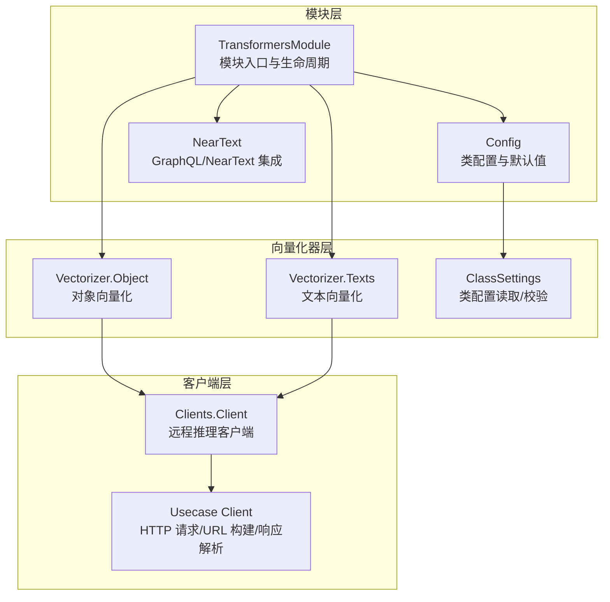
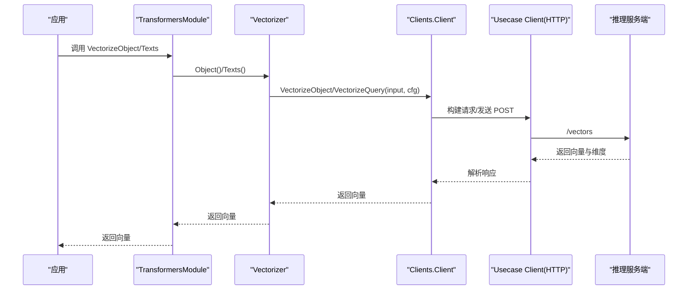
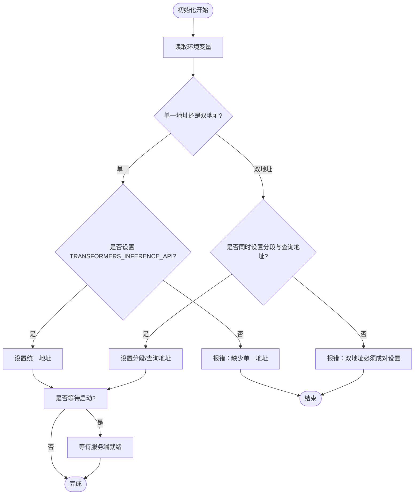
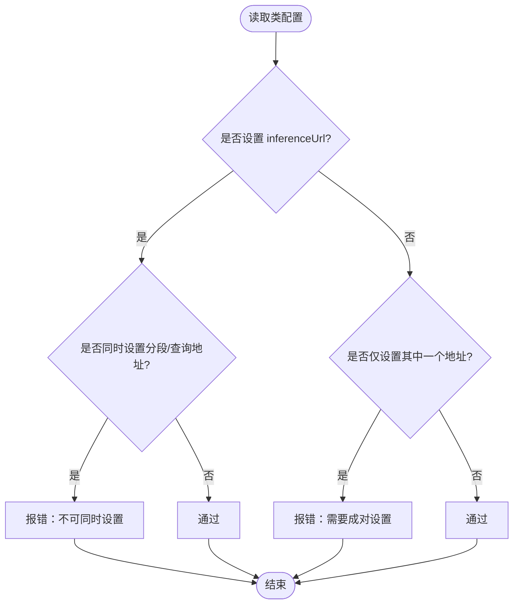
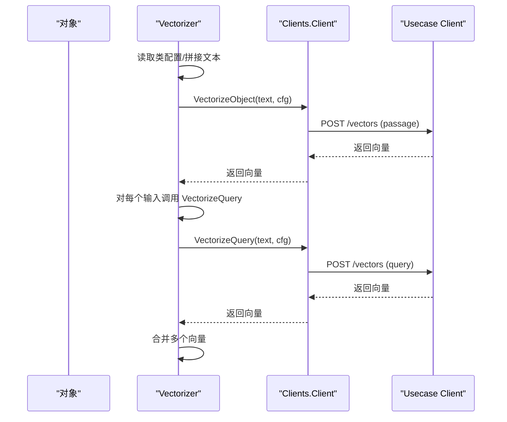
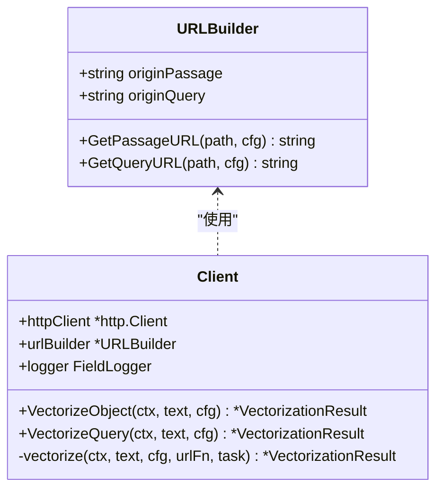
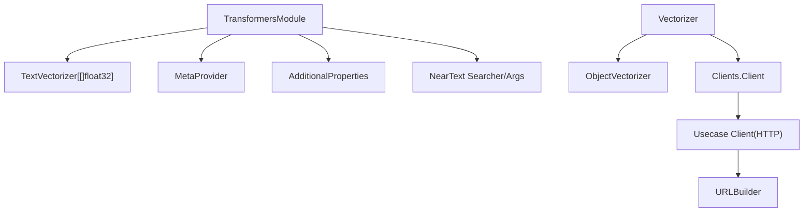

# Transformers 向量化器

<cite>
**本文引用的文件**
- [modules/text2vec-transformers/module.go](file://modules/text2vec-transformers/module.go)
- [modules/text2vec-transformers/config.go](file://modules/text2vec-transformers/config.go)
- [modules/text2vec-transformers/clients/transformers.go](file://modules/text2vec-transformers/clients/transformers.go)
- [modules/text2vec-transformers/vectorizer/objects.go](file://modules/text2vec-transformers/vectorizer/objects.go)
- [modules/text2vec-transformers/vectorizer/texts.go](file://modules/text2vec-transformers/vectorizer/texts.go)
- [modules/text2vec-transformers/vectorizer/class_settings.go](file://modules/text2vec-transformers/vectorizer/class_settings.go)
- [usecases/modulecomponents/clients/transformers/transformers.go](file://usecases/modulecomponents/clients/transformers/transformers.go)
- [modules/text2vec-transformers/nearText.go](file://modules/text2vec-transformers/nearText.go)
- [test/modules/text2vec-transformers/transformers_test.go](file://test/modules/text2vec-transformers/transformers_test.go)
- [test/helper/sample-schema/books/books.go](file://test/helper/sample-schema/books/books.go)
- [test/acceptance_with_go_client/named_vectors_tests/test_suits/named_vectors_test_data.go](file://test/acceptance_with_go_client/named_vectors_tests/test_suits/named_vectors_test_data.go)
</cite>

## 目录
1. [简介](#简介)
2. [项目结构](#项目结构)
3. [核心组件](#核心组件)
4. [架构总览](#架构总览)
5. [详细组件分析](#详细组件分析)
6. [依赖关系分析](#依赖关系分析)
7. [性能考量](#性能考量)
8. [故障排查指南](#故障排查指南)
9. [结论](#结论)
10. [附录：配置与使用示例](#附录配置与使用示例)

## 简介
本文件面向 Weaviate 的 Transformers 文本向量化模块，系统阐述基于 HuggingFace Transformers 的通用文本向量化实现。该模块提供以下能力：
- 模型选择灵活性：支持通过类级配置指定池化策略、推理服务地址（单地址或分段/查询双地址）、目标维度等。
- 推理优化：统一的远程推理客户端封装，支持请求构建、错误处理与健康检查。
- 部署便利性：通过环境变量与类配置灵活切换推理后端，便于在不同环境中快速部署。

模块特性包括：
- 支持多种 Transformer 架构：通过推理服务端适配不同模型。
- 可配置的池化策略：如 masked_mean、cls 等，由类配置决定。
- GPU 加速支持：推理服务端可运行在具备 GPU 的环境中，Weaviate 侧透明调用。
- 模型压缩技术：可通过指定目标维度降低向量维度，减少存储与检索开销。

## 项目结构
Transformers 向量化器位于 modules/text2vec-transformers 目录下，主要由以下层次组成：
- 模块入口与生命周期：module.go 负责初始化、环境变量解析、模块注册与对外接口暴露。
- 类配置与校验：config.go 定义默认值与校验逻辑；class_settings.go 提供类级配置读取与验证。
- 向量化器：vectorizer 包含对象与文本向量化流程，负责拼接属性文本、调用客户端并聚合结果。
- 远程客户端：clients/transformers.go 封装推理服务端交互；usecases/modulecomponents/clients/transformers/transformers.go 实现 HTTP 请求、URL 构建与响应解析。
- GraphQL/NearText 集成：nearText.go 提供 nearText 搜索器与 GraphQL 参数。

**图表来源**
- [modules/text2vec-transformers/module.go](file://modules/text2vec-transformers/module.go#L56-L132)
- [modules/text2vec-transformers/config.go](file://modules/text2vec-transformers/config.go#L24-L45)
- [modules/text2vec-transformers/vectorizer/objects.go](file://modules/text2vec-transformers/vectorizer/objects.go#L50-L70)
- [modules/text2vec-transformers/vectorizer/texts.go](file://modules/text2vec-transformers/vectorizer/texts.go#L23-L47)
- [modules/text2vec-transformers/vectorizer/class_settings.go](file://modules/text2vec-transformers/vectorizer/class_settings.go#L34-L76)
- [modules/text2vec-transformers/clients/transformers.go](file://modules/text2vec-transformers/clients/transformers.go#L30-L51)
- [usecases/modulecomponents/clients/transformers/transformers.go](file://usecases/modulecomponents/clients/transformers/transformers.go#L97-L167)
- [modules/text2vec-transformers/nearText.go](file://modules/text2vec-transformers/nearText.go#L19-L31)

**章节来源**
- [modules/text2vec-transformers/module.go](file://modules/text2vec-transformers/module.go#L56-L132)
- [modules/text2vec-transformers/config.go](file://modules/text2vec-transformers/config.go#L24-L45)

## 核心组件
- TransformersModule：模块主控制器，负责初始化远程客户端、暴露向量化接口、NearText 搜索器与 GraphQL 参数、元信息提供者。
- Vectorizer：封装对象与文本向量化流程，读取类配置并调用客户端执行推理。
- Clients.Client：封装推理服务端交互，支持对象与查询两种任务类型，自动选择 URL 并发送 JSON 请求。
- ClassSettings：从类配置中读取池化策略、推理地址、目标维度等，并进行一致性校验。
- Usecase Client：实现 HTTP 客户端、URL 构建、请求体序列化、响应反序列化与错误处理。

**章节来源**
- [modules/text2vec-transformers/module.go](file://modules/text2vec-transformers/module.go#L38-L70)
- [modules/text2vec-transformers/vectorizer/objects.go](file://modules/text2vec-transformers/vectorizer/objects.go#L23-L70)
- [modules/text2vec-transformers/clients/transformers.go](file://modules/text2vec-transformers/clients/transformers.go#L22-L51)
- [modules/text2vec-transformers/vectorizer/class_settings.go](file://modules/text2vec-transformers/vectorizer/class_settings.go#L22-L76)
- [usecases/modulecomponents/clients/transformers/transformers.go](file://usecases/modulecomponents/clients/transformers/transformers.go#L91-L167)

## 架构总览
Transformers 向量化器采用“模块-向量化器-客户端”三层结构：
- 模块层：解析环境变量与类配置，初始化客户端与搜索器。
- 向量化器层：根据对象属性拼接文本，调用客户端执行推理，返回向量。
- 客户端层：构建请求、发送 HTTP 请求、解析响应、处理错误。

**图表来源**
- [modules/text2vec-transformers/module.go](file://modules/text2vec-transformers/module.go#L139-L179)
- [modules/text2vec-transformers/vectorizer/objects.go](file://modules/text2vec-transformers/vectorizer/objects.go#L50-L70)
- [modules/text2vec-transformers/vectorizer/texts.go](file://modules/text2vec-transformers/vectorizer/texts.go#L23-L47)
- [modules/text2vec-transformers/clients/transformers.go](file://modules/text2vec-transformers/clients/transformers.go#L41-L51)
- [usecases/modulecomponents/clients/transformers/transformers.go](file://usecases/modulecomponents/clients/transformers/transformers.go#L119-L167)

## 详细组件分析

### 模块初始化与环境变量解析
- 初始化流程：解析环境变量（推理服务端地址、等待启动标志），构造客户端并初始化元信息提供者与附加属性提供者。
- 环境变量要求：
  - 单一地址模式：需设置 TRANSFORMERS_INFERENCE_API。
  - 分段/查询双地址模式：需同时设置 TRANSFORMERS_PASSAGE_INFERENCE_API 与 TRANSFORMERS_QUERY_INFERENCE_API。
  - 互斥规则：两者只能二选一。
- 启动等待：可配置是否等待推理服务端就绪。

**图表来源**
- [modules/text2vec-transformers/module.go](file://modules/text2vec-transformers/module.go#L90-L132)

**章节来源**
- [modules/text2vec-transformers/module.go](file://modules/text2vec-transformers/module.go#L90-L132)

### 类配置与校验
- 默认值：
  - vectorizeClassName: true
  - poolingStrategy: masked_mean
- 类配置项：
  - poolingStrategy：池化策略
  - inferenceUrl：统一推理地址
  - passageInferenceUrl/queryInferenceUrl：分段/查询推理地址
  - dimensions：目标向量维度
- 校验规则：
  - inferenceUrl 与分段/查询地址互斥。
  - 若设置了分段/查询地址，二者必须同时存在。

**图表来源**
- [modules/text2vec-transformers/vectorizer/class_settings.go](file://modules/text2vec-transformers/vectorizer/class_settings.go#L62-L76)

**章节来源**
- [modules/text2vec-transformers/config.go](file://modules/text2vec-transformers/config.go#L24-L45)
- [modules/text2vec-transformers/vectorizer/class_settings.go](file://modules/text2vec-transformers/vectorizer/class_settings.go#L22-L76)

### 对象与文本向量化流程
- 对象向量化：
  - 读取类配置，拼接对象属性文本。
  - 调用客户端执行 VectorizeObject，返回向量。
- 文本向量化：
  - 对每个输入字符串调用 VectorizeQuery，随后将多个向量合并为一个向量输出。

**图表来源**
- [modules/text2vec-transformers/vectorizer/objects.go](file://modules/text2vec-transformers/vectorizer/objects.go#L50-L70)
- [modules/text2vec-transformers/vectorizer/texts.go](file://modules/text2vec-transformers/vectorizer/texts.go#L23-L47)
- [usecases/modulecomponents/clients/transformers/transformers.go](file://usecases/modulecomponents/clients/transformers/transformers.go#L119-L167)

**章节来源**
- [modules/text2vec-transformers/vectorizer/objects.go](file://modules/text2vec-transformers/vectorizer/objects.go#L50-L70)
- [modules/text2vec-transformers/vectorizer/texts.go](file://modules/text2vec-transformers/vectorizer/texts.go#L23-L47)

### 远程客户端与 HTTP 交互
- URL 构建：优先使用类配置中的特定地址，否则回退到模块初始化时设置的默认地址。
- 请求体：包含文本、池化策略、任务类型（passage/query）与目标维度。
- 响应解析：校验状态码，解析向量与维度，错误时返回详细信息。

**图表来源**
- [usecases/modulecomponents/clients/transformers/transformers.go](file://usecases/modulecomponents/clients/transformers/transformers.go#L61-L89)
- [usecases/modulecomponents/clients/transformers/transformers.go](file://usecases/modulecomponents/clients/transformers/transformers.go#L97-L167)

**章节来源**
- [usecases/modulecomponents/clients/transformers/transformers.go](file://usecases/modulecomponents/clients/transformers/transformers.go#L61-L167)

### GraphQL/NearText 集成
- nearText 搜索器：基于向量化器构建，支持 nearText GraphQL 参数。
- 模块扩展：在 InitExtension 中发现其他模块提供的 nearText 转换器，以增强 nearText 行为。

**章节来源**
- [modules/text2vec-transformers/nearText.go](file://modules/text2vec-transformers/nearText.go#L19-L31)

## 依赖关系分析
- 模块依赖：
  - 使用 usecases/modulecomponents/text2vecbase 接口定义的 TextVectorizer、MetaProvider 等能力。
  - 依赖 usecases/modulecomponents/additional 提供附加属性。
- 向量化器依赖：
  - 依赖 usecases/modulecomponents/vectorizer 的对象文本拼接工具。
  - 依赖 usecases/vectorizer 的向量合并工具。
- 客户端依赖：
  - 依赖 http.Client 与 JSON 编解码。
  - 通过 URLBuilder 动态选择推理服务端地址。

**图表来源**
- [modules/text2vec-transformers/module.go](file://modules/text2vec-transformers/module.go#L38-L46)
- [modules/text2vec-transformers/vectorizer/objects.go](file://modules/text2vec-transformers/vectorizer/objects.go#L23-L33)
- [modules/text2vec-transformers/clients/transformers.go](file://modules/text2vec-transformers/clients/transformers.go#L22-L39)
- [usecases/modulecomponents/clients/transformers/transformers.go](file://usecases/modulecomponents/clients/transformers/transformers.go#L91-L95)

**章节来源**
- [modules/text2vec-transformers/module.go](file://modules/text2vec-transformers/module.go#L38-L46)
- [modules/text2vec-transformers/vectorizer/objects.go](file://modules/text2vec-transformers/vectorizer/objects.go#L23-L33)
- [modules/text2vec-transformers/clients/transformers.go](file://modules/text2vec-transformers/clients/transformers.go#L22-L39)
- [usecases/modulecomponents/clients/transformers/transformers.go](file://usecases/modulecomponents/clients/transformers/transformers.go#L91-L95)

## 性能考量
- 批处理策略：模块的批量向量化采用顺序处理，避免过多并发导致的性能下降。
- 向量合并：文本向量化会将多个子向量合并为一个向量，建议合理设置池化策略与维度以平衡精度与性能。
- 推理延迟：远程推理的延迟取决于推理服务端的响应时间与网络状况，建议在高并发场景下评估服务端容量。
- 内存管理：客户端与向量化器均未显式进行内存池或缓存管理，建议在服务端层面进行优化（如模型加载策略、批处理大小等）。

**章节来源**
- [modules/text2vec-transformers/module.go](file://modules/text2vec-transformers/module.go#L145-L165)
- [modules/text2vec-transformers/vectorizer/texts.go](file://modules/text2vec-transformers/vectorizer/texts.go#L23-L36)

## 故障排查指南
- 环境变量缺失：
  - 单一地址模式未设置 TRANSFORMERS_INFERENCE_API。
  - 双地址模式未同时设置 TRANSFORMERS_PASSAGE_INFERENCE_API 与 TRANSFORMERS_QUERY_INFERENCE_API。
- 类配置冲突：
  - 同时设置了 inferenceUrl 与分段/查询地址。
  - 仅设置了其中一个分段/查询地址。
- 推理服务端错误：
  - HTTP 状态码非 200，客户端会返回错误信息。
  - 建议检查推理服务端日志与模型可用性。
- 启动等待：
  - 若启用等待启动，可在服务端未就绪时观察错误提示，确认服务端健康检查端点可达。

**章节来源**
- [modules/text2vec-transformers/module.go](file://modules/text2vec-transformers/module.go#L98-L114)
- [modules/text2vec-transformers/vectorizer/class_settings.go](file://modules/text2vec-transformers/vectorizer/class_settings.go#L62-L76)
- [usecases/modulecomponents/clients/transformers/transformers.go](file://usecases/modulecomponents/clients/transformers/transformers.go#L157-L167)

## 结论
Transformers 向量化器通过清晰的模块化设计，提供了灵活的模型选择、可靠的远程推理集成与便捷的部署方式。其类配置与校验机制确保了在多场景下的正确性，而统一的客户端封装则简化了与推理服务端的交互。结合合理的池化策略与维度设置，可在精度与性能之间取得良好平衡。

## 附录：配置与使用示例
- 示例：使用内置测试样例创建 Books 类并进行 nearText 查询
  - 创建类：参考 [ClassTransformersVectorizer](file://test/helper/sample-schema/books/books.go#L160-L162)
  - nearText 查询：参考 [Test_T2VTransformers](file://test/modules/text2vec-transformers/transformers_test.go#L37-L57)
- 示例：命名向量与多种向量化器组合
  - 测试数据中包含 transformers、transformers_flat、transformers_pq、transformers_bq 等命名向量：参考 [named_vectors_test_data.go](file://test/acceptance_with_go_client/named_vectors_tests/test_suits/named_vectors_test_data.go#L41-L57)

**章节来源**
- [test/helper/sample-schema/books/books.go](file://test/helper/sample-schema/books/books.go#L160-L162)
- [test/modules/text2vec-transformers/transformers_test.go](file://test/modules/text2vec-transformers/transformers_test.go#L37-L57)
- [test/acceptance_with_go_client/named_vectors_tests/test_suits/named_vectors_test_data.go](file://test/acceptance_with_go_client/named_vectors_tests/test_suits/named_vectors_test_data.go#L41-L57)