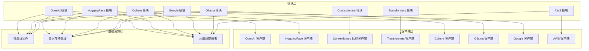
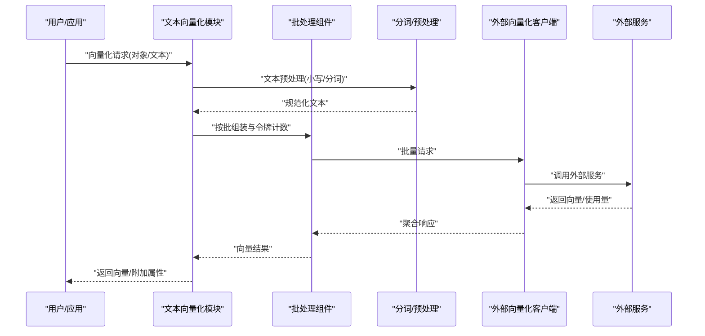
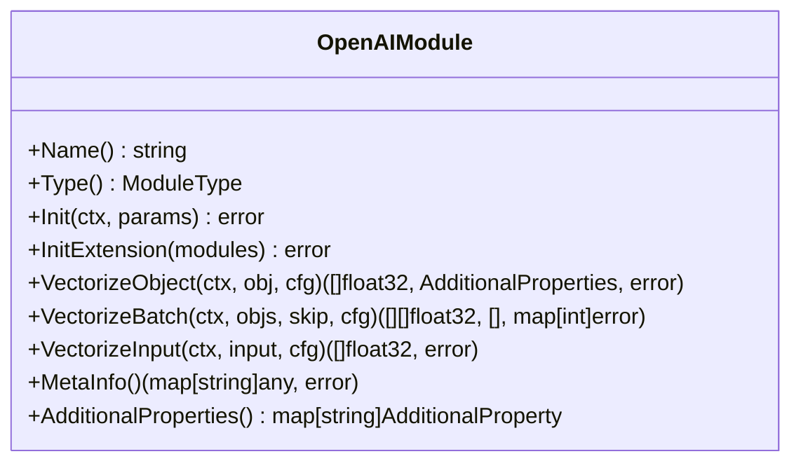
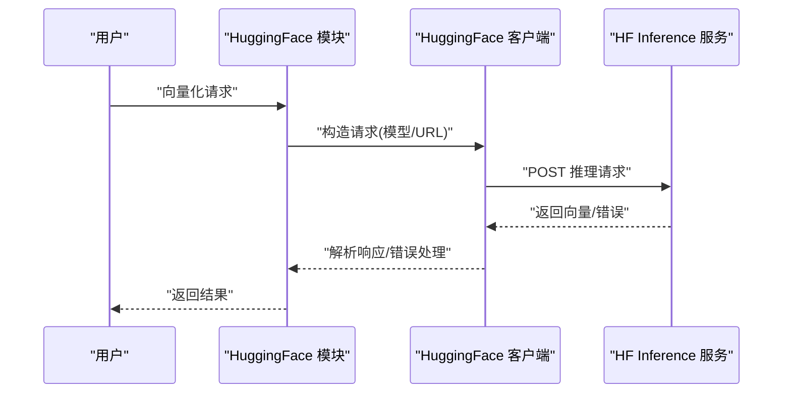
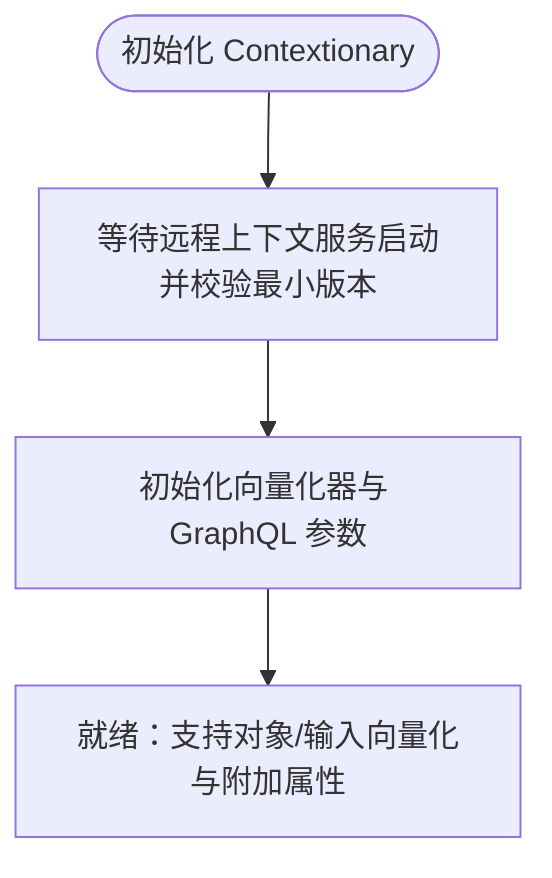
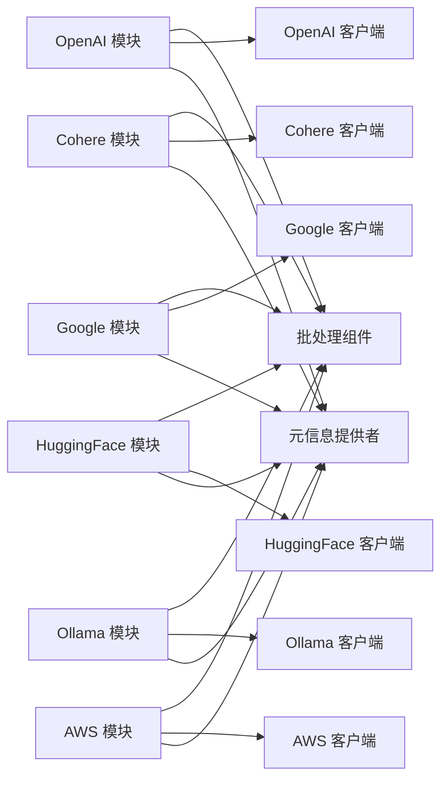

# 文本向量化模块

<cite>
**本文引用的文件**
- [modules/text2vec-openai/module.go](file://modules/text2vec-openai/module.go)
- [modules/text2vec-huggingface/module.go](file://modules/text2vec-huggingface/module.go)
- [modules/text2vec-contextionary/module.go](file://modules/text2vec-contextionary/module.go)
- [modules/text2vec-transformers/module.go](file://modules/text2vec-transformers/module.go)
- [modules/text2vec-cohere/module.go](file://modules/text2vec-cohere/module.go)
- [modules/text2vec-ollama/module.go](file://modules/text2vec-ollama/module.go)
- [modules/text2vec-google/module.go](file://modules/text2vec-google/module.go)
- [modules/text2vec-aws/module.go](file://modules/text2vec-aws/module.go)
- [entities/tokenizer/tokenizer.go](file://entities/tokenizer/tokenizer.go)
- [entities/tokenizer/tokenizer_userdict.go](file://entities/tokenizer/tokenizer_userdict.go)
- [test/modules/many-modules/many_modules_openai_test.go](file://test/modules/many-modules/many_modules_openai_test.go)
- [test/helper/sample-schema/books/books.go](file://test/helper/sample-schema/books/books.go)
- [modules/text2vec-huggingface/clients/huggingface_test.go](file://modules/text2vec-huggingface/clients/huggingface_test.go)
- [modules/text2vec-cohere/clients/cohere_test.go](file://modules/text2vec-cohere/clients/cohere_test.go)
- [modules/text2vec-voyageai/clients/voyageai.go](file://modules/text2vec-voyageai/clients/voyageai.go)
- [modules/text2vec-jinaai/clients/jinaai.go](file://modules/text2vec-jinaai/clients/jinaai.go)
- [modules/text2vec-model2vec/module.go](file://modules/text2vec-model2vec/module.go)
</cite>

## 目录
1. [简介](#简介)
2. [项目结构](#项目结构)
3. [核心组件](#核心组件)
4. [架构总览](#架构总览)
5. [详细组件分析](#详细组件分析)
6. [依赖关系分析](#依赖关系分析)
7. [性能考量](#性能考量)
8. [故障排查指南](#故障排查指南)
9. [结论](#结论)
10. [附录](#附录)

## 简介
本技术文档聚焦 Weaviate 的文本向量化模块，系统梳理并解析多种主流文本向量化器的实现原理与使用方法，涵盖 OpenAI、HuggingFace、Contextionary、Transformers、Cohere、Ollama、Google、AWS 等模块。文档从系统架构、组件关系、数据流与处理逻辑入手，结合配置参数、批处理策略、分词与预处理、向量维度选择、质量评估与成本效益分析，提供可操作的最佳实践与排错建议，帮助自然语言处理工程师与数据科学家高效落地。

## 项目结构
Weaviate 将文本向量化能力以“模块化”方式组织，每个向量化器对应一个独立模块目录，统一实现 Module 接口，暴露向量化对象、输入文本、批量向量化、元信息查询等能力，并通过统一的基类或批处理组件完成与外部服务的交互与资源管理。

- 模块层：各向量化器模块（如 text2vec-openai、text2vec-huggingface 等）实现统一接口，负责初始化、参数解析、调用客户端、统计指标上报等。
- 客户端层：封装对外部服务（如 OpenAI、Cohere、HuggingFace Inference、Google Palm/Gemini、AWS Bedrock 等）的访问与错误处理。
- 基础设施层：批处理组件、文本预处理（分词、大小写归一化）、令牌计数与限流、指标监控等。
- 实体与工具：类配置解析、向量维度校验、用户自定义词典、令牌化策略扩展等。

图表来源
- [modules/text2vec-openai/module.go](file://modules/text2vec-openai/module.go#L104-L121)
- [modules/text2vec-huggingface/module.go](file://modules/text2vec-huggingface/module.go#L99-L112)
- [modules/text2vec-contextionary/module.go](file://modules/text2vec-contextionary/module.go#L103-L114)
- [modules/text2vec-transformers/module.go](file://modules/text2vec-transformers/module.go#L90-L132)
- [modules/text2vec-cohere/module.go](file://modules/text2vec-cohere/module.go#L99-L112)
- [modules/text2vec-ollama/module.go](file://modules/text2vec-ollama/module.go#L91-L98)
- [modules/text2vec-google/module.go](file://modules/text2vec-google/module.go#L108-L129)
- [modules/text2vec-aws/module.go](file://modules/text2vec-aws/module.go#L90-L102)

章节来源
- [modules/text2vec-openai/module.go](file://modules/text2vec-openai/module.go#L1-L180)
- [modules/text2vec-huggingface/module.go](file://modules/text2vec-huggingface/module.go#L1-L167)
- [modules/text2vec-contextionary/module.go](file://modules/text2vec-contextionary/module.go#L1-L279)
- [modules/text2vec-transformers/module.go](file://modules/text2vec-transformers/module.go#L1-L191)
- [modules/text2vec-cohere/module.go](file://modules/text2vec-cohere/module.go#L1-L167)
- [modules/text2vec-ollama/module.go](file://modules/text2vec-ollama/module.go#L1-L141)
- [modules/text2vec-google/module.go](file://modules/text2vec-google/module.go#L1-L179)
- [modules/text2vec-aws/module.go](file://modules/text2vec-aws/module.go#L1-L159)

## 核心组件
- 模块接口与职责
  - 各模块均实现统一的 Module 接口，提供名称、类型、初始化、扩展初始化、向量化对象/输入、批量向量化、附加属性、元信息查询等能力。
  - 批量向量化支持不同策略：基于外部服务令牌限制（如 OpenAI、Cohere、Google）与无令牌限制（如 HuggingFace）两类模式。
- 文本预处理与分词
  - 统一采用小写归一化与令牌计数；部分模块支持自定义词典与多语言分词器（如 GSE、Kagome）。
- 元信息与指标
  - 各模块通过 MetaProvider 提供模型版本、请求计数、批长度分布等指标，便于性能与成本监控。

章节来源
- [modules/text2vec-openai/module.go](file://modules/text2vec-openai/module.go#L128-L161)
- [modules/text2vec-huggingface/module.go](file://modules/text2vec-huggingface/module.go#L119-L146)
- [modules/text2vec-cohere/module.go](file://modules/text2vec-cohere/module.go#L119-L143)
- [modules/text2vec-google/module.go](file://modules/text2vec-google/module.go#L136-L164)
- [entities/tokenizer/tokenizer.go](file://entities/tokenizer/tokenizer.go#L134-L146)

## 架构总览
下图展示了文本向量化在 Weaviate 中的总体流程：类配置解析、文本预处理、批处理与令牌计数、外部服务调用、结果返回与指标上报。

图表来源
- [modules/text2vec-openai/module.go](file://modules/text2vec-openai/module.go#L104-L121)
- [modules/text2vec-huggingface/module.go](file://modules/text2vec-huggingface/module.go#L99-L112)
- [modules/text2vec-cohere/module.go](file://modules/text2vec-cohere/module.go#L99-L112)
- [modules/text2vec-google/module.go](file://modules/text2vec-google/module.go#L108-L129)

## 详细组件分析

### OpenAI 向量化器
- 特点
  - 支持批量请求与令牌限制，最大批内总令牌数与对象数受外部 API 限制。
  - 默认模型与维度可配置，支持向量化类名与属性。
- 配置要点
  - 环境变量：OPENAI_APIKEY、OPENAI_ORGANIZATION、AZURE_APIKEY。
  - 类配置：model、dimensions、vectorizeClassName、baseURL（迁移字段）。
- 性能与成本
  - 令牌限制严格，需合理设置批大小与维度以控制成本。
  - 提供速率限制信息与指标上报，便于容量规划。
- 使用示例路径
  - 类配置示例与默认值验证：[many_modules_openai_test.go](file://test/modules/many-modules/many_modules_openai_test.go#L29-L143)
  - 模块初始化与批处理设置：[module.go](file://modules/text2vec-openai/module.go#L37-L46), [module.go](file://modules/text2vec-openai/module.go#L104-L121)

图表来源
- [modules/text2vec-openai/module.go](file://modules/text2vec-openai/module.go#L52-L180)

章节来源
- [modules/text2vec-openai/module.go](file://modules/text2vec-openai/module.go#L37-L46)
- [modules/text2vec-openai/module.go](file://modules/text2vec-openai/module.go#L104-L121)
- [test/modules/many-modules/many_modules_openai_test.go](file://test/modules/many-modules/many_modules_openai_test.go#L29-L143)

### HuggingFace 向量化器
- 特点
  - 无显式令牌上限，适合长文本与大批量处理。
  - 支持自定义 endpointURL 与模型选择。
- 配置要点
  - 环境变量：HUGGINGFACE_APIKEY。
  - 类配置：model、endpointURL、waitForModel、useGPU、useCache。
- 错误处理
  - 对 401、500 等错误进行明确提示，便于定位认证与推理服务问题。
- 使用示例路径
  - 认证与错误场景测试：[huggingface_test.go](file://modules/text2vec-huggingface/clients/huggingface_test.go#L138-L166)
  - 模块初始化与批处理设置：[module.go](file://modules/text2vec-huggingface/module.go#L99-L112)

图表来源
- [modules/text2vec-huggingface/module.go](file://modules/text2vec-huggingface/module.go#L99-L112)
- [modules/text2vec-huggingface/clients/huggingface_test.go](file://modules/text2vec-huggingface/clients/huggingface_test.go#L138-L166)

章节来源
- [modules/text2vec-huggingface/module.go](file://modules/text2vec-huggingface/module.go#L99-L112)
- [modules/text2vec-huggingface/clients/huggingface_test.go](file://modules/text2vec-huggingface/clients/huggingface_test.go#L138-L166)

### Contextionary 向量化器
- 特点
  - 本地/远程上下文词表驱动的静态向量化，无需外部 API 调用。
  - 支持概念检查、最近邻扩展、语义路径等附加能力。
- 配置要点
  - 通过远程客户端启动与版本校验，确保兼容性。
  - 类配置：vectorizeClassName、properties 等。
- 使用示例路径
  - 示例类配置（含混合向量化器）：[books.go](file://test/helper/sample-schema/books/books.go#L121-L166)
  - 模块初始化与 GraphQL 参数：[module.go](file://modules/text2vec-contextionary/module.go#L92-L136)

图表来源
- [modules/text2vec-contextionary/module.go](file://modules/text2vec-contextionary/module.go#L103-L114)
- [modules/text2vec-contextionary/module.go](file://modules/text2vec-contextionary/module.go#L175-L182)

章节来源
- [modules/text2vec-contextionary/module.go](file://modules/text2vec-contextionary/module.go#L92-L136)
- [test/helper/sample-schema/books/books.go](file://test/helper/sample-schema/books/books.go#L121-L166)

### Transformers 向量化器
- 特点
  - 本地/远程 Transformers 推理服务，支持 passage 与 query 分离或统一接口。
  - 可配置启动等待与环境变量开关。
- 配置要点
  - 环境变量：TRANSFORMERS_INFERENCE_API 或（TRANSFORMERS_PASSAGE_INFERENCE_API 与 TRANSFORMERS_QUERY_INFERENCE_API）。
  - 类配置：模型、维度、是否等待启动等。
- 使用示例路径
  - 初始化与环境变量校验：[module.go](file://modules/text2vec-transformers/module.go#L90-L132)
  - 批量向量化与对象遍历：[module.go](file://modules/text2vec-transformers/module.go#L145-L165)

章节来源
- [modules/text2vec-transformers/module.go](file://modules/text2vec-transformers/module.go#L90-L132)
- [modules/text2vec-transformers/module.go](file://modules/text2vec-transformers/module.go#L145-L165)

### Cohere 向量化器
- 特点
  - 支持搜索查询类型的输入类型，可指定维度与截断策略。
  - 提供速率限制查询与错误处理。
- 配置要点
  - 环境变量：COHERE_APIKEY。
  - 类配置：model、baseURL、truncate、dimensions。
- 使用示例路径
  - 查询向量化与速率限制：[voyageai.go](file://modules/text2vec-voyageai/clients/voyageai.go#L94-L114)
  - 查询向量化（Cohere 模块）：[cohere.go](file://modules/text2vec-cohere/clients/cohere.go#L53-L64)
  - 错误与头部键传递测试：[cohere_test.go](file://modules/text2vec-cohere/clients/cohere_test.go#L89-L123)

章节来源
- [modules/text2vec-voyageai/clients/voyageai.go](file://modules/text2vec-voyageai/clients/voyageai.go#L94-L114)
- [modules/text2vec-cohere/clients/cohere.go](file://modules/text2vec-cohere/clients/cohere.go#L53-L64)
- [modules/text2vec-cohere/clients/cohere_test.go](file://modules/text2vec-cohere/clients/cohere_test.go#L89-L123)

### Ollama 向量化器
- 特点
  - 本地 LLM 推理服务，支持批量向量化与对象遍历。
  - 通过通用批处理组件实现稳定吞吐。
- 配置要点
  - 无需外部 API Key，依赖本地 Ollama 服务。
  - 类配置：模型、维度等（由客户端解析）。
- 使用示例路径
  - 模块初始化与批处理：[module.go](file://modules/text2vec-ollama/module.go#L91-L113)

章节来源
- [modules/text2vec-ollama/module.go](file://modules/text2vec-ollama/module.go#L91-L113)

### Google 向量化器
- 特点
  - 支持标题属性单独向量化与批处理令牌计数。
  - 支持旧名称“text2vec-palm”，兼容历史配置。
- 配置要点
  - 环境变量：GOOGLE_APIKEY 或 PALM_APIKEY；可启用 Google Auth。
  - 类配置：model、dimensions、titleProperty、baseURL 等。
- 使用示例路径
  - 批处理与标题属性分支：[module.go](file://modules/text2vec-google/module.go#L143-L150)
  - 初始化与别名支持：[module.go](file://modules/text2vec-google/module.go#L66-L129)

章节来源
- [modules/text2vec-google/module.go](file://modules/text2vec-google/module.go#L66-L129)
- [modules/text2vec-google/module.go](file://modules/text2vec-google/module.go#L143-L150)

### AWS 向量化器
- 特点
  - 通过 AWS 凭证访问外部服务（Bedrock 等），支持批处理。
- 配置要点
  - 环境变量：AWS_ACCESS_KEY_ID/AWS_ACCESS_KEY、AWS_SECRET_ACCESS_KEY/AWS_SECRET_KEY、AWS_SESSION_TOKEN。
- 使用示例路径
  - 凭证解析与初始化：[module.go](file://modules/text2vec-aws/module.go#L90-L116)

章节来源
- [modules/text2vec-aws/module.go](file://modules/text2vec-aws/module.go#L90-L116)

### Model2Vec 向量化器
- 特点
  - 本地/远程 Model2Vec 推理服务，支持启动等待与元信息提供。
- 配置要点
  - 环境变量：MODEL2VEC_INFERENCE_API；可配置启动等待。
- 使用示例路径
  - 初始化与等待启动：[module.go](file://modules/text2vec-model2vec/module.go#L90-L111)

章节来源
- [modules/text2vec-model2vec/module.go](file://modules/text2vec-model2vec/module.go#L90-L111)

## 依赖关系分析
- 模块间耦合
  - 各模块对统一接口（Module、Vectorizer、MetaProvider、Searcher、GraphQLArguments）的依赖，保证了扩展性与一致性。
  - 批处理组件与令牌计数策略在 OpenAI、Cohere、Google 等模块中复用，降低重复实现。
- 外部依赖
  - OpenAI、Cohere、HuggingFace、Google、AWS、Ollama 等外部服务的客户端封装，统一错误处理与速率限制查询。
- 可能的循环依赖
  - 模块通过接口解耦，未见直接循环导入；批处理组件与模块通过函数注入协作。

图表来源
- [modules/text2vec-openai/module.go](file://modules/text2vec-openai/module.go#L104-L121)
- [modules/text2vec-cohere/module.go](file://modules/text2vec-cohere/module.go#L99-L112)
- [modules/text2vec-google/module.go](file://modules/text2vec-google/module.go#L108-L129)
- [modules/text2vec-huggingface/module.go](file://modules/text2vec-huggingface/module.go#L99-L112)
- [modules/text2vec-ollama/module.go](file://modules/text2vec-ollama/module.go#L91-L98)
- [modules/text2vec-aws/module.go](file://modules/text2vec-aws/module.go#L90-L102)

章节来源
- [modules/text2vec-openai/module.go](file://modules/text2vec-openai/module.go#L104-L121)
- [modules/text2vec-cohere/module.go](file://modules/text2vec-cohere/module.go#L99-L112)
- [modules/text2vec-google/module.go](file://modules/text2vec-google/module.go#L108-L129)
- [modules/text2vec-huggingface/module.go](file://modules/text2vec-huggingface/module.go#L99-L112)
- [modules/text2vec-ollama/module.go](file://modules/text2vec-ollama/module.go#L91-L98)
- [modules/text2vec-aws/module.go](file://modules/text2vec-aws/module.go#L90-L102)

## 性能考量
- 批处理与令牌限制
  - OpenAI、Cohere、Google 等模块内置令牌限制与批超时策略，建议根据模型与硬件条件调整 MaxObjectsPerBatch、MaxTokensPerBatch 与 MaxTimePerBatch。
- 向量维度选择
  - 不同模型支持不同维度范围，需结合检索精度与存储/索引成本权衡；OpenAI 支持通过 dimensions 指定。
- 分词与预处理
  - 统一小写归一化与令牌计数有助于减少外部调用次数；多语言场景可启用 GSE/Kagome 以提升分词质量。
- 指标与监控
  - 模块上报单次/批量请求计数、批长度分布、请求大小等指标，用于容量规划与成本控制。

章节来源
- [modules/text2vec-openai/module.go](file://modules/text2vec-openai/module.go#L37-L46)
- [modules/text2vec-cohere/module.go](file://modules/text2vec-cohere/module.go#L34-L41)
- [modules/text2vec-google/module.go](file://modules/text2vec-google/module.go#L38-L45)
- [entities/tokenizer/tokenizer.go](file://entities/tokenizer/tokenizer.go#L134-L146)

## 故障排查指南
- 认证与连接
  - OpenAI/Cohere/HuggingFace 等需正确设置 API Key；若出现 401/500 错误，检查密钥与服务可用性。
- 模型与维度
  - 若外部服务不支持指定维度，需回退到模型默认维度；确认类配置中的 model 与 dimensions 是否匹配。
- 令牌限制
  - 遇到“总令牌数超出”或“对象数过多”错误，适当降低批大小或增加 MaxTimePerBatch。
- 本地服务
  - Ollama/Transformers/Model2Vec 等需确保本地服务已启动且可访问；必要时开启启动等待。

章节来源
- [modules/text2vec-huggingface/clients/huggingface_test.go](file://modules/text2vec-huggingface/clients/huggingface_test.go#L138-L166)
- [modules/text2vec-cohere/clients/cohere_test.go](file://modules/text2vec-cohere/clients/cohere_test.go#L89-L123)
- [modules/text2vec-ollama/module.go](file://modules/text2vec-ollama/module.go#L91-L98)
- [modules/text2vec-transformers/module.go](file://modules/text2vec-transformers/module.go#L116-L132)
- [modules/text2vec-model2vec/module.go](file://modules/text2vec-model2vec/module.go#L90-L111)

## 结论
Weaviate 的文本向量化模块通过统一接口与基础设施层，实现了对多家外部服务与本地推理引擎的一致抽象。开发者可根据任务需求、成本预算与数据特性选择合适的向量化器，并通过类配置与批处理策略优化性能与成本。建议在生产环境中结合指标监控与错误处理策略，持续迭代配置以获得最佳效果。

## 附录
- 配置参数速查
  - OpenAI：model、dimensions、vectorizeClassName、baseURL、令牌限制与批设置。
  - HuggingFace：model、endpointURL、waitForModel、useGPU、useCache。
  - Cohere：model、baseURL、truncate、dimensions、输入类型。
  - Google：model、dimensions、titleProperty、baseURL、旧名称兼容。
  - AWS：凭据环境变量（Access Key、Secret Key、Session Token）。
  - Ollama/Transformers/Model2Vec：本地服务地址、启动等待、模型与维度。
- 示例参考
  - OpenAI 类配置与默认值验证：[many_modules_openai_test.go](file://test/modules/many-modules/many_modules_openai_test.go#L29-L143)
  - Contextionary 示例类配置（混合向量化器）：[books.go](file://test/helper/sample-schema/books/books.go#L121-L166)