# Azure 备份后端

<cite>
**本文档引用的文件**
- [modules/backup-azure/module.go](file://modules/backup-azure/module.go)
- [modules/backup-azure/client.go](file://modules/backup-azure/client.go)
- [modules/backup-azure/backup_test.go](file://modules/backup-azure/backup_test.go)
- [usecases/backup/backend.go](file://usecases/backup/backend.go)
- [test/modules/backup-azure/backup_backend_test.go](file://test/modules/backup-azure/backup_backend_test.go)
- [test/helper/backuptest/azure.go](file://test/helper/backuptest/azure.go)
- [test/helper/backuptest/azure_test.go](file://test/helper/backuptest/azure_test.go)
- [test/docker/azurite.go](file://test/docker/azurite.go)
</cite>

## 目录
1. [简介](#简介)
2. [项目结构](#项目结构)
3. [核心组件](#核心组件)
4. [架构概览](#架构概览)
5. [详细组件分析](#详细组件分析)
6. [依赖关系分析](#依赖关系分析)
7. [性能考虑](#性能考虑)
8. [故障排除指南](#故障排除指南)
9. [结论](#结论)

## 简介

Weaviate 的 Azure 备份后端模块是一个基于 Microsoft Azure Blob Storage 的分布式备份解决方案。该模块提供了完整的备份和恢复功能，支持多租户环境下的数据保护需求。

该模块的核心特性包括：
- 支持多种身份验证方式（连接字符串、共享密钥、无凭据）
- 并发文件上传和下载
- 自动重试机制
- 压缩和分块传输优化
- 完整的错误处理和状态管理

## 项目结构

Azure 备份后端模块位于 `modules/backup-azure/` 目录下，主要包含以下文件：

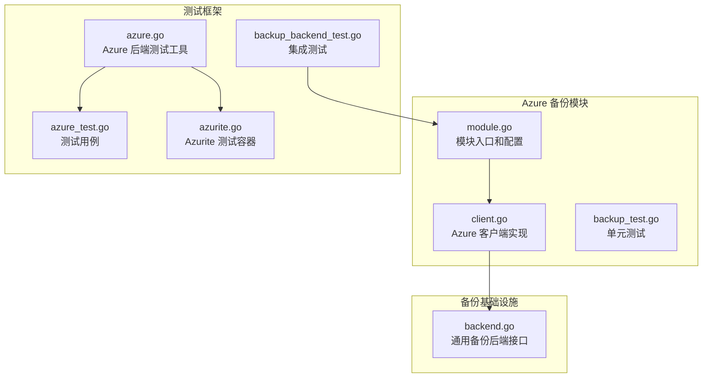

**图表来源**
- [modules/backup-azure/module.go](file://modules/backup-azure/module.go#L1-L111)
- [modules/backup-azure/client.go](file://modules/backup-azure/client.go#L1-L383)
- [usecases/backup/backend.go](file://usecases/backup/backend.go#L1-L708)

**章节来源**
- [modules/backup-azure/module.go](file://modules/backup-azure/module.go#L1-L111)
- [modules/backup-azure/client.go](file://modules/backup-azure/client.go#L1-L383)

## 核心组件

### 模块配置系统

Azure 备份模块通过环境变量进行配置，支持灵活的身份验证方式：

```mermaid
classDiagram
class Module {
+string Name()
+bool IsExternal()
+[]string AltNames()
+ModuleType Type()
+Init(ctx, params) error
+MetaInfo() map[string]interface{}
-logger FieldLogger
-azureClient *azureClient
-dataPath string
}
class clientConfig {
+string Container
+string BackupPath
}
class azureClient {
-*azblob.Client client
-clientConfig config
-string serviceURL
-string dataPath
+newClient(ctx, config, dataPath) *azureClient
+HomeDir(backupID, bucket, path) string
+AllBackups(ctx) []*BackupDescriptor
+GetObject(ctx, backupID, key, bucket, path) []byte
+PutObject(ctx, backupID, key, bucket, path, data) error
+Initialize(ctx, backupID, bucket, path) error
+WriteToFile(ctx, backupID, key, dest, bucket, path) error
+Write(ctx, backupID, key, bucket, path, reader) (int64, error)
+Read(ctx, backupID, key, bucket, path, writer) (int64, error)
+getBlockSize(ctx) int64
+getConcurrency(ctx) int
+SourceDataPath() string
}
Module --> azureClient : 使用
azureClient --> clientConfig : 配置
```

**图表来源**
- [modules/backup-azure/module.go](file://modules/backup-azure/module.go#L39-L111)
- [modules/backup-azure/client.go](file://modules/backup-azure/client.go#L42-L383)

### 身份验证机制

模块支持三种主要的身份验证方式：

1. **连接字符串模式**：使用完整的连接字符串，自动解析服务端点
2. **共享密钥模式**：使用账户名和密钥进行认证
3. **无凭据模式**：适用于公共访问或预签名 URL

**章节来源**
- [modules/backup-azure/client.go](file://modules/backup-azure/client.go#L49-L111)

## 架构概览

Azure 备份后端采用分层架构设计，确保了模块化和可扩展性：

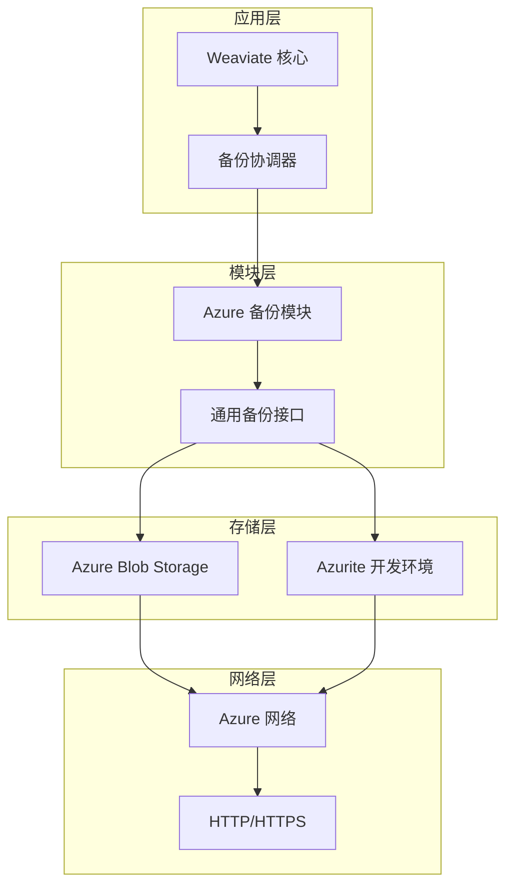

**图表来源**
- [usecases/backup/backend.go](file://usecases/backup/backend.go#L61-L122)
- [modules/backup-azure/client.go](file://modules/backup-azure/client.go#L42-L111)

## 详细组件分析

### Azure 客户端初始化流程

Azure 客户端的初始化过程遵循严格的优先级顺序：

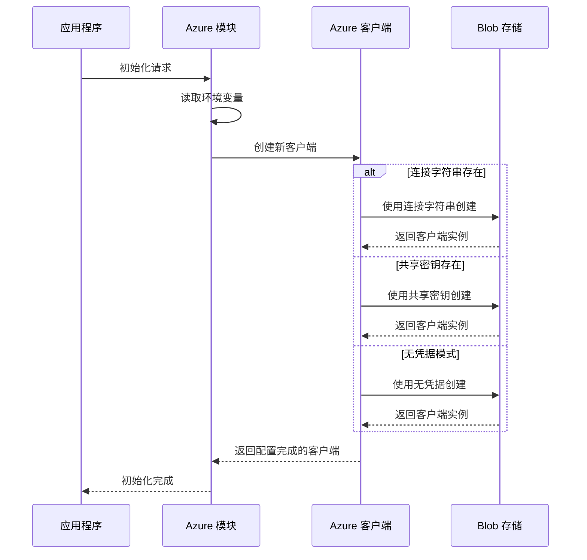

**图表来源**
- [modules/backup-azure/client.go](file://modules/backup-azure/client.go#L49-L111)

### 数据上传和下载机制

模块实现了高效的并发数据传输机制：

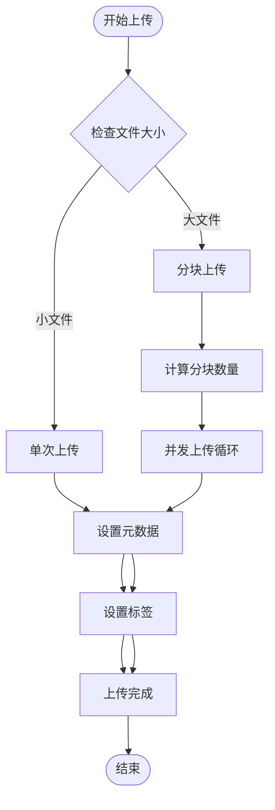

**图表来源**
- [modules/backup-azure/client.go](file://modules/backup-azure/client.go#L200-L224)
- [modules/backup-azure/client.go](file://modules/backup-azure/client.go#L311-L338)

### 错误处理和重试机制

模块实现了完善的错误处理和自动重试机制：

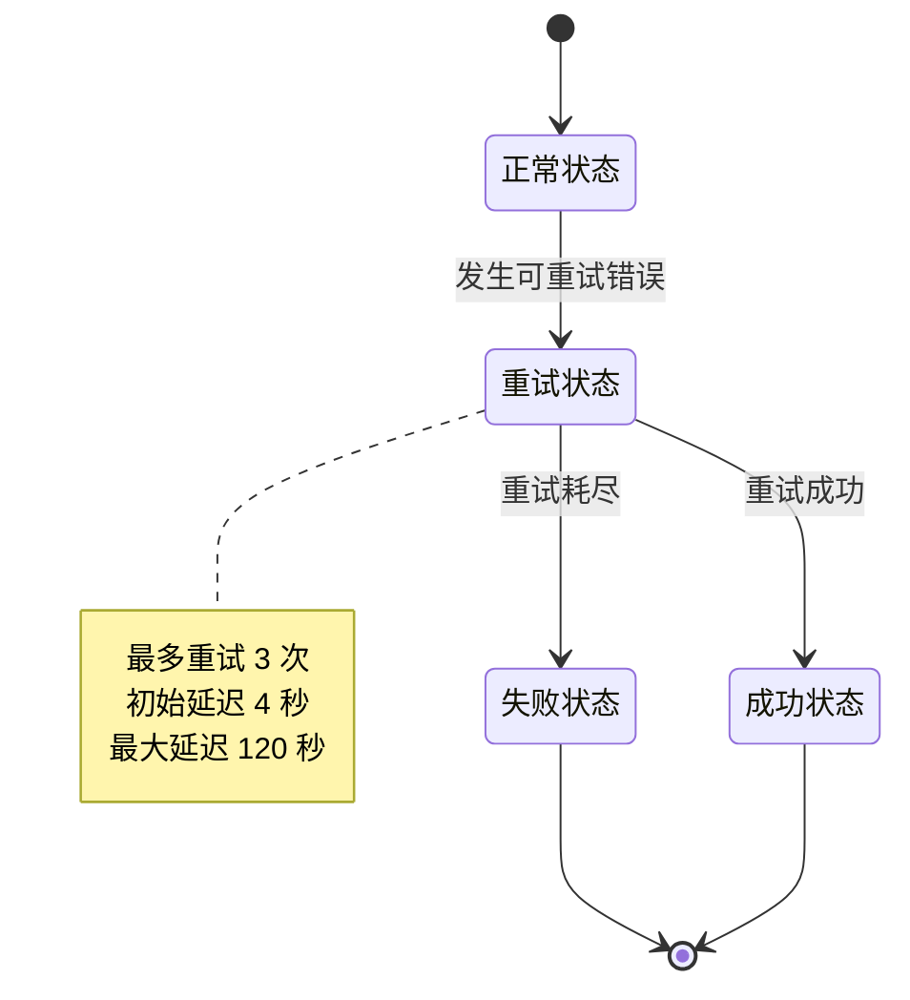

**图表来源**
- [modules/backup-azure/client.go](file://modules/backup-azure/client.go#L96-L104)

**章节来源**
- [modules/backup-azure/client.go](file://modules/backup-azure/client.go#L131-L244)

### 测试和验证机制

模块包含完整的测试套件，确保功能的正确性和可靠性：

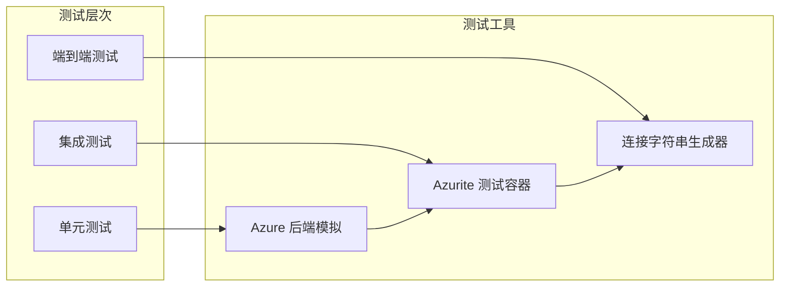

**图表来源**
- [test/modules/backup-azure/backup_backend_test.go](file://test/modules/backup-azure/backup_backend_test.go#L1-L200)
- [test/helper/backuptest/azure.go](file://test/helper/backuptest/azure.go#L1-L335)

**章节来源**
- [modules/backup-azure/backup_test.go](file://modules/backup-azure/backup_test.go#L1-L169)
- [test/modules/backup-azure/backup_backend_test.go](file://test/modules/backup-azure/backup_backend_test.go#L1-L200)

## 依赖关系分析

### 外部依赖

Azure 备份模块主要依赖以下外部组件：

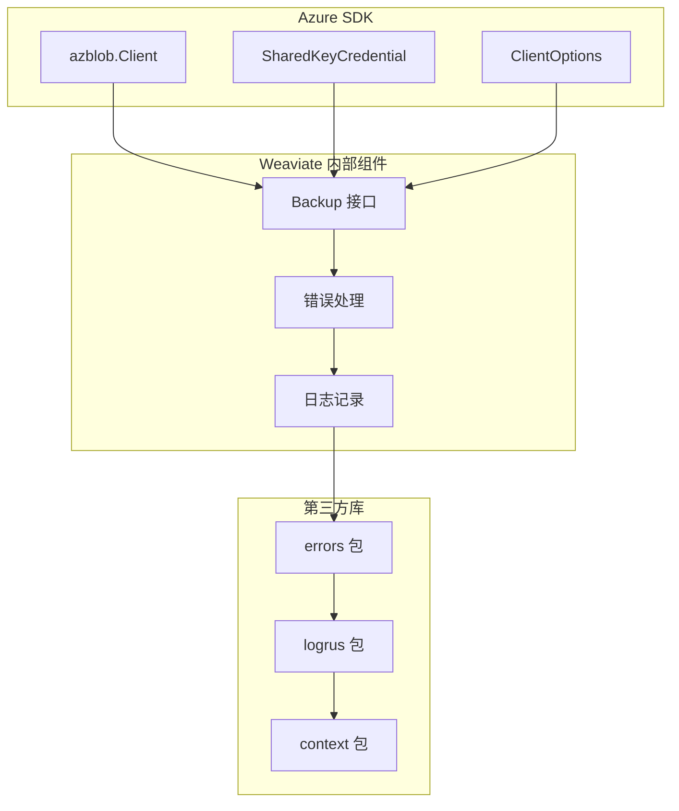

**图表来源**
- [modules/backup-azure/client.go](file://modules/backup-azure/client.go#L14-L35)

### 内部依赖关系

模块与 Weaviate 核心系统的集成关系：

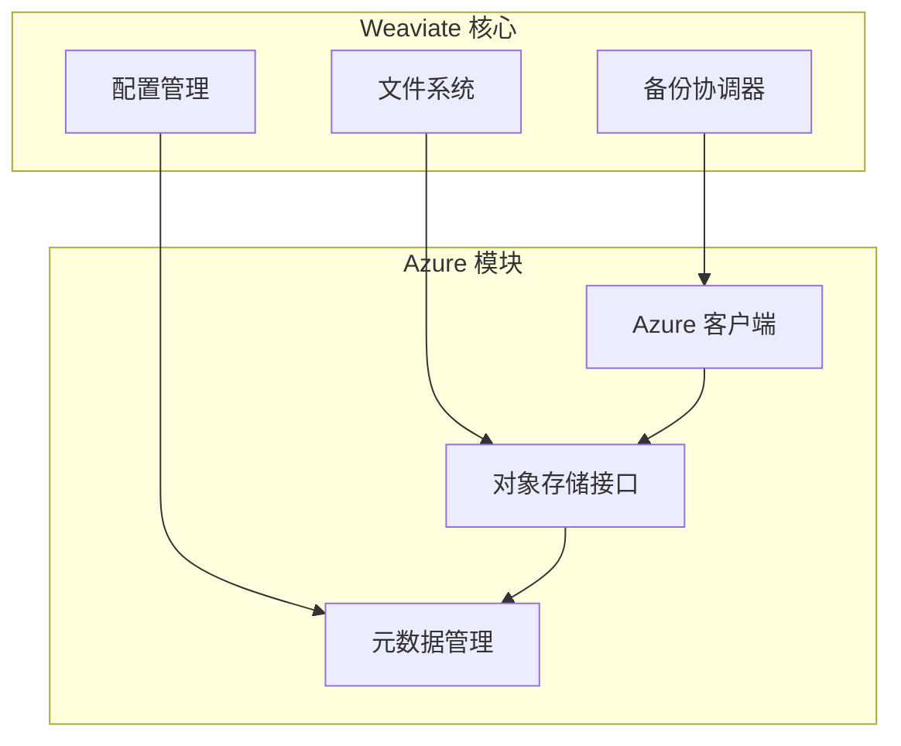

**图表来源**
- [usecases/backup/backend.go](file://usecases/backup/backend.go#L61-L122)

**章节来源**
- [usecases/backup/backend.go](file://usecases/backup/backend.go#L1-L708)

## 性能考虑

### 并发控制

模块通过可配置的并发参数来优化性能：

| 参数 | 默认值 | 可配置范围 | 影响 |
|------|--------|------------|------|
| BlockSize | 40MB | 1MB - 100MB | 单个块大小，影响内存使用 |
| Concurrency | 1 | 1 - 10 | 并发上传任务数 |

### 压缩和传输优化

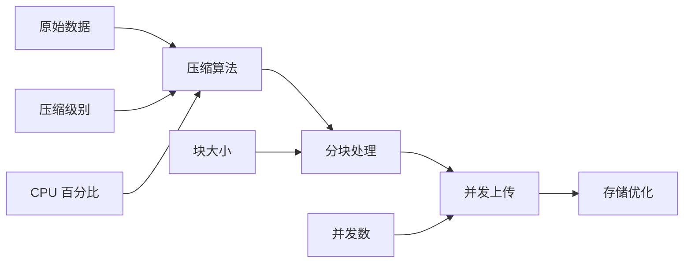

**图表来源**
- [usecases/backup/backend.go](file://usecases/backup/backend.go#L447-L504)

### 缓存和临时文件管理

模块使用临时目录进行中间文件处理，避免重复下载：

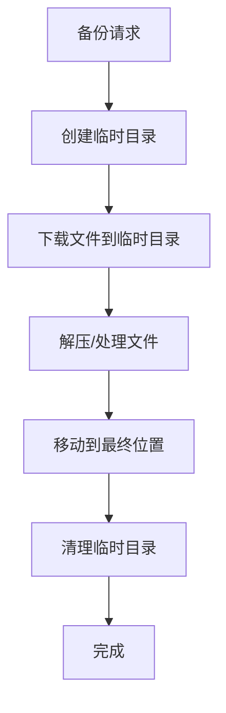

**图表来源**
- [usecases/backup/backend.go](file://usecases/backup/backend.go#L531-L663)

## 故障排除指南

### 常见问题诊断

| 问题类型 | 症状 | 解决方案 |
|----------|------|----------|
| 认证失败 | 连接被拒绝或权限错误 | 检查连接字符串或共享密钥 |
| 网络超时 | 请求超时 | 增加超时时间或检查网络配置 |
| 存储空间不足 | 上传失败 | 清理存储或增加配额 |
| 权限不足 | 无法创建容器 | 检查 Azure 角色和访问策略 |

### 日志和监控

模块提供详细的日志记录功能，便于问题诊断：

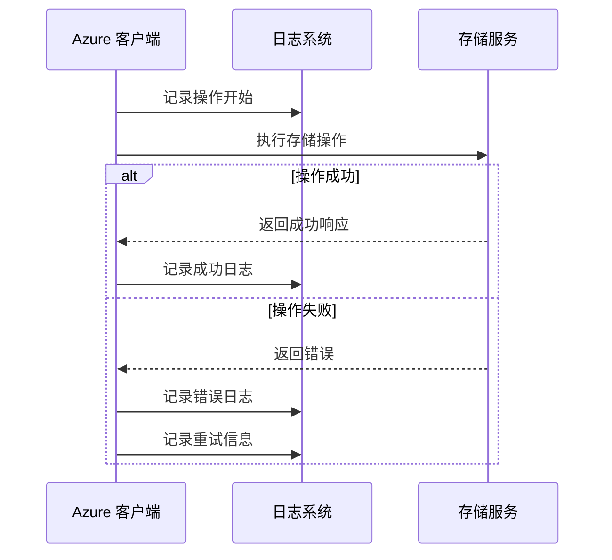

**图表来源**
- [modules/backup-azure/client.go](file://modules/backup-azure/client.go#L178-L198)

**章节来源**
- [modules/backup-azure/client.go](file://modules/backup-azure/client.go#L178-L198)

## 结论

Weaviate 的 Azure 备份后端模块提供了一个完整、可靠且高性能的备份解决方案。通过支持多种身份验证方式、智能的并发控制和完善的错误处理机制，该模块能够满足不同规模和复杂度的备份需求。

关键优势包括：
- **灵活性**：支持多种部署场景和身份验证方式
- **可靠性**：内置重试机制和错误处理
- **性能**：可配置的并发参数和优化的传输机制
- **易用性**：简单的环境变量配置和标准的备份接口

对于生产环境部署，建议：
1. 使用连接字符串或共享密钥进行身份验证
2. 根据网络条件调整并发参数
3. 定期监控存储使用情况和访问日志
4. 建立适当的备份策略和恢复流程