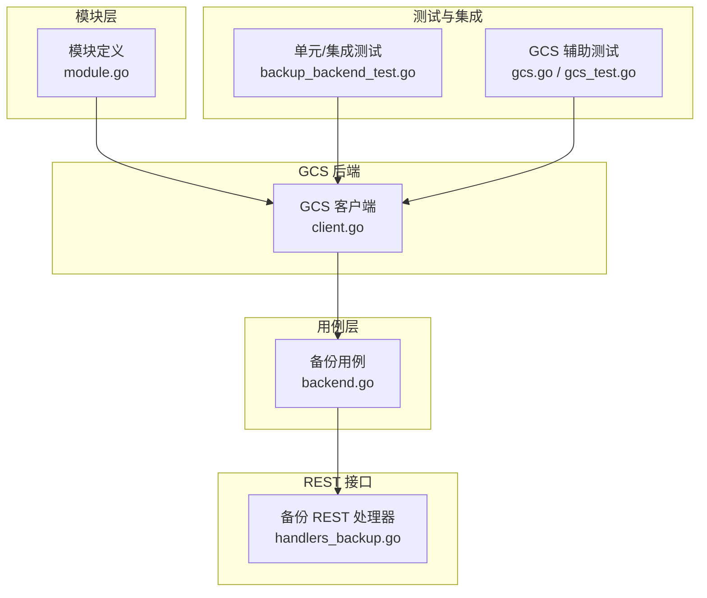
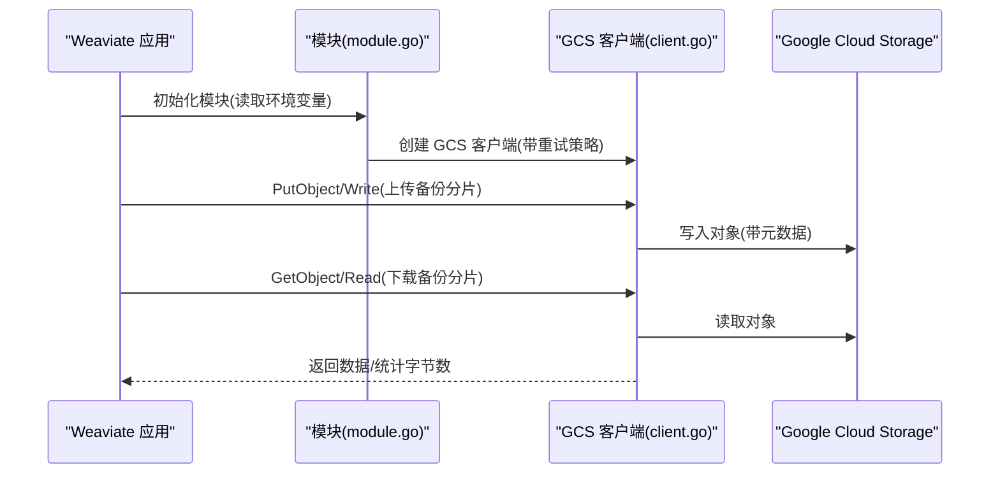
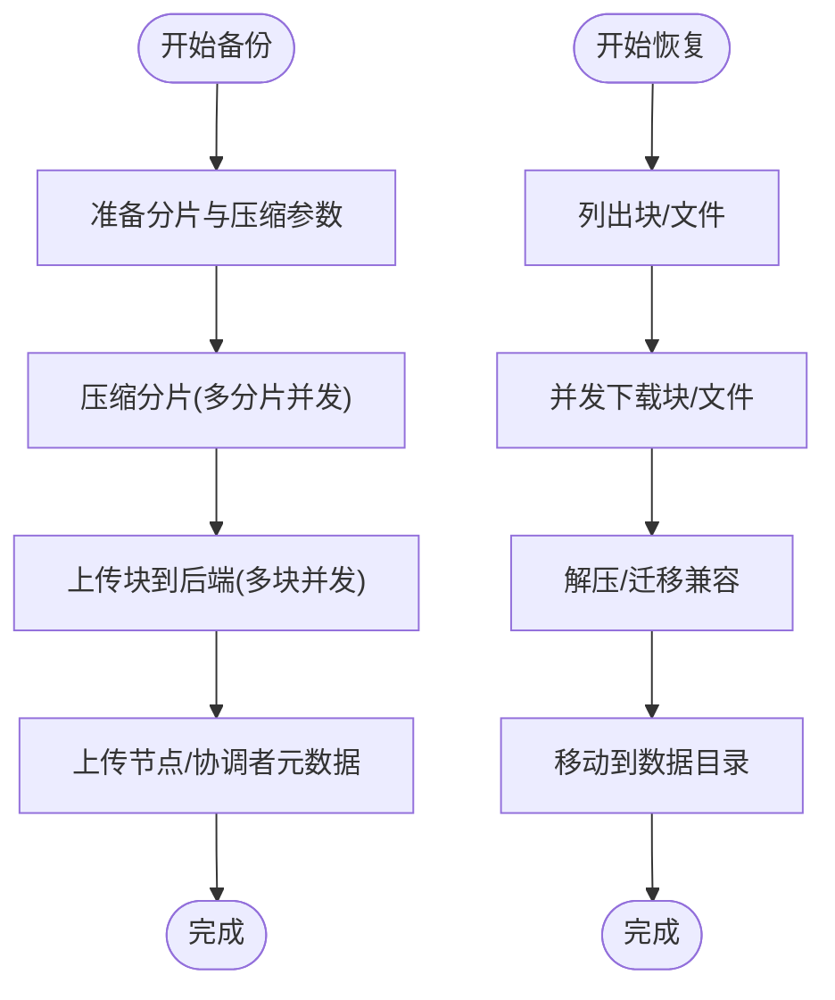
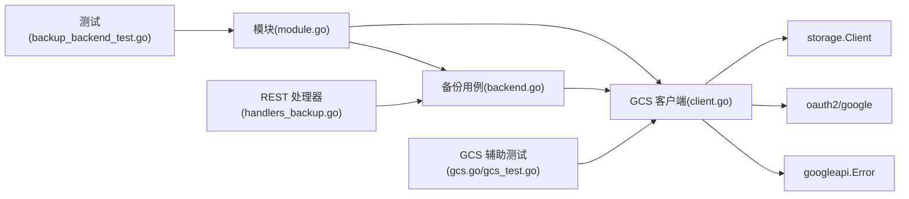
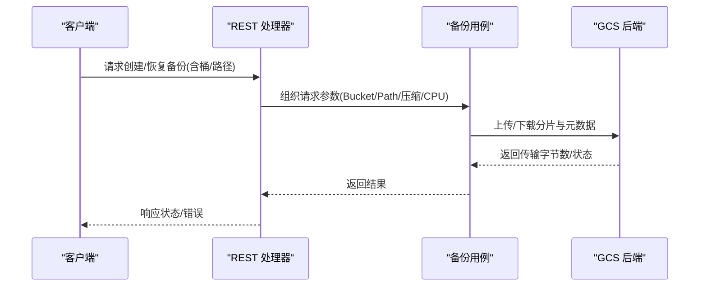

# GCS 备份后端

<cite>
**本文引用的文件**
- [client.go](file://modules/backup-gcs/client.go)
- [module.go](file://modules/backup-gcs/module.go)
- [backend.go](file://usecases/backup/backend.go)
- [backup_backend_test.go](file://test/modules/backup-gcs/backup_backend_test.go)
- [handlers_backup.go](file://adapters/handlers/rest/handlers_backup.go)
- [gcs.go](file://test/helper/backuptest/gcs.go)
- [gcs_test.go](file://test/helper/backuptest/gcs_test.go)
</cite>

## 目录
1. [简介](#简介)
2. [项目结构](#项目结构)
3. [核心组件](#核心组件)
4. [架构总览](#架构总览)
5. [详细组件分析](#详细组件分析)
6. [依赖关系分析](#依赖关系分析)
7. [性能与优化](#性能与优化)
8. [故障排查指南](#故障排查指南)
9. [结论](#结论)
10. [附录：配置与操作指南](#附录配置与操作指南)

## 简介
本文件为 Weaviate 的 Google Cloud Storage（GCS）备份后端模块提供完整技术文档。内容涵盖设计架构、客户端初始化与认证、对象读写与并行传输、元数据管理、错误处理与重试策略、以及在 Google Cloud 平台上部署时的 IAM 权限、网络与安全建议。文档同时给出性能优化、成本控制与合规性要点，并提供面向平台用户的配置与操作指南。

## 项目结构
GCS 备份后端位于模块目录中，核心由两部分组成：
- 模块入口与配置：模块定义、环境变量解析、初始化流程
- GCS 客户端：基于官方 Go SDK 的封装，提供对象存取、路径组织、重试与度量上报

图表来源
- [module.go](file://modules/backup-gcs/module.go#L1-L111)
- [client.go](file://modules/backup-gcs/client.go#L1-L403)
- [backend.go](file://usecases/backup/backend.go#L1-L708)
- [backup_backend_test.go](file://test/modules/backup-gcs/backup_backend_test.go#L1-L277)
- [gcs.go](file://test/helper/backuptest/gcs.go#L1-L103)
- [gcs_test.go](file://test/helper/backuptest/gcs_test.go#L247-L299)
- [handlers_backup.go](file://adapters/handlers/rest/handlers_backup.go#L178-L214)

章节来源
- [module.go](file://modules/backup-gcs/module.go#L1-L111)
- [client.go](file://modules/backup-gcs/client.go#L1-L403)
- [backend.go](file://usecases/backup/backend.go#L1-L708)

## 核心组件
- 模块（Module）
  - 负责从环境变量加载配置（如存储桶、路径），初始化 GCS 客户端，并暴露备份后端能力
- GCS 客户端（gcsClient）
  - 基于官方 storage.Client 封装，提供对象读写、路径拼接、桶存在性检查、访问性自检等
  - 内置指数退避重试策略，覆盖常见可重试错误与特定状态码
- 备份用例（usecases/backup）
  - 统一的备份/恢复流程编排，包括分片压缩、并行上传/下载、元数据管理、度量上报
- 测试与辅助工具
  - 提供 GCS 模拟器支持、桶生命周期测试、路径与权限验证

章节来源
- [module.go](file://modules/backup-gcs/module.go#L24-L111)
- [client.go](file://modules/backup-gcs/client.go#L38-L93)
- [backend.go](file://usecases/backup/backend.go#L38-L708)

## 架构总览
GCS 备份后端通过模块化接口与 Weaviate 备份用例解耦，对外暴露统一的备份后端能力；内部使用 GCS 官方 SDK 进行对象存取，并结合 Weaviate 的压缩与并发策略完成大规模数据的高效传输。

图表来源
- [module.go](file://modules/backup-gcs/module.go#L74-L94)
- [client.go](file://modules/backup-gcs/client.go#L226-L398)

## 详细组件分析

### 模块初始化与配置
- 环境变量
  - 必填：BACKUP_GCS_BUCKET
  - 可选：BACKUP_GCS_PATH（桶内子路径前缀）
  - 认证开关：BACKUP_GCS_USE_AUTH（默认启用，设为 "false" 则禁用认证）
  - 项目 ID：GOOGLE_CLOUD_PROJECT / GCLOUD_PROJECT / GCP_PROJECT
- 初始化流程
  - 从环境变量读取配置
  - 构造 GCS 客户端（可选携带凭据或无认证）
  - 设置重试策略（指数退避 + 自定义错误判定）

章节来源
- [module.go](file://modules/backup-gcs/module.go#L24-L94)
- [client.go](file://modules/backup-gcs/client.go#L45-L93)

### GCS 客户端核心方法
- 对象读取与写入
  - GetObject/Read：读取单个对象或流式读取到本地文件
  - PutObject/Write：写入字节或流式写入
- 路径与目录
  - HomeDir：返回备份根目录（gs://bucket/path）
  - makeObjectName：按备份 ID 与键生成对象名，支持覆盖桶与路径
- 访问性自检
  - Initialize：写入一个临时对象并立即删除，用于验证读写权限
- 桶与对象查询
  - findBucket：确认桶存在
  - AllBackups：列举符合全局备份文件名的元数据对象

章节来源
- [client.go](file://modules/backup-gcs/client.go#L95-L173)
- [client.go](file://modules/backup-gcs/client.go#L175-L198)
- [client.go](file://modules/backup-gcs/client.go#L200-L272)
- [client.go](file://modules/backup-gcs/client.go#L274-L398)

### 备份流程与并行传输
- 分片与压缩
  - 备份用例对每个类的分片进行压缩打包，按目标大小切分为多个“块”
  - 支持 gzip/zstd 等压缩算法与 CPU 百分比控制
- 并行上传
  - 使用 goroutine 池，按分片并发压缩并上传
  - 上传完成后汇总预压缩大小与分片清单
- 元数据管理
  - 节点侧元数据：每个节点上传其类级备份元数据
  - 协调者侧元数据：协调者聚合全局备份信息
- 下载与还原
  - 恢复时根据压缩类型解压，按分片并发下载并落盘
  - 支持迁移兼容（旧版本备份结构）

图表来源
- [backend.go](file://usecases/backup/backend.go#L174-L504)
- [backend.go](file://usecases/backup/backend.go#L530-L663)

章节来源
- [backend.go](file://usecases/backup/backend.go#L174-L504)
- [backend.go](file://usecases/backup/backend.go#L530-L663)

### 错误处理与重试策略
- 重试策略
  - 指数退避（初始 2s，最大 60s，乘数 3）
  - 默认对可重试错误重试
  - 特别处理 401 未授权错误，作为可重试条件
- 错误包装与分类
  - 对象不存在：转换为 NotFound 错误
  - 上下文取消：标记为 Cancelled
  - 其他错误：包装并返回内部错误

章节来源
- [client.go](file://modules/backup-gcs/client.go#L72-L91)
- [client.go](file://modules/backup-gcs/client.go#L362-L398)

### 认证与授权（OAuth2 与服务账号）
- 凭据获取
  - 当启用认证时，使用默认凭据（优先服务账号凭据），并声明读写作用域
  - 支持通过环境变量禁用认证（用于模拟器或特定场景）
- 项目 ID 解析
  - 依次尝试 GOOGLE_CLOUD_PROJECT、GCLOUD_PROJECT、GCP_PROJECT
- 服务账号与 IAM
  - 建议使用最小权限原则，授予存储桶读写权限
  - 在受限网络环境中，确保允许访问 GCS API 端点

章节来源
- [client.go](file://modules/backup-gcs/client.go#L47-L66)
- [module.go](file://modules/backup-gcs/module.go#L74-L94)

### 存储桶与对象管理
- 存储桶
  - 通过 findBucket 确认桶存在
  - 支持覆盖桶名与路径前缀
- 对象命名
  - 采用“备份 ID/键”的层级结构，便于检索与清理
- 元数据对象
  - 全局备份文件名用于发现与聚合
  - 节点侧与协调者侧分别维护不同粒度的元数据

章节来源
- [client.go](file://modules/backup-gcs/client.go#L175-L198)
- [client.go](file://modules/backup-gcs/client.go#L134-L173)

### 性能度量与监控
- 数据传输度量
  - 上传/下载时累加传输字节数，用于监控与成本估算
- 时长度量
  - 上传耗时按类标签记录，便于定位热点

章节来源
- [client.go](file://modules/backup-gcs/client.go#L117-L121)
- [client.go](file://modules/backup-gcs/client.go#L246-L251)
- [client.go](file://modules/backup-gcs/client.go#L355-L359)
- [backend.go](file://usecases/backup/backend.go#L332-L340)

## 依赖关系分析
- 模块依赖
  - 模块依赖环境变量与存储提供者（数据路径）
  - 初始化后持有 GCS 客户端实例
- 客户端依赖
  - cloud.google.com/go/storage 官方 SDK
  - oauth2/google 与 googleapi 错误类型
- 用例依赖
  - 备份用例通过统一接口调用后端能力，屏蔽具体存储细节
- 测试依赖
  - GCS 模拟器、桶生命周期测试、路径与权限验证

图表来源
- [module.go](file://modules/backup-gcs/module.go#L74-L94)
- [client.go](file://modules/backup-gcs/client.go#L25-L31)
- [backend.go](file://usecases/backup/backend.go#L61-L92)
- [backup_backend_test.go](file://test/modules/backup-gcs/backup_backend_test.go#L33-L41)
- [gcs.go](file://test/helper/backuptest/gcs.go#L59-L78)
- [gcs_test.go](file://test/helper/backuptest/gcs_test.go#L247-L299)
- [handlers_backup.go](file://adapters/handlers/rest/handlers_backup.go#L178-L214)

章节来源
- [module.go](file://modules/backup-gcs/module.go#L74-L94)
- [client.go](file://modules/backup-gcs/client.go#L25-L31)
- [backend.go](file://usecases/backup/backend.go#L61-L92)

## 性能与优化
- 并发与压缩
  - 上传阶段：按分片并发压缩并上传，CPU 百分比可调，避免过度占用
  - 下载阶段：按块并发解压与写入，减少整体恢复时间
- 传输优化
  - 使用流式读写（io.Copy）降低内存峰值
  - 对大文件采用分块策略，提升吞吐与稳定性
- 重试策略
  - 指数退避与 401 特判，提高网络抖动下的成功率
- 成本控制
  - 选择合适存储类别（标准/近线/冷/深度冷）与生命周期策略
  - 合理设置保留期，避免长期冗余数据产生额外费用
- 合规性
  - 仅授予最小权限的服务账号
  - 使用 VPC-SC 或防火墙限制访问范围
  - 审计日志与访问控制清单（ACL）定期审查

[本节为通用指导，不直接分析具体文件]

## 故障排查指南
- 常见问题
  - 无法找到桶：确认桶名与路径前缀正确，且具备读取权限
  - 对象不存在：检查键名与备份 ID 是否匹配
  - 权限不足：检查服务账号角色与 IAM 策略
  - 网络异常：确认 GCS API 可达性与代理/防火墙设置
- 自检与诊断
  - 使用 Initialize 执行一次写入与删除，快速验证读写权限
  - 查看传输度量与耗时指标，定位瓶颈
  - 结合上下文取消与错误包装，区分取消与失败原因

章节来源
- [client.go](file://modules/backup-gcs/client.go#L254-L272)
- [client.go](file://modules/backup-gcs/client.go#L362-L398)
- [backend.go](file://usecases/backup/backend.go#L332-L340)

## 结论
GCS 备份后端以模块化方式与 Weaviate 解耦，通过官方 SDK 实现稳定可靠的对象存取，并结合压缩与并发策略实现高效的备份与恢复。配合完善的重试、度量与自检机制，可在生产环境中满足高可用与可观测性的需求。建议在部署时遵循最小权限、网络隔离与合规审计的最佳实践，以获得更安全、可控与经济的备份方案。

[本节为总结，不直接分析具体文件]

## 附录：配置与操作指南

### 环境变量与配置项
- 必填
  - BACKUP_GCS_BUCKET：目标存储桶名称
- 可选
  - BACKUP_GCS_PATH：桶内子路径前缀（用于多租户或多环境隔离）
  - BACKUP_GCS_USE_AUTH：是否启用认证（默认启用；设为 "false" 可禁用）
  - GOOGLE_CLOUD_PROJECT / GCLOUD_PROJECT / GCP_PROJECT：项目 ID（按顺序解析）
- 测试/模拟器
  - STORAGE_EMULATOR_HOST：指向 GCS 模拟器地址
  - GOOGLE_APPLICATION_CREDENTIALS：可为空（禁用认证）

章节来源
- [module.go](file://modules/backup-gcs/module.go#L24-L86)
- [client.go](file://modules/backup-gcs/client.go#L47-L66)
- [backup_backend_test.go](file://test/modules/backup-gcs/backup_backend_test.go#L33-L41)

### IAM 角色与权限建议
- 最小权限原则
  - 仅授予存储桶的读写权限
  - 避免授予管理员或所有者角色
- 常用角色参考
  - Storage Object Creator（创建对象）
  - Storage Object Viewer（查看对象）
  - Storage Object Viewer + Storage Legacy Bucket Writer（读写）
- 网络与安全
  - 在受限网络中，确保允许访问 GCS API 端点
  - 如需跨项目访问，配置适当的 IAM 策略与网络策略

[本节为通用指导，不直接分析具体文件]

### 区域选择与冷存储策略
- 区域选择
  - 选择靠近计算节点的区域，降低延迟与出口费用
- 存储类别
  - 标准：高频访问
  - 近线：低频访问但仍需较快检索
  - 冷/深度冷：极低访问频率，显著降低成本
- 生命周期策略
  - 设置自动过渡与删除规则，避免长期保留不必要的数据

[本节为通用指导，不直接分析具体文件]

### 灾难恢复与备份保留
- 多区域/多桶策略
  - 在不同区域建立镜像桶，提升容灾能力
- 保留期与合规
  - 根据法规要求设置保留期
  - 定期审计备份完整性与访问权限

[本节为通用指导，不直接分析具体文件]

### REST 接口与请求流程
- 创建/恢复备份
  - REST 层接收请求，解析桶与路径参数
  - 调用备份用例执行备份/恢复流程
  - 返回状态与错误信息

图表来源
- [handlers_backup.go](file://adapters/handlers/rest/handlers_backup.go#L178-L214)
- [backend.go](file://usecases/backup/backend.go#L174-L504)

章节来源
- [handlers_backup.go](file://adapters/handlers/rest/handlers_backup.go#L178-L214)
- [backend.go](file://usecases/backup/backend.go#L174-L504)