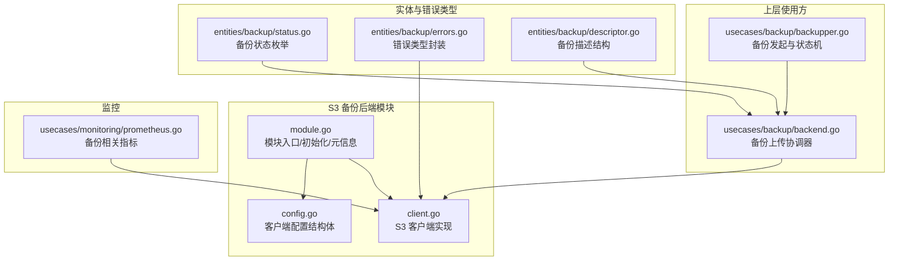
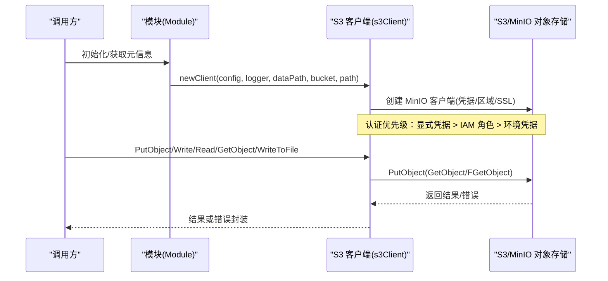
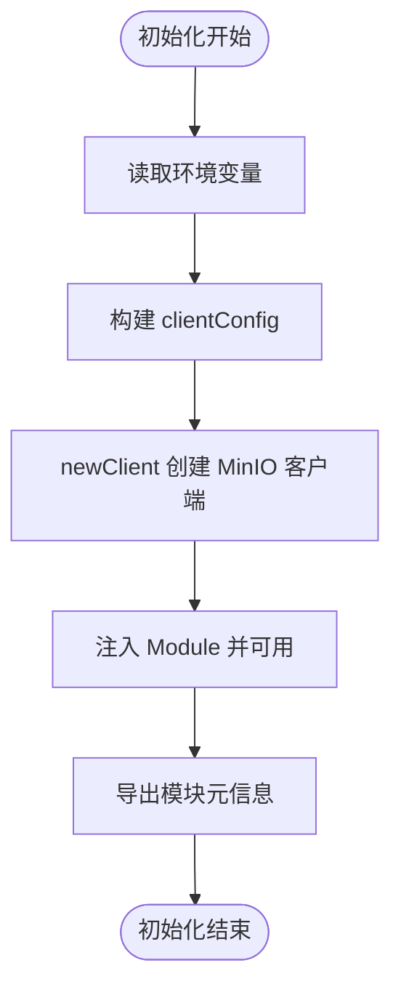
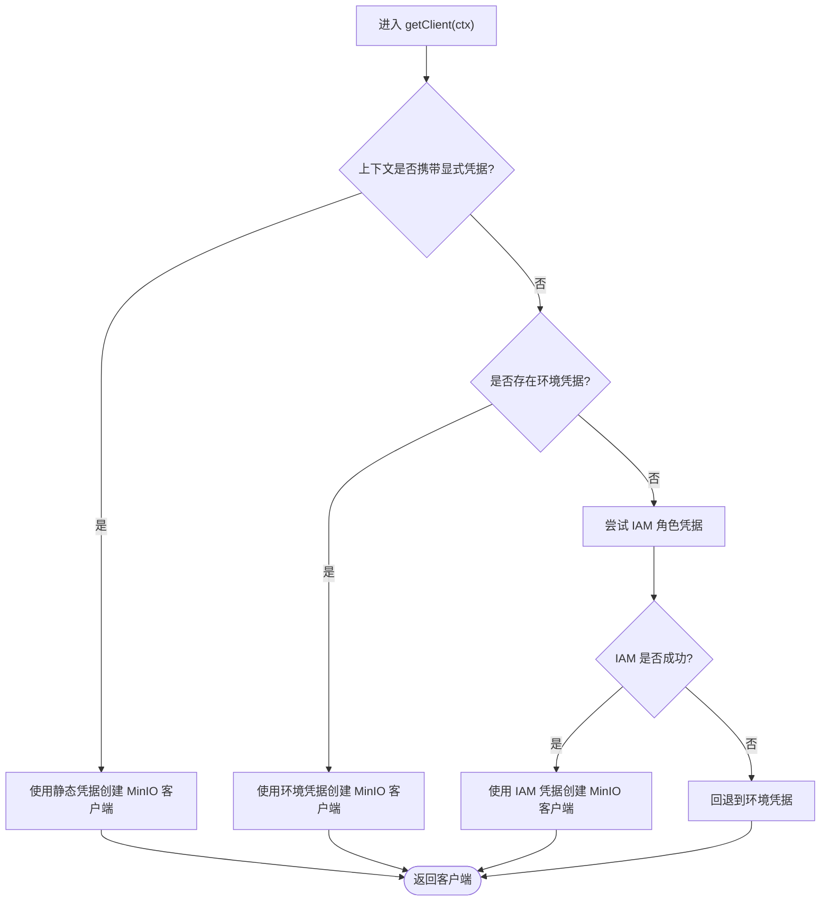
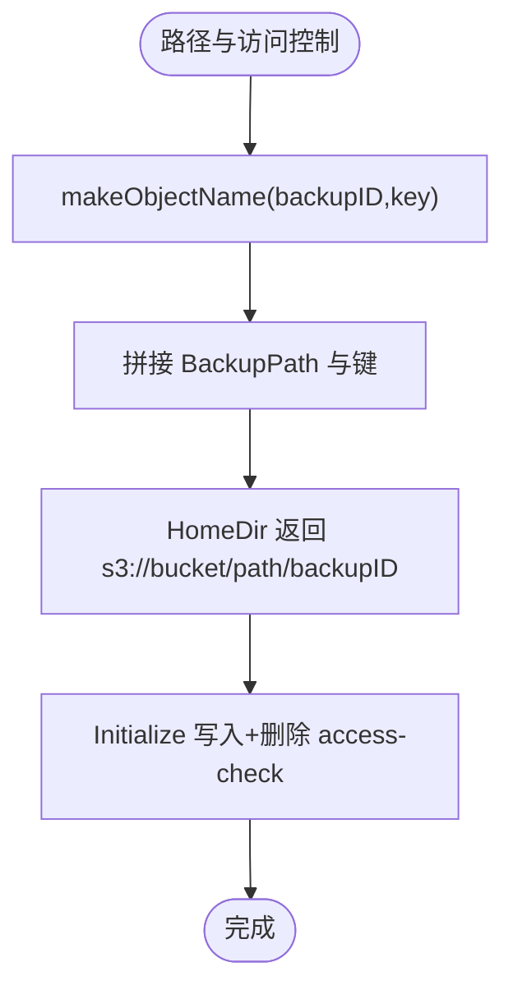
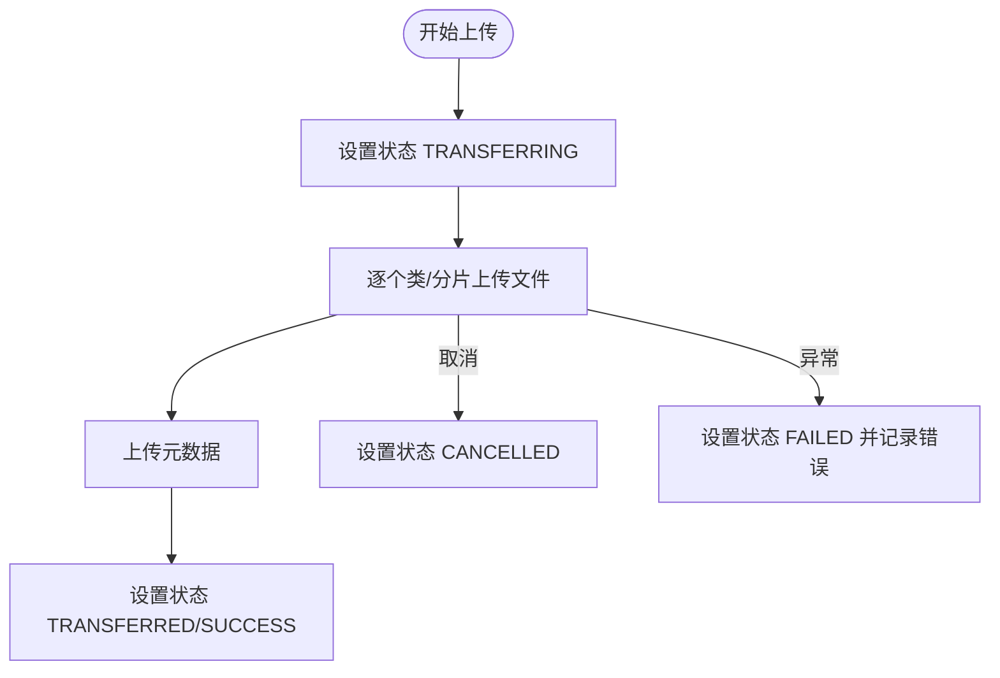
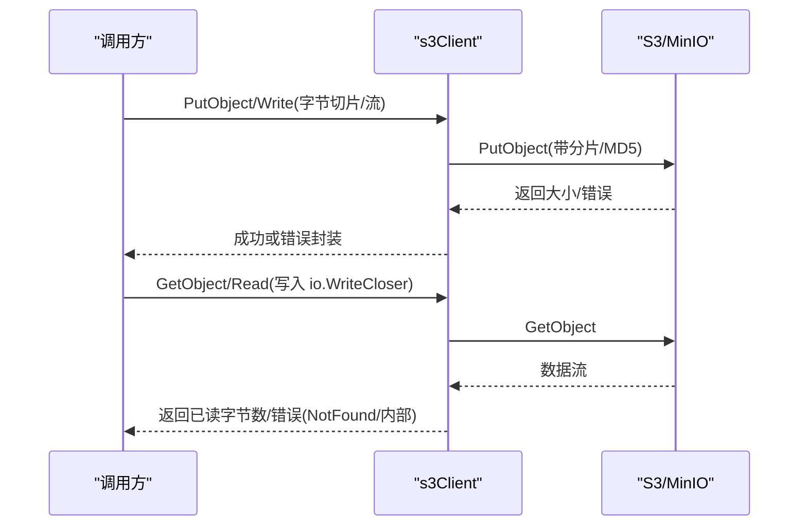
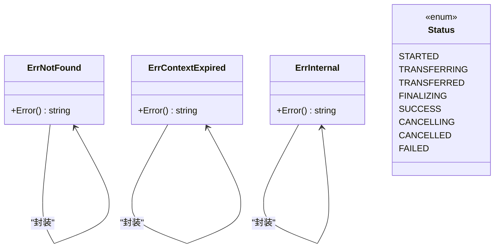
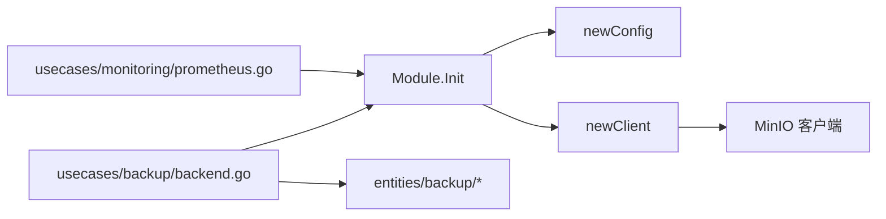

# S3 备份后端

<cite>
**本文引用的文件**
- [modules/backup-s3/module.go](file://modules/backup-s3/module.go)
- [modules/backup-s3/config.go](file://modules/backup-s3/config.go)
- [modules/backup-s3/client.go](file://modules/backup-s3/client.go)
- [entities/backup/errors.go](file://entities/backup/errors.go)
- [entities/backup/status.go](file://entities/backup/status.go)
- [entities/backup/descriptor.go](file://entities/backup/descriptor.go)
- [usecases/backup/backend.go](file://usecases/backup/backend.go)
- [usecases/backup/backupper.go](file://usecases/backup/backupper.go)
- [usecases/monitoring/prometheus.go](file://usecases/monitoring/prometheus.go)
- [test/modules/backup-s3/backup_backend_test.go](file://test/modules/backup-s3/backup_backend_test.go)
</cite>

## 目录
1. [简介](#简介)
2. [项目结构](#项目结构)
3. [核心组件](#核心组件)
4. [架构总览](#架构总览)
5. [详细组件分析](#详细组件分析)
6. [依赖关系分析](#依赖关系分析)
7. [性能考量](#性能考量)
8. [故障排查指南](#故障排查指南)
9. [结论](#结论)
10. [附录](#附录)

## 简介
本文件为 Weaviate 的 S3 备份后端模块提供系统化技术文档。重点覆盖以下方面：
- S3 客户端初始化流程、配置参数与认证方式
- S3 存储桶路径管理与访问控制策略
- 备份上传流程、断点续传与错误重试机制
- SSL/TLS 加密传输、签名认证与 IAM 权限配置
- 最佳实践、性能优化与成本控制策略
- 常见问题排查、故障恢复与安全加固指南

该模块通过 MinIO Go SDK 与 S3 兼容对象存储交互，支持元数据与数据对象的读写、路径拼接与访问检查，并在备份流程中与上层 usecases 模块协作完成分布式备份状态管理与度量采集。

## 项目结构
S3 备份后端位于模块目录 modules/backup-s3，关键文件包括：
- module.go：模块入口，负责环境变量解析、客户端初始化与元信息导出
- config.go：客户端配置结构体，定义 Endpoint、Bucket、UseSSL、BackupPath
- client.go：S3 客户端实现，封装 MinIO 客户端、认证、路径管理、对象读写与访问检查

**图表来源**
- [modules/backup-s3/module.go](file://modules/backup-s3/module.go#L70-L89)
- [modules/backup-s3/config.go](file://modules/backup-s3/config.go#L14-L31)
- [modules/backup-s3/client.go](file://modules/backup-s3/client.go#L51-L79)
- [usecases/backup/backend.go](file://usecases/backup/backend.go#L61-L92)
- [usecases/backup/backupper.go](file://usecases/backup/backupper.go#L84-L116)
- [entities/backup/status.go](file://entities/backup/status.go#L14-L25)
- [entities/backup/errors.go](file://entities/backup/errors.go#L14-L63)
- [entities/backup/descriptor.go](file://entities/backup/descriptor.go#L326-L339)
- [usecases/monitoring/prometheus.go](file://usecases/monitoring/prometheus.go#L709-L736)

**章节来源**
- [modules/backup-s3/module.go](file://modules/backup-s3/module.go#L25-L100)
- [modules/backup-s3/config.go](file://modules/backup-s3/config.go#L14-L31)
- [modules/backup-s3/client.go](file://modules/backup-s3/client.go#L43-L94)

## 核心组件
- 模块（Module）：负责从环境变量加载配置、实例化 S3 客户端，并提供模块元信息导出
- 客户端配置（clientConfig）：包含 Endpoint、Bucket、UseSSL、BackupPath
- S3 客户端（s3Client）：封装 MinIO 客户端，提供路径拼接、对象读写、访问检查、上下文凭据注入等能力
- 错误类型：统一包装 NotFound、ContextExpired、Internal 等错误，便于上层处理
- 状态与描述：定义备份状态枚举与备份描述结构，支撑分布式备份状态流转

**章节来源**
- [modules/backup-s3/module.go](file://modules/backup-s3/module.go#L70-L100)
- [modules/backup-s3/config.go](file://modules/backup-s3/config.go#L14-L31)
- [modules/backup-s3/client.go](file://modules/backup-s3/client.go#L43-L94)
- [entities/backup/errors.go](file://entities/backup/errors.go#L14-L63)
- [entities/backup/status.go](file://entities/backup/status.go#L14-L25)
- [entities/backup/descriptor.go](file://entities/backup/descriptor.go#L326-L339)

## 架构总览
S3 备份后端在 Weaviate 中的定位是“备份后端”，由 usecases 层驱动上传与下载，具体流程如下：

**图表来源**
- [modules/backup-s3/module.go](file://modules/backup-s3/module.go#L70-L89)
- [modules/backup-s3/client.go](file://modules/backup-s3/client.go#L51-L94)
- [modules/backup-s3/client.go](file://modules/backup-s3/client.go#L218-L253)
- [modules/backup-s3/client.go](file://modules/backup-s3/client.go#L306-L340)
- [modules/backup-s3/client.go](file://modules/backup-s3/client.go#L342-L380)
- [modules/backup-s3/client.go](file://modules/backup-s3/client.go#L277-L304)

## 详细组件分析

### 模块初始化与配置
- 环境变量
  - BACKUP_S3_BUCKET：必填，指定目标存储桶
  - BACKUP_S3_ENDPOINT：可选，默认指向 s3.amazonaws.com
  - BACKUP_S3_USE_SSL：可选，默认启用 SSL；设为 "false" 关闭
  - BACKUP_S3_PATH：可选，指定桶内根路径（前缀）
- 初始化流程
  - 读取环境变量构造 clientConfig
  - 调用 newClient 创建 MinIO 客户端
  - 将 s3Client 注入 Module，供后续操作使用
- 元信息导出
  - 导出 endpoint、bucketName、rootName（若设置）、useSSL

**图表来源**
- [modules/backup-s3/module.go](file://modules/backup-s3/module.go#L70-L89)
- [modules/backup-s3/config.go](file://modules/backup-s3/config.go#L25-L31)
- [modules/backup-s3/client.go](file://modules/backup-s3/client.go#L51-L79)
- [modules/backup-s3/module.go](file://modules/backup-s3/module.go#L91-L100)

**章节来源**
- [modules/backup-s3/module.go](file://modules/backup-s3/module.go#L25-L100)
- [modules/backup-s3/config.go](file://modules/backup-s3/config.go#L14-L31)

### 认证与凭据注入
- 凭据来源优先级
  - 显式凭据：当请求上下文中携带 X-AWS-ACCESS-KEY、X-AWS-SECRET-KEY、X-AWS-SESSION-TOKEN 时，使用静态凭据
  - 环境凭据：AWS_ACCESS_KEY_ID/AWS_ACCESS_KEY 与 AWS_SECRET_ACCESS_KEY/AWS_SECRET_KEY 同时存在时启用
  - IAM 角色：若无环境凭据，尝试通过 EC2/ECS IAM 角色获取
  - 匿名回退：若 IAM 获取失败，回退到环境凭据
- SSL/TLS
  - UseSSL 控制是否启用 HTTPS；默认启用
- 区域
  - 优先读取 AWS_REGION，其次 AWS_DEFAULT_REGION

**图表来源**
- [modules/backup-s3/client.go](file://modules/backup-s3/client.go#L82-L94)
- [modules/backup-s3/client.go](file://modules/backup-s3/client.go#L57-L69)

**章节来源**
- [modules/backup-s3/client.go](file://modules/backup-s3/client.go#L57-L94)

### 路径管理与访问控制
- 路径拼接
  - 使用 makeObjectName 拼接 BackupPath 与对象键
  - HomeDir 返回 s3://bucket/path/backupID 形式的根路径
- 访问控制
  - Initialize 执行一次 PutObject + RemoveObject，用于验证写入权限
  - GetObject/Read 在对象不存在时返回 NotFound 错误
- 覆盖机制
  - 支持 overrideBucket 与 overridePath 参数，允许在单次调用中覆盖桶与路径

**图表来源**
- [modules/backup-s3/client.go](file://modules/backup-s3/client.go#L96-L114)
- [modules/backup-s3/client.go](file://modules/backup-s3/client.go#L255-L274)

**章节来源**
- [modules/backup-s3/client.go](file://modules/backup-s3/client.go#L96-L114)
- [modules/backup-s3/client.go](file://modules/backup-s3/client.go#L255-L274)

### 备份上传流程与断点续传
- 上传阶段
  - uploader.all 驱动上传，状态依次为 STARTED -> TRANSFERRING -> TRANSFERRED -> SUCCESS
  - 上传完成后写入元数据（metadata），并释放索引资源
- 断点续传
  - 未在 S3 客户端实现中发现内置断点续传逻辑；通常通过分片上传与重试策略保障可靠性
- 错误处理
  - context.Canceled 或 ctx.Err() 触发时，状态更新为 CANCELLED
  - 其他错误封装为 Internal 并记录错误信息

**图表来源**
- [usecases/backup/backend.go](file://usecases/backup/backend.go#L208-L311)
- [usecases/backup/backend.go](file://usecases/backup/backend.go#L223-L228)
- [usecases/backup/backend.go](file://usecases/backup/backend.go#L234-L237)
- [entities/backup/status.go](file://entities/backup/status.go#L16-L25)

**章节来源**
- [usecases/backup/backend.go](file://usecases/backup/backend.go#L208-L311)
- [entities/backup/status.go](file://entities/backup/status.go#L16-L25)

### 对象读写与流式传输
- PutObject/Write
  - 固定分片大小常量（MINIO_MIN_PART_SIZE=16MB），启用 MD5 校验
  - 通过 PutObjectOptions.ContentType、PartSize、SendContentMd5 控制
- GetObject/Read
  - 使用 io.Copy 流式读取，避免大对象内存占用
  - 对 404 场景返回 NotFound，其他错误返回 Internal
- WriteToFile
  - 使用 FGetObject 直接落盘，适合大文件下载

**图表来源**
- [modules/backup-s3/client.go](file://modules/backup-s3/client.go#L218-L253)
- [modules/backup-s3/client.go](file://modules/backup-s3/client.go#L306-L340)
- [modules/backup-s3/client.go](file://modules/backup-s3/client.go#L342-L380)
- [modules/backup-s3/client.go](file://modules/backup-s3/client.go#L277-L304)

**章节来源**
- [modules/backup-s3/client.go](file://modules/backup-s3/client.go#L218-L253)
- [modules/backup-s3/client.go](file://modules/backup-s3/client.go#L306-L380)

### 错误类型与状态管理
- 错误类型
  - NotFound：对象不存在
  - ErrContextExpired：上下文过期
  - ErrInternal：内部错误
- 状态管理
  - 备份状态枚举：STARTED、TRANSFERRING、TRANSFERRED、FINALIZING、SUCCESS、CANCELLING、CANCELLED、FAILED
  - 分布式备份描述包含节点映射、状态、版本、压缩类型等字段

**图表来源**
- [entities/backup/errors.go](file://entities/backup/errors.go#L14-L63)
- [entities/backup/status.go](file://entities/backup/status.go#L14-L25)

**章节来源**
- [entities/backup/errors.go](file://entities/backup/errors.go#L14-L63)
- [entities/backup/status.go](file://entities/backup/status.go#L14-L25)

## 依赖关系分析
- 模块与客户端
  - Module.Init 依赖 newConfig/newClient 构造 s3Client
  - 上层 usecases 通过 Module 接口调用 PutObject/Read/Write 等方法
- 实体与状态
  - usecases/backup/backend.go 使用 entities/backup 的状态与描述结构进行状态流转
- 监控
  - s3Client 在 PutObject/Read 等路径上报备份/恢复数据传输字节数指标

**图表来源**
- [modules/backup-s3/module.go](file://modules/backup-s3/module.go#L70-L89)
- [modules/backup-s3/config.go](file://modules/backup-s3/config.go#L25-L31)
- [modules/backup-s3/client.go](file://modules/backup-s3/client.go#L51-L79)
- [usecases/backup/backend.go](file://usecases/backup/backend.go#L61-L92)
- [usecases/monitoring/prometheus.go](file://usecases/monitoring/prometheus.go#L734-L736)

**章节来源**
- [modules/backup-s3/module.go](file://modules/backup-s3/module.go#L70-L89)
- [usecases/backup/backend.go](file://usecases/backup/backend.go#L61-L92)
- [usecases/monitoring/prometheus.go](file://usecases/monitoring/prometheus.go#L734-L736)

## 性能考量
- 分片与并发
  - PutObject 使用固定分片大小（16MB）与多部分上传，提升大文件上传稳定性
- 流式传输
  - Read/Write 采用 io.Copy 流式复制，降低内存峰值
- 指标监控
  - 上传/下载阶段均上报数据传输字节数，便于容量与成本估算
- 建议
  - 在高延迟网络下适当增大分片大小以减少小包开销
  - 使用压缩（如 gzip/zstd）降低传输体积，结合监控评估压缩比与 CPU 开销

[本节为通用性能建议，不直接分析具体文件]

## 故障排查指南
- 初始化失败
  - 确认 BACKUP_S3_BUCKET 已设置且可访问
  - 检查 BACKUP_S3_ENDPOINT 与 BACKUP_S3_USE_SSL 配置
- 权限问题
  - 使用 Initialize 进行写入/删除测试，确认具备桶级写权限
  - 若使用 IAM 角色，请确保角色策略允许 PutObject/RemoveObject
- 对象不存在
  - GetObject/Read 返回 NotFound 表示对象缺失或路径错误
- 上下文过期
  - 检查调用方上下文是否提前取消
- 单测参考
  - 参考测试用例对 PutObject/GetObject/WriteToFile/Read 的行为验证

**章节来源**
- [modules/backup-s3/module.go](file://modules/backup-s3/module.go#L76-L82)
- [modules/backup-s3/client.go](file://modules/backup-s3/client.go#L255-L274)
- [modules/backup-s3/client.go](file://modules/backup-s3/client.go#L170-L216)
- [modules/backup-s3/client.go](file://modules/backup-s3/client.go#L342-L380)
- [test/modules/backup-s3/backup_backend_test.go](file://test/modules/backup-s3/backup_backend_test.go#L107-L118)

## 结论
S3 备份后端通过清晰的模块化设计与稳健的 MinIO 客户端集成，提供了可靠的云端备份能力。其特性包括：
- 灵活的凭据注入与区域配置
- 清晰的路径管理与访问控制验证
- 流式上传/下载与可观测性指标
- 与 usecases 层协同的状态管理与错误处理

在生产环境中，建议结合 IAM 最小权限原则、SSL/TLS 强制开启、合理的分片与压缩策略，以及完善的监控告警，确保备份流程的高可用与低成本。

[本节为总结性内容，不直接分析具体文件]

## 附录

### 环境变量与配置项
- BACKUP_S3_BUCKET：必填，目标存储桶
- BACKUP_S3_ENDPOINT：可选，默认 s3.amazonaws.com
- BACKUP_S3_USE_SSL：可选，默认启用
- BACKUP_S3_PATH：可选，桶内根路径前缀

**章节来源**
- [modules/backup-s3/module.go](file://modules/backup-s3/module.go#L25-L40)
- [modules/backup-s3/config.go](file://modules/backup-s3/config.go#L14-L31)

### 备份状态与描述字段
- 状态枚举：STARTED、TRANSFERRING、TRANSFERRED、FINALIZING、SUCCESS、CANCELLING、CANCELLED、FAILED
- 描述结构：包含时间戳、ID、节点映射、状态、版本、服务器版本、Leader、错误、预压缩字节数、压缩类型等

**章节来源**
- [entities/backup/status.go](file://entities/backup/status.go#L14-L25)
- [entities/backup/descriptor.go](file://entities/backup/descriptor.go#L326-L339)