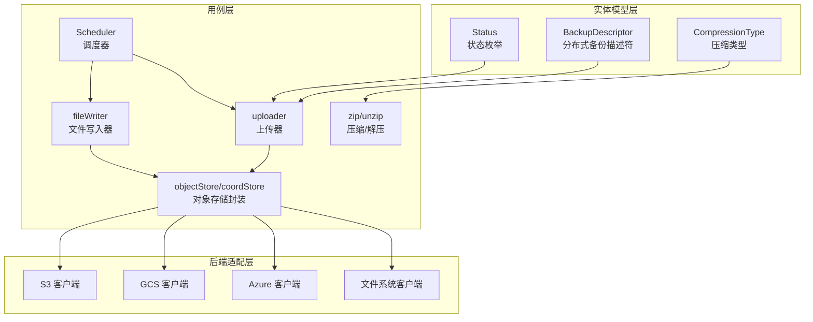
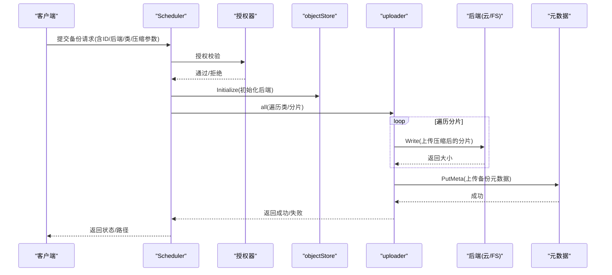
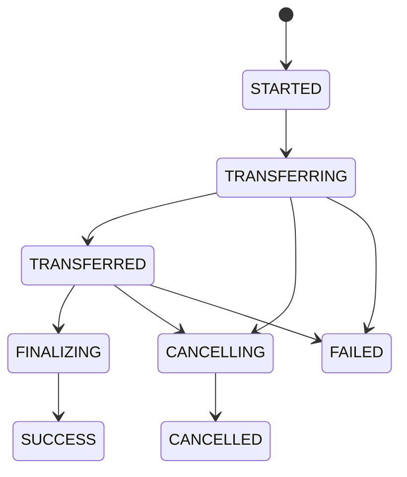
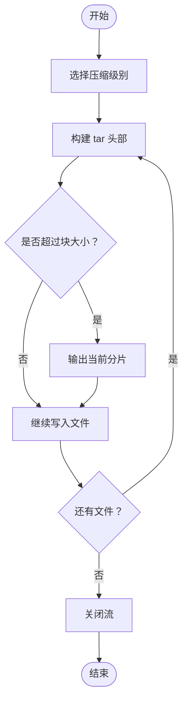
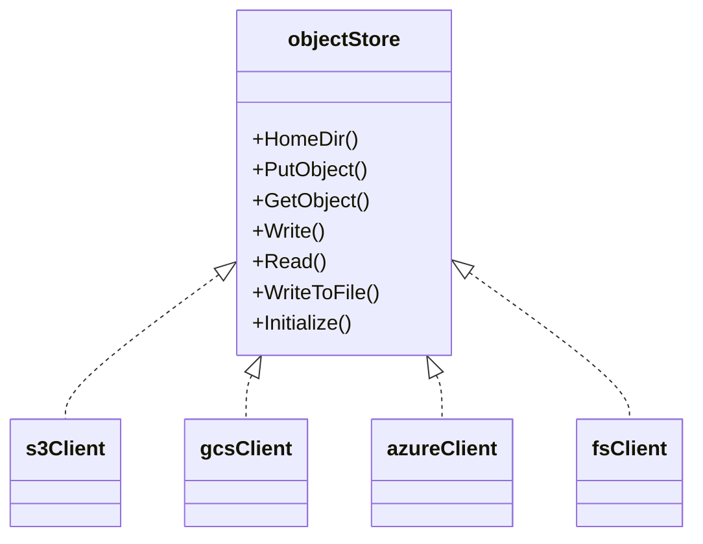
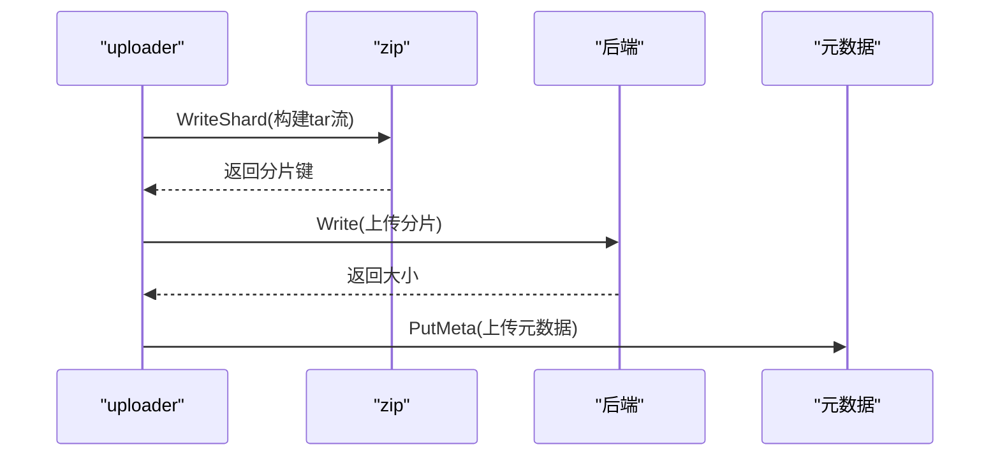
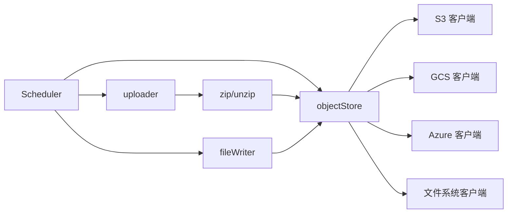

# 备份模块

<cite>
**本文引用的文件**
- [descriptor.go](file://entities/backup/descriptor.go)
- [status.go](file://entities/backup/status.go)
- [zip.go](file://usecases/backup/zip.go)
- [backend.go](file://usecases/backup/backend.go)
- [scheduler.go](file://usecases/backup/scheduler.go)
- [module.go（S3）](file://modules/backup-s3/module.go)
- [client.go（S3）](file://modules/backup-s3/client.go)
- [module.go（GCS）](file://modules/backup-gcs/module.go)
- [client.go（GCS）](file://modules/backup-gcs/client.go)
- [module.go（Azure）](file://modules/backup-azure/module.go)
- [client.go（Azure）](file://modules/backup-azure/client.go)
- [module.go（文件系统）](file://modules/backup-filesystem/module.go)
- [backup.go（文件系统）](file://modules/backup-filesystem/backup.go)
- [backup_config.go](file://entities/models/backup_config.go)
</cite>

## 目录
1. [简介](#简介)
2. [项目结构](#项目结构)
3. [核心组件](#核心组件)
4. [架构总览](#架构总览)
5. [详细组件分析](#详细组件分析)
6. [依赖关系分析](#依赖关系分析)
7. [性能考量](#性能考量)
8. [故障排查指南](#故障排查指南)
9. [结论](#结论)
10. [附录](#附录)

## 简介
本技术文档面向运维工程师与系统管理员，系统化阐述 Weaviate 备份模块的设计与实现，覆盖以下关键主题：
- 备份与恢复的整体架构与控制流
- S3、GCS、Azure 云存储后端的集成方式与配置要点
- 文件系统备份模块的本地存储策略
- 备份计划、增量与全量备份的实现原理
- 备份数据的压缩、并发传输与完整性校验机制
- 备份策略制定、恢复流程与故障处理最佳实践
- 性能优化、存储成本控制与合规性建议

## 项目结构
Weaviate 备份模块由“实体模型层”“用例层（备份/恢复编排）”“后端适配层（S3/GCS/Azure/文件系统）”三部分组成：
- 实体模型层：定义备份描述符、状态、压缩类型等数据结构
- 用例层：负责上传器/下载器、压缩/解压、调度器、状态管理与元数据持久化
- 后端适配层：封装不同对象存储或本地文件系统的统一接口

图示来源
- [descriptor.go](file://entities/backup/descriptor.go#L325-L339)
- [status.go](file://entities/backup/status.go#L14-L25)
- [zip.go](file://usecases/backup/zip.go#L33-L44)
- [backend.go](file://usecases/backup/backend.go#L61-L92)
- [scheduler.go](file://usecases/backup/scheduler.go#L57-L82)
- [client.go（S3）](file://modules/backup-s3/client.go#L101-L114)
- [client.go（GCS）](file://modules/backup-gcs/client.go#L124-L132)
- [client.go（Azure）](file://modules/backup-azure/client.go#L113-L119)
- [backup.go（文件系统）](file://modules/backup-filesystem/backup.go#L27-L51)

章节来源
- [descriptor.go](file://entities/backup/descriptor.go#L1-L492)
- [status.go](file://entities/backup/status.go#L1-L36)
- [zip.go](file://usecases/backup/zip.go#L1-L434)
- [backend.go](file://usecases/backup/backend.go#L1-L708)
- [scheduler.go](file://usecases/backup/scheduler.go#L57-L179)

## 核心组件
- 备份描述符与状态
  - BackupDescriptor/DistributedBackupDescriptor：描述一次备份的完整元信息（类、分片、压缩类型、大小等）
  - Status：备份生命周期状态（开始、传输中、已传输、收尾、成功、取消、失败）
- 压缩与解压
  - 支持 gzip/zstd/无压缩；按目标块大小切分，支持并发写入
- 对象存储封装
  - objectStore/nodeStore/coordStore：统一封装 PutObject/GetObject/Write/Read/Initialize/WriteToFile/HomeDir 等操作
- 上传器与文件写入器
  - uploader：按类/分片并发压缩并上传到对象存储
  - fileWriter：从对象存储下载并写入临时目录，再由 Raft Store 执行最终落盘
- 调度器
  - Scheduler：鉴权、初始化后端、触发备份/恢复、返回状态与路径

章节来源
- [descriptor.go](file://entities/backup/descriptor.go#L226-L339)
- [status.go](file://entities/backup/status.go#L14-L25)
- [zip.go](file://usecases/backup/zip.go#L33-L103)
- [backend.go](file://usecases/backup/backend.go#L61-L172)

## 架构总览
下图展示一次“节点级备份”的端到端流程：鉴权 → 初始化后端 → 并发压缩上传 → 元数据落盘 → 状态更新。

图示来源
- [scheduler.go](file://usecases/backup/scheduler.go#L140-L170)
- [backend.go](file://usecases/backup/backend.go#L94-L118)
- [backend.go](file://usecases/backup/backend.go#L207-L311)
- [client.go（S3）](file://modules/backup-s3/client.go#L218-L253)
- [client.go（GCS）](file://modules/backup-gcs/client.go#L226-L252)
- [client.go（Azure）](file://modules/backup-azure/client.go#L200-L224)
- [backup.go（文件系统）](file://modules/backup-filesystem/backup.go#L100-L126)

## 详细组件分析

### 数据模型与状态机
- 描述符
  - BackupDescriptor：单节点备份描述，包含类列表、状态、版本、压缩类型、预压缩字节大小等
  - DistributedBackupDescriptor：分布式备份描述，包含各节点的类映射、节点映射、压缩类型等
- 状态机
  - STARTED → TRANSFERRING → TRANSFERRED → FINALIZING → SUCCESS
  - 取消/失败路径会写入错误信息并回滚元数据

图示来源
- [status.go](file://entities/backup/status.go#L16-L25)
- [backend.go](file://usecases/backup/backend.go#L207-L311)

章节来源
- [descriptor.go](file://entities/backup/descriptor.go#L226-L339)
- [status.go](file://entities/backup/status.go#L14-L25)

### 压缩与分块策略
- 压缩算法
  - gzip：默认、最佳速度、最佳压缩
  - zstd：最佳速度、默认压缩、最佳压缩
  - 无压缩：raw tar 流
- 分块与并发
  - 按目标块大小切分，避免单个对象过大
  - 并发写入多个分片，提升吞吐
- 解压与恢复
  - 恢复时根据压缩类型选择解压器，逐块解压到临时目录，再由 Raft Store 移动到数据目录

图示来源
- [zip.go](file://usecases/backup/zip.go#L120-L184)
- [zip.go](file://usecases/backup/zip.go#L276-L325)

章节来源
- [zip.go](file://usecases/backup/zip.go#L33-L103)
- [zip.go](file://usecases/backup/zip.go#L120-L184)
- [zip.go](file://usecases/backup/zip.go#L276-L325)

### 对象存储封装与后端适配
- 统一接口
  - HomeDir：返回可访问的根路径
  - PutObject/GetObject：上传/下载二进制内容
  - Write/Read：流式上传/下载
  - WriteToFile：直接下载到本地文件
  - Initialize：访问性检查
- S3
  - 支持环境变量配置 Endpoint/Bucket/Path/UseSSL；自动识别 IAM 或环境密钥
  - 使用最小分片大小与 MD5 校验
- GCS
  - 支持默认凭据或无认证模式；内置重试策略
  - 以 Metadata/标签承载备份 ID
- Azure
  - 支持连接串/共享密钥/匿名三种方式
  - 支持动态 BlockSize/Concurrency 参数注入
- 文件系统
  - 本地绝对路径校验；所有备份以“备份ID/相对键”组织

图示来源
- [backend.go](file://usecases/backup/backend.go#L61-L92)
- [client.go（S3）](file://modules/backup-s3/client.go#L101-L114)
- [client.go（GCS）](file://modules/backup-gcs/client.go#L124-L132)
- [client.go（Azure）](file://modules/backup-azure/client.go#L113-L119)
- [backup.go（文件系统）](file://modules/backup-filesystem/backup.go#L27-L51)

章节来源
- [backend.go](file://usecases/backup/backend.go#L61-L172)
- [client.go（S3）](file://modules/backup-s3/client.go#L51-L94)
- [client.go（GCS）](file://modules/backup-gcs/client.go#L45-L93)
- [client.go（Azure）](file://modules/backup-azure/client.go#L49-L111)
- [backup.go（文件系统）](file://modules/backup-filesystem/backup.go#L225-L251)

### 上传器与文件写入器
- 上传器 uploader
  - 遍历类/分片，按压缩配置生成分片，流式上传
  - 记录每类预压缩大小，汇总到描述符
  - 在成功/取消/失败时分别上传元数据
- 文件写入器 fileWriter
  - 下载分片到临时目录，按压缩类型解压
  - 支持迁移逻辑（兼容旧版本结构）
  - 最终由 Raft Store 将临时目录内容移动到数据目录

图示来源
- [backend.go](file://usecases/backup/backend.go#L207-L311)
- [zip.go](file://usecases/backup/zip.go#L120-L155)
- [client.go（S3）](file://modules/backup-s3/client.go#L306-L340)
- [client.go（GCS）](file://modules/backup-gcs/client.go#L330-L360)
- [client.go（Azure）](file://modules/backup-azure/client.go#L311-L338)

章节来源
- [backend.go](file://usecases/backup/backend.go#L174-L311)
- [zip.go](file://usecases/backup/zip.go#L120-L155)

### 调度器与权限控制
- Scheduler
  - 校验请求参数与授权
  - 初始化后端（Initialize），随后调用协调器执行备份/恢复
  - 返回状态、路径与桶/路径覆盖信息
- 权限
  - 使用授权器对备份/恢复操作进行鉴权

章节来源
- [scheduler.go](file://usecases/backup/scheduler.go#L140-L170)

## 依赖关系分析
- 组件耦合
  - 用例层通过接口（BackupBackend）与后端解耦
  - 描述符与状态机独立于具体后端，便于跨平台一致性
- 关键依赖链
  - Scheduler → objectStore → 各后端客户端
  - uploader → zip/unzip → 后端 Write/Read
  - fileWriter → 后端 WriteToFile/Read → 临时目录 → Raft Store

图示来源
- [scheduler.go](file://usecases/backup/scheduler.go#L57-L82)
- [backend.go](file://usecases/backup/backend.go#L61-L92)
- [zip.go](file://usecases/backup/zip.go#L33-L103)

章节来源
- [scheduler.go](file://usecases/backup/scheduler.go#L57-L82)
- [backend.go](file://usecases/backup/backend.go#L61-L92)

## 性能考量
- 压缩与并发
  - 通过分块与并发写入提升吞吐；压缩级别越高，CPU 占用越大
  - 默认 CPU 百分比为 50%，上限 80%，可通过配置调整
- 传输优化
  - S3/GCS/Azure 均采用流式上传/下载，减少内存占用
  - S3 使用最小分片大小与 MD5 校验；Azure 支持动态 BlockSize/Concurrency
- 存储成本
  - 压缩可显著降低对象存储成本；但需权衡 CPU 开销
  - 合理设置分块大小，避免过小分片导致对象数量过多
- I/O 与磁盘
  - 临时目录写入与最终移动操作需确保磁盘空间充足

章节来源
- [zip.go](file://usecases/backup/zip.go#L423-L433)
- [client.go（S3）](file://modules/backup-s3/client.go#L306-L340)
- [client.go（Azure）](file://modules/backup-azure/client.go#L275-L309)

## 故障排查指南
- 常见错误类型
  - NotFound：对象不存在（如元数据文件缺失）
  - Internal：后端读写异常
  - ContextExpired：上下文超时
- 定位步骤
  - 检查后端初始化（Initialize）是否成功
  - 查看上传/下载指标（BackupStoreDataTransferred/BackupRestoreDataTransferred）
  - 核对压缩类型与分块大小配置
  - 检查临时目录是否存在、权限是否足够
- 建议
  - 失败时优先查看元数据上传结果与错误字段
  - 使用较小分块与较低压缩级别快速定位问题
  - 在高延迟网络下适当增大超时时间

章节来源
- [client.go（S3）](file://modules/backup-s3/client.go#L170-L216)
- [client.go（GCS）](file://modules/backup-gcs/client.go#L200-L224)
- [client.go（Azure）](file://modules/backup-azure/client.go#L167-L198)
- [backup.go（文件系统）](file://modules/backup-filesystem/backup.go#L27-L51)

## 结论
Weaviate 备份模块通过统一的对象存储接口与可插拔后端设计，实现了跨云与本地的一致备份体验。其基于分块与并发的压缩上传、完善的元数据与状态机管理，以及清晰的恢复流程，满足生产环境对可靠性与性能的要求。结合合理的压缩策略与分块配置，可在保证恢复效率的同时有效控制存储成本。

## 附录

### S3 后端配置与使用
- 环境变量
  - BACKUP_S3_ENDPOINT：S3 兼容服务端点
  - BACKUP_S3_BUCKET：桶名
  - BACKUP_S3_USE_SSL：是否启用 TLS（默认启用）
  - BACKUP_S3_PATH：桶内子路径（可选）
- 认证
  - 支持环境密钥或 IAM 角色；也可通过上下文传递临时凭证
- 初始化与访问性检查
  - 调用 Initialize 进行写入/删除测试

章节来源
- [module.go（S3）](file://modules/backup-s3/module.go#L25-L40)
- [module.go（S3）](file://modules/backup-s3/module.go#L70-L89)
- [client.go（S3）](file://modules/backup-s3/client.go#L51-L94)
- [client.go（S3）](file://modules/backup-s3/client.go#L255-L274)

### GCS 后端配置与使用
- 环境变量
  - BACKUP_GCS_BUCKET：桶名
  - BACKUP_GCS_PATH：桶内子路径（可选）
  - BACKUP_GCS_USE_AUTH：是否启用认证（默认启用）
  - GOOGLE_CLOUD_PROJECT/GCLOUD_PROJECT/GCP_PROJECT：项目 ID
- 初始化与访问性检查
  - 调用 Initialize 进行写入/删除测试

章节来源
- [module.go（GCS）](file://modules/backup-gcs/module.go#L24-L37)
- [module.go（GCS）](file://modules/backup-gcs/module.go#L74-L94)
- [client.go（GCS）](file://modules/backup-gcs/client.go#L45-L93)
- [client.go（GCS）](file://modules/backup-gcs/client.go#L254-L272)

### Azure 后端配置与使用
- 环境变量
  - AZURE_STORAGE_CONNECTION_STRING：连接串（二选一）
  - AZURE_STORAGE_ACCOUNT / AZURE_STORAGE_KEY：账户与密钥（二选一）
  - AZURE_BLOCK_SIZE / AZURE_CONCURRENCY：块大小与并发数（可选）
- 初始化与访问性检查
  - 调用 Initialize 进行写入/删除测试

章节来源
- [module.go（Azure）](file://modules/backup-azure/module.go#L24-L37)
- [module.go（Azure）](file://modules/backup-azure/module.go#L74-L94)
- [client.go（Azure）](file://modules/backup-azure/client.go#L49-L111)
- [client.go（Azure）](file://modules/backup-azure/client.go#L226-L244)

### 文件系统后端配置与使用
- 环境变量
  - BACKUP_FILESYSTEM_PATH：备份根目录（必须为绝对路径）
- 行为特性
  - 不支持 bucket 参数；所有备份以“备份ID/相对键”组织
  - 初始化仅做路径校验与创建

章节来源
- [module.go（文件系统）](file://modules/backup-filesystem/module.go#L30-L34)
- [module.go（文件系统）](file://modules/backup-filesystem/module.go#L62-L73)
- [backup.go（文件系统）](file://modules/backup-filesystem/backup.go#L225-L251)

### 备份与恢复配置项
- BackupConfig 字段
  - Bucket：桶/容器名
  - CPUPercentage：压缩阶段 CPU 百分比（1–80）
  - ChunkSize：分块大小（已废弃）
  - CompressionLevel：压缩级别枚举
  - Endpoint：服务端点
  - Path：路径前缀

章节来源
- [backup_config.go](file://entities/models/backup_config.go#L29-L54)
- [backup_config.go](file://entities/models/backup_config.go#L74-L88)
- [backup_config.go](file://entities/models/backup_config.go#L127-L145)