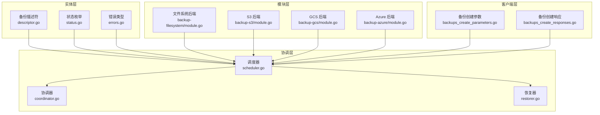
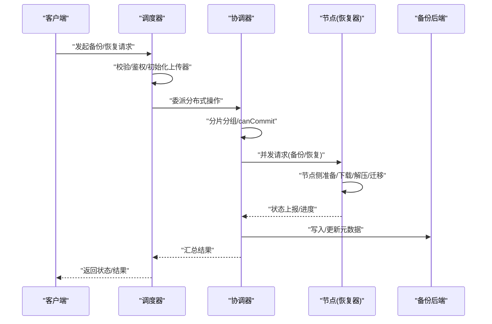
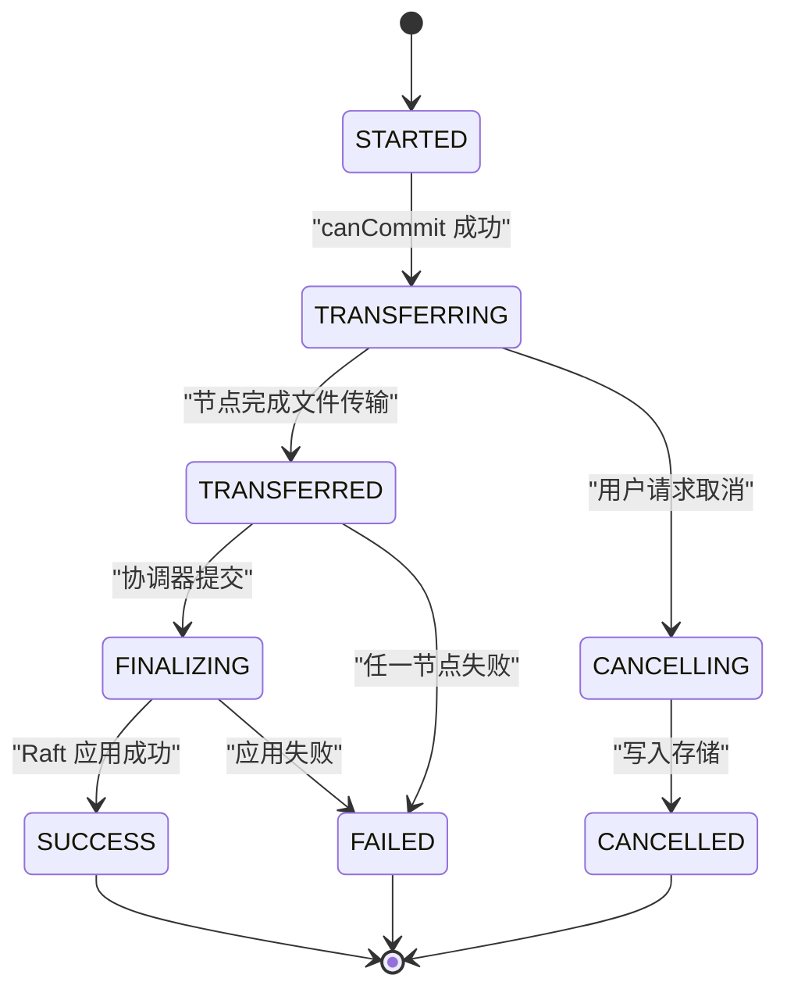
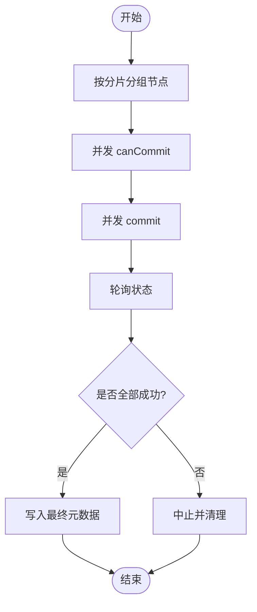
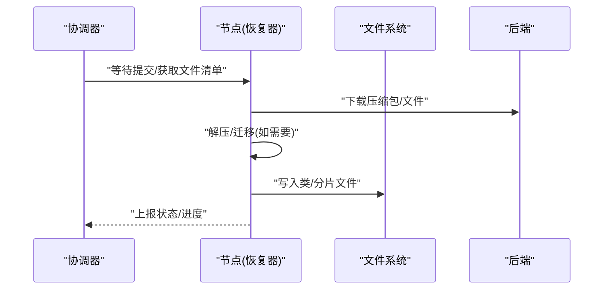
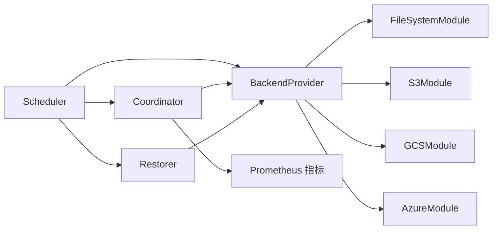

# 备份策略与最佳实践

<cite>
**本文引用的文件**
- [entities/backup/descriptor.go](file://entities/backup/descriptor.go)
- [entities/backup/status.go](file://entities/backup/status.go)
- [entities/backup/errors.go](file://entities/backup/errors.go)
- [client/backups/backups_create_parameters.go](file://client/backups/backups_create_parameters.go)
- [client/backups/backups_create_responses.go](file://client/backups/backups_create_responses.go)
- [modules/backup-filesystem/module.go](file://modules/backup-filesystem/module.go)
- [modules/backup-s3/module.go](file://modules/backup-s3/module.go)
- [modules/backup-gcs/module.go](file://modules/backup-gcs/module.go)
- [modules/backup-azure/module.go](file://modules/backup-azure/module.go)
- [usecases/backup/coordinator.go](file://usecases/backup/coordinator.go)
- [usecases/backup/scheduler.go](file://usecases/backup/scheduler.go)
- [usecases/backup/restorer.go](file://usecases/backup/restorer.go)
- [usecases/monitoring/prometheus.go](file://usecases/monitoring/prometheus.go)
</cite>

## 目录
1. [简介](#简介)
2. [项目结构](#项目结构)
3. [核心组件](#核心组件)
4. [架构总览](#架构总览)
5. [详细组件分析](#详细组件分析)
6. [依赖关系分析](#依赖关系分析)
7. [性能考量](#性能考量)
8. [故障排查指南](#故障排查指南)
9. [结论](#结论)
10. [附录](#附录)

## 简介
本文件面向系统管理员与运维工程师，提供 Weaviate 的备份策略与最佳实践指南。内容涵盖全量备份与增量备份的实现原理与适用场景、备份调度与自动化流程、监控与告警机制、备份数据的压缩与完整性校验、备份存储的多层架构与冗余策略、灾难恢复方案、不同规模数据的备份策略与成本控制、备份测试验证与恢复演练流程，以及备份治理与合规性建议。

## 项目结构
Weaviate 的备份能力由“模型定义（实体）+ 后端适配（模块）+ 协调器（usecases）+ 客户端接口（client）”四层构成：
- 实体层：定义备份元数据结构、状态枚举与错误类型，确保跨版本兼容与一致性。
- 模块层：提供多种后端（本地文件系统、S3、GCS、Azure）的备份实现。
- 协调层：分布式备份/恢复编排、状态管理、超时与重试、取消与中止。
- 客户端层：REST 接口参数与响应定义，便于外部系统集成与自动化。



图表来源
- [entities/backup/descriptor.go](file://entities/backup/descriptor.go#L317-L339)
- [entities/backup/status.go](file://entities/backup/status.go#L14-L35)
- [modules/backup-filesystem/module.go](file://modules/backup-filesystem/module.go#L30-L126)
- [modules/backup-s3/module.go](file://modules/backup-s3/module.go#L25-L100)
- [modules/backup-gcs/module.go](file://modules/backup-gcs/module.go#L24-L103)
- [modules/backup-azure/module.go](file://modules/backup-azure/module.go#L24-L103)
- [usecases/backup/scheduler.go](file://usecases/backup/scheduler.go#L47-L83)
- [usecases/backup/coordinator.go](file://usecases/backup/coordinator.go#L78-L136)
- [usecases/backup/restorer.go](file://usecases/backup/restorer.go#L34-L63)
- [client/backups/backups_create_parameters.go](file://client/backups/backups_create_parameters.go#L75-L92)
- [client/backups/backups_create_responses.go](file://client/backups/backups_create_responses.go#L29-L70)

章节来源
- [entities/backup/descriptor.go](file://entities/backup/descriptor.go#L1-L492)
- [entities/backup/status.go](file://entities/backup/status.go#L1-L36)
- [entities/backup/errors.go](file://entities/backup/errors.go#L1-L71)
- [modules/backup-filesystem/module.go](file://modules/backup-filesystem/module.go#L1-L134)
- [modules/backup-s3/module.go](file://modules/backup-s3/module.go#L1-L108)
- [modules/backup-gcs/module.go](file://modules/backup-gcs/module.go#L1-L111)
- [modules/backup-azure/module.go](file://modules/backup-azure/module.go#L1-L111)
- [usecases/backup/scheduler.go](file://usecases/backup/scheduler.go#L1-L715)
- [usecases/backup/coordinator.go](file://usecases/backup/coordinator.go#L1-L846)
- [usecases/backup/restorer.go](file://usecases/backup/restorer.go#L1-L348)
- [client/backups/backups_create_parameters.go](file://client/backups/backups_create_parameters.go#L1-L187)
- [client/backups/backups_create_responses.go](file://client/backups/backups_create_responses.go#L1-L399)

## 核心组件
- 备份描述符与状态
  - 分布式备份描述符与节点描述符用于记录备份范围、状态、错误、压缩类型与预压缩大小等信息，支持跨节点聚合统计与回放。
  - 状态枚举覆盖 STARTED、TRANSFERRING、TRANSFERRED、FINALIZING、SUCCESS、CANCELLING、CANCELLED、FAILED，保证分布式一致性。
- 后端模块
  - 文件系统、S3、GCS、Azure 四种后端均实现统一的 BackupBackend 接口，支持列出备份、读取元数据、返回 HomeDir 等能力。
- 协调器与调度器
  - 调度器负责请求校验、鉴权、初始化上传器、委派协调器执行；协调器负责分片分组、canCommit/commit/poll、聚合状态、写入最终元数据。
- 恢复器
  - 负责节点侧的文件下载、解压、迁移（旧版本目录结构）、类级恢复与 Raft 最终应用。
- 客户端接口
  - 提供备份创建的参数结构与响应结构，包括状态码映射与错误载荷。

章节来源
- [entities/backup/descriptor.go](file://entities/backup/descriptor.go#L28-L50)
- [entities/backup/status.go](file://entities/backup/status.go#L16-L25)
- [modules/backup-filesystem/module.go](file://modules/backup-filesystem/module.go#L75-L126)
- [modules/backup-s3/module.go](file://modules/backup-s3/module.go#L70-L100)
- [modules/backup-gcs/module.go](file://modules/backup-gcs/module.go#L74-L103)
- [modules/backup-azure/module.go](file://modules/backup-azure/module.go#L74-L103)
- [usecases/backup/scheduler.go](file://usecases/backup/scheduler.go#L47-L83)
- [usecases/backup/coordinator.go](file://usecases/backup/coordinator.go#L78-L136)
- [usecases/backup/restorer.go](file://usecases/backup/restorer.go#L34-L63)
- [client/backups/backups_create_parameters.go](file://client/backups/backups_create_parameters.go#L75-L92)
- [client/backups/backups_create_responses.go](file://client/backups/backups_create_responses.go#L29-L70)

## 架构总览
下图展示从客户端到后端的完整备份/恢复路径，强调分布式协调、状态持久化与可观测性。



图表来源
- [usecases/backup/scheduler.go](file://usecases/backup/scheduler.go#L123-L170)
- [usecases/backup/coordinator.go](file://usecases/backup/coordinator.go#L161-L234)
- [usecases/backup/restorer.go](file://usecases/backup/restorer.go#L65-L145)
- [modules/backup-filesystem/module.go](file://modules/backup-filesystem/module.go#L83-L116)

章节来源
- [usecases/backup/scheduler.go](file://usecases/backup/scheduler.go#L123-L232)
- [usecases/backup/coordinator.go](file://usecases/backup/coordinator.go#L161-L378)
- [usecases/backup/restorer.go](file://usecases/backup/restorer.go#L65-L204)

## 详细组件分析

### 备份描述符与状态机
- 描述符
  - 分布式备份描述符包含开始/完成时间、备份 ID、节点映射、版本、压缩类型、预压缩字节数等字段，并提供过滤、包含/排除类、节点名映射等工具方法。
  - 节点描述符记录单节点参与的类列表、状态、错误与预压缩大小。
  - 类/分片描述符记录分片文件清单、计数器与版本文件路径等，支持清理临时字段以节省空间。
- 状态机
  - 支持 STARTED → TRANSFERRING → TRANSFERRED/FINALIZING → SUCCESS 或 CANCELLED/FAILED 的完整生命周期。
  - 取消在不同阶段有不同语义：恢复 Finalizing 阶段不可取消；备份/恢复的 TRANSFERRING/STARTED 阶段可被外部声明 CANCELLING 并写入存储。



图表来源
- [entities/backup/status.go](file://entities/backup/status.go#L16-L25)
- [usecases/backup/coordinator.go](file://usecases/backup/coordinator.go#L547-L683)
- [usecases/backup/scheduler.go](file://usecases/backup/scheduler.go#L324-L419)

章节来源
- [entities/backup/descriptor.go](file://entities/backup/descriptor.go#L28-L91)
- [entities/backup/status.go](file://entities/backup/status.go#L16-L25)
- [usecases/backup/coordinator.go](file://usecases/backup/coordinator.go#L547-L683)
- [usecases/backup/scheduler.go](file://usecases/backup/scheduler.go#L324-L419)

### 后端模块与存储架构
- 文件系统后端
  - 通过环境变量指定备份根目录，遍历备份目录读取全局元数据文件，返回分布式备份描述符列表。
- S3/GCS/Azure 后端
  - 通过环境变量配置 Endpoint/Bucket/Path/SSL 等参数，初始化对应客户端，提供与文件系统后端一致的接口能力。
- 存储元数据
  - 全局备份元数据文件与节点级备份元数据文件分别用于协调器与节点侧的状态持久化与回放。

```mermaid
classDiagram
class BackupBackend {
<<interface>>
+Name() string
+IsExternal() bool
+AltNames() []string
+Init(ctx, params) error
+HomeDir(id, bucket, path) string
+AllBackups(ctx) []*DistributedBackupDescriptor
+MetaInfo() map[string]interface{}
}
class FileSystemModule {
-logger
-dataPath
-backupsPath
+Name() string
+Init(ctx, params) error
+HomeDir(...)
+AllBackups(ctx)
+MetaInfo()
}
class S3Module {
-logger
-s3Client
-dataPath
-bucket
-path
+Name() string
+Init(ctx, params) error
+MetaInfo()
}
class GCSModule {
-logger
-gcsClient
-dataPath
+Name() string
+Init(ctx, params) error
+MetaInfo()
}
class AzureModule {
-logger
-azureClient
-dataPath
+Name() string
+Init(ctx, params) error
+MetaInfo()
}
BackupBackend <|.. FileSystemModule
BackupBackend <|.. S3Module
BackupBackend <|.. GCSModule
BackupBackend <|.. AzureModule
```

图表来源
- [modules/backup-filesystem/module.go](file://modules/backup-filesystem/module.go#L30-L126)
- [modules/backup-s3/module.go](file://modules/backup-s3/module.go#L25-L100)
- [modules/backup-gcs/module.go](file://modules/backup-gcs/module.go#L24-L103)
- [modules/backup-azure/module.go](file://modules/backup-azure/module.go#L24-L103)

章节来源
- [modules/backup-filesystem/module.go](file://modules/backup-filesystem/module.go#L75-L126)
- [modules/backup-s3/module.go](file://modules/backup-s3/module.go#L70-L100)
- [modules/backup-gcs/module.go](file://modules/backup-gcs/module.go#L74-L103)
- [modules/backup-azure/module.go](file://modules/backup-azure/module.go#L74-L103)

### 协调器与分布式编排
- 分片分组与节点映射
  - 将类按分片归属节点进行分组，支持节点映射以适配集群拓扑变化。
- canCommit/commit/poll
  - 并发向各节点发送 canCommit 请求，收集节点主机名与超时；随后并发 commit 并轮询状态，容忍部分失败或外部取消。
- 元数据持久化
  - 在关键阶段写入全局备份/恢复元数据文件，确保跨节点一致性与可恢复性。



图表来源
- [usecases/backup/coordinator.go](file://usecases/backup/coordinator.go#L470-L545)
- [usecases/backup/coordinator.go](file://usecases/backup/coordinator.go#L547-L683)

章节来源
- [usecases/backup/coordinator.go](file://usecases/backup/coordinator.go#L161-L234)
- [usecases/backup/coordinator.go](file://usecases/backup/coordinator.go#L470-L683)

### 恢复器与文件写入
- 节点侧恢复流程
  - 等待协调器提交、下载/解压文件、必要时进行目录结构迁移（旧版本到新层级结构）、逐类写入并记录状态。
- 压缩与 CPU 百分比
  - 根据备份版本选择压缩类型（gzip/zstd/none），支持 CPU 百分比配置以平衡吞吐与资源占用。



图表来源
- [usecases/backup/restorer.go](file://usecases/backup/restorer.go#L65-L145)
- [usecases/backup/restorer.go](file://usecases/backup/restorer.go#L147-L204)

章节来源
- [usecases/backup/restorer.go](file://usecases/backup/restorer.go#L65-L204)

### 客户端接口与状态查询
- 参数与响应
  - 备份创建参数包含后端类型、备份 ID、包含/排除类列表等；响应包含状态码与错误载荷，便于自动化脚本处理。
- 状态查询
  - 提供备份与恢复状态查询接口，返回状态、开始/完成时间、大小等信息。

章节来源
- [client/backups/backups_create_parameters.go](file://client/backups/backups_create_parameters.go#L75-L92)
- [client/backups/backups_create_responses.go](file://client/backups/backups_create_responses.go#L29-L70)
- [usecases/backup/scheduler.go](file://usecases/backup/scheduler.go#L234-L270)

## 依赖关系分析
- 组件耦合
  - 调度器依赖授权器、协调器、后端提供者；协调器依赖选择器、节点解析器、后端提供者；恢复器依赖源数据提供者与后端。
- 外部依赖
  - Prometheus 指标用于观测备份/恢复耗时、阶段耗时与数据传输量；日志用于追踪分布式状态变更。
- 循环依赖
  - 未发现直接循环依赖；模块通过接口解耦，避免编译期环。



图表来源
- [usecases/backup/scheduler.go](file://usecases/backup/scheduler.go#L47-L83)
- [usecases/backup/coordinator.go](file://usecases/backup/coordinator.go#L93-L136)
- [usecases/backup/restorer.go](file://usecases/backup/restorer.go#L34-L63)
- [usecases/monitoring/prometheus.go](file://usecases/monitoring/prometheus.go#L709-L736)

章节来源
- [usecases/backup/scheduler.go](file://usecases/backup/scheduler.go#L47-L83)
- [usecases/backup/coordinator.go](file://usecases/backup/coordinator.go#L93-L136)
- [usecases/backup/restorer.go](file://usecases/backup/restorer.go#L34-L63)
- [usecases/monitoring/prometheus.go](file://usecases/monitoring/prometheus.go#L709-L736)

## 性能考量
- 压缩与传输
  - 支持 gzip/zstd/none 压缩类型，结合 CPU 百分比配置可平衡压缩比与资源占用；传输阶段指标可用于评估带宽与延迟瓶颈。
- 并发与限速
  - 协调器对节点请求设置最大并发连接数限制，避免过度竞争；轮询周期与超时参数可调优。
- 指标观测
  - 提供备份/恢复阶段耗时、数据传输总量等指标，便于定位性能问题与容量规划。

章节来源
- [entities/backup/descriptor.go](file://entities/backup/descriptor.go#L317-L323)
- [usecases/backup/coordinator.go](file://usecases/backup/coordinator.go#L48-L55)
- [usecases/monitoring/prometheus.go](file://usecases/monitoring/prometheus.go#L709-L736)

## 故障排查指南
- 常见错误类型
  - 未处理错误、未找到、上下文过期、内部错误；取消状态可通过元数据判断。
- 状态检查
  - 使用备份/恢复状态接口确认当前状态与错误原因；检查元数据文件是否存在与版本兼容性。
- 取消与中止
  - 恢复 Finalizing 阶段不可取消；备份/恢复的 TRANSFERRING/STARTED 阶段可通过写入 CANCELLING/CANCELLED 状态终止。
- 日志与指标
  - 关注协调器与恢复器的日志输出，结合 Prometheus 指标定位异常节点与传输瓶颈。

章节来源
- [entities/backup/errors.go](file://entities/backup/errors.go#L14-L71)
- [usecases/backup/scheduler.go](file://usecases/backup/scheduler.go#L272-L419)
- [usecases/backup/coordinator.go](file://usecases/backup/coordinator.go#L547-L683)
- [usecases/backup/restorer.go](file://usecases/backup/restorer.go#L82-L93)

## 结论
Weaviate 的备份体系通过统一的描述符与状态机、多后端适配、分布式协调与可观测性指标，实现了高可靠、可扩展且可审计的备份与恢复能力。结合本文提供的策略与最佳实践，可在不同规模与合规要求下构建稳健的备份治理方案。

## 附录

### 备份策略与最佳实践
- 全量备份与增量备份
  - 全量备份：适合首次备份、灾备演练与跨版本迁移；建议在业务低峰期执行，启用压缩与进度监控。
  - 增量备份：当前仓库未提供原生增量实现，建议通过外部工具（如快照/镜像）配合 Weaviate 的全量备份进行组合使用。
- 调度与自动化
  - 使用调度器的备份/恢复接口与状态查询接口，结合定时任务或 CI/CD 流水线实现自动化；为不同租户/业务线配置独立备份 ID 与后端路径。
- 监控与告警
  - 基于 Prometheus 指标建立告警规则（如阶段耗时异常、传输速率骤降、取消率上升），并纳入统一监控面板。
- 数据安全与完整性
  - 后端模块支持外部存储（S3/GCS/Azure），建议开启传输加密与访问控制；通过元数据中的预压缩大小与状态字段进行完整性核验。
- 存储与冗余
  - 建议至少两套后端（本地+对象存储）或多区域部署，定期校验备份可用性；利用节点映射与包含/排除类策略实现灵活归档。
- 规模化与成本控制
  - 对大体量数据采用分批备份（按类/租户/时间窗口）与压缩策略；结合对象存储的生命周期策略降低长期存储备存成本。
- 测试验证与演练
  - 定期进行恢复演练，验证备份可用性与恢复时间目标（RTO/RPO）；记录演练结果并持续优化策略。
- 合规性
  - 建立备份治理流程（审批、保留、销毁）、访问审计与最小权限原则；确保备份元数据与日志满足合规要求。

章节来源
- [usecases/backup/scheduler.go](file://usecases/backup/scheduler.go#L481-L524)
- [usecases/backup/coordinator.go](file://usecases/backup/coordinator.go#L547-L683)
- [usecases/monitoring/prometheus.go](file://usecases/monitoring/prometheus.go#L709-L736)