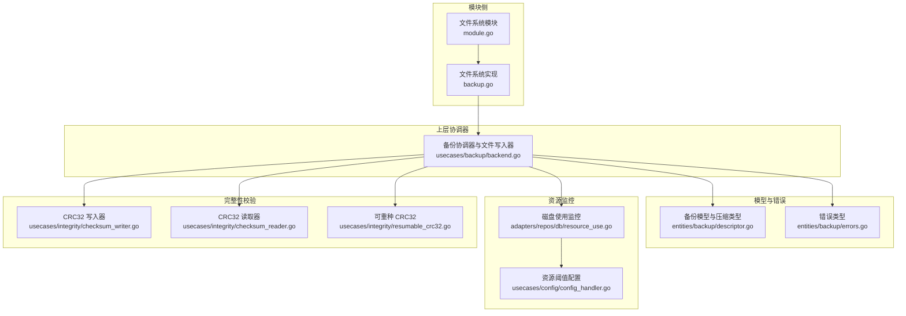
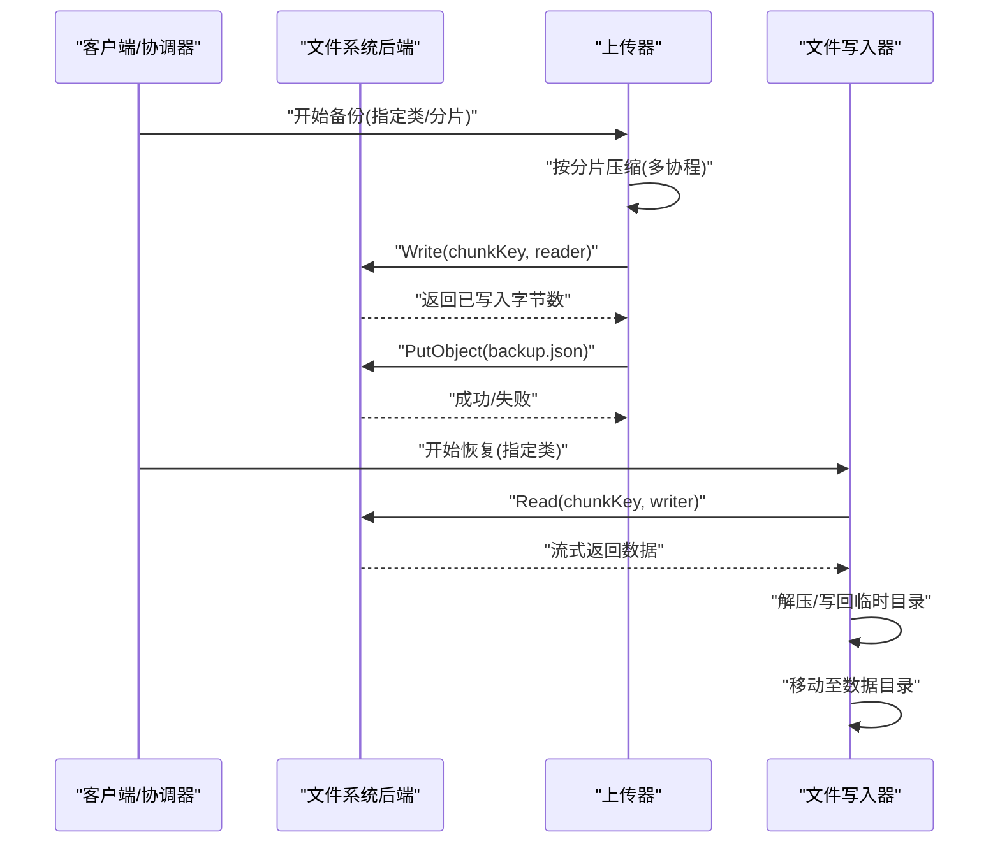
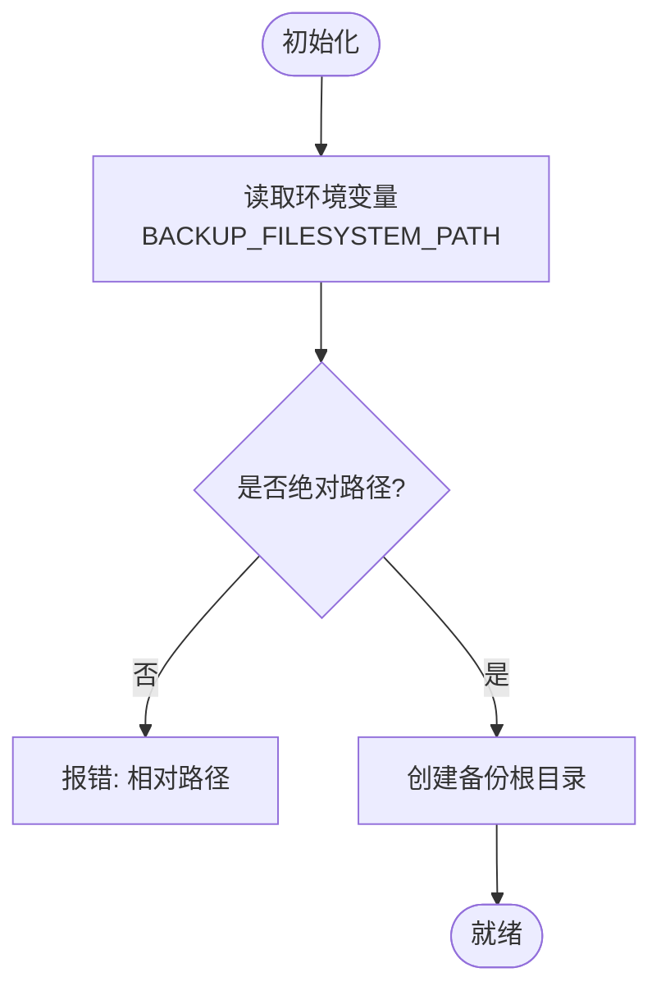
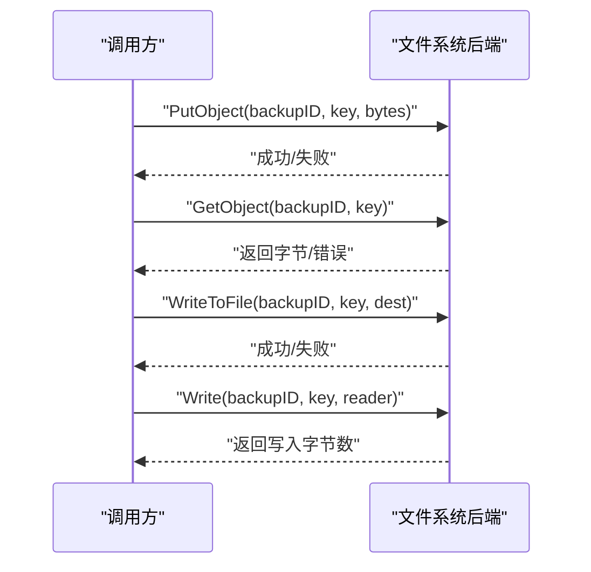
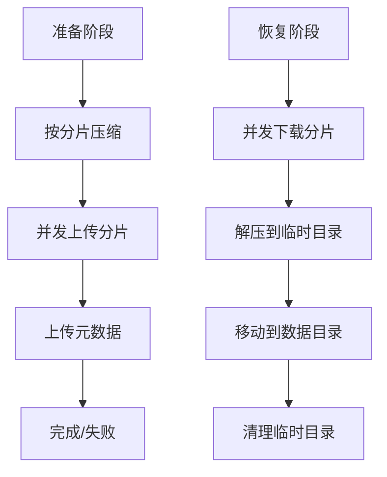
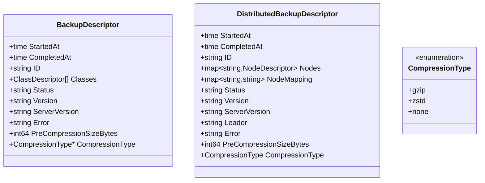
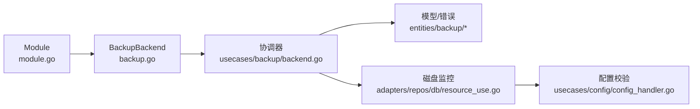

# 文件系统备份后端

<cite>
**本文引用的文件**
- [modules/backup-filesystem/module.go](file://modules/backup-filesystem/module.go)
- [modules/backup-filesystem/backup.go](file://modules/backup-filesystem/backup.go)
- [modules/backup-filesystem/backup_test.go](file://modules/backup-filesystem/backup_test.go)
- [test/modules/backup-filesystem/backup_backend_test.go](file://test/modules/backup-filesystem/backup_backend_test.go)
- [usecases/backup/backend.go](file://usecases/backup/backend.go)
- [entities/backup/descriptor.go](file://entities/backup/descriptor.go)
- [entities/backup/errors.go](file://entities/backup/errors.go)
- [adapters/repos/db/resource_use.go](file://adapters/repos/db/resource_use.go)
- [usecases/integrity/checksum_writer.go](file://usecases/integrity/checksum_writer.go)
- [usecases/integrity/checksum_reader.go](file://usecases/integrity/checksum_reader.go)
- [usecases/integrity/resumable_crc32.go](file://usecases/integrity/resumable_crc32.go)
- [usecases/config/config_handler.go](file://usecases/config/config_handler.go)
</cite>

## 目录
1. [简介](#简介)
2. [项目结构](#项目结构)
3. [核心组件](#核心组件)
4. [架构总览](#架构总览)
5. [详细组件分析](#详细组件分析)
6. [依赖关系分析](#依赖关系分析)
7. [性能考量](#性能考量)
8. [故障排查指南](#故障排查指南)
9. [结论](#结论)
10. [附录](#附录)

## 简介
本文件系统备份后端模块为 Weaviate 提供基于本地文件系统的备份与恢复能力。其设计目标是在本地或私有云环境中，通过简单、可靠且可审计的方式完成数据备份与恢复，支持按备份 ID 组织目录结构、按类分片的压缩打包、以及在恢复阶段直接从临时目录写回数据目录。

该模块不涉及网络存储协议（如 S3、GCS、Azure），也不对备份内容进行额外加密；但提供了完整的元数据管理、文件读写、目录结构组织与错误类型定义，并与上层备份协调器配合完成分片压缩、并发上传/下载、以及资源使用监控与告警。

## 项目结构
围绕文件系统备份后端的关键文件与职责如下：
- 模块入口与初始化：负责从环境变量加载备份根路径，校验绝对路径并创建目录，暴露备份后端接口。
- 后端实现：提供对象存取、文件复制、源数据路径查询等能力。
- 上层协调器：负责分片压缩、并发上传/下载、元数据写入、状态管理与度量上报。
- 备份模型与错误类型：定义备份描述、分布式备份描述、压缩类型及错误类型。
- 资源监控：提供磁盘使用率监控与只读阈值控制，用于备份/恢复过程中的资源预警。
- 完整性校验：提供 CRC32 校验写入器/读取器，支持可重种的校验计算，便于数据一致性验证。

**图表来源**
- [modules/backup-filesystem/module.go](file://modules/backup-filesystem/module.go#L62-L73)
- [modules/backup-filesystem/backup.go](file://modules/backup-filesystem/backup.go#L100-L126)
- [usecases/backup/backend.go](file://usecases/backup/backend.go#L175-L200)
- [entities/backup/descriptor.go](file://entities/backup/descriptor.go#L317-L323)
- [adapters/repos/db/resource_use.go](file://adapters/repos/db/resource_use.go#L88-L105)
- [usecases/config/config_handler.go](file://usecases/config/config_handler.go#L509-L519)
- [usecases/integrity/checksum_writer.go](file://usecases/integrity/checksum_writer.go#L30-L48)
- [usecases/integrity/checksum_reader.go](file://usecases/integrity/checksum_reader.go#L29-L40)
- [usecases/integrity/resumable_crc32.go](file://usecases/integrity/resumable_crc32.go#L23-L30)

**章节来源**
- [modules/backup-filesystem/module.go](file://modules/backup-filesystem/module.go#L62-L73)
- [modules/backup-filesystem/backup.go](file://modules/backup-filesystem/backup.go#L100-L126)
- [usecases/backup/backend.go](file://usecases/backup/backend.go#L175-L200)
- [entities/backup/descriptor.go](file://entities/backup/descriptor.go#L317-L323)
- [adapters/repos/db/resource_use.go](file://adapters/repos/db/resource_use.go#L88-L105)
- [usecases/config/config_handler.go](file://usecases/config/config_handler.go#L509-L519)
- [usecases/integrity/checksum_writer.go](file://usecases/integrity/checksum_writer.go#L30-L48)
- [usecases/integrity/checksum_reader.go](file://usecases/integrity/checksum_reader.go#L29-L40)
- [usecases/integrity/resumable_crc32.go](file://usecases/integrity/resumable_crc32.go#L23-L30)

## 核心组件
- 文件系统模块（Module）
  - 初始化：从环境变量加载备份根路径，校验为绝对路径并创建目录。
  - 目录结构：以备份 ID 作为子目录，文件键作为相对路径。
  - 元信息：提供备份根路径查询与所有备份列表扫描。
- 文件系统实现（BackupBackend）
  - 对象存取：PutObject/GetObject 支持字节级对象读写。
  - 文件复制：WriteToFile 将备份文件复制到目标路径。
  - 并发写入：Write 接收 io.ReadCloser 流式写入。
  - 路径解析：支持覆盖路径 overridePath 与覆盖桶 overrideBucket（文件系统忽略桶）。
  - 度量上报：上传/下载时更新 Prometheus 指标。
- 上层协调器（uploader/fileWriter）
  - 分片压缩：按类/分片生成压缩包，支持多分片并发。
  - 并发上传/下载：根据 CPU 百分比动态调整工作池大小。
  - 元数据管理：上传/下载 backup.json 与全局 backup_config.json。
  - 恢复流程：将临时目录中的文件写回数据目录。
- 模型与错误
  - 备份描述：包含类、分片、压缩类型、预压缩大小等。
  - 错误类型：未找到、上下文过期、内部错误、不可处理等。
- 资源监控
  - 磁盘使用率监控：定期扫描磁盘使用情况，超过阈值发出告警或设置只读。
  - 配置校验：磁盘/内存阈值必须在 0~100 范围内。

**章节来源**
- [modules/backup-filesystem/module.go](file://modules/backup-filesystem/module.go#L62-L126)
- [modules/backup-filesystem/backup.go](file://modules/backup-filesystem/backup.go#L100-L250)
- [usecases/backup/backend.go](file://usecases/backup/backend.go#L175-L504)
- [entities/backup/descriptor.go](file://entities/backup/descriptor.go#L317-L339)
- [entities/backup/errors.go](file://entities/backup/errors.go#L14-L70)
- [adapters/repos/db/resource_use.go](file://adapters/repos/db/resource_use.go#L88-L139)
- [usecases/config/config_handler.go](file://usecases/config/config_handler.go#L509-L519)

## 架构总览
文件系统备份后端的整体交互流程如下：

**图表来源**
- [usecases/backup/backend.go](file://usecases/backup/backend.go#L208-L311)
- [usecases/backup/backend.go](file://usecases/backup/backend.go#L531-L633)
- [modules/backup-filesystem/backup.go](file://modules/backup-filesystem/backup.go#L155-L185)
- [modules/backup-filesystem/backup.go](file://modules/backup-filesystem/backup.go#L187-L219)

## 详细组件分析

### 文件系统模块与实现
- 初始化与路径校验
  - 从环境变量加载备份根路径，要求为绝对路径；否则报错。
  - 若目录不存在则创建，确保后续写入可用。
- 目录结构与键名
  - 备份根目录下以备份 ID 命名子目录。
  - 文件键为相对路径，最终落盘为 {backupsRoot}/{backupID}/{key}。
- 覆盖参数
  - 支持 overridePath 覆盖整个备份根路径，overrideBucket 在文件系统中被忽略。
- 元信息与枚举
  - 提供备份根路径查询与所有备份扫描能力。
  - 压缩类型枚举包括 gzip/zstd/none。

**图表来源**
- [modules/backup-filesystem/module.go](file://modules/backup-filesystem/module.go#L67-L73)
- [modules/backup-filesystem/module.go](file://modules/backup-filesystem/module.go#L225-L239)
- [modules/backup-filesystem/backup_test.go](file://modules/backup-filesystem/backup_test.go#L29-L43)

**章节来源**
- [modules/backup-filesystem/module.go](file://modules/backup-filesystem/module.go#L62-L126)
- [modules/backup-filesystem/backup_test.go](file://modules/backup-filesystem/backup_test.go#L29-L53)

### 备份对象存取与文件复制
- PutObject/GetObject
  - PutObject 将字节写入 {backupID}/{key}，自动创建目录。
  - GetObject 读取指定文件，若不存在返回“未找到”错误。
- WriteToFile
  - 将备份文件复制到目标路径，用于恢复阶段写回数据目录。
- Write(流式)
  - 接收 io.ReadCloser，边读边写，适合大文件或分片压缩输出。
- 指标上报
  - 上传/下载时更新 Prometheus 指标，便于观测数据传输量。

**图表来源**
- [modules/backup-filesystem/backup.go](file://modules/backup-filesystem/backup.go#L100-L126)
- [modules/backup-filesystem/backup.go](file://modules/backup-filesystem/backup.go#L133-L153)
- [modules/backup-filesystem/backup.go](file://modules/backup-filesystem/backup.go#L155-L185)
- [modules/backup-filesystem/backup.go](file://modules/backup-filesystem/backup.go#L27-L51)

**章节来源**
- [modules/backup-filesystem/backup.go](file://modules/backup-filesystem/backup.go#L100-L250)

### 上层协调器：分片压缩、并发与元数据
- 分片压缩与并发
  - 按类/分片生成压缩包，支持多分片并发处理。
  - 根据 CPU 百分比动态调整工作池大小，避免过度占用。
- 元数据管理
  - 上传/下载 backup.json 与全局 backup_config.json。
  - 支持旧版本兼容读取。
- 恢复流程
  - 从临时目录解压并写回数据目录，完成后清理临时文件。

**图表来源**
- [usecases/backup/backend.go](file://usecases/backup/backend.go#L208-L311)
- [usecases/backup/backend.go](file://usecases/backup/backend.go#L531-L633)
- [usecases/backup/backend.go](file://usecases/backup/backend.go#L669-L679)

**章节来源**
- [usecases/backup/backend.go](file://usecases/backup/backend.go#L175-L504)
- [usecases/backup/backend.go](file://usecases/backup/backend.go#L531-L633)

### 备份模型与压缩类型
- 备份描述
  - 包含启动时间、完成时间、ID、类列表、状态、版本、服务版本、压缩类型等。
- 压缩类型
  - gzip、zstd、none 三种可选，新备份默认 gzip，旧版本兼容处理。
- 分布式备份描述
  - 节点映射、节点状态、错误信息、预压缩大小等。

**图表来源**
- [entities/backup/descriptor.go](file://entities/backup/descriptor.go#L326-L339)
- [entities/backup/descriptor.go](file://entities/backup/descriptor.go#L36-L50)
- [entities/backup/descriptor.go](file://entities/backup/descriptor.go#L317-L323)

**章节来源**
- [entities/backup/descriptor.go](file://entities/backup/descriptor.go#L317-L339)

### 错误类型与处理
- 常见错误
  - 未找到：访问不存在的对象。
  - 上下文过期：请求超时或取消。
  - 内部错误：IO 或系统错误。
  - 不可处理：业务状态冲突（如重复备份）。
- 使用建议
  - 在调用 GetObject/Read/WriteToFile 时捕获对应错误类型，区分重试与终止条件。

**章节来源**
- [entities/backup/errors.go](file://entities/backup/errors.go#L14-L70)

### 资源监控与磁盘空间预警
- 监控逻辑
  - 定期扫描磁盘使用率，超过阈值发出告警；达到只读阈值时将分片设为只读。
- 配置校验
  - 磁盘/内存阈值必须在 0~100 范围内，否则返回错误。
- 实践建议
  - 在备份/恢复前预留充足空间，避免触发只读保护导致操作中断。

**章节来源**
- [adapters/repos/db/resource_use.go](file://adapters/repos/db/resource_use.go#L88-L139)
- [usecases/config/config_handler.go](file://usecases/config/config_handler.go#L509-L519)

### 完整性校验（可选增强）
- 工具链
  - CRC32 写入器/读取器：在写入/读取过程中累计校验。
  - 可重种 CRC32：支持种子重置，便于分段校验。
- 应用场景
  - 在 PutObject/WriteToFile 前后分别计算校验，确保数据一致性。
  - 与上层协调器结合，可在恢复阶段进行二次校验。

**章节来源**
- [usecases/integrity/checksum_writer.go](file://usecases/integrity/checksum_writer.go#L30-L48)
- [usecases/integrity/checksum_reader.go](file://usecases/integrity/checksum_reader.go#L29-L40)
- [usecases/integrity/resumable_crc32.go](file://usecases/integrity/resumable_crc32.go#L23-L30)

## 依赖关系分析
- 模块与实现
  - Module 依赖环境变量与文件系统 API，实现 BackupBackend 接口。
- 协调器与后端
  - uploader/fileWriter 通过 BackupBackend 接口与后端交互，上传/下载分片与元数据。
- 模型与错误
  - 备份描述与错误类型由 entities 层提供，协调器在状态机与错误处理中使用。
- 资源监控
  - DB 层定期扫描磁盘使用率并与配置校验联动，影响只读状态。

**图表来源**
- [modules/backup-filesystem/module.go](file://modules/backup-filesystem/module.go#L62-L126)
- [modules/backup-filesystem/backup.go](file://modules/backup-filesystem/backup.go#L100-L250)
- [usecases/backup/backend.go](file://usecases/backup/backend.go#L175-L504)
- [entities/backup/descriptor.go](file://entities/backup/descriptor.go#L317-L339)
- [adapters/repos/db/resource_use.go](file://adapters/repos/db/resource_use.go#L88-L139)
- [usecases/config/config_handler.go](file://usecases/config/config_handler.go#L509-L519)

**章节来源**
- [modules/backup-filesystem/module.go](file://modules/backup-filesystem/module.go#L62-L126)
- [modules/backup-filesystem/backup.go](file://modules/backup-filesystem/backup.go#L100-L250)
- [usecases/backup/backend.go](file://usecases/backup/backend.go#L175-L504)

## 性能考量
- 并发与 CPU 占用
  - 通过 CPU 百分比动态调整工作池大小，避免备份/恢复过程过度占用系统资源。
- 分片与压缩
  - 按分片压缩，支持 gzip/zstd/none，可根据需求选择压缩级别与算法。
- I/O 优化
  - 使用流式写入/读取，减少内存占用；在恢复阶段先写入临时目录再移动，降低锁竞争。
- 指标监控
  - 上传/下载数据量指标可用于评估吞吐与瓶颈。

**章节来源**
- [usecases/backup/backend.go](file://usecases/backup/backend.go#L669-L679)
- [usecases/backup/backend.go](file://usecases/backup/backend.go#L447-L504)
- [modules/backup-filesystem/backup.go](file://modules/backup-filesystem/backup.go#L120-L123)
- [modules/backup-filesystem/backup.go](file://modules/backup-filesystem/backup.go#L179-L182)

## 故障排查指南
- 初始化失败
  - 症状：提示空路径或相对路径。
  - 处理：设置绝对路径到环境变量，并确保目录存在。
- 访问对象失败
  - 症状：返回“未找到”。
  - 处理：确认 backupID 与 key 是否正确，检查目录结构。
- 上下文过期
  - 症状：请求被取消或超时。
  - 处理：延长超时时间或检查网络/磁盘 I/O。
- 磁盘空间不足
  - 症状：触发只读保护或写入失败。
  - 处理：清理历史备份，扩容磁盘，或调整备份策略。
- 数据不一致
  - 建议：启用 CRC32 校验，在写入/读取前后对比校验值。

**章节来源**
- [modules/backup-filesystem/backup_test.go](file://modules/backup-filesystem/backup_test.go#L29-L43)
- [entities/backup/errors.go](file://entities/backup/errors.go#L41-L51)
- [adapters/repos/db/resource_use.go](file://adapters/repos/db/resource_use.go#L128-L139)
- [usecases/integrity/checksum_writer.go](file://usecases/integrity/checksum_writer.go#L65-L66)

## 结论
文件系统备份后端模块以简洁可靠的本地文件系统为基础，结合上层协调器的分片压缩与并发处理能力，实现了可审计、可扩展的备份与恢复方案。通过明确的目录结构、完善的错误类型与资源监控机制，能够在本地与私有云环境中稳定运行。建议在生产环境中配合磁盘空间预警、压缩策略与完整性校验，以进一步提升可靠性与可观测性。

## 附录

### 配置与环境变量
- BACKUP_FILESYSTEM_PATH：备份根目录（绝对路径）。
- 备份 ID：用于组织备份目录层级。
- 覆盖参数：overridePath 可覆盖备份根路径；overrideBucket 在文件系统中无效。

**章节来源**
- [modules/backup-filesystem/module.go](file://modules/backup-filesystem/module.go#L30-L34)
- [modules/backup-filesystem/module.go](file://modules/backup-filesystem/module.go#L75-L81)
- [modules/backup-filesystem/backup.go](file://modules/backup-filesystem/backup.go#L100-L103)

### 目录结构与文件命名
- 目录结构：{backupsRoot}/{backupID}/{key}
- 元数据文件：
  - 节点元数据：backup.json
  - 协调器元数据：backup_config.json
- 恢复临时目录：.backup.tmp/{className}

**章节来源**
- [usecases/backup/backend.go](file://usecases/backup/backend.go#L50-L57)
- [usecases/backup/backend.go](file://usecases/backup/backend.go#L546-L556)

### 权限与安全
- 权限管理
  - 模块通过 os.ModePerm 创建目录与文件，具体权限取决于运行用户与 umask。
  - 建议以最小权限运行服务进程，并在挂载点上设置合适的访问控制。
- 加密传输
  - 文件系统后端不内置加密；如需加密，请在挂载层（如加密文件系统）或外部工具中实现。
- 完整性验证
  - 可选使用 CRC32 校验，保障数据一致性。

**章节来源**
- [modules/backup-filesystem/backup.go](file://modules/backup-filesystem/backup.go#L112-L118)
- [modules/backup-filesystem/backup.go](file://modules/backup-filesystem/backup.go#L166-L173)
- [usecases/integrity/checksum_writer.go](file://usecases/integrity/checksum_writer.go#L30-L48)

### 存储容量规划与清理策略
- 规划建议
  - 预留至少备份总量的 20%~30% 空间余量，考虑压缩比与临时目录。
  - 定期清理过期备份，保留最近 N 个版本。
- 清理策略
  - 基于备份 ID 列表扫描，删除最旧的备份目录。
  - 恢复完成后清理 .backup.tmp 目录。

**章节来源**
- [modules/backup-filesystem/module.go](file://modules/backup-filesystem/module.go#L83-L116)
- [usecases/backup/backend.go](file://usecases/backup/backend.go#L589-L595)

### 备份保留周期与故障恢复
- 保留周期
  - 建议按天/周/月滚动保留，结合业务 SLA 设置保留窗口。
- 故障恢复
  - 从 backup_config.json 读取全局元数据，定位各节点备份。
  - 下载对应分片，解压到 .backup.tmp，再移动到数据目录。
  - 如遇只读状态，先调整阈值或释放空间后再恢复。

**章节来源**
- [usecases/backup/backend.go](file://usecases/backup/backend.go#L162-L172)
- [usecases/backup/backend.go](file://usecases/backup/backend.go#L586-L633)
- [adapters/repos/db/resource_use.go](file://adapters/repos/db/resource_use.go#L128-L139)