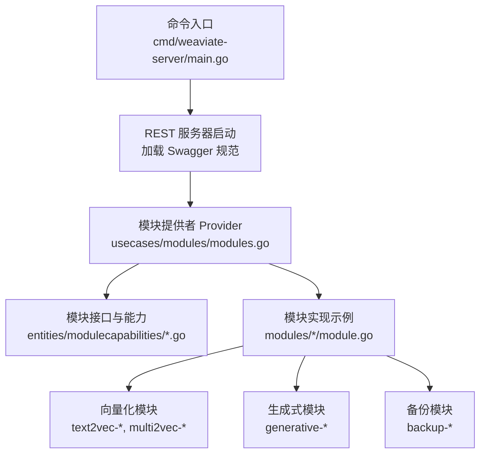
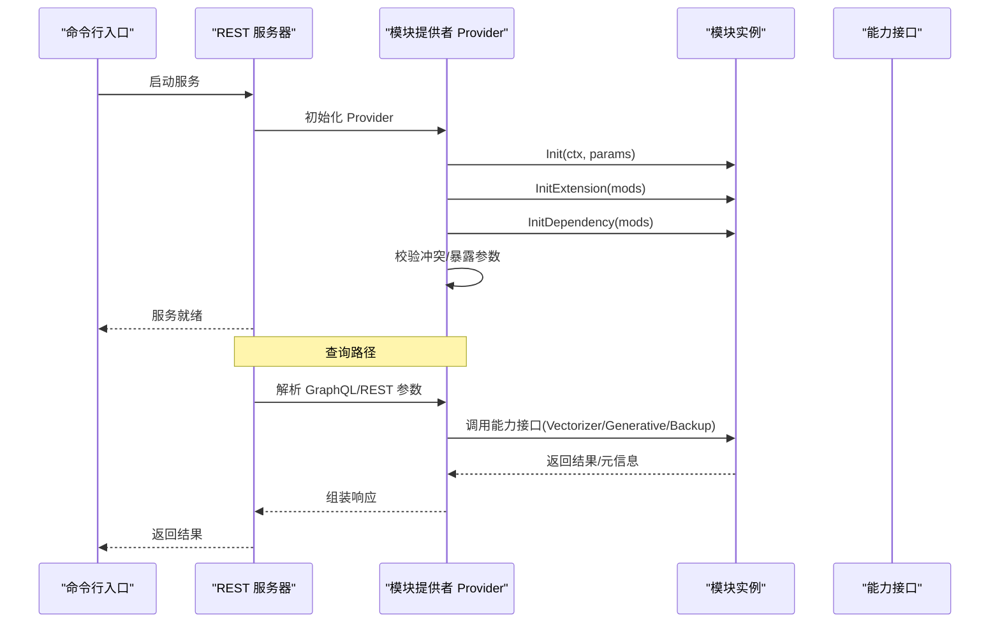
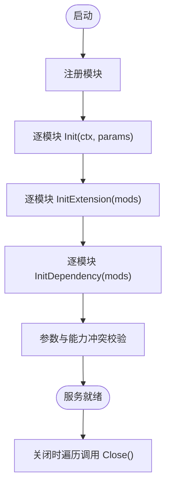
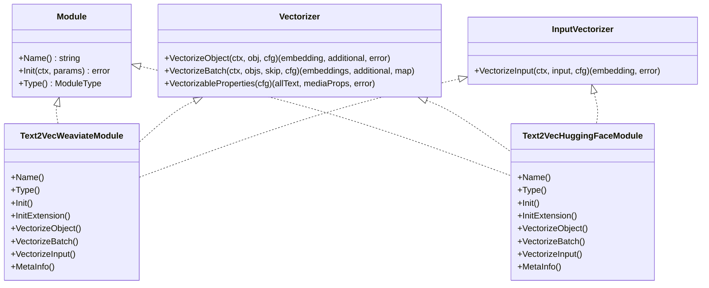
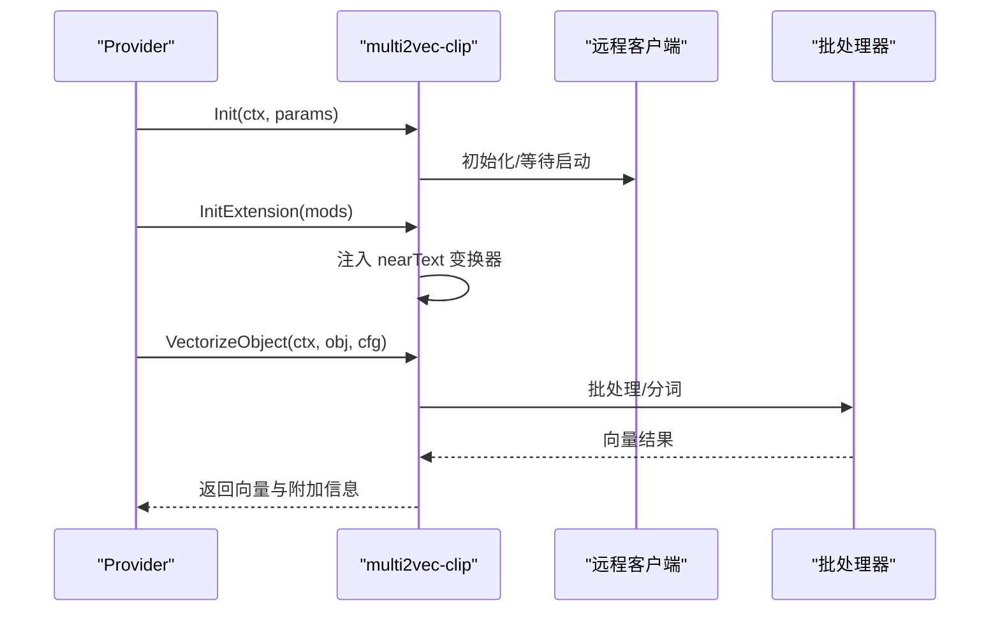
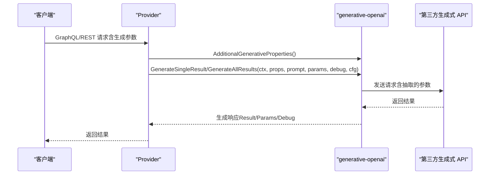
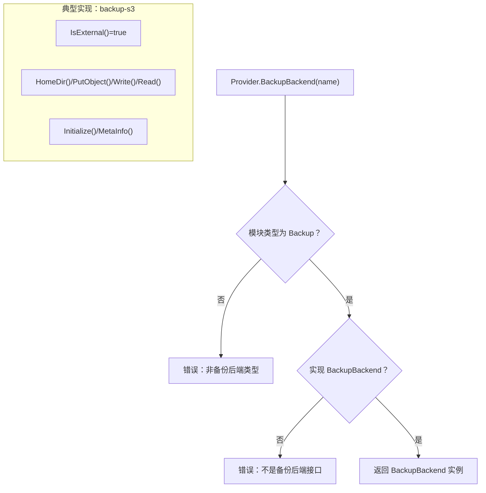
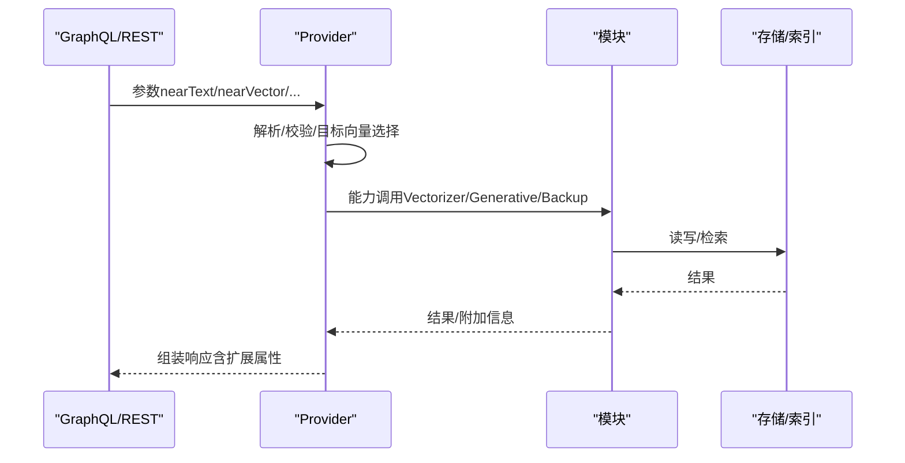
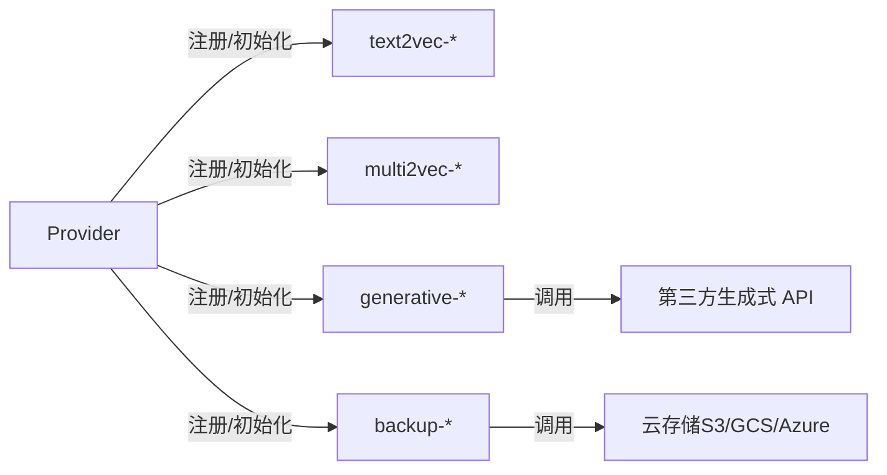

# 模块系统

<cite>
**本文引用的文件**
- [cmd/weaviate-server/main.go](file://cmd/weaviate-server/main.go)
- [entities/modulecapabilities/module.go](file://entities/modulecapabilities/module.go)
- [entities/modulecapabilities/vectorizer.go](file://entities/modulecapabilities/vectorizer.go)
- [entities/modulecapabilities/generative.go](file://entities/modulecapabilities/generative.go)
- [entities/modulecapabilities/backup.go](file://entities/modulecapabilities/backup.go)
- [entities/moduletools/init_params.go](file://entities/moduletools/init_params.go)
- [usecases/modules/modules.go](file://usecases/modules/modules.go)
- [modules/text2vec-weaviate/module.go](file://modules/text2vec-weaviate/module.go)
- [modules/text2vec-huggingface/module.go](file://modules/text2vec-huggingface/module.go)
- [modules/multi2vec-clip/module.go](file://modules/multi2vec-clip/module.go)
- [modules/generative-openai/module.go](file://modules/generative-openai/module.go)
- [modules/backup-s3/module.go](file://modules/backup-s3/module.go)
</cite>

## 目录
1. [引言](#引言)
2. [项目结构](#项目结构)
3. [核心组件](#核心组件)
4. [架构总览](#架构总览)
5. [详细组件分析](#详细组件分析)
6. [依赖分析](#依赖分析)
7. [性能考虑](#性能考虑)
8. [故障排查指南](#故障排查指南)
9. [结论](#结论)
10. [附录](#附录)

## 引言
本文件面向模块开发者与系统集成者，系统性梳理 Weaviate 的模块系统：模块接口设计、生命周期管理、依赖注入与配置系统、向量化（文本/图像/多模态）、生成式能力（文本/图像/多模态）、备份与恢复模块（云存储集成）以及模块间协作与数据流。文档同时提供自定义模块开发指南、性能优化建议与最佳实践。

## 项目结构
Weaviate 将模块能力抽象在统一接口中，并通过 usecases/modules 提供注册、初始化、参数解析与扩展等通用编排；具体模块以独立包形式实现各自能力，如 text2vec-*、multi2vec-*、generative-*、backup-* 等。

图表来源
- [cmd/weaviate-server/main.go](file://cmd/weaviate-server/main.go#L30-L66)
- [usecases/modules/modules.go](file://usecases/modules/modules.go#L138-L179)
- [entities/modulecapabilities/module.go](file://entities/modulecapabilities/module.go#L45-L71)

章节来源
- [cmd/weaviate-server/main.go](file://cmd/weaviate-server/main.go#L30-L66)
- [usecases/modules/modules.go](file://usecases/modules/modules.go#L138-L179)

## 核心组件
- 模块接口与类型
  - Module 接口：名称、初始化、类型声明
  - 可选能力接口：ModuleWithClose、ModuleWithHTTPHandlers、ModuleExtension、ModuleDependency、ModuleWithUsageService
  - 模块类型枚举：向量化（Text2Vec、Img2Vec、Multi2Vec、Text2ManyVec、Ref2Vec、Text2Multivec、Multi2Multivec）、生成式（Text2TextGenerative）、备份（Backup）、离线（Offload）、使用统计（Usage）等
- 能力接口族
  - 向量化：Vectorizer、ReferenceVectorizer、InputVectorizer
  - 生成式：GenerativeClient、AdditionalGenerativeProperties
  - 备份：BackupBackend
- 初始化参数
  - ModuleInitParams：存储提供者、应用状态、日志、配置、指标注册器
- 模块提供者 Provider
  - 注册、按类型过滤、初始化顺序（Init → InitExtension → InitDependency）、校验冲突、暴露 GraphQL/REST 扩展点、备份后端选择等

章节来源
- [entities/modulecapabilities/module.go](file://entities/modulecapabilities/module.go#L24-L90)
- [entities/modulecapabilities/vectorizer.go](file://entities/modulecapabilities/vectorizer.go#L25-L54)
- [entities/modulecapabilities/generative.go](file://entities/modulecapabilities/generative.go#L48-L73)
- [entities/modulecapabilities/backup.go](file://entities/modulecapabilities/backup.go#L21-L55)
- [entities/moduletools/init_params.go](file://entities/moduletools/init_params.go#L21-L62)
- [usecases/modules/modules.go](file://usecases/modules/modules.go#L138-L179)

## 架构总览
Weaviate 的模块系统采用“接口抽象 + Provider 编排”的架构。模块通过统一接口声明自身能力，Provider 在启动阶段完成初始化、扩展点注册与参数校验；查询时由 Provider 将 GraphQL/REST 请求映射到具体模块，执行向量化或生成式处理，并返回扩展属性。

图表来源
- [cmd/weaviate-server/main.go](file://cmd/weaviate-server/main.go#L30-L66)
- [usecases/modules/modules.go](file://usecases/modules/modules.go#L138-L179)

## 详细组件分析

### 模块生命周期与初始化流程
- 初始化顺序
  - 先逐个调用模块 Init(ctx, params)，再依次调用 InitExtension，最后调用 InitDependency
  - 初始化完成后进行参数与能力冲突校验，必要时发出警告（如存在多个向量空间）
- 关闭流程
  - Provider.Close 遍历已注册模块，对实现 ModuleWithClose 的模块调用 Close

图表来源
- [usecases/modules/modules.go](file://usecases/modules/modules.go#L138-L179)
- [usecases/modules/modules.go](file://usecases/modules/modules.go#L122-L132)

章节来源
- [usecases/modules/modules.go](file://usecases/modules/modules.go#L138-L179)
- [usecases/modules/modules.go](file://usecases/modules/modules.go#L122-L132)

### 向量化模块（文本/图像/多模态）

#### 文本向量化
- 典型模块：text2vec-weaviate、text2vec-huggingface
- 能力接口：Vectorizer、InputVectorizer、Searcher、GraphQLArguments、MetaProvider
- 批处理与令牌限制：通过 usecases/modulecomponents/batch 设置批大小、时间窗、令牌上限等
- 近似近邻转换：可由其他模块（如 nearText）提供文本变换能力，向量化模块通过 InitExtension 注入

图表来源
- [entities/modulecapabilities/vectorizer.go](file://entities/modulecapabilities/vectorizer.go#L25-L54)
- [modules/text2vec-weaviate/module.go](file://modules/text2vec-weaviate/module.go#L42-L165)
- [modules/text2vec-huggingface/module.go](file://modules/text2vec-huggingface/module.go#L47-L167)

章节来源
- [modules/text2vec-weaviate/module.go](file://modules/text2vec-weaviate/module.go#L64-L165)
- [modules/text2vec-huggingface/module.go](file://modules/text2vec-huggingface/module.go#L65-L167)
- [entities/modulecapabilities/vectorizer.go](file://entities/modulecapabilities/vectorizer.go#L25-L54)

#### 图像向量化
- 典型模块：multi2vec-clip
- 能力接口：Vectorizer、InputVectorizer、MetaProvider
- 支持从对象属性中识别媒体字段，仅对媒体属性进行向量化

图表来源
- [modules/multi2vec-clip/module.go](file://modules/multi2vec-clip/module.go#L71-L130)
- [modules/multi2vec-clip/module.go](file://modules/multi2vec-clip/module.go#L132-L156)

章节来源
- [modules/multi2vec-clip/module.go](file://modules/multi2vec-clip/module.go#L71-L156)

#### 多模态向量化
- 多模态模块通常同时支持文本与图像输入，结合各自子向量化器完成融合
- 与文本近似搜索（nearText）的协作：通过 InitExtension 注入 TextTransformers，使 nearText 参数具备模块化文本预处理能力

章节来源
- [usecases/modules/modules.go](file://usecases/modules/modules.go#L80-L99)
- [usecases/modules/modules.go](file://usecases/modules/modules.go#L40-L44)

### 生成式模块（文本/图像/多模态）
- 能力接口：GenerativeClient、AdditionalGenerativeProperties
- 响应结构：包含 Result、Params、Debug（含 Prompt）
- 参数提取：通过 ExtractRequestParamsFn 从 GraphQL 字段中抽取第三方 API 特定参数
- 典型模块：generative-openai

图表来源
- [entities/modulecapabilities/generative.go](file://entities/modulecapabilities/generative.go#L48-L73)
- [modules/generative-openai/module.go](file://modules/generative-openai/module.go#L51-L80)

章节来源
- [entities/modulecapabilities/generative.go](file://entities/modulecapabilities/generative.go#L48-L73)
- [modules/generative-openai/module.go](file://modules/generative-openai/module.go#L51-L80)

### 备份与恢复模块（云存储集成）
- 能力接口：BackupBackend
- 功能：外部存储检测、HomeDir、GetObject/AllBackups/PutObject、Initialize、Write/Read、SourceDataPath
- 典型模块：backup-s3（支持环境变量配置：endpoint、bucket、useSSL、path）
- Provider 能力：EnabledBackupBackends、BackupBackend 选择、Meta 信息聚合

图表来源
- [entities/modulecapabilities/backup.go](file://entities/modulecapabilities/backup.go#L21-L55)
- [modules/backup-s3/module.go](file://modules/backup-s3/module.go#L58-L100)
- [usecases/modules/modules.go](file://usecases/modules/modules.go#L1106-L1121)

章节来源
- [entities/modulecapabilities/backup.go](file://entities/modulecapabilities/backup.go#L21-L55)
- [modules/backup-s3/module.go](file://modules/backup-s3/module.go#L58-L100)
- [usecases/modules/modules.go](file://usecases/modules/modules.go#L1106-L1121)

### 模块间协作与数据流
- GraphQL/REST 参数解析：Provider.CrossClassExtractSearchParams / ExtractSearchParams
- 目标向量选择：TargetsFromSearchParam / MultiTargetsFromSearchParam
- 输入向量化：VectorFromInput / MultiVectorFromInput
- 扩展属性：Provider.GetObject/List/ExploreAdditionalExtend 调用各模块 AdditionalProperties 或 AdditionalGenerativeProperties
- 元信息聚合：Provider.GetMeta 聚合各模块 MetaInfo

图表来源
- [usecases/modules/modules.go](file://usecases/modules/modules.go#L524-L559)
- [usecases/modules/modules.go](file://usecases/modules/modules.go#L857-L951)
- [usecases/modules/modules.go](file://usecases/modules/modules.go#L674-L702)

章节来源
- [usecases/modules/modules.go](file://usecases/modules/modules.go#L524-L559)
- [usecases/modules/modules.go](file://usecases/modules/modules.go#L857-L951)
- [usecases/modules/modules.go](file://usecases/modules/modules.go#L674-L702)

### 自定义模块开发指南
- 接口实现
  - 至少实现 Module 接口（Name、Init、Type）
  - 按需实现能力接口：Vectorizer、InputVectorizer、GenerativeClient、BackupBackend、MetaProvider、ModuleWithHTTPHandlers、ModuleExtension、ModuleDependency
- 注册机制
  - 通过 Provider.Register 注册模块实例
  - 若模块提供别名，实现 ModuleHasAltNames 并在 Init 中完成映射
- 初始化与依赖注入
  - 使用 ModuleInitParams 获取存储提供者、日志、配置、指标注册器
  - 在 InitExtension 中与其他模块协作（如 nearText 变换器）
  - 在 InitDependency 中声明或消费其他模块的能力
- 配置迁移
  - 实现 MigrateProperties 以兼容旧配置键名变更
- 测试方法
  - 单元测试覆盖 Init、能力调用、错误路径
  - 集成测试验证 Provider 的参数解析与扩展属性链路

章节来源
- [entities/modulecapabilities/module.go](file://entities/modulecapabilities/module.go#L45-L90)
- [entities/moduletools/init_params.go](file://entities/moduletools/init_params.go#L21-L62)
- [usecases/modules/modules.go](file://usecases/modules/modules.go#L71-L99)
- [usecases/modules/modules.go](file://usecases/modules/modules.go#L1154-L1199)

## 依赖分析
- Provider 对模块的耦合
  - 通过接口隔离，模块仅暴露能力接口，降低耦合
  - 通过 ModuleType 与 AltNames 实现按类型与别名选择
- 模块内聚
  - 每个模块聚焦单一能力域（如文本/图像/生成/备份），职责清晰
- 外部依赖
  - 生成式模块依赖第三方 API（如 OpenAI、Azure OpenAI 等），通过环境变量注入密钥
  - 备份模块依赖云存储 SDK（如 S3），通过环境变量配置 endpoint、bucket、path、SSL

图表来源
- [usecases/modules/modules.go](file://usecases/modules/modules.go#L138-L179)
- [modules/generative-openai/module.go](file://modules/generative-openai/module.go#L60-L72)
- [modules/backup-s3/module.go](file://modules/backup-s3/module.go#L70-L89)

章节来源
- [usecases/modules/modules.go](file://usecases/modules/modules.go#L138-L179)
- [modules/generative-openai/module.go](file://modules/generative-openai/module.go#L60-L72)
- [modules/backup-s3/module.go](file://modules/backup-s3/module.go#L70-L89)

## 性能考虑
- 批处理与令牌控制
  - 向量化模块普遍采用批处理器，合理设置 MaxObjectsPerBatch、MaxTimePerBatch、MaxTokensPerBatch，避免单次请求过大导致超时或限流
- 连接与超时
  - 通过 ModuleHttpClientTimeout 控制 HTTP 客户端超时，避免阻塞
- 多向量空间
  - 当类配置了多个向量空间时，Explore/REST 列表端点会禁用 module include 参数，以减少复杂度
- 生成式调用
  - 生成式模块的请求参数应尽量精简，避免不必要的额外字段，减少第三方 API 调用成本

章节来源
- [modules/text2vec-weaviate/module.go](file://modules/text2vec-weaviate/module.go#L33-L40)
- [modules/text2vec-huggingface/module.go](file://modules/text2vec-huggingface/module.go#L34-L41)
- [usecases/modules/modules.go](file://usecases/modules/modules.go#L175-L177)

## 故障排查指南
- 启动失败
  - 检查模块 Init 抛出的错误，确认依赖（如环境变量、网络可达性）是否满足
  - 确认模块类型与别名映射正确
- 参数冲突
  - Provider.validate 会检查 GraphQL/REST 扩展属性与内部保留字段的冲突，按提示调整
- 多向量空间
  - 当类配置了多个向量空间，Explore/REST 列表端点 module include 参数不可用，需显式指定目标向量名
- 生成式调用失败
  - 检查 AdditionalGenerativeProperties 的参数抽取逻辑与第三方 API 的实际参数名是否一致
- 备份异常
  - 确认 BackupBackend 的 Initialize 成功，且 HomeDir/Write/Read 权限正常
  - 检查环境变量（如 S3 endpoint、bucket、path、SSL）是否正确

章节来源
- [usecases/modules/modules.go](file://usecases/modules/modules.go#L181-L216)
- [usecases/modules/modules.go](file://usecases/modules/modules.go#L325-L363)
- [modules/backup-s3/module.go](file://modules/backup-s3/module.go#L70-L89)

## 结论
Weaviate 的模块系统通过统一接口与 Provider 编排，实现了高内聚、低耦合的可插拔架构。开发者可基于能力接口快速实现新模块，并通过 Provider 的初始化与校验机制确保运行时稳定性。向量化、生成式与备份三大能力域均有成熟实现与扩展点，适合在生产环境中按需组合与演进。

## 附录
- 关键接口速览
  - Module、ModuleWithClose、ModuleWithHTTPHandlers、ModuleExtension、ModuleDependency、ModuleWithUsageService
  - Vectorizer、ReferenceVectorizer、InputVectorizer
  - GenerativeClient、AdditionalGenerativeProperties
  - BackupBackend
- 常用配置项（示例）
  - 生成式：OPENAI_APIKEY、OPENAI_ORGANIZATION、AZURE_APIKEY
  - 备份（S3）：BACKUP_S3_ENDPOINT、BACKUP_S3_BUCKET、BACKUP_S3_USE_SSL、BACKUP_S3_PATH
  - 多模态：CLIP_INFERENCE_API、CLIP_WAIT_FOR_STARTUP

章节来源
- [entities/modulecapabilities/module.go](file://entities/modulecapabilities/module.go#L45-L90)
- [entities/modulecapabilities/vectorizer.go](file://entities/modulecapabilities/vectorizer.go#L25-L54)
- [entities/modulecapabilities/generative.go](file://entities/modulecapabilities/generative.go#L48-L73)
- [entities/modulecapabilities/backup.go](file://entities/modulecapabilities/backup.go#L21-L55)
- [modules/generative-openai/module.go](file://modules/generative-openai/module.go#L63-L67)
- [modules/backup-s3/module.go](file://modules/backup-s3/module.go#L25-L40)
- [modules/multi2vec-clip/module.go](file://modules/multi2vec-clip/module.go#L108-L116)