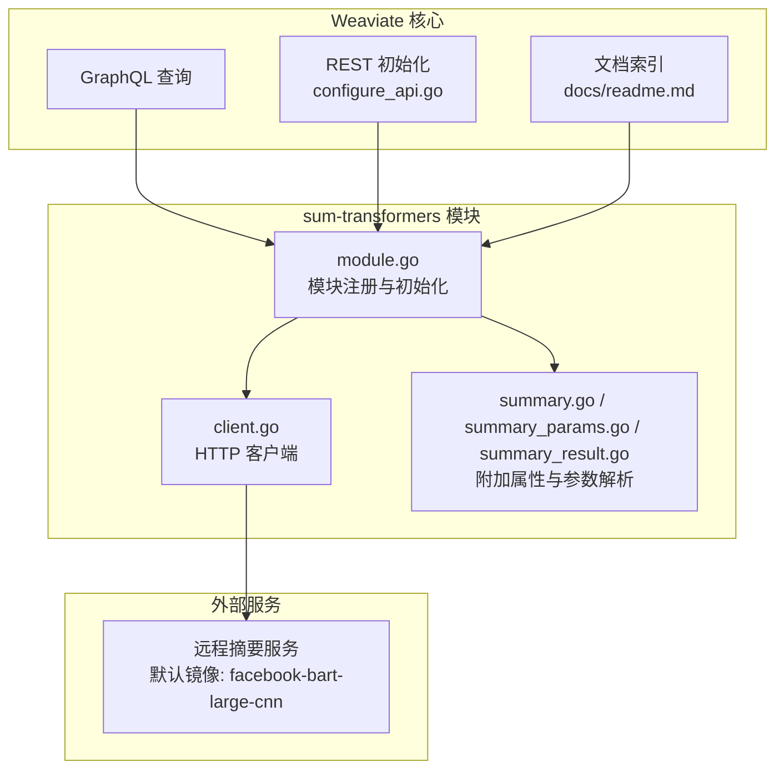
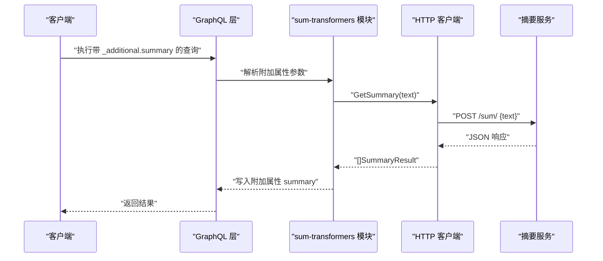
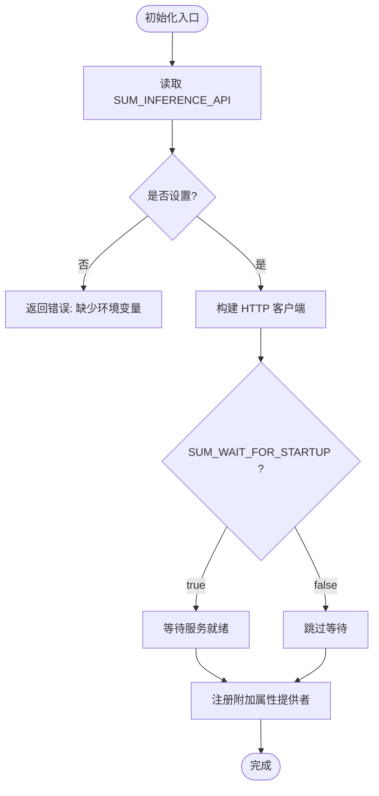
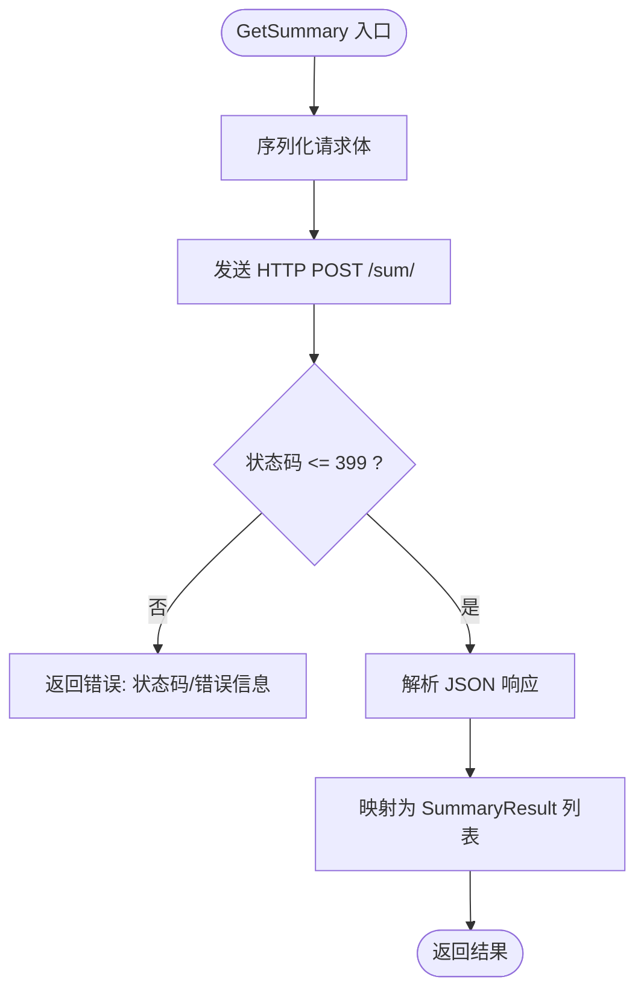
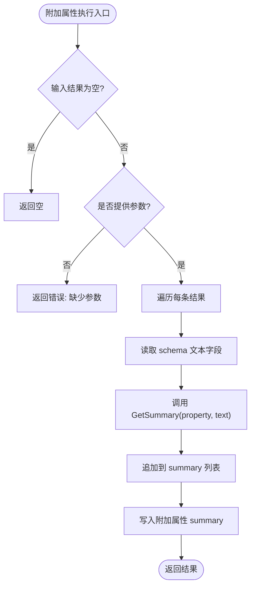
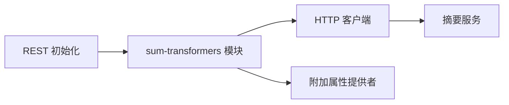

# 摘要生成模块

<cite>
**本文引用的文件**
- [modules/sum-transformers/module.go](file://modules/sum-transformers/module.go)
- [modules/sum-transformers/client/client.go](file://modules/sum-transformers/client/client.go)
- [modules/sum-transformers/additional/summary/summary.go](file://modules/sum-transformers/additional/summary/summary.go)
- [modules/sum-transformers/additional/summary/summary_params.go](file://modules/sum-transformers/additional/summary/summary_params.go)
- [modules/sum-transformers/additional/summary/summary_result.go](file://modules/sum-transformers/additional/summary/summary_result.go)
- [modules/sum-transformers/client/sum_test.go](file://modules/sum-transformers/client/sum_test.go)
- [modules/sum-transformers/additional/summary/summary_test.go](file://modules/sum-transformers/additional/summary/summary_test.go)
- [test/modules/sum-transformers/sum_test.go](file://test/modules/sum-transformers/sum_test.go)
- [test/docker/sum.go](file://test/docker/sum.go)
- [docs/readme.md](file://docs/readme.md)
- [adapters/handlers/rest/configure_api.go](file://adapters/handlers/rest/configure_api.go)
- [docker-compose.yml](file://docker-compose.yml)
</cite>

## 目录
1. [简介](#简介)
2. [项目结构](#项目结构)
3. [核心组件](#核心组件)
4. [架构总览](#架构总览)
5. [详细组件分析](#详细组件分析)
6. [依赖关系分析](#依赖关系分析)
7. [性能考量](#性能考量)
8. [故障排查指南](#故障排查指南)
9. [结论](#结论)
10. [附录](#附录)

## 简介
本技术文档围绕 Weaviate 的“摘要生成”模块展开，系统性介绍基于 Transformers 的文本摘要能力在 Weaviate 中的实现方式与使用方法。Weaviate 通过 sum-transformers 模块，将外部摘要服务（默认镜像为 facebook-bart-large-cnn）以远程推理服务的形式集成进来，支持在 GraphQL 查询中按需返回摘要结果。本文将从模块初始化、客户端通信、GraphQL 集成、参数配置、错误处理到测试用例与部署示例进行完整梳理，并给出抽取式与生成式摘要的概念对比与实践建议。

## 项目结构
sum-transformers 模块位于 modules/sum-transformers 目录下，主要由以下层次构成：
- 模块入口与生命周期：负责注册模块类型、初始化远程客户端、暴露附加属性与元信息。
- 客户端层：封装 HTTP 请求，调用远端摘要服务，解析响应并转换为内部数据结构。
- GraphQL 附加属性：解析查询参数、筛选目标文本字段、调用摘要客户端并写入附加结果。
- 测试与示例：单元测试验证客户端行为；集成测试验证 GraphQL 查询路径；容器化启动脚本演示部署。

图表来源
- [modules/sum-transformers/module.go](file://modules/sum-transformers/module.go#L32-L97)
- [modules/sum-transformers/client/client.go](file://modules/sum-transformers/client/client.go#L49-L107)
- [modules/sum-transformers/additional/summary/summary.go](file://modules/sum-transformers/additional/summary/summary.go#L31-L59)
- [adapters/handlers/rest/configure_api.go](file://adapters/handlers/rest/configure_api.go#L121-L121)
- [docs/readme.md](file://docs/readme.md#L98-L98)

章节来源
- [modules/sum-transformers/module.go](file://modules/sum-transformers/module.go#L32-L97)
- [adapters/handlers/rest/configure_api.go](file://adapters/handlers/rest/configure_api.go#L121-L121)
- [docs/readme.md](file://docs/readme.md#L98-L98)

## 核心组件
- 模块入口与生命周期
  - 模块名称与类型：模块名为 sum-transformers，类型为 Text2TextSummarize。
  - 初始化流程：读取环境变量 SUM_INFERENCE_API，构造 HTTP 客户端；可选等待服务就绪；注册附加属性提供者。
  - 元信息：透传远端服务的 MetaInfo。
- 客户端
  - 负责向 /sum/ 发送 POST 请求，请求体包含待摘要的文本；解析 JSON 响应，映射为内部 SummaryResult 列表。
  - 错误处理：对非 2xx 状态码返回错误；对响应解析失败返回错误。
- GraphQL 附加属性
  - 参数定义：支持指定 Properties（字符串数组），用于限定需要摘要的文本字段。
  - 执行逻辑：遍历查询结果，筛选 schema 中匹配的文本字段，逐个调用摘要客户端，将结果写入附加属性 summary。
- 数据结构
  - SummaryResult：包含 Property 与 Result 字段，分别表示来源属性名与摘要结果文本。

章节来源
- [modules/sum-transformers/module.go](file://modules/sum-transformers/module.go#L30-L97)
- [modules/sum-transformers/client/client.go](file://modules/sum-transformers/client/client.go#L28-L107)
- [modules/sum-transformers/additional/summary/summary_params.go](file://modules/sum-transformers/additional/summary/summary_params.go#L14-L24)
- [modules/sum-transformers/additional/summary/summary_result.go](file://modules/sum-transformers/additional/summary/summary_result.go#L24-L88)

## 架构总览
Weaviate 通过 REST 初始化加载 sum-transformers 模块；模块在运行时连接外部摘要服务（默认镜像为 facebook-bart-large-cnn）。当用户在 GraphQL 查询中请求 _additional.summary 并传入 properties 参数时，模块会根据参数筛选文本字段，调用摘要服务并把结果写回附加属性。

图表来源
- [adapters/handlers/rest/configure_api.go](file://adapters/handlers/rest/configure_api.go#L121-L121)
- [modules/sum-transformers/module.go](file://modules/sum-transformers/module.go#L54-L89)
- [modules/sum-transformers/client/client.go](file://modules/sum-transformers/client/client.go#L59-L103)
- [modules/sum-transformers/additional/summary/summary_result.go](file://modules/sum-transformers/additional/summary/summary_result.go#L24-L76)

## 详细组件分析

### 组件一：模块初始化与生命周期
- 关键点
  - 读取 SUM_INFERENCE_API 环境变量作为远端服务地址。
  - 可通过 SUM_WAIT_FOR_STARTUP 控制是否等待服务就绪。
  - 注册附加属性提供者，使 GraphQL 支持 _additional.summary。
- 初始化流程图

图表来源
- [modules/sum-transformers/module.go](file://modules/sum-transformers/module.go#L63-L89)

章节来源
- [modules/sum-transformers/module.go](file://modules/sum-transformers/module.go#L54-L89)

### 组件二：摘要客户端
- 输入输出
  - 请求体：包含 text 字段。
  - 响应体：包含 summary 数组，每个元素含 result 字段；若出错则包含 error 字段与状态码。
- 处理逻辑
  - 序列化请求体，发送 POST 请求至 /sum/。
  - 解析响应并映射为 []SummaryResult，填充 Property 字段为调用时传入的属性名。
- 错误处理
  - 非 2xx 状态码直接报错。
  - 响应体解析失败或网络错误统一包装后返回。

图表来源
- [modules/sum-transformers/client/client.go](file://modules/sum-transformers/client/client.go#L59-L103)

章节来源
- [modules/sum-transformers/client/client.go](file://modules/sum-transformers/client/client.go#L28-L107)

### 组件三：GraphQL 附加属性与参数解析
- 参数定义
  - Properties：字符串数组，指定需要摘要的文本字段名。
- 执行流程
  - 遍历查询结果，从 schema 中筛选匹配的文本字段。
  - 对每个字段调用摘要客户端，聚合结果写入附加属性 summary。
- 边界与校验
  - 若未提供参数或未找到匹配字段，返回相应错误。
  - 若附加属性为空则初始化空对象后再写入。

图表来源
- [modules/sum-transformers/additional/summary/summary_result.go](file://modules/sum-transformers/additional/summary/summary_result.go#L24-L76)
- [modules/sum-transformers/additional/summary/summary_params.go](file://modules/sum-transformers/additional/summary/summary_params.go#L14-L24)

章节来源
- [modules/sum-transformers/additional/summary/summary.go](file://modules/sum-transformers/additional/summary/summary.go#L31-L59)
- [modules/sum-transformers/additional/summary/summary_params.go](file://modules/sum-transformers/additional/summary/summary_params.go#L14-L24)
- [modules/sum-transformers/additional/summary/summary_result.go](file://modules/sum-transformers/additional/summary/summary_result.go#L24-L88)

### 组件四：抽取式 vs 生成式摘要（概念说明）
- 抽取式摘要
  - 从原文中挑选关键句子或片段组成摘要，不改变原文表述。
  - 特点：事实性强、可解释性高、计算开销低。
  - 适用：法律文档、技术规范、审计报告等要求严格还原原文的场景。
- 生成式摘要
  - 使用预训练语言模型对原文进行语义理解并生成新的摘要文本。
  - 特点：表达更自然流畅、可扩展性强，但可能存在事实性偏差。
  - 适用：新闻文章、博客、会议纪要等强调可读性的场景。
- 在 Weaviate 中的体现
  - 默认镜像为 facebook-bart-large-cnn，属于生成式模型家族，适合生成自然语言摘要。
  - 通过 GraphQL 的 _additional.summary 可直接获取生成式摘要结果。

[本节为概念性说明，不直接分析具体文件]

## 依赖关系分析
- 模块与核心
  - REST 初始化将 sum-transformers 模块纳入运行时。
  - 模块类型为 Text2TextSummarize，表明其职责为文本到文本的摘要任务。
- 模块与外部服务
  - 通过 SUM_INFERENCE_API 连接远端摘要服务，默认镜像为 facebook-bart-large-cnn。
- 模块内部耦合
  - SummaryProvider 依赖 sumClient 接口，便于替换实现或注入假客户端进行测试。
  - 模块初始化阶段即完成客户端与附加属性提供者的装配。

图表来源
- [adapters/handlers/rest/configure_api.go](file://adapters/handlers/rest/configure_api.go#L121-L121)
- [modules/sum-transformers/module.go](file://modules/sum-transformers/module.go#L54-L89)

章节来源
- [adapters/handlers/rest/configure_api.go](file://adapters/handlers/rest/configure_api.go#L121-L121)
- [modules/sum-transformers/module.go](file://modules/sum-transformers/module.go#L50-L52)

## 性能考量
- 远程调用延迟
  - 摘要服务为独立容器，网络往返时间会影响整体查询延迟。建议开启 SUM_WAIT_FOR_STARTUP 并合理设置超时。
- 文本长度与批处理
  - 单次摘要请求的文本长度受远端服务限制；对长文本可考虑分段处理或在上游进行预切分。
- 并发与限流
  - 在高并发场景下，建议对摘要服务进行水平扩展或引入本地缓存以降低重复请求成本。
- 资源占用
  - 生成式模型通常对 GPU/内存有较高需求，部署时需评估资源配额与弹性伸缩策略。

[本节提供通用建议，不直接分析具体文件]

## 故障排查指南
- 环境变量缺失
  - 现象：初始化时报错提示缺少 SUM_INFERENCE_API。
  - 处理：确保 SUM_INFERENCE_API 指向正确的摘要服务地址。
- 服务未就绪
  - 现象：SUM_WAIT_FOR_STARTUP 开启时初始化阻塞或失败。
  - 处理：检查摘要服务健康检查端点与镜像版本，确认容器已就绪。
- 请求失败
  - 现象：HTTP 状态码大于 399 或响应体解析失败。
  - 处理：查看摘要服务日志，确认请求体格式与服务端期望一致。
- GraphQL 查询无结果
  - 现象：附加属性 summary 为空。
  - 处理：确认查询中 properties 指定的字段存在于 schema 且为非空字符串；检查附加属性提供者是否正确注册。

章节来源
- [modules/sum-transformers/module.go](file://modules/sum-transformers/module.go#L66-L74)
- [modules/sum-transformers/client/client.go](file://modules/sum-transformers/client/client.go#L90-L92)
- [modules/sum-transformers/additional/summary/summary_result.go](file://modules/sum-transformers/additional/summary/summary_result.go#L27-L39)

## 结论
sum-transformers 模块通过清晰的接口设计与模块化结构，将外部生成式摘要服务无缝集成到 Weaviate 的 GraphQL 查询中。开发者可通过配置环境变量快速启用摘要能力，并在查询中灵活选择需要摘要的文本字段。结合默认的 facebook-bart-large-cnn 模型，该模块适用于新闻、会议记录、长文档等多种场景的摘要需求。建议在生产环境中关注服务可用性、网络延迟与资源配额，并配合测试用例与容器化部署脚本保障稳定性。

[本节为总结性内容，不直接分析具体文件]

## 附录

### A. 输入格式与输出控制
- 输入格式
  - GraphQL 查询中通过 _additional.summary(properties: [...]) 指定字段列表。
  - 模块内部将这些字段的文本内容提交给摘要服务。
- 输出控制
  - 返回值包含每个字段对应的摘要结果列表，字段名为 result，来源属性名为 property。
  - 可通过 properties 参数控制摘要范围，避免对无关字段进行调用。

章节来源
- [modules/sum-transformers/additional/summary/summary_params.go](file://modules/sum-transformers/additional/summary/summary_params.go#L14-L24)
- [modules/sum-transformers/additional/summary/summary_result.go](file://modules/sum-transformers/additional/summary/summary_result.go#L58-L76)
- [modules/sum-transformers/client/client.go](file://modules/sum-transformers/client/client.go#L34-L47)

### B. 部署与示例
- 镜像与端口
  - 默认镜像：semitechnologies/sum-transformers:facebook-bart-large-cnn。
  - 默认端口：8080，健康检查路径 /.well-known/ready。
- 环境变量
  - SUM_INFERENCE_API：摘要服务地址。
  - SUM_WAIT_FOR_STARTUP：是否等待服务就绪。
- 示例查询
  - 在 GraphQL 中请求 _additional.summary 并传入 properties，即可获得对应字段的摘要结果。

章节来源
- [test/docker/sum.go](file://test/docker/sum.go#L27-L66)
- [docker-compose.yml](file://docker-compose.yml#L83-L84)
- [test/modules/sum-transformers/sum_test.go](file://test/modules/sum-transformers/sum_test.go#L54-L90)

### C. 质量评估与最佳实践
- 质量评估指标
  - 自动化：ROUGE、BERTScore 等指标可用于批量评估摘要质量。
  - 人工评分：针对代表性样本进行相关性、完整性、可读性评分。
- 最佳实践
  - 明确摘要目标：抽取式适合事实性文档，生成式适合可读性优先场景。
  - 控制摘要长度：在上游对长文本进行分段或设定最大字符数。
  - 关键词保留：可在预处理阶段提取关键词并纳入摘要提示词（如使用生成式模型时）。
  - 场景适配：新闻文章强调事件与人物，会议记录强调决策与结论，长文档强调层级结构与要点。

[本节为通用指导，不直接分析具体文件]

### D. 测试参考
- 单元测试
  - 验证客户端成功与失败路径，确保错误信息与状态码正确传递。
- 集成测试
  - 验证 GraphQL 查询返回的摘要结果与期望一致。
- 容器化测试
  - 启动摘要服务容器并注入环境变量，验证模块初始化与就绪检查。

章节来源
- [modules/sum-transformers/client/sum_test.go](file://modules/sum-transformers/client/sum_test.go#L26-L89)
- [modules/sum-transformers/additional/summary/summary_test.go](file://modules/sum-transformers/additional/summary/summary_test.go#L24-L101)
- [test/modules/sum-transformers/sum_test.go](file://test/modules/sum-transformers/sum_test.go#L25-L94)
- [test/docker/sum.go](file://test/docker/sum.go#L26-L66)