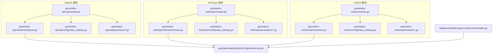
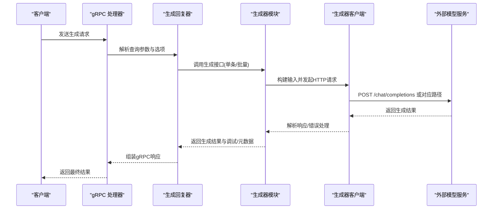
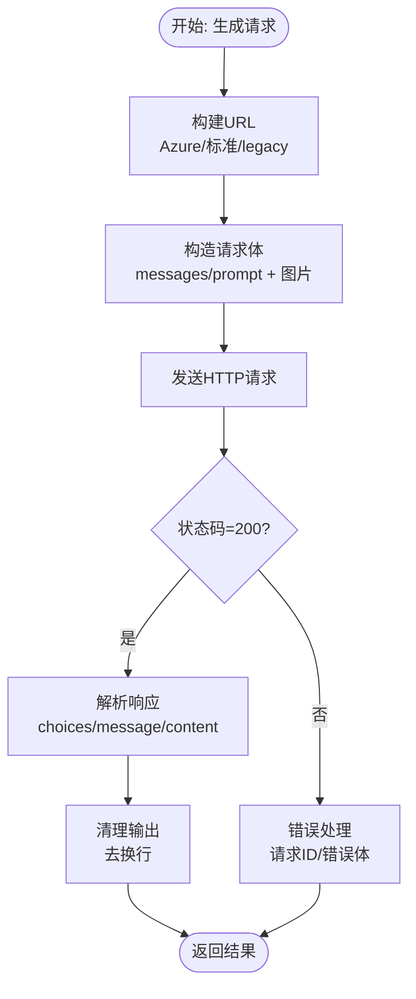
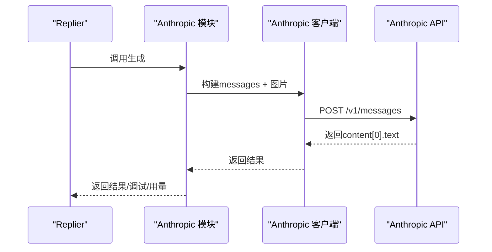
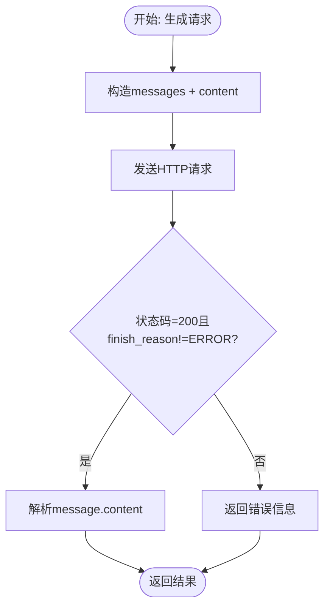
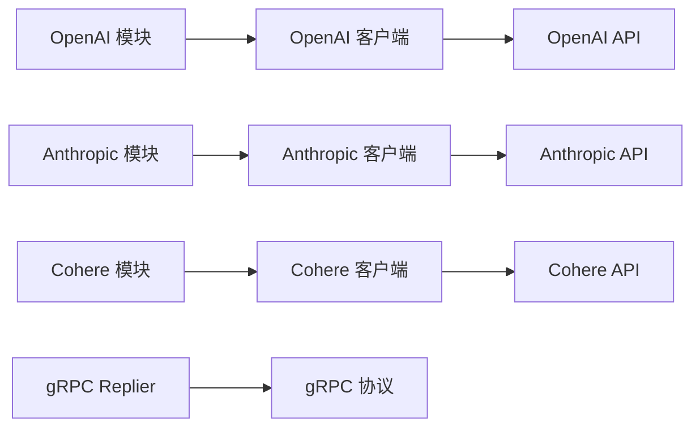

# 文本生成模块

<cite>
**本文引用的文件**
- [modules/generative-openai/module.go](file://modules/generative-openai/module.go)
- [modules/generative-openai/clients/openai.go](file://modules/generative-openai/clients/openai.go)
- [modules/generative-openai/config/class_settings.go](file://modules/generative-openai/config/class_settings.go)
- [modules/generative-openai/parameters/params.go](file://modules/generative-openai/parameters/params.go)
- [modules/generative-openai/parameters/provider.go](file://modules/generative-openai/parameters/provider.go)
- [modules/generative-anthropic/module.go](file://modules/generative-anthropic/module.go)
- [modules/generative-anthropic/clients/anthropic.go](file://modules/generative-anthropic/clients/anthropic.go)
- [modules/generative-anthropic/config/class_settings.go](file://modules/generative-anthropic/config/class_settings.go)
- [modules/generative-anthropic/parameters/params.go](file://modules/generative-anthropic/parameters/params.go)
- [modules/generative-anthropic/parameters/provider.go](file://modules/generative-anthropic/parameters/provider.go)
- [modules/generative-cohere/module.go](file://modules/generative-cohere/module.go)
- [modules/generative-cohere/clients/cohere.go](file://modules/generative-cohere/clients/cohere.go)
- [modules/generative-cohere/config/class_settings.go](file://modules/generative-cohere/config/class_settings.go)
- [modules/generative-cohere/parameters/params.go](file://modules/generative-cohere/parameters/params.go)
- [modules/generative-cohere/parameters/provider.go](file://modules/generative-cohere/parameters/provider.go)
- [grpc/generated/protocol/v1/generative.pb.go](file://grpc/generated/protocol/v1/generative.pb.go)
- [adapters/handlers/grpc/v1/generative/replier.go](file://adapters/handlers/grpc/v1/generative/replier.go)
</cite>

## 目录
1. [简介](#简介)
2. [项目结构](#项目结构)
3. [核心组件](#核心组件)
4. [架构总览](#架构总览)
5. [详细组件分析](#详细组件分析)
6. [依赖关系分析](#依赖关系分析)
7. [性能考量](#性能考量)
8. [故障排查指南](#故障排查指南)
9. [结论](#结论)
10. [附录](#附录)

## 简介
本技术文档聚焦 Weaviate 的文本生成模块，系统性解析 OpenAI、Anthropic、Cohere 等主流文本生成服务在 Weaviate 中的集成实现。内容涵盖：
- 各生成器的初始化流程、配置参数、API 密钥管理、请求超时与错误处理
- 参数调优（温度、最大令牌数、top-p 等）与最佳实践
- 质量控制、成本优化与速率限制策略
- 常见文本生成场景（内容创作、对话生成、代码生成）的使用建议
- 结果后处理、格式化与验证方法

## 项目结构
Weaviate 将每个生成器封装为独立模块，遵循统一的接口规范：
- 模块入口：module.go 定义模块名称、类型、初始化与元信息暴露
- 客户端：clients/* 实现与外部模型服务的 HTTP 交互
- 配置：config/* 解析类级配置并进行参数校验
- 参数：parameters/* 提供 GraphQL 请求参数提取与响应参数回填
- gRPC 层：replier 将生成结果映射到 gRPC 返回对象，并支持调试与元数据返回

图表来源
- [modules/generative-openai/module.go](file://modules/generative-openai/module.go#L27-L87)
- [modules/generative-anthropic/module.go](file://modules/generative-anthropic/module.go#L27-L87)
- [modules/generative-cohere/module.go](file://modules/generative-cohere/module.go#L27-L87)
- [grpc/generated/protocol/v1/generative.pb.go](file://grpc/generated/protocol/v1/generative.pb.go#L31-L121)
- [adapters/handlers/grpc/v1/generative/replier.go](file://adapters/handlers/grpc/v1/generative/replier.go#L361-L399)

章节来源
- [modules/generative-openai/module.go](file://modules/generative-openai/module.go#L27-L87)
- [modules/generative-anthropic/module.go](file://modules/generative-anthropic/module.go#L27-L87)
- [modules/generative-cohere/module.go](file://modules/generative-cohere/module.go#L27-L87)

## 核心组件
- 模块接口与生命周期
  - 每个模块通过 Init 接收全局 HTTP 超时与日志器，按需初始化客户端与参数提供器
  - 模块类型统一为 Text2TextGenerative，表明其用于文本到文本的生成任务
- 客户端通用能力
  - 统一的 GenerateSingleResult/GenerateAllResults 入口，负责构建提示词、拼接图片属性、构造请求体、发送 HTTP 请求、解析响应与错误处理
  - 支持从上下文或环境变量动态注入 API Key 与 Base URL，增强灵活性
- 配置与参数
  - 类级配置解析与校验，确保温度、最大令牌数、top-p 等参数在有效范围内
  - GraphQL 参数提取与响应参数回填，便于上层查询返回额外统计信息

章节来源
- [modules/generative-openai/module.go](file://modules/generative-openai/module.go#L51-L80)
- [modules/generative-anthropic/module.go](file://modules/generative-anthropic/module.go#L51-L80)
- [modules/generative-cohere/module.go](file://modules/generative-cohere/module.go#L51-L80)
- [modules/generative-openai/clients/openai.go](file://modules/generative-openai/clients/openai.go#L78-L199)
- [modules/generative-anthropic/clients/anthropic.go](file://modules/generative-anthropic/clients/anthropic.go#L51-L166)
- [modules/generative-cohere/clients/cohere.go](file://modules/generative-cohere/clients/cohere.go#L58-L160)

## 架构总览
下图展示一次典型生成请求在 Weaviate 内部的调用链路，从 gRPC 到各生成器客户端再到外部模型服务。

图表来源
- [adapters/handlers/grpc/v1/generative/replier.go](file://adapters/handlers/grpc/v1/generative/replier.go#L361-L399)
- [modules/generative-openai/clients/openai.go](file://modules/generative-openai/clients/openai.go#L96-L199)
- [modules/generative-anthropic/clients/anthropic.go](file://modules/generative-anthropic/clients/anthropic.go#L68-L166)
- [modules/generative-cohere/clients/cohere.go](file://modules/generative-cohere/clients/cohere.go#L74-L160)

## 详细组件分析

### OpenAI 生成器
- 初始化与密钥管理
  - 优先从请求上下文读取 API Key 与组织 ID；若不存在，则回退到环境变量
  - 支持 Azure OpenAI 与标准 OpenAI，自动选择 URL 构造方式
- 请求与响应
  - 支持 legacy 与 chat/completions 两种模式；根据模型判断是否使用 messages
  - 自动计算第三方供应商的最大令牌数，避免超出模型上下文窗口
  - 统一解析 choices/message/content，去除多余换行并返回结果
- 错误处理
  - 对非 200 状态码与错误体进行包装，包含请求 ID 与错误消息
- 配置与参数
  - 类级配置支持模型、温度、最大令牌数、频率/存在惩罚、top-p、基础 URL、API 版本、推理强度、冗长度等
  - GraphQL 参数提取支持 baseURL、apiVersion、resourceName、deploymentId、isAzure、model、temperature、maxTokens、n、presence/frequencyPenalty、stop、topP、images、imageProperties、reasoningEffort、verbosity

图表来源
- [modules/generative-openai/clients/openai.go](file://modules/generative-openai/clients/openai.go#L96-L199)
- [modules/generative-openai/config/class_settings.go](file://modules/generative-openai/config/class_settings.go#L138-L194)
- [modules/generative-openai/parameters/params.go](file://modules/generative-openai/parameters/params.go#L19-L86)

章节来源
- [modules/generative-openai/module.go](file://modules/generative-openai/module.go#L60-L72)
- [modules/generative-openai/clients/openai.go](file://modules/generative-openai/clients/openai.go#L124-L171)
- [modules/generative-openai/config/class_settings.go](file://modules/generative-openai/config/class_settings.go#L138-L194)
- [modules/generative-openai/parameters/params.go](file://modules/generative-openai/parameters/params.go#L19-L86)

### Anthropic 生成器
- 初始化与密钥管理
  - 优先从请求上下文读取 API Key；若不存在则回退到环境变量
- 请求与响应
  - 使用 messages 结构，支持多轮对话与图片（base64）
  - 固定 anthropic-version 头部，解析 content[0].text 作为结果
- 配置与参数
  - 类级配置支持 baseURL、model、temperature、topK、topP、stopSequences、maxTokens
  - GraphQL 参数提取支持 baseURL、model、temperature、topK、topP、stopSequences、maxTokens、images、imageProperties

图表来源
- [modules/generative-anthropic/clients/anthropic.go](file://modules/generative-anthropic/clients/anthropic.go#L68-L166)
- [modules/generative-anthropic/config/class_settings.go](file://modules/generative-anthropic/config/class_settings.go#L99-L104)
- [modules/generative-anthropic/parameters/params.go](file://modules/generative-anthropic/parameters/params.go#L19-L37)

章节来源
- [modules/generative-anthropic/module.go](file://modules/generative-anthropic/module.go#L61-L72)
- [modules/generative-anthropic/clients/anthropic.go](file://modules/generative-anthropic/clients/anthropic.go#L123-L166)
- [modules/generative-anthropic/config/class_settings.go](file://modules/generative-anthropic/config/class_settings.go#L99-L104)
- [modules/generative-anthropic/parameters/params.go](file://modules/generative-anthropic/parameters/params.go#L19-L37)

### Cohere 生成器
- 初始化与密钥管理
  - 优先从请求上下文读取 API Key；若不存在则回退到环境变量
- 请求与响应
  - 使用 messages + content(text/image_url)，解析 finish_reason 与 message.content
  - 返回 message.text 或错误信息
- 配置与参数
  - 类级配置支持 baseURL、model、temperature、k、stopSequences、maxTokens
  - GraphQL 参数提取支持 baseURL、model、temperature、k、stopSequences、maxTokens、images、imageProperties

图表来源
- [modules/generative-cohere/clients/cohere.go](file://modules/generative-cohere/clients/cohere.go#L74-L160)
- [modules/generative-cohere/config/class_settings.go](file://modules/generative-cohere/config/class_settings.go#L72-L74)
- [modules/generative-cohere/parameters/params.go](file://modules/generative-cohere/parameters/params.go#L19-L37)

章节来源
- [modules/generative-cohere/module.go](file://modules/generative-cohere/module.go#L61-L72)
- [modules/generative-cohere/clients/cohere.go](file://modules/generative-cohere/clients/cohere.go#L122-L160)
- [modules/generative-cohere/config/class_settings.go](file://modules/generative-cohere/config/class_settings.go#L72-L74)
- [modules/generative-cohere/parameters/params.go](file://modules/generative-cohere/parameters/params.go#L19-L37)

## 依赖关系分析
- 模块到客户端
  - OpenAI/Anthropic/Cohere 模块分别持有对应客户端实例，并注册附加参数提供器
- 客户端到外部服务
  - 三个客户端均通过 HTTP 客户端发送请求，头部包含认证信息与版本信息
- gRPC 映射
  - replier 将生成结果映射到 gRPC 返回对象，支持调试信息与元数据返回
- 枚举与协议
  - OpenAI 的 reasoningEffort 与 verbosity 在 gRPC 协议中以枚举形式定义，便于强类型传递

图表来源
- [modules/generative-openai/module.go](file://modules/generative-openai/module.go#L68-L80)
- [modules/generative-anthropic/module.go](file://modules/generative-anthropic/module.go#L68-L80)
- [modules/generative-cohere/module.go](file://modules/generative-cohere/module.go#L68-L80)
- [adapters/handlers/grpc/v1/generative/replier.go](file://adapters/handlers/grpc/v1/generative/replier.go#L361-L399)
- [grpc/generated/protocol/v1/generative.pb.go](file://grpc/generated/protocol/v1/generative.pb.go#L31-L121)

章节来源
- [adapters/handlers/grpc/v1/generative/replier.go](file://adapters/handlers/grpc/v1/generative/replier.go#L361-L399)
- [grpc/generated/protocol/v1/generative.pb.go](file://grpc/generated/protocol/v1/generative.pb.go#L31-L121)

## 性能考量
- 超时与并发
  - 模块初始化时接收全局 HTTP 超时，所有外部请求共享该超时，避免长尾阻塞
- 上下文注入
  - 可通过请求上下文覆盖 baseURL 与部署标识，便于灰度与多租户隔离
- 第三方模型令牌上限
  - OpenAI 客户端在第三方供应商场景下会根据模型最大上下文窗口动态调整 max_tokens，避免溢出
- 度量与监控
  - 客户端在关键路径上报请求计数、耗时、大小、状态码与错误次数，便于性能分析与告警

章节来源
- [modules/generative-openai/clients/openai.go](file://modules/generative-openai/clients/openai.go#L96-L123)
- [modules/generative-openai/clients/openai.go](file://modules/generative-openai/clients/openai.go#L405-L423)

## 故障排查指南
- 常见错误类型
  - API Key 缺失：检查请求头或环境变量是否正确设置
  - 认证失败：确认 API Key 与组织 ID 是否匹配目标服务
  - 超时：适当增大 ModuleHttpClientTimeout 或减少 maxTokens
  - 参数越界：温度、topP、最大令牌数需满足各模型约束
- 错误信息定位
  - OpenAI：包含状态码、请求 ID 与错误体消息
  - Anthropic：包含错误类型与消息
  - Cohere：包含 finish_reason 与错误消息
- 调试与元数据
  - 开启 debug 可返回完整提示词
  - 元数据包含用量信息（各模型返回字段略有差异）

章节来源
- [modules/generative-openai/clients/openai.go](file://modules/generative-openai/clients/openai.go#L139-L171)
- [modules/generative-anthropic/clients/anthropic.go](file://modules/generative-anthropic/clients/anthropic.go#L156-L158)
- [modules/generative-cohere/clients/cohere.go](file://modules/generative-cohere/clients/cohere.go#L146-L151)
- [adapters/handlers/grpc/v1/generative/replier.go](file://adapters/handlers/grpc/v1/generative/replier.go#L361-L399)

## 结论
Weaviate 的文本生成模块以“模块化 + 统一接口”的设计，实现了对 OpenAI、Anthropic、Cohere 等多家模型服务的一致接入。通过类级配置与 GraphQL 参数提取，开发者可在不修改业务代码的前提下灵活调参与切换模型。结合上下文注入、令牌上限自适应与完善的度量体系，该模块在易用性、可维护性与可观测性方面均具备良好表现。

## 附录

### 参数调优与最佳实践
- 温度（temperature）
  - 控制随机性与创造性；较低值更稳定，较高值更具多样性
  - OpenAI 支持 0~1；Anthropic/Cohere 通常支持 0~1 区间
- 最大令牌数（maxTokens）
  - 需考虑模型上下文窗口；第三方供应商会自动调整以避免溢出
- top-p/top-k
  - 影响采样分布；与温度协同调节
- 停止序列（stopSequences）
  - 用于精确控制输出边界，避免重复或无关内容
- 推理强度（reasoningEffort, 仅 OpenAI）
  - 适用于推理型任务，适度提升准确性但可能增加耗时与成本
- 冗长度（verbosity, 仅 OpenAI）
  - 控制响应冗余程度，平衡可读性与成本

章节来源
- [modules/generative-openai/config/class_settings.go](file://modules/generative-openai/config/class_settings.go#L144-L184)
- [modules/generative-anthropic/config/class_settings.go](file://modules/generative-anthropic/config/class_settings.go#L99-L104)
- [modules/generative-cohere/config/class_settings.go](file://modules/generative-cohere/config/class_settings.go#L84-L94)

### 使用场景与示例思路
- 内容创作
  - 设置适中的温度与 top-p，合理规划最大令牌数，必要时使用停止序列
- 对话生成
  - 使用 messages 结构，保持角色与内容一致性；对多模态场景可加入图片
- 代码生成
  - 降低温度，提高 top-p 下限，配合停止序列避免无关输出

[本节为概念性指导，无需特定文件引用]

### 结果后处理、格式化与验证
- 输出清理
  - 去除首尾换行与多余空白，保证整洁输出
- 格式化
  - JSON/Markdown 等结构化输出可由上层解析器进一步格式化
- 验证
  - 校验 finish_reason/error 字段，确保生成成功
  - 对关键字段（如 usage/meta）进行二次校验，防止空值

章节来源
- [modules/generative-openai/clients/openai.go](file://modules/generative-openai/clients/openai.go#L174-L193)
- [modules/generative-anthropic/clients/anthropic.go](file://modules/generative-anthropic/clients/anthropic.go#L160-L165)
- [modules/generative-cohere/clients/cohere.go](file://modules/generative-cohere/clients/cohere.go#L153-L159)