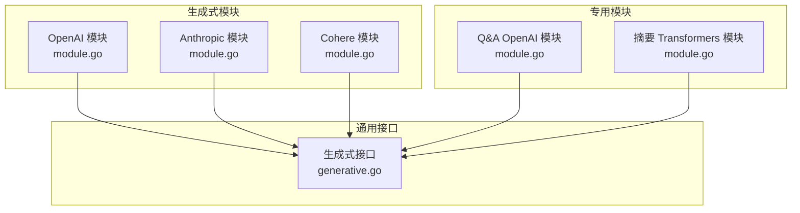
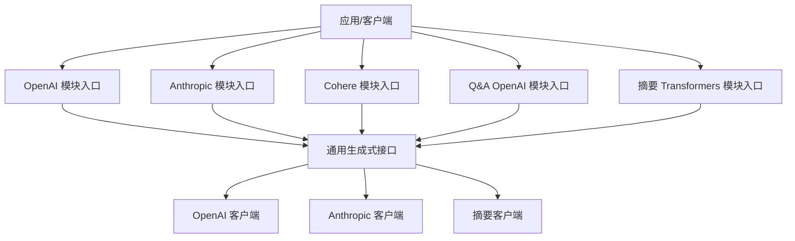
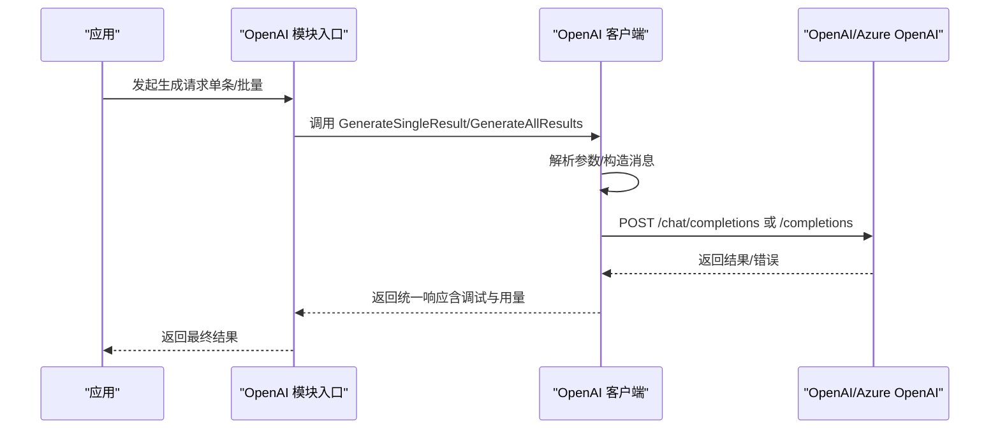
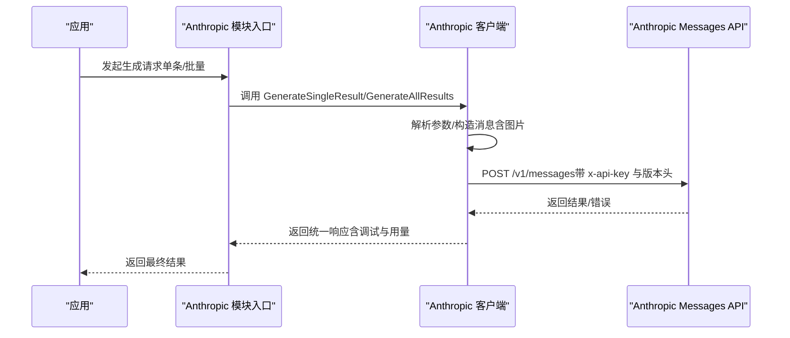
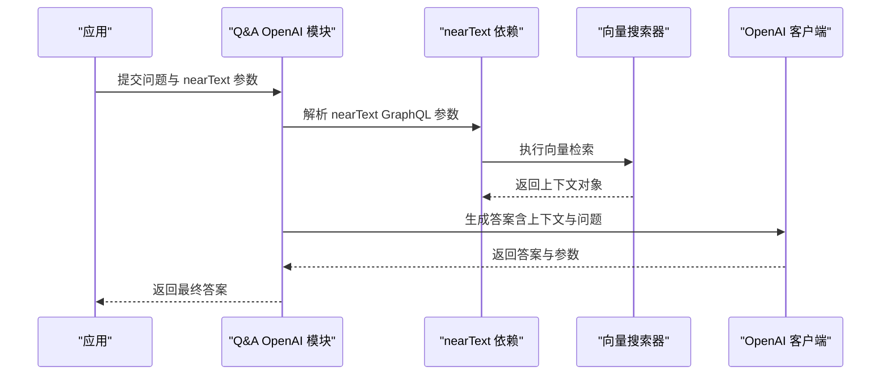
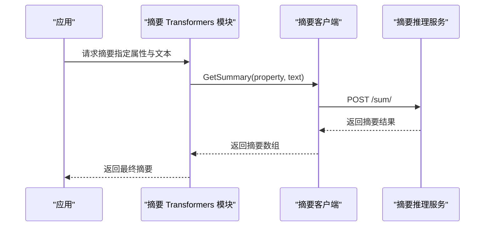
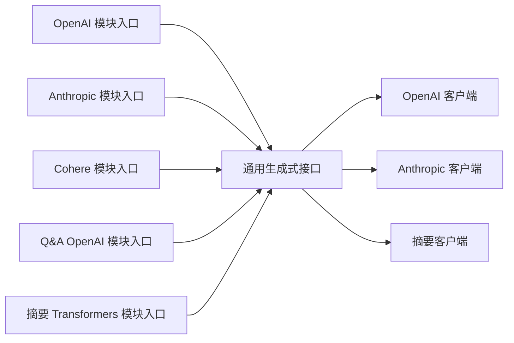

# 生成式模块

<cite>
**本文引用的文件**
- [README.md](file://README.md)
- [module.go（OpenAI 生成式模块）](file://modules/generative-openai/module.go)
- [module.go（Anthropic 生成式模块）](file://modules/generative-anthropic/module.go)
- [module.go（Cohere 生成式模块）](file://modules/generative-cohere/module.go)
- [module.go（Q&A OpenAI 模块）](file://modules/qna-openai/module.go)
- [module.go（摘要 Transformers 模块）](file://modules/sum-transformers/module.go)
- [generative.go（通用生成式接口）](file://entities/modulecapabilities/generative.go)
- [openai.go（OpenAI 客户端实现）](file://modules/generative-openai/clients/openai.go)
- [anthropic.go（Anthropic 客户端实现）](file://modules/generative-anthropic/clients/anthropic.go)
- [client.go（摘要客户端实现）](file://modules/sum-transformers/client/client.go)
</cite>

## 目录
1. [简介](#简介)
2. [项目结构](#项目结构)
3. [核心组件](#核心组件)
4. [架构总览](#架构总览)
5. [详细组件分析](#详细组件分析)
6. [依赖关系分析](#依赖关系分析)
7. [性能考量](#性能考量)
8. [故障排查指南](#故障排查指南)
9. [结论](#结论)
10. [附录](#附录)

## 简介
本文件面向生成式 AI 应用开发者，系统化梳理 Weaviate 的生成式模块，覆盖文本生成、问答生成与摘要生成三大能力，并深入解析 OpenAI、Anthropic、Cohere 等主流生成式模型的集成方式与配置要点。文档同时阐述 Q&A 模块的“基于检索的问答”工作流（上下文提取与答案生成），以及摘要模块的自动化摘要流程；并给出接口设计、参数调优、输出控制、质量评估、成本控制与安全注意事项等实践建议。

## 项目结构
Weaviate 将生成式能力以“模块化插件”的形式组织，每个供应商（如 OpenAI、Anthropic、Cohere 等）对应一个独立模块目录，内部包含客户端、配置、参数与模块入口。此外，Q&A 与摘要模块分别提供“基于检索的问答”和“文本摘要”的专用实现。

图表来源
- [module.go（OpenAI 生成式模块）](file://modules/generative-openai/module.go#L1-L88)
- [module.go（Anthropic 生成式模块）](file://modules/generative-anthropic/module.go#L1-L88)
- [module.go（Cohere 生成式模块）](file://modules/generative-cohere/module.go#L1-L87)
- [module.go（Q&A OpenAI 模块）](file://modules/qna-openai/module.go#L1-L163)
- [module.go（摘要 Transformers 模块）](file://modules/sum-transformers/module.go#L1-L105)
- [generative.go（通用生成式接口）](file://entities/modulecapabilities/generative.go#L1-L73)

章节来源
- [README.md](file://README.md#L10-L122)

## 核心组件
- 通用生成式接口：定义生成请求/响应、参数抽取、调试信息与单条/批量生成方法，统一不同供应商的调用协议。
- OpenAI 生成式模块：封装 OpenAI/Azure OpenAI 的调用细节，支持参数透传、令牌用量统计、错误映射与动态 URL 构造。
- Anthropic 生成式模块：封装 Anthropic Messages API，支持图片输入、停止序列、TopK/TopP、温度等参数。
- Cohere 生成式模块：封装 Cohere 生成接口，提供统一的 AdditionalGenerativeProperties 能力。
- Q&A OpenAI 模块：基于检索（nearText）抽取上下文，结合提示词模板生成答案，并提供 GraphQL 扩展参数。
- 摘要 Transformers 模块：调用远程摘要推理服务，返回标准化摘要结果。

章节来源
- [generative.go（通用生成式接口）](file://entities/modulecapabilities/generative.go#L1-L73)
- [module.go（OpenAI 生成式模块）](file://modules/generative-openai/module.go#L1-L88)
- [module.go（Anthropic 生成式模块）](file://modules/generative-anthropic/module.go#L1-L88)
- [module.go（Cohere 生成式模块）](file://modules/generative-cohere/module.go#L1-L87)
- [module.go（Q&A OpenAI 模块）](file://modules/qna-openai/module.go#L1-L163)
- [module.go（摘要 Transformers 模块）](file://modules/sum-transformers/module.go#L1-L105)

## 架构总览
生成式模块通过“模块入口 + 供应商客户端 + 通用接口”的分层设计，实现跨供应商的一致调用体验。Q&A 与摘要模块在此基础上进一步组合检索与推理能力。

图表来源
- [module.go（OpenAI 生成式模块）](file://modules/generative-openai/module.go#L27-L80)
- [module.go（Anthropic 生成式模块）](file://modules/generative-anthropic/module.go#L27-L80)
- [module.go（Cohere 生成式模块）](file://modules/generative-cohere/module.go#L27-L80)
- [module.go（Q&A OpenAI 模块）](file://modules/qna-openai/module.go#L31-L155)
- [module.go（摘要 Transformers 模块）](file://modules/sum-transformers/module.go#L30-L97)
- [generative.go（通用生成式接口）](file://entities/modulecapabilities/generative.go#L48-L72)

## 详细组件分析

### 通用生成式接口
- 作用：定义生成式请求/响应结构、参数抽取函数、调试信息字段，以及单条与批量生成方法签名，确保各供应商客户端实现一致。
- 关键点：
  - 请求参数：支持 Text/Blob 类型属性，便于图文混合输入。
  - 响应参数：统一 Result、Params、Debug 字段，便于上层消费与可观测性。
  - 参数透传：通过 ExtractRequestParamsFn 从 GraphQL 查询中抽取供应商特定参数。

章节来源
- [generative.go（通用生成式接口）](file://entities/modulecapabilities/generative.go#L22-L72)

### OpenAI 生成式模块
- 模块类型：Text2TextGenerative
- 初始化：读取 OPENAI_APIKEY、OPENAI_ORGANIZATION、AZURE_APIKEY 环境变量，构造客户端并注册 AdditionalGenerativeProperties。
- 客户端能力：
  - URL 构造：支持 OpenAI 与 Azure OpenAI，兼容旧版与新版接口路径。
  - 参数透传：温度、TopP、频率惩罚、最大令牌数、推理努力、冗长度等。
  - 图像输入：支持 base64 图片拼接消息内容。
  - 错误处理：区分 OpenAI/Azure 端错误，携带请求 ID 与状态码。
  - 统计指标：外部请求次数、耗时、大小、状态码与错误计数。

图表来源
- [module.go（OpenAI 生成式模块）](file://modules/generative-openai/module.go#L51-L72)
- [openai.go（OpenAI 客户端实现）](file://modules/generative-openai/clients/openai.go#L78-L199)

章节来源
- [module.go（OpenAI 生成式模块）](file://modules/generative-openai/module.go#L1-L88)
- [openai.go（OpenAI 客户端实现）](file://modules/generative-openai/clients/openai.go#L1-L565)

### Anthropic 生成式模块
- 模块类型：Text2TextGenerative
- 初始化：读取 ANTHROPIC_APIKEY，构造客户端并注册 AdditionalGenerativeProperties。
- 客户端能力：
  - URL 构造：默认 /v1/messages，支持通过请求头覆盖 BaseURL。
  - 参数透传：模型、温度、TopK、TopP、最大令牌数、停止序列等。
  - 图像输入：将图片以 base64 方式拼接到消息内容中。
  - 错误处理：解析 API 错误类型与消息，返回人类可读错误。

图表来源
- [module.go（Anthropic 生成式模块）](file://modules/generative-anthropic/module.go#L51-L72)
- [anthropic.go（Anthropic 客户端实现）](file://modules/generative-anthropic/clients/anthropic.go#L51-L166)

章节来源
- [module.go（Anthropic 生成式模块）](file://modules/generative-anthropic/module.go#L1-L88)
- [anthropic.go（Anthropic 客户端实现）](file://modules/generative-anthropic/clients/anthropic.go#L1-L326)

### Cohere 生成式模块
- 模块类型：Text2TextGenerative
- 初始化：读取 COHERE_APIKEY，构造客户端并注册 AdditionalGenerativeProperties。
- 能力概览：遵循统一 GenerativeClient 接口，支持参数透传与调试信息。

章节来源
- [module.go（Cohere 生成式模块）](file://modules/generative-cohere/module.go#L1-L87)

### Q&A OpenAI 模块（基于检索的问答）
- 模块类型：Text2TextQnA
- 能力组成：
  - 依赖注入：从其他模块收集 nearText 的 GraphQL 参数与向量搜索器，用于上下文提取。
  - 文本转换：通过 TextTransformers 获取“ask”任务的文本变换器。
  - 答案生成：调用 OpenAI 客户端生成答案，附加 AdditionalProperties 以返回答案相关参数。
- 工作流程：
  1) 从 nearText 依赖中抽取上下文向量；
  2) 将上下文与问题拼接为提示词；
  3) 调用生成客户端得到答案；
  4) 返回答案与附加参数。

图表来源
- [module.go（Q&A OpenAI 模块）](file://modules/qna-openai/module.go#L69-L155)

章节来源
- [module.go（Q&A OpenAI 模块）](file://modules/qna-openai/module.go#L1-L163)

### 摘要 Transformers 模块
- 模块类型：Text2TextSummarize
- 初始化：读取 SUM_INFERENCE_API 环境变量，可选等待推理服务启动，构造摘要客户端并注册 AdditionalProperties。
- 能力概览：调用远程摘要服务，返回标准化摘要结果，支持调试信息与用量参数。

图表来源
- [module.go（摘要 Transformers 模块）](file://modules/sum-transformers/module.go#L54-L97)
- [client.go（摘要客户端实现）](file://modules/sum-transformers/client/client.go#L59-L103)

章节来源
- [module.go（摘要 Transformers 模块）](file://modules/sum-transformers/module.go#L1-L105)
- [client.go（摘要客户端实现）](file://modules/sum-transformers/client/client.go#L1-L108)

## 依赖关系分析
- 模块入口均实现 Module、MetaProvider、AdditionalGenerativeProperties/New（或 AdditionalProperties）接口，确保被框架正确加载与注册。
- 供应商客户端实现统一 GenerativeClient 接口，屏蔽底层差异。
- Q&A 模块依赖其他模块提供的 nearText GraphQL 参数与向量搜索器，形成“检索 + 生成”的闭环。
- 摘要模块依赖远程推理服务，通过 HTTP 客户端进行调用。

图表来源
- [module.go（OpenAI 生成式模块）](file://modules/generative-openai/module.go#L82-L87)
- [module.go（Anthropic 生成式模块）](file://modules/generative-anthropic/module.go#L82-L87)
- [module.go（Cohere 生成式模块）](file://modules/generative-cohere/module.go#L81-L86)
- [module.go（Q&A OpenAI 模块）](file://modules/qna-openai/module.go#L157-L162)
- [module.go（摘要 Transformers 模块）](file://modules/sum-transformers/module.go#L99-L104)

章节来源
- [module.go（OpenAI 生成式模块）](file://modules/generative-openai/module.go#L1-L88)
- [module.go（Anthropic 生成式模块）](file://modules/generative-anthropic/module.go#L1-L88)
- [module.go（Cohere 生成式模块）](file://modules/generative-cohere/module.go#L1-L87)
- [module.go（Q&A OpenAI 模块）](file://modules/qna-openai/module.go#L1-L163)
- [module.go（摘要 Transformers 模块）](file://modules/sum-transformers/module.go#L1-L105)

## 性能考量
- 外部调用监控：OpenAI 客户端已内置请求次数、耗时、请求/响应体大小、状态码与错误计数指标，便于性能观测与告警。
- 令牌管理：OpenAI 客户端根据模型最大令牌限制与消息长度动态调整最大补全令牌数，避免超限。
- 超时与重试：模块初始化时传入 HTTP 客户端超时，建议结合业务场景设置合理超时与重试策略。
- 并发与批处理：批量生成接口可减少往返开销，建议在满足上下文长度的前提下合并请求。
- 成本控制：通过限制 MaxTokens、Temperature、TopP 等参数，平衡生成质量与成本；关注用量统计（如 OpenAI usage）。

章节来源
- [openai.go（OpenAI 客户端实现）](file://modules/generative-openai/clients/openai.go#L96-L123)
- [openai.go（OpenAI 客户端实现）](file://modules/generative-openai/clients/openai.go#L405-L423)

## 故障排查指南
- API 密钥缺失：
  - OpenAI/Azure：检查 OPENAI_APIKEY、OPENAI_ORGANIZATION、AZURE_APIKEY 是否设置；支持通过请求头覆盖（如 X-Openai-Api-Key、X-Azure-Api-Key、X-Openai-Baseurl、X-Azure-Deployment-Id、X-Azure-Resource-Name）。
  - Anthropic：检查 ANTHROPIC_APIKEY；支持通过请求头 X-Anthropic-Api-Key 覆盖。
- URL 与端点：
  - OpenAI：确认 BaseURL 与 ApiVersion；Azure 模式需提供 ResourceName 与 DeploymentID。
  - Anthropic：确认 BaseURL，默认 /v1/messages。
- 错误信息：
  - OpenAI：返回状态码与错误体，包含请求 ID；Azure 与 OpenAI 区分处理。
  - Anthropic：解析 error.type 与 error.message。
- 摘要服务：
  - 确认 SUM_INFERENCE_API 设置；若服务未就绪，可启用 SUM_WAIT_FOR_STARTUP 控制等待行为。

章节来源
- [module.go（OpenAI 生成式模块）](file://modules/generative-openai/module.go#L60-L72)
- [openai.go（OpenAI 客户端实现）](file://modules/generative-openai/clients/openai.go#L288-L310)
- [openai.go（OpenAI 客户端实现）](file://modules/generative-openai/clients/openai.go#L389-L403)
- [module.go（Anthropic 生成式模块）](file://modules/generative-anthropic/module.go#L61-L72)
- [anthropic.go（Anthropic 客户端实现）](file://modules/generative-anthropic/clients/anthropic.go#L234-L252)
- [anthropic.go（Anthropic 客户端实现）](file://modules/generative-anthropic/clients/anthropic.go#L156-L158)
- [module.go（摘要 Transformers 模块）](file://modules/sum-transformers/module.go#L63-L89)
- [client.go（摘要客户端实现）](file://modules/sum-transformers/client/client.go#L90-L92)

## 结论
Weaviate 的生成式模块以统一接口抽象供应商差异，结合 Q&A 与摘要模块实现了从“检索增强”到“自动化摘要”的完整链路。通过参数透传、调试信息与用量统计，开发者可在保证质量的同时进行成本与性能的精细化控制。建议在生产环境中配合监控指标、合理的超时与重试策略，以及严格的密钥与请求头管理，确保稳定与安全。

## 附录

### 接口设计与参数调优要点
- 通用接口
  - 请求参数：支持 Text/Blob 属性，便于图文混合输入。
  - 响应参数：统一 Result、Params、Debug，便于上层消费与可观测性。
- OpenAI
  - 关键参数：模型、温度、TopP、频率/存在惩罚、最大令牌数、推理努力、冗长度、停止序列。
  - 图像输入：将图片以 base64 拼接到消息内容。
  - URL 与认证：OpenAI/Azure 双模式，支持请求头覆盖 BaseURL/Deployment/Resource。
- Anthropic
  - 关键参数：模型、温度、TopK、TopP、最大令牌数、停止序列。
  - 图像输入：将图片以 base64 拼接到消息内容。
  - 认证：x-api-key 与版本头。
- Q&A
  - 依赖 nearText 的 GraphQL 参数与向量搜索器，抽取上下文后生成答案。
- 摘要
  - 依赖 SUM_INFERENCE_API，支持等待服务启动。

章节来源
- [generative.go（通用生成式接口）](file://entities/modulecapabilities/generative.go#L33-L72)
- [openai.go（OpenAI 客户端实现）](file://modules/generative-openai/clients/openai.go#L312-L387)
- [anthropic.go（Anthropic 客户端实现）](file://modules/generative-anthropic/clients/anthropic.go#L103-L116)
- [module.go（Q&A OpenAI 模块）](file://modules/qna-openai/module.go#L69-L155)
- [module.go（摘要 Transformers 模块）](file://modules/sum-transformers/module.go#L54-L97)