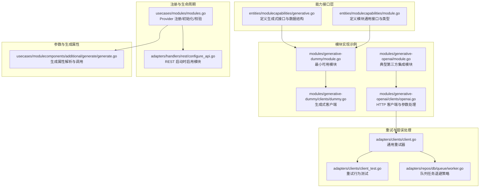
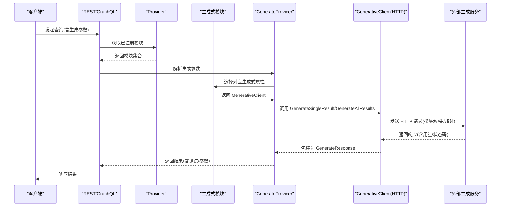
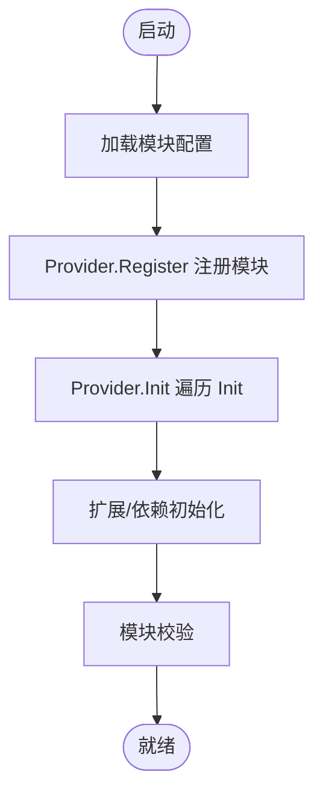
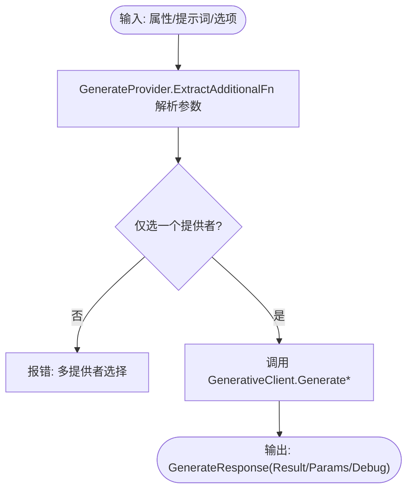
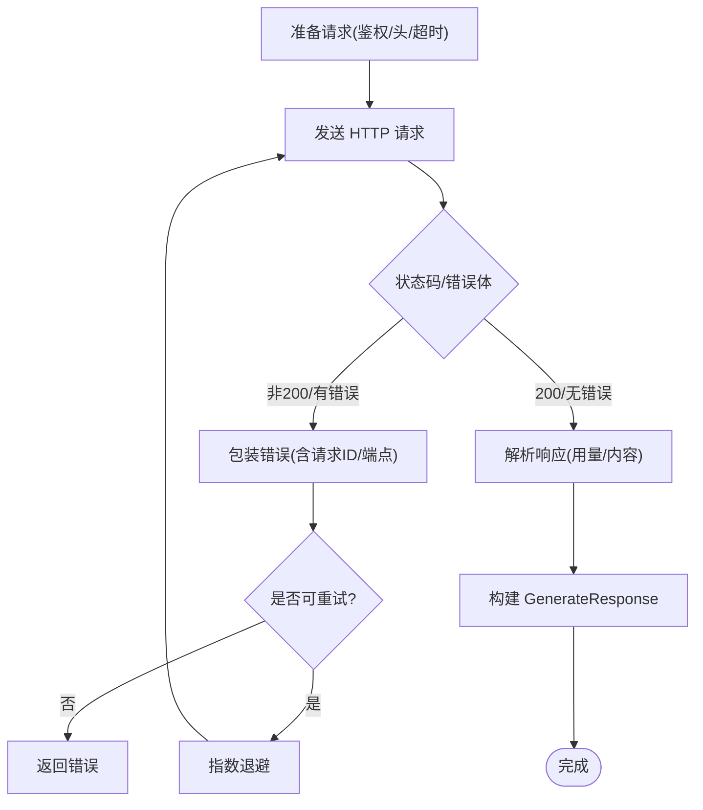
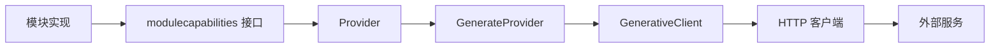

# 自定义生成式模块开发

<cite>
**本文引用的文件**
- [entities/modulecapabilities/generative.go](file://entities/modulecapabilities/generative.go)
- [entities/modulecapabilities/module.go](file://entities/modulecapabilities/module.go)
- [modules/generative-dummy/module.go](file://modules/generative-dummy/module.go)
- [modules/generative-dummy/clients/dummy.go](file://modules/generative-dummy/clients/dummy.go)
- [modules/generative-openai/module.go](file://modules/generative-openai/module.go)
- [modules/generative-openai/clients/openai.go](file://modules/generative-openai/clients/openai.go)
- [usecases/modules/modules.go](file://usecases/modules/modules.go)
- [usecases/modulecomponents/additional/generate/generate.go](file://usecases/modulecomponents/additional/generate/generate.go)
- [adapters/handlers/rest/configure_api.go](file://adapters/handlers/rest/configure_api.go)
- [adapters/clients/client.go](file://adapters/clients/client.go)
- [adapters/clients/client_test.go](file://adapters/clients/client_test.go)
- [adapters/repos/db/queue/worker.go](file://adapters/repos/db/queue/worker.go)
</cite>

## 目录
1. [简介](#简介)
2. [项目结构](#项目结构)
3. [核心组件](#核心组件)
4. [架构总览](#架构总览)
5. [详细组件分析](#详细组件分析)
6. [依赖关系分析](#依赖关系分析)
7. [性能考量](#性能考量)
8. [故障排查指南](#故障排查指南)
9. [结论](#结论)
10. [附录](#附录)

## 简介
本指南面向希望扩展 Weaviate 生成式能力的高级开发者，系统讲解如何实现自定义生成式模块（Text2TextGenerative）。内容覆盖接口设计与实现规范、模块注册与生命周期、配置管理与参数解析、客户端封装与错误处理及重试机制，并提供从接口实现到测试验证的完整开发流程，以及模块打包、部署与版本管理的最佳实践。

## 项目结构
Weaviate 的生成式模块遵循统一的模块接口与能力规范，核心位于 entities/modulecapabilities，具体实现位于 modules/<category>-<provider>，并通过 usecases/modules 进行集中注册与初始化，最终在 REST 层按配置启用。



**图表来源**
- [entities/modulecapabilities/generative.go](file://entities/modulecapabilities/generative.go#L48-L72)
- [entities/modulecapabilities/module.go](file://entities/modulecapabilities/module.go#L24-L49)
- [modules/generative-dummy/module.go](file://modules/generative-dummy/module.go#L31-L70)
- [modules/generative-dummy/clients/dummy.go](file://modules/generative-dummy/clients/dummy.go#L42-L60)
- [modules/generative-openai/module.go](file://modules/generative-openai/module.go#L33-L80)
- [modules/generative-openai/clients/openai.go](file://modules/generative-openai/clients/openai.go#L56-L94)
- [usecases/modules/modules.go](file://usecases/modules/modules.go#L71-L78)
- [adapters/handlers/rest/configure_api.go](file://adapters/handlers/rest/configure_api.go#L1652-L1722)
- [usecases/modulecomponents/additional/generate/generate.go](file://usecases/modulecomponents/additional/generate/generate.go#L32-L79)
- [adapters/clients/client.go](file://adapters/clients/client.go#L93-L124)
- [adapters/clients/client_test.go](file://adapters/clients/client_test.go#L24-L123)
- [adapters/repos/db/queue/worker.go](file://adapters/repos/db/queue/worker.go#L134-L164)

**章节来源**
- [entities/modulecapabilities/generative.go](file://entities/modulecapabilities/generative.go#L1-L73)
- [entities/modulecapabilities/module.go](file://entities/modulecapabilities/module.go#L1-L90)
- [modules/generative-dummy/module.go](file://modules/generative-dummy/module.go#L1-L78)
- [modules/generative-openai/module.go](file://modules/generative-openai/module.go#L1-L88)
- [usecases/modules/modules.go](file://usecases/modules/modules.go#L1-L200)
- [adapters/handlers/rest/configure_api.go](file://adapters/handlers/rest/configure_api.go#L1652-L1722)

## 核心组件
- 模块接口与类型
  - Module：模块名称、初始化、类型声明
  - ModuleType：枚举多种模块类型，生成式为 Text2TextGenerative
- 生成式能力接口
  - GenerativeClient：单条/批量生成方法
  - GenerativeProperty：包含客户端与 GraphQL 参数函数
  - AdditionalGenerativeProperties：暴露生成式属性映射
- 生成式数据结构
  - GenerateProperties：文本/二进制属性
  - GenerateResponse：结果字符串、模块参数、调试信息
  - GenerateDebugInformation：调试提示词

这些接口与结构定义了模块实现的契约，确保不同提供商的生成式客户端能被统一接入 Weaviate 的 GraphQL 与 REST 查询体系。

**章节来源**
- [entities/modulecapabilities/module.go](file://entities/modulecapabilities/module.go#L24-L49)
- [entities/modulecapabilities/generative.go](file://entities/modulecapabilities/generative.go#L22-L72)

## 架构总览
生成式模块的运行链路如下：
- REST 层根据配置启用模块并注册到 Provider
- Provider 在启动时对所有模块执行 Init，随后进行校验与扩展初始化
- GraphQL/REST 查询通过 AdditionalGenerativeProperties 将生成式参数注入，交由 GenerateProvider 解析
- 模块内部的 GenerativeClient 执行实际的外部 API 调用，支持指标、调试与参数透传



**图表来源**
- [usecases/modules/modules.go](file://usecases/modules/modules.go#L138-L179)
- [usecases/modulecomponents/additional/generate/generate.go](file://usecases/modulecomponents/additional/generate/generate.go#L64-L79)
- [modules/generative-openai/clients/openai.go](file://modules/generative-openai/clients/openai.go#L78-L94)
- [adapters/handlers/rest/configure_api.go](file://adapters/handlers/rest/configure_api.go#L1652-L1722)

## 详细组件分析

### 模块接口与生命周期
- 模块类型
  - 生成式模块使用 Text2TextGenerative 类型标识
- 初始化流程
  - Provider.Init 依次调用每个模块的 Init，并在扩展/依赖阶段完成二次初始化
  - 模块可实现 ModuleWithClose 在关闭时释放资源
- 注册与启用
  - REST 启动时读取配置，按需注册模块实例



**图表来源**
- [usecases/modules/modules.go](file://usecases/modules/modules.go#L71-L78)
- [usecases/modules/modules.go](file://usecases/modules/modules.go#L138-L179)
- [adapters/handlers/rest/configure_api.go](file://adapters/handlers/rest/configure_api.go#L1652-L1722)

**章节来源**
- [entities/modulecapabilities/module.go](file://entities/modulecapabilities/module.go#L24-L49)
- [usecases/modules/modules.go](file://usecases/modules/modules.go#L138-L179)
- [adapters/handlers/rest/configure_api.go](file://adapters/handlers/rest/configure_api.go#L1652-L1722)

### 生成式接口与参数解析
- 接口职责
  - GenerativeClient 提供单条与批量生成方法，接收属性、提示词、请求参数、调试开关与类配置
  - GenerateResponse 统一返回结构，支持模块特定参数与调试信息
- 参数解析
  - GenerateProvider 负责从 GraphQL/REST 参数中提取生成参数，限制多提供者同时选择，调用对应模块客户端
  - 支持从上下文读取动态头（如 API Key、资源名、部署 ID），实现灵活覆盖



**图表来源**
- [usecases/modulecomponents/additional/generate/generate.go](file://usecases/modulecomponents/additional/generate/generate.go#L56-L79)
- [entities/modulecapabilities/generative.go](file://entities/modulecapabilities/generative.go#L48-L72)

**章节来源**
- [usecases/modulecomponents/additional/generate/generate.go](file://usecases/modulecomponents/additional/generate/generate.go#L32-L79)
- [entities/modulecapabilities/generative.go](file://entities/modulecapabilities/generative.go#L33-L72)

### 模块实现示例：Dummy 与 OpenAI
- Dummy 模块
  - 最小化实现：构造本地生成客户端，暴露 AdditionalGenerativeProperties
  - 适合演示与测试
- OpenAI 模块
  - 构造 HTTP 客户端，支持 OpenAI/Azure OpenAI URL 构建、鉴权头设置、模型参数合并、用量统计与调试信息
  - 支持从上下文覆盖 BaseURL、部署 ID、资源名等，便于多租户或代理场景

```mermaid
classDiagram
class GenerativeDummyModule {
+Name() string
+Type() ModuleType
+Init(ctx, params) error
+MetaInfo() map[string]interface{}
+AdditionalGenerativeProperties() map[string]GenerativeProperty
}
class GenerativeOpenAIModule {
+Name() string
+Type() ModuleType
+Init(ctx, params) error
+MetaInfo() map[string]interface{}
+AdditionalGenerativeProperties() map[string]GenerativeProperty
}
class GenerativeClient {
+GenerateSingleResult(...)
+GenerateAllResults(...)
}
class GenerateProvider {
+ExtractAdditionalFn(...)
+AdditionalFieldFn(...)
+AdditionalPropertyFn(...)
}
GenerativeDummyModule ..|> Module
GenerativeOpenAIModule ..|> Module
GenerativeDummyModule --> GenerativeClient : "持有"
GenerativeOpenAIModule --> GenerativeClient : "持有"
GenerateProvider --> GenerativeClient : "调用"
```

**图表来源**
- [modules/generative-dummy/module.go](file://modules/generative-dummy/module.go#L31-L70)
- [modules/generative-openai/module.go](file://modules/generative-openai/module.go#L33-L80)
- [usecases/modulecomponents/additional/generate/generate.go](file://usecases/modulecomponents/additional/generate/generate.go#L32-L79)
- [entities/modulecapabilities/generative.go](file://entities/modulecapabilities/generative.go#L48-L72)

**章节来源**
- [modules/generative-dummy/module.go](file://modules/generative-dummy/module.go#L31-L70)
- [modules/generative-openai/module.go](file://modules/generative-openai/module.go#L33-L80)

### 自定义生成器客户端：封装、错误处理与重试
- HTTP 客户端封装
  - 统一构建 URL（OpenAI/Azure）、设置鉴权头、组织请求体、解析响应、记录指标与调试信息
  - 支持从上下文读取动态头，实现按请求覆盖
- 错误处理
  - 对非 200 状态与错误体进行包装，包含请求 ID、端点类型与状态码
- 重试机制
  - 通用重试器采用指数退避，结合最大尝试次数与最大耗时，区分瞬时/永久错误
  - 单元测试覆盖成功、永久错误、多次重试后成功、耗尽与取消等场景



**图表来源**
- [modules/generative-openai/clients/openai.go](file://modules/generative-openai/clients/openai.go#L103-L199)
- [adapters/clients/client.go](file://adapters/clients/client.go#L93-L124)
- [adapters/clients/client_test.go](file://adapters/clients/client_test.go#L32-L123)

**章节来源**
- [modules/generative-openai/clients/openai.go](file://modules/generative-openai/clients/openai.go#L56-L94)
- [adapters/clients/client.go](file://adapters/clients/client.go#L93-L124)
- [adapters/clients/client_test.go](file://adapters/clients/client_test.go#L24-L123)

### 配置管理与参数传递
- 类配置与参数合并
  - 客户端从 ClassConfig 读取模块级设置，与调用方传入的 Options 合并，优先使用调用方显式值
- 上下文透传
  - 通过上下文键读取 BaseURL、部署 ID、资源名、API Key、组织等，实现按请求动态覆盖
- GraphQL 参数
  - 通过 RequestParamsFunction/ExtractRequestParamsFunction 将 GraphQL 字段转换为模块参数

**章节来源**
- [modules/generative-openai/clients/openai.go](file://modules/generative-openai/clients/openai.go#L201-L261)
- [usecases/modulecomponents/additional/generate/generate.go](file://usecases/modulecomponents/additional/generate/generate.go#L56-L79)
- [entities/modulecapabilities/generative.go](file://entities/modulecapabilities/generative.go#L58-L66)

### 模块注册与启用流程
- 启动时扫描配置中的启用模块，逐一注册
- Provider.Init 顺序执行 Init、扩展初始化、依赖初始化与校验
- REST 层在路由初始化阶段启用相应模块

**章节来源**
- [adapters/handlers/rest/configure_api.go](file://adapters/handlers/rest/configure_api.go#L1652-L1722)
- [usecases/modules/modules.go](file://usecases/modules/modules.go#L138-L179)

## 依赖关系分析
- 模块间耦合
  - 模块实现依赖 modulecapabilities 接口；模块通过 Provider 注册，不直接依赖其他模块
  - 生成式模块通过 AdditionalGenerativeProperties 暴露能力，由 GenerateProvider 统一调度
- 外部依赖
  - HTTP 客户端与第三方 API（如 OpenAI/Azure OpenAI）
  - 指标监控与日志记录
- 可能的循环依赖
  - 通过接口与 Provider 解耦，避免模块间直接相互引用



**图表来源**
- [entities/modulecapabilities/module.go](file://entities/modulecapabilities/module.go#L45-L49)
- [usecases/modules/modules.go](file://usecases/modules/modules.go#L71-L78)
- [usecases/modulecomponents/additional/generate/generate.go](file://usecases/modulecomponents/additional/generate/generate.go#L32-L79)
- [modules/generative-openai/clients/openai.go](file://modules/generative-openai/clients/openai.go#L56-L94)

**章节来源**
- [usecases/modules/modules.go](file://usecases/modules/modules.go#L71-L78)
- [usecases/modulecomponents/additional/generate/generate.go](file://usecases/modulecomponents/additional/generate/generate.go#L32-L79)

## 性能考量
- 指标采集
  - 记录外部请求计数、时延、大小、状态码与错误，便于性能分析与告警
- 并发与批处理
  - GenerateProvider 使用固定上限的 goroutine 数量，避免过度并发
- 令牌与长度控制
  - 对第三方模型的最大令牌进行估算与裁剪，防止超出限制
- 退避策略
  - 队列任务与重试器均采用指数退避，限制最大耗时，平衡可靠性与延迟

**章节来源**
- [modules/generative-openai/clients/openai.go](file://modules/generative-openai/clients/openai.go#L96-L115)
- [usecases/modulecomponents/additional/generate/generate.go](file://usecases/modulecomponents/additional/generate/generate.go#L30)
- [adapters/repos/db/queue/worker.go](file://adapters/repos/db/queue/worker.go#L134-L164)
- [adapters/clients/client.go](file://adapters/clients/client.go#L107-L124)

## 故障排查指南
- 常见问题定位
  - 鉴权失败：检查环境变量与上下文头是否正确传递
  - URL 构建错误：确认 BaseURL、资源名、部署 ID 是否匹配
  - 参数冲突：确认仅选择一个生成提供者，避免多选导致解析失败
- 日志与调试
  - 开启调试模式可返回提示词，便于验证输入
  - 查看指标与错误计数，定位异常端点与状态码
- 重试与超时
  - 若出现瞬时网络波动，重试器会自动退避；若持续失败，检查上游限流与配额

**章节来源**
- [modules/generative-openai/clients/openai.go](file://modules/generative-openai/clients/openai.go#L139-L171)
- [adapters/clients/client.go](file://adapters/clients/client.go#L93-L124)
- [adapters/clients/client_test.go](file://adapters/clients/client_test.go#L82-L123)

## 结论
通过统一的模块接口与能力规范，Weaviate 为生成式模块提供了清晰的扩展路径。开发者只需实现 Module 与 GenerativeClient，并在 AdditionalGenerativeProperties 中暴露参数，即可无缝接入 GraphQL/REST 查询。配合完善的参数解析、上下文透传、指标监控与重试机制，可快速构建稳定可靠的生成式能力。

## 附录

### 开发步骤清单
- 实现 Module
  - 声明名称、类型、初始化逻辑
  - 在 initAdditional 中创建并持有 GenerativeClient
- 实现 GenerativeClient
  - 实现单条/批量生成方法
  - 支持从 ClassConfig 与上下文读取参数
  - 返回统一的 GenerateResponse
- 暴露生成式属性
  - 在 AdditionalGenerativeProperties 中返回 GenerativeProperty 映射
- 注册与启用
  - 在 REST 启动时按配置注册模块
  - Provider.Init 完成初始化与校验
- 测试与验证
  - 编写单元测试覆盖成功、错误与重试场景
  - 验证 GraphQL/REST 查询参数解析与结果返回

**章节来源**
- [modules/generative-dummy/module.go](file://modules/generative-dummy/module.go#L31-L70)
- [modules/generative-openai/module.go](file://modules/generative-openai/module.go#L33-L80)
- [adapters/handlers/rest/configure_api.go](file://adapters/handlers/rest/configure_api.go#L1652-L1722)
- [usecases/modules/modules.go](file://usecases/modules/modules.go#L138-L179)

### 模块打包、部署与版本管理建议
- 版本与兼容
  - 保持 modulecapabilities 接口稳定，避免破坏性变更
  - 通过模块别名与 Provider 兼容旧名称
- 配置与环境
  - 将密钥与端点通过环境变量与上下文头分离，便于多环境切换
- 监控与可观测性
  - 为外部调用添加指标与日志，建立告警阈值
- 部署与灰度
  - 通过配置开关启用模块，先灰度再全量
  - 保留回滚路径（降级到 Dummy 或禁用）

**章节来源**
- [entities/modulecapabilities/module.go](file://entities/modulecapabilities/module.go#L80-L82)
- [usecases/modules/modules.go](file://usecases/modules/modules.go#L71-L78)
- [adapters/handlers/rest/configure_api.go](file://adapters/handlers/rest/configure_api.go#L1652-L1722)