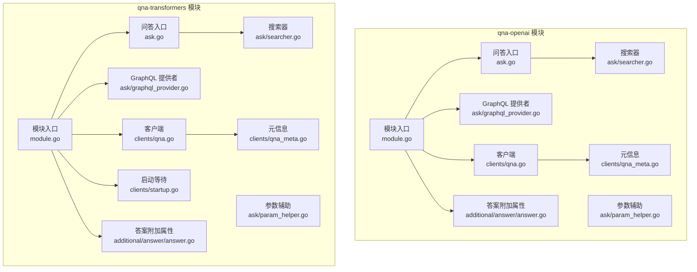
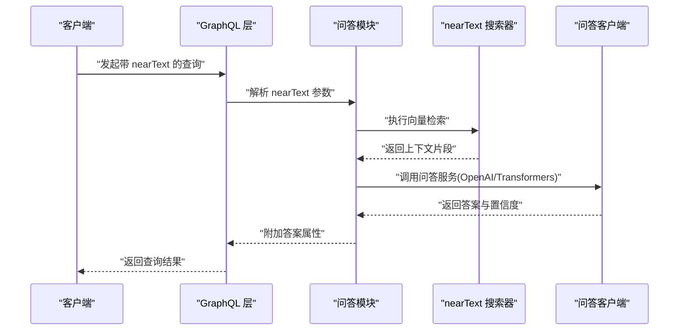
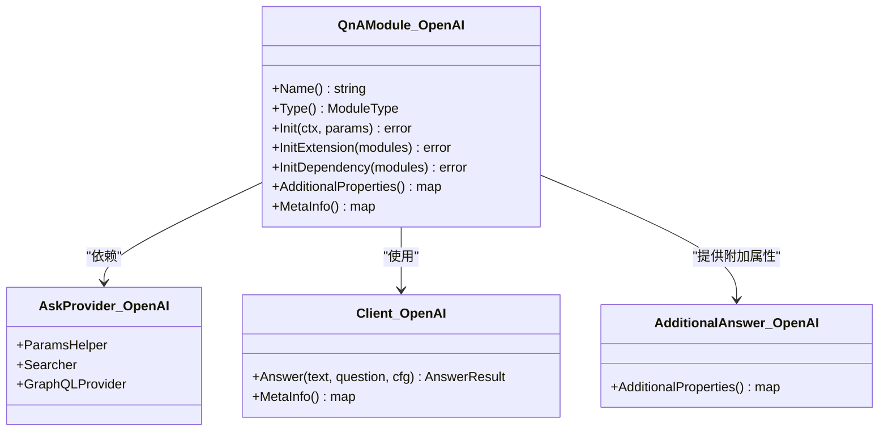
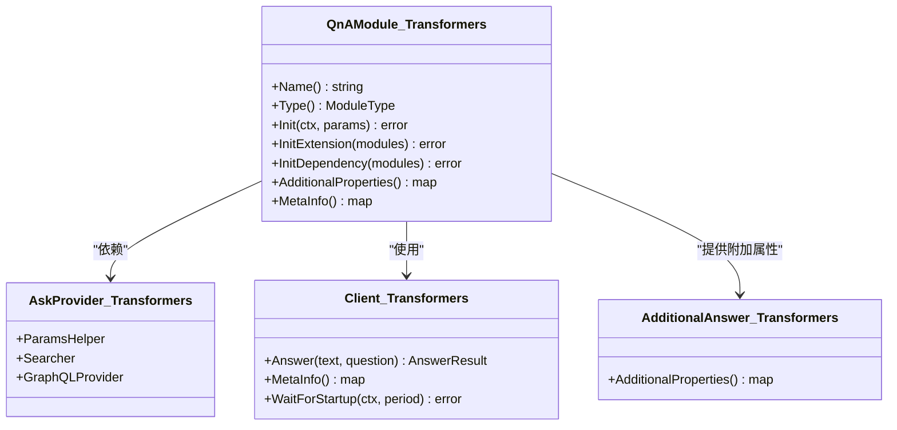
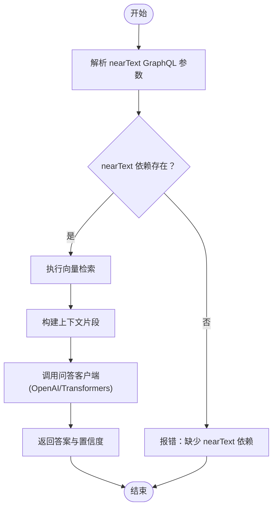
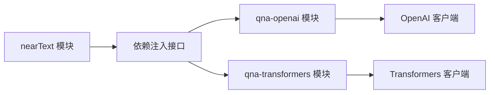

# 问答生成模块

<cite>
**本文引用的文件**
- [modules/qna-openai/module.go](file://modules/qna-openai/module.go)
- [modules/qna-openai/ask.go](file://modules/qna-openai/ask.go)
- [modules/qna-openai/clients/qna.go](file://modules/qna-openai/clients/qna.go)
- [modules/qna-openai/clients/qna_meta.go](file://modules/qna-openai/clients/qna_meta.go)
- [modules/qna-openai/additional/answer/answer.go](file://modules/qna-openai/additional/answer/answer.go)
- [modules/qna-openai/additional/answer/answer_result.go](file://modules/qna-openai/additional/answer/answer_result.go)
- [modules/qna-openai/ask/param_helper.go](file://modules/qna-openai/ask/param_helper.go)
- [modules/qna-openai/ask/searcher.go](file://modules/qna-openai/ask/searcher.go)
- [modules/qna-openai/ask/graphql_provider.go](file://modules/qna-openai/ask/graphql_provider.go)
- [modules/qna-openai/config/class_settings.go](file://modules/qna-openai/config/class_settings.go)
- [modules/qna-openai/dependency/dependency.go](file://modules/qna-openai/dependency/dependency.go)
- [modules/qna-openai/ent/vectorization_result.go](file://modules/qna-openai/ent/vectorization_result.go)
- [modules/qna-transformers/module.go](file://modules/qna-transformers/module.go)
- [modules/qna-transformers/ask.go](file://modules/qna-transformers/ask.go)
- [modules/qna-transformers/clients/qna.go](file://modules/qna-transformers/clients/qna.go)
- [modules/qna-transformers/clients/startup.go](file://modules/qna-transformers/clients/startup.go)
- [modules/qna-transformers/clients/qna_meta.go](file://modules/qna-transformers/clients/qna_meta.go)
- [modules/qna-transformers/additional/answer/answer.go](file://modules/qna-transformers/additional/answer/answer.go)
- [modules/qna-transformers/additional/answer/answer_result.go](file://modules/qna-transformers/additional/answer/answer_result.go)
- [modules/qna-transformers/ask/param_helper.go](file://modules/qna-transformers/ask/param_helper.go)
- [modules/qna-transformers/ask/searcher.go](file://modules/qna-transformers/ask/searcher.go)
- [modules/qna-transformers/ask/graphql_provider.go](file://modules/qna-transformers/ask/graphql_provider.go)
- [modules/qna-transformers/config/class_settings.go](file://modules/qna-transformers/config/class_settings.go)
- [modules/qna-transformers/dependency/dependency.go](file://modules/qna-transformers/dependency/dependency.go)
- [modules/qna-transformers/ent/vectorization_result.go](file://modules/qna-transformers/ent/vectorization_result.go)
- [test/modules/qna-transformers/qna_test.go](file://test/modules/qna-transformers/qna_test.go)
- [test/docker/qna.go](file://test/docker/qna.go)
</cite>

## 目录
1. [简介](#简介)
2. [项目结构](#项目结构)
3. [核心组件](#核心组件)
4. [架构总览](#架构总览)
5. [详细组件分析](#详细组件分析)
6. [依赖关系分析](#依赖关系分析)
7. [性能考虑](#性能考虑)
8. [故障排查指南](#故障排查指南)
9. [结论](#结论)
10. [附录](#附录)

## 简介
本技术文档围绕 Weaviate 的问答生成模块展开，重点覆盖两类实现：基于云端大模型服务（OpenAI）的问答与基于本地推理服务（Transformers）的问答。文档将从系统架构、数据流、处理逻辑、参数配置、性能优化、典型应用场景与最佳实践等方面进行系统化说明，帮助开发者快速理解并正确集成问答能力。

## 项目结构
问答模块以“模块化”方式接入 Weaviate，每个实现（OpenAI 与 Transformers）均遵循统一的模块接口规范，提供 GraphQL 参数扩展、向量搜索依赖注入、额外属性输出以及元信息查询能力。模块通过依赖注入获取 nearText 的 GraphQL 参数与向量搜索器，从而在“问答”场景中复用现有向量检索能力。

图表来源
- [modules/qna-openai/module.go](file://modules/qna-openai/module.go#L37-L89)
- [modules/qna-openai/ask.go](file://modules/qna-openai/ask.go#L1-L200)
- [modules/qna-openai/ask/param_helper.go](file://modules/qna-openai/ask/param_helper.go#L1-L200)
- [modules/qna-openai/ask/searcher.go](file://modules/qna-openai/ask/searcher.go#L1-L200)
- [modules/qna-openai/ask/graphql_provider.go](file://modules/qna-openai/ask/graphql_provider.go#L1-L200)
- [modules/qna-openai/clients/qna.go](file://modules/qna-openai/clients/qna.go#L1-L200)
- [modules/qna-openai/clients/qna_meta.go](file://modules/qna-openai/clients/qna_meta.go#L1-L19)
- [modules/qna-openai/additional/answer/answer.go](file://modules/qna-openai/additional/answer/answer.go#L1-L200)
- [modules/qna-transformers/module.go](file://modules/qna-transformers/module.go#L38-L132)
- [modules/qna-transformers/ask.go](file://modules/qna-transformers/ask.go#L1-L200)
- [modules/qna-transformers/ask/param_helper.go](file://modules/qna-transformers/ask/param_helper.go#L1-L200)
- [modules/qna-transformers/ask/searcher.go](file://modules/qna-transformers/ask/searcher.go#L1-L200)
- [modules/qna-transformers/ask/graphql_provider.go](file://modules/qna-transformers/ask/graphql_provider.go#L1-L200)
- [modules/qna-transformers/clients/qna.go](file://modules/qna-transformers/clients/qna.go#L1-L200)
- [modules/qna-transformers/clients/startup.go](file://modules/qna-transformers/clients/startup.go#L1-L200)
- [modules/qna-transformers/clients/qna_meta.go](file://modules/qna-transformers/clients/qna_meta.go#L1-L19)
- [modules/qna-transformers/additional/answer/answer.go](file://modules/qna-transformers/additional/answer/answer.go#L1-L200)

章节来源
- [modules/qna-openai/module.go](file://modules/qna-openai/module.go#L37-L89)
- [modules/qna-transformers/module.go](file://modules/qna-transformers/module.go#L38-L132)

## 核心组件
- 模块入口与类型声明：两个模块均实现统一的模块接口，标识类型为“文本到文本问答”，并通过 Init/InitExtension/InitDependency 完成初始化与依赖注入。
- GraphQL 参数扩展：模块注册 nearText 的 GraphQL 参数，并提供提取函数，用于从 GraphQL 查询中抽取 nearText 的查询参数。
- 向量搜索依赖：模块从其他模块中发现 nearText 的 GraphQL 参数与对应的向量搜索器，建立依赖链，以便在问答时进行上下文检索。
- 问答客户端：分别对接云端 OpenAI 与本地 Transformers 推理服务，负责调用外部服务并返回答案结果。
- 额外属性输出：模块提供“答案”附加属性，可在 GraphQL 查询中按需返回答案文本、置信度等信息。
- 元信息查询：提供模块元信息（如文档链接），便于诊断与集成。

章节来源
- [modules/qna-openai/module.go](file://modules/qna-openai/module.go#L51-L89)
- [modules/qna-openai/ask/param_helper.go](file://modules/qna-openai/ask/param_helper.go#L1-L200)
- [modules/qna-openai/ask/searcher.go](file://modules/qna-openai/ask/searcher.go#L1-L200)
- [modules/qna-openai/ask/graphql_provider.go](file://modules/qna-openai/ask/graphql_provider.go#L1-L200)
- [modules/qna-openai/clients/qna.go](file://modules/qna-openai/clients/qna.go#L1-L200)
- [modules/qna-openai/additional/answer/answer.go](file://modules/qna-openai/additional/answer/answer.go#L1-L200)
- [modules/qna-transformers/module.go](file://modules/qna-transformers/module.go#L53-L132)
- [modules/qna-transformers/ask/param_helper.go](file://modules/qna-transformers/ask/param_helper.go#L1-L200)
- [modules/qna-transformers/ask/searcher.go](file://modules/qna-transformers/ask/searcher.go#L1-L200)
- [modules/qna-transformers/ask/graphql_provider.go](file://modules/qna-transformers/ask/graphql_provider.go#L1-L200)
- [modules/qna-transformers/clients/qna.go](file://modules/qna-transformers/clients/qna.go#L1-L200)
- [modules/qna-transformers/clients/startup.go](file://modules/qna-transformers/clients/startup.go#L1-L200)
- [modules/qna-transformers/additional/answer/answer.go](file://modules/qna-transformers/additional/answer/answer.go#L1-L200)

## 架构总览
问答流程分为三步：上下文提取、相关文档检索、答案生成。OpenAI 实现直接调用云端模型；Transformers 实现通过本地推理服务完成答案生成。两者均依赖 nearText 的 GraphQL 参数与向量搜索器来确定上下文片段。

图表来源
- [modules/qna-openai/ask/searcher.go](file://modules/qna-openai/ask/searcher.go#L1-L200)
- [modules/qna-openai/ask/param_helper.go](file://modules/qna-openai/ask/param_helper.go#L1-L200)
- [modules/qna-openai/clients/qna.go](file://modules/qna-openai/clients/qna.go#L1-L200)
- [modules/qna-transformers/ask/searcher.go](file://modules/qna-transformers/ask/searcher.go#L1-L200)
- [modules/qna-transformers/clients/qna.go](file://modules/qna-transformers/clients/qna.go#L1-L200)

## 详细组件分析

### OpenAI 问答模块
- 初始化与依赖注入
  - 在 Init 中初始化附加属性提供者；在 InitExtension 中发现并注入 nearText 的文本变换器；在 InitDependency 中发现 nearText 的 GraphQL 参数与向量搜索器，建立依赖链。
- 问答流程
  - GraphQL 参数解析后，通过 nearText 搜索器检索上下文；随后调用 OpenAI 客户端生成答案；最终将答案作为附加属性返回。
- 关键文件
  - 模块入口与类型声明：[modules/qna-openai/module.go](file://modules/qna-openai/module.go#L37-L89)
  - 问答入口与参数辅助：[modules/qna-openai/ask.go](file://modules/qna-openai/ask.go#L1-L200)、[modules/qna-openai/ask/param_helper.go](file://modules/qna-openai/ask/param_helper.go#L1-L200)
  - 搜索器与 GraphQL 提供者：[modules/qna-openai/ask/searcher.go](file://modules/qna-openai/ask/searcher.go#L1-L200)、[modules/qna-openai/ask/graphql_provider.go](file://modules/qna-openai/ask/graphql_provider.go#L1-L200)
  - 客户端与元信息：[modules/qna-openai/clients/qna.go](file://modules/qna-openai/clients/qna.go#L1-L200)、[modules/qna-openai/clients/qna_meta.go](file://modules/qna-openai/clients/qna_meta.go#L1-L19)
  - 答案附加属性：[modules/qna-openai/additional/answer/answer.go](file://modules/qna-openai/additional/answer/answer.go#L1-L200)

图表来源
- [modules/qna-openai/module.go](file://modules/qna-openai/module.go#L37-L89)
- [modules/qna-openai/ask/param_helper.go](file://modules/qna-openai/ask/param_helper.go#L1-L200)
- [modules/qna-openai/ask/searcher.go](file://modules/qna-openai/ask/searcher.go#L1-L200)
- [modules/qna-openai/ask/graphql_provider.go](file://modules/qna-openai/ask/graphql_provider.go#L1-L200)
- [modules/qna-openai/clients/qna.go](file://modules/qna-openai/clients/qna.go#L1-L200)
- [modules/qna-openai/additional/answer/answer.go](file://modules/qna-openai/additional/answer/answer.go#L1-L200)

章节来源
- [modules/qna-openai/module.go](file://modules/qna-openai/module.go#L59-L89)
- [modules/qna-openai/ask.go](file://modules/qna-openai/ask.go#L1-L200)
- [modules/qna-openai/ask/param_helper.go](file://modules/qna-openai/ask/param_helper.go#L1-L200)
- [modules/qna-openai/ask/searcher.go](file://modules/qna-openai/ask/searcher.go#L1-L200)
- [modules/qna-openai/ask/graphql_provider.go](file://modules/qna-openai/ask/graphql_provider.go#L1-L200)
- [modules/qna-openai/clients/qna.go](file://modules/qna-openai/clients/qna.go#L1-L200)
- [modules/qna-openai/clients/qna_meta.go](file://modules/qna-openai/clients/qna_meta.go#L1-L19)
- [modules/qna-openai/additional/answer/answer.go](file://modules/qna-openai/additional/answer/answer.go#L1-L200)

### Transformers 问答模块
- 初始化与依赖注入
  - 与 OpenAI 类似，但需要读取环境变量指定推理服务地址，并可选择等待推理服务启动后再初始化。
- 问答流程
  - 解析 nearText 参数，检索上下文，调用本地推理服务生成答案，并返回附加属性。
- 关键文件
  - 模块入口与类型声明：[modules/qna-transformers/module.go](file://modules/qna-transformers/module.go#L38-L132)
  - 问答入口与参数辅助：[modules/qna-transformers/ask.go](file://modules/qna-transformers/ask.go#L1-L200)、[modules/qna-transformers/ask/param_helper.go](file://modules/qna-transformers/ask/param_helper.go#L1-L200)
  - 搜索器与 GraphQL 提供者：[modules/qna-transformers/ask/searcher.go](file://modules/qna-transformers/ask/searcher.go#L1-L200)、[modules/qna-transformers/ask/graphql_provider.go](file://modules/qna-transformers/ask/graphql_provider.go#L1-L200)
  - 客户端与启动等待：[modules/qna-transformers/clients/qna.go](file://modules/qna-transformers/clients/qna.go#L1-L200)、[modules/qna-transformers/clients/startup.go](file://modules/qna-transformers/clients/startup.go#L1-L200)
  - 元信息与答案附加属性：[modules/qna-transformers/clients/qna_meta.go](file://modules/qna-transformers/clients/qna_meta.go#L1-L19)、[modules/qna-transformers/additional/answer/answer.go](file://modules/qna-transformers/additional/answer/answer.go#L1-L200)

图表来源
- [modules/qna-transformers/module.go](file://modules/qna-transformers/module.go#L38-L132)
- [modules/qna-transformers/ask/param_helper.go](file://modules/qna-transformers/ask/param_helper.go#L1-L200)
- [modules/qna-transformers/ask/searcher.go](file://modules/qna-transformers/ask/searcher.go#L1-L200)
- [modules/qna-transformers/ask/graphql_provider.go](file://modules/qna-transformers/ask/graphql_provider.go#L1-L200)
- [modules/qna-transformers/clients/qna.go](file://modules/qna-transformers/clients/qna.go#L1-L200)
- [modules/qna-transformers/clients/startup.go](file://modules/qna-transformers/clients/startup.go#L1-L200)
- [modules/qna-transformers/additional/answer/answer.go](file://modules/qna-transformers/additional/answer/answer.go#L1-L200)

章节来源
- [modules/qna-transformers/module.go](file://modules/qna-transformers/module.go#L61-L132)
- [modules/qna-transformers/ask.go](file://modules/qna-transformers/ask.go#L1-L200)
- [modules/qna-transformers/ask/param_helper.go](file://modules/qna-transformers/ask/param_helper.go#L1-L200)
- [modules/qna-transformers/ask/searcher.go](file://modules/qna-transformers/ask/searcher.go#L1-L200)
- [modules/qna-transformers/ask/graphql_provider.go](file://modules/qna-transformers/ask/graphql_provider.go#L1-L200)
- [modules/qna-transformers/clients/qna.go](file://modules/qna-transformers/clients/qna.go#L1-L200)
- [modules/qna-transformers/clients/startup.go](file://modules/qna-transformers/clients/startup.go#L1-L200)
- [modules/qna-transformers/clients/qna_meta.go](file://modules/qna-transformers/clients/qna_meta.go#L1-L19)
- [modules/qna-transformers/additional/answer/answer.go](file://modules/qna-transformers/additional/answer/answer.go#L1-L200)

### 参数配置与类设置
- OpenAI
  - 环境变量：OPENAI_APIKEY、OPENAI_ORGANIZATION、AZURE_APIKEY（可选）
  - 类设置：可通过类配置传递给问答客户端，影响生成行为（如模型、温度等）
  - 参考文件：[modules/qna-openai/config/class_settings.go](file://modules/qna-openai/config/class_settings.go#L1-L200)
- Transformers
  - 环境变量：QNA_INFERENCE_API（必填）、QNA_WAIT_FOR_STARTUP（可选）
  - 类设置：与 OpenAI 类似，支持通过类配置传递生成参数
  - 参考文件：[modules/qna-transformers/config/class_settings.go](file://modules/qna-transformers/config/class_settings.go#L1-L200)

章节来源
- [modules/qna-openai/config/class_settings.go](file://modules/qna-openai/config/class_settings.go#L1-L200)
- [modules/qna-transformers/config/class_settings.go](file://modules/qna-transformers/config/class_settings.go#L1-L200)

### 数据模型与附加属性
- 答案结果模型
  - 两个模块均定义了答案结果模型，包含答案文本、置信度等字段，用于附加属性输出
  - 参考文件：
    - [modules/qna-openai/additional/answer/answer_result.go](file://modules/qna-openai/additional/answer/answer_result.go#L1-L200)
    - [modules/qna-transformers/additional/answer/answer_result.go](file://modules/qna-transformers/additional/answer/answer_result.go#L1-L200)
- 向量检索结果
  - 用于 nearText 检索的中间结果模型
  - 参考文件：
    - [modules/qna-openai/ent/vectorization_result.go](file://modules/qna-openai/ent/vectorization_result.go#L1-L200)
    - [modules/qna-transformers/ent/vectorization_result.go](file://modules/qna-transformers/ent/vectorization_result.go#L1-L200)

章节来源
- [modules/qna-openai/additional/answer/answer_result.go](file://modules/qna-openai/additional/answer/answer_result.go#L1-L200)
- [modules/qna-transformers/additional/answer/answer_result.go](file://modules/qna-transformers/additional/answer/answer_result.go#L1-L200)
- [modules/qna-openai/ent/vectorization_result.go](file://modules/qna-openai/ent/vectorization_result.go#L1-L200)
- [modules/qna-transformers/ent/vectorization_result.go](file://modules/qna-transformers/ent/vectorization_result.go#L1-L200)

### 流程图：问答参数解析与检索

图表来源
- [modules/qna-openai/ask/param_helper.go](file://modules/qna-openai/ask/param_helper.go#L1-L200)
- [modules/qna-openai/ask/searcher.go](file://modules/qna-openai/ask/searcher.go#L1-L200)
- [modules/qna-transformers/ask/param_helper.go](file://modules/qna-transformers/ask/param_helper.go#L1-L200)
- [modules/qna-transformers/ask/searcher.go](file://modules/qna-transformers/ask/searcher.go#L1-L200)

## 依赖关系分析
- 模块耦合
  - 两个模块均通过依赖注入获取 nearText 的 GraphQL 参数与向量搜索器，降低与具体向量化模块的耦合度。
- 外部依赖
  - OpenAI：依赖云端 API，受网络与配额限制。
  - Transformers：依赖本地推理服务，需确保服务可用性与资源充足。
- 循环依赖
  - 模块间通过接口解耦，未见循环依赖迹象。

图表来源
- [modules/qna-openai/module.go](file://modules/qna-openai/module.go#L91-L130)
- [modules/qna-transformers/module.go](file://modules/qna-transformers/module.go#L93-L131)

章节来源
- [modules/qna-openai/module.go](file://modules/qna-openai/module.go#L91-L130)
- [modules/qna-transformers/module.go](file://modules/qna-transformers/module.go#L93-L131)

## 性能考虑
- 缓存机制
  - 对于频繁出现的相同问题，可在应用层对问答结果进行缓存，减少重复调用。
- 批量处理
  - 将多个问答请求合并为批处理，减少网络往返与客户端开销（需结合具体实现）。
- 并发控制
  - 控制并发请求数与超时时间，避免对外部服务造成压力或触发限流。
- 上下文长度与检索窗口
  - 合理设置 nearText 的上下文长度与检索窗口大小，平衡召回与性能。
- 资源预留
  - Transformers 模块在初始化时可选择等待推理服务启动，确保稳定运行。

章节来源
- [modules/qna-transformers/clients/startup.go](file://modules/qna-transformers/clients/startup.go#L1-L200)
- [modules/qna-openai/clients/qna.go](file://modules/qna-openai/clients/qna.go#L1-L200)
- [modules/qna-transformers/clients/qna.go](file://modules/qna-transformers/clients/qna.go#L1-L200)

## 故障排查指南
- OpenAI 相关
  - 确认 OPENAI_APIKEY、OPENAI_ORGANIZATION、AZURE_APIKEY 环境变量已正确设置。
  - 检查网络连通性与配额状态。
  - 参考文件：[modules/qna-openai/clients/qna.go](file://modules/qna-openai/clients/qna.go#L1-L200)
- Transformers 相关
  - 确认 QNA_INFERENCE_API 已设置且服务可达；如需等待启动，设置 QNA_WAIT_FOR_STARTUP=true。
  - 参考文件：[modules/qna-transformers/clients/qna.go](file://modules/qna-transformers/clients/qna.go#L1-L200)、[modules/qna-transformers/clients/startup.go](file://modules/qna-transformers/clients/startup.go#L1-L200)
- nearText 依赖缺失
  - 若 InitDependency 报告 nearText 依赖不存在，需确认已启用支持 nearText 的向量化模块。
  - 参考文件：[modules/qna-openai/module.go](file://modules/qna-openai/module.go#L119-L122)、[modules/qna-transformers/module.go](file://modules/qna-transformers/module.go#L121-L123)
- 单元测试与容器编排
  - 可参考测试用例与容器脚本验证模块可用性。
  - 参考文件：
    - [test/modules/qna-transformers/qna_test.go](file://test/modules/qna-transformers/qna_test.go#L27-L47)
    - [test/docker/qna.go](file://test/docker/qna.go#L24-L66)

章节来源
- [modules/qna-openai/clients/qna.go](file://modules/qna-openai/clients/qna.go#L1-L200)
- [modules/qna-transformers/clients/qna.go](file://modules/qna-transformers/clients/qna.go#L1-L200)
- [modules/qna-transformers/clients/startup.go](file://modules/qna-transformers/clients/startup.go#L1-L200)
- [modules/qna-openai/module.go](file://modules/qna-openai/module.go#L119-L122)
- [modules/qna-transformers/module.go](file://modules/qna-transformers/module.go#L121-L123)
- [test/modules/qna-transformers/qna_test.go](file://test/modules/qna-transformers/qna_test.go#L27-L47)
- [test/docker/qna.go](file://test/docker/qna.go#L24-L66)

## 结论
Weaviate 的问答生成模块通过标准化的模块接口与依赖注入机制，实现了对不同问答后端（OpenAI 与 Transformers）的统一接入。开发者可根据部署环境与性能需求选择合适的实现方式，并通过合理的参数配置与性能优化策略获得稳定的问答体验。

## 附录
- 典型使用场景
  - FAQ 系统：基于固定知识库的问题回答，适合使用 Transformers 本地部署以降低延迟与成本。
  - 智能客服：需要更强语言理解与多轮对话能力，适合使用 OpenAI 云端模型。
  - 文档问答：结合 nearText 的向量检索，从大量文档中抽取上下文并生成答案。
- 最佳实践
  - 准确性提升：合理设置 nearText 的上下文长度与检索窗口；对输入进行预处理（拼写纠正、分词等）。
  - 错误处理：对外部服务调用增加重试与降级策略；对空答案与低置信度结果进行提示或回退。
  - 评估方法：构建人工评估集，关注准确率、相关性与用户满意度；持续监控响应时间与错误率。