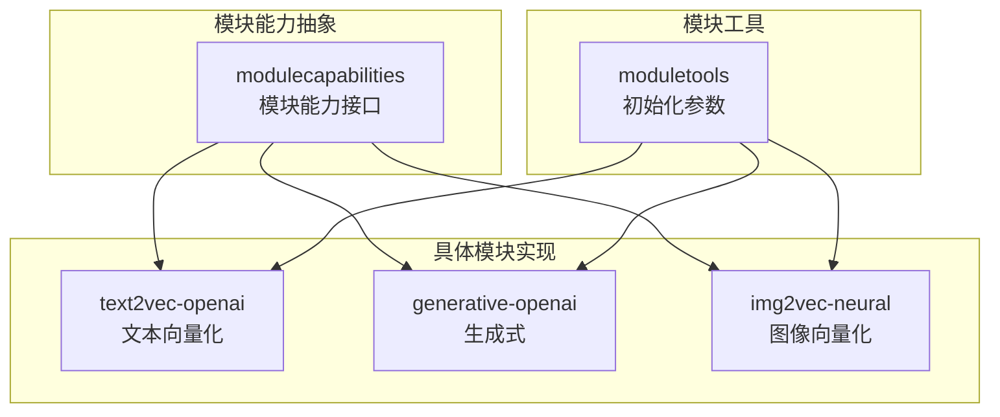
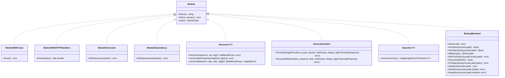
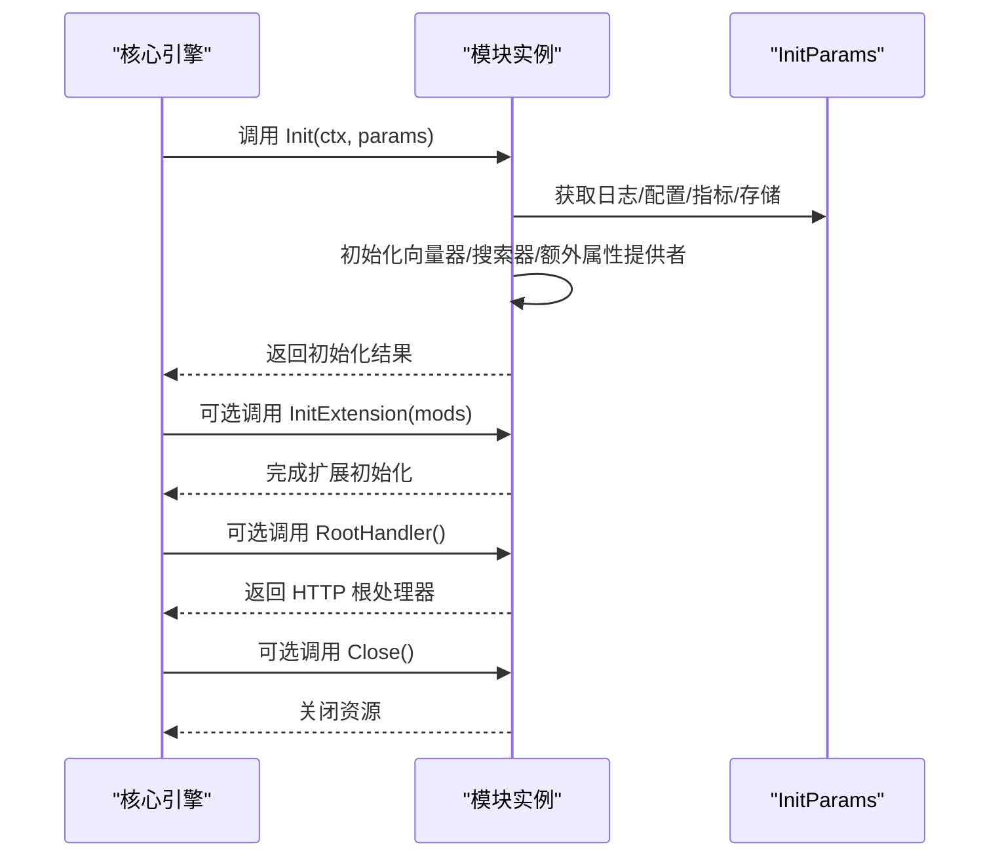
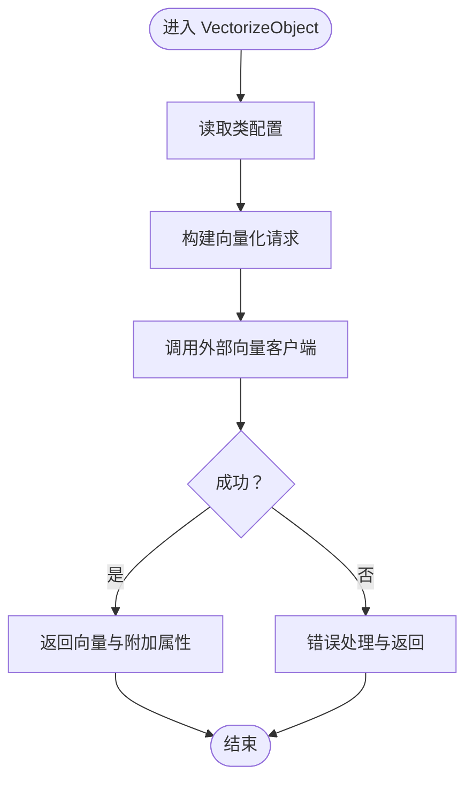
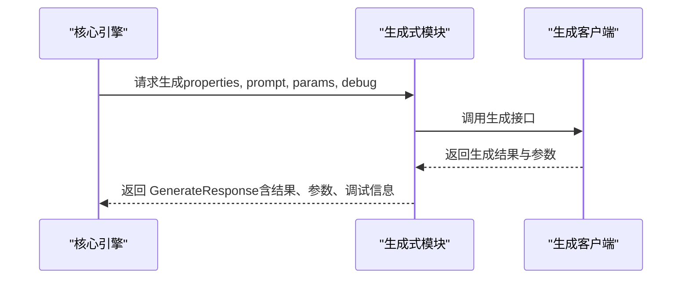
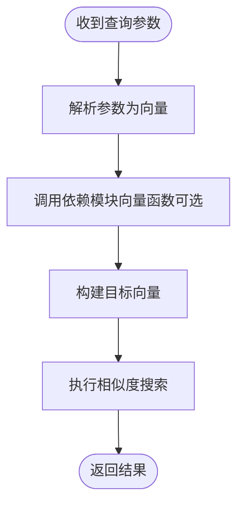
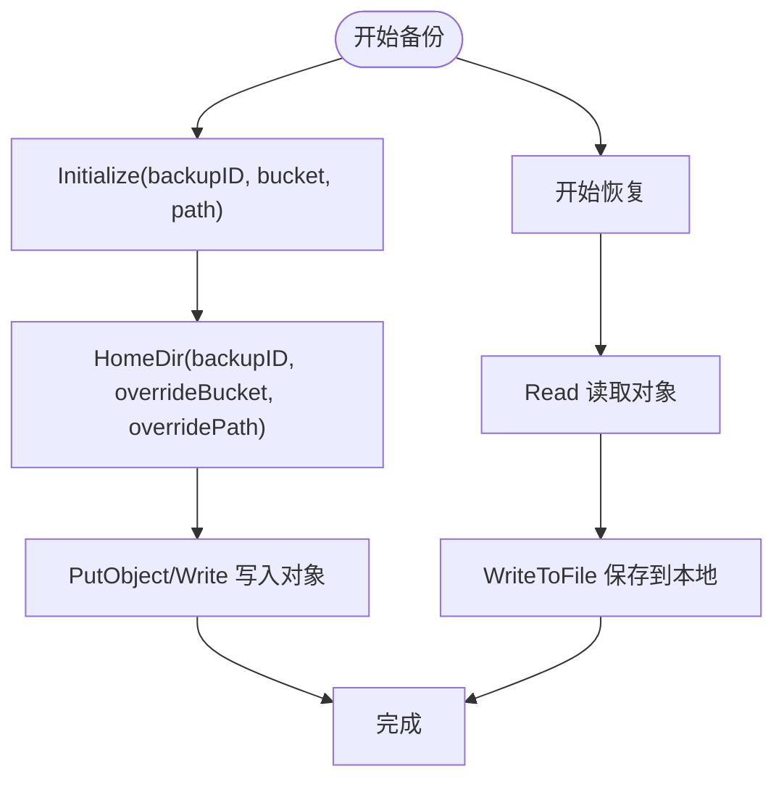
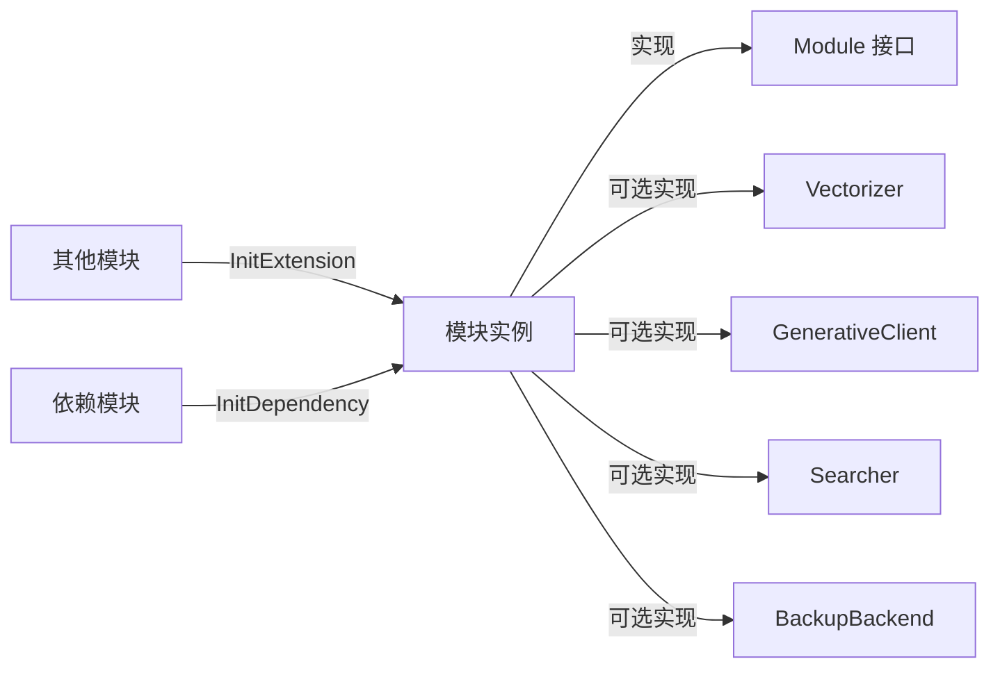

# 自定义模块开发

<cite>
**本文引用的文件**
- [entities/modulecapabilities/module.go](file://entities/modulecapabilities/module.go)
- [entities/moduletools/init_params.go](file://entities/moduletools/init_params.go)
- [entities/modulecapabilities/vectorizer.go](file://entities/modulecapabilities/vectorizer.go)
- [entities/modulecapabilities/generative.go](file://entities/modulecapabilities/generative.go)
- [entities/modulecapabilities/searcher.go](file://entities/modulecapabilities/searcher.go)
- [entities/modulecapabilities/backup.go](file://entities/modulecapabilities/backup.go)
- [modules/text2vec-openai/module.go](file://modules/text2vec-openai/module.go)
- [modules/text2vec-openai/config.go](file://modules/text2vec-openai/config.go)
- [modules/generative-openai/module.go](file://modules/generative-openai/module.go)
- [modules/generative-openai/config.go](file://modules/generative-openai/config.go)
- [modules/img2vec-neural/module.go](file://modules/img2vec-neural/module.go)
- [modules/img2vec-neural/config.go](file://modules/img2vec-neural/config.go)
</cite>

## 目录
1. [简介](#简介)
2. [项目结构](#项目结构)
3. [核心组件](#核心组件)
4. [架构总览](#架构总览)
5. [详细组件分析](#详细组件分析)
6. [依赖关系分析](#依赖关系分析)
7. [性能考虑](#性能考虑)
8. [故障排查指南](#故障排查指南)
9. [结论](#结论)
10. [附录](#附录)

## 简介
本指南面向 Weaviate 自定义模块开发者，系统讲解模块系统的架构与扩展机制，深入说明 Module 接口的实现要求与生命周期管理，阐述 ModuleCapability 能力接口（向量化、生成式、搜索、备份等）的职责与用法，并给出模块初始化参数（InitParams）的配置与使用方法。文档还提供从接口实现到注册部署的完整开发流程、测试与调试建议、性能优化策略、模块间依赖与数据流转说明，以及多个真实模块示例与最佳实践。

## 项目结构
Weaviate 将模块能力抽象集中在 entities/modulecapabilities 中，模块实现位于 modules/<capability>-<provider>/ 目录下。每个模块通常包含：
- 模块入口与生命周期：module.go
- 类级配置与校验：config.go
- 能力实现：如向量化、生成式、搜索、备份等子目录或接口实现
- 可选：HTTP 根处理器、依赖注入、指标与日志集成

图表来源
- [entities/modulecapabilities/module.go](file://entities/modulecapabilities/module.go#L45-L90)
- [entities/moduletools/init_params.go](file://entities/moduletools/init_params.go#L21-L62)
- [modules/text2vec-openai/module.go](file://modules/text2vec-openai/module.go#L48-L180)
- [modules/generative-openai/module.go](file://modules/generative-openai/module.go#L29-L88)
- [modules/img2vec-neural/module.go](file://modules/img2vec-neural/module.go#L32-L116)

章节来源
- [entities/modulecapabilities/module.go](file://entities/modulecapabilities/module.go#L12-L90)
- [entities/moduletools/init_params.go](file://entities/moduletools/init_params.go#L12-L62)

## 核心组件
- Module 接口：模块名称、初始化、类型声明；可选关闭、HTTP 根处理器、扩展/依赖初始化、别名、使用服务等能力接口。
- ModuleType：模块类型枚举，涵盖向量化、生成式、备份、扩展等类别。
- ModuleInitParams：模块初始化时注入的基础设施，包括存储提供者、应用状态、日志、配置、指标注册器。
- 能力接口族：
  - 向量化：Vectorizer、ReferenceVectorizer、InputVectorizer
  - 生成式：GenerativeClient、AdditionalGenerativeProperties
  - 搜索：Searcher、DependencySearcher
  - 备份：BackupBackend

章节来源
- [entities/modulecapabilities/module.go](file://entities/modulecapabilities/module.go#L24-L90)
- [entities/moduletools/init_params.go](file://entities/moduletools/init_params.go#L21-L62)
- [entities/modulecapabilities/vectorizer.go](file://entities/modulecapabilities/vectorizer.go#L25-L54)
- [entities/modulecapabilities/generative.go](file://entities/modulecapabilities/generative.go#L48-L73)
- [entities/modulecapabilities/searcher.go](file://entities/modulecapabilities/searcher.go#L35-L46)
- [entities/modulecapabilities/backup.go](file://entities/modulecapabilities/backup.go#L21-L55)

## 架构总览
Weaviate 模块系统通过统一的 Module 接口与能力接口族解耦模块实现与核心引擎。模块在初始化阶段接收 InitParams，按需实现不同能力接口，并在运行期由核心引擎调用相应方法完成向量化、生成、搜索、备份等操作。

图表来源
- [entities/modulecapabilities/module.go](file://entities/modulecapabilities/module.go#L45-L90)
- [entities/modulecapabilities/vectorizer.go](file://entities/modulecapabilities/vectorizer.go#L25-L54)
- [entities/modulecapabilities/generative.go](file://entities/modulecapabilities/generative.go#L48-L73)
- [entities/modulecapabilities/searcher.go](file://entities/modulecapabilities/searcher.go#L35-L46)
- [entities/modulecapabilities/backup.go](file://entities/modulecapabilities/backup.go#L21-L55)

## 详细组件分析

### Module 接口与生命周期
- 必须实现 Name、Init、Type；可选实现 Close、RootHandler、InitExtension、InitDependency、AltNames、SetUsageService 等。
- 初始化顺序建议：先设置日志与配置，再初始化各能力组件（如向量器、额外属性提供者、GraphQL 参数等），最后进行扩展/依赖初始化以与其他模块协作。

图表来源
- [entities/modulecapabilities/module.go](file://entities/modulecapabilities/module.go#L45-L90)
- [entities/moduletools/init_params.go](file://entities/moduletools/init_params.go#L21-L62)

章节来源
- [entities/modulecapabilities/module.go](file://entities/modulecapabilities/module.go#L45-L90)
- [entities/moduletools/init_params.go](file://entities/moduletools/init_params.go#L21-L62)

### 向量化能力（Vectorizer）
- 职责：对对象或输入文本生成向量，支持批量处理与属性范围判定。
- 常见模式：在 Init 中构建向量客户端与批处理策略，在 VectorizeObject/VectorizeBatch 中调用底层实现，并上报监控指标。
- 典型模块参考：text2vec-openai、img2vec-neural。

图表来源
- [entities/modulecapabilities/vectorizer.go](file://entities/modulecapabilities/vectorizer.go#L25-L54)
- [modules/text2vec-openai/module.go](file://modules/text2vec-openai/module.go#L128-L161)
- [modules/img2vec-neural/module.go](file://modules/img2vec-neural/module.go#L91-L105)

章节来源
- [entities/modulecapabilities/vectorizer.go](file://entities/modulecapabilities/vectorizer.go#L25-L54)
- [modules/text2vec-openai/module.go](file://modules/text2vec-openai/module.go#L128-L161)
- [modules/img2vec-neural/module.go](file://modules/img2vec-neural/module.go#L91-L105)

### 生成式能力（Generative）
- 职责：根据请求参数与提示词生成结果，支持单条与批量生成，暴露额外请求/响应参数。
- 常见模式：在 Init 中初始化生成客户端与参数提供者；在 GenerateSingleResult/GenerateAllResults 中封装第三方 API 调用；可提供 Debug 信息。
- 典型模块参考：generative-openai。

图表来源
- [entities/modulecapabilities/generative.go](file://entities/modulecapabilities/generative.go#L48-L73)
- [modules/generative-openai/module.go](file://modules/generative-openai/module.go#L51-L80)

章节来源
- [entities/modulecapabilities/generative.go](file://entities/modulecapabilities/generative.go#L48-L73)
- [modules/generative-openai/module.go](file://modules/generative-openai/module.go#L51-L80)

### 搜索能力（Searcher 与 DependencySearcher）
- 职责：将查询参数转换为向量，供检索使用；DependencySearcher 支持依赖其他模块提供的向量。
- 常见模式：在模块中实现 VectorSearches，返回参数到向量的映射函数；在 InitExtension 中解析其他模块暴露的能力并绑定到本地搜索逻辑。

图表来源
- [entities/modulecapabilities/searcher.go](file://entities/modulecapabilities/searcher.go#L35-L46)
- [modules/text2vec-openai/module.go](file://modules/text2vec-openai/module.go#L86-L102)

章节来源
- [entities/modulecapabilities/searcher.go](file://entities/modulecapabilities/searcher.go#L35-L46)
- [modules/text2vec-openai/module.go](file://modules/text2vec-openai/module.go#L86-L102)

### 备份能力（BackupBackend）
- 职责：提供统一的备份/恢复后端接口，支持外部存储（如 S3/GCS）、本地文件系统等。
- 常见模式：实现 Initialize、HomeDir、PutObject/Write、GetObject/Read、WriteToFile 等方法；在模块初始化时验证权限与路径。

图表来源
- [entities/modulecapabilities/backup.go](file://entities/modulecapabilities/backup.go#L21-L55)

章节来源
- [entities/modulecapabilities/backup.go](file://entities/modulecapabilities/backup.go#L21-L55)

### 模块初始化参数（InitParams）
- 提供存储提供者、应用状态、日志、配置、指标注册器等基础设施。
- 使用建议：在 Init 中优先获取日志与配置，随后初始化各能力组件；对第三方 HTTP 客户端设置超时；注册 Prometheus 指标以便监控。

章节来源
- [entities/moduletools/init_params.go](file://entities/moduletools/init_params.go#L21-L62)

### 配置与校验（ClassConfigurator）
- 模块可通过 ClassConfigDefaults、PropertyConfigDefaults、ValidateClass 提供默认配置、属性默认值与类级校验。
- 建议：为每种能力提供合理的默认值，避免用户遗漏关键配置；在校验中检查环境变量与必填项。

章节来源
- [modules/text2vec-openai/config.go](file://modules/text2vec-openai/config.go#L25-L47)
- [modules/generative-openai/config.go](file://modules/generative-openai/config.go#L24-L39)
- [modules/img2vec-neural/config.go](file://modules/img2vec-neural/config.go#L24-L39)

### 实际模块示例与最佳实践

#### 文本向量化模块（text2vec-openai）
- 生命周期：Init -> 初始化向量器与额外属性提供者 -> InitExtension 绑定 nearText 转换器 -> 提供 VectorizeObject/VectorizeBatch/MetaInfo/AdditionalProperties。
- 批处理：内置批处理设置，限制最大时间、对象数与 token 数，返回速率限制与错误映射。
- 监控：对单条与批量请求计数与长度观测，上报模块外部请求指标。

章节来源
- [modules/text2vec-openai/module.go](file://modules/text2vec-openai/module.go#L48-L180)
- [modules/text2vec-openai/config.go](file://modules/text2vec-openai/config.go#L25-L47)

#### 图像向量化模块（img2vec-neural）
- 生命周期：Init -> 初始化远程向量客户端并等待启动 -> 初始化 nearImage GraphQL 参数 -> 提供 VectorizeObject/VectorizeBatch/VectorizableProperties。
- 环境变量：需要 IMAGE_INFERENCE_API；若缺失则初始化失败。
- 批处理：复用通用批处理工具。

章节来源
- [modules/img2vec-neural/module.go](file://modules/img2vec-neural/module.go#L32-L116)
- [modules/img2vec-neural/config.go](file://modules/img2vec-neural/config.go#L24-L39)

#### 生成式模块（generative-openai）
- 生命周期：Init -> 初始化生成客户端与额外参数提供者 -> 提供 MetaInfo/AdditionalGenerativeProperties。
- 环境变量：OPENAI_APIKEY、OPENAI_ORGANIZATION、AZURE_APIKEY。
- 参数：通过 AdditionalGenerativeProperties 暴露 GraphQL 输入字段与提取函数。

章节来源
- [modules/generative-openai/module.go](file://modules/generative-openai/module.go#L29-L88)
- [modules/generative-openai/config.go](file://modules/generative-openai/config.go#L24-L39)

## 依赖关系分析
- 模块与能力接口：模块实现 Module 接口，并按需实现 Vectorizer、GenerativeClient、Searcher、BackupBackend 等能力接口。
- 模块间依赖：通过 InitExtension/InitDependency 解析其他模块暴露的能力（如 TextTransformers、VectorSearches），实现跨模块协作。
- 外部依赖：HTTP 客户端、存储提供者、日志与指标库、第三方 API。

图表来源
- [entities/modulecapabilities/module.go](file://entities/modulecapabilities/module.go#L45-L90)
- [entities/modulecapabilities/vectorizer.go](file://entities/modulecapabilities/vectorizer.go#L25-L54)
- [entities/modulecapabilities/generative.go](file://entities/modulecapabilities/generative.go#L48-L73)
- [entities/modulecapabilities/searcher.go](file://entities/modulecapabilities/searcher.go#L35-L46)
- [entities/modulecapabilities/backup.go](file://entities/modulecapabilities/backup.go#L21-L55)

章节来源
- [entities/modulecapabilities/module.go](file://entities/modulecapabilities/module.go#L45-L90)
- [entities/modulecapabilities/vectorizer.go](file://entities/modulecapabilities/vectorizer.go#L25-L54)
- [entities/modulecapabilities/generative.go](file://entities/modulecapabilities/generative.go#L48-L73)
- [entities/modulecapabilities/searcher.go](file://entities/modulecapabilities/searcher.go#L35-L46)
- [entities/modulecapabilities/backup.go](file://entities/modulecapabilities/backup.go#L21-L55)

## 性能考虑
- 批处理：合理设置批大小、时间窗口与 token 上限，减少外部调用次数与网络开销。
- 超时控制：为外部 HTTP 客户端设置合适的超时，避免阻塞请求线程。
- 指标监控：对请求计数、批量长度、请求大小进行观测，定位性能瓶颈。
- 缓存与重试：在模块层面对热点数据进行缓存，结合指数退避重试策略提升稳定性。
- 并发与资源：在 Close 中释放连接池、通道与后台 goroutine，避免资源泄漏。

## 故障排查指南
- 初始化失败：检查环境变量是否正确设置（如 OPENAI_APIKEY、IMAGE_INFERENCE_API），确认网络可达性与权限。
- 向量化异常：查看外部服务返回的错误码与消息，结合日志与指标定位问题；必要时降低批大小或增加重试。
- 生成式异常：核对请求参数与提示词长度，启用 Debug 输出获取第三方服务返回的调试信息。
- 备份异常：确认备份后端的桶/路径权限，检查 Initialize 是否成功；对比 Write/Read 与 WriteToFile 的行为差异。

章节来源
- [modules/text2vec-openai/module.go](file://modules/text2vec-openai/module.go#L70-L84)
- [modules/img2vec-neural/module.go](file://modules/img2vec-neural/module.go#L57-L70)
- [modules/generative-openai/module.go](file://modules/generative-openai/module.go#L51-L62)
- [entities/modulecapabilities/backup.go](file://entities/modulecapabilities/backup.go#L46-L54)

## 结论
Weaviate 的模块系统通过清晰的接口分层与能力抽象，为开发者提供了高度可扩展的自定义能力框架。遵循本文的实现规范与最佳实践，可在保证性能与稳定性的前提下快速开发高质量的自定义模块，并与现有模块生态无缝协作。

## 附录
- 开发步骤概览
  - 设计模块类型与能力边界（向量化/生成/搜索/备份）
  - 实现 Module 接口与 Init/Close 生命周期
  - 按需实现能力接口（Vectorizer/GenerativeClient/Searcher/BackupBackend）
  - 在 Init 中使用 InitParams 注入基础设施，初始化外部客户端与批处理策略
  - 提供 ClassConfigDefaults/PropertyConfigDefaults/ValidateClass
  - 在 InitExtension/InitDependency 中解析与其他模块的依赖关系
  - 编写单元测试与集成测试，覆盖正常路径与异常路径
  - 部署与监控：注册模块、观察指标、收集日志、定期压测