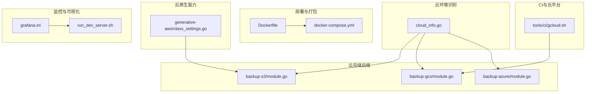
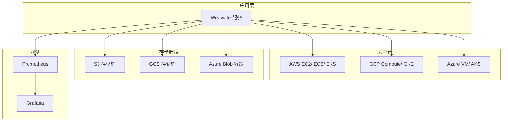
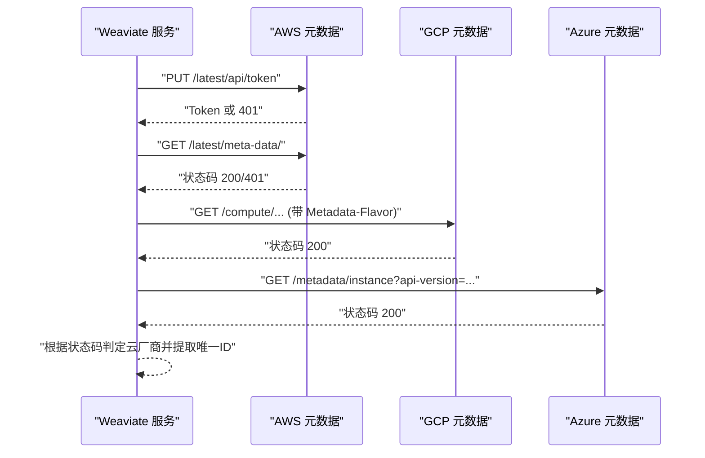
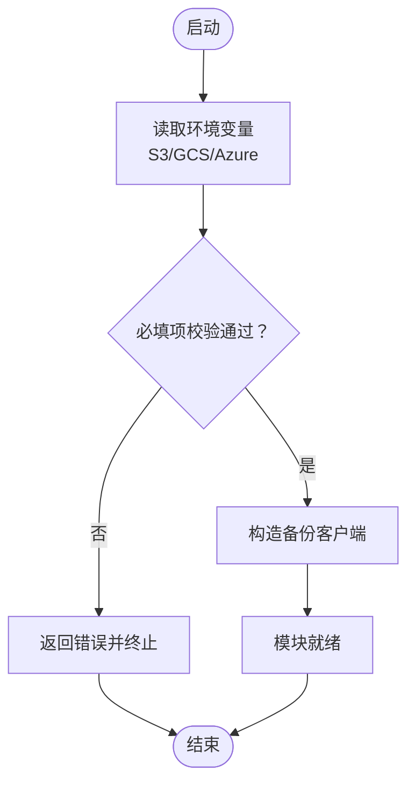
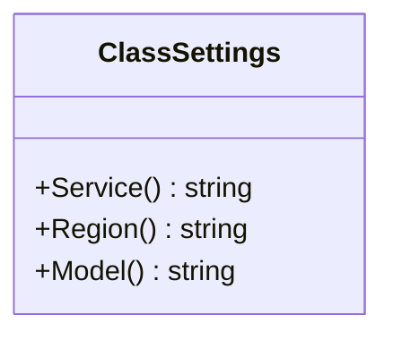
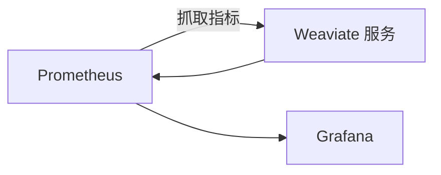
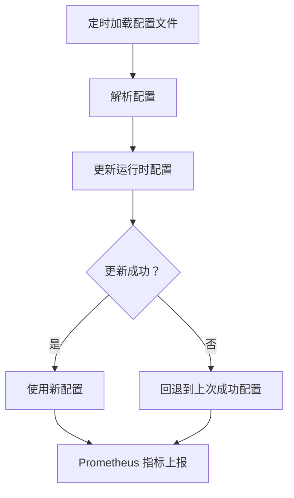
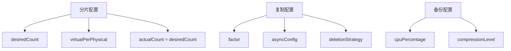
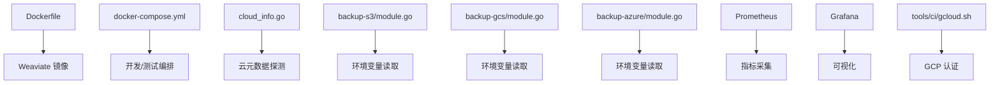

# 云平台集成

<cite>
**本文引用的文件**
- [README.md](file://README.md)
- [Dockerfile](file://Dockerfile)
- [docker-compose.yml](file://docker-compose.yml)
- [cloud_info.go](file://usecases/telemetry/cloud_info.go)
- [module.go（S3 备份）](file://modules/backup-s3/module.go)
- [module.go（GCS 备份）](file://modules/backup-gcs/module.go)
- [module.go（Azure 备份）](file://modules/backup-azure/module.go)
- [class_settings.go（AWS 生成式模块）](file://modules/generative-aws/config/class_settings.go)
- [gcloud.sh](file://tools/ci/gcloud.sh)
- [grafana.ini](file://tools/dev/grafana/grafana.ini)
- [run_dev_server.sh](file://tools/dev/run_dev_server.sh)
- [backup_config.go](file://entities/models/backup_config.go)
- [replication_config.go](file://entities/models/replication_config.go)
- [config.go（分片配置）](file://usecases/sharding/config/config.go)
- [config_handler.go（资源使用与CORS）](file://usecases/config/config_handler.go)
- [manager.go（运行时配置管理）](file://usecases/config/runtime/manager.go)
</cite>

## 目录
1. [简介](#简介)
2. [项目结构](#项目结构)
3. [核心组件](#核心组件)
4. [架构总览](#架构总览)
5. [详细组件分析](#详细组件分析)
6. [依赖关系分析](#依赖关系分析)
7. [性能考量](#性能考量)
8. [故障排查指南](#故障排查指南)
9. [结论](#结论)
10. [附录](#附录)

## 简介
本文件面向云平台工程师与 DevOps 团队，系统化梳理 Weaviate 在云平台（AWS、Google Cloud、Azure）中的集成方式与最佳实践，覆盖部署策略、云存储后端（S3/GCS/Azure Blob）、云原生服务（容器化、监控、备份）、安全配置（IAM/网络/密钥管理）、成本优化与资源监控、跨区域与灾备、以及迁移与运维建议。文档以仓库现有实现为依据，结合可操作的配置项与流程图进行说明。

## 项目结构
Weaviate 采用模块化与多语言客户端并存的组织方式。与云平台集成相关的关键位置包括：
- 部署与打包：Dockerfile、docker-compose.yml
- 云环境识别：usecases/telemetry/cloud_info.go
- 云存储后端模块：modules/backup-s3、modules/backup-gcs、modules/backup-azure
- 云原生生成式能力（AWS）：modules/generative-aws/config/class_settings.go
- CI/云平台工具链：tools/ci/gcloud.sh
- 监控与可视化：tools/dev/grafana/*、tools/dev/run_dev_server.sh
- 运行时配置与资源限制：usecases/config/*、entities/models/*

图表来源
- [Dockerfile](file://Dockerfile#L1-L57)
- [docker-compose.yml](file://docker-compose.yml#L1-L140)
- [cloud_info.go](file://usecases/telemetry/cloud_info.go#L61-L148)
- [module.go（S3 备份）](file://modules/backup-s3/module.go#L25-L108)
- [module.go（GCS 备份）](file://modules/backup-gcs/module.go#L24-L111)
- [module.go（Azure 备份）](file://modules/backup-azure/module.go#L24-L111)
- [class_settings.go（AWS 生成式模块）](file://modules/generative-aws/config/class_settings.go#L190-L200)
- [gcloud.sh](file://tools/ci/gcloud.sh#L1-L26)
- [grafana.ini](file://tools/dev/grafana/grafana.ini#L1-L45)
- [run_dev_server.sh](file://tools/dev/run_dev_server.sh#L1139-L1178)

章节来源
- [README.md](file://README.md#L1-L181)
- [Dockerfile](file://Dockerfile#L1-L57)
- [docker-compose.yml](file://docker-compose.yml#L1-L140)

## 核心组件
- 云环境识别：通过元数据探测 AWS/GCP/Azure，返回云厂商与唯一标识，便于日志与遥测区分环境。
- 云存储后端模块：S3、GCS、Azure Blob Storage 的备份模块，通过环境变量配置端点、桶/容器、路径与 SSL。
- 云原生生成式能力：AWS 生成式模块支持指定服务、区域与模型等参数。
- 监控与可视化：Prometheus + Grafana 开箱即用，便于在容器化环境中快速搭建观测面。
- 运行时配置与资源限制：支持从环境加载配置、资源使用阈值与 CORS 设置，保障生产稳定性。

章节来源
- [cloud_info.go](file://usecases/telemetry/cloud_info.go#L61-L148)
- [module.go（S3 备份）](file://modules/backup-s3/module.go#L25-L108)
- [module.go（GCS 备份）](file://modules/backup-gcs/module.go#L24-L111)
- [module.go（Azure 备份）](file://modules/backup-azure/module.go#L24-L111)
- [class_settings.go（AWS 生成式模块）](file://modules/generative-aws/config/class_settings.go#L190-L200)
- [grafana.ini](file://tools/dev/grafana/grafana.ini#L1-L45)
- [run_dev_server.sh](file://tools/dev/run_dev_server.sh#L1139-L1178)
- [config_handler.go（资源使用与CORS）](file://usecases/config/config_handler.go#L509-L547)

## 架构总览
Weaviate 在云平台上的典型运行形态如下：
- 容器化部署：使用 Dockerfile 构建镜像，docker-compose 编排服务与监控组件。
- 云环境识别：启动时探测 EC2/GCE/Azure 实例元数据，自动识别云厂商。
- 云存储后端：通过模块化备份插件对接 S3/GCS/Azure Blob，统一备份与归档流程。
- 云原生生成式：AWS 生成式模块按需调用云上模型服务。
- 观测性：Prometheus 收集指标，Grafana 可视化仪表盘，便于云原生监控。

图表来源
- [cloud_info.go](file://usecases/telemetry/cloud_info.go#L61-L148)
- [module.go（S3 备份）](file://modules/backup-s3/module.go#L25-L108)
- [module.go（GCS 备份）](file://modules/backup-gcs/module.go#L24-L111)
- [module.go（Azure 备份）](file://modules/backup-azure/module.go#L24-L111)
- [run_dev_server.sh](file://tools/dev/run_dev_server.sh#L1139-L1178)

## 详细组件分析

### 云环境识别（AWS/GCP/Azure）
- 机制：通过实例元数据服务探测云厂商，并提取账户/项目/订阅等唯一标识，用于日志与遥测。
- 行为：不同云厂商使用不同的元数据端点与请求头；成功探测后返回对应云厂商与唯一ID。
- 用途：区分开发/测试/生产环境，辅助告警与审计。

图表来源
- [cloud_info.go](file://usecases/telemetry/cloud_info.go#L61-L148)

章节来源
- [cloud_info.go](file://usecases/telemetry/cloud_info.go#L61-L148)

### 云存储后端集成（S3/GCS/Azure Blob）
- 统一接口：三类备份模块均实现统一的模块接口，支持通过环境变量配置端点、桶/容器、路径与 SSL。
- 关键配置项：
  - S3：BACKUP_S3_ENDPOINT、BACKUP_S3_BUCKET、BACKUP_S3_PATH、BACKUP_S3_USE_SSL
  - GCS：BACKUP_GCS_BUCKET、BACKUP_GCS_PATH
  - Azure：BACKUP_AZURE_CONTAINER、BACKUP_AZURE_PATH
- 初始化流程：读取环境变量，校验必填项，构造客户端并完成初始化；支持 MetaInfo 输出端点/桶/路径/SSL 等信息。

图表来源
- [module.go（S3 备份）](file://modules/backup-s3/module.go#L70-L89)
- [module.go（GCS 备份）](file://modules/backup-gcs/module.go#L74-L94)
- [module.go（Azure 备份）](file://modules/backup-azure/module.go#L74-L94)

章节来源
- [module.go（S3 备份）](file://modules/backup-s3/module.go#L25-L108)
- [module.go（GCS 备份）](file://modules/backup-gcs/module.go#L24-L111)
- [module.go（Azure 备份）](file://modules/backup-azure/module.go#L24-L111)

### 云原生生成式能力（AWS）
- 参数支持：模块类设置支持 Service、Region、Model 等参数，便于在云上选择具体服务与模型。
- 适用场景：在 Kubernetes/ECS/EKS 等云原生平台上按需弹性扩缩容生成式推理。

图表来源
- [class_settings.go（AWS 生成式模块）](file://modules/generative-aws/config/class_settings.go#L190-L200)

章节来源
- [class_settings.go（AWS 生成式模块）](file://modules/generative-aws/config/class_settings.go#L190-L200)

### 监控与可视化（Prometheus + Grafana）
- 开箱即用：docker-compose 中包含 Prometheus 与 Grafana 服务，提供本地开发与测试环境的可观测性。
- 运行脚本：run_dev_server.sh 可一键拉起 Prometheus 与 Grafana，并挂载配置与仪表盘。
- 配置入口：grafana.ini 提供基础配置项，便于定制管理员密码与日志级别。

图表来源
- [docker-compose.yml](file://docker-compose.yml#L21-L41)
- [run_dev_server.sh](file://tools/dev/run_dev_server.sh#L1139-L1178)
- [grafana.ini](file://tools/dev/grafana/grafana.ini#L1-L45)

章节来源
- [docker-compose.yml](file://docker-compose.yml#L21-L41)
- [run_dev_server.sh](file://tools/dev/run_dev_server.sh#L1139-L1178)
- [grafana.ini](file://tools/dev/grafana/grafana.ini#L1-L45)

### 运行时配置与资源限制
- 运行时配置管理：支持周期性从文件加载配置，失败时回退到上次成功配置，保证稳定性。
- 资源使用阈值：支持磁盘与内存使用率的警告与只读阈值配置，避免资源耗尽导致的不稳定。
- CORS：支持允许的来源、方法与头部配置，便于前端跨域访问。

图表来源
- [manager.go（运行时配置管理）](file://usecases/config/runtime/manager.go#L46-L83)
- [config_handler.go（资源使用与CORS）](file://usecases/config/config_handler.go#L509-L547)

章节来源
- [manager.go（运行时配置管理）](file://usecases/config/runtime/manager.go#L46-L83)
- [config_handler.go（资源使用与CORS）](file://usecases/config/config_handler.go#L509-L547)

### 分片与复制配置（横向扩展与高可用）
- 分片计数：支持 desiredCount、virtualPerPhysical 等参数，当前版本实际与期望一致。
- 复制配置：支持复制因子与异步配置，以及冲突解决策略（如时间戳优先）。
- 备份配置：支持 CPU 百分比与压缩等级等参数，便于在备份时控制资源占用。

图表来源
- [config.go（分片配置）](file://usecases/sharding/config/config.go#L110-L192)
- [replication_config.go](file://entities/models/replication_config.go#L44-L97)
- [backup_config.go](file://entities/models/backup_config.go#L49-L102)

章节来源
- [config.go（分片配置）](file://usecases/sharding/config/config.go#L110-L192)
- [replication_config.go](file://entities/models/replication_config.go#L44-L97)
- [backup_config.go](file://entities/models/backup_config.go#L49-L102)

## 依赖关系分析
- 部署与打包：Dockerfile 产出精简镜像，docker-compose 提供本地开发与测试编排。
- 云识别：cloud_info.go 依赖各云厂商元数据端点，无外部 SDK 即可完成探测。
- 备份模块：S3/GCS/Azure 模块分别依赖对应云 SDK，初始化时读取环境变量。
- 监控：Prometheus 与 Grafana 通过 docker-compose 与 run_dev_server.sh 管理。
- CI：gcloud.sh 展示了 Google Cloud CLI 的安装与认证流程，便于在流水线中使用。

图表来源
- [Dockerfile](file://Dockerfile#L1-L57)
- [docker-compose.yml](file://docker-compose.yml#L1-L140)
- [cloud_info.go](file://usecases/telemetry/cloud_info.go#L61-L148)
- [module.go（S3 备份）](file://modules/backup-s3/module.go#L70-L89)
- [module.go（GCS 备份）](file://modules/backup-gcs/module.go#L74-L94)
- [module.go（Azure 备份）](file://modules/backup-azure/module.go#L74-L94)
- [run_dev_server.sh](file://tools/dev/run_dev_server.sh#L1139-L1178)
- [gcloud.sh](file://tools/ci/gcloud.sh#L1-L26)

章节来源
- [Dockerfile](file://Dockerfile#L1-L57)
- [docker-compose.yml](file://docker-compose.yml#L1-L140)
- [cloud_info.go](file://usecases/telemetry/cloud_info.go#L61-L148)
- [module.go（S3 备份）](file://modules/backup-s3/module.go#L70-L89)
- [module.go（GCS 备份）](file://modules/backup-gcs/module.go#L74-L94)
- [module.go（Azure 备份）](file://modules/backup-azure/module.go#L74-L94)
- [run_dev_server.sh](file://tools/dev/run_dev_server.sh#L1139-L1178)
- [gcloud.sh](file://tools/ci/gcloud.sh#L1-L26)

## 性能考量
- 备份资源占用：通过备份配置中的 CPU 百分比与压缩等级，平衡备份速度与资源消耗。
- 分片与复制：合理设置分片数量与复制因子，提升查询与写入吞吐，同时考虑存储与网络开销。
- 监控与告警：Prometheus + Grafana 提供基础观测面，建议结合云平台原生监控（CloudWatch/GCP Monitoring/Azure Monitor）进行综合告警。
- 容器资源限制：在 Kubernetes 中为 Weaviate Pod 设置合理的 CPU/内存请求与限制，避免突发流量导致 OOM。

章节来源
- [backup_config.go](file://entities/models/backup_config.go#L49-L102)
- [config.go（分片配置）](file://usecases/sharding/config/config.go#L110-L192)
- [replication_config.go](file://entities/models/replication_config.go#L44-L97)
- [run_dev_server.sh](file://tools/dev/run_dev_server.sh#L1139-L1178)

## 故障排查指南
- 云环境识别失败
  - 现象：无法识别云厂商或唯一ID为空。
  - 排查：确认实例元数据可达、请求头正确；检查网络策略与安全组放行。
  - 参考：cloud_info.go 中的元数据端点与请求头。
- 备份初始化失败
  - 现象：S3/GCS/Azure 备份模块初始化报错。
  - 排查：核对必填环境变量（桶/容器、路径等），确认 SSL 配置；检查云上权限与网络连通。
  - 参考：各备份模块的 Init 流程与环境变量定义。
- 监控不可用
  - 现象：Grafana 无法连接 Prometheus 或仪表盘缺失。
  - 排查：确认 run_dev_server.sh 已启动 Prometheus/Grafana；检查端口映射与挂载目录；验证 grafana.ini 配置。
- 资源使用触发只读
  - 现象：磁盘/内存使用超过阈值，服务进入只读。
  - 排查：调整阈值配置或扩容节点；检查备份与索引重建任务的资源占用。
- CORS 导致跨域失败
  - 现象：浏览器跨域请求被拒绝。
  - 排查：检查 CORS 允许的来源、方法与头部配置。

章节来源
- [cloud_info.go](file://usecases/telemetry/cloud_info.go#L61-L148)
- [module.go（S3 备份）](file://modules/backup-s3/module.go#L70-L89)
- [module.go（GCS 备份）](file://modules/backup-gcs/module.go#L74-L94)
- [module.go（Azure 备份）](file://modules/backup-azure/module.go#L74-L94)
- [run_dev_server.sh](file://tools/dev/run_dev_server.sh#L1139-L1178)
- [config_handler.go（资源使用与CORS）](file://usecases/config/config_handler.go#L509-L547)

## 结论
Weaviate 在云平台集成方面具备良好的模块化与可移植性：通过云环境识别、标准化的备份后端、云原生生成式能力与开箱即用的监控体系，能够在 AWS、GCP、Azure 上实现一致的部署体验与运维模式。结合合理的资源配置、备份策略与观测体系，可满足生产级的可用性、性能与成本要求。

## 附录
- 安装与入门：参考仓库 README 中的安装与快速开始指引，了解 Docker/Kubernetes/Marketplace 等部署方式。
- CI/云平台工具链：gcloud.sh 展示了 GCP CLI 的安装与认证流程，便于在 CI 中使用。

章节来源
- [README.md](file://README.md#L1-L181)
- [gcloud.sh](file://tools/ci/gcloud.sh#L1-L26)