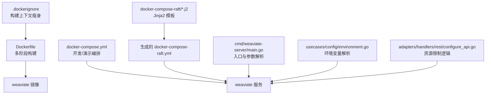
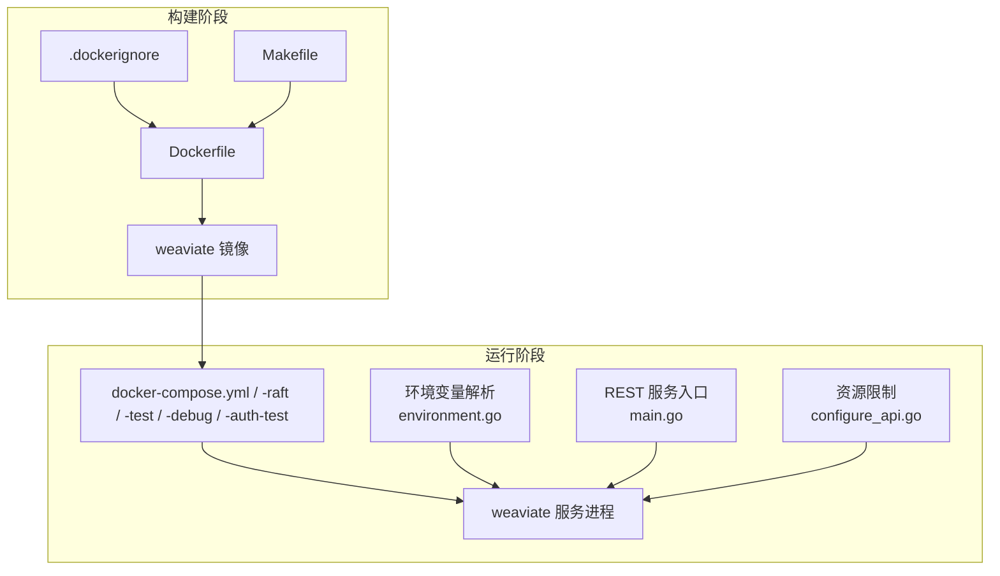
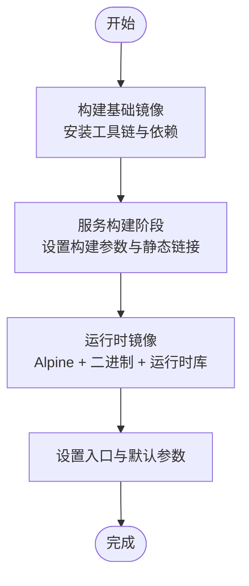
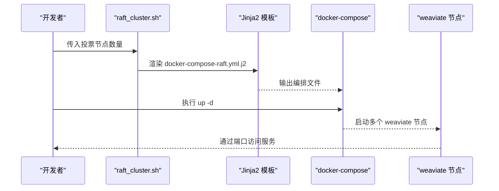
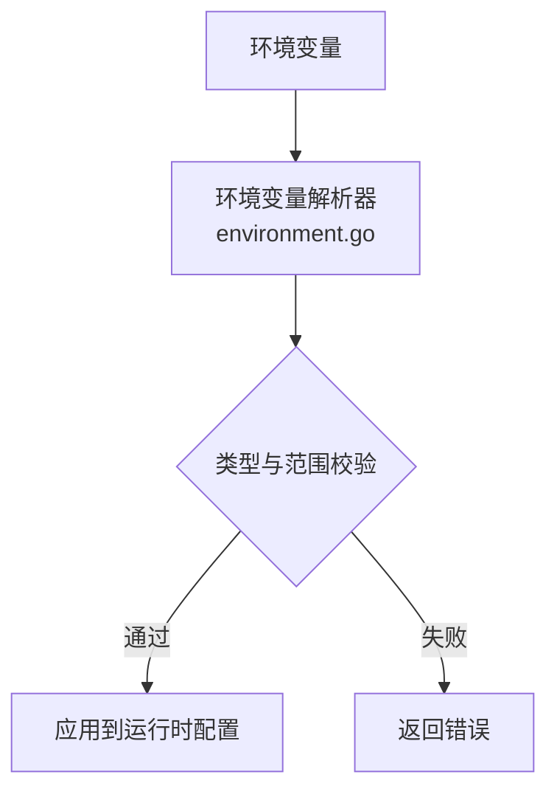
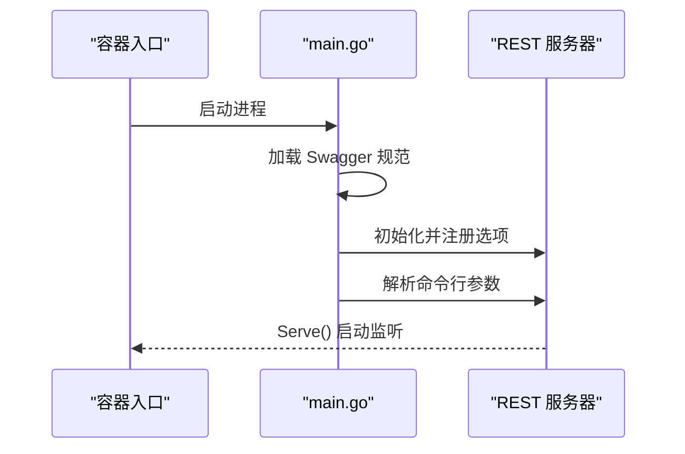
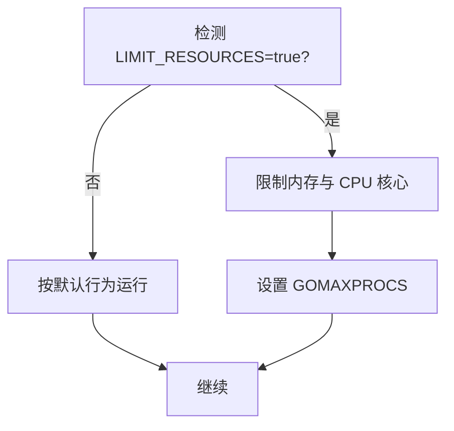
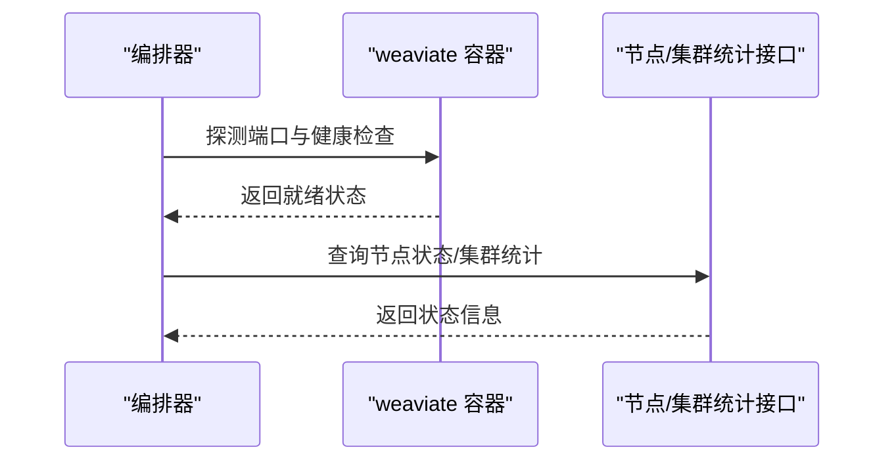
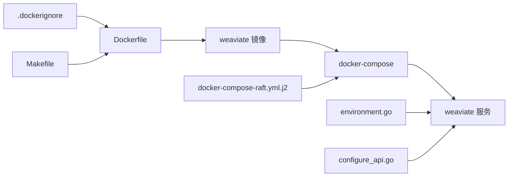

# 容器化部署

<cite>
**本文引用的文件**
- [Dockerfile](file://Dockerfile)
- [.dockerignore](file://.dockerignore)
- [docker-compose.yml](file://docker-compose.yml)
- [docker-compose-raft/docker-compose-raft.yml.j2](file://docker-compose-raft/docker-compose-raft.yml.j2)
- [docker-compose-raft/raft_cluster.sh](file://docker-compose-raft/raft_cluster.sh)
- [docker-compose-test.yml](file://docker-compose-test.yml)
- [docker-compose-debug.yml](file://docker-compose-debug.yml)
- [docker-compose-auth-test.yml](file://docker-compose-auth-test.yml)
- [cmd/weaviate-server/main.go](file://cmd/weaviate-server/main.go)
- [Makefile](file://Makefile)
- [usecases/config/environment.go](file://usecases/config/environment.go)
- [usecases/config/environment_test.go](file://usecases/config/environment_test.go)
- [adapters/handlers/rest/configure_api.go](file://adapters/handlers/rest/configure_api.go)
- [client/nodes/nodes_client.go](file://client/nodes/nodes_client.go)
- [client/cluster/cluster_get_statistics_responses.go](file://client/cluster/cluster_get_statistics_responses.go)
- [test/docker/weaviate.go](file://test/docker/weaviate.go)
</cite>

## 目录
1. [简介](#简介)
2. [项目结构](#项目结构)
3. [核心组件](#核心组件)
4. [架构总览](#架构总览)
5. [详细组件分析](#详细组件分析)
6. [依赖关系分析](#依赖关系分析)
7. [性能考量](#性能考量)
8. [故障排除指南](#故障排除指南)
9. [结论](#结论)
10. [附录](#附录)

## 简介
本文件面向容器化部署工程师，提供 Weaviate 在容器环境中的完整部署与运维指南。内容覆盖 Docker 镜像多阶段构建与优化、docker-compose 单节点与多节点（Raft）编排、环境变量与卷挂载策略、网络配置、健康检查与启动参数、资源限制与调试技巧，并给出安全最佳实践建议。文中所有技术细节均基于仓库现有文件进行分析与总结。

## 项目结构
Weaviate 的容器化能力由以下关键文件支撑：
- Dockerfile：定义多阶段构建流程、构建参数与最终运行镜像入口。
- .dockerignore：控制构建上下文与产物体积，避免无关文件进入镜像。
- docker-compose.yml：开发与演示用的多服务编排模板（含监控、模块服务等）。
- docker-compose-raft：使用 Jinja2 模板生成 Raft 多节点集群编排。
- docker-compose-test.yml、docker-compose-debug.yml、docker-compose-auth-test.yml：分别用于测试、调试与鉴权测试场景。
- cmd/weaviate-server/main.go：服务入口，解析命令行参数并启动 REST 服务。
- Makefile：统一构建与打包目标，支持跨平台镜像构建。
- usecases/config/environment.go：从环境变量解析配置，是容器环境变量体系的核心。
- adapters/handlers/rest/configure_api.go：资源限制逻辑与运行时行为控制。
- client/*：客户端接口定义，便于在容器内调用节点状态与集群统计等端点。
- test/docker/weaviate.go：容器测试基础设施，展示如何通过端口映射与健康检查验证容器可用性。

**图表来源**
- [Dockerfile](file://Dockerfile#L1-L57)
- [.dockerignore](file://.dockerignore#L1-L44)
- [docker-compose.yml](file://docker-compose.yml#L1-L140)
- [docker-compose-raft/docker-compose-raft.yml.j2](file://docker-compose-raft/docker-compose-raft.yml.j2#L1-L85)
- [cmd/weaviate-server/main.go](file://cmd/weaviate-server/main.go#L30-L69)
- [usecases/config/environment.go](file://usecases/config/environment.go#L1310-L1356)
- [adapters/handlers/rest/configure_api.go](file://adapters/handlers/rest/configure_api.go#L2081-L2100)

**章节来源**
- [Dockerfile](file://Dockerfile#L1-L57)
- [.dockerignore](file://.dockerignore#L1-L44)
- [docker-compose.yml](file://docker-compose.yml#L1-L140)
- [docker-compose-raft/docker-compose-raft.yml.j2](file://docker-compose-raft/docker-compose-raft.yml.j2#L1-L85)
- [docker-compose-test.yml](file://docker-compose-test.yml#L1-L51)
- [docker-compose-debug.yml](file://docker-compose-debug.yml#L1-L45)
- [docker-compose-auth-test.yml](file://docker-compose-auth-test.yml#L1-L35)
- [cmd/weaviate-server/main.go](file://cmd/weaviate-server/main.go#L30-L69)
- [Makefile](file://Makefile#L39-L75)
- [usecases/config/environment.go](file://usecases/config/environment.go#L1310-L1356)
- [adapters/handlers/rest/configure_api.go](file://adapters/handlers/rest/configure_api.go#L2081-L2100)
- [test/docker/weaviate.go](file://test/docker/weaviate.go#L139-L187)

## 核心组件
- 镜像构建与优化
  - 多阶段构建：分离构建环境与运行时镜像，最终仅包含最小运行时依赖与二进制。
  - 构建参数：通过 ARG 注入版本、分支、提交信息、构建用户与日期等元数据。
  - 运行入口：以最小 Alpine 基础镜像运行二进制，默认监听 0.0.0.0:8080。
- docker-compose 编排
  - 开发演示：包含 contextionary、Prometheus/Grafana、Keycloak、多种向量化与推理服务、对象存储模拟器等。
  - 测试/调试：提供独立 compose 文件，便于快速验证功能与问题定位。
  - Raft 集群：通过 Jinja2 模板动态生成多节点编排，支持指定投票节点数量与端口映射。
- 环境变量与配置
  - 通过 usecases/config/environment.go 解析大量运行时配置项，容器部署中应优先使用环境变量进行配置。
  - 支持字符串、整数、时长、正数、非负数等类型与范围校验。
- 启动参数与服务入口
  - 入口程序解析命令行参数并启动 REST 服务器；默认监听地址与端口可被容器环境覆盖。
- 资源限制与运行时行为
  - 可通过 LIMIT_RESOURCES 控制资源占用，结合 GOMAXPROCS 实现 CPU 核心限制。
- 健康检查与可观测性
  - 通过端口映射暴露健康检查与指标端点，便于容器编排器进行存活/就绪探针。
  - Prometheus/Grafana 示例用于容器化监控。

**章节来源**
- [Dockerfile](file://Dockerfile#L1-L57)
- [docker-compose.yml](file://docker-compose.yml#L1-L140)
- [docker-compose-test.yml](file://docker-compose-test.yml#L1-L51)
- [docker-compose-debug.yml](file://docker-compose-debug.yml#L1-L45)
- [docker-compose-auth-test.yml](file://docker-compose-auth-test.yml#L1-L35)
- [docker-compose-raft/docker-compose-raft.yml.j2](file://docker-compose-raft/docker-compose-raft.yml.j2#L1-L85)
- [docker-compose-raft/raft_cluster.sh](file://docker-compose-raft/raft_cluster.sh#L1-L52)
- [cmd/weaviate-server/main.go](file://cmd/weaviate-server/main.go#L30-L69)
- [usecases/config/environment.go](file://usecases/config/environment.go#L1310-L1356)
- [adapters/handlers/rest/configure_api.go](file://adapters/handlers/rest/configure_api.go#L2081-L2100)

## 架构总览
下图展示了容器化部署的整体视图：镜像构建、编排与运行时交互。

**图表来源**
- [Dockerfile](file://Dockerfile#L1-L57)
- [.dockerignore](file://.dockerignore#L1-L44)
- [Makefile](file://Makefile#L39-L75)
- [docker-compose.yml](file://docker-compose.yml#L1-L140)
- [docker-compose-test.yml](file://docker-compose-test.yml#L1-L51)
- [docker-compose-debug.yml](file://docker-compose-debug.yml#L1-L45)
- [docker-compose-auth-test.yml](file://docker-compose-auth-test.yml#L1-L35)
- [docker-compose-raft/docker-compose-raft.yml.j2](file://docker-compose-raft/docker-compose-raft.yml.j2#L1-L85)
- [cmd/weaviate-server/main.go](file://cmd/weaviate-server/main.go#L30-L69)
- [usecases/config/environment.go](file://usecases/config/environment.go#L1310-L1356)
- [adapters/handlers/rest/configure_api.go](file://adapters/handlers/rest/configure_api.go#L2081-L2100)

## 详细组件分析

### 组件一：Docker 镜像构建与优化
- 多阶段构建
  - 构建基础镜像安装 Go 工具链与必要依赖，下载模块依赖。
  - 服务构建阶段设置构建参数（如 TARGETARCH、GIT_*、BUILD_USER 等），静态链接构建二进制。
  - 最终运行镜像采用 Alpine，仅拷贝二进制与必要运行时库，保持最小化。
- 构建参数与注入
  - 使用 ARG 注入版本、分支、提交、构建用户与日期等信息，通过 ldflags 写入二进制元数据。
- 运行入口与默认参数
  - ENTRYPOINT 指向二进制，CMD 提供默认主机与端口参数，可在容器编排中覆盖。

**图表来源**
- [Dockerfile](file://Dockerfile#L1-L57)

**章节来源**
- [Dockerfile](file://Dockerfile#L1-L57)
- [.dockerignore](file://.dockerignore#L1-L44)
- [Makefile](file://Makefile#L39-L75)

### 组件二：docker-compose 编排配置
- 开发演示编排
  - 包含 contextionary、Prometheus、Grafana、Keycloak、多种模块服务与对象存储模拟器，便于本地集成测试。
  - 通过 volumes 将外部目录挂载到容器，便于持久化与配置管理。
- 测试/调试/鉴权测试
  - 提供独立 compose 文件，集中启用或禁用特定模块、备份路径、监控开关、集群端口等。
- Raft 多节点集群
  - 使用 Jinja2 模板根据投票节点数量生成编排文件，自动计算集群加入列表与端口映射。
  - 提供脚本一键生成并启动集群，支持扩展节点规模。

**图表来源**
- [docker-compose-raft/raft_cluster.sh](file://docker-compose-raft/raft_cluster.sh#L1-L52)
- [docker-compose-raft/docker-compose-raft.yml.j2](file://docker-compose-raft/docker-compose-raft.yml.j2#L1-L85)

**章节来源**
- [docker-compose.yml](file://docker-compose.yml#L1-L140)
- [docker-compose-test.yml](file://docker-compose-test.yml#L1-L51)
- [docker-compose-debug.yml](file://docker-compose-debug.yml#L1-L45)
- [docker-compose-auth-test.yml](file://docker-compose-auth-test.yml#L1-L35)
- [docker-compose-raft/docker-compose-raft.yml.j2](file://docker-compose-raft/docker-compose-raft.yml.j2#L1-L85)
- [docker-compose-raft/raft_cluster.sh](file://docker-compose-raft/raft_cluster.sh#L1-L52)

### 组件三：环境变量与配置
- 配置解析
  - 通过环境变量解析多种配置项，支持字符串、整数、时长、正数、非负数等类型与范围校验。
  - 提供动态值解析与校验函数，确保配置合法。
- 常见容器配置项
  - 日志级别、模块启用、持久化路径、监控开关、集群端口与主机名、Raft 参数、异步索引、Telemetry 关闭等。
- 测试与验证
  - 提供针对不同配置项的单元测试，验证解析与校验逻辑。

**图表来源**
- [usecases/config/environment.go](file://usecases/config/environment.go#L1310-L1356)
- [usecases/config/environment_test.go](file://usecases/config/environment_test.go#L637-L674)
- [usecases/config/environment_test.go](file://usecases/config/environment_test.go#L1159-L1193)

**章节来源**
- [usecases/config/environment.go](file://usecases/config/environment.go#L1310-L1356)
- [usecases/config/environment_test.go](file://usecases/config/environment_test.go#L637-L674)
- [usecases/config/environment_test.go](file://usecases/config/environment_test.go#L1159-L1193)

### 组件四：启动参数与服务入口
- 入口程序
  - 通过命令行解析器加载 Swagger 规范，初始化 REST 服务器，注册命令行选项组。
- 默认监听
  - CMD 提供默认主机与端口，可在容器编排中覆盖，满足不同网络与端口需求。

**图表来源**
- [cmd/weaviate-server/main.go](file://cmd/weaviate-server/main.go#L30-L69)

**章节来源**
- [cmd/weaviate-server/main.go](file://cmd/weaviate-server/main.go#L30-L69)

### 组件五：资源限制与运行时行为
- 资源限制
  - 通过 LIMIT_RESOURCES 控制内存与 CPU 核心使用，结合 GOMAXPROCS 设置工作线程数。
- 运行时行为
  - 当未显式设置 GOMAXPROCS 且无法从 cgroups 读取核心数时，自动回退到 NumCPU()-1。

**图表来源**
- [adapters/handlers/rest/configure_api.go](file://adapters/handlers/rest/configure_api.go#L2081-L2100)

**章节来源**
- [adapters/handlers/rest/configure_api.go](file://adapters/handlers/rest/configure_api.go#L2081-L2100)

### 组件六：健康检查与可观测性
- 健康检查
  - 通过端口映射暴露服务端口与调试端口，容器编排器可据此进行存活/就绪探针。
- 可观测性
  - Prometheus 与 Grafana 示例编排，便于在容器环境中采集与展示指标。
- 节点状态与集群统计
  - 客户端接口可用于查询节点状态与集群统计，辅助容器编排与故障诊断。

**图表来源**
- [docker-compose.yml](file://docker-compose.yml#L1-L140)
- [client/nodes/nodes_client.go](file://client/nodes/nodes_client.go#L56-L90)
- [client/cluster/cluster_get_statistics_responses.go](file://client/cluster/cluster_get_statistics_responses.go#L332-L344)
- [test/docker/weaviate.go](file://test/docker/weaviate.go#L139-L187)

**章节来源**
- [docker-compose.yml](file://docker-compose.yml#L1-L140)
- [client/nodes/nodes_client.go](file://client/nodes/nodes_client.go#L56-L90)
- [client/cluster/cluster_get_statistics_responses.go](file://client/cluster/cluster_get_statistics_responses.go#L332-L344)
- [test/docker/weaviate.go](file://test/docker/weaviate.go#L139-L187)

## 依赖关系分析
- 构建期依赖
  - Dockerfile 依赖 .dockerignore 控制构建上下文大小；Makefile 提供统一构建与镜像标签。
- 运行期依赖
  - weaviate 服务依赖环境变量解析器与 REST 服务入口；资源限制逻辑影响运行时性能。
- 编排期依赖
  - Raft 集群依赖 Jinja2 模板渲染；测试/调试编排依赖独立 compose 文件。

**图表来源**
- [.dockerignore](file://.dockerignore#L1-L44)
- [Makefile](file://Makefile#L39-L75)
- [Dockerfile](file://Dockerfile#L1-L57)
- [docker-compose-raft/docker-compose-raft.yml.j2](file://docker-compose-raft/docker-compose-raft.yml.j2#L1-L85)
- [usecases/config/environment.go](file://usecases/config/environment.go#L1310-L1356)
- [adapters/handlers/rest/configure_api.go](file://adapters/handlers/rest/configure_api.go#L2081-L2100)

**章节来源**
- [.dockerignore](file://.dockerignore#L1-L44)
- [Makefile](file://Makefile#L39-L75)
- [Dockerfile](file://Dockerfile#L1-L57)
- [docker-compose-raft/docker-compose-raft.yml.j2](file://docker-compose-raft/docker-compose-raft.yml.j2#L1-L85)
- [usecases/config/environment.go](file://usecases/config/environment.go#L1310-L1356)
- [adapters/handlers/rest/configure_api.go](file://adapters/handlers/rest/configure_api.go#L2081-L2100)

## 性能考量
- 镜像体积与启动速度
  - 多阶段构建与 .dockerignore 有效减少镜像体积，缩短拉取与启动时间。
- 运行时性能
  - 通过 LIMIT_RESOURCES 与 GOMAXPROCS 控制 CPU 与内存占用，避免资源争用。
- I/O 与持久化
  - 使用卷挂载持久化数据目录，结合合适的文件系统与磁盘性能提升整体吞吐。

[本节为通用指导，无需列出具体文件来源]

## 故障排除指南
- 容器无法就绪
  - 检查端口映射与服务监听地址是否正确；通过 compose 文件中的端口映射确认可达性。
  - 使用节点状态与集群统计接口辅助诊断。
- Raft 集群无法启动
  - 确认投票节点数量与 RAFT_JOIN 列表一致；检查端口映射与网络连通性。
- 资源不足
  - 启用 LIMIT_RESOURCES 并适当调整 GOMAXPROCS；观察 cgroups 信息与日志提示。
- 测试与调试
  - 使用 docker-compose-debug.yml 启动带调试端口的服务，结合测试容器基础设施进行验证。

**章节来源**
- [docker-compose-debug.yml](file://docker-compose-debug.yml#L1-L45)
- [docker-compose-raft/docker-compose-raft.yml.j2](file://docker-compose-raft/docker-compose-raft.yml.j2#L1-L85)
- [adapters/handlers/rest/configure_api.go](file://adapters/handlers/rest/configure_api.go#L2081-L2100)
- [test/docker/weaviate.go](file://test/docker/weaviate.go#L139-L187)

## 结论
Weaviate 的容器化部署以多阶段构建为基础，配合灵活的 docker-compose 编排与完善的环境变量解析机制，能够满足从开发演示到生产集群的多样化需求。通过合理的资源限制、健康检查与可观测性配置，可进一步提升容器运行的稳定性与可维护性。建议在生产环境中结合企业级编排平台与安全基线，持续优化镜像与运行参数。

[本节为总结性内容，无需列出具体文件来源]

## 附录
- 单节点与多节点部署建议
  - 单节点：使用 docker-compose.yml 或 docker-compose-test.yml 快速启动。
  - 多节点（Raft）：使用 raft_cluster.sh 生成编排并启动集群，按需扩展节点数量。
- 环境变量最佳实践
  - 优先使用环境变量进行配置，避免硬编码；对关键参数进行范围校验与测试。
- 安全建议
  - 使用非 root 用户运行（如可行）、只读根文件系统与最小权限安全上下文（结合企业级编排平台实现）。
- Kubernetes/Helm
  - 仓库未提供 Kubernetes 清单与 Helm Chart，建议基于现有 docker-compose 配置转换为 Deployment/StatefulSet、Service、ConfigMap、Secret 等资源，并结合 Ingress/LoadBalancer 进行暴露。

[本节为概念性内容，无需列出具体文件来源]